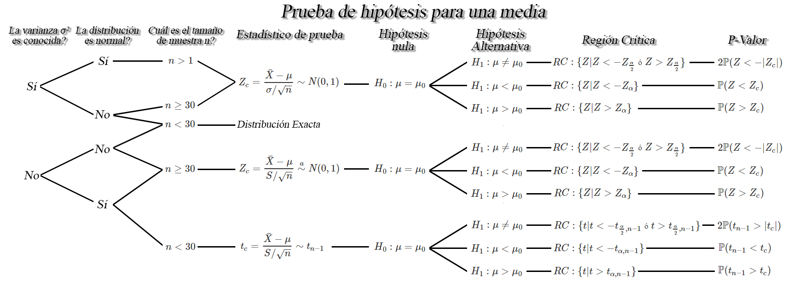
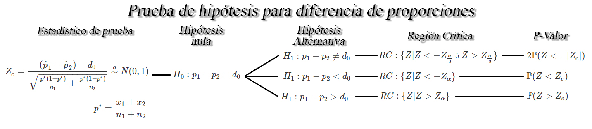
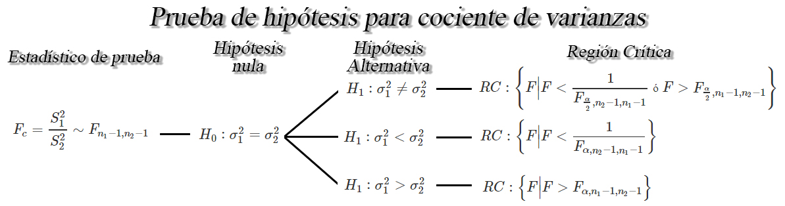

```{r knitr_init, echo=FALSE, cache=FALSE}
library(knitr)
## Global options
opts_chunk$set(echo=TRUE,
               cache=TRUE,
               prompt=FALSE,
               tidy=TRUE,
               comment=NA,
               message=FALSE,
               warning=FALSE,
               fig.path = paste0("../../ProbabilidadeInferencia/images/", "Clase17"),
               cache.path = "../../ProbabilidadeInferencia/cache/",
               cache = FALSE)

```

## Prueba de hipótesis para la media `$\mu$`
Sea `$X_1, X_2, \ldots, X_n$` una muestra aleatoria *iid* de tamaño `$n$` con media desconocida `$\mathbb{E}(X)=\mu$`, y varianza `$Var(X)=\sigma^2<\infty$`, entonces dependiendo de las condiciones, se tendrán los siguientes pruebas de hipótesis para la media `$\mu$`.



## Prueba de hipótesis para diferencia de medias `$\mu_1 - \mu_2$`
Sea `$X_{1,1}, X_{1,2}, \ldots, X_{1,n_1}$` y `$X_{2,1}, X_{2,2}, \ldots, X_{2,n_1}$` dos muestras aleatorias *iid* de tamaños `$n_1$`, y `$n_2$` con medias desconocidas `$\mathbb{E}(X_{1})=\mu_1$` y `$\mathbb{E}(X_{2})=\mu_2$`, y varianzas `$Var(X_{1})=\sigma_1^2<\infty$` y `$Var(X_{2})=\sigma^2_2<\infty$`, respectivamente, entonces dependiendo de las condiciones, se tendrán los siguientes pruebas de hipótesis para la diferencia de medias `$\mu_1 - \mu_2$`.


## Prueba de hipótesis para una proporción `$p$` 
Sea `$X_1,X_2, \ldots, X_n$` una muestra aleatoria *iid* de tamaño `$n$`, tal que `$X\sim b(n,p)$` entonces si `$n$` es suficientemente grande tal que `$n\geq30$`, y la proporción desconocida `$p$` no se encuentre cercana a `$0$` o `$1$`, tal que `$np>5$` y `$n(1-p)>5$`, entonces un una prueba de hipótesis para la proporción verdadera `$p$` será de la forma


## Prueba de hipótesis para diferencia de proporciones `$p_1 - p_2$` 
Sean `$X_{1,1}, X_{1,2}, \ldots, X_{1,n_1}$` y `$X_{2,1}, X_{2,2}, \ldots, X_{2,n_1}$` dos muestras aleatorias *iid* de tamaño `$n_1$` y `$n_2$`, tal que `$X_{i}\sim b(n_i,p_i)$`, para `$i=1,2$`, entonces si `$n_1$` y `$n_2$` son suficientemente grandes tal que `$n_1, n_2\geq30$`, y si las proporciones desconocidas `$p_1$` y `$p_2$` no se encuentran cercanas a `$0$` o `$1$`, tal que `$n_ip_i>5$` y `$n_i(1-p_i)>5$`, para `$i=1,2$`, entonces un una prueba de hipótesis para la diferencia de las proporciones `$p_1-p_2$` será de la forma



## Prueba de hipótesis para cociente de varianzas `$\sigma^2_1/\sigma^2_2$`
Sea `$X_{1,1}, X_{1,2}, \ldots, X_{1,n_1}$` y `$X_{2,1}, X_{2,2}, \ldots, X_{2,n_1}$` dos muestras aleatorias normales de tamaños `$n_1$`, y `$n_2$` con medias `$\mathbb{E}(X_{1})=\mu_1$` y `$\mathbb{E}(X_{2})=\mu_2$`, y varianzas desconocidas `$Var(X_{1})=\sigma_1^2<\infty$` y `$Var(X_{2})=\sigma^2_2<\infty$`, respectivamente, entonces un contraste de hipótesis para el cociente de varianzas `$\sigma^2_1/\sigma^2_2$`, a un nivel de significancia `$\alpha$` será de la forma



## Prueba de bondad de ajuste
Es un contraste de hipótesis para determinar el grado o nivel de ajuste de nuestros datos a una distribución teórica. 
Estas pruebas se basan en la comparación de las frecuencias de ocurrencia observadas en una muestra empírica y las frecuencias esperadas de una distribución teórica. En donde, el objetivo será si existe o no discrepancia entre los valores observados y los valores esperados de la distribución de interés.

La hipótesis a probar de interés estará dada por
`\begin{align*}
H_0: X \sim F_0(x) \quad \text{vs} \quad H_1: X \nsim F_0(x)
\end{align*}`

Siendo `$F_0(x)$` la distribución de probabilidad hipótetica que se quiere probar.

Entre las pruebas de bondad de ajuste más usadas se tiene:
* Prueba Kolmogorov–Smirnov 
* Prueba Cramér–von Mises
* Prueba Anderson–Darling
* Prueba Chi-Cuadrado
* Prueba Kuiper

Además, en el caso de probas específicas para detectar normalidad se tiene
* Prueba Shapiro-Wilk
* Prueba Lilliefors
* Prueba Shapiro-Francia