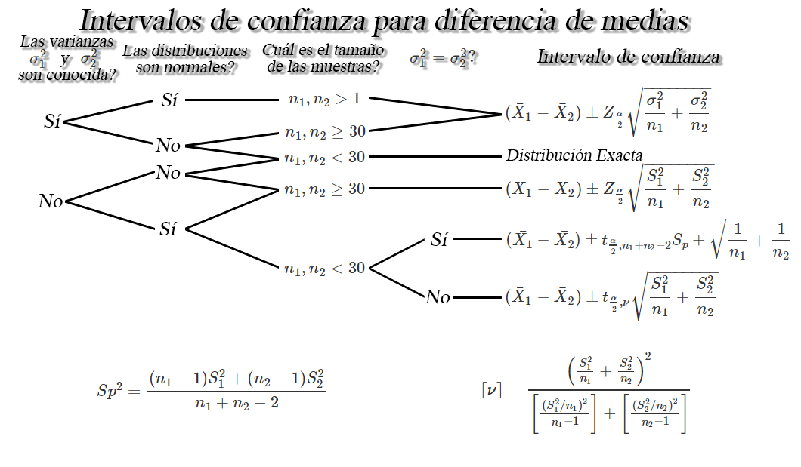
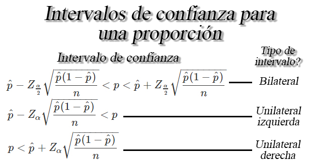
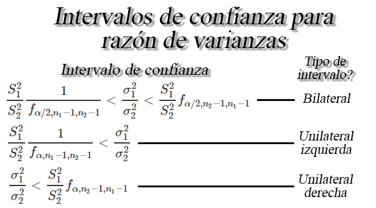

```{r knitr_init, echo=FALSE, cache=FALSE}
library(knitr)
## Global options
opts_chunk$set(echo=TRUE,
               cache=TRUE,
               prompt=FALSE,
               tidy=TRUE,
               comment=NA,
               message=FALSE,
               warning=FALSE,
               fig.path = paste0("../../ProbabilidadeInferencia/images/", "Clase15"),
               cache.path = "../../ProbabilidadeInferencia/cache/",
               cache = FALSE)

```

## Estimación por intervalos
## Intervalos de confianza para diferencia de medias `$\mu_1 - \mu_2$`
Sea `$X_{1,1}, X_{1,2}, \ldots, X_{1,n_1}$` y `$X_{2,1}, X_{2,2}, \ldots, X_{2,n_1}$` dos muestras aleatorias *iid* de tamaños `$n_1$`, y `$n_2$` con medias desconocidas `$\mathbb{E}(X_{1})=\mu_1$` y `$\mathbb{E}(X_{2})=\mu_2$`, y varianzas `$Var(X_{1})=\sigma_1^2<\infty$` y `$Var(X_{2})=\sigma^2_2<\infty$`, respectivamente, entonces dependiendo de las condiciones, se tendrán los siguientes intervalos de confianza para la diferencia de medias `$\mu_1 - \mu_2$`.




## Intervalos de confianza para una proporción `$p$` 
Sea `$X_1,X_2, \ldots, X_n$` una muestra aleatoria *iid* de tamaño `$n$`, tal que `$X\sim b(n,p)$` entonces si `$n$` es suficientemente grande tal que `$n\geq30$`, y la proporción desconocida `$p$` no se encuentre cercana a `$0$` o `$1$`, tal que `$np>5$` y `$n(1-p)>5$`, entonces un intervalo de confianza para la proporción `$p$` es de la forma


## Intervalos de confianza para razón de varianzas `$\sigma^2_1/\sigma^2_2$`
Sea `$X_{1,1}, X_{1,2}, \ldots, X_{1,n_1}$` y `$X_{2,1}, X_{2,2}, \ldots, X_{2,n_1}$` dos muestras aleatorias normales de tamaños `$n_1$`, y `$n_2$` con medias `$\mathbb{E}(X_{1})=\mu_1$` y `$\mathbb{E}(X_{2})=\mu_2$`, y varianzas desconocidas `$Var(X_{1})=\sigma_1^2<\infty$` y `$Var(X_{2})=\sigma^2_2<\infty$`, respectivamente, entonces un intervalo de confianza del `$100(1-\alpha)\%$` para `$\sigma^2_1/\sigma^2_2$` estará dada por

