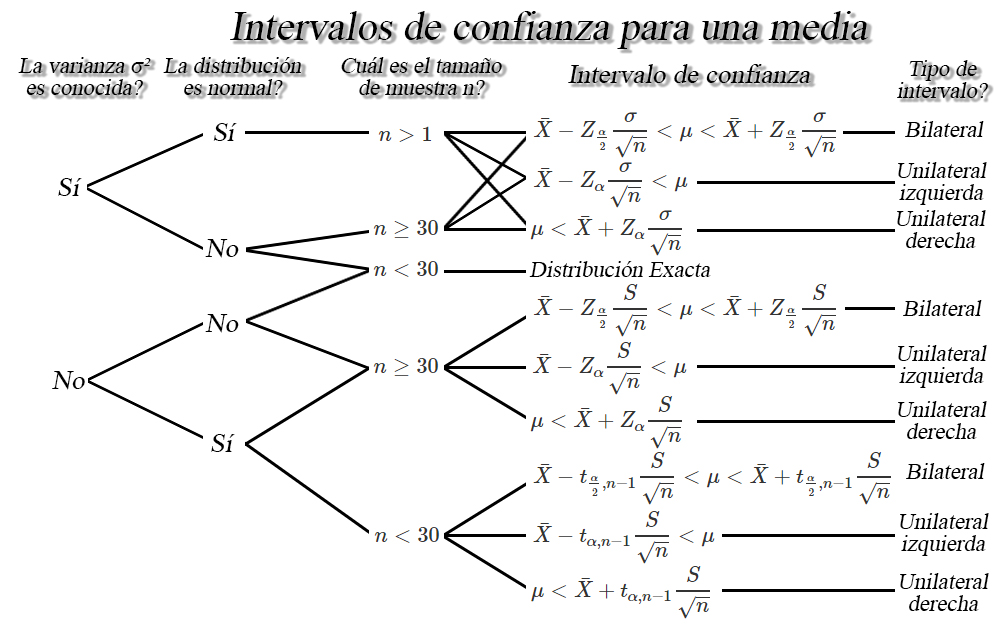

```{r knitr_init, echo=FALSE, cache=FALSE}
library(knitr)
## Global options
opts_chunk$set(echo=TRUE,
               cache=TRUE,
               prompt=FALSE,
               tidy=TRUE,
               comment=NA,
               message=FALSE,
               warning=FALSE,
               fig.path = paste0("../../ProbabilidadeInferencia/images/", "Clase14"),
               cache.path = "../../ProbabilidadeInferencia/cache/",
               cache = FALSE)

```

### Distribución de una combinación lineal
Sean `$X_1$` y `$X_2$` dos variables aleatorias normalmente distribuidas con media `$\mu$` y varianza `$\sigma^2$`. Y si `$Y$` es una combinación lineal de `$X_1$` y `$X_2$`, tal que
`\begin{align*}
Y = X_1 + X_2
\end{align*}`
entonces, la media de `$Y$` estará dada por
`\begin{align*}
\mathbb{E}(Y) = \mu_1 + \mu_2
\end{align*}`

y la varianza de `$Y$` estará dada por
`\begin{align*}
Var(Y) = \sigma_{x_1}^2 + \sigma_{x_2}^2 + 2 \sigma_{x_1x_2}
\end{align*}`

o en caso de que `$X_1$` y `$X_2$` sean variables aleatorias independientes, entonces se tendrá que la varianza de `$Y$` estará dada por
`\begin{align*}
Var(Y) = \sigma_{x_1}^2 + \sigma_{x_2}^2
\end{align*}`

### Distribuciones muestrales para diferencia de medias
Sea `$X_{11}, X_{12}, \ldots, X_{1n_1}$` y `$X_{21}, X_{22}, \ldots, X_{2n_1}$` dos muestras aleatorias *iid* con medias `$\mathbb{E}(X_{1i})=\mu_1$` y `$\mathbb{E}(X_{2j})=\mu_2$`, y varianzas `$Var(X_{1i})=\sigma_1^2<\infty$` y `$Var(X_{2j})=\sigma_2^2<\infty$`, para `$i=1,2,\ldots,n_1$` y `$j=1,2,\ldots,n_2$`, entonces dependiendo de la distribución de donde provengan las muestras aleatorias, los tamaños muestrales `$n_1$` y `$n_2$`, y de si se conocen o no las varianzas `$\sigma^2_1$` y `$\sigma^2_2$`, se tendra un estadístico diferente.

#### Población normal, con varianzas conocidas y `$n_1,n_2>0$`
`\begin{align*}
Z_c=\frac{(\bar{X}_1 - \bar{X}_2) - (\mu_1 - \mu_2)}{\sqrt{\frac{\sigma^2_1}{n_1} + \frac{\sigma^2_2}{n_2}}} \sim N(0,1)
\end{align*}`

#### Población normal, con varianzas desconocidas y `$n_1,n_2\geq30$`
`\begin{align*}
Z_c=\frac{(\bar{X}_1 - \bar{X}_2) - (\mu_1 - \mu_2)}{\sqrt{\frac{S^2_1}{n_1} + \frac{S^2_2}{n_2}}} \stackrel{a}{\sim} N(0,1)
\end{align*}`

#### Población normal, con varianzas desconocidas, tal que `$\sigma_1^2=\sigma_2^2$` y `$n_1,n_2<30$`
`\begin{align*}
t_c=\frac{(\bar{X}_1 - \bar{X}_2) - (\mu_1 - \mu_2)}{S_p\sqrt{\frac{1}{n_1} + \frac{1}{n_2}}} \sim t_{n_1+n_2-2}
\end{align*}`
donde
`\begin{align*}
S_p^2 = \frac{(n_1-1)S^2_1+(n_2-1)S^2_2}{n_1+n_2-2}
\end{align*}`

#### Población normal, con varianzas desconocidas, tal que `$\sigma_1^2\neq\sigma_2^2$` y `$n_1,n_2<30$`
`\begin{align*}
t_c=\frac{(\bar{X}_1 - \bar{X}_2) - (\mu_1 - \mu_2)}{\sqrt{\frac{S^2_1}{n_1} + \frac{S^2_2}{n_2}}} \sim t_\nu
\end{align*}`
donde
`\begin{align*}
\lceil\nu\rceil = \frac{\left(\frac{S_1^2}{n_1} + \frac{S_2^2}{n_2}\right)^2}{\left[\frac{(S_1^2/n_1)^2}{n_1-1}\right] + \left[\frac{(S_2^2/n_2)^2}{n_2-1}\right]}
\end{align*}`

#### Población no normal, con varianzas desconocidas y `$n_1,n_2\geq30$`
`\begin{align*}
Z_c=\frac{(\bar{X}_1 - \bar{X}_2) - (\mu_1 - \mu_2)}{\sqrt{\frac{S^2_1}{n_1} + \frac{S^2_2}{n_2}}} \stackrel{a}{\sim} N(0,1)
\end{align*}`


## Estimación puntual
Como su nombre lo indica, es un único valor que se calcula a partir de una muestra, con el fin de realizar una aproximación al verdadero valor desconocido del parámetro de interés. El problema es que en muchas situaciones prácticas, es posible encontrar varias estimaciones puntuales para el mismo parámetro poblacional de interés, y por tanto, se hace necesario emplear aquellos estadísticos que estimen los parámetros, de tal forma que cumplan las condiciones de insesgadez, eficiencia, consistencia y suficiencia.

## Estimación por intervalos
Podría ser que ni el estimador que cumpla las propiedades de insesgadez, eficiencia, consistencia y suficiencia, estimen con exactitud el parámetro poblacional de interés- Por esta razón, puede ser preferible determinar un intervalo dentro del cual, se espera encontrar el valor verdadero del parámetro poblacional.

### Definición
Sea `$\theta$` un parámetro poblacional desconocido, entonces basándose en la información de una muestra aleatoria de dicha población, el objetivo será encontrar dos variables aleatorias `$\hat{\Theta}_I$` y `$\hat{\Theta}_S$` tal que
`\begin{align*}
\mathbb{P}(\hat{\Theta}_I<\Theta<\hat{\Theta}_S) = 1-\alpha \quad \quad 0<\alpha<1
\end{align*}`
donde `$(1-\alpha)$` se conoce como nivel de confianza y `$\hat{\Theta}_I$` y `$\hat{\Theta}_S$` se denominan como límites de confianza inferior y superior, tal que `$\hat{\Theta}_I<\hat{\Theta}_S$`.

### Nota
<ol type = "a">
<li>Usualmente se usan valores de \alpha de $0.1, 0.05$ y $ 0.01$, es decir, niveles de confianza de $0.9, 0.95$ y $0.99$.</li>
<li>La longitud o amplitud del intervalo construido, medirá la <strong>precisión</strong> de la estimación realizada, por tanto, intervalos largos proporcionan estimaciones más imprecisas, mientras que intervalos cortos proporcionan estimaciones más precisas.</li>
<li>A medida que aumenta el nivel de confianza, la amplitud del intervalo se hace más grande.</li>
<li>A medida que aumenta el tamaño de muestra, la amplitud del intervalo se hace más pequeño.</li>
</ol>

## Interpretación de nivel de confianza
El nivel de confianza, `$1-\alpha$`, mide la fiabilidad del intervalo de probabilidad, esto es, la probabilidad de que el verdadero valor del parámetro se encuentre dentro del intervalo construido. Es decir, que si se realiza el experimento muchas veces, se tendrá que en el `$100(1-\alpha)\%$` de los intervalos de confianza construidos en cada experimento, se encontrará contenido el verdadero valor del parámetro de interés.

## Intervalos de confianza para una media `$\mu$`
Sea `$X_1, X_2, \ldots, X_n$` una muestra aleatoria *iid* de tamaño `$n$` con media desconocida `$\mathbb{E}(X)=\mu$`, y varianza `$Var(X)=\sigma^2<\infty$`, entonces dependiendo de las condiciones, se tendrán los siguientes intervalos de confianza para la media `$\mu$`.


