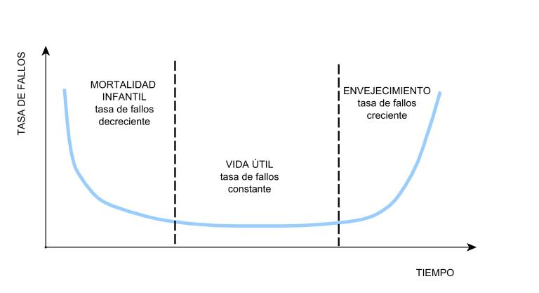

```{r knitr_init, echo=FALSE, cache=FALSE}
library(knitr)
## Global options
opts_chunk$set(echo=TRUE,
               cache=TRUE,
               prompt=FALSE,
               tidy=TRUE,
               comment=NA,
               message=FALSE,
               warning=FALSE,
               fig.path = paste0("../../ProbabilidadeInferencia/images/", "Clase09"),
               cache.path = "../../ProbabilidadeInferencia/cache/",
               cache = FALSE)

```

## Distribuciones de probabilidad continua
## Distribución Exponencial
Se dice que la variable aleatoria `$X$` tiene una distribución Exponencial con parámetro `$\beta$`, si su función de densidad de probabilidad es de la forma
`\begin{align*} 
f(x) = \begin{cases} \frac{1}{\beta}e^{-\frac{x}{\beta}} & x\geq 0, \beta>0 \\ 0 & \text{en otro caso} \end{cases}
\end{align*}`

#### Teorema
Si `$X\sim Exp(\beta)$`, entonces se puede probar que la media y la varianza de la variable aleatoria `$X$` están dadas por 
`\begin{align*}
\mathbb{E}(X)=\beta \quad \quad Var(X)=\beta^2
\end{align*}`

#### Teorema
Si `$X\sim Exp(\beta)$`, entonces se puede probar que la función de distribución acumulada de `$X$` está dada por
`\begin{align*} 
F(x) = \mathbb{P}(X\leq x) = \begin{cases} 0 & x<0 \\ 1- e^{-\frac{x}{\beta}} & x\geq 0, \beta>0  \end{cases}
\end{align*}`

## Relación entre la distribución Exponencial y el proceso Poisson
Suponga que el número de eventos que ocurren en un intervalo de tiempo `$t$`, tiene una distribución Poisson con parámetro `$\lambda$` y que el número ocurrencias en intervalos de tiempo distintos son independientes entre si. Entonces se tendrá que la distribución del tiempo transcurrido entre dos eventos de Poisson suesivos es Exponencial con parámetro `$\beta = \frac{t}{\lambda}$`.

## Propiedad de carencia de memoria
Suponga que `$X$` es una variable aleatoria tal que `$X\sim Exp(\beta)$`, entonces sean dos reales positivos `$a$` y `$b$`, entonces se puede probar que

1. `$\mathbb{P}(X\geq a+b | x \geq b) = \mathbb{P}(X\geq a)$` 
2. `$\mathbb{P}(X\leq a+b | x \geq b) = \mathbb{P}(X\leq a)$`

## Distribución Weibull
Se dice que la variable aleatoria `$X$` tiene una distribución Weibull con parámetros `$\alpha$` y `$\beta$`, si su función de densidad de probabilidad es de la forma
`\begin{align*} 
f(x) = \begin{cases} \frac{\alpha}{\beta}\left(\frac{x}{\beta}\right)^{\alpha - 1}e^{-\left(\frac{x}{\beta}\right)^\alpha} & x\geq 0, \alpha>0, \beta>0 \\ 0 & \text{en otro caso} \end{cases}
\end{align*}`

donde, `$\alpha$` se conoce como el parámetro de forma y `$\beta$` como el parámetro de escala. Además, si `$\alpha=1$` se tendrá que la distribución Weibull será igual a la distribución Exponencial.

#### Teorema
Si `$X\sim Wei(\alpha, \beta)$`, entonces se puede probar que la media y la varianza de la variable aleatoria `$X$` están dadas por 
`\begin{align*}
\mathbb{E}(X)=\beta\;\Gamma\left(1 + \frac{1}{\alpha}\right) \quad \quad Var(X)=\beta^2\left[\Gamma\left(1 + \frac{2}{\alpha}\right) - \Gamma\left(1 + \frac{1}{\alpha}\right)^2\right]
\end{align*}`

#### Teorema
Si `$X\sim Wei(\alpha, \beta)$`, entonces se puede probar que la función de distribución acumulada de `$X$` está dada por
`\begin{align*} 
F(x) = \mathbb{P}(X\leq x) = \begin{cases} 0 & x<0 \\ 1- e^{-\left(\frac{x}{\beta}\right)^\alpha} & x\geq 0 \end{cases}
\end{align*}`

## Función de confiabilidad (función de supervivencia)
Es una función decreciente que mide la probabilidad de que un componente funcione adecuadamente por al menos un tiempo `$t$`. Esta se representa como
`\begin{align*} 
R(t) = \mathbb{P}(T > t) = \int_t^\infty f(x) dx = 1- F(t)
\end{align*}`
donde `$F(t)$` es la función de distribución acumulada de la variable aleatoria `$T$`.

#### Teorema
Si `$X\sim Exp(\beta)$`, entonces se puede probar que la función de confiabilidad de la variable aleatoria `$X$` está dada por
`\begin{align*} 
R(t) = e^{-\frac{1}{\beta}} \quad \quad t>0
\end{align*}`

#### Teorema
Si `$X\sim Wei(\alpha, \beta)$`, entonces se puede probar que la función de confiabilidad de la variable aleatoria `$X$` está dada por
`\begin{align*} 
R(t) = e^{-\left(\frac{1}{\beta}\right)^\alpha} \quad \quad t>0
\end{align*}`

## Tasa de fallas (tasa de riesgo)
Representa la probabilidad de falla instantanea, dado que el componente funciona en el momento `$t$`, y se representa como
`\begin{align*} 
h(t) & = \lim_{\Delta t\to0}\frac{\mathbb{P}(t<T<t+\Delta t|T>t)}{\Delta t} \\
     & = \lim_{\Delta t\to0}\frac{1}{\Delta t}\frac{F(t+\Delta t) - F(t)}{R(t)} \\
     & = \frac{F^´(t)}{R(t)} \\
     & = \frac{f(t)}{1 - F(t)}
\end{align*}`

Y mide la tasa de cambio con el tiempo (Desgaste o Fortalecimiento) de la probabilidad de que el componente dure un `$\Delta t$` adicional, dado que ha durado `$t$`.



#### Teorema
Si `$X\sim Exp(\beta)$`, entonces se puede probar que la tasa de fallas de la variable aleatoria `$X$` está dada por
`\begin{align*} 
h(t) = \frac{1}{\beta} \quad \quad t>0
\end{align*}`

#### Teorema
Si `$X\sim Wei(\alpha, \beta)$`, entonces se puede probar que la tasa de fallas de la variable aleatoria `$X$` está dada por
`\begin{align*} 
h(t) = \frac{\alpha}{\beta}\left(\frac{t}{\beta}\right)^{\alpha-1} \quad \quad t>0
\end{align*}`
<ol type = "a">
<li> Si $\alpha<1$, $h(t)$ será una función decreciente del tiempo $t$, qe indica que el componente se fortalece o endurece con el paso del tiempo. Por ejemplo, se suele realizar un quemado a los componentes por un tiempo para eliminar ete tipo de fallas para los usuarios.</li>
<li> Si $\alpha=1$, $h(t)$ será una función constante que indica que las fallas son inesperadas, causadas por factores externos que pueden generar fallas incluso en los componentes mejor contruidos. Por ejemplo, sobre cargas, mal uso, casos especiales de falta de memoria.</li>
<li> Si $\alpha>1$, $h(t)$ será una función creciente del tiempo $t$, que indica que el componente se desgasta con el paso del tiempo. Por ejemplo, obsolescencia, fin de vida útil, edad. </li>
</ol>