```{r knitr_init, echo=FALSE, cache=FALSE}
library(knitr)
## Global options
opts_chunk$set(echo=TRUE,
               cache=TRUE,
               prompt=FALSE,
               tidy=TRUE,
               comment=NA,
               message=FALSE,
               warning=FALSE,
               fig.path = paste0("../../ProbabilidadeInferencia/images/", "Clase05"),
               cache.path = "../../ProbabilidadeInferencia/cache/",
               cache = FALSE)

```


## Datos y su estructura
Para ilustrar como realizar los diferentes métodos de resúmenes numéricos, tabulares y gráficos, se empleará la siguiente base de datos de [EjemploDescriptiva](https://github.com/jouninLRMD/jouninlrmd.github.io/raw/master/Dataset/EjemploDescriptiva.xlsx){:target="_blank"}, la cual contiene las siguientes variables

* **<tt>Municipio:</tt>** Municipio de residencia de la persona.
* **<tt>Estrato:</tt>** Estrato socioeconómico de la vivienda.
* **<tt>Edad:</tt>** Edad de la persona en años.
* **<tt>Altura:</tt>** Altura de la persona en metros.
* **<tt>Peso:</tt>** Peso de la persona en kilogramos.
* **<tt>Salario:</tt>** Salario devengado por la persona en pesos.
* **<tt>SatisTrabajo:</tt>** Nivel de satisfacción con el trabajo actual.
* **<tt>DeporFavorito:</tt>** Deporte favorito de la persona.

Los datos contenidos en la base de datos se presentan a continuación:

<pre style="font-family: 'Open Sans',sans-serif; margin-bottom: -3rem; margin-top: -3rem;"><table class="table table-striped" style="width: auto !important; margin-left: auto; margin-right: auto;"><thead><tr><th style="text-align:left;">Municipio</th><th style="text-align:right;">Estrato</th><th style="text-align:right;">Edad</th><th style="text-align:right;">Altura</th><th style="text-align:right;">Peso</th><th style="text-align:right;">Salario</th><th style="text-align:left;">SatisTrabajo</th><th style="text-align:left;">DeporFavorito</th></tr></thead><tbody><tr><td style="text-align:left;">Caldas</td><td style="text-align:right;">5</td><td style="text-align:right;">17</td><td style="text-align:right;">1.77</td><td style="text-align:right;">66</td><td style="text-align:right;">1635100</td><td style="text-align:left;">Muy satisfecho</td><td style="text-align:left;">Fútbol</td></tr><tr><td style="text-align:left;">Bello</td><td style="text-align:right;">4</td><td style="text-align:right;">27</td><td style="text-align:right;">1.65</td><td style="text-align:right;">90</td><td style="text-align:right;">1752500</td><td style="text-align:left;">Insatisfecho</td><td style="text-align:left;">Fútbol</td></tr><tr><td style="text-align:left;">Medellín</td><td style="text-align:right;">1</td><td style="text-align:right;">18</td><td style="text-align:right;">1.57</td><td style="text-align:right;">66</td><td style="text-align:right;">1858400</td><td style="text-align:left;">Satisfecho</td><td style="text-align:left;">Baloncesto</td></tr><tr><td style="text-align:left;">Caldas</td><td style="text-align:right;">4</td><td style="text-align:right;">22</td><td style="text-align:right;">1.84</td><td style="text-align:right;">87</td><td style="text-align:right;">2131400</td><td style="text-align:left;">Muy satisfecho</td><td style="text-align:left;">Fútbol</td></tr><tr><td style="text-align:left;">La Estrella</td><td style="text-align:right;">3</td><td style="text-align:right;">20</td><td style="text-align:right;">1.86</td><td style="text-align:right;">89</td><td style="text-align:right;">1874800</td><td style="text-align:left;">Satisfecho</td><td style="text-align:left;">Tenis</td></tr><tr><td style="text-align:left;">Caldas</td><td style="text-align:right;">3</td><td style="text-align:right;">22</td><td style="text-align:right;">1.74</td><td style="text-align:right;">90</td><td style="text-align:right;">2933100</td><td style="text-align:left;">Muy satisfecho</td><td style="text-align:left;">Fútbol</td></tr><tr><td style="text-align:left;">Itagüí</td><td style="text-align:right;">1</td><td style="text-align:right;">20</td><td style="text-align:right;">1.91</td><td style="text-align:right;">79</td><td style="text-align:right;">1637200</td><td style="text-align:left;">Muy insatisfecho</td><td style="text-align:left;">Fútbol</td></tr><tr><td style="text-align:left;">La Estrella</td><td style="text-align:right;">3</td><td style="text-align:right;">27</td><td style="text-align:right;">1.77</td><td style="text-align:right;">88</td><td style="text-align:right;">1171200</td><td style="text-align:left;">Indiferente</td><td style="text-align:left;">Baloncesto</td></tr><tr><td style="text-align:left;">Itagüí</td><td style="text-align:right;">2</td><td style="text-align:right;">20</td><td style="text-align:right;">1.58</td><td style="text-align:right;">61</td><td style="text-align:right;">2574700</td><td style="text-align:left;">Muy satisfecho</td><td style="text-align:left;">Baloncesto</td></tr><tr><td style="text-align:left;">Bello</td><td style="text-align:right;">4</td><td style="text-align:right;">39</td><td style="text-align:right;">1.81</td><td style="text-align:right;">70</td><td style="text-align:right;">2739000</td><td style="text-align:left;">Satisfecho</td><td style="text-align:left;">Tenis</td></tr><tr><td style="text-align:left;">La Estrella</td><td style="text-align:right;">6</td><td style="text-align:right;">16</td><td style="text-align:right;">1.69</td><td style="text-align:right;">78</td><td style="text-align:right;">2887800</td><td style="text-align:left;">Indiferente</td><td style="text-align:left;">Baloncesto</td></tr><tr><td style="text-align:left;">Bello</td><td style="text-align:right;">2</td><td style="text-align:right;">40</td><td style="text-align:right;">1.93</td><td style="text-align:right;">83</td><td style="text-align:right;">2559600</td><td style="text-align:left;">Muy satisfecho</td><td style="text-align:left;">Fútbol</td></tr><tr><td style="text-align:left;">Medellín</td><td style="text-align:right;">2</td><td style="text-align:right;">26</td><td style="text-align:right;">1.93</td><td style="text-align:right;">91</td><td style="text-align:right;">1906600</td><td style="text-align:left;">Satisfecho</td><td style="text-align:left;">Fútbol</td></tr><tr><td style="text-align:left;">Medellín</td><td style="text-align:right;">2</td><td style="text-align:right;">21</td><td style="text-align:right;">1.87</td><td style="text-align:right;">61</td><td style="text-align:right;">1299700</td><td style="text-align:left;">Satisfecho
</td><td style="text-align:left;">Baloncesto</td></tr><tr><td style="text-align:left;">Bello</td><td style="text-align:right;">4</td><td style="text-align:right;">23</td><td style="text-align:right;">1.60</td><td style="text-align:right;">84</td><td style="text-align:right;">1950900</td><td style="text-align:left;">Indiferente</td><td style="text-align:left;">Fútbol</td></tr><tr><td style="text-align:left;">Itagüí</td><td style="text-align:right;">3</td><td style="text-align:right;">40</td><td style="text-align:right;">1.91</td><td style="text-align:right;">76</td><td style="text-align:right;">2131900</td><td style="text-align:left;">Satisfecho</td><td style="text-align:left;">Fútbol</td></tr><tr><td style="text-align:left;">La Estrella</td><td style="text-align:right;">6</td><td style="text-align:right;">31</td><td style="text-align:right;">1.79</td><td style="text-align:right;">66</td><td style="text-align:right;">1085400</td><td style="text-align:left;">Indiferente</td><td style="text-align:left;">Voleibol</td></tr><tr><td style="text-align:left;">La Estrella</td><td style="text-align:right;">3</td><td style="text-align:right;">40</td><td style="text-align:right;">1.60</td><td style="text-align:right;">67</td><td style="text-align:right;">1182200</td><td style="text-align:left;">Indiferente</td><td style="text-align:left;">Tenis</td></tr><tr><td style="text-align:left;">Medellín</td><td style="text-align:right;">2</td><td style="text-align:right;">32</td><td style="text-align:right;">1.60</td><td style="text-align:right;">88</td><td style="text-align:right;">2541900</td><td style="text-align:left;">Indiferente</td><td style="text-align:left;">Baloncesto</td></tr><tr><td style="text-align:left;">Caldas</td><td style="text-align:right;">3</td><td style="text-align:right;">33</td><td style="text-align:right;">1.81</td><td style="text-align:right;">65</td><td style="text-align:right;">1333200</td><td style="text-align:left;">Muy satisfecho</td><td style="text-align:left;">Fútbol</td></tr></tbody></table></pre>

### Cargar datos
Para realiza la carga de los datos en <tt>R</tt>, es posible emplear diferentes funciones, dependiendo si el archivo a cargar se encuentra en formato <tt>.txt</tt>, <tt>.csv</tt>, <tt>.xls</tt>, <tt>.xlsx</tt> entre otros.

Para realizar la lectura de archivos en **formato <tt>.txt</tt>**, puede emplearse la función <tt>read.table()</tt> de la librería <tt>utils</tt> de la base del <tt>R</tt>.

Para realizar lectura de archivos en **formato <tt>.cvs</tt>**, con coma (,) como separador de valores y punto (.) como separador decimal, puede emplearse la función
<tt>read.cvs()</tt> de la librería de la librería <tt>utils</tt> de la base del <tt>R</tt>, mientras que, si la punto (.) es el separador de valores y la coma (,) el separador decimal, puede emplearse la función <tt>read.cvs2()</tt> de la librería de la librería <tt>utils</tt> de la base del <tt>R</tt>.

Para realizar la lectura de archivos en **formato <tt>.xls</tt>**, puede emplearse la función <tt>read_xls()</tt> de la librería <tt>readxl</tt>, mientras que, para leer archivos en **formato <tt>.xlsx</tt>**, puede emplearse la función <tt>read_xlsx()</tt> de la librería <tt>readxl</tt>.

Dado que en conjunto de datos empleados en este ejercicio posee un formato <tt>.xlsx</tt>, se emplea la función <tt>read_xlsx()</tt> de la librería <tt>readxl</tt>. En donde se presenta dos métodos de carga. El primero, para realizar la carga desde un fichero local y la segunda, para realizar la carga de datos en linea, en donde se emplea adicionalmente la función <tt>tempfile()</tt> de base del <tt>R</tt> y la función <tt>download.file()</tt> de la librería <tt>utils</tt> de la base del <tt>R</tt>.

<button id="Show1" class="btn btn-secondary">Mostrar como cargar datos en <tt>R</tt></button>
<button id="Hide1" class="btn btn-info">Ocultar como cargar datos en <tt>R</tt></button>
<main id="botoncito1"> 

<h3 data-toc-skip> Carga de datos fichero local </h3> 
<section class="language-r highlighter-rouge"><section class="highlight"><pre class="highlight"><code><span class="c1">### Instalar y cargar librerías </span><span class="w">
</span><span class="c1"># install.packages(c('readxl'), dependencies = T) # Instala librería</span><span class="w">
</span><span class="kc">library</span><span class="p">(</span><span class="n">readxl</span><span class="p">)</span><span class="w">  </span><span class="c1"># Librería para lectura de archivos .xlsx</span><span class="w">

</span><span class="c1">### Carga archivo</span><span class="w">
</span><span class="n">datos</span><span class="w"> </span><span class="o">&lt;-</span><span class="w"> </span><span class="kc">read_xlsx</span><span class="p">(</span><span class="n">file.choose</span><span class="p">())</span><span class="w">  </span><span class="c1"># Carga base de datos desde fichero local</span><span class="w">
</span></code></pre></section></section>

```{r eval=FALSE, echo=FALSE}
### Instalar y cargar librerías
# install.packages(c("readxl"), dependencies = T) # Instala librería
library(readxl) # Librería para lectura de archivos .xlsx

### Carga archivo
datos <- read_xlsx(file.choose()) # Carga base de datos desde fichero local
```

<h3 data-toc-skip> Carga de datos en linea </h3> 
<section class="language-r highlighter-rouge"><section class="highlight"><pre class="highlight"><code><span class="c1">### Instalar y cargar librería </span><span class="w">
</span><span class="c1"># install.packages('readxl', dependencies = T) # Instala librería</span><span class="w">
</span><span class="kc">library</span><span class="p">(</span><span class="n">readxl</span><span class="p">)</span><span class="w">  </span><span class="c1"># Librería para lectura de archivos .xlsx</span><span class="w">

</span><span class="c1">### Crea archivo temporal para cargar archivo online</span><span class="w">
</span><span class="n">temp</span><span class="w"> </span><span class="o">&lt;-</span><span class="w"> </span><span class="kc">tempfile</span><span class="p">(</span><span class="n">fileext</span><span class="w"> </span><span class="o">=</span><span class="w"> </span><span class="s2">".xlsx"</span><span class="p">)</span><span class="w">
</span><span class="n">dataURL</span><span class="w"> </span><span class="o">&lt;-</span><span class="w"> </span><span class="s2">"https://github.com/jouninLRMD/jouninlrmd.github.io/raw/master/Dataset/EjemploDescriptiva.xlsx"</span><span class="w">
</span><span class="kc">download.file</span><span class="p">(</span><span class="n">dataURL</span><span class="p">,</span><span class="w"> </span><span class="n">destfile</span><span class="w"> </span><span class="o">=</span><span class="w"> </span><span class="n">temp</span><span class="p">,</span><span class="w"> </span><span class="n">mode</span><span class="w"> </span><span class="o">=</span><span class="w"> </span><span class="s2">"wb"</span><span class="p">)</span><span class="w">

</span><span class="c1">### Carga archivo</span><span class="w">
</span><span class="n">datos</span><span class="w"> </span><span class="o">&lt;-</span><span class="w"> </span><span class="kc">read_xlsx</span><span class="p">(</span><span class="n">temp</span><span class="p">)</span><span class="w">  </span><span class="c1"># Carga la base de datos online</span><span class="w">
</span></code></pre></section></section>

```{r echo=FALSE}
### Instalar y cargar librerías
# install.packages("readxl", dependencies = T) # Instala librería
library(readxl) # Librería para lectura de archivos .xlsx
library(RcmdrMisc) # Carga librería RcmdrMisc
library(psych) # Carga librería pysch

### Crea archivo temporal para cargar archivo online
temp <- tempfile(fileext = ".xlsx") 
dataURL <- "https://github.com/jouninLRMD/jouninlrmd.github.io/raw/master/Dataset/EjemploDescriptiva.xlsx"
download.file(dataURL, destfile=temp, mode='wb')

### Carga archivo
datos <- read_xlsx(temp) # Carga la base de datos online
```

</main>

### Estructura de datos
El tipo y clase de los datos juega un papel importante al momento de realizar análisis de los datos, debido a que **su adecuada especificación será la responsable de que el análisis aplicado a la variable sea el adecuado**.

Para observa las clases que poseen los datos, podemos emplear la función <tt>str()</tt>, de la librería <tt>utils</tt> de la base del <tt>R</tt>.

<button id="Show2" class="btn btn-secondary">Mostrar estructura datos en <tt>R</tt></button>
<button id="Hide2" class="btn btn-info">Ocultar estructura datos en <tt>R</tt></button>
<main id="botoncito2"> 
<h3 data-toc-skip> Estructura de los datos </h3> 

<section class="language-r highlighter-rouge"><section class="highlight"><pre class="highlight"><code><span class="c1"># Muestra la estructura de la base de datos</span><span class="w">
</span><span class="kc">str</span><span class="p">(</span><span class="n">datos</span><span class="p">)</span><span class="w">
</span></code></pre></section></section>

<section class="highlighter-rouge"><section class="highlight"><pre class="highlight"><code>Classes 'tbl_df', 'tbl' and 'data.frame':   20 obs. of  8 variables:
 $ Municipio    : chr  "Caldas" "Bello" "Medellín" "Caldas" ...
 $ Estrato      : num  5 4 1 4 3 3 1 3 2 4 ...
 $ Edad         : num  17 27 18 22 20 22 20 27 20 39 ...
 $ Altura       : num  1.77 1.65 1.57 1.84 1.86 1.74 1.91 1.77 1.58 1.81 ...
 $ Peso         : num  66 90 66 87 89 90 79 88 61 70 ...
 $ Salario      : num  1635100 1752500 1858400 2131400 1874800 ...
 $ SatisTrabajo : chr  "Muy satisfecho" "Insatisfecho" "Satisfecho" "Muy satisfecho" ...
 $ DeporFavorito: chr  "Fútbol" "Fútbol" "Baloncesto" "Fútbol" ...
</code></pre></section></section>

```{r echo=FALSE, eval=FALSE}
# Muestra la estructura de la base de datos
str(datos) 
```

</main>

El papel de una correcta estructura de datos, se debe a que podrían haber dentro de la base de datos, **variables numéricas tratadas como factores, factores tratadas como numéricas, variables ordinales tratadas como si fueran nominales, etc**. Lo cual haría que pueda aplicarse análisis a las variables de forma indebida, por ejemplo, realizar un análisis numérico a una variable que realmente es tipo factor, como es el estrato. 

**Para convertir una variable de un clase a otra**, existen una serie de funciones básicas en la base de <tt>R</tt> que permiten hacer dicho procedimiento, estas funciones son

* **<tt>as.numeric()</tt>:** Convierte una variable a tipo numérico (double).
* **<tt>as.logical()</tt>:** Convierte una variable a tipo lógico.
* **<tt>as.integer()</tt>:** Convierte una variable a tipo entero.
* **<tt>as.factor()</tt>:** Convierte una variable a tipo factor.
* **<tt>as.character()</tt>:** Convierte una variable a tipo carácter (character).
* **<tt>as.ordered()</tt>:** Convierte una variable a tipo factor asumiendo un orden o jerarquía entre los niveles.

<button id="Show3" class="btn btn-secondary">Mostrar corrección estructura de datos en <tt>R</tt></button>
<button id="Hide3" class="btn btn-info">Ocultar corrección estructura de datos en <tt>R</tt></button>
<main id="botoncito3"> 

<h3 data-toc-skip> Corrección de estructura de los datos </h3> 

<section class="language-r highlighter-rouge"><section class="highlight"><pre class="highlight"><code><span class="c1">## Transformar variables a factor</span><span class="w">
</span><span class="n">datos</span><span class="o">$</span><span class="n">Municipio</span><span class="w"> </span><span class="o">&lt;-</span><span class="w"> </span><span class="kc">as.factor</span><span class="p">(</span><span class="n">datos</span><span class="o">$</span><span class="n">Municipio</span><span class="p">)</span><span class="w">
</span><span class="n">datos</span><span class="o">$</span><span class="n">DeporFavorito</span><span class="w"> </span><span class="o">&lt;-</span><span class="w"> </span><span class="kc">as.factor</span><span class="p">(</span><span class="n">datos</span><span class="o">$</span><span class="n">DeporFavorito</span><span class="p">)</span><span class="w">

</span><span class="c1">## Trasforma variable a factor ordinal</span><span class="w">
</span><span class="n">datos</span><span class="o">$</span><span class="n">Estrato</span><span class="w"> </span><span class="o">&lt;-</span><span class="w"> </span><span class="kc">as.ordered</span><span class="p">(</span><span class="n">datos</span><span class="o">$</span><span class="n">Estrato</span><span class="p">)</span><span class="w">
</span><span class="n">datos</span><span class="o">$</span><span class="n">SatisTrabajo</span><span class="w"> </span><span class="o">&lt;-</span><span class="w"> </span><span class="kc">as.ordered</span><span class="p">(</span><span class="n">datos</span><span class="o">$</span><span class="n">SatisTrabajo</span><span class="p">)</span><span class="w">

</span><span class="c1"># En caso de que el orden automático no sea el adecuado</span><span class="w">
</span><span class="n">datos</span><span class="o">$</span><span class="n">SatisTrabajo</span><span class="w"> </span><span class="o">&lt;-</span><span class="w"> </span><span class="kc">ordered</span><span class="p">(</span><span class="n">datos</span><span class="o">$</span><span class="n">SatisTrabajo</span><span class="p">,</span><span class="w"> </span><span class="nf">c</span><span class="p">(</span><span class="s2">"Muy insatisfecho"</span><span class="p">,</span><span class="w"> 
    </span><span class="s2">"Insatisfecho"</span><span class="p">,</span><span class="w"></span><span class="s2">"Indiferente"</span><span class="p">,</span><span class="w"> </span><span class="s2">"Satisfecho"</span><span class="p">,</span><span class="w"> </span><span class="s2">"Muy satisfecho"</span><span class="p">))</span><span class="w">
</span><span class="c1"># Muestra la estructura de la base de datos</span><span class="w"> 
</span><span class="kc">str</span><span class="p">(</span><span class="n">datos</span><span class="p">)</span><span class="w">
</span></code></pre></section></section>

<section class="highlighter-rouge"><section class="highlight"><pre class="highlight"><code>Classes 'tbl_df', 'tbl' and 'data.frame':   20 obs. of  8 variables:
 $ Municipio    : Factor w/ 5 levels "Bello","Caldas",..: 2 1 5 2 4 2 3 4 3 1 ...
 $ Estrato      : Ord.factor w/ 6 levels "1"<"2"<"3"<"4"<..: 5 4 1 4 3 3 1 3 2 4 ...
 $ Edad         : num  17 27 18 22 20 22 20 27 20 39 ...
 $ Altura       : num  1.77 1.65 1.57 1.84 1.86 1.74 1.91 1.77 1.58 1.81 ...
 $ Peso         : num  66 90 66 87 89 90 79 88 61 70 ...
 $ Salario      : num  1635100 1752500 1858400 2131400 1874800 ...
 $ SatisTrabajo : Ord.factor w/ 5 levels "Muy insatisfecho"<..: 5 2 4 5 4 5 1 3 5 4 ...
 $ DeporFavorito: Factor w/ 4 levels "Baloncesto","Fútbol",..: 2 2 1 2 3 2 2 1 1 3 ...
</code></pre></section></section>

```{r echo=FALSE}
## Transformar variables a factor
datos$Municipio <- as.factor(datos$Municipio)
datos$DeporFavorito <- as.factor(datos$DeporFavorito)

## Trasforma variable a factor ordinal
datos$Estrato <- as.ordered(datos$Estrato)
datos$SatisTrabajo <- as.ordered(datos$SatisTrabajo)

# En caso de que el orden automático no sea el adecuado
datos$SatisTrabajo <- ordered(datos$SatisTrabajo, c("Muy insatisfecho", "Insatisfecho", "Indiferente", "Satisfecho", "Muy satisfecho"))
```

```{r echo=FALSE, eval = FALSE}
# Muestra nuevamente la estructura de la base de datos
str(datos)
```

</main>

## Resumen numéricos
Una parte importante de la estadística descriptiva, son las medidas estadísticas ya explicadas en la [Clase 01](../../ProbabilidadeInferencia/PeIEClase03.html){:target="_blank"} y [Clase 02](../../ProbabilidadeInferencia/PeIEClase04.html){:target="_blank"}, y aún más importante, es buscar la más adecuada para presentar dichas medidas.

Una alternativa para presentar la información contenida en las medidas estadísticas es mediante resúmenes numéricos, ya que éstos muestran de forma simple y ordenada de forma simultanea conjunto diferentes medidas numéricas, para facilitar su presentación, lectura e interpretación.

### Resumen numérico individual

Entre las diferentes funciones que permiten realizar resúmenes numéricos en <tt>R</tt>, se destaca la función <tt>numSummary()</tt> de la librería <tt>RcmdrMisc</tt> y la función <tt>describe()</tt> de la librería <tt>psych</tt>, que presentan diferentes medidas estadísticas para variables tipo numéricas. 

<button id="Show4" class="btn btn-secondary">Mostrar resumen numérico con <tt>RcmdrMisc</tt></button>
<button id="Hide4" class="btn btn-info">Ocultar resumen numérico con <tt>RcmdrMisc</tt></button>
<main id="botoncito4"> 

<h3 data-toc-skip> Resumen numérico con librería <tt>RcmdrMisc</tt> </h3> 

<section class="language-r highlighter-rouge"><section class="highlight"><pre class="highlight"><code><span class="c1">### Instalar y cargar librería </span><span class="w">
</span><span class="c1"># install.packages('RcmdrMisc') # Instala librería RcmdrMisc</span><span class="w">
</span><span class="kc">library</span><span class="p">(</span><span class="n">RcmdrMisc</span><span class="p">)</span><span class="w">  </span><span class="c1"># Carga librería RcmdrMisc</span><span class="w">

</span><span class="c1"># Forma básica numSummary</span><span class="w">
</span><span class="kc">numSummary</span><span class="p">(</span><span class="n">datos</span><span class="o">$</span><span class="n">Altura</span><span class="p">)</span><span class="w">
</span></code></pre></section></section>

<section class="highlighter-rouge"><section class="highlight"><pre class="highlight"><code>   mean        sd   IQR   0%    25%  50%    75% 100%  n
 1.7615 0.1256677 0.225 1.57 1.6375 1.78 1.8625 1.93 20
</code></pre></section></section>

<section class="language-r highlighter-rouge"><section class="highlight"><pre class="highlight"><code><span class="c1"># Forma avanzada numSummary</span><span class="w">
</span><span class="kc">numSummary</span><span class="p">(</span><span class="n">datos</span><span class="o">$</span><span class="n">Altura</span><span class="p">,</span><span class="w"> </span><span class="n">statistics</span><span class="w"> </span><span class="o">=</span><span class="w"> </span><span class="nf">c</span><span class="p">(</span><span class="s2">"mean"</span><span class="p">,</span><span class="w"> </span><span class="s2">"sd"</span><span class="p">,</span><span class="w"> </span><span class="s2">"se"</span><span class="p">,</span><span class="w"> </span><span class="s2">"IQR"</span><span class="p">,</span><span class="w"> </span><span class="s2">"quantiles"</span><span class="p">,</span><span class="w"> 
    </span><span class="s2">"cv"</span><span class="p">,</span><span class="w"> </span><span class="s2">"skewness"</span><span class="p">,</span><span class="w"> </span><span class="s2">"kurtosis"</span><span class="p">),</span><span class="w"> </span><span class="n">type</span><span class="w"> </span><span class="o">=</span><span class="w"> </span><span class="s2">"3"</span><span class="p">,</span><span class="w"> </span><span class="n">quantiles</span><span class="w"> </span><span class="o">=</span><span class="w"> </span><span class="nf">c</span><span class="p">(</span><span class="m">0</span><span class="p">,</span><span class="w"> </span><span class="m">0.25</span><span class="p">,</span><span class="w"> </span><span class="m">0.5</span><span class="p">,</span><span class="w"> </span><span class="m">0.75</span><span class="p">,</span><span class="w"> 
    </span><span class="m">1</span><span class="p">))</span><span class="w">
</span></code></pre></section></section>

<section class="highlighter-rouge"><section class="highlight"><pre class="highlight"><code>   mean        sd   se(mean)   IQR         cv   skewness kurtosis   0%
 1.7615 0.1256677 0.02810015 0.225 0.07134129 -0.2094466 -1.49256 1.57
    25%  50%    75% 100%  n
 1.6375 1.78 1.8625 1.93 20
</code></pre></section></section>

```{r echo = FALSE, eval = FALSE}
### Instalar y cargar librería
# install.packages("RcmdrMisc") # Instala librería RcmdrMisc
library(RcmdrMisc) # Carga librería RcmdrMisc

# Forma básica numSummary 
numSummary(datos$Altura) 
# Forma avanzada numSummary
numSummary(datos$Altura, statistics = c("mean", "sd", "se", "IQR", "quantiles", "cv", "skewness", "kurtosis"), type = "3", quantiles = c(0, .25, .5, .75, 1)) 
```

<h3 data-toc-skip> Interpretación </h3> 

<p> De la salida anterior, se aprecia que la altura promedio de las personas encuestadas en la base de datos es de $1.7615$ metros, con una desviación estándar de $0.1257$ metros. Adicionalmente de aprecia que el coeficiente de variación es del $7.1341\%$ lo cual, dada la variable evaluada, podría ser considerada como una baja variabilidad en la altura de todos los encuestados. <br> 
<br>
También se aprecia que la Altura mediana de los encuestados es de $1.78$ metros, lo cual indica que la altura de los encuestados se encuentran más reunida a la izquierda, pues se tiene que la mediana posee un valor más alto que la mediana. Dicho resultado puede ser corroborado al observar el coeficiente de asimetría, el cual presenta un resultado de $-0.2094$. <br> 
<br>
En cuanto al coeficiente de kurtosis, se aprecia que éste posee un valor de $-1.4926$, lo cual quiere decir que la distribución de la altura de los encuestados posee un comportamiento platicúrtico, esto es, una forma más plana y de colas más pronunciadas. <br>
<br>
Finalmente, se aprecia que la altura mínima obtenida en la encuesta es de $1.57$ metros, mientras la máxima es de $1.93$ metros. Dichos valores se encuentran dentro del rango normal de altura que puede tener una persona, así que no hay por qué preocuparse por qué estos sean valores atípicos.

</p>

</main>

<button id="Show5" class="btn btn-secondary">Mostrar resumen numérico con <tt>psych</tt></button>
<button id="Hide5" class="btn btn-info">Ocultar resumen numérico con <tt>psych</tt></button>
<main id="botoncito5"> 

<h3 data-toc-skip> Resumen numérico con librería <tt>psych</tt> </h3> 

<section class="language-r highlighter-rouge"><section class="highlight"><pre class="highlight"><code><span class="c1">### Instalar y cargar librería </span><span class="w">
</span><span class="c1"># install.packages('pysch') # Instala librería pysch</span><span class="w">
</span><span class="kc">library</span><span class="p">(</span><span class="n">psych</span><span class="p">)</span><span class="w">  </span><span class="c1"># Carga librería pysch</span><span class="w">

</span><span class="c1"># Forma básica pysch</span><span class="w">
</span><span class="kc">describe</span><span class="p">(</span><span class="n">datos</span><span class="o">$</span><span class="n">Altura</span><span class="p">)</span><span class="w">
</span></code></pre></section></section>

<section class="highlighter-rouge"><section class="highlight"><pre class="highlight"><code>   vars  n mean   sd median trimmed  mad  min  max range  skew kurtosis
X1    1 20 1.76 0.13   1.78    1.76 0.16 1.57 1.93  0.36 -0.21    -1.49
     se
X1 0.03
</code></pre></section></section>

<section class="language-r highlighter-rouge"><section class="highlight"><pre class="highlight"><code><span class="c1"># Forma avanzada psych</span><span class="w">
</span><span class="kc">describe</span><span class="p">(</span><span class="n">datos</span><span class="o">$</span><span class="n">Altura</span><span class="p">,</span><span class="w"> </span><span class="n">ranges</span><span class="w"> </span><span class="o">=</span><span class="w"> </span><span class="kc">TRUE</span><span class="p">,</span><span class="w"> </span><span class="n">trim</span><span class="w"> </span><span class="o">=</span><span class="w"> </span><span class="m">0.1</span><span class="p">,</span><span class="w"> </span><span class="n">type</span><span class="w"> </span><span class="o">=</span><span class="w"> </span><span class="m">3</span><span class="p">,</span><span class="w"> </span><span class="n">quant</span><span class="w"> </span><span class="o">=</span><span class="w"> </span><span class="nf">c</span><span class="p">(</span><span class="m">0.25</span><span class="p">,</span><span class="w"> 
    </span><span class="m">0.75</span><span class="p">),</span><span class="w"> </span><span class="n">IQR</span><span class="w"> </span><span class="o">=</span><span class="w"> </span><span class="kc">TRUE</span><span class="p">)</span><span class="w">
</span></code></pre></section></section>

<section class="highlighter-rouge"><section class="highlight"><pre class="highlight"><code>  vars  n mean   sd median trimmed  mad  min  max range  skew kurtosis
1    1 20 1.76 0.13   1.78    1.76 0.16 1.57 1.93  0.36 -0.21    -1.49
    se  IQR Q0.25 Q0.75
1 0.03 0.23  1.64  1.86
</code></pre></section></section>

```{r echo = FALSE, eval = FALSE}
### Instalar y cargar librería
# install.packages("psych") # Instala librería pysch
library(psych) # Carga librería pysch

# Forma básica pysch
describe(datos$Altura)
# Forma avanzada pysch
describe(datos$Altura, ranges = TRUE, trim = 0.1, type = 3, quant = c(0.25, 0.75), IQR = TRUE)
```

<h3 data-toc-skip> Interpretación </h3> 

<p> Similarmente con esta librería <tt>psych</tt>, se aprecia que la altura promedio de las personas encuestadas en la base de datos es de $1.76$ metros, con una desviación estándar de $0.13$ metros, valores que son iguales a los obtenidos con la librería <tt>RcmdrMisc</tt> con la diferencia de que ésta muestra solo dos decimales. <br> 
<br>
Es de anotar que al observar la media recortada al $10\%$ se aprecia que no hay ningún cambio respecto a su valor promedio sin recortar, lo cual indica que en los extremos de la distribución no hay posibles valores influenciales que afecten el cálculo del promedio de las alturas. <br> 
<br>
También se aprecia que la altura mediana de los encuestados es de $1.78$ metros con una desviación absoluta mediana de $0.16$ metros, valores similares a los obtenidos en las estadísticas de la media y desviación estándar, siendo estos último un poco más pequeños. <br> 
<br>
En cuanto al coeficiente de asimetría y kurtosis, se aprecia que ambos poseen valores negativos, siendo $-0.21$ y $-1.49$, respectivamente, lo cual indica que el conjunto de alturas encuestadas poseen una asimetría negativa junto con una forma platicúrtica. <br>
<br>
Se aprecia además, que la diferencia entre el rango de las alturas de la encuesta posee un valor de $0.30$ metros, siendo la altura mínima obtenida en la encuesta de $1.57$ metros, y la máxima de $1.93$ metros. Mientras que el rango intercuartil de las alturas es de $0.23$ metros, lo cual es tan solo $7$ centímetros menos que el rango total de las observaciones.

</p>

</main>

### Resumen numérico por grupos

También es posible realizar resúmenes numérico por grupos, en donde, para la función <tt>numSummary</tt> de la librería <tt>RcmdrMisc</tt>, es cuestión de agregar el argumento <tt>groups</tt> en donde en este argumento se definirá la variable tipo **factor** para la cual se desea realizar el agrupamiento. Mientras que con la librería <tt>psych</tt> es posible realizar resúmenes numéricos por grupos mediante la función <tt>describeBy</tt> agregando el argumento <tt>group</tt>, siendo este argumento definido por una variable tipo **factor**.

<button id="Show6" class="btn btn-secondary">Mostrar resumen numérico por grupos con <tt>RcmdrMisc</tt></button>
<button id="Hide6" class="btn btn-info">Ocultar resumen numérico por grupos con <tt>RcmdrMisc</tt></button>
<main id="botoncito6"> 

<h3 data-toc-skip> Resumen numérico por grupos con librería <tt>RcmdrMisc</tt> </h3> 

<section class="language-r highlighter-rouge"><section class="highlight"><pre class="highlight"><code><span class="c1"># Forma avanzada numSummary por grupos</span><span class="w">
</span><span class="kc">numSummary</span><span class="p">(</span><span class="n">data</span><span class="w"> </span><span class="o">=</span><span class="w"> </span><span class="n">datos</span><span class="o">$</span><span class="n">Peso</span><span class="p">,</span><span class="w"> </span><span class="n">groups</span><span class="w"> </span><span class="o">=</span><span class="w"> </span><span class="n">datos</span><span class="o">$</span><span class="n">DeporFavorito</span><span class="p">,</span><span class="w"> </span><span class="n">statistics</span><span class="w"> </span><span class="o">=</span><span class="w"> </span><span class="nf">c</span><span class="p">(</span><span class="s2">"mean"</span><span class="p">,</span><span class="w"> 
    </span><span class="s2">"sd"</span><span class="p">,</span><span class="w"> </span><span class="s2">"se"</span><span class="p">,</span><span class="w"> </span><span class="s2">"IQR"</span><span class="p">,</span><span class="w"> </span><span class="s2">"quantiles"</span><span class="p">,</span><span class="w"> </span><span class="s2">"cv"</span><span class="p">,</span><span class="w"> </span><span class="s2">"skewness"</span><span class="p">,</span><span class="w"> </span><span class="s2">"kurtosis"</span><span class="p">),</span><span class="w"> </span><span class="n">type</span><span class="w"> </span><span class="o">=</span><span class="w"> </span><span class="s2">"3"</span><span class="p">,</span><span class="w"> 
    </span><span class="n">quantiles</span><span class="w"> </span><span class="o">=</span><span class="w"> </span><span class="nf">c</span><span class="p">(</span><span class="m">0</span><span class="p">,</span><span class="w"> </span><span class="m">0.25</span><span class="p">,</span><span class="w"> </span><span class="m">0.5</span><span class="p">,</span><span class="w"> </span><span class="m">0.75</span><span class="p">,</span><span class="w"> </span><span class="m">1</span><span class="p">))</span><span class="w">
</span></code></pre></section></section>

<section class="highlighter-rouge"><section class="highlight"><pre class="highlight"><code>               mean        sd se(mean)   IQR        cv   skewness
Baloncesto 73.66667 12.722683 5.194014 23.25 0.1727061  0.1177989
Fútbol     81.10000  9.550451 3.020118 12.50 0.1177614 -0.5902006
Tenis      75.33333 11.930353 6.887993 11.00 0.1583675  0.3577010
Voleibol   66.00000        NA       NA  0.00        NA        NaN
            kurtosis 0%   25%  50%   75% 100% data:n
Baloncesto -2.111306 61 62.25 72.0 85.50   88      6
Fútbol     -1.277242 65 76.75 83.5 89.25   91     10
Tenis      -2.333333 67 68.50 70.0 79.50   89      3
Voleibol         NaN 66 66.00 66.0 66.00   66      1
</code></pre></section></section>

```{r echo = FALSE, eval = FALSE}
# Forma avanzada numSummary por grupos
numSummary(data = datos$Peso, groups = datos$DeporFavorito, statistics = c("mean", "sd", "se", "IQR", "quantiles", "cv", "skewness", "kurtosis"), type = "3", quantiles = c(0, .25, .5, .75, 1)) 
```

<h3 data-toc-skip> Interpretación </h3> 

<p>  De la salida anterior, se aprecia que los cuatro deportes estudiados, se tiene que los futbolistas poseen un mayor peso en promedio que los otros deportes, con una media de $81.1$ kg. También se observa que entre la información disponible solo hay una persona que practica el Voleibol cuyo peso es de $66$ kg. <br> 
<br> 
También se aprecia que el deporte que posee una mayor desviación estándar es el baloncesto con un total de $12$ kg, presentando también el mayor coeficiente de variación con una variabilidad del $17%$ respecto a la media. <br> 
<br> 
Entre los deportes, se aprecia que la distribución del peso de las personas que juegan baloncesto y tenis poseen distribuciones con asimetría positiva, mientras que la distribución del peso de las personas que juegan fútbol posee una distribución con asimetría negativa. Respecto a su curtosis, se tiene que para los tres deportes anteriormente mencionados, se observa un comportamiento platicúrtico. Es de anotar que el peso de las personas que juegan voleibol, no posee desviación estándar, asimetría curtosis u otros estadísticos de variabilidad o forma, debido a que solo se cuenta con una sola observación.
</p>

</main>

<button id="Show7" class="btn btn-secondary">Mostrar resumen numérico por grupos con <tt>psych</tt></button>
<button id="Hide7" class="btn btn-info">Ocultar resumen numérico por grupos con <tt>psych</tt></button>
<main id="botoncito7"> 

<h3 data-toc-skip> Resumen numérico por grupos con librería <tt>psych</tt> </h3> 

<section class="language-r highlighter-rouge"><section class="highlight"><pre class="highlight"><code><span class="c1"># Forma avanzada pysch por grupos</span><span class="w">
</span><span class="kc">describeBy</span><span class="p">(</span><span class="n">x</span><span class="w"> </span><span class="o">=</span><span class="w"> </span><span class="n">datos</span><span class="o">$</span><span class="n">Peso</span><span class="p">,</span><span class="w"> </span><span class="n">group</span><span class="w"> </span><span class="o">=</span><span class="w"> </span><span class="n">datos</span><span class="o">$</span><span class="n">DeporFavorito</span><span class="p">,</span><span class="w"> </span><span class="n">ranges</span><span class="w"> </span><span class="o">=</span><span class="w"> </span><span class="kc">TRUE</span><span class="p">,</span><span class="w"> </span><span class="n">trim</span><span class="w"> </span><span class="o">=</span><span class="w"> </span><span class="m">0.2</span><span class="p">,</span><span class="w"> 
    </span><span class="n">type</span><span class="w"> </span><span class="o">=</span><span class="w"> </span><span class="m">3</span><span class="p">,</span><span class="w"> </span><span class="n">quant</span><span class="w"> </span><span class="o">=</span><span class="w"> </span><span class="nf">c</span><span class="p">(</span><span class="m">0.25</span><span class="p">,</span><span class="w"> </span><span class="m">0.75</span><span class="p">),</span><span class="w"> </span><span class="n">IQR</span><span class="w"> </span><span class="o">=</span><span class="w"> </span><span class="kc">TRUE</span><span class="p">)</span><span class="w">
</span></code></pre></section></section>

<section class="highlighter-rouge"><section class="highlight"><pre class="highlight"><code> Descriptive statistics by group 
group: Baloncesto
  vars n  mean    sd median trimmed   mad min max range skew kurtosis   se
1    1 6 73.67 12.72     72   73.25 16.31  61  88    27 0.12    -2.11 5.19
    IQR Q0.25 Q0.75
1 23.25 62.25  85.5
-------------------------------------------------------- 
group: Fútbol
  vars  n mean   sd median trimmed  mad min max range  skew kurtosis   se
1    1 10 81.1 9.55   83.5   83.17 9.64  65  91    26 -0.59    -1.28 3.02
   IQR Q0.25 Q0.75
1 12.5 76.75 89.25
-------------------------------------------------------- 
group: Tenis
  vars n  mean    sd median trimmed  mad min max range skew kurtosis   se
1    1 3 75.33 11.93     70   75.33 4.45  67  89    22 0.36    -2.33 6.89
  IQR Q0.25 Q0.75
1  11  68.5  79.5
-------------------------------------------------------- 
group: Voleibol
  vars n mean sd median trimmed mad min max range skew kurtosis se IQR
1    1 1   66 NA     66      66   0  66  66     0   NA       NA NA   0
  Q0.25 Q0.75
1    66    66
</code></pre></section></section>


```{r eval= FALSE, echo=FALSE}
# Forma avanzada pysch por grupos
describeBy(x = datos$Peso, group = datos$DeporFavorito, ranges = TRUE, trim = 0.2, type = 3, quant = c(0.25, 0.75), IQR = TRUE)
```

<h3 data-toc-skip> Interpretación </h3> 

<p>Con la librería <tt>psych</tt> se observa lo mismo que se mencionó previamente con la librería <tt>RcmdrMisc</tt>, en donde los promedios de peso para los cuatro deportes son, $73.67$ kg para baloncesto, $81.1$ kg para fútbol, $75.33$ kg para tenis y $66$ kg para voleibol. También se aprecia que la media recortada no presenta cambios significativos respecto a la media con todas las observaciones. <br> 
<br> 
Respecto a las mediana, se observa que para el caso del baloncesto se tiene un valor menor que su media, con una mediana de $72$ kg, los futbolistas un valor mayor que su media con una mediana de $83.5$ kg y los tenistas una mediana de $70$ kg, la cual es $5$ kg menor a su media. <br> 
<br> 
También se aprecia que en las medidas de variabilidad, el deporte que posee una mayor desviación estándar y desviación absoluta mediana es es el baloncesto con un total de $12$ kg y $16.31$ kg, respectivamente. presentando también el mayor coeficiente de variación con una variabilidad del $17%$ respecto a la media. <br> 
<br> 
Finalmente, se evidencia que la distribución del peso de las personas que juegan baloncesto y tenis poseen asimetrías positivas, mientras que la distribución del peso de las personas que juegan fútbol una asimetría negativa. Para la curtosis, se observa que tanto el baloncesto como el tenis y el fútbol poseen un platicúrtico. 
</p>

</main>

## Resumen tabular

Una forma convencional de presentar resúmenes de variables cualitativas, es mediante la construcción de tablas de frecuencias, las cuales permiten presentar de **forma individual** (una vía) algunas de las características que poseen las variables cualitativas, o de **forma conjunta** (dos vías) algunas de las características que comparten dichas variables.

### Tabla de frecuencias absolutas

Para presentar de forma individual o grupal las características de las variables, puede ser empleada la función <tt>table()</tt> de la base de <tt>R</tt>, la cual agrega la información presentada en de las variables de una forma simple, mediante una tabla que presenta el número **(frecuencia absoluta)** de observaciones que pertenecen a una categoría. Se aconseja que los datos usados dentro de la función<tt>table()</tt> sean de tipo *factor*.

Adicionalmente, es posible agregar los totales a las tablas mediante el empleo de la función <tt>addmargins</tt> de la librería base de <tt>R</tt>.

<button id="Show8" class="btn btn-secondary">Mostrar tabla de frecuencias absolutas una vía en <tt>R</tt></button>
<button id="Hide8" class="btn btn-info">Ocultar tabla de frecuencias absolutas una vía en <tt>R</tt></button>
<main id="botoncito8"> 

<h3 data-toc-skip> Tabla de frecuencias absoluta una vía </h3> 

<section class="language-r highlighter-rouge"><section class="highlight"><pre class="highlight"><code><span class="c1"># Creación de tabla de frecuencias absolutas en una vía</span><span class="w">
</span><span class="n">tabla1via</span><span class="w"> </span><span class="o">&lt;-</span><span class="w"> </span><span class="kc">table</span><span class="p">(</span><span class="n">datos</span><span class="o">$</span><span class="n">Municipio</span><span class="p">)</span><span class="w">
</span><span class="n">tabla1via</span><span class="w">
</span></code></pre></section></section>

<section class="highlighter-rouge"><section class="highlight"><pre class="highlight"><code>      Bello      Caldas      Itagüí La Estrella    Medellín 
          4           4           3           5           4 
</code></pre></section></section>

```{r echo=FALSE}
#  Creación de tabla de frecuencias absolutas en una vía
tabla1via <- table(datos$Municipio) 
```

<h3 data-toc-skip> Tabla de frecuencias absoluta una vía con totales </h3> 

<section class="language-r highlighter-rouge"><section class="highlight"><pre class="highlight"><code><span class="c1"># Agrega las sumas totales a la tabla de frecuencias absolutas en una vía</span><span class="w">
</span><span class="kc">addmargins</span><span class="p">(</span><span class="n">tabla1via</span><span class="p">)</span><span class="w">
</span></code></pre></section></section>

<section class="highlighter-rouge"><section class="highlight"><pre class="highlight"><code>      Bello      Caldas      Itagüí La Estrella    Medellín         Sum 
          4           4           3           5           4          20 
</code></pre></section></section>

```{r eval=FALSE, echo=FALSE}
# Agrega las sumas totales a la tabla de frecuencias absolutas en una vía
addmargins(tabla1via)
```

<h3 data-toc-skip> Interpretación </h3> 

<p>En la salida anterior se observa que de la a información disponible, se tiene un total de $20$ encuestas en donde la mayoría de las personas viven en la Estrella, seguido por un comportamiento similar para las personas que viven en Bello, Caldas y Medellín, en donde se encuentran $4$ personas encuestadas. Finalmente se tiene que el municipio del cual se tiene menos personas encuestadas es Itagüí con $3$ personas encuestadas.
</p>

</main>

<button id="Show9" class="btn btn-secondary">Mostrar tabla de frecuencias absolutas dos vías en <tt>R</tt></button>
<button id="Hide9" class="btn btn-info">Ocultar tabla de frecuencias absolutas dos vías en <tt>R</tt></button>
<main id="botoncito9"> 

<h3 data-toc-skip> Tabla de frecuencias absoluta dos vías </h3> 

<section class="language-r highlighter-rouge"><section class="highlight"><pre class="highlight"><code><span class="c1"># Creación de tabla de frecuencias absolutas en dos vía</span><span class="w">
</span><span class="n">tabla2vias</span><span class="w"> </span><span class="o">&lt;-</span><span class="w"> </span><span class="n">table</span><span class="p">(</span><span class="n">datos</span><span class="o">$</span><span class="n">Municipio</span><span class="p">,</span><span class="w"> </span><span class="n">datos</span><span class="o">$</span><span class="n">DeporFavorito</span><span class="p">)</span><span class="w">
</span><span class="n">tabla2vias</span><span class="w">
</span></code></pre></section></section>

<section class="highlighter-rouge"><section class="highlight"><pre class="highlight"><code>              Baloncesto Fútbol Tenis Voleibol
  Bello                0      3     1        0
  Caldas               0      4     0        0
  Itagüí               1      2     0        0
  La Estrella          2      0     2        1
  Medellín             3      1     0        0
</code></pre></section></section>

```{r echo=FALSE}
#  Creación de tabla de frecuencias absolutas en dos vía
tabla2vias <- table(datos$Municipio, datos$DeporFavorito)
```

<h3 data-toc-skip> Tabla de frecuencias absoluta dos vías con totales </h3> 

<section class="language-r highlighter-rouge"><section class="highlight"><pre class="highlight"><code><span class="c1"># Agrega las sumas totales a la tabla de frecuencias absolutas</span><span class="w">
</span><span class="c1"># en dos vías, por fila y/o columna</span><span class="w">
</span><span class="n">addmargins</span><span class="p">(</span><span class="n">tabla2vias</span><span class="p">,</span><span class="w"> </span><span class="n">margin</span><span class="w"> </span><span class="o">=</span><span class="w"> </span><span class="nf">c</span><span class="p">(</span><span class="m">1</span><span class="p">,</span><span class="w"> </span><span class="m">2</span><span class="p">))</span><span class="w">  </span><span class="c1"># margin = 1 en filas, margin = 2 en columnas</span><span class="w">
</span></code></pre></section></section>

<section class="highlighter-rouge"><section class="highlight"><pre class="highlight"><code>              Baloncesto Fútbol Tenis Voleibol Sum
  Bello                0      3     1        0   4
  Caldas               0      4     0        0   4
  Itagüí               1      2     0        0   3
  La Estrella          2      0     2        1   5
  Medellín             3      1     0        0   4
  Sum                  6     10     3        1  20
</code></pre></section></section>

```{r echo=FALSE, eval=FALSE}
# Agrega las sumas totales a la tabla de frecuencias absolutas en dos vías, por fila y/o columna
addmargins(tabla2vias, margin = c(1,2)) # margin = 1 en filas, margin = 2 en columnas
```

<h3 data-toc-skip> Interpretación </h3> 

<p>Al observar el cruce entre los municipios y la preferencia por los deportes, observamos que de las $4$ personas que residen de Bello, hay $3$ que prefieren practicar fútbol de sobre otros deportes, similar para Caldas e Itagüí, en donde observamos $4$ y $2$ personas que prefieren fútbol sobre otros deportes. En La Estrella se aprecia que de los $4$ encuestados, $2$ prefieren baloncesto, $2$ tenis y solo $1$ voleibol. Mientras que en Medellín, $3$ de los $4$ encuestados prefieren baloncesto, y $1$ fútbol sobre otros deportes.
</p>

</main>

### Tabla de frecuencias relativa

Una alternativa para presentar la información contenida dentro de una variable categórica, es mediante la presentación de tablas de frecuencias relativas, las cuales muestran **el valor porcentual al que equivale una categoría específica**.

Para la realización de tablas de frecuencias relativas, se emplea la función <tt>prop.table(tabla)</tt> de base de <tt>R</tt>, en donde **<tt>tabla</tt> hace referencia a la tabla de frecuencias absolutas creada anteriormente en la subsección anterior**.

<button id="Show10" class="btn btn-secondary">Mostrar tabla de frecuencias relativas una vía en <tt>R</tt></button>
<button id="Hide10" class="btn btn-info">Ocultar tabla de frecuencias relativas una vía en <tt>R</tt></button>
<main id="botoncito10"> 

<h3 data-toc-skip> Tabla de frecuencias relativas una vía </h3> 

<section class="language-r highlighter-rouge"><section class="highlight"><pre class="highlight"><code><span class="c1"># Creación de tablas de frecuencias relativas en una vía</span><span class="w">
</span><span class="n">prop1via</span><span class="w"> </span><span class="o">&lt;-</span><span class="w"> </span><span class="kc">prop.table</span><span class="p">(</span><span class="n">tabla1via</span><span class="p">)</span><span class="w">
</span><span class="n">prop1via</span><span class="w">
</span></code></pre></section></section>

<section class="highlighter-rouge"><section class="highlight"><pre class="highlight"><code>      Bello      Caldas      Itagüí La Estrella    Medellín 
       0.20        0.20        0.15        0.25        0.20
</code></pre></section></section>

```{r echo=FALSE}
# Creación de tablas de frecuencias relativas en una vía
prop1via <- prop.table(tabla1via)
```

<h3 data-toc-skip> Tabla de frecuencias absoluta una vía con totales </h3>

<section class="language-r highlighter-rouge"><section class="highlight"><pre class="highlight"><code><span class="c1"># Agrega las sumas totales a la tabla de frecuencias relativas en una vía</span><span class="w">
</span><span class="kc">addmargins</span><span class="p">(</span><span class="n">prop1via</span><span class="p">)</span><span class="w">
</span></code></pre></section></section>

<section class="highlighter-rouge"><section class="highlight"><pre class="highlight"><code>      Bello      Caldas      Itagüí La Estrella    Medellín         Sum 
       0.20        0.20        0.15        0.25        0.20        1.00 
</code></pre></section></section>


```{r echo=FALSE, eval=FALSE}
# Agrega las sumas totales a la tabla de frecuencias relativas en una vía
addmargins(prop1via)
```

<h3 data-toc-skip> Interpretación </h3> 

<p>En la tabla de la salida anterior se presenta la proporción de encuestas realizadas en cada municipio, en donde en los municipios de Bello, Caldas y Medellín se realizó en cada una un $20\%$ de las encuestas, mientras que en la Estrella e Itagüí se realizó un $25\%$ y $15\%$ de las encuestas respectivamente.
</p>

</main>

<button id="Show11" class="btn btn-secondary">Mostrar tabla de frecuencias relativas dos vías en <tt>R</tt></button>
<button id="Hide11" class="btn btn-info">Ocultar tabla de frecuencias relativas dos vías en <tt>R</tt></button>
<main id="botoncito11"> 

<h3 data-toc-skip> Tabla de frecuencias relativas dos vías </h3> 

<section class="language-r highlighter-rouge"><section class="highlight"><pre class="highlight"><code><span class="c1"># Creación de tabla de frecuencias relativas en dos vías</span><span class="w">
</span><span class="n">prop2vias</span><span class="w"> </span><span class="o">&lt;-</span><span class="w"> </span><span class="kc">prop.table</span><span class="p">(</span><span class="n">tabla2vias</span><span class="p">)</span><span class="w">
</span><span class="n">prop2vias</span><span class="w">
</span></code></pre></section></section>

<section class="highlighter-rouge"><section class="highlight"><pre class="highlight"><code>              Baloncesto Fútbol Tenis Voleibol
  Bello             0.00   0.15  0.05     0.00
  Caldas            0.00   0.20  0.00     0.00
  Itagüí            0.05   0.10  0.00     0.00
  La Estrella       0.10   0.00  0.10     0.05
  Medellín          0.15   0.05  0.00     0.00
</code></pre></section></section>

```{r echo=FALSE}
#  Creación de tabla de frecuencias relativas en dos vías
prop2vias <- prop.table(tabla2vias)
```

<h3 data-toc-skip> Tabla de frecuencias relativas dos vías con totales </h3>

<section class="language-r highlighter-rouge"><section class="highlight"><pre class="highlight"><code><span class="c1"># Agrega las sumas totales a la tabla de frecuencias relativas en dos vías</span><span class="w">
</span><span class="c1"># por fila y/o columna</span><span class="w">
</span><span class="kc">addmargins</span><span class="p">(</span><span class="n">prop2vias</span><span class="p">,</span><span class="w"> </span><span class="n">margin</span><span class="w"> </span><span class="o">=</span><span class="w"> </span><span class="nf">c</span><span class="p">(</span><span class="m">1</span><span class="p">,</span><span class="w"> </span><span class="m">2</span><span class="p">))</span><span class="w">
</span></code></pre></section></section>

<section class="highlighter-rouge"><section class="highlight"><pre class="highlight"><code>              Baloncesto Fútbol Tenis Voleibol  Sum
  Bello             0.00   0.15  0.05     0.00 0.20
  Caldas            0.00   0.20  0.00     0.00 0.20
  Itagüí            0.05   0.10  0.00     0.00 0.15
  La Estrella       0.10   0.00  0.10     0.05 0.25
  Medellín          0.15   0.05  0.00     0.00 0.20
  Sum               0.30   0.50  0.15     0.05 1.00
</code></pre></section></section>

```{r echo=FALSE, eval=FALSE}
# Agrega las sumas totales a la tabla de frecuencias relativas en dos vías por fila y/o columna
addmargins(prop2vias, margin = c(1,2))
```

<h3 data-toc-skip> Interpretación </h3> 

<p>En la salida anterior, se presentan la proporción de personas encuestadas a partir del municipio y su deporte favorito, en donde se aprecia que las combinaciones Bello-Fútbol y Medellín-Baloncesto poseen el $15\%$ del total de las encuestas, Caldas-Fútbol el $20\%$, Itagüí-Fútbol, La Estrella-Baloncesto y La Estrella-Tenis el $10\%$, y Bello-Tenis, Itagüí-Baloncesto y Medellín Fútbol $5\%$. Es de anotar que entre los municipios con mayor porcentaje se tiene a La estrella con $25\%$ y el deporte preferido sobre los demás el $50\%$.
</p>

</main>

## Análisis gráfico
Otro aspecto importante del análisis descriptivo, es el que se realiza mediante análisis gráfico. **El análisis gráfico es una forma de simplificar lo tedioso y complejo de un conjunto de observaciones**, además de ser una forma más accesible de presentación de la información cuando se tienen muchas variables, puesto que permiten mostrar el comportamiento de los datos presentados, y hacer juicios respecto a su tendencia central, variabilidad, formas, patrones, tendencias, etc.

El análisis gráfico, puede ser dividido en  

* Gráficos para variables cuantitativa
* Gráficos para variables cualitativas
* Gráficos para cruces entre variables cuantitativas y cualitativas

En la siguiente tabla se hace un resumen de qué gráficos pueden ser apropiados para usar en cada uno de los casos

```{r echo=FALSE, eval=FALSE}
library(kableExtra)

tablita <- cbind(
  c("Gráfico de caja y bigotes", "Diagrama de dispersión", "Matriz de dispersión",
    "Gráfico de barras", "Gráfico de barras", "Gráfico de caja y bigotes"),
  c("Histograma", "", "", "Gráfico de pareto", "Gráfico de balón", "Gráfico de medias"),
  c("Densidad", "", "", "Gráfico de pastel", "", "Gráfico de dispersión"),
  c("Diagrama de tallo y hojas", "", "", "Gráfico de puntos", "", ""))

rownames(tablita) <- c("Una Cuantitativa", "Dos Cuantitativa", "Más de Dos Cuantitativas", "Una Cualitativa", "Dos Cualitativas", "Cualitativa - Cuantitativa")
kable(tablita, 
  format = "html", booktabs = T, col.names = NULL) %>%
kable_styling("striped", full_width = F)
```

<pre style="font-family: 'Open Sans',sans-serif; margin-bottom: -3rem; margin-top: -3rem; font-size: 120%;"><table class="table table-striped" style="width: auto !important; margin-left: auto; margin-right: auto;"><thead>
  <tr>
   <th style="text-align:left;"> Categoría</th>
   <th style="text-align:left; text-align: center" colspan="4"> Tipo de Gráficos </th>
  </tr>
 </thead>
<tbody>
<tr>
<td style="text-align:left;"> <a href="http://jouninlrmd.github.io/ProbabilidadeInferencia/PeIEClase05.html#una-variable-cuantitativa" style="
    color: #ffffff;
"><b><u>Una Cuantitativa</u></b></a></td><td style="text-align:center;">Diagrama de
tallo y hojas</td>
<td style="text-align:center;">Gráfico de 
caja y bigotes</td>
<td style="text-align:center;">Histograma</td>
<td style="text-align:center;">Densidad</td>
</tr>
<tr>
<td style="text-align:left;"> <a href="https://jouninlrmd.github.io/ProbabilidadeInferencia/PeIEClase05.html#dos-variables-cuantitativas" style="
    color: #ffffff;
"><b><u>Dos Cuantitativas</u></b></a></td>
<td style="text-align:center;">Diagrama de
dispersión</td>
<td style="text-align:center;"></td>

<td style="text-align:center;">
</td><td style="text-align:center;">
</td>
</tr>
<tr>
<td style="text-align:left;"> <a href="https://jouninlrmd.github.io/ProbabilidadeInferencia/PeIEClase05.html#más-de-dos-variables-cuantitativas" style="
    color: #ffffff;
"><b><u>Más de Dos Cuantitativas</u></b></a></td>
<td style="text-align:center;">Matriz de
dispersión</td>

<td style="text-align:left;">
</td><td style="text-align:left;">
</td>
<td style="text-align:left;">
</td>
</tr>
<tr>
<td style="text-align:left;"> <a href="https://jouninlrmd.github.io/ProbabilidadeInferencia/PeIEClase05.html#una-variable-cualitativa" style="
    color: #ffffff;
"><b><u>Una Cualitativa</u></b></a></td>
<td style="text-align:center;">Gráfico de
barras
</td>
<td style="text-align:center;">Gráfico de
pareto
</td>
<td style="text-align:center;">Gráfico de
pastel
</td>
<td style="text-align:center;">Gráfico de
puntos
</td>    
</tr>
<tr>
<td style="text-align:left;"> <a href="https://jouninlrmd.github.io/ProbabilidadeInferencia/PeIEClase05.html#dos-variables-cualitativas" style="
    color: #ffffff;
"><b><u>Dos Cualitativas</u></b></a></td>
<td style="text-align:center;">Gráfico de
barras</td>
<td style="text-align:center;">Gráfico de
balón</td>
<td style="text-align:left;"></td>
<td style="text-align:left;"></td>
</tr>
<tr>
<td style="text-align:left;"> <a href="https://jouninlrmd.github.io/ProbabilidadeInferencia/PeIEClase05.html#cualitativa---cuantitativa" style="
    color: #ffffff;
"><b><u>Cualitativa - Cuantitativa</u></b></a></td>
<td style="text-align:center;">Gráfico de
caja y bigotes</td>
<td style="text-align:center;">Gráfico de
medias</td>
<td style="text-align:center;">Gráfico de
dispersión</td><td style="text-align:center;">
</td>

</tr>
</tbody>
</table></pre>


### Una variable cuantitativa

#### Diagrama de tallo y hojas
Este gráfico sirve como medida de resumen de los datos, **brinda información de valores máximos, mínimos, área en donde más se centran los datos, dispersión, datos atípicos y asimetría**. A pesar de toda la información que puede brindar esta gráfica, su uso es muy limitado, ya que en situaciones en las cuales el rango de la variable es muy grande, ésta no permite visualidad con claridad dichos comportamientos. Este gráfico puede ser realizado mediante la función <tt>stem()</tt> de la librería <tt>graphics</tt> de la base del <tt>R</tt>.

<button id="Show12" class="btn btn-secondary">Mostrar diagrama de tallo y hojas en <tt>R</tt></button>
<button id="Hide12" class="btn btn-info">Ocultar diagrama de tallo y hojas en <tt>R</tt></button>
<main id="botoncito12"> 

<h3 data-toc-skip> Diagrama de tallo y hojas </h3> 

<section class="language-r highlighter-rouge"><section class="highlight"><pre class="highlight"><code><span class="c1"># Construcción de diagrama de tallo y hojas</span><span class="w">
</span><span class="kc">stem</span><span class="p">(</span><span class="n">datos</span><span class="o">$</span><span class="n">Edad</span><span class="p">)</span><span class="w">
</span></code></pre></section></section>

<section class="highlighter-rouge"><section class="highlight"><pre class="highlight"><code>  The decimal point is 1 digit(s) to the right of the |

  1 | 678
  2 | 0001223
  2 | 677
  3 | 123
  3 | 9
  4 | 000
</code></pre></section></section>


```{r eval=FALSE, echo=FALSE}
# Construcción de diagrama de tallo y hojas
stem(datos$Edad)
```

<h3 data-toc-skip> Interpretación </h3> 

<p> En el diagrama de tallo y hojas se aprecia que la edad mínima de los encuestados es de $16$ años, mientras que la mayor es de $40$, adicionalmente, se aprecia que la edad posee un comportamiento similar en $20$ y $40$ años, donde se aprecian $3$ ocurrencias para cada valor. También se aprecia un comportamiento asimétrico positivo, en donde se aprecia que el conjunto de las edad se encuentra más reunida para edades más bajas que para edades más altas.
</p>

</main>

#### Gráfico de caja y bigotes
Este gráfico sirve para presentar de forma visual, datos numéricos a través de sus cuartiles, además de presentar otras **características importantes, tales como el valor de los cuartiles, dispersión, simetría y datos potencialmente atípicos**.

<h4 align="center"> Representación de un Gráfico de Caja y Bigotes </h4>


Este gráfico puede ser realizado mediante la función <tt>boxplot()</tt> de la librería <tt>graphics</tt> de la base del <tt>R</tt>. 

<button id="Show13" class="btn btn-secondary">Mostrar gráfico de caja y bigotes en <tt>R</tt></button>
<button id="Hide13" class="btn btn-info">Ocultar gráfico de caja y bigotes en <tt>R</tt></button>
<main id="botoncito13"> 

<h3 data-toc-skip> Gráfico de caja y bigotes </h3> 

<section class="language-r highlighter-rouge"><section class="highlight"><pre class="highlight"><code><span class="c1"># Construcción de gráfico de caja y bigotes</span><span class="w">
</span><span class="kc">boxplot</span><span class="p">(</span><span class="n">datos</span><span class="o">$</span><span class="n">Peso</span><span class="p">,</span><span class="w"> </span><span class="n">horizontal</span><span class="w"> </span><span class="o">=</span><span class="w"> </span><span class="nb">T</span><span class="p">,</span><span class="w"> </span><span class="n">xlab</span><span class="w"> </span><span class="o">=</span><span class="w"> </span><span class="s2">"Peso (kg)"</span><span class="p">,</span><span class="w"> </span><span class="n">main</span><span class="w"> </span><span class="o">=</span><span class="w"> </span><span class="s2">"Boxplot del Peso de las Personas"</span><span class="p">,</span><span class="w"> 
    </span><span class="n">col</span><span class="w"> </span><span class="o">=</span><span class="w"> </span><span class="s2">"lightblue"</span><span class="p">)</span><span class="w">
</span></code></pre></section></section>

<p>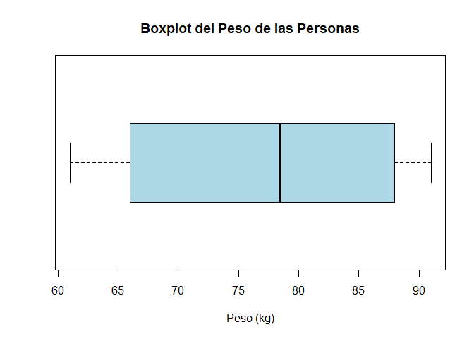</p>

```{r echo=FALSE, eval=FALSE}
# Construcción de diagrama de caja y bigotes
boxplot(datos$Peso, horizontal = T, xlab = "Peso (kg)", main = "Boxplot del Peso de las Personas", col = "lightblue")
```

<h3 data-toc-skip> Interpretación </h3> 

<p>En el diagrama de caja y bigotes se aprecia que la mediana del peso de las personas se encuentra alrededor de $79$ kg, en donde el primer y tercer cuartil se encuentran cercanos a $66$ y $88$ kg, respectivamente. No se aprecian observaciones extremas por fuera de los bigotes del gráfico y se observa un comportamiento asimétrico negativo, pues se aprecia que la mediana se encuentra más cercana al tercer cuartil que al primero. Finalmente se evidencia que la caja del gráfico es relativamente grande, presentando un rango intercuartílico cercano a $22$ kg, lo cual podría considerarse como evidencia sobre que los datos poseen una gran dispersión.
</p>

</main>

Adicionalmente puede agregarse el argumento <tt>notch = TRUE</tt>, lo cual provoca una muesca en cada lado de la caja. @Mcgill1978 señala que **estas muescas representan un intervalo del 95% de confianza alrededor de la mediana**, y que son construidas a partir de la ecuación

`\begin{align*}
\tilde{X}\pm 1.57\times \frac{IQR}{\sqrt{n}}
\end{align*}`

<button id="Show24" class="btn btn-secondary">Mostrar gráfico de caja y bigotes con intervalo de confianza para la mediana en <tt>R</tt></button>
<button id="Hide24" class="btn btn-info">Ocultar gráfico de caja y bigotes con intervalo de confianza para la mediana en <tt>R</tt></button>
<main id="botoncito24"> 

<h3 data-toc-skip> Gráfico de caja y bigotes con intervalo de confianza del 95% para la mediana </h3> 

<section class="language-r highlighter-rouge"><section class="highlight"><pre class="highlight"><code><span class="c1"># Construcción de gráfico de caja y bigotes</span><span class="w">
</span><span class="c1"># con intervalo del 95% para la mediana</span><span class="w">
</span><span class="kc">boxplot</span><span class="p">(</span><span class="n">datos</span><span class="o">$</span><span class="n">Peso</span><span class="p">,</span><span class="w"> </span><span class="n">horizontal</span><span class="w"> </span><span class="o">=</span><span class="w"> </span><span class="nb">T</span><span class="p">,</span><span class="w"> </span><span class="n">xlab</span><span class="w"> </span><span class="o">=</span><span class="w"> </span><span class="s2">"Peso (kg)"</span><span class="p">,</span><span class="w"> </span><span class="n">main</span><span class="w"> </span><span class="o">=</span><span class="w"> </span><span class="s2">"Boxplot del Peso de las Personas"</span><span class="p">,</span><span class="w"> 
    </span><span class="n">col</span><span class="w"> </span><span class="o">=</span><span class="w"> </span><span class="s2">"lightblue"</span><span class="p">,</span><span class="w"> </span><span class="n">notch</span><span class="w"> </span><span class="o">=</span><span class="w"> </span><span class="nb">T</span><span class="p">)</span><span class="w">
</span></code></pre></section></section>

<p>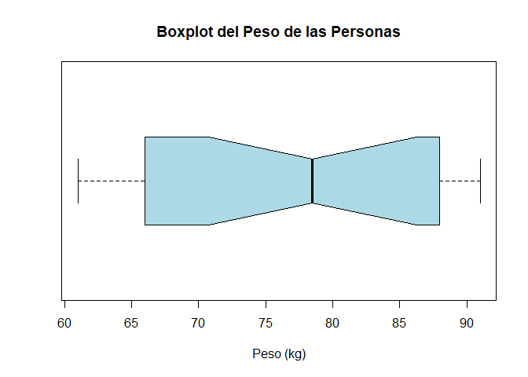</p>

```{r eval=FALSE, echo=FALSE}
# Construcción de diagrama de caja y bigotes 
# con intervalo del 95% para la mediana
boxplot(datos$Peso, horizontal = T, xlab = "Peso (kg)", main = "Boxplot del Peso de las Personas", col = "lightblue", notch = T)
```

<h3 data-toc-skip> Interpretación </h3> 

<p> En el gráfico anterior se presenta un diagrama de caja y bigotes con muescas, para presentar el comportamiento de los pesos de las personas encuestadas a través de medidas de localización y un intervalo de confianza del $95\%$ para la mediana. En éste se evidencia que la mediana del peso de las personas es aproximadamente $79$ kg, con un intervalo de confianza del $95\%$ aproximado entre $71$ y $86$ kg. Adicionalmente no se observan puntos atípicos en el gráfico, y por ello, se concluye que no hay personas que tengan un peso extremadamente bajo o uno extremadamente alto, respecto al resto de personas. <br>
<br>
También se observa que la persona con menor peso posee cerca de $61$ kg, mientras que la mayor un peso de $91$ kg, con primer y tercer cuartil cercanos a $66$ y $88$ kg, respectivamente, lo cual ofrece un rango intercuartílico cercano a $22$ kg, mostrando con ellos que hay una dispersión considerable entre el conjunto de pesos de los encuestados.
</p>

</main>

#### Histograma
Este gráfico muestra la distribución de frecuencia o densidades del grupo de observaciones, **brinda información sobre el valor más probables, la dispersión, la asimetría y valores extremos**. Adicionalmente, tiene la ventaja de que su interpretación es muy intuitiva y por tanto es de los gráficos más preferidos para resumir información. Este gráfico puede ser realizado mediante la función <tt>hist()</tt> de la librería <tt>graphics</tt> de la base del <tt>R</tt>.

<button id="Show14" class="btn btn-secondary">Mostrar histograma en <tt>R</tt></button>
<button id="Hide14" class="btn btn-info">Ocultar histograma en <tt>R</tt></button>
<main id="botoncito14"> 

<h3 data-toc-skip> Histograma </h3> 

<section class="language-r highlighter-rouge"><section class="highlight"><pre class="highlight"><code><span class="c1">## Construcción de histograma de frecuencias</span><span class="w">
</span><span class="kc">hist</span><span class="p">(</span><span class="n">datos</span><span class="o">$</span><span class="n">Altura</span><span class="p">,</span><span class="w"> </span><span class="n">main</span><span class="w"> </span><span class="o">=</span><span class="w"> </span><span class="s2">"Histograma de Altura de las Personas"</span><span class="p">,</span><span class="w"> </span><span class="n">xlab</span><span class="w"> </span><span class="o">=</span><span class="w"> </span><span class="s2">"Altura (m)"</span><span class="p">,</span><span class="w"> 
    </span><span class="n">col</span><span class="w"> </span><span class="o">=</span><span class="w"> </span><span class="s2">"lightblue"</span><span class="p">,</span><span class="w"> </span><span class="n">freq</span><span class="w"> </span><span class="o">=</span><span class="w"> </span><span class="nb">T</span><span class="p">)</span><span class="w">
</span></code></pre></section></section>

<p></p>

```{r echo=FALSE, eval=FALSE}
## Construcción de histograma de frecuencias 
hist(datos$Altura, main = "Histograma de Altura de las Personas", xlab = "Altura (m)", col = "lightblue") 
```

<h3 data-toc-skip> Interpretación </h3> 

<p> En la figura anterior, se aprecia que el histograma realiza una agrupación de personas por categorías, con diferencia de cada una de $0.05$ metros de diferencia, en donde se evidencia que la categoría para la altura entre $1.55-1.60$ metros, es la que posee mayor frecuencia con un total de $5$ entradas. También se puede observar que gran parte de las observaciones están reunidas en la parte derecha del histograma, y en consecuencia, se podría pensar que el conjunto de alturas posee una asimetría negativa. <br>
<br>
Adicionalmente, al ser una variable de altura de personas, y ver que hay personas que pueden medir desde $1.55-1.60$ metros hasta $1.90-1.95$, entonces se considera que la dispersión de las alturas es relativamente alta, lo cual podría ser corroborarse mediante un análisis numérico. Finalmente, como se aprecia que hay varias observaciones en las dos categorías extremas, no se considerará que hayan observaciones extremas en el conjunto de alturas recaudadas en la encuesta.
</p>

</main>

#### Densidad
Este gráfico funciona similar al histograma de densidades, con la diferencia de que en lugar de mostrar la distribución mediante clases (barras), éste muestra el comportamiento de la distribución de las observaciones mediante una curva. Dicha curva, **brinda mayor información que el histograma respecto al valor promedio, dispersión y asimetría**. Este gráfico puede ser realizado mediante la combinación de las funciones <tt>plot()</tt> y <tt>density()</tt>, de la forma <tt>plot(density())</tt>, siendo <tt>plot()</tt> y <tt>density()</tt> funciones de las librerías <tt>graphics</tt> y <tt>stats</tt> de la base de <tt>R</tt>. 

Adicionalmente se presenta la función <tt>polygon</tt> de la librería <tt>graphics</tt> de la base de <tt>R</tt>, la cual sirve para generar formas, o en este caso, darle color a la densidad.

<button id="Show15" class="btn btn-secondary">Mostrar densidad en <tt>R</tt></button>
<button id="Hide15" class="btn btn-info">Ocultar densidad en <tt>R</tt></button>
<main id="botoncito15"> 

<h3 data-toc-skip> Densidad </h3> 

<section class="language-r highlighter-rouge"><section class="highlight"><pre class="highlight"><code><span class="c1">## Construcción de la densidad</span><span class="w">
</span><span class="kc">plot</span><span class="p">(</span><span class="kc">density</span><span class="p">(</span><span class="n">datos</span><span class="o">$</span><span class="n">Salario</span><span class="p">),</span><span class="w"> </span><span class="n">main</span><span class="w"> </span><span class="o">=</span><span class="w"> </span><span class="s2">"Densidad de Salario de las Personas"</span><span class="p">,</span><span class="w"> </span><span class="n">xlab</span><span class="w"> </span><span class="o">=</span><span class="w"> </span><span class="s2">"Salario (Pesos)"</span><span class="p">,</span><span class="w"> 
    </span><span class="n">lwd</span><span class="w"> </span><span class="o">=</span><span class="w"> </span><span class="m">2</span><span class="p">)</span><span class="w">
</span><span class="c1"># Colorea la densidad</span><span class="w">
</span><span class="kc">polygon</span><span class="p">(</span><span class="kc">density</span><span class="p">(</span><span class="n">datos</span><span class="o">$</span><span class="n">Salario</span><span class="p">),</span><span class="w"> </span><span class="n">col</span><span class="w"> </span><span class="o">=</span><span class="w"> </span><span class="s2">"lightblue"</span><span class="p">)</span><span class="w">
</span></code></pre></section></section>

<p></p>

```{r echo=FALSE, eval=FALSE}
## Construcción de la densidad
plot(density(datos$Salario), main = "Densidad de Salario de las Personas", xlab = "Salario (Pesos)", lwd = 2) 
# Colorea la densidad
polygon(density(datos$Salario), col = "lightblue") 
```

<h3 data-toc-skip> Interpretación </h3> 

<p> En el gráfico de densidad, se aprecia un comportamiento relativamente simétrico, y por tanto se tendrá que el promedio de los salarios de los encuestados debe estar alrededor de $2$ millones de pesos, con una desviación estándar de aproximadamente $500$ mil pesos. En la distribución de los salarios no se aprecian colas pesadas (valores extremos), a excepción de que hay algunos valores que se encuentran por debajo del salario mínimo, lo cual podría ser explicado si se tuviera información sobre el número de horas de trabajo de las personas, ya que podría ser que en algunos casos podría deberse a que se trabaja medio tiempo o menos horas.
</p>

</main>


### Dos variables cuantitativas

#### Gráfico de dispersión
Este gráfico se emplea para hacer cruces entre dos variables cuantitativas, y **sirve para ver tendencias y relaciones entre dos variables cuantitativas, además de permitir apreciar donde se centra el total de observaciones, y detección de datos atípicos** dados dos atributos cuantitativos. Este gráfico puede ser realizado mediante la función <tt>plot()</tt> de la librería <tt>graphics</tt> de la base del <tt>R</tt>.

<button id="Show16" class="btn btn-secondary">Mostrar gráfico de dispersión en <tt>R</tt></button>
<button id="Hide16" class="btn btn-info">Ocultar gráfico de dispersión en <tt>R</tt></button>
<main id="botoncito16"> 

<h3 data-toc-skip> Gráfico de dispersión </h3> 

<section class="language-r highlighter-rouge"><section class="highlight"><pre class="highlight"><code><span class="kc">plot</span><span class="p">(</span><span class="n">x</span><span class="w"> </span><span class="o">=</span><span class="w"> </span><span class="n">datos</span><span class="o">$</span><span class="n">Altura</span><span class="p">,</span><span class="w"> </span><span class="n">y</span><span class="w"> </span><span class="o">=</span><span class="w"> </span><span class="n">datos</span><span class="o">$</span><span class="n">Salario</span><span class="p">,</span><span class="w"> </span><span class="n">xlab</span><span class="w"> </span><span class="o">=</span><span class="w"> </span><span class="s2">"Altura (m)"</span><span class="p">,</span><span class="w"> </span><span class="n">ylab</span><span class="w"> </span><span class="o">=</span><span class="w"> </span><span class="s2">"Salario (Pesos)"</span><span class="p">,</span><span class="w"> 
    </span><span class="n">main</span><span class="w"> </span><span class="o">=</span><span class="w"> </span><span class="s2">"Relación entre Altura y Salario"</span><span class="p">,</span><span class="w"> </span><span class="n">pch</span><span class="w"> </span><span class="o">=</span><span class="w"> </span><span class="m">19</span><span class="p">)</span><span class="w">
</span></code></pre></section></section>

<p></p>

```{r echo=FALSE, eval=FALSE}
plot(x = datos$Altura, y = datos$Salario, xlab = "Altura (m)",
     ylab = "Salario (Pesos)", main = "Relación entre Altura y Salario", pch = 19)
```

<h3 data-toc-skip> Interpretación </h3> 

<p>En el gráfico de dispersión anterior, no se aprecia ninguna relación clara entre la altura de las personas y el salario que devengan, pues no es posible observar que el conjunto de observaciones tenga alguna tendencia que apunte a una dirección en particular. Adicionalmente, se aprecia una gran dispersión entre el conjunto de observaciones, lo cual no hace posible la detección de datos atípicos entre los puntos.
</p>
</main>

### Más de dos variables cuantitativas

#### Matriz de dispersión
Cuando se poseen más de dos variables cuantitativas, es posible presentar un matriz que muestre el cruce entre pares de variables, mediante cuadros con versiones simples de la función <tt>plot()</tt>. Este gráfico puede ser realizado mediante la función <tt>pairs()</tt> de la librería <tt>graphics</tt> de la base de <tt>R</tt>.

<button id="Show17" class="btn btn-secondary">Mostrar matriz de dispersión en <tt>R</tt></button>
<button id="Hide17" class="btn btn-info">Ocultar matriz de dispersión en <tt>R</tt></button>
<main id="botoncito17"> 

<h3 data-toc-skip> Matriz de dispersión básica </h3> 

<section class="language-r highlighter-rouge"><section class="highlight"><pre class="highlight"><code><span class="c1">## Matriz de dispersión básica</span><span class="w">
</span><span class="kc">pairs</span><span class="p">(</span><span class="n">cbind</span><span class="p">(</span><span class="n">datos</span><span class="o">$</span><span class="n">Edad</span><span class="p">,</span><span class="w"> </span><span class="n">datos</span><span class="o">$</span><span class="n">Altura</span><span class="p">,</span><span class="w"> </span><span class="n">datos</span><span class="o">$</span><span class="n">Peso</span><span class="p">),</span><span class="w"> </span><span class="n">labels</span><span class="w"> </span><span class="o">=</span><span class="w"> </span><span class="nf">c</span><span class="p">(</span><span class="s2">"Edad (Años)"</span><span class="p">,</span><span class="w"> 
    </span><span class="s2">"Altura (m)"</span><span class="p">,</span><span class="w"> </span><span class="s2">"Peso (kg)"</span><span class="p">))</span><span class="w">
</span></code></pre></section></section>

<p></p>

```{r echo=FALSE, eval=FALSE}
## Matríz de dispersión básica
pairs(cbind(datos$Edad, datos$Altura, datos$Peso), labels = c("Edad (Años)", "Altura (m)", "Peso (kg)"))
```

<h3 data-toc-skip> Interpretación </h3> 

<p>La matriz de dispersión, no se evidencia relación entre los pares de variables evaluadas, debido a que no es posible apreciar tendencias que apunten a alguna dirección en particular, o aglomeración de observaciones. Adicionalmente, se aprecia gran dispersión entre el conjunto de observaciones, y en consecuencia, no es posible detectar observaciones extremas.
</p>

<h3 data-toc-skip> Matriz de dispersión avanzada </h3> 

<p>Funciones complementarias pueden ser desarrolladas para mejorar la visualización los pares de variables. En el libro de @Hernandez2018[, pp. 40-49], se presentan diferentes funciones que pueden ser implementadas. Entre ellas</p>

<section class="language-r highlighter-rouge"><section class="highlight"><pre class="highlight"><code><span class="c1"># Función para dibujar la dispersión y agregar la recta de regresión</span><span class="w">
</span><span class="n">panel.reg</span><span class="w"> </span><span class="o">&lt;-</span><span class="w"> </span><span class="k">function</span><span class="p">(</span><span class="n">x</span><span class="p">,</span><span class="w"> </span><span class="n">y</span><span class="p">)</span><span class="w"> </span><span class="p">{</span><span class="w">
    </span><span class="n">points</span><span class="p">(</span><span class="n">x</span><span class="p">,</span><span class="w"> </span><span class="n">y</span><span class="p">,</span><span class="w"> </span><span class="n">pch</span><span class="w"> </span><span class="o">=</span><span class="w"> </span><span class="m">20</span><span class="p">)</span><span class="w">
    </span><span class="n">abline</span><span class="p">(</span><span class="n">lm</span><span class="p">(</span><span class="n">y</span><span class="w"> </span><span class="o">~</span><span class="w"> </span><span class="n">x</span><span class="p">),</span><span class="w"> </span><span class="n">lwd</span><span class="w"> </span><span class="o">=</span><span class="w"> </span><span class="m">2</span><span class="p">,</span><span class="w"> </span><span class="n">col</span><span class="w"> </span><span class="o">=</span><span class="w"> </span><span class="s2">"dodgerblue2"</span><span class="p">)</span><span class="w">
</span><span class="p">}</span><span class="w">
</span><span class="c1"># Función para crear el histograma</span><span class="w">
</span><span class="n">panel.hist</span><span class="w"> </span><span class="o">&lt;-</span><span class="w"> </span><span class="k">function</span><span class="p">(</span><span class="n">x</span><span class="p">,</span><span class="w"> </span><span class="n">...</span><span class="p">)</span><span class="w"> </span><span class="p">{</span><span class="w">
    </span><span class="n">usr</span><span class="w"> </span><span class="o">&lt;-</span><span class="w"> </span><span class="n">par</span><span class="p">(</span><span class="s2">"usr"</span><span class="p">)</span><span class="w">
    </span><span class="nf">on.exit</span><span class="p">(</span><span class="n">par</span><span class="p">(</span><span class="n">usr</span><span class="p">))</span><span class="w">
    </span><span class="n">par</span><span class="p">(</span><span class="n">usr</span><span class="w"> </span><span class="o">=</span><span class="w"> </span><span class="nf">c</span><span class="p">(</span><span class="n">usr</span><span class="p">[</span><span class="m">1</span><span class="o">:</span><span class="m">2</span><span class="p">],</span><span class="w"> </span><span class="m">0</span><span class="p">,</span><span class="w"> </span><span class="m">1.5</span><span class="p">))</span><span class="w">
    </span><span class="n">h</span><span class="w"> </span><span class="o">&lt;-</span><span class="w"> </span><span class="n">hist</span><span class="p">(</span><span class="n">x</span><span class="p">,</span><span class="w"> </span><span class="n">plot</span><span class="w"> </span><span class="o">=</span><span class="w"> </span><span class="kc">FALSE</span><span class="p">)</span><span class="w">
    </span><span class="n">breaks</span><span class="w"> </span><span class="o">&lt;-</span><span class="w"> </span><span class="n">h</span><span class="o">$</span><span class="n">breaks</span><span class="w">
    </span><span class="n">nB</span><span class="w"> </span><span class="o">&lt;-</span><span class="w"> </span><span class="nf">length</span><span class="p">(</span><span class="n">breaks</span><span class="p">)</span><span class="w">
    </span><span class="n">y</span><span class="w"> </span><span class="o">&lt;-</span><span class="w"> </span><span class="n">h</span><span class="o">$</span><span class="n">counts</span><span class="w">
    </span><span class="n">y</span><span class="w"> </span><span class="o">&lt;-</span><span class="w"> </span><span class="n">y</span><span class="o">/</span><span class="nf">max</span><span class="p">(</span><span class="n">y</span><span class="p">)</span><span class="w">
    </span><span class="n">rect</span><span class="p">(</span><span class="n">breaks</span><span class="p">[</span><span class="o">-</span><span class="n">nB</span><span class="p">],</span><span class="w"> </span><span class="m">0</span><span class="p">,</span><span class="w"> </span><span class="n">breaks</span><span class="p">[</span><span class="m">-1</span><span class="p">],</span><span class="w"> </span><span class="n">y</span><span class="p">,</span><span class="w"> </span><span class="n">col</span><span class="w"> </span><span class="o">=</span><span class="w"> </span><span class="s2">"dodgerblue2"</span><span class="p">,</span><span class="w"> </span><span class="n">...</span><span class="p">)</span><span class="w">
</span><span class="p">}</span><span class="w">
</span><span class="c1"># Función para obtener la correlación</span><span class="w">
</span><span class="n">panel.cor</span><span class="w"> </span><span class="o">&lt;-</span><span class="w"> </span><span class="k">function</span><span class="p">(</span><span class="n">x</span><span class="p">,</span><span class="w"> </span><span class="n">y</span><span class="p">,</span><span class="w"> </span><span class="n">digits</span><span class="w"> </span><span class="o">=</span><span class="w"> </span><span class="m">2</span><span class="p">,</span><span class="w"> </span><span class="n">prefix</span><span class="w"> </span><span class="o">=</span><span class="w"> </span><span class="s2">""</span><span class="p">,</span><span class="w"> </span><span class="n">cex.cor</span><span class="p">)</span><span class="w"> </span><span class="p">{</span><span class="w">
    </span><span class="n">usr</span><span class="w"> </span><span class="o">&lt;-</span><span class="w"> </span><span class="n">par</span><span class="p">(</span><span class="s2">"usr"</span><span class="p">)</span><span class="w">
    </span><span class="nf">on.exit</span><span class="p">(</span><span class="n">par</span><span class="p">(</span><span class="n">usr</span><span class="p">))</span><span class="w">
    </span><span class="n">par</span><span class="p">(</span><span class="n">usr</span><span class="w"> </span><span class="o">=</span><span class="w"> </span><span class="nf">c</span><span class="p">(</span><span class="m">0</span><span class="p">,</span><span class="w"> </span><span class="m">1</span><span class="p">,</span><span class="w"> </span><span class="m">0</span><span class="p">,</span><span class="w"> </span><span class="m">1</span><span class="p">))</span><span class="w">
    </span><span class="n">r</span><span class="w"> </span><span class="o">&lt;-</span><span class="w"> </span><span class="nf">abs</span><span class="p">(</span><span class="n">cor</span><span class="p">(</span><span class="n">x</span><span class="p">,</span><span class="w"> </span><span class="n">y</span><span class="p">))</span><span class="w">
    </span><span class="n">txt</span><span class="w"> </span><span class="o">&lt;-</span><span class="w"> </span><span class="n">format</span><span class="p">(</span><span class="nf">c</span><span class="p">(</span><span class="n">r</span><span class="p">,</span><span class="w"> </span><span class="m">0.123456789</span><span class="p">),</span><span class="w"> </span><span class="n">digits</span><span class="w"> </span><span class="o">=</span><span class="w"> </span><span class="n">digits</span><span class="p">)[</span><span class="m">1</span><span class="p">]</span><span class="w">
    </span><span class="n">txt</span><span class="w"> </span><span class="o">&lt;-</span><span class="w"> </span><span class="n">paste</span><span class="p">(</span><span class="n">prefix</span><span class="p">,</span><span class="w"> </span><span class="n">txt</span><span class="p">,</span><span class="w"> </span><span class="n">sep</span><span class="w"> </span><span class="o">=</span><span class="w"> </span><span class="s2">""</span><span class="p">)</span><span class="w">
    </span><span class="k">if</span><span class="w"> </span><span class="p">(</span><span class="nf">missing</span><span class="p">(</span><span class="n">cex.cor</span><span class="p">))</span><span class="w"> 
        </span><span class="n">cex</span><span class="w"> </span><span class="o">&lt;-</span><span class="w"> </span><span class="m">0.8</span><span class="o">/</span><span class="n">strwidth</span><span class="p">(</span><span class="n">txt</span><span class="p">)</span><span class="w">
    </span><span class="n">text</span><span class="p">(</span><span class="m">0.5</span><span class="p">,</span><span class="w"> </span><span class="m">0.5</span><span class="p">,</span><span class="w"> </span><span class="n">txt</span><span class="p">,</span><span class="w"> </span><span class="n">cex</span><span class="w"> </span><span class="o">=</span><span class="w"> </span><span class="n">cex</span><span class="w"> </span><span class="o">*</span><span class="w"> </span><span class="n">r</span><span class="p">)</span><span class="w">
</span><span class="p">}</span><span class="w">

</span><span class="kc">pairs</span><span class="p">(</span><span class="n">cbind</span><span class="p">(</span><span class="n">datos</span><span class="o">$</span><span class="n">Edad</span><span class="p">,</span><span class="w"> </span><span class="n">datos</span><span class="o">$</span><span class="n">Altura</span><span class="p">,</span><span class="w"> </span><span class="n">datos</span><span class="o">$</span><span class="n">Peso</span><span class="p">),</span><span class="w"> </span><span class="n">labels</span><span class="w"> </span><span class="o">=</span><span class="w"> </span><span class="nf">c</span><span class="p">(</span><span class="s2">"Edad (Años)"</span><span class="p">,</span><span class="w"> 
    </span><span class="s2">"Altura (m)"</span><span class="p">,</span><span class="w"> </span><span class="s2">"Peso (kg)"</span><span class="p">),</span><span class="w"> </span><span class="n">upper.panel</span><span class="w"> </span><span class="o">=</span><span class="w"> </span><span class="n">panel.reg</span><span class="p">,</span><span class="w"> </span><span class="n">diag.panel</span><span class="w"> </span><span class="o">=</span><span class="w"> </span><span class="n">panel.hist</span><span class="p">,</span><span class="w"> 
    </span><span class="n">lower.panel</span><span class="w"> </span><span class="o">=</span><span class="w"> </span><span class="n">panel.cor</span><span class="p">)</span><span class="w">
</span></code></pre></section></section>

<p></p>

```{r echo=FALSE, eval=FALSE}
## Matríz de dispersión avanzada
# Función para dibujar la dispersión y agregar la recta de regresión
panel.reg <- function(x, y)
{
  points(x, y, pch=20)
  abline(lm(y ~ x), lwd=2, col='dodgerblue2')
}
# Función para crear el histograma
panel.hist <- function(x, ...)
{
  usr <- par("usr"); on.exit(par(usr))
  par(usr = c(usr[1:2], 0, 1.5) )
  h <- hist(x, plot = FALSE)
  breaks <- h$breaks; nB <- length(breaks)
  y <- h$counts; y <- y/max(y)
  rect(breaks[-nB], 0, breaks[-1], y, col="dodgerblue2", ...)
}
# Función para obtener la correlación
panel.cor <- function(x, y, digits=2, prefix="", cex.cor)
{
  usr <- par("usr"); on.exit(par(usr))
  par(usr = c(0, 1, 0, 1))
  r <- abs(cor(x, y))
  txt <- format(c(r, 0.123456789), digits=digits)[1]
  txt <- paste(prefix, txt, sep="")
  if(missing(cex.cor)) cex <- 0.8/strwidth(txt)
  text(0.5, 0.5, txt, cex = cex * r)
}

pairs(cbind(datos$Edad, datos$Altura, datos$Peso), labels = c("Edad (Años)", "Altura (m)", "Peso (kg)"), upper.panel = panel.reg, diag.panel = panel.hist, lower.panel = panel.cor)
```

<h3 data-toc-skip> Interpretación </h3> 

<p>En la matriz de dispersión mejoradas, es posible observar un poco más de información al respecto al conjunto de observaciones. Inicialmente, vemos en la diagonal un histograma de cada variable individual, en donde para la Edad, se aprecia que cada barra está compuesta por bloques de $5$ años, mostrando que la mayor proporción de personas posee menos de $20$ años, seguido por personas entre $35-40$ años, también se aprecia un comportamiento decreciente entre las edades, lo cual podría pensarse en una forma asimetría ligeramente positiva. <br>
<br>
Respecto a la altura, vemos que cada barra está compuesta por bloques de $0.05$ metros de diferencia, comenzando en $1.55-1.60$ metros y terminando en $1.95$ metros, en donde, se aprecia que la mayor proporción de personas posee una altura menor a $1.60$ metros, seguido por una altura mayor a $1.90$ metros. En ésta se observa una altura relativamente simétrica, con una amplia dispersión. <br>
<br>
Para el peso, se observa que las barras del histograma saltan de $5$ en $5$ kg, iniciando en $60$ kg hasta $95$, siendo la categoría $85-90$ kg la que posee mayor número de observaciones, seguida por la categoría $65-70$ kg. No se observan valores atípicos en el conjunto de los pesos, dado los valores planteados son valores comúnmente alcanzables. No es posible asegurar la existencia de una estructura asimétrica definida, debido al comportamiento de las barras que no tiene crecimientos ni decrecimientos uniformes.<br>
<br>
En la parte inferior izquierda, se muestran los valores asociados a la correlación entre cada par de variables, en donde se observa que la correlación entre la Edad y la Altura es de $0.19$, entre la Altura y el Peso de $0.17$ y entre la Edad y el Peso de prácticamente $0$. De lo anterior, si usamos los valores de referencia presentados en la 
<a href="../../ProbabilidadeInferencia/PeIEClase04.html#medidas-de-asociación">Clase 04 sobre Medidas de Asociación</a>, se tendrá que al tener una correlación menores a $30\%$, se concluirá que la correlación entre cada uno de los pares de variables es débil o nula.<br>
<br>
Finalmente, en la parte superior derecha, se presenta el gráfico de dispersión entre cada par de variables junto con su recta de regresión. En el gráfico entre Edad y Altura, no se aprecia ninguna agregación de datos, alguna relación positiva o negativa entre las variables o valores atípicos. Comportamiento similar se observa entre los pares de variables de Edad-Peso, y Altura-Peso.
</p>

</main>

### Una variable cualitativa

#### Gráfico de barras
Sirve para resumir una o dos variables cualitativas mediante barras de frecuencias absolutas o relativas. Éste **permite observar la concentración de observaciones en una o más categorías diferentes**. Este gráfico puede ser realizado mediante la función <tt>barplot()</tt> de la librería <tt>graphics</tt> de la base de <tt>R</tt>.

Para realizar estas gráficas deben usarse como insumo, las tablas de frecuencias absolutas o relativas construidas previamente en la subsección de [Resumen tabular](https://jouninlrmd.github.io/ProbabilidadeInferencia/PeIEClase05.html#resumen-tabular){:target="_blank"}.

<button id="Show18" class="btn btn-secondary">Mostrar gráfico de barras para una variable en <tt>R</tt></button>
<button id="Hide18" class="btn btn-info">Ocultar gráfico de barras para una variable en <tt>R</tt></button>
<main id="botoncito18"> 

<h3 data-toc-skip> Gráfico de barras una variable para frecuencias absoluta</h3> 

<section class="language-r highlighter-rouge"><section class="highlight"><pre class="highlight"><code><span class="c1"># Gráfico de barras para una variable de frecuencias absolutas</span><span class="w">
</span><span class="kc">barplot</span><span class="p">(</span><span class="n">tabla1via</span><span class="p">,</span><span class="w"> </span><span class="n">main</span><span class="w"> </span><span class="o">=</span><span class="w"> </span><span class="s2">"Frecuencias absolutas de los Municipios"</span><span class="p">,</span><span class="w"> </span><span class="n">col</span><span class="w"> </span><span class="o">=</span><span class="w"> </span><span class="n">hcl.colors</span><span class="p">(</span><span class="m">5</span><span class="p">))</span><span class="w">
</span></code></pre></section></section>

<p></p>

<h3 data-toc-skip> Interpretación </h3> 

<p>En el gráfico de barras, se observa que entre el total de los $20$ encuestados, la mayoría con $5$ personas viven en la Estrella, seguido por los municipios de Bello, Caldas y Medellín con un total de $4$ personas, y el municipio de Itagüí con $3$ personas encuestadas.
</p>

<h3 data-toc-skip> Gráfico de barras una variable para frecuencias relativas</h3> 

<section class="language-r highlighter-rouge"><section class="highlight"><pre class="highlight"><code><span class="c1"># Gráfico de barras para una variable de frecuencias relativas</span><span class="w">
</span><span class="kc">barplot</span><span class="p">(</span><span class="n">prop1via</span><span class="p">,</span><span class="w"> </span><span class="n">main</span><span class="w"> </span><span class="o">=</span><span class="w"> </span><span class="s2">"Frecuencias relativas de los Municipios"</span><span class="p">,</span><span class="w"> </span><span class="n">col</span><span class="w"> </span><span class="o">=</span><span class="w"> </span><span class="n">rainbow</span><span class="p">(</span><span class="m">5</span><span class="p">))</span><span class="w">
</span></code></pre></section></section>

<p>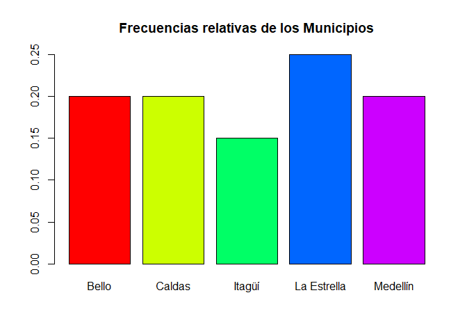</p>

```{r echo=FALSE, eval=FALSE}
# Gráfico de barras para una variable de frecuencias absolutas
barplot(tabla1via, main = "Frecuencias absolutas de los Municipios", col = hcl.colors(5)) 
# Gráfico de barras para una variable de frecuencias relativas
barplot(prop1via, main = "Frecuencias relativas de los Municipios", col = rainbow(5))
```

<h3 data-toc-skip> Interpretación </h3> 

<p>En el gráfico de barra anterior, se aprecia de forma visual el comportamiento de la proporción de encuestados respecto al municipio en donde viven, mostrando que en los municipios de Bello, Caldas y Medellín se realizó en cada una un $20\%$ de las encuestas, mientras que en la Estrella e Itagüí se realizó un $25\%$ y $15\%$ de las encuestas respectivamente.
</p>

</main>

#### Gráfico de pareto
Este gráfico es similar al gráfico de barras para una sola variable cualitativa, pero con la ventaja de que **presenta las frecuencias absolutas, relativas, y las frecuencias acumuladas absolutas y acumuladas relativas en el mismo gráfico**. Este gráfico puede ser realizado mediante la función <tt>pareto.chart()</tt> de la librería <tt>qcc</tt>, usando como insumo las tablas de frecuencias absolutas construidas previamente en la subsección de [Resumen tabular](https://jouninlrmd.github.io/ProbabilidadeInferencia/PeIEClase05.html#resumen-tabular){:target="_blank"}.

<button id="Show20" class="btn btn-secondary">Mostrar gráfico de pareto una variable cualitativa en <tt>R</tt></button>
<button id="Hide20" class="btn btn-info">Ocultar gráfico de pareto una variable cualitativa en <tt>R</tt></button>
<main id="botoncito20"> 

<h3 data-toc-skip> Gráfico de pareto una variable cualitativa</h3> 

<section class="language-r highlighter-rouge"><section class="highlight"><pre class="highlight"><code><span class="c1">## Instalar y cargar </span><span class="w">
</span><span class="c1"># install.packages('qcc') # Instala librería qcc</span><span class="w">
</span><span class="kc">library</span><span class="p">(</span><span class="n">qcc</span><span class="p">)</span><span class="w">  </span><span class="c1"># Carga librería qcc</span><span class="w">

</span><span class="c1"># Gráfico de pareto para una variable cualitativa</span><span class="w">
</span><span class="kc">pareto.chart</span><span class="p">(</span><span class="n">tabla1via</span><span class="p">,</span><span class="w"> </span><span class="n">main</span><span class="w"> </span><span class="o">=</span><span class="w"> </span><span class="s2">"Gráfico Pareto para los Municipios"</span><span class="p">)</span><span class="w">
</span></code></pre></section></section>

<p>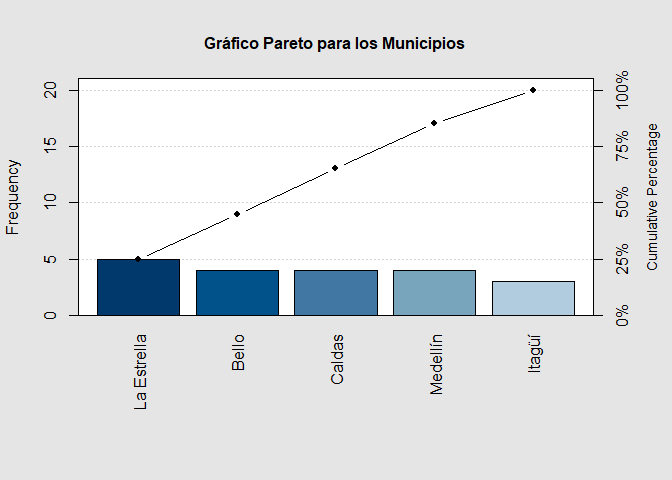</p>

<section class="highlighter-rouge"><section class="highlight"><pre class="highlight"><code>Pareto chart analysis for tabla1via
              Frequency Cum.Freq. Percentage Cum.Percent.
  La Estrella         5         5         25           25
  Bello               4         9         20           45
  Caldas              4        13         20           65
  Medellín            4        17         20           85
  Itagüí              3        20         15          100
</code></pre></section></section>

```{r echo=FALSE, eval=FALSE}
## Instalar y cargar librerías
# install.packages("qcc") # Instala librería qcc
library(qcc) # Carga librería qcc

# Gráfico de pareto para una variable cualitativa
pareto.chart(tabla1via, main = "Gráfico Pareto para los Municipios")
```

<h3 data-toc-skip> Interpretación </h3> 

<p>El gráfico pareto anterior agregada diferente información sobre el municipio de vivienda de las personas encuestadas, en donde, en el eje izquierdo se observa el valor de las frecuencias absolutas, mientras que en el eje derecho se observa el valor de las frecuencias relativas. Las barras representan los valores absolutos o relativos, dependiendo del eje (izquierdo o derecho) que se observe, mientras que los puntos representan los valores acumulados absolutos o relativos dependiendo del eje (izquierdo o derecho) que se observe.<br>
<br>
Dicho comportamiento es resumido en la tabla de análisis de pareto, en donde se presentan las frecuencias-proporciones simples en orden descendente, desde la que posee mayor cantidad, hasta la que posee una menor cantidad. En la tabla de salida se observa que $5$ personas que equivalen a $25\%$ de los datos totales habitan en la Estrella, $4$ personas que equivalen a $20\%$ del total de la población habitan en Bello. Frecuencia y proporción similar a Bello habitan en Caldas y Medellín. Finalmente, con una frecuencia de $3$ encuestados, que equivale a $15\%$ del total del total de los encuestados, habita en Itagüí. 

</p>

</main>

#### Gráfico de pastel
Este gráfico también **sirve para representar gráficamente las tablas de frecuencias absolutas y relativas para una variable cualitativa**. A pesar de ser un gráfico muy usado en la práctica, **no muestra bien la información que se desea presentar**, ya que siempre debe estar acompañado de los porcentajes o frecuencias que representa cada área, ya que no hacerlo, dicho gráfico puede ser muy engañoso. 

Este gráfico puede ser realizado mediante la función <tt>pie()</tt> de la librería <tt>graphics</tt> de la base de <tt>R</tt>, usando como insumo, las tablas de frecuencias absolutas construidas previamente en la subsección de [Resumen tabular](https://jouninlrmd.github.io/ProbabilidadeInferencia/EstIClase03.html#resumen-tabular){:target="_blank"}.

Mientras que las etiquetas de los porcentajes o frecuencias de cada área, puede establecerse mediante la función <tt>legend()</tt> de la librería <tt>graphics</tt> de la base de <tt>R</tt>.

<button id="Show21" class="btn btn-secondary">Mostrar gráfico de pastel para una variable en <tt>R</tt></button>
<button id="Hide21" class="btn btn-info">Ocultar gráfico de pastel para una variable en <tt>R</tt></button>
<main id="botoncito21"> 

<h3 data-toc-skip> Gráfico de barras una variable para frecuencias absoluta</h3> 

<section class="language-r highlighter-rouge"><section class="highlight"><pre class="highlight"><code><span class="c1"># Gráfico de pastel una variable de frecuencias absolutas</span><span class="w">
</span><span class="kc">pie</span><span class="p">(</span><span class="n">tabla1via</span><span class="p">,</span><span class="w"> </span><span class="n">main</span><span class="w"> </span><span class="o">=</span><span class="w"> </span><span class="s2">"Frecuencias absolutas por Municipio"</span><span class="p">,</span><span class="w"> </span><span class="n">col</span><span class="w"> </span><span class="o">=</span><span class="w"> </span><span class="n">cm.colors</span><span class="p">(</span><span class="m">5</span><span class="p">))</span><span class="w">
</span><span class="kc">legend</span><span class="p">(</span><span class="s2">"topleft"</span><span class="p">,</span><span class="w"> </span><span class="n">legend</span><span class="w"> </span><span class="o">=</span><span class="w"> </span><span class="nf">round</span><span class="p">(</span><span class="n">prop1via</span><span class="p">,</span><span class="w"> </span><span class="m">4</span><span class="p">),</span><span class="w"> </span><span class="n">fill</span><span class="w"> </span><span class="o">=</span><span class="w"> </span><span class="n">cm.colors</span><span class="p">(</span><span class="m">5</span><span class="p">))</span><span class="w">
</span></code></pre></section></section>

<p>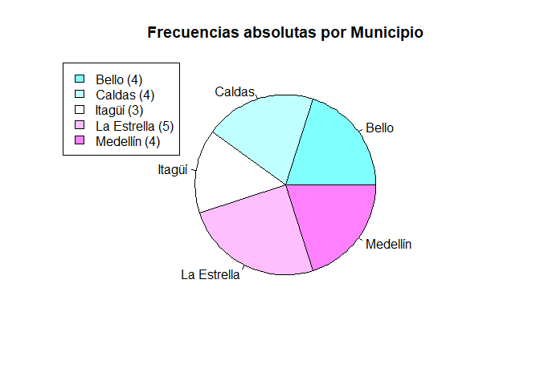</p>

<h3 data-toc-skip> Interpretación </h3> 

<p>El gráfico de pastel anterior, muestra la frecuencia absoluta de encuestas que se realizaron por municipio, en donde triángulos más grandes representan una mayor frecuencia y triángulos más pequeños una menor frecuencia. Dado que no es posible saber con certeza si los triángulos son iguales o diferentes, se agrega en la parte izquierda una cuadro con el nombre de la categoría y la frecuencia absoluta entre paréntesis. En este cuadro, se aprecia que el municipio de la Estrella es quién posee la mayor frecuencia en la encuesta, con un total de $5$ encuestados, seguidos por Bello, Caldas y Medellín con un total de $4$ encuestados cada una, y seguido por $3$ encuestados pertenecientes al municipio de Itagüí.
</p>


<h3 data-toc-skip> Gráfico de barras una variable para frecuencias relativas</h3> 

<section class="language-r highlighter-rouge"><section class="highlight"><pre class="highlight"><code><span class="c1"># Gráfico de pastel una variable de frecuencias relativas</span><span class="w">
</span><span class="kc">pie</span><span class="p">(</span><span class="n">prop1via</span><span class="p">,</span><span class="w"> </span><span class="n">main</span><span class="w"> </span><span class="o">=</span><span class="w"> </span><span class="s2">"Frecuencia Relativa por Municipio"</span><span class="p">,</span><span class="w"> </span><span class="n">col</span><span class="w"> </span><span class="o">=</span><span class="w"> </span><span class="n">hcl.colors</span><span class="p">(</span><span class="m">5</span><span class="p">))</span><span class="w">
</span><span class="kc">legend</span><span class="p">(</span><span class="s2">"topleft"</span><span class="p">,</span><span class="w"> </span><span class="n">legend</span><span class="w"> </span><span class="o">=</span><span class="w"> </span><span class="nf">round</span><span class="p">(</span><span class="n">prop1via</span><span class="p">,</span><span class="w"> </span><span class="m">4</span><span class="p">),</span><span class="w"> </span><span class="n">fill</span><span class="w"> </span><span class="o">=</span><span class="w"> </span><span class="n">hcl.colors</span><span class="p">(</span><span class="m">5</span><span class="p">))</span><span class="w">
</span></code></pre></section></section>

<p>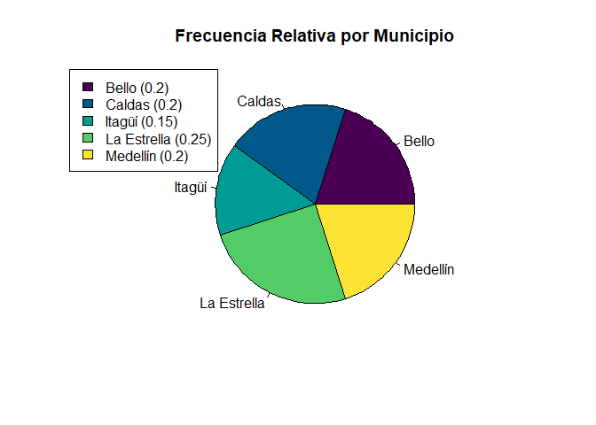</p>

```{r echo=FALSE, eval=FALSE}
# Gráfico de pastel una variable de frecuencias absolutas
pie(tabla1via, main = "Frecuencias absolutas por Municipio", col = cm.colors(5))
legend("topleft", legend = paste0(names(tabla1via), " (", round(tabla1via,4), ")"), fill = cm.colors(5))
# Gráfico de pastel una variable de frecuencias relativas
pie(prop1via, main = "Frecuencia Relativa por Municipio", col = hcl.colors(5))
legend("topleft", legend = paste0(names(prop1via), " (", round(prop1via,4), ")"), fill = hcl.colors(5))
```

<h3 data-toc-skip> Interpretación </h3> 

<p>En el gráfico anterior, se presenta la proporción de encuestas realizadas en cada uno de los municipios de interés, en donde el gráfico de pastel representa el $100\%$ de las encuesta realizadas, y cada triángulo la proporción asociada a cada uno de los municipios. En donde, como es difícil saber con certeza si los triángulos son o no iguales, se agrega la proporción asociada en la parte izquierda mediante un cuadro que muestra el nombre del municipio y la frecuencia relativa o proporción asociada entre paréntesis. En el cuadro se evidencia que la Estrella posee el $25\%$ del total del diagrama del pastel, los municipios de Bello, Caldas y Medellín el $20\%$ cada uno, y el municipio de Itagüí el $15\%$ restante.
</p>

</main>

#### Gráfico de puntos
Este gráfico también es similar al gráfico de barras, **sirve para presentar las frecuencias absolutas o relativas de una variable cualitativa o un cruce de dos variables cualitativas**, y **muestra un punto que representa el conteo del total de observaciones que hay para cada variable**. Este gráfico puede ser realizado mediante la función <tt>dotchart()</tt> de la librería <tt>graphics</tt> de la base de <tt>R</tt>, usando como insumo las tablas de frecuencias absolutas construidas previamente en la subsección de [Resumen tabular](https://jouninlrmd.github.io/ProbabilidadeInferencia/PeIEClase05.html#resumen-tabular){:target="_blank"}.

<button id="Show22" class="btn btn-secondary">Mostrar gráfico de puntos para una variable en <tt>R</tt></button>
<button id="Hide22" class="btn btn-info">Ocultar gráfico de puntos para una variable en <tt>R</tt></button>
<main id="botoncito22"> 

<h3 data-toc-skip> Gráfico de puntos para una variable de frecuencias absolutas </h3> 

<section class="language-r highlighter-rouge"><section class="highlight"><pre class="highlight"><code><span class="c1"># Gráfico de puntos para una variable de frecuencias absolutas</span><span class="w">
</span><span class="kc">dotchart</span><span class="p">(</span><span class="n">tabla1via</span><span class="p">,</span><span class="w"> </span><span class="n">main</span><span class="w"> </span><span class="o">=</span><span class="w"> </span><span class="s2">"Frecuencias absolutas de categorías por Municipio"</span><span class="p">)</span><span class="w">
</span></code></pre></section></section>

<p>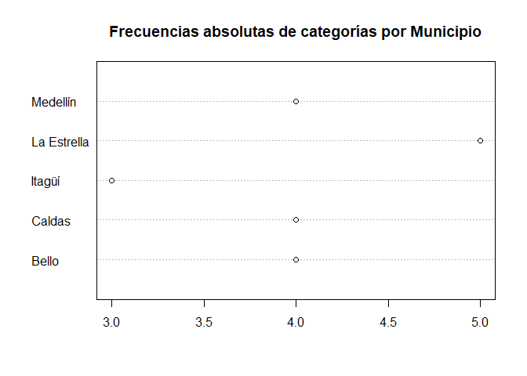</p>

```{r echo=FALSE, eval=FALSE}
# Gráfico de puntos para una variable de frecuencias absolutas
dotchart(tabla1via, main = "Frecuencias absolutas de categorías por Municipio")
```

<h3 data-toc-skip> Interpretación </h3> 

<p>El gráfico de puntos, funciona similar al gráfico de barras solo que en lugar de mostrar barras para mostrar el valor que posee cada categoría, éste gráfico muestra un punto asociado a un valor, que puede evidenciarse en el eje inferior. El gráfico anterior muestra un punto para el valor de $3$ en el caso de Itagüí, un valor de $4$ en el caso de Bello, Caldas y Medellín, y un valor de $5$ en el caso de la Estrella. Dichos valores representan el número de encuestados que hay en la base de datos.
</p>

<h3 data-toc-skip> Gráfico de puntos para una variable de frecuencias relativas </h3> 

<section class="language-r highlighter-rouge"><section class="highlight"><pre class="highlight"><code><span class="c1"># Gráfico de puntos para una variable de frecuencias relativas</span><span class="w">
</span><span class="kc">dotchart</span><span class="p">(</span><span class="n">prop1via</span><span class="p">,</span><span class="w"> </span><span class="n">main</span><span class="w"> </span><span class="o">=</span><span class="w"> </span><span class="s2">"Frecuencias relativas de categorías por Municipio"</span><span class="p">)</span><span class="w">
</span></code></pre></section></section>

<p></p>

```{r echo=FALSE, eval=FALSE}
# Gráfico de puntos para una variable de frecuencias relativas
dotchart(prop1via, main = "Frecuencias relativas de categorías por Municipio")
```

<h3 data-toc-skip> Interpretación </h3> 

<p>El gráfico de puntos también puede mostrar la proporción asociada en la categoría en el eje inferior. En este caso vemos que los valores en el eje van saltando de $0.02$ en $0.02$, y por ello, en este caso se tendrá que el municipio de Itagüí representa el $15\%$ de todas todas las encuestas, Bello, Caldas y Bello cada uno representa el $20\%$, y el municipio de la Estrella representa al $25\%$ de la totalidad de las encuestas.
</p>

</main>

<button id="Show23" class="btn btn-secondary">Mostrar gráfico de puntos para dos variables en <tt>R</tt></button>
<button id="Hide23" class="btn btn-info">Ocultar gráfico de puntos para dos variables en <tt>R</tt></button>
<main id="botoncito23"> 

<h3 data-toc-skip> Gráfico de puntos para dos variables de frecuencias absolutas </h3> 

<section class="language-r highlighter-rouge"><section class="highlight"><pre class="highlight"><code><span class="c1"># Gráfico de barras para dos variables para frecuencias absolutas</span><span class="w">
</span><span class="kc">dotchart</span><span class="p">(</span><span class="n">tabla2vias</span><span class="p">,</span><span class="w"> </span><span class="n">main</span><span class="w"> </span><span class="o">=</span><span class="w"> </span><span class="s2">"Frecuencias absolutas de categorías de Deporte por Municipio"</span><span class="p">)</span><span class="w">
</span></code></pre></section></section>

<p>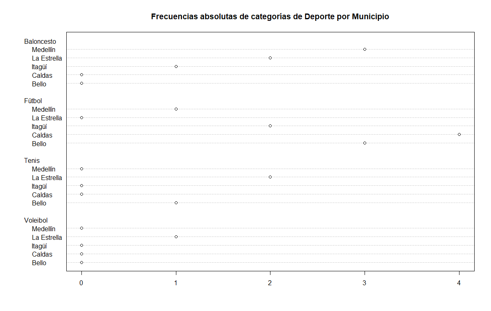</p>

```{r echo=FALSE, eval=FALSE}
# Gráfico de barras para dos variables para frecuencias absolutas
dotchart(tabla2vias, main = "Frecuencias absolutas de categorías de Deporte por Municipio")
```

<h3 data-toc-skip> Interpretación </h3> 

<p>En el gráfico de puntos anterior, se observan las categorías de municipio de vivienda anidadas dentro del deporte favorito de las personas, en donde, para el deporte baloncesto, se aprecia en el eje inferior, que $3$ de ellos viven en Medellín, $2$ en la Estrella y $1$ en Itagüí.  <br>
<br>
En el caso de quienes prefieren Fútbol se observa la mayor cantidad de encuestados, en donde se tiene $1$ habitante con localidad en Medellín, $2$ en Itagüí, $4$ en Caldas y $3$ en Bello. Similarmente, para quienes prefieren practicar Tenis se encuentran $2$ personas que viven en la Estrella y $2$ en Bello. Finalmente, la única persona que prefiere el Voleibol sobre otros deportes, se encuentra que vive en la Estrella.
</p>

<h3 data-toc-skip> Gráfico de puntos para dos variables de frecuencias relativas </h3> 

<section class="language-r highlighter-rouge"><section class="highlight"><pre class="highlight"><code><span class="c1"># Gráfico de barras para dos variables para frecuencias relativas</span><span class="w">
</span><span class="kc">dotchart</span><span class="p">(</span><span class="n">prop2vias</span><span class="p">,</span><span class="w"> </span><span class="n">main</span><span class="w"> </span><span class="o">=</span><span class="w"> </span><span class="s2">"Frecuencias relativas de categorías de Deporte por Municipio"</span><span class="p">)</span><span class="w">
</span></code></pre></section></section>

<p></p>

```{r echo=FALSE, eval=FALSE}
# Gráfico de barras para dos variables para frecuencias relativas
dotchart(prop2vias, main = "Frecuencias relativas de categorías de Deporte por Municipio")
```

<h3 data-toc-skip> Interpretación </h3> 

<p>En el gráfico de puntos para frecuencias relativas, se aprecia un cruce entre el municipio de vivienda y el deporte favorito de las personas en el eje $Y$, mientras la proporción asociada en el eje $X$. Al observar por deporte, encontramos que el deporte menos popular es el voleibol con solo una persona que lo prefiere sobre los demás, la cual vive en la Estrella y representa el $5\%$ del totalidad de la encuesta. <br>
<br>
El deporte más popular es el fútbol con un total del $50\%$ de los encuestados los cuales se dividen entre $5\%$ que reside en la Estrella, $10\%$ en Itagüí, $20\%$ en Caldas y $15\%$ en Bello. También se presenta información sobre las personas que prefieren baloncesto sobre otros deportes con un total de $30\%$ de la totalidad de las encuestas, porcentaje que se reparte entre Medellín, la Estrella e Itagüí con el $15\%$, $10\%$ y $5\%$, respectivamente. Adicionalmente se evidencia que el $15\%$ restante de los encuestados prefieren el Tenis sobre otros deportes, siendo un $10\%$ personas que viven la Estrella y el $5\%$ personas que viven en Bello.
</p>

</main>

### Dos variables cualitativas

#### Gráfico de barras
El gráfico de barras también sirve para resumir dos variable cualitativa mediante barras de frecuencias absolutas o relativas. **La interpretación, será la misma que para una sola variable cualitativa, con la diferencia de que en este caso, se podrán hacer comparaciones por categorías adicionales.** Este gráfico puede ser realizado mediante la función <tt>barplot()</tt> de la librería <tt>graphics</tt> de la base de <tt>R</tt>, junto a la función <tt>legend()</tt>, para establecer las etiquetas asociadas a cada una de las barras que se presenten en el gráfico.


<button id="Show19" class="btn btn-secondary">Mostrar gráfico de barras para dos variables en <tt>R</tt></button>
<button id="Hide19" class="btn btn-info">Ocultar gráfico de barras para dos variables en <tt>R</tt></button>
<main id="botoncito19"> 

<h3 data-toc-skip> Gráfico de barras dos variables para frecuencias absolutas</h3> 

<section class="language-r highlighter-rouge"><section class="highlight"><pre class="highlight"><code><span class="c1"># Gráfico de barras para dos variables para frecuencias absolutas</span><span class="w">
</span><span class="kc">barplot</span><span class="p">(</span><span class="n">tabla2vias</span><span class="p">,</span><span class="w"> </span><span class="n">main</span><span class="w"> </span><span class="o">=</span><span class="w"> </span><span class="s2">"Frecuencias absolutas categorías de Deporte por Municipio"</span><span class="p">,</span><span class="w"> 
    </span><span class="n">col</span><span class="w"> </span><span class="o">=</span><span class="w"> </span><span class="n">topo.colors</span><span class="p">(</span><span class="m">5</span><span class="p">),</span><span class="w"> </span><span class="n">beside</span><span class="w"> </span><span class="o">=</span><span class="w"> </span><span class="nb">T</span><span class="p">)</span><span class="w">
</span><span class="kc">legend</span><span class="p">(</span><span class="s2">"topright"</span><span class="p">,</span><span class="w"> </span><span class="n">rownames</span><span class="p">(</span><span class="n">tabla2vias</span><span class="p">),</span><span class="w"> </span><span class="n">fill</span><span class="w"> </span><span class="o">=</span><span class="w"> </span><span class="n">topo.colors</span><span class="p">(</span><span class="m">5</span><span class="p">))</span><span class="w">
</span></code></pre></section></section>

<p></p>

<h3 data-toc-skip> Interpretación </h3> 

<p>En el gráfico de barras para el cruce entre el deporte favorito y el municipio de vivienda, se observa que de las $6$ personas que prefieren Baloncesto sobre otros deportes, hay $3$ que residen en Medellín, $2$ en la Estrella y $1$ en Itagüí. Por su parte, de las $10$ personas que prefieren el Fútbol, se aprecia que la mayoría de las personas habitan en Caldas, seguido por Bello, Itagüí y Medellín, con una frecuencia de $4$, $3$, $2$ y $1$ respectivamente. Para las $3$ personas encuestadas que prefieren Tenis sobre otros deportes, se tiene que $2$ viven en la Estrella y $1$ en Bello, mientras que de los encuestados, solo una persona prefiere Voleibol sobre otros deportes, y éste reside en la Estrella.
</p>

<h3 data-toc-skip> Gráfico de barras dos variables para frecuencias relativas</h3> 

<section class="language-r highlighter-rouge"><section class="highlight"><pre class="highlight"><code><span class="c1"># Gráfico de barras para dos variables para frecuencias relativas</span><span class="w">
</span><span class="kc">barplot</span><span class="p">(</span><span class="n">prop2vias</span><span class="p">,</span><span class="w"> </span><span class="n">main</span><span class="w"> </span><span class="o">=</span><span class="w"> </span><span class="s2">"Frecuencias relativa categorías de Deporte por Municipio"</span><span class="p">,</span><span class="w"> 
    </span><span class="n">col</span><span class="w"> </span><span class="o">=</span><span class="w"> </span><span class="n">terrain.colors</span><span class="p">(</span><span class="m">5</span><span class="p">),</span><span class="w"> </span><span class="n">beside</span><span class="w"> </span><span class="o">=</span><span class="w"> </span><span class="nb">T</span><span class="p">)</span><span class="w">
</span><span class="kc">legend</span><span class="p">(</span><span class="s2">"topright"</span><span class="p">,</span><span class="w"> </span><span class="n">rownames</span><span class="p">(</span><span class="n">prop2vias</span><span class="p">),</span><span class="w"> </span><span class="n">fill</span><span class="w"> </span><span class="o">=</span><span class="w"> </span><span class="n">terrain.colors</span><span class="p">(</span><span class="m">5</span><span class="p">))</span><span class="w">
</span></code></pre></section></section>

<p></p>

```{r echo=FALSE, eval=FALSE}
# Gráfico de barras para dos variables para frecuencias absolutas
barplot(tabla2vias, main = "Frecuencias absolutas categorías de Deporte por Municipio", col = topo.colors(5), beside = T) 
legend("topright", rownames(tabla2vias), fill = topo.colors(5)) 
# Gráfico de barras para dos variables para frecuencias relativas
barplot(prop2vias, main = "Frecuencias relativa categorías de Deporte por Municipio", col = terrain.colors(5), beside = T)
legend("topright", rownames(prop2vias), fill = terrain.colors(5)) 
```

<h3 data-toc-skip> Interpretación </h3> 

<p>En el gráfico anterior, se ilustra el cruce entre las variables de deporte y municipio, y se observa que el $30\%$ de los encuestados prefieren baloncesto sobre otros deportes, porcentaje que se divide entre $15\%$ asociado a personas que habitan en Medellín, $10\%$ que habitan en la Estrella y $5\%$ en Itagüí. De forma similar, se aprecia que $50\%$ de los encuestados prefieren el fútbol, de donde el $20\%$ habitan en Caldas, $15\%$ en Bello, $10\%$ en Itagüí y $5\%$ en Medellín. Para las personas que prefieren el Tenis y Voleibol sobre otros deportes, se tiene un $15\%$ y $5\%$, respectivamente, de donde, de los que prefieren el Tenis, el $10\%$ habitan en la Estrella y $5\%$ en Bello, mientras que, los que prefieren Voleibol habitan todos en la Estrella.
</p>

</main>

#### Gráfico de balón
El gráfico de balón, suele ser un gráfico más avanzado para resumir dos variable cualitativa, en donde **se establecen en el cruce de las dos variables, círculos que se asocian al tamaño del cruce de las dos variables cualitativas**. Este gráfico puede ser realizado mediante la función <tt>ggballoonplot()</tt> de la librería <tt>ggpubr</tt>, la cual depende de la librería <tt>ggplot2</tt>.


<button id="Show29" class="btn btn-secondary">Mostrar gráfico de balón en <tt>R</tt></button>
<button id="Hide29" class="btn btn-info">Ocultar gráfico de balón por categorías en <tt>R</tt></button>
<main id="botoncito29"> 

<h3 data-toc-skip> Gráfico de balón</h3> 

<section class="language-r highlighter-rouge"><section class="highlight"><pre class="highlight"><code><span class="c1"># Carga las librerías</span><span class="w">
</span><span class="n">library</span><span class="p">(</span><span class="n">ggplot2</span><span class="p">)</span><span class="w">
</span><span class="n">library</span><span class="p">(</span><span class="n">ggpubr</span><span class="p">)</span><span class="w">

</span><span class="c1"># Establece un tema por defecto para el gráfico</span><span class="w">
</span><span class="n">theme_set</span><span class="p">(</span><span class="n">theme_pubr</span><span class="p">())</span><span class="w">

</span><span class="c1"># Gráfico de balón</span><span class="w">
</span><span class="n">ggballoonplot</span><span class="p">(</span><span class="n">data.frame</span><span class="p">(</span><span class="n">tabla2vias</span><span class="p">),</span><span class="w"> </span><span class="n">fill</span><span class="w"> </span><span class="o">=</span><span class="w"> </span><span class="s2">"value"</span><span class="p">)</span><span class="w"> </span><span class="o">+</span><span class="w"> </span><span class="n">scale_fill_viridis_c</span><span class="p">(</span><span class="n">option</span><span class="w"> </span><span class="o">=</span><span class="w"> </span><span class="s2">"C"</span><span class="p">)</span><span class="w">
</span></code></pre></section></section>

<p>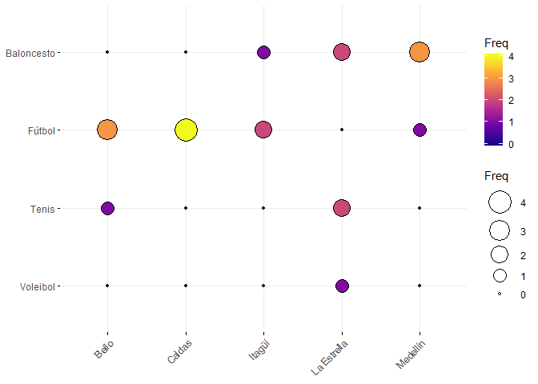</p>

```{r echo=F, eval=F}
# Carga las librerías
library(ggplot2)
library(ggpubr)

# Establece un tema por defecto para el gráfico
theme_set(theme_pubr()) 

# Gráfico de balón
ggballoonplot(data.frame(tabla2vias), fill = "value")+
  scale_fill_viridis_c(option = "C")
```

<h3 data-toc-skip> Interpretación </h3> 

<p>En el gráfico de balón, se muestra el número de observaciones que hay entre el cruce de las variables deporte y municipio. En dicho gráfico se observa que la mayor frecuecia de observaciones se da en el cruce entre los encuestados que viven en el municipo de Caldas y que prefieren el futbol entre los demás deportes, con un tal de $4$ observaciones, seguido por los cruces entre Bello-Fútbol y Medellín-Baloncesto con un total de $3$ observaciones. Adicionalmente se observa que de todos los municipios, en el departamento de La Estrella, es donde se evidencia que hay personas que prefieren el Voleibol sobre los demás deportes.
</p>

</main>


### Cualitativa - Cuantitativa
Entre las gráficos básicos que permiten analizar los cruces entre variables cuantitativas y cualitativas se tiene, al gráfico de caja y bigotes, gráfico de medias, diagrama de dispersión.

#### Gráfico de caja y bigotes
Este gráfico sirve para presentar de forma visual, datos numéricos **por categorías** a través de sus cuartiles, además de presentar **otras características importantes, tales como la dispersión, simetría y datos potencialmente atípicos**. Este gráfico puede ser realizado mediante la función <tt>boxplot()</tt> de la librería <tt>graphics</tt> de <tt>R</tt>.

<button id="Show25" class="btn btn-secondary">Mostrar gráfico de caja y bigotes en <tt>R</tt></button>
<button id="Hide25" class="btn btn-info">Ocultar gráfico de caja y bigotes en <tt>R</tt></button>
<main id="botoncito25"> 

<h3 data-toc-skip> Gráfico de caja y bigotes </h3> 

<section class="language-r highlighter-rouge"><section class="highlight"><pre class="highlight"><code><span class="c1"># Construcción de gráfico de caja y bigotes por categorías</span><span class="w">
</span><span class="kc">boxplot</span><span class="p">(</span><span class="n">datos</span><span class="o">$</span><span class="n">Altura</span><span class="w"> </span><span class="o">~</span><span class="w"> </span><span class="n">datos</span><span class="o">$</span><span class="n">Estrato</span><span class="p">,</span><span class="w"> </span><span class="n">horizontal</span><span class="w"> </span><span class="o">=</span><span class="w"> </span><span class="nb">T</span><span class="p">,</span><span class="w"> </span><span class="n">xlab</span><span class="w"> </span><span class="o">=</span><span class="w"> </span><span class="s2">"Altura (m)"</span><span class="p">,</span><span class="w"> </span><span class="n">ylab</span><span class="w"> </span><span class="o">=</span><span class="w"> </span><span class="s2">"Estratos"</span><span class="p">,</span><span class="w"> 
    </span><span class="n">main</span><span class="w"> </span><span class="o">=</span><span class="w"> </span><span class="s2">"Boxplot de Altura de las personas por Estrato"</span><span class="p">,</span><span class="w"> </span><span class="n">col</span><span class="w"> </span><span class="o">=</span><span class="w"> </span><span class="n">terrain.colors</span><span class="p">(</span><span class="m">6</span><span class="p">))</span><span class="w">
</span></code></pre></section></section>

<p>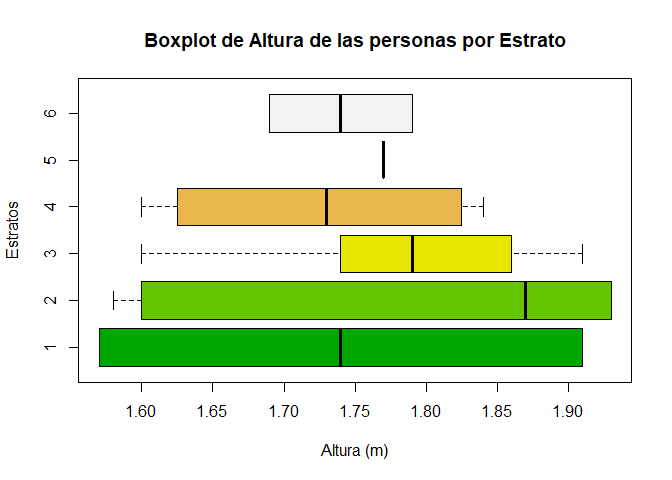</p>

```{r echo=FALSE, eval=FALSE}
# Construcción de gráfico de caja y bigotes por categorías
boxplot(datos$Altura ~ datos$Estrato, horizontal = T, xlab = "Altura (m)", ylab = "Estratos", main = "Boxplot de Altura de las personas por Estrato", col = terrain.colors(6))
```

<h3 data-toc-skip> Interpretación </h3> 

<p>En el gráfico anterior, se hace una comparación entre la altura de los encuestados y el estrato socioeconómico al que pertenece cada encuestado. En éste se aprecia que de los $6$ estratos, el estrato $2$ es el que posee la mayor mediana de estatura respecto a los demás estratos. <br>
<br>
También se observa que solo existe una observación en el estrato $5$, por lo cual solo se aprecia una barra vertical que representa el valor de esa observación. Se evidencia además que la mediana de la altura de los encuestados pertenecientes al estrato $6$, $4$ y $1$ poseen una mediana similar que ronda los $1.74$ metros. <br>
<br>
Asimismo, puede apreciarse que de los $6$ estratos, los estratos $1$ y $2$ poseen la mayor variabilidad entre todos los estratos, pues son los que poseen mayor rango y mayor rango intercuartílico. Se nota además, que para todos los estratos se observa un comportamiento simétrico, a excepción del estrato $2$, el cual posee una asimetría negativa, dado que el valor de la mediana se encuentra en la parte derecha de la caja. <br>
<br>
Finalmente, puede notarse que no se evidencia ningún punto a la derecha o izquierda de los bigotes de las diferentes cajas, lo cual quiere decir, que no se identificaron alturas extremas o atípicas para ninguno de los estratos socioeconómicos.
</p>

</main>

También puede agregarse el argumento <tt>notch = TRUE</tt>, para construir un intervalo de confianza del `$95%$` para la mediana, lo cual hace que se grafique una muesca en cada lado de la caja, alrededor de la mediana. En donde, si las muescas de dos parcelas no se superponen, entonces se tendrá evidencia sólida respecto a que la mediana de los grupos es diferente [@Chambers1983, p. 62].

<button id="Show26" class="btn btn-secondary">Mostrar gráfico de caja y bigotes con intervalo de confianza para la mediana en <tt>R</tt></button>
<button id="Hide26" class="btn btn-info">Ocultar gráfico de caja y bigotes con intervalo de confianza para la mediana en <tt>R</tt></button>
<main id="botoncito26"> 

<h3 data-toc-skip> Gráfico de caja y bigotes con intervalo de confianza del 95% para la mediana </h3> 

<section class="language-r highlighter-rouge"><section class="highlight"><pre class="highlight"><code><span class="c1"># Construcción de diagrama de caja y bigotes por categorías con intervalo</span><span class="w">
</span><span class="c1"># del 95% para la mediana</span><span class="w">
</span><span class="kc">boxplot</span><span class="p">(</span><span class="n">datos</span><span class="o">$</span><span class="n">Altura</span><span class="w"> </span><span class="o">~</span><span class="w"> </span><span class="n">datos</span><span class="o">$</span><span class="n">Estrato</span><span class="p">,</span><span class="w"> </span><span class="n">horizontal</span><span class="w"> </span><span class="o">=</span><span class="w"> </span><span class="nb">T</span><span class="p">,</span><span class="w"> </span><span class="n">xlab</span><span class="w"> </span><span class="o">=</span><span class="w"> </span><span class="s2">"Altura (m)"</span><span class="p">,</span><span class="w"> </span><span class="n">ylab</span><span class="w"> </span><span class="o">=</span><span class="w"> </span><span class="s2">"Estratos"</span><span class="p">,</span><span class="w"> 
    </span><span class="n">main</span><span class="w"> </span><span class="o">=</span><span class="w"> </span><span class="s2">"Boxplot de Altura de las personas por Estrato"</span><span class="p">,</span><span class="w"> </span><span class="n">col</span><span class="w"> </span><span class="o">=</span><span class="w"> </span><span class="n">topo.colors</span><span class="p">(</span><span class="m">6</span><span class="p">),</span><span class="w"> 
    </span><span class="n">notch</span><span class="w"> </span><span class="o">=</span><span class="w"> </span><span class="nb">T</span><span class="p">)</span><span class="w">
</span></code></pre></section></section>

<p></p>

```{r echo=FALSE, eval=FALSE}
# Construcción de diagrama de caja y bigotes por categorías
# con intervalo del 95% para la mediana
boxplot(datos$Altura ~ datos$Estrato, horizontal = T, xlab = "Altura (m)", ylab= "Estratos", main = "Boxplot de Altura de las personas por Estrato", col = topo.colors(6), notch = T)
```

<h3 data-toc-skip> Interpretación </h3> 

<p>El gráfico de caja y bigotes, presentan un comparativo de la altura de las personas con el estrato socioeconómico, adicionando además intervalos de confianza para la mediana, con el fin de observar si las medianas de cada estrato es significativamente diferente que el de otros estratos o no. <br>
<br>
En el gráfico se aprecia que en casi todos los estratos se observa que las bandas de confianza son mayores al primer y tercer cuartil, a excepción de los estratos $5$ y $2$ en donde, el primero posee una sola observación, y en consecuencia sus bandas de confianza son iguales a su mediana o único valor registrado, mientras que, para el segundo se aprecia que la banda de confianza solo supera el tercer cuartil.<br>
<br>
Se evidencia que de las medianas presentadas, las de los estratos $6$, $4$ y $1$ son muy similares situándose alrededor de $1.74$ metros, mientras que el estrato que presenta una mayor mediana es el $2$ con un valor cercano a $1.86$. La diferencia entre la mediana de los estratos no parece ser significativamente diferente aunque se aprecie que hay unos valores mayores o menores que otros, debido a que los intervalos de confianza del $95\%$ para la mediana se traslapan unos con otros. <br>
<br>
También se nota, que de los estratos propuestos, la altura de los estratos $1$ y $2$ parecen ser los que poseen la mayor variabilidad entre todas las categorías, ya que se que tanto su rango, rango intercuartílico como bandas de confianza son las más grandes. Es de anotar, que para ninguno de los estratos se observan valores atípicos, ya que, para ninguno de las categorías se identifican puntos por fuera de los bigotes de las cajas.
</p>

</main>

#### Gráfico de medias
Este gráfico **sirve para presentar de forma visual, grupos de datos numéricos a través de sus media y desviación estándar**. El gráfico está compuesto por un punto que representa el valor promedio del grupo de observaciones y **las barras representan dos desviación estándar de la media**. En donde, si las barras no se superponen, entonces se tendrá evidencia sólida respecto a que la media de los grupos es diferente.

Este gráfico puede ser realizado mediante la función <tt>plotMeans()</tt> de la librería <tt>RcmdrMisc</tt>.

<button id="Show27" class="btn btn-secondary">Mostrar gráfico de medias en <tt>R</tt></button>
<button id="Hide27" class="btn btn-info">Ocultar gráfico de medias en <tt>R</tt></button>
<main id="botoncito27"> 

<h3 data-toc-skip> Gráfico de medias </h3> 

<section class="language-r highlighter-rouge"><section class="highlight"><pre class="highlight"><code><span class="c1">## Instalar y cargar librerías </span><span class="w">
</span><span class="c1"># install.packages('RcmdrMisc') # Instala librería RcmdrMisc</span><span class="w">
</span><span class="kc">library</span><span class="p">(</span><span class="n">RcmdrMisc</span><span class="p">)</span><span class="w">  </span><span class="c1"># Carga la librería RcmdrMisc</span><span class="w">

</span><span class="c1">## Construcción de diagrama de caja y bigotes por categorías </span><span class="w">
</span><span class="c1"># Recordar escribir en error.bars = 'conf.int' porque por defecto se </span><span class="w">
</span><span class="c1"># presenta un intervalo para el error estándar y no para dos desviaciones estándar.</span><span class="w">
</span><span class="kc">plotMeans</span><span class="p">(</span><span class="n">response</span><span class="w"> </span><span class="o">=</span><span class="w"> </span><span class="n">datos</span><span class="o">$</span><span class="n">Peso</span><span class="p">,</span><span class="w"> </span><span class="n">factor1</span><span class="w"> </span><span class="o">=</span><span class="w"> </span><span class="n">datos</span><span class="o">$</span><span class="n">Estrato</span><span class="p">,</span><span class="w"> </span><span class="n">error.bars</span><span class="w"> </span><span class="o">=</span><span class="w"> </span><span class="s2">"conf.int"</span><span class="p">,</span><span class="w"> 
    </span><span class="n">xlab</span><span class="w"> </span><span class="o">=</span><span class="w"> </span><span class="s2">"Estrato"</span><span class="p">,</span><span class="w"> </span><span class="n">ylab</span><span class="w"> </span><span class="o">=</span><span class="w"> </span><span class="s2">"Peso (kg)"</span><span class="p">,</span><span class="w"> </span><span class="n">main</span><span class="w"> </span><span class="o">=</span><span class="w"> </span><span class="s2">"Plot of Means de Peso de las personas por Estrato"</span><span class="p">)</span><span class="w">
</span></code></pre></section></section>

<p>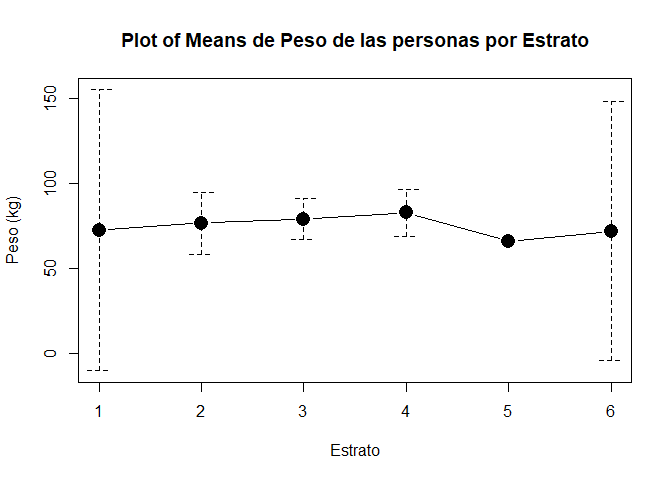</p>

```{r echo=FALSE, eval=FALSE}
## Instalar y cargar librerías
# install.packages("RcmdrMisc") # Instala librería RcmdrMisc
library(RcmdrMisc) # Carga la librería RcmdrMisc

## Construcción de diagrama de caja y bigotes por categorías
# Recordar escribir en error.bars = "conf.int" porque por defecto se presenta un intervalo para el error estándar y no para dos desviaciones estándar.
plotMeans(response = datos$Peso, factor1 = datos$Estrato, error.bars = "conf.int", xlab = "Estrato", ylab = "Peso (kg)", main = "Plot of Means de Peso de las personas por Estrato")
```

<h3 data-toc-skip> Interpretación </h3> 

<p>A diferencia del gráfico de caja y bigotes, el gráfico de medias muestra el valor promedio del conjunto de observaciones por cada grupo de interés, junto con sus respectivos intervalos de confianza del $95\%$ para la media, para poder observar si hay diferencias significativas entre una categorías y otra.<br>
<br>
Del gráfico anterior, se evidencia que el peso promedio de las personas se encuentra alrededor de $75$ kg, siendo el estrato $4$ el que presenta un mayor promedio con un valor cercano a $80$ kg, y el estrato $5$ el que presenta un menor promedio con un valor cercano a $65$ kg. Es de anotar que el estrato $5$ no posee bandas de confianza debido a que dicho estrato solo cuenta con una observación, y en consecuencia no posee medidas de variabilidad.<br>
<br>
Aunque hay una pequeña diferencia entre la media de los estratos, no es posible hablar sobre que las diferencias son significativas, ya que se tiene que las bandas de confianza de cada estrato se traslapan unos con otros.
</p>

</main>

#### Gráfico de dispersión
Este gráfico se emplea para hacer cruces entre dos variables cuantitativas, las cuales pueden ser diferenciadas por una cualitativa, mediante el cambio de colores. Este **sirve para ver tendencias, diferencias entre clases, relaciones entre dos variables cuantitativas, y permite apreciar donde se centra el total de observaciones dados dos atributos cuantitativos**. Este gráfico puede ser realizado mediante la función <tt>plot()</tt> de la librería <tt>graphics</tt> de <tt>R</tt>.

Para diferenciar los colores usados en el gráfico, es posible establecerse las categorías mediante la función <tt>legend()</tt> de la librería <tt>graphics</tt> de la base de <tt>R</tt>.

<button id="Show28" class="btn btn-secondary">Mostrar gráfico de dispersión por categorías en <tt>R</tt></button>
<button id="Hide28" class="btn btn-info">Ocultar gráfico de dispersión por categorías en <tt>R</tt></button>
<main id="botoncito28"> 

<h3 data-toc-skip> Gráfico de dispersión por categorías </h3> 

<section class="language-r highlighter-rouge"><section class="highlight"><pre class="highlight"><code><span class="kc">plot</span><span class="p">(</span><span class="n">x</span><span class="w"> </span><span class="o">=</span><span class="w"> </span><span class="n">datos</span><span class="o">$</span><span class="n">Edad</span><span class="p">,</span><span class="w"> </span><span class="n">y</span><span class="w"> </span><span class="o">=</span><span class="w"> </span><span class="n">datos</span><span class="o">$</span><span class="n">Altura</span><span class="p">,</span><span class="w"> </span><span class="n">xlab</span><span class="w"> </span><span class="o">=</span><span class="w"> </span><span class="s2">"Edad (años)"</span><span class="p">,</span><span class="w"> </span><span class="n">ylab</span><span class="w"> </span><span class="o">=</span><span class="w"> </span><span class="s2">"Altura (m)"</span><span class="p">,</span><span class="w"> 
    </span><span class="n">main</span><span class="w"> </span><span class="o">=</span><span class="w"> </span><span class="s2">"Edad vs Altura"</span><span class="p">,</span><span class="w"> </span><span class="n">pch</span><span class="w"> </span><span class="o">=</span><span class="w"> </span><span class="m">19</span><span class="p">,</span><span class="w"> </span><span class="n">col</span><span class="w"> </span><span class="o">=</span><span class="w"> </span><span class="n">datos</span><span class="o">$</span><span class="n">DeporFavorito</span><span class="p">)</span><span class="w">
</span><span class="kc">legend</span><span class="p">(</span><span class="s2">"bottomright"</span><span class="p">,</span><span class="w"> </span><span class="n">legend</span><span class="w"> </span><span class="o">=</span><span class="w"> </span><span class="n">levels</span><span class="p">(</span><span class="n">datos</span><span class="o">$</span><span class="n">DeporFavorito</span><span class="p">),</span><span class="w"> </span><span class="n">col</span><span class="w"> </span><span class="o">=</span><span class="w"> </span><span class="m">1</span><span class="o">:</span><span class="m">4</span><span class="p">,</span><span class="w"> </span><span class="n">pch</span><span class="w"> </span><span class="o">=</span><span class="w"> </span><span class="m">19</span><span class="p">)</span><span class="w">
</span></code></pre></section></section>

<p></p>

```{r echo=FALSE, eval=FALSE}
plot(x = datos$Edad, y = datos$Altura, xlab = "Edad (años)",
     ylab = "Altura (m)", main = "Edad vs Altura", pch = 19, col = datos$DeporFavorito)
legend("bottomright", legend = levels(datos$DeporFavorito), col = 1:4, pch = 19)
```

<h3 data-toc-skip> Interpretación </h3> 

<p>En el gráfico de dispersión anterior, se muestran un cruce entre la Altura y la Edad de las personas encuestadas, estableciendo categorías por los deporte favorito de las personas. En este gráfico no se observa ninguna tendencia para ninguno de los deportes de evaluados, en donde, especial atención debe tenerse con Tenis y Voleibol debido a que el primer deporte posee solo dos puntos, mientras que el segundo deporte posee un solo punto, así que no tiene mucho sentido hablar de tendencias en estos dos casos.<br>
<br>
Adicionalmente en dicho gráfico, no es posible hablar de observaciones atípicas o datos atípicos, pues no se evidencian puntos que se encuentren por fuera de los límites normales de Peso o Edad de una persona. Tampoco es posible hablar de una conglomeración de datos debido la alta dispersión que se ve entre los puntos.
</p>

</main>


## Referencias
<h7 id="ref-Chambers1983"></h7>
<h7 id="ref-Hernandez2018"></h7>
<h7 id="ref-Mcgill1978"></h7>

