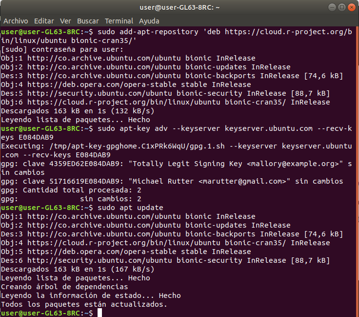
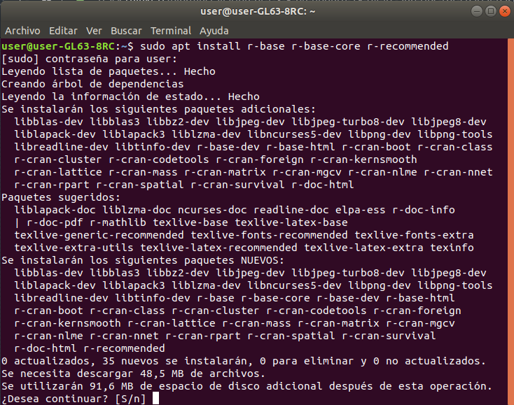
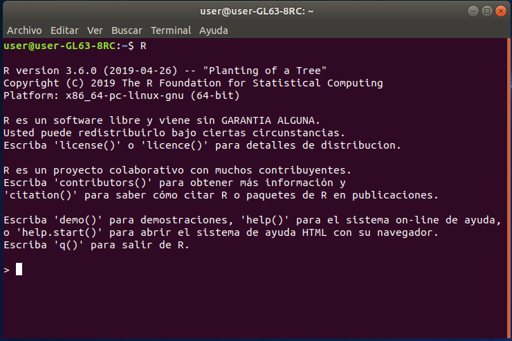
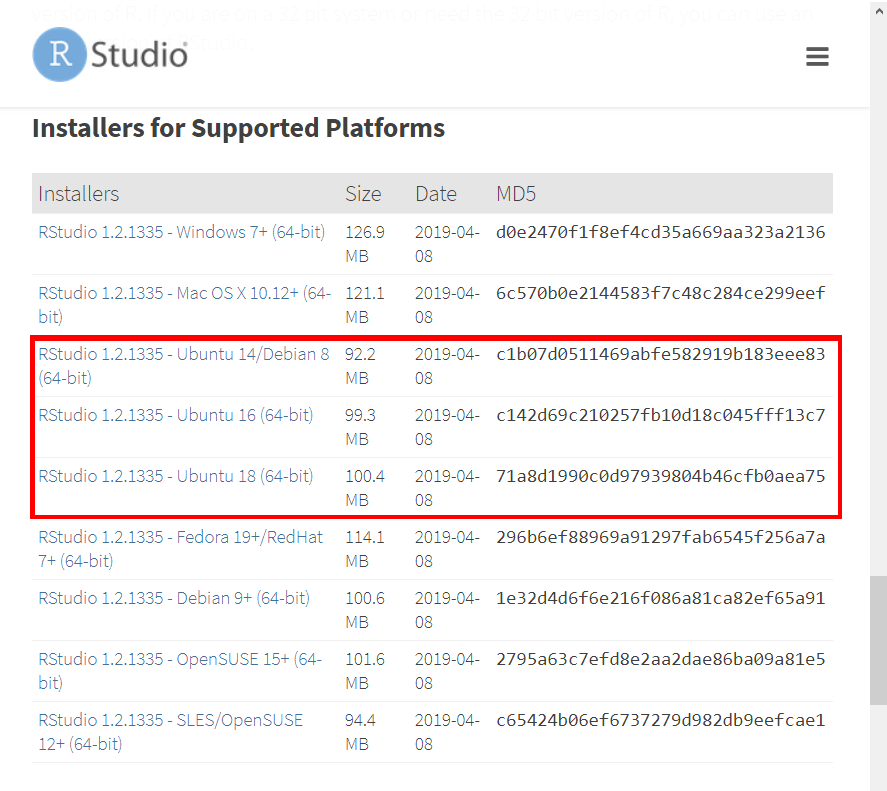
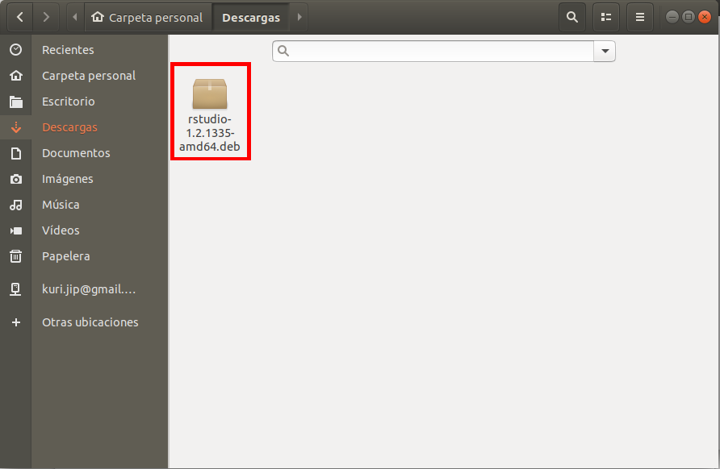
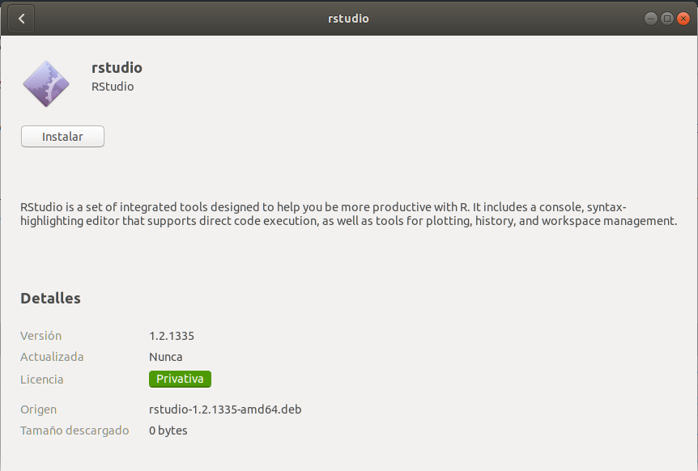
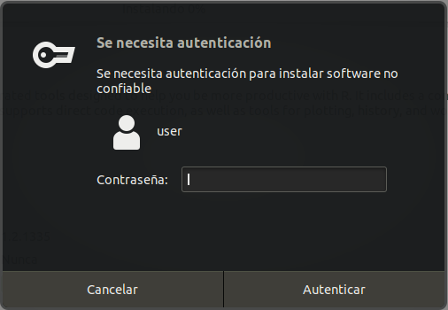
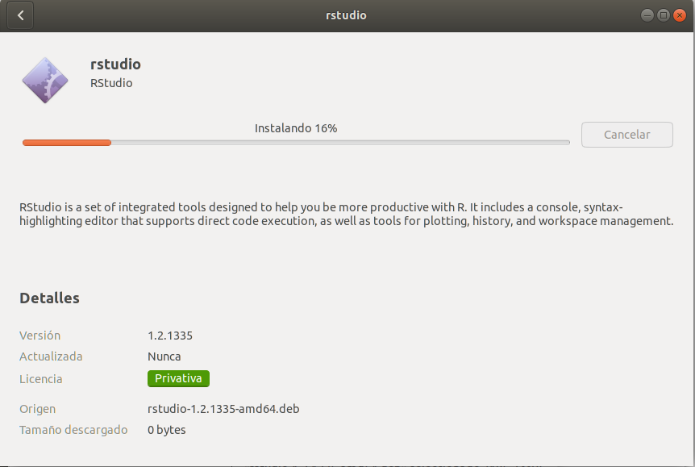

```{r knitr_init, echo=FALSE, cache=FALSE}
library(knitr)
## Global options
opts_chunk$set(echo=TRUE,
               cache=TRUE,
               prompt=FALSE,
               tidy=TRUE,
               comment=NA,
               message=FALSE,
               warning=FALSE,
               fig.path = paste0("../../SemilleroRyPython/images/", "GuiaUbuntu"),
               cache.path = "../../SemilleroRyPython/cache/",
               cache = FALSE)

```

## Instalación del programa R

Para la descarga de la última versión del programa R-project en Ubuntu, es necesario abrir una terminal, y escribir en ésta, las siguientes lineas de código

```
sudo add-apt-repository 'deb https://cloud.r-project.org/bin/linux/ubuntu bionic-cran35/'
sudo apt-key adv --keyserver keyserver.ubuntu.com --recv-keys E084DAB9
sudo apt update
```


en caso de tener problemas con la segunda linea de código, probar con 

```
sudo apt-key adv --keyserver hkp://keyserver.ubuntu.com:80 --recv-keys E084DAB9
```

una vez terminada la actualización, se escribe en la terminal la siguiente línea de código

```
sudo apt install r-base r-base-core r-recommended
```



Cuando se le pregunte si desea continuar, escriba la tecla S, presione la tecla Enter y espere hasta que termine la instalación. Para iniciar el programa <tt>R-project</tt>, abra una terminal y escriba la siguiente linea de código

```
R
```


## Instalación RStudio
Para la descarga de la última versión del programa Rstudio, haga click en el siguiente enlace [(Descargar RStudio)](https://www.rstudio.com/products/rstudio/download/#download){:target="_blank"}.

Una vez realizado click en el enlace, se abrirá la siguiente venta




Haga click sobre la versión de Rstudio que sea compatible con su sistema operativo para que comience la descarga. 



Una vez completada la descarga, vaya a la carpeta de descargas y haga doble click sobre el instalador para que ésta inicie



En la ventana emergente, presione el botón de Instalar para que inicie la descarga



Esto generará una ventana de autenticación, ingrese la contraseña del usuario correspondiente a la sección en donde va a realizar la instalación



Luego de ésto, comenzará la instalación, espere a que el proceso termine y con ésto concluirá la instalación del programa.
