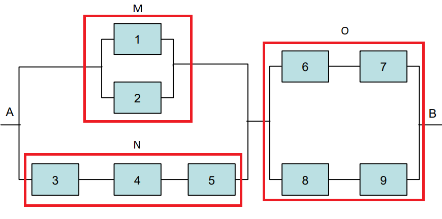

<!-- Eliminar o modificar ejercicio del sombrero!!!-->

Lista de ejercicios
===================

1.  Suponga que usted tienen `$12$` juegos diferentes de Nintendo
    Switch, y desea ponerlos sobre una repisa nueva que compró.
    -   De cuantas formas puede organizar los juegos?
    -   Si entre los `$12$` juegos, hay `$3$` RPG, `$4$` de Aventura,
        `$2$` de Puzzle y `$3$` de deportes, de cuantas formas puede
        organizar los juegos si solo importa el género del video juego?
2.  Un moneda esta cargada de tal forma que la probabilidad de que
    aparezca cara es tres veces mayor a que aparezca sello. Si se decide
    lanzar la moneda tres veces, cuál es la probabilidad de sacar al
    menos dos caras?
3.  Suponga un juego en donde se lanza un dado cargado de tal forma que
    la probabilidad de que caiga cualquier cara, es proporcional al
    número de puntos que le falta a la cara para sumar 6. ¿Cuál es la
    probabilidad de que al lanzar el dado salga un número impar?
4.  Sea el espacio muestral `$S = \{x | 1 < x < 12\}$` definido como el
    rango de tiempo que puede tardar cualquier estudiante en realizar un
    trabajo de la universidad. Suponga que se tienen tres tipos de
    estudiantes, el evento `$X = \{x | 1 < x < 3\}$` representa el
    tiempo que tardan los estudiantes que estudiaron más de `$5$` horas,
    el evento `$Y = \{x | 1.5 < x < 8\}$` representa el tiempo que
    tardan los estudiantes que estudiaron entre `$2$` y `$5$` horas, y
    `$Z = \{x | 7 < x < 12\}$`, el tiempo que tardan los estudiantes que
    estudiaron menos de `$2$` horas. Dado lo anterior, encuentre e
    interprete en lo posible los siguientes eventos.
    -   `$X \cup Y$`
    -   `$X \cap Y$`
    -   `$X'\cap Z$`
    -   `$X' \cup Z'$`
    -   `$X' \cap Y'$`
    -   `$Z' \cup Y$`
5.  Para un examen de Estadística I a las `$6$`AM, un estudiante
    programa un despertador, el cual sabe que consigue despertarlo el
    `$80\%$` de las veces. Además, sabe que si escucha sonar el
    despertador, la probabilidad de que llegue a tiempo al examen es del
    `$90\%$`, mientras que, si no lo escucha, la probabilidad de llegue
    a tiempo al examen es del `$50\%$`.
    -   Si el estudiante llega a tiempo al examen, ¿Cuál es la
        probabilidad de que haya escuchado el despertador?
    -   Si el estudiante no llega a tiempo al examen, ¿Cuál es la
        probabilidad de que no haya escuchado el despertador?
6.  En la facultad de Química de la UdeA, adelantan un estudio para
    saber si usar vapeadores puede afectar el tiempo de descanso de los
    estudiantes universitarios. Para realizar dicho estudio, la facultad
    de Química realiza una medición del tiempo de sueño, en minutos, de
    `$12$` estudiantes que usan vapeador y `$15$` estudiantes que no
    usan vapeador. Se obtienen los siguientes datos:
    `\begin{align*}      \text{No usan vapeador: }       & \text{369.3  356.0  322.1  347.6 }\\                              & \text{353.2  348.1  352.7  334.4 }\\                              & \text{360.2  343.8  323.2  313.8 }\\      \text{Usan vapeador: }  & \text{328.6  235.1  326.4  334.9 }\\                              & \text{329.8  328.4  338.5  330.2 }\\                              & \text{330.6  331.8  341.6  321.1 } \\                              & \text{336.0  337.9  313.9} \end{align*}`
    -   Calcule el tiempo promedio de sueño para cada grupo e
        interprete.
    -   Calcule la desviación estándar para cada grupo. Cuál tiene mayor
        dispersión? Qué significa esto?.
    -   Comente qué clase de efecto parece tener el hecho de usar vapeor
        sobre el tiempo de descanso de los estudiantes.
7.  Suponga que se descubre que, en un grupo de `$500$` estudiantes
    universitarios de último año, `$210$` fuman, `$258$` consumen
    bebidas alcohólicas, `$216$` comen entre comidas, `$122$` fuman y
    consumen bebidas alcohólicas, `$83$` comen entre comidas y consumen
    bebidas alcohólicas, `$97$` fuman y comen entre comidas y `$52$`
    tienen esos tres hábitos nocivos para la salud. Si se selecciona al
    azar a un miembro de este grupo, escriba el evento de interés y
    calcule la probabilidad de que el estudiante
    -   fume, pero no consuma bebidas alcohólicas
    -   coma entre comidas y consuma bebidas alcohólicas pero no fume
    -   no fume ni coma entre comidas.
8.  Una Lotería consiste en acertar `$6$` de `$45$` números, y una serie
    que consta de un número del `$1 \text{ al } 6$`. Calcule la
    probabilidad de acertar el resultado ganador bajo las siguientes
    condiciones de juego.
    -   Teniendo en cuenta el orden en que aparezca el número ganador.
    -   Sin tener en cuenta el orden.
9.  La proporción de personas que estudia para el examen de Estadística
    I desde la página del profe es del `$54\%$`. Si la persona estudia
    de la página, tiene una probabilidad del `$85\%$` de ganar el
    examen; si no estudia de la página, la probabilidad de ganar el
    examen es del `$18\%$`. Si se selecciona un estudiante al azar y
    resulta que lo perdió el examen, ¿Cuál la probabilidad de que haya
    estudiado de la página del profe?  
10. Un determinado circuito electrónico está compuesto por nueve
    componentes conectados según se muestra a continuación
     la probabilidad de que
    funcione cada componente es del `$95\%$`. El circuito funcionará si
    es posible encontrar un camino entre `$A$` y `$B$`. Se supone que la
    probabilidad de que funcione cada componente es independiente de los
    demás. A partir de la información anterior calcule
    -   ¿Cuál es la probabilidad de que funcione el subsistema M?
    -   ¿Cuál es la probabilidad de que funcione el subsistema N?
    -   ¿Cuál es la probabilidad de que no funcione el subsistema O?
    -   ¿Cuál es la probabilidad de que haya comunicación entra A y B?
11. Suponga que para poder graduarse en la facultad de Ciencias
    Económicas un los estudiantes pueden optar por tomar `$6$` niveles
    de ingles o francés. Si tomamos un determinado curso de la facultad,
    observamos que el `$90\%$` de los alumnos está matriculado en cursos
    de ingles y el resto de francés. Además, se identifica que el
    `$30\%$` de los que tienen cursos de ingles son hombres y el
    `$40\%$` de los que tienen cursos de francés son mujeres. Si se
    selecciona un estudiante de la facultad al azar, ¿Cuál es la
    probabilidad de que sea una mujer?.
12. Suponga que usted desea realizar un diagrama de pastel para una
    presentación, y posee un total de `$6$` categorías para realizar la
    gráfica.
    -   De cuantas formas puede usted organizar las categorías?
    -   Si dos categorías no pueden estar juntas, de cuantas formas
        puede organizar las categorías?
13. Una fraternidad local está realizando una rifa en la que se han de
    vender `$50$` boletas, una por cliente. Hay tres premios para ser
    concedidos. Si los cuatro organizadores de la rifa compran un boleto
    cada uno, ¿cuál es la probabilidad de que los cuatro organizadores
    ganen
    -   todos los premios?
    -   exactamente dos de los premios?
    -   exactamente uno de los premios?
    -   ninguno de los premios?
14. Un grupo asesor `$A$` contiene `$3$` hombres y `$3$` mujeres. Otro
    grupo asesor `$B$` contiene `$3$` hombres y `$2$` mujeres. Se
    selecciona al azar un grupo y de él una persona al azar, si esta
    persona es un hombre, se selecciona otra persona del mismo grupo. Si
    la persona seleccionada es mujer, se selecciona otra persona del
    otro grupo. Si las dos personas seleccionadas son hombres, ¿Cuál es
    la probabilidad de que se haya seleccionado ambas del grupo asesor
    `$A$`?
15. Un estudio realizado para un supermercado clasifica los clientes en
    aquellos que visitan el establecimiento de una manera frecuente u
    ocasional, y en aquellos que adquieren regularmente, ocasionalmente
    o nunca productos alimenticios. La siguiente tabla presenta las
    proporciones correspondientes a cada uno de los seis grupos.
    <section style="font-family: 'Open Sans',sans-serif; margin-bottom: -3rem; margin-top: -3rem; font-size: 90%;">
    <table class="table table-striped" style="width: auto !important; margin-left: auto; margin-right: auto;">
    <thead>
    <tr>
    <th style="border-bottom:hidden; padding-bottom:0; padding-left:3px;padding-right:3px;text-align: center; " colspan="1">

    Frecuencia de

    </th>
    <th style="border-bottom:hidden; padding-bottom:0; padding-left:3px;padding-right:3px;text-align: center; " colspan="3">

    Adquisición de Productos

    </th>
    </tr>
    <tr>
    <th style="text-align:left;">
    Visita
    </th>
    <th style="text-align:left;">
    Regular
    </th>
    <th style="text-align:left;">
    Ocasional
    </th>
    <th style="text-align:left;">
    Nunca
    </th>
    </tr>
    </thead>
    <tbody>
    <tr>
    <td style="text-align:left;">
    Frecuente
    </td>
    <td style="text-align:left;">
    0.12
    </td>
    <td style="text-align:left;">
    0.48
    </td>
    <td style="text-align:left;">
    0.19
    </td>
    </tr>
    <tr>
    <td style="text-align:left;">
    Infrecuente
    </td>
    <td style="text-align:left;">
    0.07
    </td>
    <td style="text-align:left;">
    0.06
    </td>
    <td style="text-align:left;">
    0.08
    </td>
    </tr>
    </tbody>
    </table>
    </section>

    -   ¿Cual es la probabilidad de seleccionar un cliente que visite
        frecuentemente el supermercado y compre regularmente productos
        alimenticios?
    -   ¿Cuál es la probabilidad de que se seleccione un cliente nunca
        compre productos alimenticios?
    -   ¿Cuál es la probabilidad de seleccionar un cliente que nunca
        compra productos alimenticios, si se sabe que visita el
        supermercado frecuentemente?
    -   ¿Son independientes los sucesos “nunca compra productos
        alimenticios” y “visita el supermercado frecuentemente”?
    -   ¿Cuál es la probabilidad de seleccionar un cliente que visite el
        establecimiento frecuentemente o un cliente que nunca compre
        productos alimenticios?

16. Suponga que existen dos enfermedades `$A$` y `$B$`, que son comunes
    entre las personas que estudian Biología debido a las salidas de
    campo que realiza. Si se supone que el `$50\%$` de los Biologos
    contrae la enfermedad `$A$` alguna vez durante su vida, `$60\%$`
    contrae eventualmente la enfermedad `$B$` y el `$10\%$` no contraerá
    ninguna enfermedad. ¿Cuál La probabilidad de que un Biologo
    contraiga ambas enfermedades durante su vida?
17. Un experimento incluye lanzar un par de dados y observar los números
    de sus caras superiores.
    -   Encuentre el número de puntos muestrales en el espacio muestral
        para el experimento, si no se tiene en cuenta que los dos dados
        saquen el mismo resultado.
    -   Cuál es la probabilidad de que el número obtenido en los dos
        dados sea igual?
18. Un estudiante vive en un pueblo aledaño del Valle de Aburrá, y sólo
    cuenta con dos rutas de transporte para poder llegar a Caldas. Una
    vez llega a Caldas posee tres diferentes rutas para llegar al parque
    de San Antonio, y de allí puede seleccionar entre Metro o Bus para
    llegar a la UdeA. De cuantas formas podrías llegar a la UdeA desde
    su casa?

19. Si `$S$` representa el espacio muestral de todas las posibles cartas
    que pueden seleccionarse de un mazo de `$52$` cartas, `$A$`
    representa el evento de todos los números pares , `$B$` representa
    el evento de todas las letras, `$C$` representa el evento de obtener
    una carta roja y `$D` representa el evento de obtener un `$10$`
    rojo, una `$J$` negra o un `$5$` de cualquier color, diga con
    palabras a que conjuntos que corresponden a los siguientes eventos:
    -   `$A \cup C$`
    -   `$A \cap B$`
    -   `$C'$`
    -   `$(C' \cap D) \cup B$`
    -   `$(S \cap A)'$`
    -   `$A \cap C \cap D$`
20. Suponga que usted le pide el favor a un compañero de curso que lo
    inscriba en cierta materia. Si su compañero olvida hacer la
    inscripción a tiempo, la probabilidad de que usted consiga cupo para
    dicha asignatura es de sólo el `$4\%$`, en tanto que si su compañero
    hace la inscripción a tiempo, la probabilidad de que usted consiga
    cupo para dicha asignatura es del `$75\%$`. Usted está seguro en un
    `$85\%$` de que su compañero hará la inscripción a tiempo. Si usted
    obtuvo cupo, ¿Cuál la probabilidad de que su compañero no lo haya
    inscrito a tiempo?
21. La policía planea hacer respetar los límites de velocidad usando un
    sistema de radar en `$4$` diferentes puntos de la autopista. Las
    trampas de radar en cada uno de los sitios `$L_1$`, `$L_2$`, `$L_3$`
    y `$L_4$` operarán `$40\%$`, `$30\%$`, `$20\%$` y `$30\%$` del
    tiempo. Si una persona que excede el límite de velocidad cuando va a
    su trabajo tiene probabilidades del `$20\%$`, `$10\%$`, `$50\%$` y
    `$20\%$`, respectivamente, de pasar por esos lugares. Si pasa un
    carro cualquiera por la autopista, ¿Cuál es la probabilidad de que
    reciba una multa por conducir con exceso de velocidad?
22. Basado en su experiencia, un agente bursátil considera que en las
    condiciones económicas actuales la probabilidad de que un cliente
    invierta en bonos libres de impuestos es `$0.6$`, la de que invierta
    en fondos comunes de inversión es `$0.3$` y la de que invierta en
    ambos es `$0.15$`. En esta ocasión encuentre la probabilidad de que
    un cliente invierta
    -   en bonos libres de impuestos o en fondos comunes de inversión
    -   en ninguno de esos dos instrumentos
23. Si el profesor pone `$10$` preguntas en el primer parcial y deja
    escoger `$8$` cualesquiera para que resuelvan, de cuantas formas
    pueden los estudiantes escoger las `$8$` preguntas?
24. Suponga una red de comunicaciones de cinco componentes conectados
    según se muestra a continuación
      
    la probabilidad de que funcione el componente C1 es del `$98\%$`, la
    de C2 es `$96\%$`, la de C3 es de `$83\%$`, la de C4 es de `$98\%$`
    y la de C5 es de `$90\%$`. La red funciona si entre A y B es posible
    encontrar un camino de componentes que funcione. Se supone que la
    probabilidad de funcionar cada componente es independiente de los
    demás. ¿Cuál es la probabilidad de que no haya comunicación entre A
    y B?
25. Si un experimento consiste en lanzar un dado y después extraen una
    letra al azar del alfabeto, ¿Cuántos puntos habrá en el espacio
    muestral?
26. De cuantas formas pueden acomodarse `$3$` bombillitos rojos, `$4$`
    amarillos y `$2$` azules en una instalación navidella que posee
    `$9$` entradas?
27. La probabilidad de sobrevivir a una cierta operación de trasplante
    es de `$0.55$`. Si un paciente sobrevive la operación, la
    probabilidad que su cuerpo rechace el trasplante en menos de un mes
    es de`$0.20$`. ¿Cuál es la probabilidad de que sobreviva a estas
    etapas críticas?
28. Un dado balanceado se tira seis veces y cada vez se registra el
    número de su cara superior, ¿Cuál es la probabilidad de que los
    números registrados sean `$1$`, `$2$`, `$3$`, `$4$`, `$5$` y `$6$`
    en cualquier orden?
29. De `$200$` empleados de una empresa, `$70$` poseen automóvil. Además
    se sabe que de éstos, hay `$120$` profesionales, de los cuales
    `$50$` tienen automóvil. Si se escoge una persona al azar de las
    `$200$` y ésta posee automóvil, ¿Cuál es la probabilidad de que sea
    profesional?
30. Un alergólogo afirma que `$30\%$` de los pacientes que examina son
    alérgicos a algún tipo de hierba. ¿Cuál es la probabilidad de que…
    -   exactamente `$3$` de sus `$4$` pacientes siguientes sean
        alérgicos a hierbas?
    -   ninguno de sus `$4$` pacientes siguientes sea alérgico a
        hierbas?
31. Suponga que una familia sale de vacaciones de verano en su casa
    rodante. Si `$M$` es el evento de que sufrirán fallas mecánicas,
    `$T$` es el evento de que recibirán una infracción por cometer una
    falta de tránsito y `$V$` es el evento de que llegarán a un lugar
    para acampar que esté lleno. Basado en el siguiente diagráma de Venn
     liste los números de las
    regiones que representan los siguientes eventos
    -   La familia no experimentará fallas mecánicas y no será multada
        por cometer una infracción de tránsito, pero llegará a un lugar
        para acampar que está lleno.
    -   La familia experimentará tanto fallas mecánicas como problemas
        para localizar un lugar disponible para acampar, pero no será
        multada por cometer una infracción de tránsito.
    -   La familia experimentará fallas mecánicas o encontrará un lugar
        para acampar lleno, pero no será multada por cometer una
        infracción de tránsito.
    -   La familia no llegará a un lugar para acampar lleno.
32. Una flota de `$9$` taxis se ha de despachar a `$3$` aeropuertos en
    forma tal que `$3$` vayan al aeropuerto A, `$5$` al aeropuerto B y
    `$1$` al aeropuerto C. ¿En cuántas formas distintas se puede lograr
    esto?
33. En un grupo de `$100$` estudiantes de bachillerato que están
    cursando el último año, `$42$` cursaron matemáticas, `$68$`
    psicología, `$54$` historia, `$22$` matemáticas e historia, `$25$`
    matemáticas y psicología, `$7$` historia pero ni matemáticas ni
    psicología, `$10$` las tres materias y `$8$` no cursaron ninguna de
    las tres. Seleccione al azar a un estudiante de este grupo y calcule
    la probabilidad de los siguientes eventos:
    -   Una persona inscrita en psicología y cursa las tres materias
    -   Una persona que no está inscrita en psicología y esté cursando
        historia y matemáticas.
34. De un grupo de `$9$` estudiantes, se tiene que `$6$` estudian
    Economía y `$3$` estudian Administración de Empresas. De cuantas
    formas se puede enviar a `$3$` estudiantes de Economía y `$2$` de
    Administración de Empresas para un congreso en Finanzas.
35. La probabilidad de que una industria estadounidense se ubique en
    Shanghái, China, es `$0.7$`, la probabilidad de que se ubique en
    Beijing, China, es `$0.4$` y la probabilidad de que se ubique en
    Shanghái o Beijing, o en ambas ciudades, es `$0.8$`. ¿Cuál es la
    probabilidad de que la industria se ubique…
    -   en ambas ciudades?
    -   en ninguna de esas ciudades?
36. Un testigo de un accidente automovilístico le dijo a la policía que
    la matrícula del culpable, que huyó, contenía las letras `$RLH$`
    seguidas por `$3$` dígitos, de los cuales el primero era un `$5$`.
    Si el testigo no recuerda los `$2$` últimos dígitos, pero está
    seguro de que los `$3$` eran distintos, calcule la cantidad máxima
    de registros de automóviles que la policía tendría que revisar.
37. Un fabricante de neumáticos quiere determinar el diámetro interior
    de un neumático de cierto grado de calidad, en donde, sabe que
    idealmente el diámetro debería ser de `$570$` mm. Suponga que el
    fabricante tiene los siguientes datos:
    `\begin{align*} 572, 573, 572, 568, 569, 575, 565, 570, 571, 562, 565, 572       \end{align*}`
    -   Calcule la media, la mediana y la moda de la muestra e
        interprete en base al enunciado.
    -   Obtenga la varianza, la desviación estándar y el rango
        intercuartílico de la muestra.
    -   Obtenga los coeficientes de asimetría y curtosis.
    -   Con base en los estadísticos calculados en los incisos a) y b),
        ¿qué comentaría acerca de la calidad de los neumáticos?
38. Dos monedas una balanceada y otra con dos sellos son colocadas en un
    sombrero. Se selecciona al azar una moneda y se lanza al aire. Si la
    cara superior es sello, ¿cuál es la probabilidad de que la cara
    oculta sea cara?
39. Un experimento consiste en lanzar un dado. Si el número en el dado
    es par, se lanzar una moneda una vez. Si el número en el dado es
    impar, la moneda se lanza dos veces.
    -   Construya un diagrama de árbol para mostrar los elementos del
        espacio muestral `$S$`.
    -   Calcule la probabilidad de obtener un `$5$` en el dado, seguido
        de dos caras de la moneda.
    -   Calcule la probabilidad de obtener un número par en el dado,
        seguido de un sello de la moneda.
40. Un banco ha comprobado que uno de cada `$1000$` clientes con fondos
    expide un cheque con fecha equivocada. En cambio, todo cliente sin
    fondos pone una fecha errónea en sus cheques. El `$90\%$` de los
    clientes del banco tienen fondos. Se recibe hoy en caja un cheque
    con fecha equivocada. ¿Cuál es la probabilidad de que sea de un
    cliente sin fondos?
41. Resuelva
    -   ¿De cuántas maneras se pueden formar `$6$` personas para abordar
        un autobús?
    -   ¿Cuántas maneras son posibles si, de las `$6$`, `$3$` personas
        específicas insisten en formarse una después de la otra?
    -   ¿De cuántas maneras se pueden formar si, de las `$6$`, `$2$`
        personas específicas se rehúsan a formarse una detrás de la
        otra?
