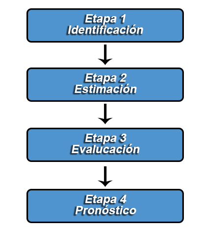

Introducción a la metodología Box-Jenkins
-----------------------------------------

Hasta ahora se ha venido trabajando y analizando series de tiempo desde
el punto de vista determinístico o clásico, y a partir de ahora, el
objetivo será, analizar las series de tiempo desde un punto de vista
estocástico o moderno, que utiliza métodos más complejos y en general,
requiere de series más largas para su aplicación (se recomienda tener
como mínimo 50 observaciones).

Para ello, se emplea la metodología conocida como Box-Jenkins, la cual
se basa en el análisis de las propiedades probabilísticas o estocásticas
de las series de tiempo, desarrollando modelos estadísticos que **tienen
en cuenta la dependencia existente entre el conjunto de datos**, es
decir, considera la relación entre cada observación en un momento dado
del tiempo y sus valores anteriores, permitiendo modelar el
comportamiento presente en función de valores pasado.

Es de anotar que, para la aplicación de la metodología Box-Jenkins **se
requiere que las series temporales sean estacionarias**, y por tanto, se
recomienda verificar que dicha condición se cumpla, ya que de no
cumplirse dicha condición, se hace necesario la aplicación de
transformaciones necesarias para que la serie adquiera un comportamiento
estacionario.

Una vez garantizada la condición de estacionaridad, la metodología
Box-Jenkins se basa en la aplicación de un modelo general conocido por
las siglas en inglés de **ARIMA**(p,d,q) (Auto-Regresivo Integrado de
Media Móvil), a partir del cual se derivan los modelos **AR**(p)
(Autor-Regresivo), **MA**(q) (Media Móvil), **ARMA**(p,q)
(Auto-Regresivo de Media Móvil), y obtenerse modelo más generales como
lo son los modelos **SARIMA**(p,d,q)(P,D,Q)\[s\] (Estacional
Auto-Regresivo Integrado de Media Móvil) y **SARMA**(p,q)(P,Q)\[s\]
(Estacional Auto-Regresivo de Media Móvil).

Para la aplicación de la metodología Box-Jenkins, es necesario seguir
las siguientes cuatro etapas:

### Identificación

La fase de identificación consiste en determinar el tipo de **proceso
estocástico** que ha generado los datos, para decidir cuál es el modelo
más apropiado para la etapa de estimación.

Para poder decidir cuál es el modelo más apropiado, es necesario que la
serie de tiempo sea estacionaria. De no ser estacionaria, podría
requerirse el empleo de **transformaciones** y/o **diferenciaciones**
para convertir la serie original a una serie estacionaria. A partir del
proceso de diferenciación es posible identificar el orden *d*, del
modelo a estimar.

Una vez obtenida una serie estacionaria, se emplean las dos herramientas
fundamentales para el proceso de identificación. A saber, la función de
autocorrelación muestral (**ACF**) y la función de autocorrelación
parcial muestral (**PACF**), las cuales ofrecen información sobre el
orden *p* y *q*, del modelo a estimar.

### Estimación

Luego de la etapa de identificación, se obtendrá información sobre los
ordenes *p*, *d* y *q* del modelo, lo cual permitirá estimar los
coeficientes de los términos auto-regresivo, integrado y de medias
móviles incluidos en el modelo. Para la estimación del modelo se emplea
generalmente mínimos cuadrados ordinarios lineales, o no lineales.

Adicionalmente, es importante anotar que en la práctica puede llegar a
ser difícil identificar con exactitud el orden *p* y *q* del modelo, y
por tanto, es común plantear dos o más modelos plausibles, con el fin de
seleccionar posteriormente el modelo más apropiado.

### Evaluación

Esta etapa tiene por objetivo evaluar si el modelo estimado se ajusta a
los datos en forma razonablemente buena, ya que, como se mencionó, es
posible que hayan otros modelo que también ofrezcan un buen ajuste.

Entre los procedimientos que se realizan para la evaluación, validación
o verificación del modelo, se incluye el análisis de los coeficientes
del modelo (significancia de los coeficientes hasta los ordenes *p* y
*q*), las pruebas de bondad de ajuste (`$R^2$` ajustado, *AIC*, *BIC*,
*SC*, entre otros) y análisis de los residuos (comprobar que los
residuos no tienen estructura de dependencia y siguen un proceso de
**ruido blanco**).

En donde, si se evidencia que los residuales no son un proceso puramente
aleatorio, se requiere que se **modifique el modelo**, y por ello se
volverá a la etapa de identificación para reformular el modelo hasta que
los errores sigan un proceso puramente aleatorio.

### Pronóstico

Finalmente, una vez se obtiene el modelo más adecuado, es posible
realizar pronósticos para la serie, en donde, se debe resaltar que, si
la serie original fue diferenciada, ésta debe ser retornada a sus
valores originales, una vez los valores pronosticados son calculados,
para así obtener los valores reales pronosticados.

Conceptos básicos de procesos estocásticos
------------------------------------------

Un proceso estocástico es una sucesión de variables aleatorias
{`$Y_t:t\in\mathbb{Z}^+$`}, indexadas para un conjunto `$t$`, el cual
pertenece a un **espacio parametral** `$\mathbb{Z}^+$`, en donde cada
una de las variables aleatorias del proceso tienen su propia función de
distribución de probabilidad, y entre las cuales puede o no existir
correlaciones entre si.

Partiendo de esta definición, una serie de tiempo, puede definirse como
una sucesión de observaciones generadas al tomar un único valor de cada
una de las variables aleatorias `$Y_t$`, que conforman el proceso
estocástico. En donde, para la realización del modelamiento estadístico
de una serie de tiempo, es necesario identificar la estructura
probabilística del proceso estocástico al que corresponde la serie, y
para ésto, es necesario conocer la distribución conjunta de las
variables que conforman la serie de tiempo, **lo cual es difícilmente
posible, ya que para ello, se requeriría de múltiples realizaciones del
proceso estocástico!!**.

Debido a ello, y con el fin de dar una salida al problema, **se supone**
que cada variable aleatoria `$Y_t \sim N(\mu_t,\sigma_t^2)$` y que
`$\mathbf{Y}\sim N_T(\boldsymbol{\mu}, \boldsymbol{\Sigma})$`, siendo
`$\mathbf{Y}=(Y_1,Y_2,\ldots,Y_T)'$` un vector de variables aleatorias
que representa la variable aleatoria conjunta,
`$\boldsymbol{\mu}=(\mu_1,\mu_2,\ldots,\mu_T)$` un vector de esperanzas
que representa la esperanza de la variable aleatoria conjunta, y

`\begin{align*} \boldsymbol{\Sigma} =\begin{bmatrix}\sigma_{11} & \sigma_{12}  & \cdots  & \sigma_{1T} \\ \sigma_{21}  & \sigma_{22}  & \cdots  & \sigma_{2T} \\ \vdots  & \vdots  & \ddots  & \vdots \\ \sigma_{T1}  & \sigma_{T2} & \cdots  & \sigma_{TT} \end{bmatrix} \end{align*}`

la matriz de covarianzas de la variable aleatoria conjunta.

Procesos estacionarios en covarianza
------------------------------------

Un proceso es estacionario en sentido débil, estacionario de segundo
orden o estacionario en covarianza, es aquel proceso que cumple todas y
cada una de las siguientes tres condiciones:

1.  El proceso es estacionario en media
    `\begin{align*}  \mathbb{E}(Y_t)=\mu_t = \mu \text{ para todo } t=1,2,\ldots T \end{align*}`
2.  El proceso es estacionario en varianza
    `\begin{align*}  Var(Y_t)=\sigma_t^2=\sigma^2 \text{ para todo } t=1,2,\ldots T \end{align*}`
3.  La autocovarianza sólo depende de la distancia \(k\) de las
    observaciones en el tiempo de las variables del proceso
    `\begin{align*}  Cov(Y_t, Y_{t+k})=\gamma(k)= Cov(Y_{t-k}, Y_{t})=\gamma(-k) \end{align*}`
    donde, la función es simétrica alrededor de cero, con
    `$\gamma(0)=Var(Y_t)$`. En consecuencia de la tercer condición, se
    tendrá que la autocorrelación también sea una función simétrica
    alrededor de cero.
    `\begin{align*}  Cor(Y_t, Y_{t+k})=\rho(k)= Cor(Y_{t-k}, Y_{t})=\rho(-k) \end{align*}`

Otra propiedad importante que pueden cumplir los procesos estacionarios
en covarianza, son las **propiedades ergódicas**, las cuales se refieren
a que entre mayor sea la longitud de la serie de tiempo, mejores serán
las estimaciones de los parámetros estimados, es decir, los estimadores
calculados a partir del conjunto de observaciones muestrales serán
consistentes a los parámetros reales, a medida que aumenta el total de
datos.
<ol type="a">
<li>
\(\lim_{T\to\infty} \hat{\mu} = \mu\) donde
\(\hat{\mu} = \frac{1}{T}\sum_{t=1}^Ty_t\)
</li>
<li>
\(\lim_{T\to\infty} \hat{\sigma}^2 = \sigma^2\) donde
\(\hat{\sigma}^2 = \frac{1}{T-1}\sum_{t=1}^{T}(y_t-\hat{\mu})^2\)
</li>
<li>
\(\lim_{T\to\infty} \hat{\gamma}(k) = \gamma(k)\) donde
\(\hat{\gamma}(k) = \frac{1}{T-1}\sum_{t=1}^{T-k}(y_{t+k} - \bar{y})(y_{t} - \bar{y})\)
</li>
</ol>

Además, para que la condición de ergodicidad se cumpla, basta con que
`\begin{align*}  \lim_{k\to\infty} \rho(k) = 0 \end{align*}` con una
**velocidad rápida**, en donde, a medida que aumenta la distancia en el
tiempo entre las observaciones de la serie, disminuye la
autocorrelación.

**Nota:** Es de anotar que una serie **NO** puede ser estacionaria en
covarianza si presenta un componente de tendencia no constante, y/o si
presenta un componente estacional. Además, una serie tampoco es
estacional en covarianza, si se observa que la serie es heterocedástica,
es decir, si posee una varianza no constante.

<!-- Un proceso estacionario en covarianza en sentido fuerte requiere que la distribución conjunta de las variables aleatorias del proceso estocástico no cambie ante desplazamientos en el tiempo -->

Proceso de ruido blanco
-----------------------

Un proceso de ruido blanco `$\varepsilon_t$`, es un caso particular de
proceso estacionario en covarianza, el cual debe cumplir las siguientes
características:

1.  La media es constante e igual a cero
    `\begin{align*}  \mathbb{E}(\varepsilon_t)=\mu_t = 0 \text{ para todo } t=1,2,\ldots T \end{align*}`
2.  La varianza es constante
    `\begin{align*}  Var(\varepsilon_t)=\sigma_t^2=\sigma^2 \text{ para todo } t=1,2,\ldots T \end{align*}`
3.  La autocovarianza es cero, y en consecuencia también la
    autocorrelación es cero:
    `\begin{align*}  Cov(\varepsilon_t, \varepsilon_{t+k}) &=\gamma(k) = 0 \\  Cor(\varepsilon_t, \varepsilon_{t+k}) &=\rho(k) = 0 \end{align*}`
    para todo `$k\neq 0.$`

Función de autocorrelación (ACF)
--------------------------------

Tal como se definió en la [Clase
03](../../MuestreoySeriesdeTiempo/MySTClase_03.html){:target="\_blank"},
la ACF de una serie de valores `$Y_1,Y_2,\ldots, Y_T$`, puede definirse
como

`\begin{align*} Cor(Y_t,Y_{t+k}) = \hat{\rho(k)} = \frac{\hat{\gamma}(k)}{\hat{\gamma}(0)} = \frac{\sum_{t=1}^{T-k}(y_{t+k} - \bar{y})(y_{t} - \bar{y})}{\sum_{t=1}^{T}(y_t-\bar{y})^2} \end{align*}`

donde, `$\gamma(0)$` representa la varianza de la variable `$Y_t$`,
`$\gamma(k)$` la covarianza de entre las variables `$Y_t$` y
`$Y_{t+k}$`, siendo `$k$` el `$k$`-ésimo rezagos que se emplearán para
el cálculo de la `$k$`-ésima autocorrelación.

Cabe recordar, que **no se recomienda emplear valores de `$k$` muy
altos**, ya que ésto provocará que se tengan menos términos para el
cálculo de las autocorrelaciones. La selección del número de
autocorrelaciones puede llevarse a cabo arbitrariamente a partir de los
conocimientos del investigador, o mediante la regla empírica para el
número máximo de rezagos que deben seleccionarse
`$max(k)=\left\lceil\frac{T}{4}\right\rceil$`.

La importancia de la ACF en la metodología Box-Jenkins, radica en que
permite determinar si la serie de tiempo de interés, es o no un proceso
estacionario en covarianza, y por tanto, se emplea la siguiente prueba
de hipótesis para probar cuales autocorrelaciones son significativas
`\begin{align*}  H_0: \rho(k)=0 \\  H_1: \rho(k)\neq 0 \end{align*}`

con `$k = 1,2,\ldots, m$`. En donde, la autocorrelación `$k$` es
significativa si ésta se encuentra dentro de la región crítica, la cual
se construye con un nivel de significancia `$\alpha$` y asumiendo
normalidad, mediante la formula:
`\begin{align*} \pm Z_{\frac{\alpha}{2}}/\sqrt{T} \end{align*}`

en donde, valores `$|\hat{\rho}(k)|> Z_{\frac{\alpha}{2}}/\sqrt{T}$`
llevarán al rechazo de la hipótesis nula a favor de la alternativa.
También recuerde que, si ninguna de las autocorrelaciones es
significativamente diferente de cero, se dice que la serie es
esencialmente **ruido blanco**.

Función de autocorrelación parcial (PACF)
-----------------------------------------

A diferencia de la ACF, la PACF de una serie de tiempo, mide la
autocorrelación existente entre dos valores `$Y_t$` y `$Y_{t+k}$`, una
vez se elimina la dependencia lineal de los rezagos intermedios a ambos,
es decir, `$Y_{t+1}, Y_{t+2}, \ldots, Y_{t+k-1}$`.

Dado lo anterior, la PACF puede definirse como la correlación
condicional `$Cor(Y_{t},Y_{t+k}|Y_{t+1}, Y_{t+2}, \ldots, Y_{t+k-1})$`,
la cual se denotará como `$\phi_{kk}$`.

Para hallar el valor del coeficiente `$\phi_{kk}$` se hace necesario
conformar el siguiente sistema de ecuaciones de orden `$k\times k$`,
conocido como el **sistema de ecuaciones de Yule-Walker**, en donde
matricialmente se tiene que
`$\boldsymbol{\rho} = \boldsymbol{R}\boldsymbol{\phi}$`, lo cual es
equivalente a
`$\boldsymbol{\phi} = \boldsymbol{R}^{-1}\boldsymbol{\rho}$`, donde
`\begin{align*}  \boldsymbol{\rho} = \begin{bmatrix}\rho(1) \\ \rho(2) \\ \rho(3) \\ \vdots \\ \rho(k)  \end{bmatrix}_{k\times1} \boldsymbol{R} = \begin{bmatrix}1 & \rho(1) & \rho(2) & \cdots & \rho(k-1) \\ \rho(1) & 1 & \rho(1) & \cdots & \rho(k-2) \\ \rho(2) & \rho(1) & 1 & \cdots & \rho(k-3)\\ \vdots & \vdots & \vdots & \ddots & \vdots \\ \rho(k-1) & \rho(k-2) & \rho(k-3) & \cdots & 1 \end{bmatrix}_{k\times k}\phi= \begin{bmatrix}\phi_{k1} \\ \phi_{k2} \\ \phi_{k3} \\ \vdots \\ \phi_{kk}  \end{bmatrix}_{k\times1} \end{align*}`

Además, la matriz `$\boldsymbol{R}^{-1}$` puede ser calculada la formula
`\begin{align*} \boldsymbol{R}^{-1}=\frac{\text{adj}(\boldsymbol{R})}{\text{det}(\boldsymbol{R})} \end{align*}`

siempre y cuando `$\boldsymbol{R}$` sea invertible, donde
`$\text{adj}(\boldsymbol{R})$` es la matriz adjunta de
`$\boldsymbol{R}$` y `$\text{det}(\boldsymbol{R}^{-1})$` es el
determinante de `$\boldsymbol{R}$`.

Adicionalmente, y similar al caso de la ACF, **no se recomienda emplear
valores de `$k$` muy altos**, debido a la cantidad de términos que se
tendrán para el cálculo de las autocorrelaciones, y por ello, se
recomienda tener en cuenta nuevamente la regla empírica para el número
máximo de rezagos que deben seleccionarse
`$max(k)=\left\lceil\frac{T}{4}\right\rceil$`.

Para establecer si una autocorrelación parcial es o no significativa, es
necesario establecer la siguiente prueba de hipótesis
`\begin{align*}  H_0: \phi_{kk}=0 \\  H_1: \phi_{kk}\neq 0 \end{align*}`

para cada `$k = 1,2,\ldots, m$`. En donde, en donde, al igual que la
ACF, la región de rechazo de la hipótesis puede ser establecida a un
nivel de significancia `$\alpha$` y asumiendo normalidad, mediante la
formula: `\begin{align*} \pm Z_{\frac{\alpha}{2}}/\sqrt{T} \end{align*}`

en donde, el criterio de rechazo de `$H_0$` estará dado por la región
`$|\hat{\phi}_{kk}|> Z_{\frac{\alpha}{2}}/\sqrt{T}$`.

Finalmente, cabe resaltar que, mediante las autocorrelaciones parciales
es posible observar si una serie de tiempo es esencialmente **ruido
blanco**, ya que si se observa que para todo `$k$` se observa que la
PACF no es significativa, entonces es posible afirmar que el proceso es
**ruido blanco**.
