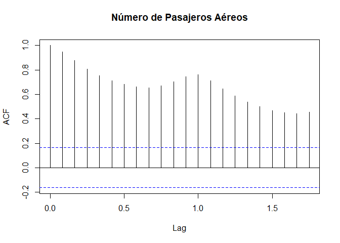
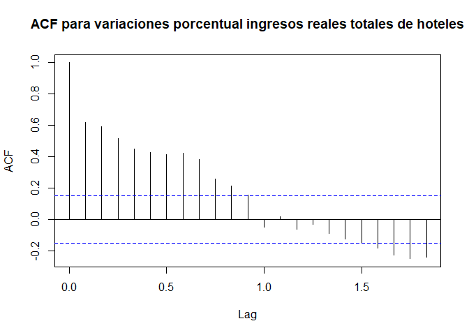
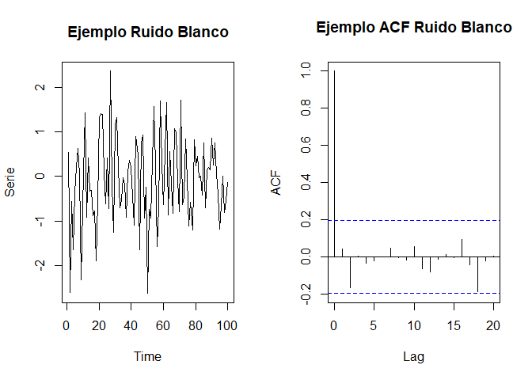
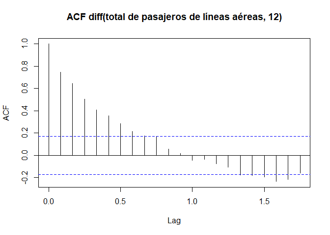
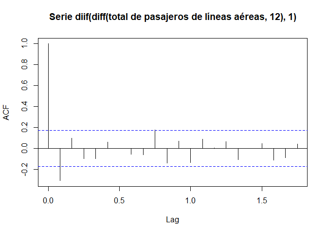

Modelo de descomposición
------------------------

Una vez separados los componentes que conforman una serie de tiempo, es
necesario analizar la forma en que se relacionan estos con la serie
original, puesto que al recombinar los componentes es posible obtener
una serie de tiempo completamente pronosticable.

Existen diferentes modelos matemáticos para expresar la serie original
`$Y_t$`, en términos de los componentes de tendencia `$T_t$`,
estacionalidad `$S_t$`, fluctuaciones cíclicas `$C_t$` y errores
`$\varepsilon_t$`, en donde, es posible ajustar la serie original a uno
solo uno de los cuatro componentes o es una combinación de todos ellos,
para la posterior realización de pronósticos. Para combinar los
componentes, se tienen dos clases básicas de modelos matemáticos

-   **Modelo aditivo:** `$Y_t = T_t + S_t + C_t + \varepsilon_t$`
-   **Modelo multiplicativo:** `$Y_t = T_t * S_t * C_t * \varepsilon_t$`

en donde, como se mencionó en la subsección anterior, las fluctuaciones
cíclicas `$C_t$` son el componente más difíciles de pronosticar, y por
tanto, son mezcladas con el componente de error `$\varepsilon_t$` o se
asume que son parte de la tendencia `$T_t$`. Entonces, el modelo aditivo
y multiplicativo, pueden ser reescritos como

-   **Modelo aditivo:** `$Y_t = T_t + S_t + \varepsilon_t$`
-   **Modelo multiplicativo:** `$Y_t = T_t * S_t * \varepsilon_t$`

Es de anotar que en el modelo aditivo se supone que los tres componentes
de la serie de tiempo son independientes entre sí, y es apropiado
emplearlo cuando la magnitud de las fluctuaciones estacionales de la
serie no varía al hacerlo la tendencia, es decir, la serie de tiempo
original tiene aproximadamente la misma variabilidad a lo largo de toda
la serie.

Mientras que, en el modelo multiplicativo se trabaja bajo el supuesto de
que los tres componentes de la serie de tiempo no son necesariamente
independientes, y es apropiados emplearlo cuando la magnitud de las
fluctuaciones estacionales de la serie crece y decrece proporcionalmente
con los crecimientos y decrecimientos de la tendencia, respectivamente,
es decir, los valores de la serie se dispersan conforme la tendencia
aumenta, o se reúnen conforme la tendencia disminuye.

Adicionalmente, se destaca que muy a menudo las series, a pesar de no
tener un comportamiento aditivo, pueden ser transformadas para ser
modeladas de forma aditiva. Un ejemplo de ello son los logaritmos
naturales, en donde, es posible convertir el modelo multiplicativo en un
modelo aditivo, ya que si

`\begin{align*} Y_t = T_t * S_t * \varepsilon_t \end{align*}`

entonces

`\begin{align*} log(Y_t) = log(T_t) + log(S_t) + log(\varepsilon_t) \end{align*}`

y por tanto, es posible realizar los pronosticos necesarios mediante una
transformación, y una vez obtenidos estos, retornar los valores a la
escala multiplicativa original.

Un aspecto importante, sobre los modelos aditivos y multiplicativos es
que, en el modelo aditivo siempre se asume que
`$\varepsilon_t\stackrel{iid}{\sim}N(0,\sigma^2)$`, mientras que para el
modelo multiplicativo, se sume que
`$\varepsilon_t\stackrel{iid}{\sim}lognormal(\mu=0,\sigma^2)$`, y por
tanto, mediante la transformación logaritmica del modelo multiplicativo
se tiene que `$log(\varepsilon_t)\stackrel{iid}{\sim}N(0,\sigma^2)$`.

Una alternativa para evaluar si los componentes de error son o no
normales, es mediante los gráficos `$QQ$`-plot de la distribución
Normal, y mediante la prueba Shapiro-Wilk. Éstas pueden realizarse en
<tt>R</tt> mediante las funciones `qqnorm()` y `shapiro.test()`,
respectivamente.

Existen algunas variantes para los modelos de descomposición básicos,
tales como

-   **Modelo mixto:** `$Y_t = T_t * S_t + \varepsilon_t$`
-   **Modelo pseudo-aditivo:** `$Y_t = T_t (S_t + \varepsilon_t - 1)$`

los cuales se emplean en situaciones específicas, como por ejemplo,
cuando la serie original posee fluctuaciones estacionales marcadamente
pronunciadas y un movimiento de ciclos de tendencia, que es
extremadamente dependiente del clima, o cuando la serie original posea
un mes (o trimestre) que es mucho más alto o más bajo que todos los
otros meses (o trimestres), respectivamente.

Clasificación descriptiva de las series de tiempo
-------------------------------------------------

Dadas las diferentes características que puede tener las series de
tiempo, podemos clasificar su comportamiento en

-   **Estacionaria:** Una serie es estacionaria cuando posee una media y
    varianza constantes en el tiempo, y en consecuencia, se observará
    que tiene un comportamiento estable, centrado sobre su valor
    promedio, con oscilaciones alrededor de este valor constante.
-   **No estacionaria:** Una series es no estacionaria cuando no posee
    una media ni una varianza constantes, y en consecuencia, se
    observará que su valor promedio tendrá una tendencia creciente o
    decreciente a largo plazo, con un comportamiento que no oscilará
    alrededor de un valor constante.

Identificación de componentes
-----------------------------

### Autocorrelación

Uno de los aspectos más importantes de la series de tiempo es que sus
observaciones no son independientes de sus observaciones pasadas, y por
ello, debe realizarse un análisis de dependencia o correlación entre las
observaciones y sus rezagos, el cual posee el nombre de análisis de
autocorrelación, correlación serial o covariación.

El objetivo será entonces, usar la estructura de correlación que posee
la serie temporal consigo misma, para tratar de explicar parte de su
variación, identificar si existe de forma analítica patrones repetitivos
que se encuentran enmascarados bajo el ruido y observar a partir de qué
rezago deja de ser significativo el efecto que tienen éstos sobre las
demás observaciones.

Con tal proposito en mente, en una serie de tiempo, se define la
varianza muestral de las observaciones como
`\begin{align*} Var(Y_t) = \hat{\gamma}(0) = \mathbb E(y_t - \bar{y})^2 = \frac{1}{T-1}\sum_{t=1}^{T}(y_t-\bar{y})^2 \end{align*}`

la autocovarianza muestral entre observaciones que se encuentran a `$k$`
periodos de tiempo de diferencia, como
`\begin{align*} Cov(Y_t,Y_{t+k}) = \hat{\gamma}(k) = \mathbb E[(y_{t+k} - \bar{y})(y_{t} - \bar{y})] = \frac{1}{T-1}\sum_{t=1}^{T-k}(y_{t+k} - \bar{y})(y_{t} - \bar{y}) \end{align*}`

y la autocorrelación muestral entre observaciones que se encuentran a
`$k$` periodos de tiempo de diferencia, como
`\begin{align*} Cor(Y_t,Y_{t+k}) = \hat{\rho(k)} = \frac{\hat{\gamma}(k)}{\hat{\gamma}(0)} = \frac{\sum_{t=1}^{T-k}(y_{t+k} - \bar{y})(y_{t} - \bar{y})}{\sum_{t=1}^{T}(y_t-\bar{y})^2} \end{align*}`

donde `$k$` es el número de rezagos o autocorrelaciones que se desean
calcular. Por tanto, no se recomienda emplear valores de `$k$` muy
altos, ya que ésto provocará que se tengan menos términos para el
cálculo de las autocorrelaciones.

La selección del número de autocorrelaciónes puede llevarse a cabo
arbitrariamente a partir de los conocimientos del investigador, o
mediante la regla empírica para el número máximo de rezagos que deben
seleccionarse `$max(k)=\left\lceil\frac{T}{4}\right\rceil$`.

Para facilitar la visualización e interpretación de la autocorrelación,
se emplea un gráfico conocido como correlograma o función de
autocorrelación **(ACF)**, la cual muestran la correlación que hay entre
observaciones separadas por `$k$` intervalos de tiempo o “lags”.

A continuación se presenta el correlograma del **total mensual de
pasajeros de líneas aéreas internacionales, para los años 1949 a 1960**

``` r
data(AirPassengers)  # Carga base de datos de AirPassengers
AP <- AirPassengers  # Guarda base de datos de AirPassengers
acf(AP, main = "Número de Pasajeros Aéreos")
```



<pre>
<!--html_preserve--><div id="htmlwidget-6e923de4f2d72510145e" style="width:700px;height:400px;" class="plotly html-widget"></div>
<script type="application/json" data-for="htmlwidget-6e923de4f2d72510145e">{"x":{"visdat":{"2ecc61703574":["function () ","plotlyVisDat"]},"cur_data":"2ecc61703574","attrs":{"2ecc61703574":{"alpha_stroke":1,"sizes":[10,100],"spans":[1,20],"x":{},"y":{},"type":"bar","width":0.2,"text":["Autocorrelación = 0.948047340752492","Autocorrelación = 0.87557483512535","Autocorrelación = 0.8066811554965","Autocorrelación = 0.752625417388308","Autocorrelación = 0.713769972651965","Autocorrelación = 0.681733603331004","Autocorrelación = 0.66290438636845","Autocorrelación = 0.655610484325087","Autocorrelación = 0.670948327924505","Autocorrelación = 0.702719920909072","Autocorrelación = 0.743240189006933","Autocorrelación = 0.760395042262556","Autocorrelación = 0.712660870403824","Autocorrelación = 0.646342279267753","Autocorrelación = 0.58592342386345","Autocorrelación = 0.537955190781562","Autocorrelación = 0.49974752598518","Autocorrelación = 0.468734012915087","Autocorrelación = 0.449870664976662","Autocorrelación = 0.441628795746046","Autocorrelación = 0.457223757114159"],"inherit":true}},"layout":{"width":700,"height":400,"margin":{"b":60,"l":60,"t":60,"r":30,"pad":4},"title":"ACF para el total<br />de pasajeros de líneas aéreas","xaxis":{"domain":[0,1],"automargin":true,"title":"Lags"},"yaxis":{"domain":[0,1],"automargin":true,"title":"ACF"},"shapes":[{"type":"line","x0":0,"x1":21,"y0":0.163330332045004,"y1":0.163330332045004,"line":{"dash":"dot"}},{"type":"line","x0":0,"x1":21,"y0":-0.163330332045004,"y1":-0.163330332045004,"line":{"dash":"dot"}}],"hovermode":"closest","showlegend":false},"source":"A","config":{"showSendToCloud":false},"data":[{"x":{},"y":[0.948047340752492,0.87557483512535,0.8066811554965,0.752625417388308,0.713769972651965,0.681733603331004,0.66290438636845,0.655610484325087,0.670948327924505,0.702719920909072,0.743240189006933,0.760395042262556,0.712660870403824,0.646342279267753,0.58592342386345,0.537955190781562,0.49974752598518,0.468734012915087,0.449870664976662,0.441628795746046,0.457223757114159],"type":"bar","width":[0.2,0.2,0.2,0.2,0.2,0.2,0.2,0.2,0.2,0.2,0.2,0.2,0.2,0.2,0.2,0.2,0.2,0.2,0.2,0.2,0.2],"text":["Autocorrelación = 0.948047340752492","Autocorrelación = 0.87557483512535","Autocorrelación = 0.8066811554965","Autocorrelación = 0.752625417388308","Autocorrelación = 0.713769972651965","Autocorrelación = 0.681733603331004","Autocorrelación = 0.66290438636845","Autocorrelación = 0.655610484325087","Autocorrelación = 0.670948327924505","Autocorrelación = 0.702719920909072","Autocorrelación = 0.743240189006933","Autocorrelación = 0.760395042262556","Autocorrelación = 0.712660870403824","Autocorrelación = 0.646342279267753","Autocorrelación = 0.58592342386345","Autocorrelación = 0.537955190781562","Autocorrelación = 0.49974752598518","Autocorrelación = 0.468734012915087","Autocorrelación = 0.449870664976662","Autocorrelación = 0.441628795746046","Autocorrelación = 0.457223757114159"],"marker":{"color":"rgba(31,119,180,1)","line":{"color":"rgba(31,119,180,1)"}},"error_y":{"color":"rgba(31,119,180,1)"},"error_x":{"color":"rgba(31,119,180,1)"},"xaxis":"x","yaxis":"y","frame":null}],"highlight":{"on":"plotly_click","persistent":false,"dynamic":false,"selectize":false,"opacityDim":0.2,"selected":{"opacity":1},"debounce":0},"shinyEvents":["plotly_hover","plotly_click","plotly_selected","plotly_relayout","plotly_brushed","plotly_brushing","plotly_clickannotation","plotly_doubleclick","plotly_deselect","plotly_afterplot"],"base_url":"https://plot.ly"},"evals":[],"jsHooks":[]}</script><!--/html_preserve-->
</pre>

Para el caso de las **variaciones porcentual de los ingresos reales
totales de hoteles en Colombia entre Junio 2005 y Marzo 2019** se tiene
que

``` r
library(readxl)  ## Cargar librería
datos <- read_xlsx("../../Dataset/ingresorealhoteles2019.xlsx")  # Cargar el archivo
ingH <- ts(datos$`Variacion  ingresos`, start = c(2005, 7), frequency = 12)  #
acf(ingH, main = "ACF para variaciones porcentual ingresos reales totales de hoteles")
```



<pre>
<!--html_preserve--><div id="htmlwidget-dd664c78b8f793b29814" style="width:700px;height:400px;" class="plotly html-widget"></div>
<script type="application/json" data-for="htmlwidget-dd664c78b8f793b29814">{"x":{"visdat":{"2ecc2df3599e":["function () ","plotlyVisDat"]},"cur_data":"2ecc2df3599e","attrs":{"2ecc2df3599e":{"alpha_stroke":1,"sizes":[10,100],"spans":[1,20],"x":{},"y":{},"type":"bar","width":0.2,"text":["Autocorrelación = 0.617374197139268","Autocorrelación = 0.590137642719977","Autocorrelación = 0.514898085606912","Autocorrelación = 0.45049140477326","Autocorrelación = 0.425750156158505","Autocorrelación = 0.414744664016662","Autocorrelación = 0.42459180986145","Autocorrelación = 0.383174117200261","Autocorrelación = 0.25750223116286","Autocorrelación = 0.212128082156309","Autocorrelación = 0.156613590477864","Autocorrelación = -0.048761960742858","Autocorrelación = 0.0173897869505419","Autocorrelación = -0.0643155337693267","Autocorrelación = -0.0328067063253051","Autocorrelación = -0.0908469242456805","Autocorrelación = -0.12594185498013","Autocorrelación = -0.151789940772869","Autocorrelación = -0.18376303685616","Autocorrelación = -0.227444386918207","Autocorrelación = -0.252243452405646","Autocorrelación = -0.239870774163807"],"inherit":true}},"layout":{"width":700,"height":400,"margin":{"b":60,"l":60,"t":60,"r":30,"pad":4},"title":"ACF para variaciones porcentual de los ingresos reales totales de hoteles","xaxis":{"domain":[0,1],"automargin":true,"title":"Lags"},"yaxis":{"domain":[0,1],"automargin":true,"title":"ACF"},"shapes":[{"type":"line","x0":0,"x1":22,"y0":0.107892466396564,"y1":0.107892466396564,"line":{"dash":"dot"}},{"type":"line","x0":0,"x1":22,"y0":-0.107892466396564,"y1":-0.107892466396564,"line":{"dash":"dot"}}],"hovermode":"closest","showlegend":false},"source":"A","config":{"showSendToCloud":false},"data":[{"x":{},"y":[0.617374197139268,0.590137642719977,0.514898085606912,0.45049140477326,0.425750156158505,0.414744664016662,0.42459180986145,0.383174117200261,0.25750223116286,0.212128082156309,0.156613590477864,-0.048761960742858,0.0173897869505419,-0.0643155337693267,-0.0328067063253051,-0.0908469242456805,-0.12594185498013,-0.151789940772869,-0.18376303685616,-0.227444386918207,-0.252243452405646,-0.239870774163807],"type":"bar","width":[0.2,0.2,0.2,0.2,0.2,0.2,0.2,0.2,0.2,0.2,0.2,0.2,0.2,0.2,0.2,0.2,0.2,0.2,0.2,0.2,0.2,0.2],"text":["Autocorrelación = 0.617374197139268","Autocorrelación = 0.590137642719977","Autocorrelación = 0.514898085606912","Autocorrelación = 0.45049140477326","Autocorrelación = 0.425750156158505","Autocorrelación = 0.414744664016662","Autocorrelación = 0.42459180986145","Autocorrelación = 0.383174117200261","Autocorrelación = 0.25750223116286","Autocorrelación = 0.212128082156309","Autocorrelación = 0.156613590477864","Autocorrelación = -0.048761960742858","Autocorrelación = 0.0173897869505419","Autocorrelación = -0.0643155337693267","Autocorrelación = -0.0328067063253051","Autocorrelación = -0.0908469242456805","Autocorrelación = -0.12594185498013","Autocorrelación = -0.151789940772869","Autocorrelación = -0.18376303685616","Autocorrelación = -0.227444386918207","Autocorrelación = -0.252243452405646","Autocorrelación = -0.239870774163807"],"marker":{"color":"rgba(31,119,180,1)","line":{"color":"rgba(31,119,180,1)"}},"error_y":{"color":"rgba(31,119,180,1)"},"error_x":{"color":"rgba(31,119,180,1)"},"xaxis":"x","yaxis":"y","frame":null}],"highlight":{"on":"plotly_click","persistent":false,"dynamic":false,"selectize":false,"opacityDim":0.2,"selected":{"opacity":1},"debounce":0},"shinyEvents":["plotly_hover","plotly_click","plotly_selected","plotly_relayout","plotly_brushed","plotly_brushing","plotly_clickannotation","plotly_doubleclick","plotly_deselect","plotly_afterplot"],"base_url":"https://plot.ly"},"evals":[],"jsHooks":[]}</script><!--/html_preserve-->
</pre>

### Interpretación correlograma e identificación de componentes

Basados en Rios and Hurtado ([2008](#ref-Rios2008)), los criterios para
la interpretación del correlograma están dados por

-   La altura de la líneas en el correlograma representa la correlación
    entre las observaciones que están separadas por la cantidad de
    unidades de tiempo que aparecen en el eje horizontal.
-   La correlación para el primer rezago siempre es uno por lo que no
    deben tomarse en cuenta en las interpretaciones.
-   Una autocorrelación es significativa si ésta se encuentra por encima
    o por debajo de las bandas de confianza (región crítica), la cual se
    construye con un nivel de confianza del 95% y asumiendo normalidad,
    mediante la formula:

`\begin{align*} \pm Z_{\frac{\alpha}{2}}/\sqrt{T} = \pm 1.96/\sqrt{T} \end{align*}`

-   Si las autocorrelaciones decrecen lentamente a cero, o muestra un
    patrón cíclico, pasando por cero varias veces, la serie **no es
    estacionaria**. Se tendrá que diferenciarla una o más veces antes de
    modelarla.
-   Si las autocorrelaciones muestran estacionalidad, o se tiene una
    alza cada periodo (cada 12 meses, por ejemplo), la serie **no es
    estacionaria** y hay que diferenciarla con un salto igual al
    periodo.
-   Si las autocorrelaciones decrece rapidamente a cero con al menos un
    rezago significativo, se tendrá que la serie es **estacionaria en
    media**.
-   Si ninguna de las autocorrelaciones es significativamente diferente
    de cero, la serie es esencialmente **ruido blanco**.

<!-- -->

``` r
set.seed(1613)
par(mfrow = c(1, 2))  # Función para poner más de un gráfico
ruido <- rnorm(100, mean = 0, sd = 1)
plot.ts(ruido, type = "l", main = "Ejemplo Ruido Blanco", ylab = "Serie")
acf(ruido, main = "Ejemplo ACF Ruido Blanco")
```



<pre>
<!--html_preserve--><div id="htmlwidget-91d7bd464b2784b1921e" style="width:700px;height:400px;" class="plotly html-widget"></div>
<script type="application/json" data-for="htmlwidget-91d7bd464b2784b1921e">{"x":{"data":[{"x":[1,2,3,4,5,6,7,8,9,10,11,12,13,14,15,16,17,18,19,20,21,22,23,24,25,26,27,28,29,30,31,32,33,34,35,36,37,38,39,40,41,42,43,44,45,46,47,48,49,50,51,52,53,54,55,56,57,58,59,60,61,62,63,64,65,66,67,68,69,70,71,72,73,74,75,76,77,78,79,80,81,82,83,84,85,86,87,88,89,90,91,92,93,94,95,96,97,98,99,100],"y":[0.5407593304956,-2.59128122116202,-0.559567418968754,-1.64263078068059,-0.341205138415835,0.201646398604682,0.631350040194838,0.0475549673312658,-2.30318893208562,0.102154128492841,1.42502263848685,-0.906042697118586,0.418054363430405,-0.334721297455517,-0.318358829099216,-0.88048645882233,-0.778934586290132,-1.87872986264322,-0.556707763348821,1.3252165978242,1.41145759769372,1.38579977051704,0.0910787385815912,-0.616148674851407,0.414367170421986,-0.714505305379106,2.35597673186207,-0.202686436913616,-1.24501109974622,1.15347506697512,1.31497910267053,0.182116716733644,-0.698461958909023,-0.530323307780011,-0.0277493266263044,-0.166158309816785,-0.911896765574293,0.118645918082579,0.36602678357928,0.208610531373236,-0.434032084415833,-1.08531143710171,0.896106177521338,0.485894084489172,-1.64513841029441,0.752320360073809,0.923704758288338,-0.924583720749673,-0.233983833028016,-2.61865681248949,-0.738303424874485,-0.926330790891207,0.339388005132606,1.5667577937997,0.271035857449377,-1.57433236719331,-0.673302892814271,1.68619948802238,0.294665092856179,-0.626019509692681,0.565144065287083,1.65471407143935,-0.864838247245826,0.561574194198879,-0.172425172604924,-0.827241079798251,1.06592411361783,0.99066826406554,-0.0936157873433196,-0.787198617911128,1.71229389063933,-0.628963270912276,-0.460492337366863,0.842740621994072,-0.0689653347870339,-1.11179958592225,-0.579509365149671,-1.19555726453784,0.816898924614813,0.242129097487903,0.459676071035797,-0.0343446185464792,0.0109468322351217,-0.420332772534365,0.75923453287808,-0.705345701727177,0.135927276703699,0.205261515846395,0.142089304723356,0.865507749094595,0.252239954205251,0.748202003022765,0.0700538925096,-0.401793371760223,-1.18366635895395,-0.647600303436454,0.0019575391382191,-0.800948144312836,-0.541414213843025,-0.137511871231427],"mode":"lines","name":"Serie","type":"scatter","marker":{"color":"rgba(31,119,180,1)","line":{"color":"rgba(31,119,180,1)"}},"error_y":{"color":"rgba(31,119,180,1)"},"error_x":{"color":"rgba(31,119,180,1)"},"line":{"color":"rgba(31,119,180,1)"},"xaxis":"x","yaxis":"y","frame":null},{"x":{},"y":[0.0436658447375224,-0.164128262671763,0.0046394107961179,-0.0318247730298555,-0.0184602155260159,0.000137509874351056,0.0492935265535386,-0.00326874432142048,-0.0173492940745754,0.0559854982091665,-0.0622046932137585,-0.080497457605419,-0.0102962552151532,0.0162089443926539,-0.00372216397248432,0.0940643282670771,-0.0430405400580279,-0.184593180590121,-0.0196553066228294,0.00442796449702192],"type":"bar","width":[0.2,0.2,0.2,0.2,0.2,0.2,0.2,0.2,0.2,0.2,0.2,0.2,0.2,0.2,0.2,0.2,0.2,0.2,0.2,0.2],"text":["Autocorrelación = 0.0436658447375224","Autocorrelación = -0.164128262671763","Autocorrelación = 0.0046394107961179","Autocorrelación = -0.0318247730298555","Autocorrelación = -0.0184602155260159","Autocorrelación = 0.000137509874351056","Autocorrelación = 0.0492935265535386","Autocorrelación = -0.00326874432142048","Autocorrelación = -0.0173492940745754","Autocorrelación = 0.0559854982091665","Autocorrelación = -0.0622046932137585","Autocorrelación = -0.080497457605419","Autocorrelación = -0.0102962552151532","Autocorrelación = 0.0162089443926539","Autocorrelación = -0.00372216397248432","Autocorrelación = 0.0940643282670771","Autocorrelación = -0.0430405400580279","Autocorrelación = -0.184593180590121","Autocorrelación = -0.0196553066228294","Autocorrelación = 0.00442796449702192"],"name":"ACF","marker":{"color":"rgba(255,127,14,1)","line":{"color":"rgba(255,127,14,1)"}},"error_y":{"color":"rgba(255,127,14,1)"},"error_x":{"color":"rgba(255,127,14,1)"},"xaxis":"x2","yaxis":"y2","frame":null}],"layout":{"xaxis":{"domain":[0,0.42],"automargin":true,"anchor":"y"},"xaxis2":{"domain":[0.58,1],"automargin":true,"anchor":"y2","title":"Time"},"yaxis2":{"domain":[0,1],"automargin":true,"anchor":"x2","title":"ACF"},"yaxis":{"domain":[0,1],"automargin":true,"anchor":"x","title":"Serie"},"annotations":[],"shapes":[{"type":"line","x0":0,"x1":20,"y0":0.195996398454005,"y1":0.195996398454005,"line":{"dash":"dot"},"xref":"x2","yref":"y2"},{"type":"line","x0":0,"x1":20,"y0":-0.195996398454005,"y1":-0.195996398454005,"line":{"dash":"dot"},"xref":"x2","yref":"y2"}],"images":[],"width":700,"height":400,"margin":{"b":60,"l":60,"t":60,"r":30,"pad":4},"hovermode":"closest","showlegend":false,"title":"Ejemplo Ruido Blanco y ACF Ruido Blanco"},"attrs":{"2ecc421553f2":{"x":{},"y":{},"mode":"lines","name":"Serie","alpha_stroke":1,"sizes":[10,100],"spans":[1,20],"type":"scatter"},"2ecc3d9917c6":{"alpha_stroke":1,"sizes":[10,100],"spans":[1,20],"x":{},"y":{},"type":"bar","width":0.2,"text":["Autocorrelación = 0.0436658447375224","Autocorrelación = -0.164128262671763","Autocorrelación = 0.0046394107961179","Autocorrelación = -0.0318247730298555","Autocorrelación = -0.0184602155260159","Autocorrelación = 0.000137509874351056","Autocorrelación = 0.0492935265535386","Autocorrelación = -0.00326874432142048","Autocorrelación = -0.0173492940745754","Autocorrelación = 0.0559854982091665","Autocorrelación = -0.0622046932137585","Autocorrelación = -0.080497457605419","Autocorrelación = -0.0102962552151532","Autocorrelación = 0.0162089443926539","Autocorrelación = -0.00372216397248432","Autocorrelación = 0.0940643282670771","Autocorrelación = -0.0430405400580279","Autocorrelación = -0.184593180590121","Autocorrelación = -0.0196553066228294","Autocorrelación = 0.00442796449702192"],"name":"ACF","inherit":true}},"source":"A","config":{"showSendToCloud":false},"highlight":{"on":"plotly_click","persistent":false,"dynamic":false,"selectize":false,"opacityDim":0.2,"selected":{"opacity":1},"debounce":0},"subplot":true,"shinyEvents":["plotly_hover","plotly_click","plotly_selected","plotly_relayout","plotly_brushed","plotly_brushing","plotly_clickannotation","plotly_doubleclick","plotly_deselect","plotly_afterplot"],"base_url":"https://plot.ly"},"evals":[],"jsHooks":[]}</script><!--/html_preserve-->
</pre>

A continuación se presenta el correlograma de la diferenciación de un
salto igual a 12 meses del **total mensual de pasajeros de líneas aéreas
internacionales, para los años 1949 a 1960**.

``` r
AP12 <- diff(AP, lag = 12)
acf(AP12, main = "ACF diff(total de pasajeros de líneas aéreas, 12)")
```



<pre>
<!--html_preserve--><div id="htmlwidget-00f118a247fbe3a3ca14" style="width:700px;height:400px;" class="plotly html-widget"></div>
<script type="application/json" data-for="htmlwidget-00f118a247fbe3a3ca14">{"x":{"visdat":{"2ecc240447bc":["function () ","plotlyVisDat"]},"cur_data":"2ecc240447bc","attrs":{"2ecc240447bc":{"alpha_stroke":1,"sizes":[10,100],"spans":[1,20],"x":{},"y":{},"type":"bar","width":0.2,"text":["Autocorrelación = 0.746460329601445","Autocorrelación = 0.647083141975637","Autocorrelación = 0.504892195702806","Autocorrelación = 0.40646014136417","Autocorrelación = 0.354781570882568","Autocorrelación = 0.283377656802156","Autocorrelación = 0.216276381302331","Autocorrelación = 0.17502544745316","Autocorrelación = 0.164732359991442","Autocorrelación = 0.0572007538396862","Autocorrelación = 0.0190702070387382","Autocorrelación = -0.0437362224988882","Autocorrelación = -0.034816052712914","Autocorrelación = -0.0745106893471668","Autocorrelación = -0.106785640046205","Autocorrelación = -0.17602877237114","Autocorrelación = -0.179444317491109","Autocorrelación = -0.195168859968267","Autocorrelación = -0.234685379610827","Autocorrelación = -0.216612222914225","Autocorrelación = -0.157449702696428"],"inherit":true}},"layout":{"width":700,"height":400,"margin":{"b":60,"l":60,"t":60,"r":30,"pad":4},"title":"ACF diff(total de pasajeros de líneas aéreas, 12)","xaxis":{"domain":[0,1],"automargin":true,"title":"Lags"},"yaxis":{"domain":[0,1],"automargin":true,"title":"ACF"},"shapes":[{"type":"line","x0":0,"x1":21,"y0":0.170592968093161,"y1":0.170592968093161,"line":{"dash":"dot"}},{"type":"line","x0":0,"x1":21,"y0":-0.170592968093161,"y1":-0.170592968093161,"line":{"dash":"dot"}}],"hovermode":"closest","showlegend":false},"source":"A","config":{"showSendToCloud":false},"data":[{"x":{},"y":[0.746460329601445,0.647083141975637,0.504892195702806,0.40646014136417,0.354781570882568,0.283377656802156,0.216276381302331,0.17502544745316,0.164732359991442,0.0572007538396862,0.0190702070387382,-0.0437362224988882,-0.034816052712914,-0.0745106893471668,-0.106785640046205,-0.17602877237114,-0.179444317491109,-0.195168859968267,-0.234685379610827,-0.216612222914225,-0.157449702696428],"type":"bar","width":[0.2,0.2,0.2,0.2,0.2,0.2,0.2,0.2,0.2,0.2,0.2,0.2,0.2,0.2,0.2,0.2,0.2,0.2,0.2,0.2,0.2],"text":["Autocorrelación = 0.746460329601445","Autocorrelación = 0.647083141975637","Autocorrelación = 0.504892195702806","Autocorrelación = 0.40646014136417","Autocorrelación = 0.354781570882568","Autocorrelación = 0.283377656802156","Autocorrelación = 0.216276381302331","Autocorrelación = 0.17502544745316","Autocorrelación = 0.164732359991442","Autocorrelación = 0.0572007538396862","Autocorrelación = 0.0190702070387382","Autocorrelación = -0.0437362224988882","Autocorrelación = -0.034816052712914","Autocorrelación = -0.0745106893471668","Autocorrelación = -0.106785640046205","Autocorrelación = -0.17602877237114","Autocorrelación = -0.179444317491109","Autocorrelación = -0.195168859968267","Autocorrelación = -0.234685379610827","Autocorrelación = -0.216612222914225","Autocorrelación = -0.157449702696428"],"marker":{"color":"rgba(31,119,180,1)","line":{"color":"rgba(31,119,180,1)"}},"error_y":{"color":"rgba(31,119,180,1)"},"error_x":{"color":"rgba(31,119,180,1)"},"xaxis":"x","yaxis":"y","frame":null}],"highlight":{"on":"plotly_click","persistent":false,"dynamic":false,"selectize":false,"opacityDim":0.2,"selected":{"opacity":1},"debounce":0},"shinyEvents":["plotly_hover","plotly_click","plotly_selected","plotly_relayout","plotly_brushed","plotly_brushing","plotly_clickannotation","plotly_doubleclick","plotly_deselect","plotly_afterplot"],"base_url":"https://plot.ly"},"evals":[],"jsHooks":[]}</script><!--/html_preserve-->
</pre>

Posteriormente se presenta el correlograma de la doble diferenciación 1
mes y de un salto igual a 12 meses para el **total mensual de pasajeros
de líneas aéreas internacionales, para los años 1949 a 1960**.

``` r
AP121 <- diff(AP12, lag = 1)
acf(AP121, main = "Serie diif(diff(total de pasajeros de líneas aéreas, 12), 1)")
```



<pre>
<!--html_preserve--><div id="htmlwidget-7c728b57c74aeda64a19" style="width:700px;height:400px;" class="plotly html-widget"></div>
<script type="application/json" data-for="htmlwidget-7c728b57c74aeda64a19">{"x":{"visdat":{"2ecc2f0015f9":["function () ","plotlyVisDat"]},"cur_data":"2ecc2f0015f9","attrs":{"2ecc2f0015f9":{"alpha_stroke":1,"sizes":[10,100],"spans":[1,20],"x":{},"y":{},"type":"bar","width":0.2,"text":["Autocorrelación = -0.309814643147272","Autocorrelación = 0.0953514582201233","Autocorrelación = -0.0968908912900346","Autocorrelación = -0.0989950335639452","Autocorrelación = 0.0610007065602387","Autocorrelación = -0.000287806120448243","Autocorrelación = -0.0561084839606669","Autocorrelación = -0.0609657722201528","Autocorrelación = 0.175916924706674","Autocorrelación = -0.14027891013478","Autocorrelación = 0.069735327869262","Autocorrelación = -0.133673434105929","Autocorrelación = 0.0871772541818885","Autocorrelación = 0.00249449976429302","Autocorrelación = 0.0653321449316681","Autocorrelación = -0.109161854197111","Autocorrelación = -0.000337556730652818","Autocorrelación = 0.0440275902845874","Autocorrelación = -0.113945225502897","Autocorrelación = -0.0912714384779351","Autocorrelación = 0.0419427558388067"],"inherit":true}},"layout":{"width":700,"height":400,"margin":{"b":60,"l":60,"t":60,"r":30,"pad":4},"title":"ACF diff(diff(total de pasajeros de líneas aéreas, 12), 1)","xaxis":{"domain":[0,1],"automargin":true,"title":"Lags"},"yaxis":{"domain":[0,1],"automargin":true,"title":"ACF"},"shapes":[{"type":"line","x0":0,"x1":21,"y0":0.171242848420218,"y1":0.171242848420218,"line":{"dash":"dot"}},{"type":"line","x0":0,"x1":21,"y0":-0.171242848420218,"y1":-0.171242848420218,"line":{"dash":"dot"}}],"hovermode":"closest","showlegend":false},"source":"A","config":{"showSendToCloud":false},"data":[{"x":{},"y":[-0.309814643147272,0.0953514582201233,-0.0968908912900346,-0.0989950335639452,0.0610007065602387,-0.000287806120448243,-0.0561084839606669,-0.0609657722201528,0.175916924706674,-0.14027891013478,0.069735327869262,-0.133673434105929,0.0871772541818885,0.00249449976429302,0.0653321449316681,-0.109161854197111,-0.000337556730652818,0.0440275902845874,-0.113945225502897,-0.0912714384779351,0.0419427558388067],"type":"bar","width":[0.2,0.2,0.2,0.2,0.2,0.2,0.2,0.2,0.2,0.2,0.2,0.2,0.2,0.2,0.2,0.2,0.2,0.2,0.2,0.2,0.2],"text":["Autocorrelación = -0.309814643147272","Autocorrelación = 0.0953514582201233","Autocorrelación = -0.0968908912900346","Autocorrelación = -0.0989950335639452","Autocorrelación = 0.0610007065602387","Autocorrelación = -0.000287806120448243","Autocorrelación = -0.0561084839606669","Autocorrelación = -0.0609657722201528","Autocorrelación = 0.175916924706674","Autocorrelación = -0.14027891013478","Autocorrelación = 0.069735327869262","Autocorrelación = -0.133673434105929","Autocorrelación = 0.0871772541818885","Autocorrelación = 0.00249449976429302","Autocorrelación = 0.0653321449316681","Autocorrelación = -0.109161854197111","Autocorrelación = -0.000337556730652818","Autocorrelación = 0.0440275902845874","Autocorrelación = -0.113945225502897","Autocorrelación = -0.0912714384779351","Autocorrelación = 0.0419427558388067"],"marker":{"color":"rgba(31,119,180,1)","line":{"color":"rgba(31,119,180,1)"}},"error_y":{"color":"rgba(31,119,180,1)"},"error_x":{"color":"rgba(31,119,180,1)"},"xaxis":"x","yaxis":"y","frame":null}],"highlight":{"on":"plotly_click","persistent":false,"dynamic":false,"selectize":false,"opacityDim":0.2,"selected":{"opacity":1},"debounce":0},"shinyEvents":["plotly_hover","plotly_click","plotly_selected","plotly_relayout","plotly_brushed","plotly_brushing","plotly_clickannotation","plotly_doubleclick","plotly_deselect","plotly_afterplot"],"base_url":"https://plot.ly"},"evals":[],"jsHooks":[]}</script><!--/html_preserve-->
</pre>

Bibliografía
------------

Rios, G., and Hurtado, C. (2008). *Series de tiempo*. Universidad De
Chile.
