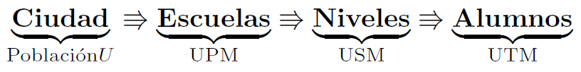

```{r knitr_init, echo=FALSE, cache=FALSE}
library(knitr)
## Global options
opts_chunk$set(echo=TRUE,
               cache=TRUE,
               prompt=FALSE,
               tidy=TRUE,
               comment=NA,
               message=FALSE,
               warning=FALSE,
               fig.path = paste0("../../MuestreoySeriesdeTiempo/images/", "Clase17"),
               cache.path = "../../MuestreoySeriesdeTiempo/cache/",
               cache = FALSE)
```

## Métodos de muestreo

### Muestreo por conglomerados
El muestreo por conglomerados es una técnica que puede emplearse cuando dentro de la población objetivo, existen **agrupamientos "naturales" relativamente homogéneas**, con **comportamientos tan heterogéneos como sea posible**, de tal forma que cada conglomerado individual pueda ser visto como una pequeña representación de la población total de interés. Es de anotar los conglomerado que conforman la población deben ser **mutuamente excluyentes y exhaustivos**.

Algunas razones que pueden hacer que el muestreo por conglomerados sea una alternativa más viable al muestreo aleatorio simple, son señaladas por @Gutierrez2015[, pp. 183], en donde el autor introduce el tema mencionando que toda estrategia de muestreo tiene un común denominador, **tener un marco de muestreo bien definido** y la detallada **identificación y ubicación**, de todos y cada uno de los elementos que conforman la población. 

El autor señala que de no tener bien definidos estos dos elementos, pueden generarse **problemas financieros y logísticos** de eficiencia estadística, asociados a los costos que implicaría realizar un censo, para la enumeración, identificación y ubicación de cada elemento de la población. Ya que este procedimiento es requerido para la correcta construcción de un marco de muestreo. 

Adicionalmente, @Gutierrez2015[, pp. 183] señala que, aunque se tuviera un marco de muestreo bien definido para toda la población, **los costos financieros** asociados a la realización de un proceso de muestreo aleatorio simple, **sería sumamente elevado** debido a la posible alta dispersión de cada uno de los elementos que conforman el marco muestral.

<!-- Por ejemplo suponga que se desea realizar un estudio para evaluar la calidad de vida de las personas en un determinado país. Si llegara a existir un marco de muestreo de elementos, realizar (o seleccionar) una muestra aleatoria simple demandaría la contratación de un encuestador por cada persona encuestada, puesto que la dispersión geográfica natural de los elementos seleccionados en la muestra aleatoria simple sería demasiado alta -->

Una alternativa de muestreo probabilístico **de bajo costo** cuando no se posee un marco muestral de elementos, es mediante la selección de conglomerados dentro de la población objetivo, para realizar todo el proceso de medición, puesto que, es más eficiente por cuestiones financieras y logísticas, seleccionar una muestra de 20 manzanas de una ciudad, que contienen cada una en promedio 30 casas, que realizar una muestra aleatoria de 600 casas de dicha ciudad, ya que se incurren en mayores costos al ubicar las 600 casas y viajar entre ellas, que ubicar las 20 manzanas y visitar todas las casas que las conforman [@Cochran1977, p. 233].

Por tanto, para la construcción del marco de muestreo en estos casos, se tendrá entonces que ubicar e identificar cada uno de los conglomerados que conforman la población, realizar el proceso de muestreo entre los mismos, lo cual pueden realizarse mediante muestreo aleatorio simple, y posteriormente, realizar un censo de los individuos que conforman cada uno de los conglomerados seleccionados. Este procedimiento se conoce como **muestreo por conglomerados en una sola etapa.**

Si se observa que aún en los conglomerados se encuentra que la dispersión de la población es bastante grande, puede realizarse **un muestreo por conglomerados en dos etapas**, en donde, luego de hacer el proceso de muestreo entre los conglomerados, se aplica a los elementos de cada uno de los grupos seleccionados un nuevo proceso de muestreo. Este tipo de muestreo también es conocido como **muestreo bietápico**, el cual es un caso particular del **muestreo polietápico**, el cual será introducido en la próxima sección.

@Gutierrez2015[, pp. 184] señala que, a pesar de que **el muestreo por conglomerados** otorga una ganancia significativa en términos operativos, logísticos y financieros, dicho muestreo **pierde eficiencia en términos estadísticos**. Y basado en lo anterior, el autor plantea una serie de comentarios a tener en cuenta acerca del muestreo por conglomerados.

1. El muestreo por conglomerados debe utilizarse cuando:
   * La construcción de un marco de muestreo de elementos es muy difícil, muy costosa o imposible
de conseguir. Por ejemplo, Enumerar abejas, enumerar clientes, enlistar árboles en un sector, enlistar
hogares en los barrios conglomerados (dispersión geográfica, reducción de costos).
   * La población objetivo se encuentra geográficamente muy dispersa o aparece en agrupaciones
naturales: familias, escuelas, etc.
2. Los elementos individuales de una población sólo participan en la muestra si pertenecen a un
conglomerado incluido en la muestra.
3. El muestreo estratificado aumenta la precisión de las estimaciones, mientras que el muestreo por
conglomerados tiende a disminuirla. Es un precio que se paga al no poseer un marco de muestreo
definido para los elementos de la población objetivo.
4. Al obtener una muestra de elementos que pertenecen a un conglomerado repetimos la información
del conglomerado (dada la agrupación natural). Lo ideal es conseguir información nueva en cada
individuo, por lo anterior se pierde precisión en las estimaciones.
5. Una posible solución para disminuir la varianza o la perdida de eficiencia a causa de muestreo por conglomerados, es mediante el aumento del tamaño de muestra, pero esto traerá consigo el aumento de los costos operativos.

<!-- Falta parte matemática Ver Gutierrez2015-->

### Muestreo polietápico o por en varias etapas
El muestreo aleatorio polietápico es un método de muestreo que consisten en tomar muestras de las unidades muestrales de orden más alto (unidades de muestreo primarias), para obtener unidades muestrales de orden más bajo (unidades de muestreo secundarias), **ésto debido a que puede ser muy costoso o innecesario realizar el proceso de muestreo de todos los elementos que conforman una unidad muestral**. Si se toma una nueva muestra de la unidad muestral de segundo orden, se tendrá entonces una unidad muestral de orden aún más bajo (unidades de muestreo terciarias), y así sucesivamente. 

Lo anterior permite que el proceso de construcción del marco muestral sea más práctico, debido a que **solo es necesario realizar la construcción del marco muestral en las unidades muestrales seleccionadas**. En consecuencia, en el muestreo polietápico las unidades con las cuales se realiza el proceso de medición, serán aquellas unidades que componen la muestra en etapas sucesivas.

En @Gutierrez2015[, pp. 205], el autor presenta el principio que sigue el muestreo polietápico, el cual puede define como un proceso jerárquico que se realiza `$l$` veces, siguiente los siguientes dos pasos.

1. Construcción de `$l$` marcos de muestreo de unidades (se realizan conglomerados en las primeras `$l-1$` etapas del diseño muestral y de elementos en la última etapa).
2. Aplicación del diseño muestral y selección de la muestras (o submuestras) de cada marco de
muestreo.

Con el fin de ilustrar y entender mejor el funcionamiento de este tipo de muestreo, se presenta el ejemplo planteado en @Gutierrez2015[, pp. 205-206]. Suponga que se quiere obtener estimaciones acerca del comportamiento de los alumnos en determinada ciudad, y no se dispone de un marco de muestreo de los alumnos (**Es decir, no se tienen identificados a todos los alumnos de la ciudad**). Por tanto, es posible como **primera etapa** se puede realizar un muestreo por conglomerados, adquiriendo un marco de muestreo mediante la información de cuales son todas las escuelas que se encuentran ubicadas en la ciudad, y con éstas, realizando una primera selección.

Una vez se seleccionan las escuelas mediante muestreo por conglomerados, se procede a realizar una **segunda etapa**, en donde, se realiza un nuevo muestreo por conglomerados, para un nuevo marco de muestreo mediante la información de los cursos o clases que se ofrecen dentro de las escuelas, y con éstos, realizar un nuevo proceso de selección.

De tal forma que en la **tercera y última etapa** se levante un marco de muestreo de elementos, es decir, un muestreo de los alumnos pertenecientes a los cursos seleccionado, en donde, estos alumnos serán los individuos que participarán en los procesos de medición.

En este ejemplo, se tendrá el siguiente comportamiento jerárquico, que subdivide la población




La notación suministrada en la imagen es:

* **UPM:** Unidad Primaria de Muestreo, la cual será la primera subdivisión de la población original
* **USM:** Unidad Secundaria de Muestreo, la cual será la segunda división de la población original, o la sub-subdivisión de la población original.
* **UTM:** Unidad Terciaria de Muestreo, la cual será corresponde a los elementos de la población objetivo, que en este caso particular son los alumnos de la ciudad.


Es de anotar, que los resultados de la estimación basada en el diseño de muestreo sean aplicables, deben satisfacerse los siguientes dos supuestos

* **Invariancia:** La probabilidad de selección de una muestra de unidades de muestreo
(conglomerados o elementos) no depende del diseño de muestreo de la anterior etapa.
* **Independencia:** El submuestreo de cualquier unidad de muestreo se lleva a cabo de manera independiente con las otras unidades de muestreo, tanto en etapas superiores, inferiores o en la misma etapa.

<!-- Falta parte matemática Ver Gutierrez2015-->

## El problema de la no respuesta
Como se plantea en @Thompson2012[, p. 5], la no respuesta en encuestas, es un problema que se observa particularmente en encuestas que poseen tasas de respuesta muy bajas, en las cuales la probabilidad de responder está relacionada con las características que se quieren medir. En particular, **cuando se hacen preguntas sensibles o que están asociadas a algún tabú**. Por ejemplo, encuestas sobre temas sexuales, o temas como el aborto.

Dado lo anterior, el efecto que tiene la no respuesta debe ser tratado de alguna manera, y para ello, se busca reducir tal proporción mediante el empleo de **esfuerzos adicionales de muestreo**, con el fin de realizar una estimación de las características del grupo de no respuesta de la población. Para tal estimación, es necesario usar cuidadosamente la información auxiliar disponible de los individuos que responde y que no responde, o mediante la modelación de la situación de no respuesta.

Aunque **el sesgo generado por la no respuesta es casi imposible de eliminar** por completo, se recomienda tratar de mantener las tasas de no respuesta lo más bajas posibles, y para ello, es posible emplear algunas metodología que permitan garantizar que se evite la no respuesta, tanto como sea posible.

Entre los métodos para tratar la situación de la no respuesta, se encuentra **la metodología de muestreo doble**, la cual consta en realizar un seguimiento más intensivo para obtener una respuesta de una submuestra de individuos pertenecientes al grupo de no respuesta de la población. 

<!-- Agregar esta parte el próximo semestre -->
<!-- Otros métodos modelan el mecanismo de respuesta y lo ven como un diseño de muestreo natural seleccionando a los encuestados como una submuestra en la segunda fase, utilizando estimadores de muestreo doble para ajustar la falta de respuesta. -->

### Muestreo doble para el ajuste de la no respuesta
@Thompson2012[, p. 192] presenta este método, señalando que usualmente, en las encuestas de poblaciones humanas, aquellas personas que fueron seleccionadas en el método de muestreo y que no responden la encuesta (ya sea porque no están disponibles o no están dispuestas a responder), son a menudo **no representativos con respecto a la variable de interés**, y generan que la media muestral obtenida por encuestado sea una estimación sesgada de la media poblacional.

De manera similar, en encuestas de poblaciones naturales, los sitios seleccionados que por una u otra razón permanecen sin ser observados, a menudo **no son representativos de la región de estudio en su conjunto**, debido a que la parte no observada puede tener un comportamiento diferente al resto del área observada, lo cual genera que la media muestral de los sitios arroje estimaciones sesgadas de la media de la población.

<!-- Por ejemplo, en un estudio de arrastre de una población de peces, algunas ubicaciones seleccionadas pueden no observarse cuando el terreno del fondo del océano es demasiado rocoso u obstruido de otra manera para la red. El hábitat y, por lo tanto, la composición de especies en dichos sitios pueden no ser típicos de la población en su conjunto, por lo que la media de la muestra de los sitios de arrastre daría una estimación sesgada de la media de la población. -->

En tales casos, las unidades que no responden pueden ser consideradas como **un estrato diferente**, que permaneces desconocido junto a las unidades pertenecientes a él, hasta una vez realizada la selección de la muestra. Entonces, para lidiar con este estrato, realiza la selección de submuestras de dicho estrato, a las cuales se les realizará nuevamente la encuesta, con la diferencia de que esta vez, **se emplean métodos más intensivos** a los utilizados inicialmente, tales como llamadas telefónicas, visitas de entrevistadores u otros medios de recolección.

Supongamos dos estratos, el  **estrato 1** corresponde al **grupo de respuesta**, y el **estrato 2** corresponde al **grupo de no respuesta**. Suponga además que se seleccionó inicialmente una muestra de `$n'$` unidades. Entonces se tendrá que entre las `$n'$` unidades iniciales, se encuentran `$n_1'$` unidades pertenecientes al grupo de respuesta y `$n_2'$` unidades pertenecientes al grupo de no respuesta, en la encuesta inicial.

Si se realiza el segundo esfuerzo o muestreo doble sobre el **estrato 2**, se tendrán `$n_2$` respuestas obtenidas de una muestra aleatoria simple de los `$n_2'$` que no respondieron inicialmente. Haciendo que se tenga un total de `$n_1'$` respuestas del estrato 1 y `$n_2$` respuestas de los `$n_2'$` individuos del estrato 2, las cuales fueron obtenidas a partir del muestreo estratificado de se realizó en la segunda fase.

A partir de este resultado, será posible calcular un estimador insesgado para la media poblacional obtenida mediante el muestreo doble, de tal forma que
`\begin{align*}
\bar{y}_d = \frac{n_1'}{n'} \bar{y}_1 + \frac{n_2}{n'} \bar{y}_2
\end{align*}`

Además, una expresión para la varianza será obtenida mediante la expresión
`\begin{align*}
Var(\bar{y}_d)=\frac{N-n'}{N}\frac{\sigma^2}{n'}+\mathbb{E}\left[\sum_{h=1}^L \left(\frac{n_h'}{n'}\right)^2\left(\frac{n_h'-n_h}{n_h'}\right)\frac{\sigma_{h(s_1)}^2}{n_h}\right]
\end{align*}`

donde `$L$` el total de estratos, `$\sigma$` es la varianza del total de la población y `$\sigma^2_{h(s_1)}$` es la varianza dentro del estrato `$h$` para la primera fase de muestreo `$s_1$`
tal que
`\begin{align*}
\sigma_{h(s_1)}^2 = \frac{\sum_{i\in s_1h}(y_i-\bar{y}_h')^2}{n_h'-1}
\end{align*}`

Dado que no es posible conocer la varianza poblacional de cada estrato, se presenta un estimador insesgado para la varianza de `$\bar{y}_d$`, mediante el empleo de la varianza muestral de cada estrato, `$s_h^2$`, tal que 
`\begin{align*}
\hat{Var}(\bar{y}_d)=\frac{N-1}{N}\sum_{h=1}^L\left(\frac{n_h'-1}{n'-1}-\frac{n_h-1}{N-1}\right)\frac{n_h'}{n'}\frac{s_h^2}{n_h} + \frac{N-n'}{N(n'-1)}\sum_{h=1}^L\frac{n_h'}{n'}(\bar{y}_h - \bar{y}_d)^2
\end{align*}`


<!-- Agregar el próximo semestre @Thompson2012, Response Modeling and Nonresponse Adjustments pagina 193 -->


## Referencias


