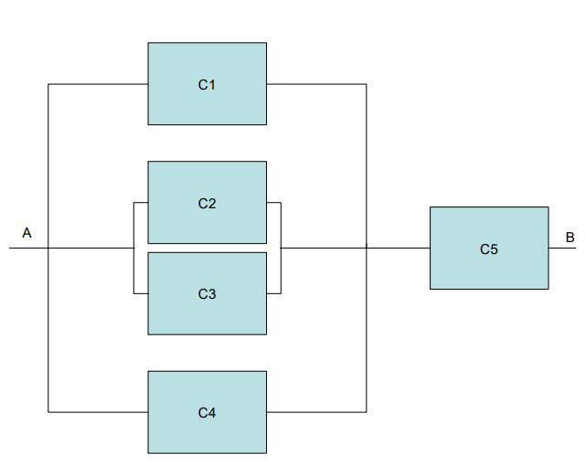

```{r knitr_init, echo=FALSE, cache=FALSE}
library(knitr)
## Global options
opts_chunk$set(echo=TRUE,
               cache=TRUE,
               prompt=FALSE,
               tidy=TRUE,
               comment=NA,
               message=FALSE,
               warning=FALSE,
               fig.path = paste0("../../ProbabilidadeInferencia/images/", "Práctica01"),
               cache.path = "../../ProbabilidadeInferencia/cache/",
               cache = FALSE)

```

## Lista de ejercicios
1. Suponga que una familia sale de vacaciones de verano en su casa rodante. Si `$M$` es el evento de que sufrirán fallas mecánicas, `$T$` es el evento de que recibirán una infracción por cometer una falta de tránsito y `$V$` es el evento de que llegarán a un lugar para acampar que esté lleno. Basado en el siguiente diagrama de Venn

liste los números y defina la notación de las regiones que representan los siguientes eventos
    * La familia no experimentará fallas mecánicas y no será multada por cometer una infracción de tránsito, pero llegará a un lugar para acampar que está lleno.
    * La familia experimentará tanto fallas mecánicas como problemas para localizar un lugar disponible para acampar, pero no será multada por cometer una infracción de tránsito.
    * La familia experimentará fallas mecánicas o encontrará un lugar para acampar lleno, pero no será multada por cometer una infracción de tránsito.
    * La familia no llegará a un lugar para acampar lleno.

2. Un moneda esta cargada de tal forma que la probabilidad de que aparezca cara es tres veces mayor a que aparezca sello. Si se decide lanzar la moneda tres veces, cuál es la probabilidad de sacar al menos dos caras?
3. Suponga un juego en donde se lanza un dado cargado de tal forma que la probabilidad de que caiga cualquier cara, es proporcional al número de puntos que le falta a la cara para sumar 6. ¿Cuál es la probabilidad de que al lanzar el dado salga un número impar?
4. Sea el espacio muestral `$S = \{x | 1 < x < 12\}$` definido como el rango de tiempo que puede tardar cualquier estudiante en realizar un trabajo de la universidad. Suponga que se tienen tres tipos de estudiantes, el evento `$X = \{x | 1 < x < 3\}$` representa el tiempo que tardan los estudiantes que estudiaron más de `$5$` horas, el evento `$Y = \{x | 1.5 < x < 8\}$` representa el tiempo que tardan los estudiantes que estudiaron entre `$2$` y `$6$` horas, y `$Z = \{x | 7 < x < 12\}$`, el tiempo que tardan los estudiantes que estudiaron menos de `$3$` horas. Dado lo anterior, encuentre e interprete en lo posible los siguientes eventos.
   * `$X \cup Y$`
   * `$X \cap Y$`
   * `$X'\cap Z$`
   * `$X' \cup Z'$`
   * `$X' \cap Y'$`
   * `$Z' \cup Y$`

5. Para un examen de probabilidad e inferencia estadística a las `$6$`AM, un estudiante programa un despertador, el cual sabe que consigue despertarlo el `$80\%$` de las veces. Además, sabe que si escucha sonar el despertador, la probabilidad de que llegue a tiempo al examen es del `$90\%$`, mientras que, si no lo escucha, la probabilidad de llegue a tiempo al examen es del `$50\%$`.
   * Si el estudiante llega a tiempo al examen, ¿Cuál es la probabilidad de que haya escuchado el despertador?
   * Si el estudiante no llega a tiempo al examen, ¿Cuál es la probabilidad de que no haya escuchado el despertador?
   
6. Suponga que se descubre que, en un grupo de `$500$` estudiantes universitarios de último año, `$210$` fuman, `$258$` consumen bebidas alcohólicas, `$216$` comen entre comidas, `$122$` fuman y consumen bebidas alcohólicas, `$83$` comen entre comidas y consumen bebidas alcohólicas, `$97$` fuman y comen entre comidas y `$52$` tienen esos tres hábitos nocivos para la salud. Si se selecciona al azar a un miembro de este grupo, escriba el evento de interés y calcule la probabilidad de que el estudiante
   * fume, pero no consuma bebidas alcohólicas
   * coma entre comidas y consuma bebidas alcohólicas pero no fume
   * no fume ni coma entre comidas.
   
7. Encuentre los errores en cada una de las siguientes aseveraciones:
   * Las probabilidades de que un vendedor de automóviles venda `$0$`, `$1$`, `$2$` o `$3$` unidades en un día dado de febrero son `$0.19$`, `$0.38$`, `$0.29$` y `$0.15$`, respectivamente.
   * La probabilidad de que llueva mañana es `$0.40$` y la probabilidad de que no llueva es `$0.52$`.
   * Las probabilidades de que una impresora cometa `$0$`, `$1$`, `$2$`, `$3$` o `$4$` o más errores al imprimir un documento son `$0.19$`, `$0.34$`, `$-0.25$`, `$0.43$` y `$0.29$`, respectivamente.
   * Al sacar una carta de una baraja en un solo intento la probabilidad de seleccionar un corazón es `$1/4$`, la probabilidad de seleccionar una carta negra
es `$1/2$`, y la probabilidad de seleccionar una carta de corazones y negra es `$1/4$`.

8. Se sacan tres cartas seguidas, sin reemplazo, de una baraja ordinaria. Encuentre la probabilidad de la primera carta sea una `$A$` roja, la segunda carta sea una `$J$` una `$Q$` o una `$K$` y la tercera carta sea mayor que `$4$` pero menor que `$7$`.
9. La proporción de personas que estudia para el examen de probabilidad es de `$52\%$`. Si la persona estudia, tiene una probabilidad de `$85\%$` de ganar el examen; si no estudia, la probabilidad de ganar el examen es de `$12\%$`. Se selecciona una persona al azar de las que presentaron el examen y resulta que lo perdió, ¿Cuál la probabilidad de que haya estudiado?   
10. Un determinado circuito electrónico está compuesto por nueve componentes conectados según se muestra a continuación

la probabilidad de que funcione cada componente es del `$0.95$`. El circuito funcionará si es posible encontrar un camino entre `$A$` y `$B$`. Se supone que la probabilidad de que funcione cada componente es independiente de los demás. A partir de la información anterior calcule
    * ¿Cuál es la probabilidad de que funcione el subsistema `$M$`?
    * ¿Cuál es la probabilidad de que funcione el subsistema `$N$`?
    * ¿Cuál es la probabilidad de que no funcione el subsistema `$O$`?
    * ¿Cuál es la probabilidad de que haya comunicación entra `$A$` y `$B$`?
    * Escriba mediante eventos, la estructura de uniones e intersecciones necesarias para que el circuito funcione
11. En un centro escolar los alumnos pueden optar por cursar como lengua extranjera ingles o francés. En un determinado curso, el `$90\%$` de los alumnos estudia ingles y el resto francés. El `$30\%$` de los que estudian ingles son hombres y el `$40\%$` de los que estudian francés son mujeres. Si se selecciona un alumno al azar, ¿Cuál es la probabilidad de que sea mujer?  
12. Dos monedas una balanceada y otra con dos sellos son colocadas en un sombrero. Se selecciona al azar una moneda y se lanza al aire. Si la cara superior es sello, ¿cuál es la probabilidad de que la cara oculta sea cara?
13. Suponga que tenemos una caja de fusibles que contiene `$20$` unidades, de las cuales `$5$` están defectuosas. Si se seleccionan `$2$` fusibles al azar y se retiran de la caja, uno después del otro, sin reemplazar el primero, ¿cuál es la probabilidad de que ambos fusibles estén defectuosos?
14. Un grupo asesor `$A$` contiene `$3$` hombres y `$3$` mujeres. Otro grupo asesor `$B$` contiene `$3$` hombres y `$2$` mujeres. Se selecciona al azar un grupo y de él una persona al azar, si esta persona es un hombre, se selecciona otra persona del mismo grupo. Si la persona seleccionada es mujer, se selecciona otra persona del otro grupo. Si las dos personas seleccionadas son hombres, ¿Cuál es la probabilidad de que se haya seleccionado ambas del grupo asesor `$A$`?
15. Un estudio realizado para un supermercado clasifica los clientes en aquellos que visitan el establecimiento de una manera frecuente u ocasional, y en aquellos que adquieren regularmente, ocasionalmente o nunca productos alimenticios. La siguiente tabla presenta las proporciones correspondientes a cada uno de los seis grupos.
<section style="font-family: 'Open Sans',sans-serif; margin-bottom: -3rem; margin-top: -3rem; font-size: 90%;">
```{r echo=FALSE}
library(kableExtra)

tabla <- data.frame(Visita = c("Frecuente", "Infrecuente"), Regular = c("0.12", "0.07"),
  Ocasional = c("0.48", "0.06"), Nunca = c("0.19", "0.08"))

kable(tabla, 
  format = "html", booktabs = T) %>%
kable_styling("striped", full_width = F) %>%
add_header_above(c("Frecuencia de" = 1, "Adquisición de Productos" = 3)) 
```
</section>
    * ¿Cual es la probabilidad de seleccionar un cliente que visite frecuentemente el supermercado y compre regularmente productos alimenticios?
    * ¿Cuál es la probabilidad de que se seleccione un cliente nunca compre productos alimenticios?
    * ¿Cuál es la probabilidad de seleccionar un cliente que nunca compra productos alimenticios, si se sabe que visita el supermercado frecuentemente?
    * ¿Son independientes los sucesos "nunca compra productos alimenticios" y "visita el supermercado frecuentemente"?
    * ¿Cuál es la probabilidad de seleccionar un cliente que visite el establecimiento frecuentemente o un cliente que nunca compre productos alimenticios?
   
16. Las enfermedades `$A$` y `$B$` son comunes entre las personas que habitan una determinada isla. Si se supone que el `$50\%$` de la población contrae la enfermedad `$A$` alguna vez durante su vida, `$60\%$` contraerá eventualmente la enfermedad `$B$` y el `$10\%$` no contraerá ninguna enfermedad. ¿Cuál La probabilidad de contraer ambas enfermedades?
17. La probabilidad de que a un hombre le dé cáncer pulmonar antes de los `$60$` años es de `$1/5$` y la probabilidad de que le dé a su esposa antes de la misma edad es `$1/6$`. ¿Cuál es la probabilidad de que al menos a uno de los dos le dé cáncer pulmonar antes de los `$60$` años? <!-- P(A) + P(B) - P(A)P(B)-->
18. Un experimento consiste en lanzar un dado. Si el número en el dado es par, se lanzar un dado una vez. Si el número en el dado es impar, se lanza una moneda dos veces. 
    * Construya un diagrama de árbol para mostrar los elementos del espacio muestral `$S$`.
    * Calcule la probabilidad de obtener al menos un `$5$` en un dado.
    * Calcule la probabilidad de obtener un número impar en el dado, seguido de al menos un sello en la moneda.
   
19. Si `$S = \{0, 1, 2, 3, 4, 5, 6, 7, 8, 9\}$`, `$A = \{0, 2, 4, 6, 8\}$`, `$B = \{1, 3, 5, 7, 9\}$`, `$C = \{2, 3, 4, 5\}$` y `$D = \{1, 6, 7\}$`, liste los elementos de los conjuntos, en el siguiente diagrama de Venn

y posteriormente señale en el diagrama los siguientes eventos:
    * `$A \cup C$`
    * `$A \cap B$`
    * `$C'$`
    * `$(C' \cap D) \cup B$`
    * `$(S \cap C)'$`
    * `$A \cap C \cap D'$`
    
20. Suponga que usted le pide el favor a un compañero de curso que lo inscriba en cierta materia. Si su compañero olvida hacer la inscripción a tiempo, la probabilidad de que usted consiga cupo para dicha asignatura es de sólo el `$4\%$`, en tanto que si su compañero hace la inscripción a tiempo, la probabilidad de que usted consiga cupo para dicha asignatura es del `$75\%$`. Usted está seguro en un `$85\%$` de que su compañero hará la inscripción a tiempo. Si usted obtuvo cupo, ¿Cuál la probabilidad de que su compañero no lo haya inscrito a tiempo?
21. Suponga que la policía planea hacer respetar los límites de velocidad en Medellín y para ello instala en 3 diferentes puntos de la autopista trampas de radas. Las trampas de radar en cada uno de los sitios operarán `$60\%$`, `$80\%$` y `$75\%$` del tiempo. Si una persona pasa por una cámara, tiene una probabilidad de `$20\%$`, `$25\%$` y `$18\%$` de exceder el límite de velocidad, respectivamente. ¿Cuál es la probabilidad de que reciba una multa por conducir con exceso de velocidad?
22. Basado en su experiencia, un agente bursátil considera que en las condiciones económicas actuales la probabilidad de que un cliente invierta en bonos libres de impuestos es `$0.6$`, la de que invierta en fondos comunes de inversión es `$0.3$` y la de que invierta en ambos es `$0.15$`. En esta ocasión encuentre la probabilidad de que un cliente invierta
    * en bonos libres de impuestos o en fondos comunes de inversión
    * en ninguno de esos dos instrumentos

23. Un banco ha comprobado que uno de cada `$1000$` clientes con fondos expide un cheque con fecha equivocada.  En cambio, todo cliente sin fondos pone una fecha errónea en sus cheques. El `$90\%$` de los clientes del banco tienen fondos. Se recibe hoy en caja un cheque con fecha equivocada. ¿Cuál es la probabilidad de que sea de un cliente sin fondos?
24. Suponga una red de comunicaciones de cinco componentes conectados según se muestra a continuación
		
la probabilidad de que funcione el componente `$C1$` es de `$0.98$`, la de `$C2$` es `$0.96$`, la de `$C3$` es de `$0.83$`, la de `$C4$` es de `$0.89$` y la de `$C5$` es de `$0.90$`. La red funciona si entre `$A$` y `$B$` es posible encontrar un camino de componentes que funcione. Se supone que la probabilidad de funcionar cada componente es independiente de los demás. ¿Cuál es la probabilidad de que no haya comunicación entre `$A$` y `$B$`?
25. Se introducen en una urna `$20$` papelitos con los nombres de `$20$` personas para escoger un determinado candidato. En ella aparecen los nombres de `$12$` ingenieros industriales y `$8$` ingenieros químicos. De los industriales se tienen que `$5$` tienen al menos `$21$` años y de los químicos, se tiene que `$3$` son menores de `$21$` años. Se escoge al azar un papelito.
    * Cuál es la probabilidad de que el elegido sea un ingeniero industrial o sea menor de `$21$` años.
    * Cuál es la probabilidad de que el elegido sea un químico de `$21$` años o más?
    
26. Existen dos métodos `$A$` y `$B$` para enseñar a los trabajadores cierta habilidad industrial. El porcentaje de fracasos es `$20\%$` para `$A$` y `$10\%$` para `$B$`. Sin embargo, `$B$` cuesta más y por eso se utiliza solamente el `$30\%$` de los casos, y en consecuencia, se utiliza el método `$A$` el resto de las veces. Si se entrena a un trabajador según uno de los dos métodos, pero no logra aprenderlo correctamente. 
    * ¿Cuál es la probabilidad de que haya recibido entrenamiento con el método `$A$`?
    * ¿Cuál es la probabilidad de que haya recibido entrenamiento con el método `$B$`?

27. Suponga que la probabilidad de sobrevivir a una cierta operación de trasplante es de `$0.55$`. Si un paciente sobrevive la operación, la probabilidad que su cuerpo rechace el trasplante en menos de un mes es `$0.20$`. ¿Cuál es la probabilidad de que un paciente sobreviva a estas etapas críticas?
28. Una señora que visita un supermercado, en ocasiones usa sus tarjetas de crédito `$1$`,`$2$` o `$3$`; otras veces paga con cheque y en otras paga en efectivo. La probabilidad de pagar con estas `$5$` alternativas son, respectivamente, `$0.25$`, `$0.29$`, `$0.23$`, `$0.19$` y `$0.04$`. ¿Cuál es la probabilidad de que en su próxima visita al supermercado,
    * ¿No pague en efectivo?
    * ¿No use ninguna de sus tarjetas de crédito?
    * ¿Use su tarjeta uno, o pague con cheque o pague en efectivo?
    * ¿No pague en efectivo ni en cheque?

29. Se sabe que `$2/3$` de los reclusos en cierta prisión federal son menores de `$25$` años de edad. También se sabe que `$3/5$` de los reos son hombres, y que `$5/8$` son mujeres de `$25$` años de edad o mayores. ¿Cuál es la probabilidad de que un prisionero seleccionado al azar de esta prisión sea mujer y tenga al menos `$25$` años de edad?
30. En un grupo de `$100$` estudiantes de bachillerato que están cursando el último año, `$42$` cursaron matemáticas, `$68$` psicología, `$54$` historia, `$22$` matemáticas e historia, `$25$` matemáticas y psicología, `$7$` historia pero ni matemáticas ni psicología, `$10$` las tres materias y `$8$` no cursaron ninguna de las tres. Seleccione al azar a un estudiante de este grupo y calcule la probabilidad de los siguientes eventos:
    * Una persona inscrita en psicología y cursa las tres materias
    * Una persona que no está inscrita en psicología y esté cursando historia y matemáticas.
    
31. Un experimento incluye lanzar un par de dados y observar los números de sus caras superiores. 
    * Cuál es la probabilidad de obtener un `$7$` en la suma del resultado de los dos dados. 
    * Cuál es la probabilidad de que el número obtenido en los dos dados sea igual?
    
32. Una pequeña ciudad dispone de un carro de bomberos y una ambulancia para emergencias. La probabilidad de que el carro de bomberos esté disponible cuando se necesite es `$0.98$` y la probabilidad de que la ambulancia esté disponible cuando se le requiera es `$0.92$`. En el evento de un herido en un incendio, calcule la probabilidad de la ambulancia o el carro de bomberos estén disponibles, suponiendo que operan de forma independiente.    
33. El `$10\%$` de las personas de cierto grupo tiene la vista defectuoso y el `$12\%$` son fumadores, además el `$4\%$` tiene la vista defectuosa y son fumadores. Se elige al azar una persona del grupo, y resulta que tiene la vista defectuosa. ¿Cuál es la probabilidad de que sea fumadora?
34. En un lote de `$20$` llantas se sabe que hay `$6$` defectuosas. Se escogen sucesivamente `$3$` llantas de las `$20$`. ¿Cuál es la probabilidad de que ninguna resulte defectuosa?
35. ¿Cuál es la probabilidad de seleccionar aleatoriamente, en sucesión, `$4$` empanadas de carne de una canasta que contiene `$25$` empanadas, de las cuales solo `$8$` son de carne?
36. De un estudio realizado en la ciudad de Medellín, se encontró que la probabilidad de que un esposo sea infiel es del `$0.21$`, y que una esposa sea infiel `$0.25$`. ¿Cuál es la probabilidad de que una mujer casada sea infiel dado que su esposo no lo es? Suponga que los eventos pueden asumirse como independientes.
37. Con curiosidad sobre sus pacientes, un psicólogo analiza la relación de `$60$` de sus pacientes según si trabaja o es desempleado y si sufre o no de alguna depresión. Él ha recopilado la información que se muestra en la siguiente tabla
<section style="font-family: 'Open Sans',sans-serif; margin-bottom: -3rem; margin-top: -3rem; font-size: 90%;">
```{r echo=FALSE}
library(kableExtra)

tabla2 <- data.frame("Paciente" = c("Empleado", "No empleado"), "Depresión" = c("30", "20"),
  "No depresión" = c("4", "6"))

kable(tabla2, 
  format = "html", booktabs = T) %>%
kable_styling("striped", full_width = F) 
```
</section>
    * ¿Cuál es la probabilidad de que un cliente seleccionado al azar sea empleado?
    * Si él sabe que el paciente sufre de depresión, ¿Cuál es la probabilidad de que sea desempleado?

38. En una prueba de tipo falso o verdadero, una persona no tiene ni la menor idea de las respuestas correspondientes a `$3$` preguntas, así que decide adivinarlas. ¿Cual es la probabilidad de que responda más de una correctamente?
39. Una compañía de desarrollo urbano está considerando la posibilidad de construir un centro comercial en un sector de la ciudad. Un elemento vital en esta construcción es un proyecto de una autopista que une este sector con el centro de la ciudad. Si el gobierno departamental aprueba esta autopista, hay una probabilidad de `$0.90$` de que la compañía construya el centro comercial, mientras que si la autopista no es aprobada la probabilidad es de sólo `$0.20$`. Basándose en la información disponible, el presidente de la compañía estima que hay una probabilidad de `$0.60$` de que la autopista sea aprobada.
    * ¿Cuál es la probabilidad de que la compañía construya el centro comercial?
    * Sabiendo que el centro comercial fue construido, ¿Cuál es la probabilidad de que la autopista hasta sido aprobada?

40. De `$10$`  cartas numeradas del `$1$` al `$10$`, se seleccionan aleatoriamente y en forma sucesiva `$2$` de ellas. Hallar la probabilidad de que la suma sea impar.
