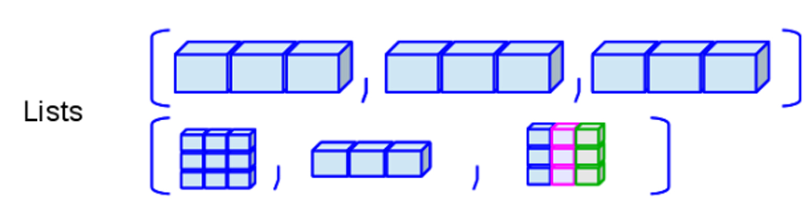

```{r knitr_init, echo=FALSE, cache=FALSE}
library(knitr)
## Global options
opts_chunk$set(echo=TRUE,
               cache=TRUE,
               prompt=FALSE,
               tidy=TRUE,
               comment=NA,
               message=FALSE,
               warning=FALSE,
               fig.path = paste0("../../SemilleroRyPython/images/", "Sesion01"),
               cache.path = "../../SemilleroRyPython/cache/",
               cache = FALSE)

```

## Identificar código <tt>R</tt> y salidas
Para hacer más fácil la identificación de los diferentes códigos que se usarán en la página, se emplearán los siguientes colores en las ventanas de código.

Para el código presentado en <tt>R</tt> se empleará un fondo de color negro tal como se presenta a continuación.

```{r eval = FALSE}
'Ejemplo código R'
```

Mientas que, para los resultados o salidas obtenidas en <tt>R</tt> se empleará un fondo de color gris, tal como se presenta a continuación.

```{r echo=FALSE}
'Ejemplo código de salida'
```

## Palabras reservadas
Tanto en <tt>R</tt> como en <tt>Python</tt> existe un conjunto de palabras reservadas, **las cuales poseen atributos especiales** dentro del lenguaje de programación, y por ello, estas no pueden ser usadas como nombre de variables, funciones, etc.

### Palabras reservadas en <tt>R</tt>
A continuación se lista el conjunto de palabras reservadas en el lenguaje <tt>R</tt>. 

`\begin{align*}
\begin{array}{c}\text{if} & \text{else} & \text{repeat} & \text{while} & \text{NA_integer_} \\
\text{for} & \text{in} & \text{next} & \text{break} & \text{NA_real_} \\
\text{function} & \text{TRUE} & \text{FALSE} & \text{…} & \text{NA_complex_} \\
\text{NULL} & \text{NA} & \text{Inf} & \text{NaN} & \text{NA_character_}\end{array}
\end{align*}`

en donde

* **<tt style="color: #ffa618!important">if, else, repeat, while, function, for, in, next, break</tt>**: Son funciones usadas en loops, condicionales y funciones.
* **<tt style="color: #ff628c!important">TRUE, FALSE</tt>**: Son carácteres especiales para indicar constantes lógicas.
* **<tt style="color: #ff628c!important">NULL</tt>**: Es un carácter especial para indicar valores indefinidos o indicar la no existencia de valor dentro de la base de datos o de una entrada de la misma.
* **<tt style="color: #ff628c!important">Inf</tt> (Infinity)**: Es un carácter especial para indicar que un número u operación da como resultado un número infinito o excesivamente grande.
* **<tt style="color: #ff628c!important">NaN</tt> (Not a number)**: Es un carácter especial para datos de clase numérica, para indicar un valor asociado a un cálculo cuyo resultado es desconocido, el cual seguramente no es un número. Este puede obtenerse mediante operaciones tales como `$0/0$`, `$Inf/Inf$`, `$Inf-Inf$`. 
* **<tt style="color: #ff628c!important">NA</tt> (Not Available)**: Es un carácter especial para indicar valores perdidos o faltantes.
* **<tt style="color: #ff628c!important">NA_integer_, NA_real_, NA_complex_, NA_character_</tt>**: Son carácteres especiales que indican valores perdidos o faltantes para diferentes tipo de vectores atómicos.
* `$\text{… }$`: Es un carácter especial que se emplea para permitir a una función pueda configurarse con los argumento a otra función.

Estas también pueden ser consultadas en <tt>R</tt> mediante el código 
```{r eval=FALSE, echo=FALSE}
?reserved
```

<section class="language-r highlighter-rouge"><section class="highlight"><pre class="highlight"><code><span class="n">?reserved</span><span class="w">
</span></code></pre></section></section>

## Estructura de asignación
Generalmente cuando se trabaja en programación, **se desea que el programa recuerde ciertos valores para usarlos más adelante**, y por ello, la idea de esta sección es explicar los métodos de asignación de objetos, que pueden emplearse tanto en <tt>R</tt> como en <tt>Python</tt>.

### Estructura de asignación en <tt>R</tt>
La estructura de asignación en el lenguaje <tt>R</tt> puede llevarse a cabo mediante cuatro formas diferentes, donde, cada una de ellas lleva al mismo resultado

<section class="language-r highlighter-rouge"><section class="highlight"><pre class="highlight"><code><span class="n">variable</span><span class="w"> </span><span class="o">&lt;-</span><span class="w"> </span><span class="n">objeto</span><span class="w">       </span><span class="c1"># Primer método</span><span class="w">
</span><span class="n">objeto</span><span class="w"> </span><span class="o">-&gt;</span><span class="w"> </span><span class="n">variable</span><span class="w">       </span><span class="c1"># Segundo método</span><span class="w">
</span><span class="n">variable</span><span class="w"> </span><span class="o">=</span><span class="w"> </span><span class="n">objeto</span><span class="w">        </span><span class="c1"># Tercer método</span><span class="w">
</span><span class="n">assign</span><span class="p">(</span><span class="n">variable</span><span class="p">,</span><span class="w"> </span><span class="n">objeto</span><span class="p">)</span><span class="w"> </span><span class="c1"># Cuarto método</span><span class="w">
</span></code></pre></section></section>

```{r eval=FALSE, echo=FALSE}
variable <- expresión       # Primer método
expresión -> variable       # Segundo método
variable = expresión        # Tercer método
assign(variable, objeto) # Cuarto método
```

De estos cuatro métodos de asignación presentados, **el primero y el segundo poseen la misma estructura**, la diferencia entre ellos radica en que, el primero realiza la asignación a la izquierda y el segundo a la derecha, lo cual depende de la dirección hacia donde apunte la flecha.

El **tercer método**, a pesar de realizar la asignación al igual que los dos primeros métodos, éste **no es el operador habitual de asignación**, pues éste se encuentra reservado para otros propósitos, tales como darle valores a una variable dentro de una función. El **cuarto método**, es una forma de asignación equivalente a las dos primeras, pero **requiere de "más esfuerzo"** para llevarse acabo la asignación.

Por lo tanto, se **recomienda emplear el primer método de asignación**. Es de anotar que el simbolo `<-` puede escribirse de dos formas, presionando la tecla `<` seguida de la tecla `-`, o alternativamente, presionando de forma simultanea las teclas `Alt` y la tecla `-`.

También se señala que **el carácter** `#`, **se emplea para comentar el código** o una línea específica, lo cual implica que posterior a `#`, no se ejecutará ningún tipo de código en la linea específica en la cual se encuentre `#`.

## Ayuda sobre funciones
En muchas situaciones, **podemos conocer la función que deseamos emplear pero no sabemos con exactitud cuales son los argumentos o el significado de los mismos**, lo cual hace que no podamos usar adecuadamente la función de interés.

Es por ello que tanto <tt>R</tt> como <tt>Python</tt> posee información, sobre las funciones que pueden emplearse en los lenguajes de programación, mostrando los diferentes argumentos que posee, su significado, los valores que pueden extraerse de la función y ejemplos sobre su empleo.

### Ayuda sobre funciones en <tt>R</tt>
Para obtener información sobre una función concreta o carácter en <tt>R</tt>, existen dos métodos que permiten abrir la ventana de ayuda, el primero es mediante la función <tt>help()</tt>, la segunda es mediante el signo `?`. Para ilustrar dichos métodos, empleamos la función <tt>if()</tt> y el carácter <tt>+</tt>, para consultar su ventana de ayuda.

<section class="language-r highlighter-rouge"><section class="highlight"><pre class="highlight"><code><span class="n">help</span><span class="p">(</span><span class="s2">"if"</span><span class="p">)</span><span class="w">  </span><span class="c1"># Primer método</span><span class="w">
</span><span class="n">?</span><span class="s2">"+"</span><span class="w">        </span><span class="c1"># Segundo método</span><span class="w">
</span></code></pre></section></section>

```{r eval=FALSE, echo=FALSE}
help("if")     # Primer método
?"+"           # Segundo método
```

## Operadores aritméticos y precedencias
Existen diferentes operadores aritméticos que pueden emplearse en los lenguajes de programación. Estos se resumen en la siguiente tabla.
<pre style="font-family: 'Open Sans',sans-serif; margin-bottom: -3rem; margin-top: -3rem; font-size: 120%;">
```{r echo=FALSE}
library(kableExtra)

datos <- cbind(
  "Operación" = c("Potencia", "Producto", "División", "División Entera", "Módulo o Resto", "Suma", "Resta"),
  "Operador en R" = c("^", "*", "/", "%/%", "%%", "+", "-"),
  "Asociatividad" = c("Por la derecha", "Por la izquierda", "Por la izquierda", "Por la izquierda", "Por la izquierda", "Por la izquierda", "Por la izquierda"),
  "Precedencia" = c(1, 2, 2, 2, 2, 3, 3))

kable(datos, 
  format = "html", booktabs = T) %>%
kable_styling("striped", full_width = F)
```
</pre>

## Funciones matemáticas
Hay una gran variedad de funciones matemáticas que suelen usarse en la práctica, y es por ello que se listan las funciones aritméticas que suelen emplearse comunmente por lenguaje de programación. Estos se resumen en la siguiente tabla.

<pre style="font-family: 'Open Sans',sans-serif; margin-bottom: -3rem; margin-top: -3rem; font-size: 120%;">
```{r echo=FALSE}
datos2 <- cbind(
  "Operación" = c("Valor absoluto", "Raíz cuadrada", "Redondear", "Techo", "Piso", "Exponencial", "Logaritmo", "Factorial", "Gamma", "Seno", "Coseno", "Tangente"),
  "Operador en R" = c("abs()", "sqrt()", "round()", "ceiling()", "floor()", "exp()", "log()", "factorial()", "gamma()", "sin()", "cos()", "tan()"))

kable(datos2, 
  format = "html", booktabs = T) %>%
kable_styling("striped", full_width = F)
```
</pre>

## Operadores lógicos
También es posible que se quieran realizar operaciones lógicas entre objetos cuando se realiza programación en los diferentes lenguajes, ya sea para establecer condicionales, o para hacer algunas verificaciones. Estos se resumen en la siguiente tabla.

<pre style="font-family: 'Open Sans',sans-serif; margin-bottom: -3rem; margin-top: -3rem; font-size: 120%;">
```{r echo=FALSE}
datos2 <- cbind(
  "Operación" = c("es igual que", "es distinto que", "es menor que", "es menor o igual que", "es mayor que", "es mayor o igual que", "Negación", "Conjunción", "Disyunción"),
  "Operador en R" = c("==", "!=", "<", "<=", ">", ">=", "!", "&", "|"),
  "Precedencia" = c(4, 4, 4, 4, 4, 4, 4, 5, 6, 5))

kable(datos2, 
  format = "html", booktabs = T) %>%
kable_styling("striped", full_width = F)
```
</pre>

## Tipo de datos
Existen diferentes tipos de datos en los lenguajes de programación, de estos tipos dependerá las operaciones o funciones que pueden o no emplearse con éstos, y es por ello que debe tenerse especial cuidado cuando se deseen manipular.

### Tipo de datos en <tt>R</tt>
Los tipos de datos más que pueden encontrarse en <tt>R</tt> son:

* **<tt>numeric</tt>**: Datos númericos, los cuales soportan números que se encuentren en el conjunto de los reales, `$\mathbb{R}$`, y por tanto soporta tanto números enteros (<tt>integer</tt>) y números de doble presición (<tt>double</tt>).
* **<tt>integer</tt>**: Datos enteros, los cuales soportan números que se encuentren en el conjunto de los enteros,  `$\mathbb{Z}$`, y en consecuencia, solo soporta números enteros.
* **<tt>complex</tt>**: Datos complejos, los cuales soportan números que se encuentren en el conjunto de los complejos, `$\mathbb{C}$`, y por tanto, soporta tanto números reales como imaginarios.
* **<tt>character</tt>**: Datos de carácter, los cuales soportan carácteres alfanuméricos, es decir, datos numéricos y alfabéticos. Éstos deben ser escritos entre comillas simples o dobles.
* **<tt>factor</tt>**: Datos categóricos nominales, los cuales soportan carácteres alfanuméricos, y establece entre estos diferentes categorías. Se puede emplear la función <tt>factor()</tt> para crear datos de este tipo. Éstos deben ser escritos entre comillas simples o dobles.
* **<tt>ordered</tt>**: Datos categóricos ordinales, los cuales soportan carácteres alfanuméricos, y establece entre estos diferentes categorías junto con una estructura jerarquíca. Se puede emplear la función <tt>ordered()</tt> para crear datos de este tipo. Éstos deben ser escritos entre comillas simples o dobles.
* **<tt>logical</tt>**: Datos lógicos, los cuales soportan carácteres lógicos tales como <tt style="color: #ff628c!important">TRUE</tt> o <tt style="color: #ff628c!important">FALSE</tt>.

Para verificar al estructura de almacenamiento en <tt>R</tt>, puede emplearse la función <tt>str()</tt>, mientras para observar la estructura de almacenamiento pueden emplearse las funciones <tt>mode()</tt>, <tt>typeof</tt>, y para observar la clase interna del objeto puede emplearse la función <tt>class()</tt>.

<button id="Show1" class="btn btn-secondary">Mostrar Ejemplo en <tt>R</tt></button>
<button id="Hide1" class="btn btn-info">Ocultar Ejemplo en <tt>R</tt></button>
<main id="botoncito1"> 
<p>A continuación se presenta un ejemplo en donde se muestran los diferentes tipos de objetos en <tt>R</tt></p>

<h3 data-toc-skip> Dato tipo numérico </h3> 

<section class="language-r highlighter-rouge"><section class="highlight"><pre class="highlight"><code><span class="c1"># Numeric</span><span class="w">
</span><span class="n">a</span><span class="w"> </span><span class="o">&lt;-</span><span class="w"> </span><span class="m">3.3</span><span class="w">
</span><span class="n">str</span><span class="p">(</span><span class="n">a</span><span class="p">)</span><span class="w">
</span></code></pre></section></section>

<section class="highlighter-rouge"><section class="highlight"><pre class="highlight"><code> num 3.3
</code></pre></section></section>

<h3 data-toc-skip> Dato tipo entero </h3> 

<section class="language-r highlighter-rouge"><section class="highlight"><pre class="highlight"><code><span class="c1"># Integer</span><span class="w">
</span><span class="n">b</span><span class="w"> </span><span class="o">&lt;-</span><span class="w"> </span><span class="m">3L</span><span class="w">
</span><span class="n">str</span><span class="p">(</span><span class="n">b</span><span class="p">)</span><span class="w">
</span></code></pre></section></section>

<section class="highlighter-rouge"><section class="highlight"><pre class="highlight"><code> int 3
</code></pre></section></section>

<h3 data-toc-skip> Dato tipo lógico </h3> 

<section class="language-r highlighter-rouge"><section class="highlight"><pre class="highlight"><code><span class="c1"># Complex</span><span class="w">
</span><span class="n">c</span><span class="w"> </span><span class="o">&lt;-</span><span class="w"> </span><span class="m">3</span><span class="w"> </span><span class="o">+</span><span class="w"> </span><span class="p">(</span><span class="m">0+0.2i</span><span class="p">)</span><span class="w">
</span><span class="n">str</span><span class="p">(</span><span class="n">c</span><span class="p">)</span><span class="w">
</span></code></pre></section></section>

<section class="highlighter-rouge"><section class="highlight"><pre class="highlight"><code> cplx 3+0.2i
</code></pre></section></section>

<h3 data-toc-skip> Dato tipo carácter </h3> 

<section class="language-r highlighter-rouge"><section class="highlight"><pre class="highlight"><code><span class="c1"># Character</span><span class="w">
</span><span class="n">d</span><span class="w"> </span><span class="o">&lt;-</span><span class="w"> </span><span class="s2">"Ejemplo :D"</span><span class="w">
</span><span class="n">str</span><span class="p">(</span><span class="n">d</span><span class="p">)</span><span class="w">
</span></code></pre></section></section>

<section class="highlighter-rouge"><section class="highlight"><pre class="highlight"><code> chr "Ejemplo :D"
</code></pre></section></section>

<h3 data-toc-skip> Dato tipo factor </h3> 

<section class="language-r highlighter-rouge"><section class="highlight"><pre class="highlight"><code><span class="c1"># Factor</span><span class="w">
</span><span class="n">e</span><span class="w"> </span><span class="o">&lt;-</span><span class="w"> </span><span class="n">factor</span><span class="p">(</span><span class="s2">"Otro ejemplo :o"</span><span class="p">)</span><span class="w">
</span><span class="n">str</span><span class="p">(</span><span class="n">e</span><span class="p">)</span><span class="w">
</span></code></pre></section></section>

<section class="highlighter-rouge"><section class="highlight"><pre class="highlight"><code> Factor w/ 1 level "Otro ejemplo :o": 1
</code></pre></section></section>

<h3 data-toc-skip> Dato tipo ordinal </h3> 

<section class="language-r highlighter-rouge"><section class="highlight"><pre class="highlight"><code><span class="c1"># Ordered</span><span class="w">
</span><span class="n">f</span><span class="w"> </span><span class="o">&lt;-</span><span class="w"> </span><span class="n">ordered</span><span class="p">(</span><span class="s2">"Uno más &gt;:o"</span><span class="p">)</span><span class="w">
</span><span class="n">str</span><span class="p">(</span><span class="n">f</span><span class="p">)</span><span class="w">
</span></code></pre></section></section>

<section class="highlighter-rouge"><section class="highlight"><pre class="highlight"><code> Ord.factor w/ 1 level "Uno más &gt;:o": 1
</code></pre></section></section>

<h3 data-toc-skip> Dato tipo lógico </h3> 

<section class="language-r highlighter-rouge"><section class="highlight"><pre class="highlight"><code><span class="c1"># logic</span><span class="w">
</span><span class="n">g</span><span class="w"> </span><span class="o">&lt;-</span><span class="w"> </span><span class="kc">FALSE</span><span class="w">
</span><span class="n">str</span><span class="p">(</span><span class="n">g</span><span class="p">)</span><span class="w">
</span></code></pre></section></section>

<section class="highlighter-rouge"><section class="highlight"><pre class="highlight"><code> logi FALSE
</code></pre></section></section>

```{r eval=FALSE, echo=FALSE}
# Numeric
a <- 3.3 
str(a)

# Integer
b <- 3L 
str(b)

# Complex
c <- 3+0.2i
str(c)

# Character
d <- "Ejemplo :D"
str(d)

# Factor
e <- factor("Otro ejemplo :o")
str(e)

# Ordered
f <- ordered("Uno más >:o")
str(f)

# Logic
g <- FALSE
str(g)
```

</main>

## Estructura de datos
La idea de esta sección es resumir las estructuras básicas más importantes que puede tener un conjunto de datos, tanto en en <tt>R</tt> como en <tt>Python</tt>.

### Estructura de datos en <tt>R</tt>
Las estructuras de datos en <tt>R</tt> se pueden organizar por su dimensionalidad (`$1d$`, `$2d$` o `$nd$`) y si permiten o no diferentes tipos de objetos a la vez (homogeneidad o heterogeneidad).

Para resumir la estructura de datos en <tt>R</tt>, podemos remitirnos a la siguiente tabla.

```{r echo=FALSE}
library(kableExtra)

datos <- cbind(data.frame(
  "Homogeneos" = c("Vector Atómico", "Matriz", "Arreglos")),
  "Heterogeneos" = c("", "Marco de datos", "Lista"))

rownames(datos) <- c("$1d$", "$2d$", "$nd$")

kable(datos, 
  format = "html", booktabs = T) %>%
kable_styling("striped", full_width = F)
```

* **Vector:** este objeto admite datos númericos, carácteres, complejos o lógicos, pero solo permite un solo tipo de dato a la vez. Puede construirse mediante la función `c()`.

<h4 align="center"> Representación de un Vector </h4>
{ width=60% }

<button id="Show3" class="btn btn-secondary">Mostrar Ejemplos en <tt>R</tt></button>
<button id="Hide3" class="btn btn-info">Ocultar Ejemplos en <tt>R</tt></button>
<main id="botoncito3"> 
<p>A continuación se presenta un ejemplo en donde se muestra como construir vectores para diferentes tipos de datos en <tt>R</tt></p>

<section class="language-r highlighter-rouge"><section class="highlight"><pre class="highlight"><code><span class="n">VecA</span><span class="w"> </span><span class="o">&lt;-</span><span class="w"> </span><span class="nf">c</span><span class="p">(</span><span class="m">1</span><span class="p">,</span><span class="w"> </span><span class="m">4</span><span class="p">,</span><span class="w"> </span><span class="m">5</span><span class="p">,</span><span class="w"> </span><span class="m">-6.2</span><span class="p">,</span><span class="w"> </span><span class="m">-3-2i</span><span class="p">)</span><span class="w">  </span><span class="c1"># Numeric</span><span class="w">
</span><span class="n">VecA</span><span class="w">
</span></code></pre></section></section>

<section class="highlighter-rouge"><section class="highlight"><pre class="highlight"><code>[1]  1.0+0i  4.0+0i  5.0+0i -6.2+0i -3.0-2i
</code></pre></section></section>

<section class="language-r highlighter-rouge"><section class="highlight"><pre class="highlight"><code><span class="n">VecB</span><span class="w"> </span><span class="o">&lt;-</span><span class="w"> </span><span class="nf">c</span><span class="p">(</span><span class="s2">"a"</span><span class="p">,</span><span class="w"> </span><span class="s2">"c"</span><span class="p">,</span><span class="w"> </span><span class="s2">"a"</span><span class="p">,</span><span class="w"> </span><span class="s2">"b"</span><span class="p">,</span><span class="w"> </span><span class="s2">"c"</span><span class="p">,</span><span class="w"> </span><span class="s2">"a"</span><span class="p">)</span><span class="w">  </span><span class="c1"># Character</span><span class="w">
</span><span class="n">VecB</span><span class="w">
</span></code></pre></section></section>

<section class="highlighter-rouge"><section class="highlight"><pre class="highlight"><code>[1] "a" "c" "a" "b" "c" "a"
</code></pre></section></section>

<section class="language-r highlighter-rouge"><section class="highlight"><pre class="highlight"><code><span class="n">VecC</span><span class="w"> </span><span class="o">&lt;-</span><span class="w"> </span><span class="kd">factor</span><span class="p">(</span><span class="n">VecB</span><span class="p">)</span><span class="w">  </span><span class="c1"># Factor</span><span class="w">
</span><span class="n">VecC</span><span class="w">
</span></code></pre></section></section>

<section class="highlighter-rouge"><section class="highlight"><pre class="highlight"><code>[1] a c a b c a
Levels: a b c
</code></pre></section></section>

<section class="language-r highlighter-rouge"><section class="highlight"><pre class="highlight"><code><span class="n">VecD</span><span class="w"> </span><span class="o">&lt;-</span><span class="w"> </span><span class="kd">ordered</span><span class="p">(</span><span class="n">VecB</span><span class="p">)</span><span class="w">  </span><span class="c1"># Ordered</span><span class="w">
</span><span class="n">VecD</span><span class="w">
</span></code></pre></section></section>

<section class="highlighter-rouge"><section class="highlight"><pre class="highlight"><code>[1] a c a b c a
Levels: a &lt; b &lt; c
</code></pre></section></section>

<section class="language-r highlighter-rouge"><section class="highlight"><pre class="highlight"><code><span class="n">VecE</span><span class="w"> </span><span class="o">&lt;-</span><span class="w"> </span><span class="nf">c</span><span class="p">(</span><span class="nb">F</span><span class="p">,</span><span class="w"> </span><span class="nb">T</span><span class="p">,</span><span class="w"> </span><span class="kc">NA</span><span class="p">,</span><span class="w"> </span><span class="nb">F</span><span class="p">,</span><span class="w"> </span><span class="nb">T</span><span class="p">,</span><span class="w"> </span><span class="nb">F</span><span class="p">)</span><span class="w">  </span><span class="c1"># Logic</span><span class="w">
</span><span class="n">VecE</span><span class="w">
</span></code></pre></section></section>

<section class="highlighter-rouge"><section class="highlight"><pre class="highlight"><code>[1] FALSE  TRUE    NA FALSE  TRUE FALSE
</code></pre></section></section>

```{r echo=FALSE}
VecA <- c(1, 4, 5, -6.2, -3-2i)  # Numeric
VecB <- c("a", "c", "a", "b", "c", "a")  # Character
VecC <- factor(VecB)  # Factor
VecD <- ordered(VecB)  # Ordered
VecE <- c(F, T, NA, F, T, F)  # Logic
```
</main>

* **Matriz:** este objeto admite datos númericos, carácteres, complejos o lógicos, pero solo permite un solo tipo de dato a la vez. Puede construirse mediante la función `matrix()`.

<h4 align="center"> Representación de un Matriz </h4>
{ width=60% }

<button id="Show4" class="btn btn-secondary">Mostrar Ejemplos en <tt>R</tt></button>
<button id="Hide4" class="btn btn-info">Ocultar Ejemplos en <tt>R</tt></button>
<main id="botoncito4"> 
<p>A continuación se presenta un ejemplo en donde se muestra como construir matrices para diferentes tipos de datos en <tt>R</tt></p>

<section class="language-r highlighter-rouge"><section class="highlight"><pre class="highlight"><code><span class="n">MatA</span><span class="w"> </span><span class="o">&lt;-</span><span class="w"> </span><span class="kd">matrix</span><span class="p">(</span><span class="n">data</span><span class="w"> </span><span class="o">=</span><span class="w"> </span><span class="nf">c</span><span class="p">(</span><span class="m">1</span><span class="p">,</span><span class="w"> </span><span class="m">4</span><span class="p">,</span><span class="w"> </span><span class="m">5</span><span class="p">,</span><span class="w"> </span><span class="m">6</span><span class="p">,</span><span class="w"> </span><span class="m">2</span><span class="p">,</span><span class="w"> </span><span class="m">3</span><span class="p">),</span><span class="w"> </span><span class="n">nrow</span><span class="w"> </span><span class="o">=</span><span class="w"> </span><span class="m">3</span><span class="p">,</span><span class="w"> </span><span class="n">ncol</span><span class="w"> </span><span class="o">=</span><span class="w"> </span><span class="m">2</span><span class="p">,</span><span class="w"> </span><span class="n">byrow</span><span class="w"> </span><span class="o">=</span><span class="w"> </span><span class="nb">T</span><span class="p">)</span><span class="w">  </span><span class="c1"># Numeric</span><span class="w">
</span><span class="n">MatA</span><span class="w">
</span></code></pre></section></section>

<section class="highlighter-rouge"><section class="highlight"><pre class="highlight"><code>     [,1] [,2]
[1,]    1    4
[2,]    5    6
[3,]    2    3
</code></pre></section></section>

<section class="language-r highlighter-rouge"><section class="highlight"><pre class="highlight"><code><span class="n">MatB</span><span class="w"> </span><span class="o">&lt;-</span><span class="w"> </span><span class="kd">matrix</span><span class="p">(</span><span class="n">data</span><span class="w"> </span><span class="o">=</span><span class="w"> </span><span class="nf">c</span><span class="p">(</span><span class="s2">"a"</span><span class="p">,</span><span class="w"> </span><span class="s2">"c"</span><span class="p">,</span><span class="w"> </span><span class="s2">"a"</span><span class="p">,</span><span class="w"> </span><span class="s2">"b"</span><span class="p">,</span><span class="w"> </span><span class="s2">"c"</span><span class="p">,</span><span class="w"> </span><span class="s2">"a"</span><span class="p">),</span><span class="w"> </span><span class="n">nrow</span><span class="w"> </span><span class="o">=</span><span class="w"> </span><span class="m">2</span><span class="p">,</span><span class="w"> </span><span class="n">ncol</span><span class="w"> </span><span class="o">=</span><span class="w"> </span><span class="m">3</span><span class="p">,</span><span class="w"> </span><span class="n">byrow</span><span class="w"> </span><span class="o">=</span><span class="w"> </span><span class="nb">F</span><span class="p">)</span><span class="w">  </span><span class="c1"># Character</span><span class="w">
</span><span class="n">MatB</span><span class="w">
</span></code></pre></section></section>

<section class="highlighter-rouge"><section class="highlight"><pre class="highlight"><code>     [,1] [,2] [,3]
[1,] "a"  "a"  "c" 
[2,] "c"  "b"  "a" 
</code></pre></section></section>

<section class="language-r highlighter-rouge"><section class="highlight"><pre class="highlight"><code><span class="n">MatC</span><span class="w"> </span><span class="o">&lt;-</span><span class="w"> </span><span class="kd">matrix</span><span class="p">(</span><span class="n">data</span><span class="w"> </span><span class="o">=</span><span class="w"> </span><span class="nf">c</span><span class="p">(</span><span class="n">VecE</span><span class="p">,</span><span class="w"> </span><span class="nb">T</span><span class="p">,</span><span class="w"> </span><span class="nb">T</span><span class="p">,</span><span class="w"> </span><span class="nb">F</span><span class="p">),</span><span class="w"> </span><span class="n">nrow</span><span class="w"> </span><span class="o">=</span><span class="w"> </span><span class="m">3</span><span class="p">,</span><span class="w"> </span><span class="n">ncol</span><span class="w"> </span><span class="o">=</span><span class="w"> </span><span class="m">3</span><span class="p">,</span><span class="w"> </span><span class="n">byrow</span><span class="w"> </span><span class="o">=</span><span class="w"> </span><span class="nb">F</span><span class="p">)</span><span class="w">  </span><span class="c1"># Lógico</span><span class="w">
</span><span class="n">MatC</span><span class="w">
</span></code></pre></section></section>

<section class="highlighter-rouge"><section class="highlight"><pre class="highlight"><code>      [,1]  [,2]  [,3]
[1,] FALSE FALSE  TRUE
[2,]  TRUE  TRUE  TRUE
[3,]    NA FALSE FALSE
</code></pre></section></section>


```{r echo=FALSE}
MatA <- matrix(data = c(1, 4, 5, 6, 2, 3), nrow = 3, ncol = 2, byrow = T)  # Numeric
MatB <- matrix(data = c("a", "c", "a", "b", "c", "a"), nrow = 2, ncol = 3, byrow = F) # Character
MatC <- matrix(data = c(VecE, T, T, F), nrow = 3, ncol = 3, byrow = F)  # Lógico
```

</main>

* **Arreglos:** Permite datos numericos, carácteres, complejos o lógicos, pero solo permite un solo tipo de dato a la vez. Puede construirse mediante la función `array()`.

<h4 align="center"> Representación de un Arreglo </h4>
{ width=60% }

<button id="Show5" class="btn btn-secondary">Mostrar Ejemplos en <tt>R</tt></button>
<button id="Hide5" class="btn btn-info">Ocultar Ejemplos en <tt>R</tt></button>
<main id="botoncito5"> 
<p>A continuación se presenta un ejemplo en donde se muestra como construir arreglos para diferentes tipos de datos en <tt>R</tt></p>

<section class="language-r highlighter-rouge"><section class="highlight"><pre class="highlight"><code><span class="n">ArrA</span><span class="w"> </span><span class="o">&lt;-</span><span class="w"> </span><span class="kd">array</span><span class="p">(</span><span class="n">data</span><span class="w"> </span><span class="o">=</span><span class="w"> </span><span class="nf">c</span><span class="p">(</span><span class="m">1</span><span class="p">,</span><span class="w"> </span><span class="m">4</span><span class="p">,</span><span class="w"> </span><span class="m">5</span><span class="p">,</span><span class="w"> </span><span class="m">6</span><span class="p">,</span><span class="w"> </span><span class="m">2</span><span class="p">,</span><span class="w"> </span><span class="m">3</span><span class="p">,</span><span class="w"> </span><span class="m">2</span><span class="p">,</span><span class="w"> </span><span class="m">3</span><span class="p">,</span><span class="w"> </span><span class="m">4</span><span class="p">,</span><span class="w"> </span><span class="m">1</span><span class="p">,</span><span class="w"> </span><span class="m">2</span><span class="p">,</span><span class="w"> </span><span class="m">4</span><span class="p">),</span><span class="w"> </span><span class="n">dim</span><span class="w"> </span><span class="o">=</span><span class="w"> </span><span class="nf">c</span><span class="p">(</span><span class="m">3</span><span class="p">,</span><span class="w"> </span><span class="m">2</span><span class="p">,</span><span class="w"> </span><span class="m">2</span><span class="p">))</span><span class="w">  </span><span class="c1"># Numeric</span><span class="w">
</span><span class="n">ArrA</span><span class="w">
</span></code></pre></section></section>

<section class="highlighter-rouge"><section class="highlight"><pre class="highlight"><code>, , 1

     [,1] [,2]
[1,]    1    6
[2,]    4    2
[3,]    5    3

, , 2

     [,1] [,2]
[1,]    2    1
[2,]    3    2
[3,]    4    4
</code></pre></section></section>

<section class="language-r highlighter-rouge"><section class="highlight"><pre class="highlight"><code><span class="n">ArrB</span><span class="w"> </span><span class="o">&lt;-</span><span class="w"> </span><span class="kd">array</span><span class="p">(</span><span class="n">data</span><span class="w"> </span><span class="o">=</span><span class="w"> </span><span class="nf">c</span><span class="p">(</span><span class="n">VecB</span><span class="p">,</span><span class="w"> </span><span class="s2">"o"</span><span class="p">,</span><span class="w"> </span><span class="s2">"m"</span><span class="p">),</span><span class="w"> </span><span class="n">dim</span><span class="w"> </span><span class="o">=</span><span class="w"> </span><span class="nf">c</span><span class="p">(</span><span class="m">2</span><span class="p">,</span><span class="w"> </span><span class="m">2</span><span class="p">,</span><span class="w"> </span><span class="m">2</span><span class="p">))</span><span class="w">  </span><span class="c1"># Character</span><span class="w">
</span><span class="n">ArrB</span><span class="w">
</span></code></pre></section></section>

<section class="highlighter-rouge"><section class="highlight"><pre class="highlight"><code>, , 1

     [,1] [,2]
[1,] "a"  "a" 
[2,] "c"  "b" 

, , 2

     [,1] [,2]
[1,] "c"  "o" 
[2,] "a"  "m" 
</code></pre></section></section>

<section class="language-r highlighter-rouge"><section class="highlight"><pre class="highlight"><code><span class="n">ArrC</span><span class="w"> </span><span class="o">&lt;-</span><span class="w"> </span><span class="kd">array</span><span class="p">(</span><span class="n">data</span><span class="w"> </span><span class="o">=</span><span class="w"> </span><span class="nf">c</span><span class="p">(</span><span class="n">VecE</span><span class="p">,</span><span class="w"> </span><span class="nb">F</span><span class="p">,</span><span class="w"> </span><span class="nb">F</span><span class="p">,</span><span class="w"> </span><span class="kc">NA</span><span class="p">,</span><span class="w"> </span><span class="nb">F</span><span class="p">,</span><span class="w"> </span><span class="nb">T</span><span class="p">,</span><span class="w"> </span><span class="kc">NA</span><span class="p">),</span><span class="w"> </span><span class="n">dim</span><span class="w"> </span><span class="o">=</span><span class="w"> </span><span class="nf">c</span><span class="p">(</span><span class="m">2</span><span class="p">,</span><span class="w"> </span><span class="m">2</span><span class="p">,</span><span class="w"> </span><span class="m">3</span><span class="p">))</span><span class="w">  </span><span class="c1"># Logic</span><span class="w">
</span><span class="n">ArrC</span><span class="w">
</span></code></pre></section></section>

<section class="highlighter-rouge"><section class="highlight"><pre class="highlight"><code>, , 1

      [,1]  [,2]
[1,] FALSE    NA
[2,]  TRUE FALSE

, , 2

      [,1]  [,2]
[1,]  TRUE FALSE
[2,] FALSE FALSE

, , 3

      [,1] [,2]
[1,]    NA TRUE
[2,] FALSE   NA
</code></pre></section></section>

</main>

```{r echo=FALSE}
ArrA <- array(data = c(1, 4, 5, 6, 2, 3, 2, 3, 4, 1, 2, 4), dim = c(3, 2, 2))  # Numeric
ArrB <- array(data = c(VecB, "o", "m"), dim = c(2, 2, 2))  # Character
ArrC <- array(data = c(VecE, F, F, NA, F, T, NA), dim = c(2, 2, 3))  # Logic
```

* **Marco de Datos:** Permite datos numericos, carácteres, complejos o lógicos, además de permitir multiples tipos por objeto a la vez. Puede construirse mediante la función `data.frame()`.

<h4 align="center"> Representación de un Marco de Datos </h4>
{ width=60% }

<button id="Show6" class="btn btn-secondary">Mostrar Ejemplos en <tt>R</tt></button>
<button id="Hide6" class="btn btn-info">Ocultar Ejemplos en <tt>R</tt></button>
<main id="botoncito6"> 
<p>A continuación se presenta un ejemplo en donde se muestra como construir un marco de datos en <tt>R</tt></p>

<section class="language-r highlighter-rouge"><section class="highlight"><pre class="highlight"><code><span class="n">DatF</span><span class="w"> </span><span class="o">&lt;-</span><span class="w"> </span><span class="kd">data.frame</span><span class="p">(</span><span class="s2">"Numeric"</span><span class="w"> </span><span class="o">=</span><span class="w"> </span><span class="nf">c</span><span class="p">(</span><span class="n">VecA</span><span class="p">,</span><span class="w"> </span><span class="m">8</span><span class="p">),</span><span class="w"> </span><span class="s2">"Character"</span><span class="w"> </span><span class="o">=</span><span class="w"> </span><span class="n">VecB</span><span class="p">,</span><span class="w"> </span><span class="s2">"Factor"</span><span class="w"> </span><span class="o">=</span><span class="w"> </span><span class="n">VecC</span><span class="p">,</span><span class="w"> </span><span class="s2">"Logic"</span><span class="w"> </span><span class="o">=</span><span class="w"> </span><span class="n">VecE</span><span class="p">)</span><span class="w">
</span><span class="n">DatF</span><span class="w">
</span></code></pre></section></section>

<section class="highlighter-rouge"><section class="highlight"><pre class="highlight"><code>  Numeric Character Factor Logic
1  1.0+0i         a      a FALSE
2  4.0+0i         c      c  TRUE
3  5.0+0i         a      a    NA
4 -6.2+0i         b      b FALSE
5 -3.0-2i         c      c  TRUE
6  8.0+0i         a      a FALSE
</code></pre></section></section>

</main>

```{r echo=FALSE}
DatF <- data.frame("Numeric" = c(VecA, 8), "Character" = VecB, "Factor" = VecC, "Logic" = VecE)
```

* **Listas:** Permite datos numericos, carácteres, complejos, lógicos, funciones, expresiones, etc, además de permitir multiples tipos por objetos a la vez. Puede construirse mediante la función `list()`.

<h4 align="center"> Representación de listas </h4>


<button id="Show7" class="btn btn-secondary">Mostrar Ejemplos en <tt>R</tt></button>
<button id="Hide7" class="btn btn-info">Ocultar Ejemplos en <tt>R</tt></button>
<main id="botoncito7"> 
<p>A continuación se presenta un ejemplo en donde se muestra como construir una lista de datos en <tt>R</tt></p>

<section class="language-r highlighter-rouge"><section class="highlight"><pre class="highlight"><code><span class="n">Lista</span><span class="w"> </span><span class="o">&lt;-</span><span class="w"> </span><span class="nf">list</span><span class="p">(</span><span class="s2">"DataFrame"</span><span class="w"> </span><span class="o">=</span><span class="w"> </span><span class="n">DatF</span><span class="p">,</span><span class="w"> </span><span class="s2">"Matriz"</span><span class="w"> </span><span class="o">=</span><span class="w"> </span><span class="n">MatB</span><span class="p">,</span><span class="w"> </span><span class="s2">"Función"</span><span class="w"> </span><span class="o">=</span><span class="w"> </span><span class="nf">expression</span><span class="p">(</span><span class="n">beta</span><span class="p">),</span><span class="w"> </span><span class="s2">"Arreglo"</span><span class="w"> </span><span class="o">=</span><span class="w"> </span><span class="n">ArrC</span><span class="p">)</span><span class="w">
</span><span class="n">Lista</span><span class="w">
</span></code></pre></section></section>

<section class="highlighter-rouge"><section class="highlight"><pre class="highlight"><code>$DataFrame
  Numeric Character Factor Logic
1  1.0+0i         a      a FALSE
2  4.0+0i         c      c  TRUE
3  5.0+0i         a      a    NA
4 -6.2+0i         b      b FALSE
5 -3.0-2i         c      c  TRUE
6  8.0+0i         a      a FALSE

$Matriz
     [,1] [,2] [,3]
[1,] "a"  "a"  "c" 
[2,] "c"  "b"  "a" 

$Función
expression(beta)

$Arreglo
, , 1

      [,1]  [,2]
[1,] FALSE    NA
[2,]  TRUE FALSE

, , 2

      [,1]  [,2]
[1,]  TRUE FALSE
[2,] FALSE FALSE

, , 3

      [,1] [,2]
[1,]    NA TRUE
[2,] FALSE   NA
</code></pre></section></section>

```{r echo=FALSE}
Lista <- list("DataFrame" = DatF, "Matriz" = MatB, "Función" = expression(beta),
              "Arreglo" = ArrC)
```

</main>

## Coerción de datos
Muchas veces cuando tenemos una variable, puede que esta no tenga almacenados los datos bajo el tipo que queremos tenerlo realmente, por ello, existen en los lenguajes de programación funciones de coercionar que permiten redefinir un objeto, para transformarlo al tipo que necesitamos.

### Coerción de datos en <tt>R</tt>
**Para convertir una variable de un tipo a otro**, existen una serie de funciones básicas en <tt>R</tt> que permiten hacer dicho procedimiento, estas funciones son

* **<tt>as.numeric()</tt>:** Convierte una variable a tipo numérico (double).
* **<tt>as.logical()</tt>:** Convierte una variable a tipo lógico.
* **<tt>as.integer()</tt>:** Convierte una variable a tipo entero.
* **<tt>as.factor()</tt>:** Convierte una variable a tipo factor.
* **<tt>as.character()</tt>:** Convierte una variable a tipo carácter (character).
* **<tt>as.ordered()</tt>:** Convierte una variable a tipo factor asumiendo un orden o jerarquía entre los niveles.
