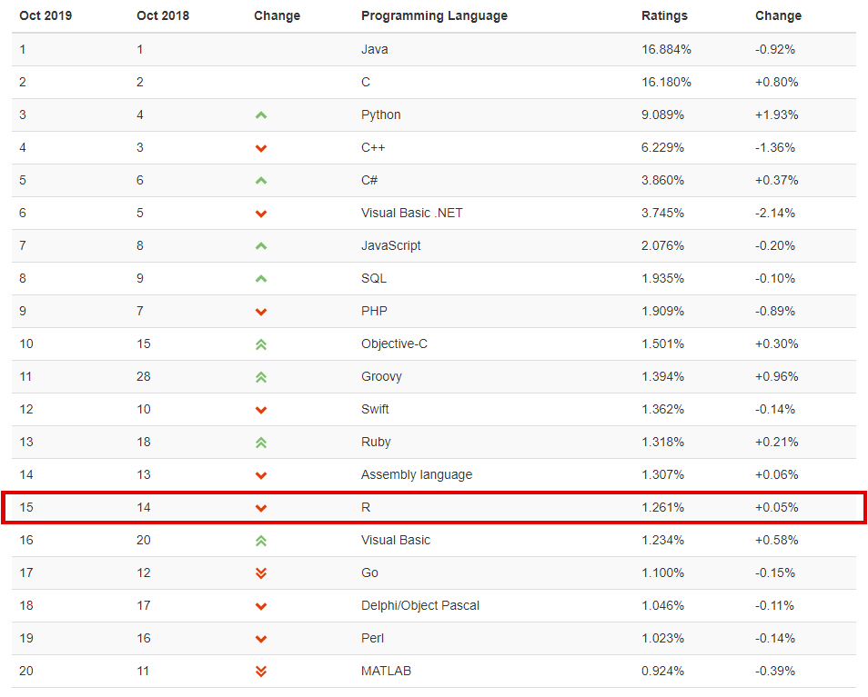
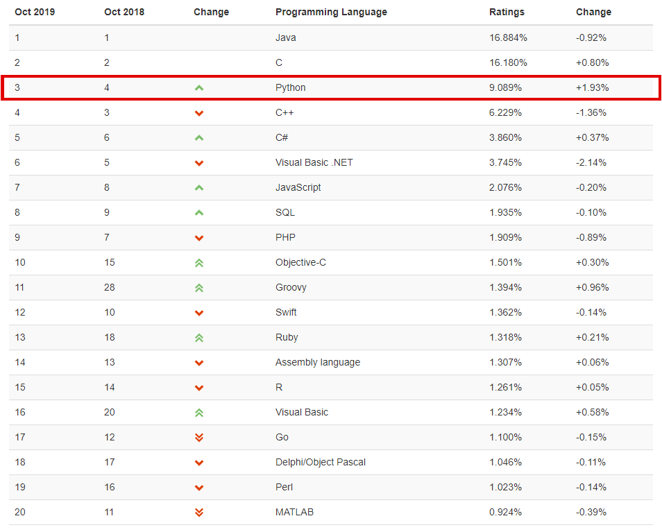
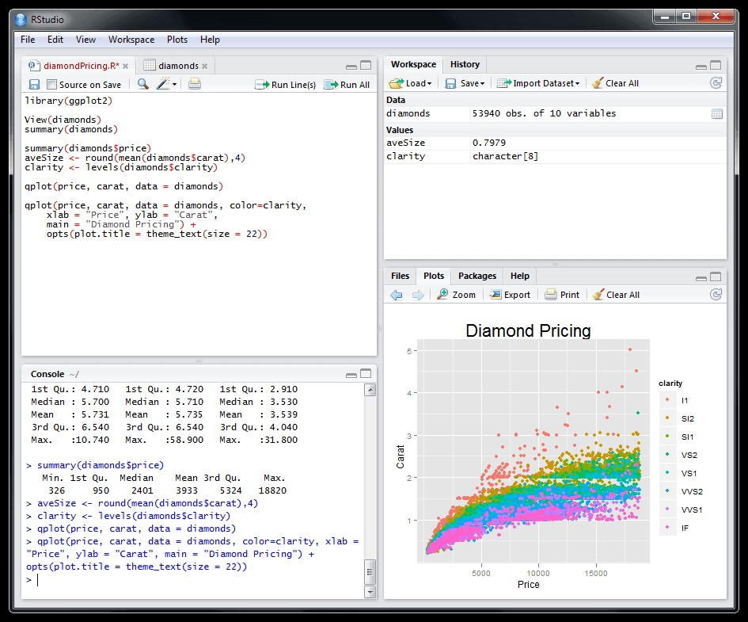
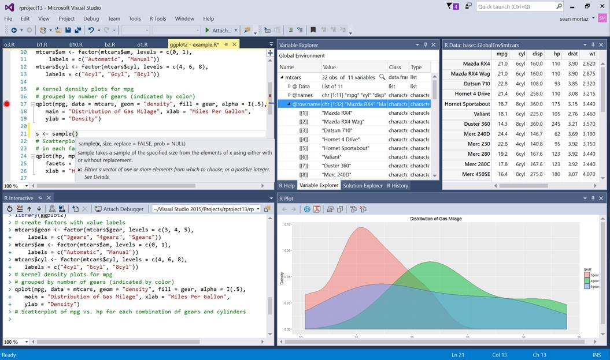

```{r knitr_init, echo=FALSE, cache=FALSE}
library(knitr)
## Global options
opts_chunk$set(echo=TRUE,
               cache=TRUE,
               prompt=FALSE,
               tidy=TRUE,
               comment=NA,
               message=FALSE,
               warning=FALSE,
               fig.path = paste0("../../SemilleroRyPython/images/", "Sesion01"),
               cache.path = "../../SemilleroRyPython/cache/",
               cache = FALSE)

```

## Qué es R?

<tt>R</tt> es un lenguaje y ambiente de alto nivel para la realización de cálculo, gráficos, manipulación, tratamiento y análisis de datos. Tiene la ventaja de ser un lenguaje de programación orientado a objetos, junto con un sistema de ventanas que permite una interacción directa e intuitiva con el tipo de programación realizada.

Ésto hace el lenguaje de programación usado en <tt>R</tt> posea una notable cercanía con la forma en que se expresarían las cosas en la vida real, ya que trabaja sobre objetos visibles que poseen determinadas caraterística, lo cual hace que puedan ser empleados para la realización de acciones específicas.

Adicionalmente, se tiene que este lenguaje de programación es de distribución libre activamente en desarrollo, bajo licencia GNU, que puede correrse en distintas plataformas tales como Linux, Windows, MacOS e incluso PlayStation 3. 

<tt>R</tt> es uno de los software con mayor crecimiento en los últimos años, es utilizado principalmente en investigación y academia, sin embargo, el software se está expandiendo rápidamente al mundo empresarial. Lo anterior puede verse cuantificado en el Indice TIOBE en donde se observa que <tt>R</tt> ocupa actualmente el puesto número `$15$` en el ranking de los lenguajes de programación más usados.



### Un poco de historia
<tt>S</tt> es un lenguaje que fue desarrollado por John Chambers y colaboradores en Laboratorios Bell (AT&T), actualmente Lucent Tecnologies, en 1976. Este lenguaje, originalmente fue codificado e implementado como unas bibliotecas de <tt>FORTRAN</tt>. Por razones de eficiencia, en 1988 <tt>S</tt> fue reescrito en lenguaje <tt>C</tt>, dando origen al sistema estadístico S, Versión 3. Con la finalidad de impulsar comercialmente a <tt>S</tt>, Bell Laboratories dio a StatSci (ahora Insightful Corporation) en 1993, una licencia exclusiva para desarrollar y vender el lenguaje <tt>S</tt>. En 1998, <tt>S</tt> ganó el premio de la *Association for Computing Machinery* a los Sistemas de Software, y se liberó la versión 4, la cual es prácticamente la versión actual.

El éxito de <tt>S</tt> fue tal que, en 2004 Insghtful decide comprar el lenguaje a Lucent (Bell Laboratories) por la suma de 2 millones de dólares, convirtiéndose hasta la fecha en el dueño. Desde entonces, Insightful vende su implementación del lenguaje <tt>S</tt> bajo el nombre de <tt>S-PLUS</tt>, donde le añade un ambiente gráfico amigable. En el año 2008, TIBCO compra Insightful por 25 millones de dólares y se continúa vendiendo <tt>S-PLUS</tt>, sin modificaciones. <tt>R</tt>, que define su sintaxis a partir de esa versión de <tt>S</tt>, no ha sufrido en lo fundamental ningún cambio dramático desde 1998.

<tt>R</tt> fue creado en 1992 en Nueva Zelanda por Ross Ihaka y Robert Gentleman. La intención inicial con <tt>R</tt>, era hacer un lenguaje didáctico, para ser utilizado en el curso de *Introducción a la Estadística* de la Universidad de Nueva Zelanda. Para ello decidieron adoptar la sintaxis del lenguaje <tt>S</tt> desarrollado por Bell Laboratories. Como consecuencia, la sintaxis es similar al lenguaje <tt>S</tt>, pero la semántica, que aparentemente es parecida a la de <tt>S</tt>, en realidad es sensiblemente diferente, sobre todo en los detalles un poco más profundos de la programación.

Luego de la creación de <tt>R</tt>, se da un primer anuncio al público del software en 1993. En el año de 1995 Martin Mächler, de la Escuela Politécnica Federal de Zúrich, convence a Ross y Robert a usar la Licencia GNU para hacer de <tt>R</tt> un software libre. Como consecuencia, a partir de 1997, <tt>R</tt> forma parte del proyecto GNU. Con el propósito de crear algún tipo de soporte para el lenguaje, en 1996 se crea una lista pública de correos; sin embargo debido al gran éxito de <tt>R</tt>, los creadores fueron rebasados por la continua llegada de correos.

Por esta razón, se vieron en la necesidad de crear, en 1997, dos listas de correos, a saber: R-help y R-devel, que son las que actualmente funcionan para responder las diversas dudas que los usuarios proponen en muy diversos asuntos relativos al lenguaje. Además se consolida el grupo núcleo de R (R Core Team), donde se involucran personas asociadas con S-PLUS, con la finalidad de administrar el código fuente de <tt>R</tt>. Fue hasta febrero de 29 del 2000, que se considera al software completo y lo suficientemente estable, para liberar la versión 1.0.

### Ventajas de R

* Es un software libre, es decir, gratis.
* El usuario se compromete al código ético de no comercializar el software.
* Se puede modificar el código fuente a preferencia del usuario.
* Mantiene constantemente actualizado. (v3.6.1 "Action of the Toes" ha sido lanzado el 2019/07/05)
* Dispone de muy buena documentación.
* Es un lenguaje multiplataforma.
* Funciona mediante paquetes que son trabajos colaborativos de la comunidad R. [CRAN](https://cran.r-project.org/) (Actualmente hay 15160 paquetes en el CRAN), [GitHub](https://github.com/trending/r), [Microsoft](https://mran.microsoft.com/packages)
* La comunidad es la que ofrece la asistencia técnica. ([StackOverflow](https://stackoverflow.com/questions/tagged/r),  [R FAQ](https://cran.r-project.org/doc/FAQ/R-FAQ.html),  [Nabble](http://r.789695.n4.nabble.com/),  [R-Help](https://stat.ethz.ch/mailman/listinfo/r-help))
* Existen muchos tutoriales, blogs y cursos específicos online. ([RBloggers](https://www.r-bloggers.com/), [DataCamp](https://www.datacamp.com/), [Coursera](https://es.coursera.org/courses?query=r))

### Desventajas de R

* Depende fuertemente de la memoria RAM.
* Requiere saber de programación para usarlo.
* La actualización de los paquetes depende de los autores.
* No todos los paquetes son de alta calidad. 
* Puede llegar a tener problemas con grandes volúmenes de datos.

Estas desventajas se convierte en oportunidades para los desarrolladores, muchos de estos problemas ya están solucionados, y siguen creciendo las nuevas propuestas.

## Qué es Python?
<tt>Python</tt> también es un lenguaje y ambiente de alto nivel cuya filosofía hace hincapié en una sintaxis que favorezca un código legible, simple, versatil, para un rápido desarrollo. Similar a <tt>R</tt>, <tt>Python</tt> también es un lenguaje orientado a obtjetos, pensado para realizar cualquier tipo de programa, desde aplicaciones Windows a servidores de red o incluso, páginas web, aplicaciones para celular o hasta videojuegos.

Python es un lenguaje de programación dinámico que se implementa en una variedad de plataformas, ésto debido a la licencia de código abierto que posee, lo cual le permite ser utilización en distintos contextos sin la necesidad de abonar en éstos.

Similar a <tt>R</tt>, pero con un crecimiento aún mayor durante los últimos años, <tt>Python</tt> se ha consolidado en el top `$5$` de software más usados en el mundo, codeandose con otros lenguajes como <tt>Java</tt>, <tt>C</tt> o <tt>C++</tt>. Ésto puede verse reflejado en el Indice TIOBE, donde se aprecia que <tt>Python</tt> ocupa actualmente el puesto número `$3$`.



### Un poco de historia
El creador del lenguaje es un europeo llamado Guido Van Rossum, el cual ideó el lenguaje <tt>Python</tt> a finales de los 80 y comenzó a implementarlo en diciembre de 1989, ayudado y motivado por su experiencia en la creación de otro lenguaje llamado ABC. El objetivo de Guido era cubrir la necesidad de un lenguaje orientado a objetos de sencillo uso que sirviese para tratar diversas tareas dentro de la programación que habitualmente se hacía en Unix usando <tt>C</tt>.

En febrero de 1991 publicó la primera versión pública, la versión 0.9.0. La versión 1.0 se publicó en enero de 1994, la versión 2.0 se publicó en octubre de 2000 y la versión 3.0 se publicó en diciembre de 2008. hasta 2018, el desarrollo de Python lo lleva a cabo un colectivo de programadores dirigido por Guido van Rossum y bajo el paraguas de la fundación Python Software Foundation. 

La imagen siguiente muestra la fecha de publicación de las versiones principales de Python, en cada una de las tres grandes versiones, Python 1, Python 2 y Python 3. Las versiones indicadas con punto rojo se consideran obsoletas, las versiones indicadas con punto azul siguen publicando actualizaciones, las versiones indicadas con punto blanco corresponden a versiones futuras con las fechas de publicación previstas.


La imagen siguiente muestra la fecha de publicación de las últimas versiones menores de Python. Las versiones indicadas en rojo se consideran obsoletas, las versiones indicadas con punto blanco corresponden a versiones futuras con fechas ya previstas.


### Ventajas de Python
* Sencillez, legibilidad y exactitud en la sintaxis.
* Posee dialcetos o variantes en su programación que se adaptan a otros lenguajes, tales como Jython que se utiliza para escribir en Java
* Es un lenguaje muy portable (ya sea en Mac, Linux o Windows) en comparación con otros lenguajes.
* Soporta grandes bases de datos.
* Es un lenguaje multiplataforma.
* Funciona mediante paquetes que son trabajos colaborativos.

### Desventajas de Python
* Dado que Python es un lenguaje de programación interpretado, tiene la desventaja de ser más lento que <tt>Java</tt>, <tt>C++</tt> o <tt>C#</tt>.
* La mayoría de los servidores no tienen soporte a Python, y si lo soportan, la configuración es un poco difícil.
* Algunas librerías que trae por defecto no son del gusto de amplio de la comunidad, y optan a usar librerías de terceros.
* No dispone de buena documentación, respecto a otros lenguajes de programación como <tt>PHP</tt> y <tt>Java</tt> y <tt>R</tt>.
* Programación complicada en multihilo

## Entorno de desarrollo integrado (IDE)
Un entorno de desarrollo integrado o entorno de desarrollo interactivo, en inglés Integrated Development Environment (IDE), permite a los programadores consolidar los diferentes aspectos de escribir un programa de computadora, ya que proporciona servicios integrales para facilitar al desarrollador o programador el desarrollo del software.

Los IDE aumentan la productividad del programador al combinar actividades comunes de escritura de software en una sola aplicación: edición de código fuente, creación de ejecutables y depuración.

Aunque no todas la IDE tienen las mismas características, una parte importante en la selección de una IDE, es que ésta conozca la sintaxis del idioma que trata de interpretar, proporcionando pistas visuales, en donde tome palabras clave o palabras que tienen un significado especial, y las resalte de diferentes colores, facilitando con ello la fácil identificación y lectura de los códigos.

También es importante que el IDE, pueda anticipar lo que se va a escribir a continuación o los argumentos pertenecientes a funciones específicas, con el fin de agilizar la escritura de código. Adicionalmente, se requiere que una buena IDE cuente con herramientas de depuración, los cuales muestre sugerencias durante la codificación, permita al programador examinar diferentes variables y realizar inspecciones detalladas de su código, con el fin de evitar errores antes de la compilación

### IDE's para R

#### RStudio
<tt>RStudio</tt> es una de las principales IDE para el lenguaje de programación <tt>R</tt>. Tiene una versión gratuita, más no limitada, que permite tener un entorno de trabajo más organizado y con asistencia básica. [https://rstudio.com](https://rstudio.com){:target="_blank"}




Cuenta con una gan cantidad de librerías asociadas, y desarrolladas por el equipo de RStudio.


#### Visual Studio para R
<tt>Visual Studio para R</tt> es una IDE alternativa para la programación en <tt>R</tt> desarrollada por Microsoft. Ésta IDE cuenta con tres versiones diferentes, la primera llamada Community, es una versión gratuita del software pensada para estudiantes y desarrolladores individuales. La segunda es una versión de pago llamada Professional, la cual está pensada como una herramienta para desarrollo profesional, que cuenta con algunos servicios y beneficios de suscripción para equipos pequeños. La tercera versión llamada Enterprise, es otra versión de pago, pensada para dar soluciones integrales que satisfagan las exigentes necesidades de calidad y escala de equipos de todos los tamaños. [https://visualstudio.microsoft.com/es/vs/features/rtvs/](https://visualstudio.microsoft.com/es/vs/features/rtvs/){:target="_blank"}




#### Otras IDE para R
* **RIDE:** R-Brain IDE (RIDE) para R & Python. Diseño flexible Soporte de múltiples idiomas. [https://r-brain.io/](https://r-brain.io/){:target="_blank"}
* **Jupyter notebook:** La aplicación Jupyter Notebook es una aplicación de servidor-cliente que permite editar y ejecutar documentos de notebook a través de un navegador web. La aplicación Jupyter Notebook se puede ejecutar en un escritorio local [http://jupyter.org/](http://jupyter.org/){:target="_blank"}
* **Radiant:** Interfaz basada en navegador independiente de plataforma de código abierto para análisis de negocios en <tt>R</tt>, basada en el paquete Shiny y se puede ejecutar localmente o en un servidor. [https://vnijs.github.io/radiant/](https://vnijs.github.io/radiant/){:target="_blank"}
* **Architect:** Architect es una que se enfoca específicamente en las necesidades del científico de datos. Todas las tareas de ciencia de datos, desde el análisis de datos hasta la redacción de informes, se pueden realizar en un solo entorno con una lógica común.
[https://www.getarchitect.io](https://www.getarchitect.io){:target="_blank"}
* **Displayr:** Simple y poderoso. Automatización por menú o código. Visualizaciones elegantes. Publicación instantánea Colaboración. Reproducibilidad Actualización automática Plataforma segura en la nube. [https://www.displayr.com/features/](https://www.displayr.com/features/){:target="_blank"}
* **Rbox:** Este paquete es una colección de varios paquetes para ejecutar R a través del editor Atom.[https://atom.io/packages/rbox](https://atom.io/packages/rbox){:target="_blank"}
* **RKWard:** Es un IDE/GNU fácil de usar y fácilmente extensible para R. Su objetivo es combinar el poder del lenguaje R con la facilidad de uso de las herramientas de estadísticas comerciales. [https://rkward.kde.org](https://rkward.kde.org){:target="_blank"}
* **Tinn-R:** Es un editor/procesador de textos ASCII/UNICODE genérico para el sistema operativo Windows, muy bien integrado en <tt>R</tt>, con características de interfaz gráfica de usuario (GUI) y entorno de desarrollo integrado (IDE). [https://sourceforge.net/projects/tinn-r/](https://sourceforge.net/projects/tinn-r/){:target="_blank"}
* **R AnalyticFlow** es un software de análisis de datos que utiliza el entorno R para la computación estadística, funciona en Windows, Mac y Linux y es gratuito para cualquier uso. Además de la interfaz de usuario intuitiva, también ofrece funciones avanzadas para expertos en <tt>R</tt>. [https://r.analyticflow.com/en/](https://r.analyticflow.com/en/){:target="_blank"}
* **Nvim-R** Es un plugin para <tt>Vim</tt> que permite la edición de codigo de <tt>R</tt>. [https://github.com/jalvesaq/Nvim-R](https://github.com/jalvesaq/Nvim-R){:target="_blank"}

### IDE's para Python

#### Spyder
Spuder es un poderoso entorno científico escrito en Python, para Python, y diseñado por y para científicos, ingenieros y analistas de datos. Ofrece una combinación única de la funcionalidad avanzada de edición, análisis, depuración y creación de perfiles de una herramienta de desarrollo integral con la exploración de datos, ejecución interactiva, inspección profunda y hermosas capacidades de visualización de un paquete científico. [https://www.spyder-ide.org](https://www.spyder-ide.org){:target="_blank"}


#### Pycharm
El IDE <tt>Pycharm</tt> es muy completo, creado por JetBrains. Este IDE es profesional y viene en dos modalidades: una edición Free y otra muy completa privada que apunta a empresas de desarrollo de software. [https://www.jetbrains.com/pycharm/](https://www.jetbrains.com/pycharm/){:target="_blank"}


#### PyDev
PyDev: el libre de costo y está lleno de características poderosas para programar de manera eficiente en Python. Es un plugin de código abierto y se ejecuta en Eclipse. PyDev posee integración con Django, completa el código de manera automática, soporte multilengua, plantillas de código, análisis de código, marcado de errores y mucho más. [https://www.pydev.org](https://www.pydev.org){:target="_blank"}


#### Otras IDE para Python
* **Sublime Text 3:** Esta IDE es uno de los más livianos y potentes. Con el uso de Plugins,  puede utilizarse como un IDE completo. En un solo lugar podemos ver la elegancia del código y el poder de Python para hacer magia. La interfaz de usuario es muy rápida y fácil de configurar. Contiene muchos paquetes para darle diferentes características. [https://www.sublimetext.com/](https://www.sublimetext.com/){:target="_blank"}
* **Wing:** Esta IDE es comercial y apunta a desarrolladores profesionales. Fue lanzado hace 15 años atrás y es un producto muy maduro, con un montón de herramientas y características para programar en Python. Esta IDE es soportado por Windows, OS X,  Linux. Como Pycharm, tiene una versión básica gratuita, una edición personal y una profesional muy potente.
[https://wingware.com/](https://wingware.com/){:target="_blank"}
* **Vim:** Esta IDE uno de los editores más avanzados y populares dentro de la comunidad de desarrolladores Python. Es de código abierto y se encuentra disponible gratuitamente bajo licencia GPL. [http://www.vim.org/](http://www.vim.org/){:target="_blank"}
* **Atom:** es un editor de código abierto desarrollado por Github que se puede usar para el desarrollo de Python. Sus características también son similares a Sublime Text. Atom es altamente personalizable. Puede instalar paquetes según su necesidad. Algunos de los paquetes comúnmente utilizados en Atom para el desarrollo de Python son autocompletar-python, linter-flake8, python-debugger, etc. [https://atom.io](https://atom.io){:target="_blank"}
* **Thonny:** Thonny es un IDE dedicado a Python que viene con Python 3 incorporado. Una vez que lo instales, puedes comenzar a escribir código Python. Thonny está destinado a principiantes. La interfaz de usuario se mantiene simple para que a los principiantes les resulte fácil comenzar el aprendizaje del lenguaje. [https://thonny.org](https://thonny.org){:target="_blank"} 
* **Visual Studio para Python:** Es una extensión para Python creada por Microsoft, es simple, divertido y productivo. La extensión convierte a VS Code en un IDE excelente y funciona en cualquier sistema operativo con una variedad de intérpretes de Python. Aprovecha toda la potencia de VS Code para proporcionar autocompletado e IntelliSense, linting, depuración y pruebas unitarias, junto con la capacidad de cambiar fácilmente entre entornos Python, incluidos entornos virtuales y conda. Cuenta con tres versiones una gratuita, y dos de pago, a saber, Community, Professional y Enterprise, respectivamente. [https://visualstudio.microsoft.com/es/vs/features/python/](https://visualstudio.microsoft.com/es/vs/features/python/){:target="_blank"} 
* **Komodo:**  es un IDE de Python con todas las funciones que soporta las principales tecnologías web, incluyendo HTML5, CSS, JavaScript, Flask, Django y muchas más. [https://www.activestate.com/products/komodo-ide/python-editor/](https://www.activestate.com/products/komodo-ide/python-editor/){:target="_blank"} 

## Nivel de habilidades
* **Usuarios:** Son aquellas personas familiarizadas con el lenguaje de programación, capaces de correr funciones, paquetes y construir gráficos.
* **Programadores:** Son aquellos que están en capacidad de construir funciones personalizadas y paquetes básicos para la solución de problemas.
* **Desarrolladores:** Son aquellos con competencias de alto nivel que pueden construir paquetes complejos e integración con diversas herramientas y lenguajes.
* **Hackers:** Son programadores de muy alto nivel, son aquellos que crean nuevas herramientas y aplicaciones que se integran con diversas herramientas, y optimizan el lenguaje.

## Alcance del Semillero
A lo largo del semillero los estudiantes tendrán habilidad de **Usuarios**, pues tendrán la capacidad de manejar datos estructurados, realización de gráficas básicas, avanzadas, realizar análisis estadísticos básicos, y desarrollarán la habilidad de **Programadores**, pues tendrán la capacidad de crear funciones básicas que les permita abordar diferentes problemas.

Adicionalmente, se incentivará al estudiante para que aborde un problema de investigación en el área de interés, usando los programas <tt>R</tt> o <tt>Python</tt> como soporte de la investigación realizada. Ésto con el fin de mejorar sus habilidades investigativas y manejo de los programas aquí enseñados.


