```{r knitr_init, echo=FALSE, cache=FALSE}
library(knitr)
## Global options
opts_chunk$set(echo=TRUE,
               cache=TRUE,
               prompt=FALSE,
               tidy=TRUE,
               comment=NA,
               message=FALSE,
               warning=FALSE,
               fig.path = paste0("../../SemilleroRyPython/images/", "GuiaUbuntu"),
               cache.path = "../../SemilleroRyPython/cache/",
               cache = FALSE)

```

## Instalación de Python - Anaconda
Para la descarga de la última versión de Python - Anaconda en Ubuntu, haga click en el siguiente enlace [(Descargar Python-Anaconda)](https://www.anaconda.com/distribution/#linux){:target="_blank"}.
Una vez realizado click en el enlace, se abrirá la siguiente venta

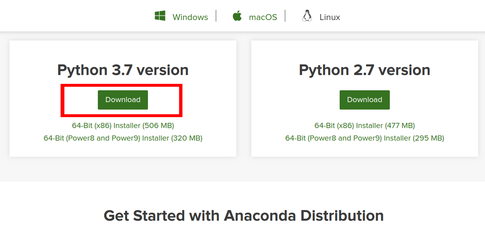

Haga click en el botón de descarga que aparece en la imagen anterior, para que inicie la descarga de un archivo con nombre *Anaconda3-XXXX.XX-Linux-x86_64.sh*, donde **XXXX.XX** hace referencia al año y al mes de la última actualización, por ejemplo, *Anaconda3-2019.10-Linux-x86_64.sh*.

una vez descargado el archivo, es necesario verificar si el archivo fue correctamente descargado, para ello, abriremos una terminal y escribiremos las siguientes lineas de código 

```
sha256sum ~/Descargas/Anaconda3-2019.10-Linux-x86_64.sh
```

obteniendo la siguiente salida

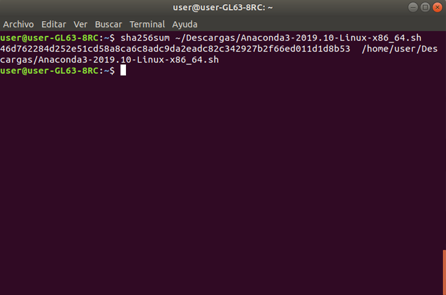

donde la carpeta Descargas es el lugar donde se realizan las descargas por defecto. Si usted realiza las descargas en un directorio diferente, será necesario reemplazar esta linea de código por el directorio donde haya descargado el archivo.

Si la verificación del archivo es satisfactorio, se deberá correr la siguiente linea de código, con el fin de ejecutar el script de Anaconda bash

```
bash ~/Descargas/Anaconda3-2019.10-Linux-x86_64.sh
```

una vez ejecutado el script anterior en la terminal se obtendrá la siguiente salida

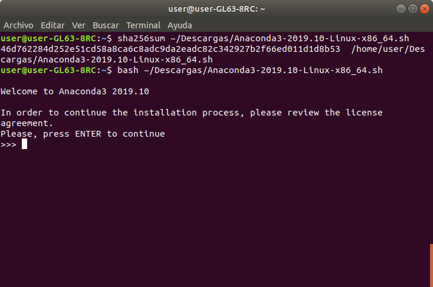

El recuadro le mostrará un mensaje de bienvenida para la instalación de Anaconda. En donde, para comenzar la instalación será necesario aceptar el acuerdo de licencia presionando la tecla *Enter*, lo cual hará que le muestren el contrato de instalación

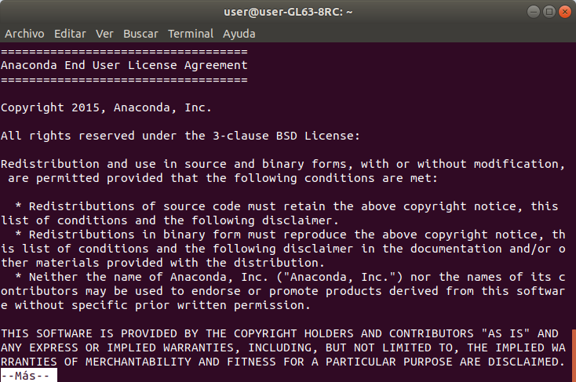

En este caso podrá leer el contrato si es de su interés, y para avanzar será cuestión de presionar la barra espaciadora varias veces hasta llegar al final del acuerdo, en donde se encontrará con la siguiente pantalla

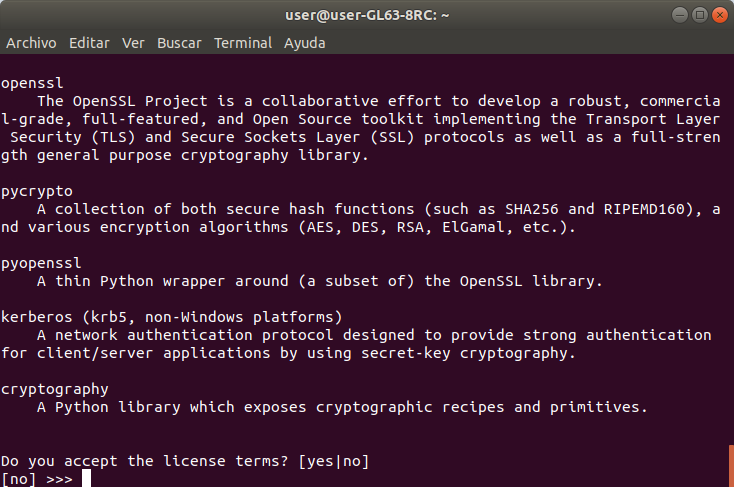

Escriba en la terminal *yes* seguido de la tecla *Enter* para comenzar con el proceso de instalación. Después de aceptar los términos de la licencia, aparecerá el siguiente mensaje

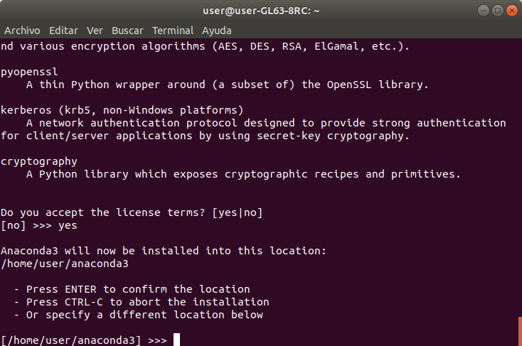

El cual te pedirá que ingreses el directorio donde deseas instalar Anaconda Python. Te dan tres opciones, pero se recomienda dejar la ubicación predeterminada, así que solo será cuestión de presionar la tecla *Enter*. Esto provocará que comience al proceso de extracción de la información, tal como se muestra en la siguiente ventana

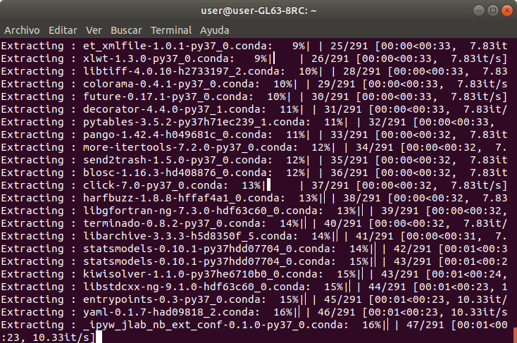

El proceso de instalación puede tardar varios minutos. Una vez finalizado el proceso de instalación se tendrá la siguiente mensaje

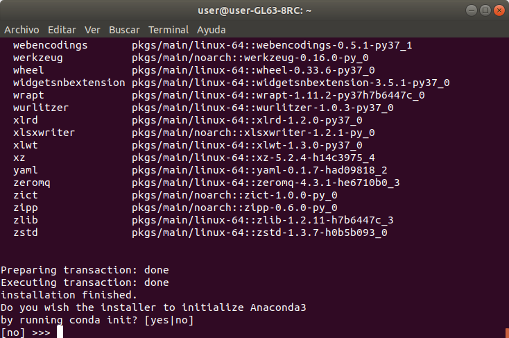

En éste se pregunta si se desea incluir la ubicación de instalación de Anaconda Python en la ruta de tu Ubuntu 18.04 como se resaltó anteriormente. Simplemente escribe *yes* y presiona la tecla *Enter*, y con ésto habrá finalizado el proceso de instalación de Python.

Ahora con el fin de inicializar anaconda, desde la terminal corre las siguientes lineas de código

```
conda config --set auto_activate_base True
source ~/.bashrc
anaconda-navigator
```

y con ésto aparecerá la siguiente ventana, la cual permitirá acceder a Spyder u a otros programas asociados a Anaconda.

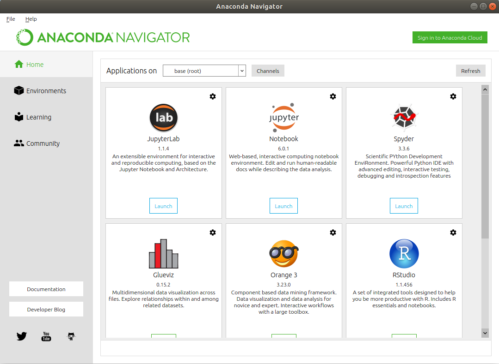

Una vez terminado de usar el programa, escribir en la terminal

```
conda config --set auto_activate_base False
source ~/.bashrc
```

para volver la terminal a la normalidad.

## Instalación de IDE's
Existen diferentes IDE's para trabajar en Python. La selección de una u otra depende de los gustos o preferencias que tengan los usuarios ya que algunas pueden ofrecer más ventajas respecto a otras, ya que en algunas, se desarrollan algunos complementos que permiten vincular el código de Python con otros entornos, tales como SQL, HTML, JavaScript, Django, entre otros. Ya es labor de cada usuario explorar cuál de éstas es la que se adapta mejor a sus necesidades.

A continuación se listan algunas de las IDE para trabajar en Python

### Spyder
Spyder es una de las IDE más usadas por usuarios de R, debido a la similaridad que posee ésta con R Studio visualmente, la facilidad para encontrar ayuda para paquetes o funciones, posee inspector de objetivos, explorador de archivos y Explorador de variables.

Esta IDE viene instalada por defecto cuando se realiza la instalación de Anaconda, pero se recomienda realizar su instalación como un programa independiente, y para ello es necesario abrir una terminar e ingresar la siguiente linea de código

```
sudo apt-get install spyder3
```

tal como se muestra el la siguiente ventana

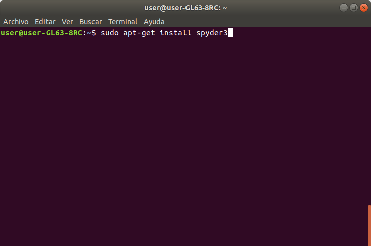

presiona *Enter* y comenzará la instalación. Es posible que la terminal te pida ingresar la clave de usuario. De ser el caso, ingresa la contraseña y comenzará la instalación del programa.

Con ello comenzará la descarga de Spyder, lo cual puede tardar unos minutos. Una vez realizada toda la descarga aparecerá la siguiente linea de código

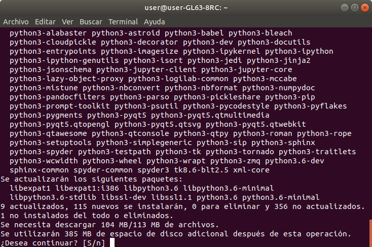

Escribe *S* y presiona *Enter* y ya será cuestión de esperar a que el proceso de instalación concluya. Una vez concluido el proceso de instalación de forma satisfactoria, podrás buscar el programa Spyder dentro de tu lista de programas y abrirlo directamente sin necesitar de inicializar anaconda desde la terminal.


### PyCharm
Pycharm es una IDE de Python para desarrolladores profesionales o para aquellos que deseen aprender a codificar en Python. Existen dos versiones para esta IDE, una versión profesional de pago o una versión gratuita, Aunque no todas las características de la versión profesional están incluidas en la versión gratuita.

Para descargar la IDE PyCharm, pueden dirigirse al siguiente link de descarga [www.anaconda.com/pycharm](www.anaconda.com/pycharm){:target="_blank"}

### Komodo
Komodo IDE es un IDE multilingüe desarrollado por Active State, que ofrece soporte para Python, PHP, Perl, Go, Ruby, desarrollo web (HTML, CSS, JavaScript) y más. Active State también desarrolla Komodo Edit y ActiveTcl, entre otras ofertas.

El producto viene equipado con inteligencia de código para facilitar el autocompletado y la refactorización. También proporciona herramientas para depurar y probar. La plataforma admite múltiples formatos de control de versiones, incluidos Git, Mercurial y Subversión, entre otros.

Para descargar la IDE Komodo, pueden dirigirse al siguiente link de descarga [https://www.activestate.com/products/komodo-ide/download-ide/](https://www.activestate.com/products/komodo-ide/download-ide/){:target="_blank"}

### Atom
Atom es una IDE que incluye la mayoría de las funcionalidades que poseen las otras IDE básicas, pero a diferencia de las mismas, posee entre sus características el resaltado de sintaxis y la finalización automática. Los desarrolladores de Atom están trabajando en la integración este programa con otros lenguajes de programación tales como Rust o Go.

Atom está en mejora de su rendimiento y sus desarrolladores están extremadamente atentos a las necesidades y opiniones de la comunidad, lo cual hace que la experiencia del usuario sea más gratificante.

Para descargar la IDE Atom, pueden dirigirse al siguiente link de descarga [https://atom.io](https://atom.io){:target="_blank"}
