```{r knitr_init, echo=FALSE, cache=FALSE}
library(knitr)
## Global options
opts_chunk$set(echo=TRUE,
               cache=TRUE,
               prompt=FALSE,
               tidy=TRUE,
               comment=NA,
               message=FALSE,
               warning=FALSE,
               fig.path = paste0("../../SemilleroRyPython/images/", "GuiaWindows"),
               cache.path = "../../SemilleroRyPython/cache/",
               cache = FALSE)

```

## Instalación de Python - Anaconda
Para la descarga de la última versión de Python - Anaconda en Windows, haga click en el siguiente enlace [(Descargar Python-Anaconda)](https://www.anaconda.com/distribution/#windows){:target="_blank"}.
Una vez realizado click en el enlace, se abrirá la siguiente venta

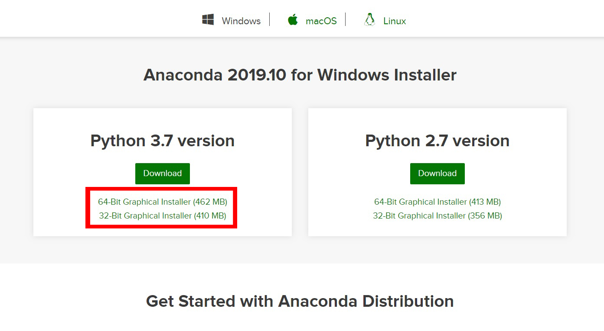
Haga click en el recuadro rojo que aparece en la imagen anterior, dependiendo si su sistema operativo es de 64-bits o 32-bits, e iniciará la descarga de un archivo con nombre Anaconda3-XXXX.XX-Windows-x86_64.exe en el caso de 64 bits o Anaconda3-XXXX.XX-Windows-x86.exe en el caso de 32 bits, donde **XXXX.XX** hace referencia al año y al mes de la última actualización, por ejemplo, *Anaconda3-2019.10-Linux-x86_64.sh*.

Para consultar la versión del sistema operativo, puede presionar las teclas <tt>Windows + Pausa</tt>, obteniendo la siguiente imagen.

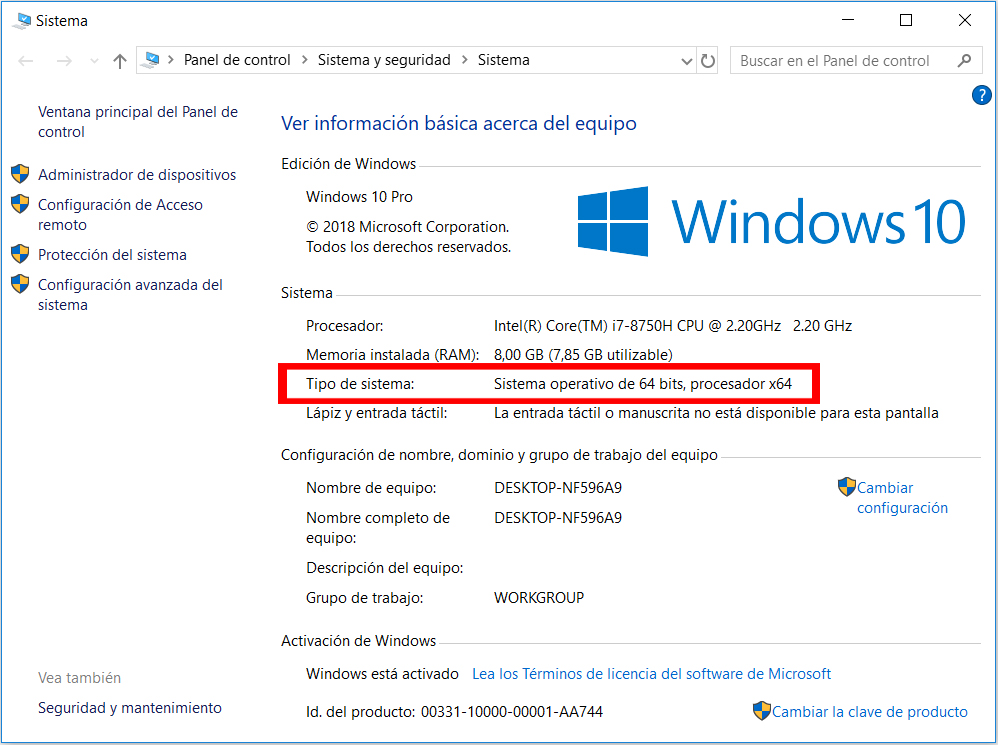

En este caso, el sistema operativo es de 64bits, y por tanto se selecciona la opción "64-Bit Graphical Installer", en el momento de seleccionar la versión a descargar.

Una vez completada la descarga, haga doble click sobre el instalador para que éste inicie y muestre la siguiente ventana

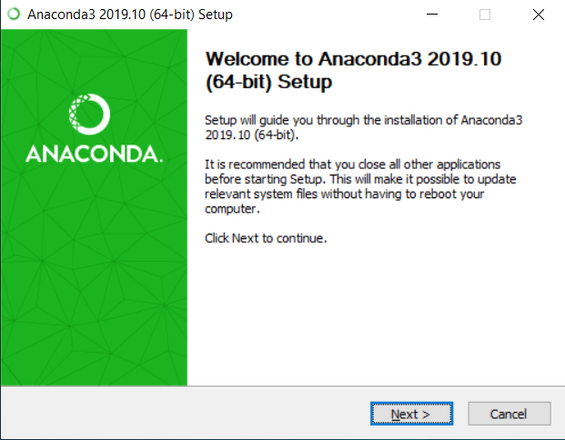

En la ventana de bienvenida, haga click en __Next >__ para que el instalador continúe 

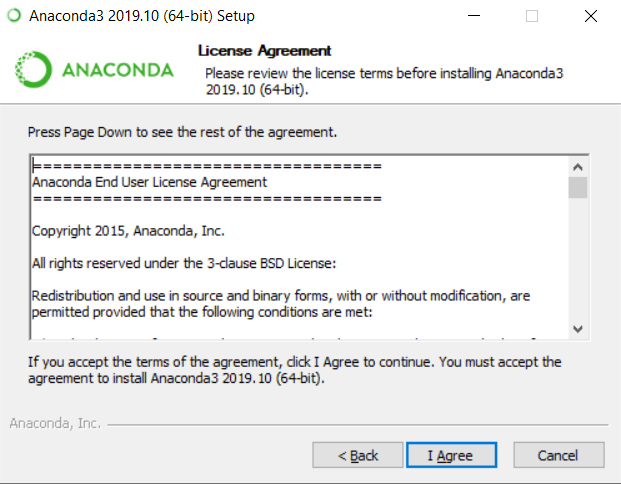

En la ventana de licencia del programa, puede leer la información allí presentada si es de su interés, y de click en el botón __I Agree__

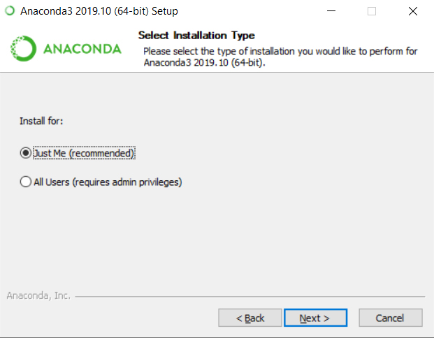

En la ventana de de selección del tipo de instalación, presione "Just Me" o "All Users" y luego presione el botón __Next >__. La selección de "Just Me" o "All Users" dependerá si en el equipo se tienen más de una sesión y se desea instalar solo en la sesión propia o en todas las existentes.

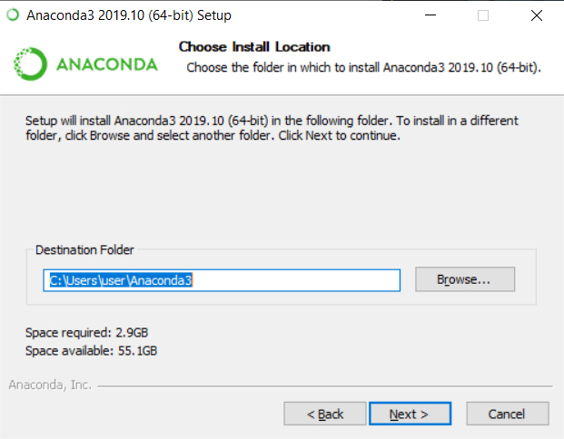

En la ventana de selección de carpeta de destino, puede presionar el botón __Borwse...__ y seleccionar otra ubicación para la instalación del programa (Se recomienda hacer la instalación en un directorio que no posea espacios o caracteres unicode). Seguidamente, presione el botón __Next >__


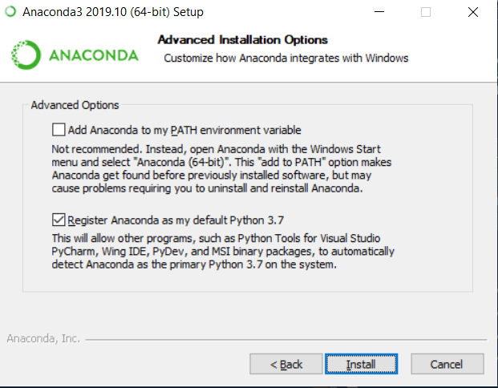

En la ventana de opciones avanzadas, se deja seleccionada las opciones predeterminadas y haga click en el botón __Install__. (Se recomienda no seleccionar "Add Anaconda to my PATH enviroment variable" debido a que esto puede generar interferencias con otros software)

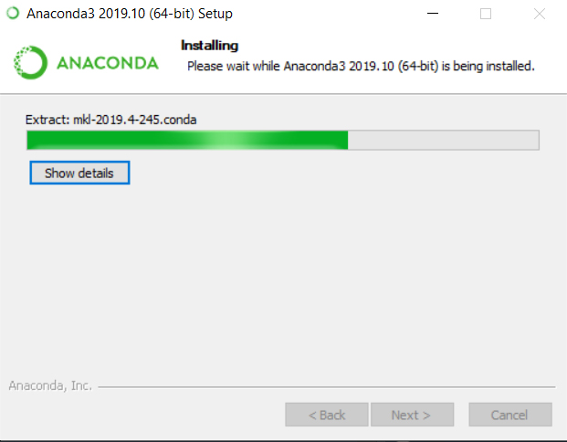

Esto hará que aparezca la ventana de instalación, espere un par de minutos mientras el proceso finaliza.

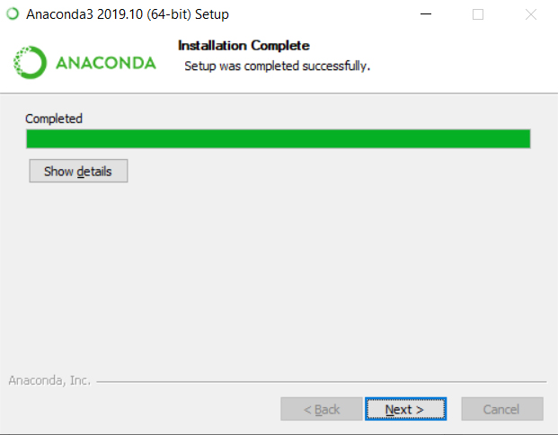

Una vez se completa la instalación, pueden observar los detalles de la instalación presionando el botón __Show details__ o simplemente presionar el botón __Next >__

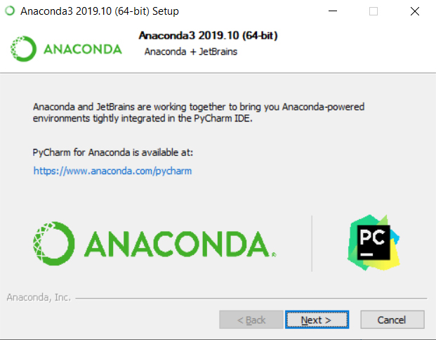

Como instalación opcional aparecerá una ventana sugiriendo la IDE PyCharm, la cual se podrá descargar desde el link [www.anaconda.com/pycharm](www.anaconda.com/pycharm){:target="_blank"}, presione en el link si desea descargarla, o en otro lugar, presione simplemente el botón __Next >__

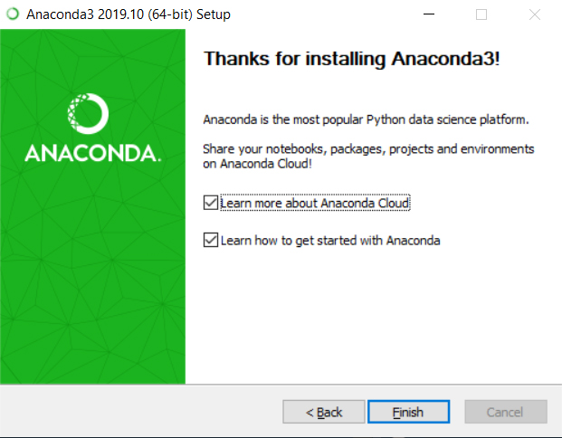

Finalmente aparecerá la ventana de agradecimiento, presione el botón __Finish__, y con ésto concluirá la instalación del programa.


## Instalación de IDE's
Existen diferentes IDE's para trabajar en Python. La selección de una u otra depende de los gustos o preferencias que tengan los usuarios ya que algunas pueden ofrecer más ventajas respecto a otras, ya que en algunas, se desarrollan algunos complementos que permiten vincular el código de Python con otros entornos, tales como SQL, HTML, JavaScript, Django, entre otros. Ya es labor de cada usuario explorar cuál de éstas es la que se adapta mejor a sus necesidades.

A continuación se listan algunas de las IDE para trabajar en Python

### Spyder
Spyder es una de las IDE más usadas por usuarios de R, debido a la similaridad que posee ésta con R Studio visualmente, la facilidad para encontrar ayuda para paquetes o funciones, posee inspector de objetivos, explorador de archivos y Explorador de variables.

Esta IDE viene instalada por defecto cuando se realiza la instalación de Anaconda, así que no es necesario realizar instalaciones adicionales para conseguirla.

### PyCharm
Pycharm es una IDE de Python para desarrolladores profesionales o para aquellos que deseen aprender a codificar en Python. Existen dos versiones para esta IDE, una versión profesional de pago o una versión gratuita, Aunque no todas las características de la versión profesional están incluidas en la versión gratuita.

Para descargar la IDE PyCharm, pueden dirigirse al siguiente link de descarga [www.anaconda.com/pycharm](www.anaconda.com/pycharm){:target="_blank"}

### Komodo
Komodo IDE es un IDE multilingüe desarrollado por Active State, que ofrece soporte para Python, PHP, Perl, Go, Ruby, desarrollo web (HTML, CSS, JavaScript) y más. Active State también desarrolla Komodo Edit y ActiveTcl, entre otras ofertas.

El producto viene equipado con inteligencia de código para facilitar el autocompletado y la refactorización. También proporciona herramientas para depurar y probar. La plataforma admite múltiples formatos de control de versiones, incluidos Git, Mercurial y Subversión, entre otros.

Para descargar la IDE Komodo, pueden dirigirse al siguiente link de descarga [https://www.activestate.com/products/komodo-ide/download-ide/](https://www.activestate.com/products/komodo-ide/download-ide/){:target="_blank"}

### Atom
Atom es una IDE que incluye la mayoría de las funcionalidades que poseen las otras IDE básicas, pero a diferencia de las mismas, posee entre sus características el resaltado de sintaxis y la finalización automática. Los desarrolladores de Atom están trabajando en la integración este programa con otros lenguajes de programación tales como Rust o Go.

Atom está en mejora de su rendimiento y sus desarrolladores están extremadamente atentos a las necesidades y opiniones de la comunidad, lo cual hace que la experiencia del usuario sea más gratificante.

Para descargar la IDE Atom, pueden dirigirse al siguiente link de descarga [https://atom.io](https://atom.io){:target="_blank"}

