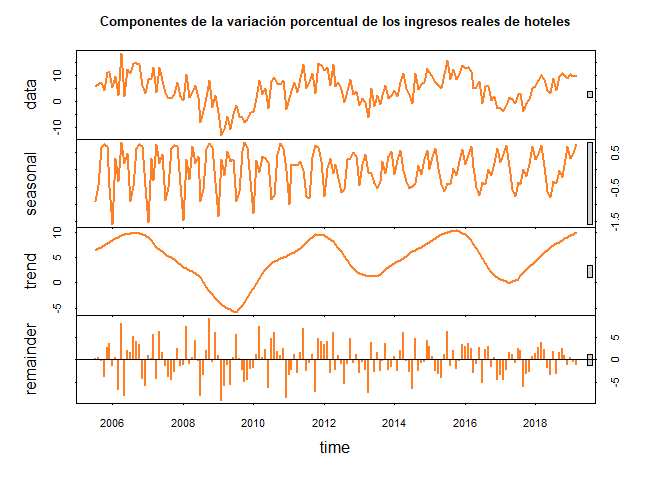

Introducción
------------

Una serie de tiempo es una secuencia de observaciones registradas y
ordenadas de forma periódica, en intervalos de tiempo igualmente
espaciados, tales como, días, meses, semestres, años, entre otros. Estas
observaciones son caracterizadas por una variable aleatoria `$Y_t$`, la
cual depende del tiempo `$t=1,2,\ldots,T$`, y donde el objetivo es
modelar el comportamiento de `$Y_t$` contra `$t$`, siendo `$T$` el
número total de observaciones que se tenga en la serie de tiempo.

Un ejemplo de una serie temporal, se presenta a continuación donde se
muestra el % anual del `$PIB$` per cápita de Colombia, para un intervalo
de tiempo anual que va desde 1961 hasta 2017

<pre>
<!--html_preserve--><div id="htmlwidget-907311b7a80de22e760f" style="width:700px;height:400px;" class="plotly html-widget"></div>
<script type="application/json" data-for="htmlwidget-907311b7a80de22e760f">{"x":{"visdat":{"4ba05eda6f97":["function () ","plotlyVisDat"]},"cur_data":"4ba05eda6f97","attrs":{"4ba05eda6f97":{"x":{},"y":{},"mode":"lines+markers","text":["PIB = 1.983","PIB = 2.293","PIB = 0.232","PIB = 3.034","PIB = 0.557","PIB = 2.157","PIB = 1.11","PIB = 2.925","PIB = 3.21","PIB = 3.462","PIB = 3.38","PIB = 5.181","PIB = 4.344","PIB = 3.415","PIB = 0.054","PIB = 2.386","PIB = 1.82","PIB = 6.026","PIB = 3.003","PIB = 1.744","PIB = -0.023","PIB = -1.316","PIB = -0.684","PIB = 1.093","PIB = 0.907","PIB = 3.625","PIB = 3.235","PIB = 2.009","PIB = 1.418","PIB = 2.313","PIB = 0.117","PIB = 2.167","PIB = 3.532","PIB = 4.009","PIB = 3.465","PIB = 0.428","PIB = 1.834","PIB = -0.939","PIB = -5.612","PIB = 1.435","PIB = 0.227","PIB = 1.065","PIB = 2.489","PIB = 3.923","PIB = 3.348","PIB = 5.439","PIB = 5.551","PIB = 2.045","PIB = 0.059","PIB = 3.207","PIB = 6.232","PIB = 2.851","PIB = 3.548","PIB = 3.745","PIB = 2.024","PIB = 1.073","PIB = 0.934"],"alpha_stroke":1,"sizes":[10,100],"spans":[1,20],"type":"scatter"}},"layout":{"width":700,"height":400,"margin":{"b":60,"l":60,"t":60,"r":30,"pad":4},"title":"Crecimiento del PIB per cápita (% anual)","xaxis":{"domain":[0,1],"automargin":true,"title":"Año"},"yaxis":{"domain":[0,1],"automargin":true,"title":"PIB (% anual)"},"hovermode":"closest","showlegend":false},"source":"A","config":{"showSendToCloud":false},"data":[{"x":[1961,1962,1963,1964,1965,1966,1967,1968,1969,1970,1971,1972,1973,1974,1975,1976,1977,1978,1979,1980,1981,1982,1983,1984,1985,1986,1987,1988,1989,1990,1991,1992,1993,1994,1995,1996,1997,1998,1999,2000,2001,2002,2003,2004,2005,2006,2007,2008,2009,2010,2011,2012,2013,2014,2015,2016,2017],"y":[1.983183392,2.292595551,0.231792643,3.033555246,0.557370132,2.156500316,1.110445303,2.924696885,3.209951184,3.462385145,3.379791618,5.181404836,4.344116951,3.415242062,0.054377114,2.385808489,1.819540279,6.026298262,3.003067413,1.744317806,-0.023027616,-1.316171395,-0.683991606,1.09300722,0.907423685,3.625085068,3.235271842,2.009085124,1.418335593,2.312929483,0.116795606,2.166679144,3.53222506,4.009005561,3.4647784,0.427584131,1.834165369,-0.939121717,-5.611912127,1.43545282,0.226857288,1.065060726,2.489228212,3.922772027,3.34837565,5.439446434,5.551168521,2.045206544,0.058604955,3.206963611,6.232264851,2.850694341,3.547537302,3.744554111,2.023519393,1.072527479,0.934070318],"mode":"lines+markers","text":["PIB = 1.983","PIB = 2.293","PIB = 0.232","PIB = 3.034","PIB = 0.557","PIB = 2.157","PIB = 1.11","PIB = 2.925","PIB = 3.21","PIB = 3.462","PIB = 3.38","PIB = 5.181","PIB = 4.344","PIB = 3.415","PIB = 0.054","PIB = 2.386","PIB = 1.82","PIB = 6.026","PIB = 3.003","PIB = 1.744","PIB = -0.023","PIB = -1.316","PIB = -0.684","PIB = 1.093","PIB = 0.907","PIB = 3.625","PIB = 3.235","PIB = 2.009","PIB = 1.418","PIB = 2.313","PIB = 0.117","PIB = 2.167","PIB = 3.532","PIB = 4.009","PIB = 3.465","PIB = 0.428","PIB = 1.834","PIB = -0.939","PIB = -5.612","PIB = 1.435","PIB = 0.227","PIB = 1.065","PIB = 2.489","PIB = 3.923","PIB = 3.348","PIB = 5.439","PIB = 5.551","PIB = 2.045","PIB = 0.059","PIB = 3.207","PIB = 6.232","PIB = 2.851","PIB = 3.548","PIB = 3.745","PIB = 2.024","PIB = 1.073","PIB = 0.934"],"type":"scatter","marker":{"color":"rgba(31,119,180,1)","line":{"color":"rgba(31,119,180,1)"}},"error_y":{"color":"rgba(31,119,180,1)"},"error_x":{"color":"rgba(31,119,180,1)"},"line":{"color":"rgba(31,119,180,1)"},"xaxis":"x","yaxis":"y","frame":null}],"highlight":{"on":"plotly_click","persistent":false,"dynamic":false,"selectize":false,"opacityDim":0.2,"selected":{"opacity":1},"debounce":0},"shinyEvents":["plotly_hover","plotly_click","plotly_selected","plotly_relayout","plotly_brushed","plotly_brushing","plotly_clickannotation","plotly_doubleclick","plotly_deselect","plotly_afterplot"],"base_url":"https://plot.ly"},"evals":[],"jsHooks":[]}</script><!--/html_preserve-->
</pre>

Otro ejemplo, se presenta para el material particulado `$PM_{10}$` y
`$PM_{2.5}$` en la ciudad de Medellín para el mes de abril del año 2019,
para el cual se realizan los registros en intervalos de una hora

<pre style="height:610px">
<!--html_preserve--><div id="htmlwidget-f597026bfbc2980cbcbf" style="width:700px;height:400px;" class="plotly html-widget"></div>
<script type="application/json" data-for="htmlwidget-f597026bfbc2980cbcbf">{"x":{"data":[{"x":["2019-04-01 00:00:00","2019-04-01 01:00:00","2019-04-01 02:00:00","2019-04-01 03:00:00","2019-04-01 04:00:00","2019-04-01 05:00:00","2019-04-01 06:00:00","2019-04-01 07:00:00","2019-04-01 08:00:00","2019-04-01 09:00:00","2019-04-01 10:00:00","2019-04-01 11:00:00","2019-04-01 12:00:00","2019-04-01 13:00:00","2019-04-01 14:00:00","2019-04-01 15:00:00","2019-04-01 16:00:00","2019-04-01 17:00:00","2019-04-01 18:00:00","2019-04-01 19:00:00","2019-04-01 20:00:00","2019-04-01 21:00:00","2019-04-01 22:00:00","2019-04-01 23:00:00","2019-04-02 00:00:00","2019-04-02 01:00:00","2019-04-02 02:00:00","2019-04-02 03:00:00","2019-04-02 04:00:00","2019-04-02 05:00:00","2019-04-02 06:00:00","2019-04-02 07:00:00","2019-04-02 08:00:00","2019-04-02 09:00:00","2019-04-02 10:00:00","2019-04-02 11:00:00","2019-04-02 12:00:00","2019-04-02 13:00:00","2019-04-02 14:00:00","2019-04-02 15:00:00","2019-04-02 16:00:00","2019-04-02 17:00:00","2019-04-02 18:00:00","2019-04-02 19:00:00","2019-04-02 20:00:00","2019-04-02 21:00:00","2019-04-02 22:00:00","2019-04-02 23:00:00","2019-04-03 00:00:00","2019-04-03 01:00:00","2019-04-03 02:00:00","2019-04-03 03:00:00","2019-04-03 04:00:00","2019-04-03 05:00:00","2019-04-03 06:00:00","2019-04-03 07:00:00","2019-04-03 08:00:00","2019-04-03 09:00:00","2019-04-03 10:00:00","2019-04-03 11:00:00","2019-04-03 12:00:00","2019-04-03 13:00:00","2019-04-03 14:00:00","2019-04-03 15:00:00","2019-04-03 16:00:00","2019-04-03 17:00:00","2019-04-03 18:00:00","2019-04-03 19:00:00","2019-04-03 20:00:00","2019-04-03 21:00:00","2019-04-03 22:00:00","2019-04-03 23:00:00","2019-04-04 00:00:00","2019-04-04 01:00:00","2019-04-04 02:00:00","2019-04-04 03:00:00","2019-04-04 04:00:00","2019-04-04 05:00:00","2019-04-04 06:00:00","2019-04-04 07:00:00","2019-04-04 08:00:00","2019-04-04 09:00:00","2019-04-04 10:00:00","2019-04-04 11:00:00","2019-04-04 12:00:00","2019-04-04 13:00:00","2019-04-04 14:00:00","2019-04-04 15:00:00","2019-04-04 16:00:00","2019-04-04 17:00:00","2019-04-04 18:00:00","2019-04-04 19:00:00","2019-04-04 20:00:00","2019-04-04 21:00:00","2019-04-04 22:00:00","2019-04-04 23:00:00","2019-04-05 00:00:00","2019-04-05 01:00:00","2019-04-05 02:00:00","2019-04-05 03:00:00","2019-04-05 04:00:00","2019-04-05 05:00:00","2019-04-05 06:00:00","2019-04-05 07:00:00","2019-04-05 08:00:00","2019-04-05 09:00:00","2019-04-05 10:00:00","2019-04-05 11:00:00","2019-04-05 12:00:00","2019-04-05 13:00:00","2019-04-05 14:00:00","2019-04-05 15:00:00","2019-04-05 16:00:00","2019-04-05 17:00:00","2019-04-05 18:00:00","2019-04-05 19:00:00","2019-04-05 20:00:00","2019-04-05 21:00:00","2019-04-05 22:00:00","2019-04-05 23:00:00","2019-04-06 00:00:00","2019-04-06 01:00:00","2019-04-06 02:00:00","2019-04-06 03:00:00","2019-04-06 04:00:00","2019-04-06 05:00:00","2019-04-06 06:00:00","2019-04-06 07:00:00","2019-04-06 08:00:00","2019-04-06 09:00:00","2019-04-06 10:00:00","2019-04-06 11:00:00","2019-04-06 12:00:00","2019-04-06 13:00:00","2019-04-06 14:00:00","2019-04-06 15:00:00","2019-04-06 16:00:00","2019-04-06 17:00:00","2019-04-06 18:00:00","2019-04-06 19:00:00","2019-04-06 20:00:00","2019-04-06 21:00:00","2019-04-06 22:00:00","2019-04-06 23:00:00","2019-04-07 00:00:00","2019-04-07 01:00:00","2019-04-07 02:00:00","2019-04-07 03:00:00","2019-04-07 04:00:00","2019-04-07 05:00:00","2019-04-07 06:00:00","2019-04-07 07:00:00","2019-04-07 08:00:00","2019-04-07 09:00:00","2019-04-07 10:00:00","2019-04-07 11:00:00","2019-04-07 12:00:00","2019-04-07 13:00:00","2019-04-07 14:00:00","2019-04-07 15:00:00","2019-04-07 16:00:00","2019-04-07 17:00:00","2019-04-07 18:00:00","2019-04-07 19:00:00","2019-04-07 20:00:00","2019-04-07 21:00:00","2019-04-07 22:00:00","2019-04-07 23:00:00","2019-04-08 00:00:00","2019-04-08 01:00:00","2019-04-08 02:00:00","2019-04-08 03:00:00","2019-04-08 04:00:00","2019-04-08 05:00:00","2019-04-08 06:00:00","2019-04-08 07:00:00","2019-04-08 11:00:00","2019-04-08 12:00:00","2019-04-08 13:00:00","2019-04-08 14:00:00","2019-04-08 15:00:00","2019-04-08 16:00:00","2019-04-08 17:00:00","2019-04-08 18:00:00","2019-04-08 19:00:00","2019-04-08 20:00:00","2019-04-08 21:00:00","2019-04-08 22:00:00","2019-04-08 23:00:00","2019-04-09 00:00:00","2019-04-09 01:00:00","2019-04-09 02:00:00","2019-04-09 03:00:00","2019-04-09 04:00:00","2019-04-09 05:00:00","2019-04-09 06:00:00","2019-04-09 07:00:00","2019-04-09 12:00:00","2019-04-09 13:00:00","2019-04-09 14:00:00","2019-04-09 15:00:00","2019-04-09 16:00:00","2019-04-09 17:00:00","2019-04-09 18:00:00","2019-04-09 19:00:00","2019-04-09 20:00:00","2019-04-09 21:00:00","2019-04-09 22:00:00","2019-04-09 23:00:00","2019-04-10 00:00:00","2019-04-10 01:00:00","2019-04-10 02:00:00","2019-04-10 03:00:00","2019-04-10 04:00:00","2019-04-10 05:00:00","2019-04-10 06:00:00","2019-04-10 07:00:00","2019-04-10 08:00:00","2019-04-10 09:00:00","2019-04-10 10:00:00","2019-04-10 11:00:00","2019-04-10 12:00:00","2019-04-10 13:00:00","2019-04-10 14:00:00","2019-04-10 15:00:00","2019-04-10 16:00:00","2019-04-10 17:00:00","2019-04-10 18:00:00","2019-04-10 19:00:00","2019-04-10 20:00:00","2019-04-10 21:00:00","2019-04-10 22:00:00","2019-04-10 23:00:00","2019-04-11 00:00:00","2019-04-11 01:00:00","2019-04-11 02:00:00","2019-04-11 03:00:00","2019-04-11 04:00:00","2019-04-11 05:00:00","2019-04-11 06:00:00","2019-04-11 07:00:00","2019-04-11 08:00:00","2019-04-11 09:00:00","2019-04-11 10:00:00","2019-04-11 11:00:00","2019-04-11 14:00:00","2019-04-11 15:00:00","2019-04-11 16:00:00","2019-04-11 17:00:00","2019-04-11 18:00:00","2019-04-11 19:00:00","2019-04-11 20:00:00","2019-04-11 21:00:00","2019-04-11 22:00:00","2019-04-11 23:00:00","2019-04-12 00:00:00","2019-04-12 01:00:00","2019-04-12 02:00:00","2019-04-12 03:00:00","2019-04-12 04:00:00","2019-04-12 05:00:00","2019-04-12 06:00:00","2019-04-12 07:00:00","2019-04-12 08:00:00","2019-04-12 09:00:00","2019-04-12 10:00:00","2019-04-12 11:00:00","2019-04-12 12:00:00","2019-04-12 13:00:00","2019-04-12 14:00:00","2019-04-12 15:00:00","2019-04-12 16:00:00","2019-04-12 17:00:00","2019-04-12 18:00:00","2019-04-12 19:00:00","2019-04-12 20:00:00","2019-04-12 21:00:00","2019-04-12 22:00:00","2019-04-12 23:00:00","2019-04-13 00:00:00","2019-04-13 01:00:00","2019-04-13 02:00:00","2019-04-13 03:00:00","2019-04-13 04:00:00","2019-04-13 05:00:00","2019-04-13 06:00:00","2019-04-13 07:00:00","2019-04-13 08:00:00","2019-04-13 09:00:00","2019-04-13 10:00:00","2019-04-13 11:00:00","2019-04-13 12:00:00","2019-04-13 13:00:00","2019-04-13 14:00:00","2019-04-13 15:00:00","2019-04-13 16:00:00","2019-04-13 17:00:00","2019-04-13 18:00:00","2019-04-13 19:00:00","2019-04-13 20:00:00","2019-04-13 21:00:00","2019-04-13 22:00:00","2019-04-13 23:00:00","2019-04-14 00:00:00","2019-04-14 01:00:00","2019-04-14 02:00:00","2019-04-14 03:00:00","2019-04-14 04:00:00","2019-04-14 05:00:00","2019-04-14 06:00:00","2019-04-14 07:00:00","2019-04-14 08:00:00","2019-04-14 09:00:00","2019-04-14 10:00:00","2019-04-14 11:00:00","2019-04-14 12:00:00","2019-04-14 13:00:00","2019-04-14 14:00:00","2019-04-14 15:00:00","2019-04-14 16:00:00","2019-04-14 17:00:00","2019-04-14 18:00:00","2019-04-14 19:00:00","2019-04-14 20:00:00","2019-04-14 21:00:00","2019-04-14 22:00:00","2019-04-14 23:00:00","2019-04-15 00:00:00","2019-04-15 01:00:00","2019-04-15 02:00:00","2019-04-15 03:00:00","2019-04-15 04:00:00","2019-04-15 05:00:00","2019-04-15 06:00:00","2019-04-15 07:00:00","2019-04-15 08:00:00","2019-04-15 09:00:00","2019-04-15 10:00:00","2019-04-15 11:00:00","2019-04-15 12:00:00","2019-04-15 13:00:00","2019-04-15 14:00:00","2019-04-15 15:00:00","2019-04-15 16:00:00","2019-04-15 17:00:00","2019-04-15 18:00:00","2019-04-15 19:00:00","2019-04-15 20:00:00","2019-04-15 21:00:00","2019-04-15 22:00:00","2019-04-15 23:00:00","2019-04-16 00:00:00","2019-04-16 01:00:00","2019-04-16 02:00:00","2019-04-16 03:00:00","2019-04-16 04:00:00","2019-04-16 05:00:00","2019-04-16 06:00:00","2019-04-16 07:00:00","2019-04-16 08:00:00","2019-04-16 09:00:00","2019-04-16 10:00:00","2019-04-16 11:00:00","2019-04-16 12:00:00","2019-04-16 13:00:00","2019-04-16 14:00:00","2019-04-16 15:00:00","2019-04-16 16:00:00","2019-04-16 17:00:00","2019-04-16 18:00:00","2019-04-16 19:00:00","2019-04-16 20:00:00","2019-04-16 21:00:00","2019-04-16 22:00:00","2019-04-16 23:00:00","2019-04-17 00:00:00","2019-04-17 01:00:00","2019-04-17 02:00:00","2019-04-17 03:00:00","2019-04-17 04:00:00","2019-04-17 05:00:00","2019-04-17 06:00:00","2019-04-17 07:00:00","2019-04-17 08:00:00","2019-04-17 09:00:00","2019-04-17 10:00:00","2019-04-17 11:00:00","2019-04-17 12:00:00","2019-04-17 13:00:00","2019-04-17 14:00:00","2019-04-17 15:00:00","2019-04-17 16:00:00","2019-04-17 17:00:00","2019-04-17 18:00:00","2019-04-17 19:00:00","2019-04-17 20:00:00","2019-04-17 21:00:00","2019-04-17 22:00:00","2019-04-17 23:00:00","2019-04-18 00:00:00","2019-04-18 01:00:00","2019-04-18 02:00:00","2019-04-18 03:00:00","2019-04-18 04:00:00","2019-04-18 05:00:00","2019-04-18 06:00:00","2019-04-18 07:00:00","2019-04-18 08:00:00","2019-04-18 09:00:00","2019-04-18 10:00:00","2019-04-18 11:00:00","2019-04-18 12:00:00","2019-04-18 13:00:00","2019-04-18 14:00:00","2019-04-18 15:00:00","2019-04-18 16:00:00","2019-04-18 17:00:00","2019-04-18 18:00:00","2019-04-18 19:00:00","2019-04-18 20:00:00","2019-04-18 21:00:00","2019-04-18 22:00:00","2019-04-18 23:00:00","2019-04-19 00:00:00","2019-04-19 01:00:00","2019-04-19 02:00:00","2019-04-19 03:00:00","2019-04-19 04:00:00","2019-04-19 05:00:00","2019-04-19 06:00:00","2019-04-19 07:00:00","2019-04-19 08:00:00","2019-04-19 09:00:00","2019-04-19 10:00:00","2019-04-19 11:00:00","2019-04-19 12:00:00","2019-04-19 13:00:00","2019-04-19 14:00:00","2019-04-19 15:00:00","2019-04-19 16:00:00","2019-04-19 17:00:00","2019-04-19 18:00:00","2019-04-19 19:00:00","2019-04-19 20:00:00","2019-04-19 21:00:00","2019-04-19 22:00:00","2019-04-19 23:00:00","2019-04-20 00:00:00","2019-04-20 01:00:00","2019-04-20 02:00:00","2019-04-20 03:00:00","2019-04-20 04:00:00","2019-04-20 05:00:00","2019-04-20 06:00:00","2019-04-20 07:00:00","2019-04-20 08:00:00","2019-04-20 09:00:00","2019-04-20 10:00:00","2019-04-20 11:00:00","2019-04-20 12:00:00","2019-04-20 13:00:00","2019-04-20 14:00:00","2019-04-20 15:00:00","2019-04-20 16:00:00","2019-04-20 17:00:00","2019-04-20 18:00:00","2019-04-20 19:00:00","2019-04-20 20:00:00","2019-04-20 21:00:00","2019-04-20 22:00:00","2019-04-20 23:00:00","2019-04-21 00:00:00","2019-04-21 01:00:00","2019-04-21 02:00:00","2019-04-21 03:00:00","2019-04-21 04:00:00","2019-04-21 05:00:00","2019-04-21 06:00:00","2019-04-21 07:00:00","2019-04-21 08:00:00","2019-04-21 09:00:00","2019-04-21 10:00:00","2019-04-21 11:00:00","2019-04-21 12:00:00","2019-04-21 13:00:00","2019-04-21 14:00:00","2019-04-21 15:00:00","2019-04-21 16:00:00","2019-04-21 17:00:00","2019-04-21 18:00:00","2019-04-21 19:00:00","2019-04-21 20:00:00","2019-04-21 21:00:00","2019-04-21 22:00:00","2019-04-21 23:00:00","2019-04-22 00:00:00","2019-04-22 01:00:00","2019-04-22 02:00:00","2019-04-22 03:00:00","2019-04-22 04:00:00","2019-04-22 05:00:00","2019-04-22 06:00:00","2019-04-22 07:00:00","2019-04-22 08:00:00","2019-04-22 09:00:00","2019-04-22 10:00:00","2019-04-22 11:00:00","2019-04-22 12:00:00","2019-04-22 13:00:00","2019-04-22 15:00:00","2019-04-22 16:00:00","2019-04-22 17:00:00","2019-04-22 18:00:00","2019-04-22 19:00:00","2019-04-22 20:00:00","2019-04-22 21:00:00","2019-04-22 22:00:00","2019-04-22 23:00:00","2019-04-23 00:00:00","2019-04-23 01:00:00","2019-04-23 02:00:00","2019-04-23 03:00:00","2019-04-23 04:00:00","2019-04-23 05:00:00","2019-04-23 06:00:00","2019-04-23 07:00:00","2019-04-23 08:00:00","2019-04-23 09:00:00","2019-04-23 10:00:00","2019-04-23 11:00:00","2019-04-23 12:00:00","2019-04-23 13:00:00","2019-04-23 14:00:00","2019-04-23 15:00:00","2019-04-23 16:00:00","2019-04-23 17:00:00","2019-04-23 18:00:00","2019-04-23 19:00:00","2019-04-23 20:00:00","2019-04-23 21:00:00","2019-04-23 22:00:00","2019-04-23 23:00:00","2019-04-24 00:00:00","2019-04-24 01:00:00","2019-04-24 02:00:00","2019-04-24 03:00:00","2019-04-24 04:00:00","2019-04-24 05:00:00","2019-04-24 06:00:00","2019-04-24 07:00:00","2019-04-24 08:00:00","2019-04-24 09:00:00","2019-04-24 10:00:00","2019-04-24 11:00:00","2019-04-24 12:00:00","2019-04-24 13:00:00","2019-04-24 14:00:00","2019-04-24 15:00:00","2019-04-24 16:00:00","2019-04-24 17:00:00","2019-04-24 18:00:00","2019-04-24 19:00:00","2019-04-24 20:00:00","2019-04-24 21:00:00","2019-04-24 22:00:00","2019-04-24 23:00:00","2019-04-25 00:00:00","2019-04-25 01:00:00","2019-04-25 02:00:00","2019-04-25 03:00:00","2019-04-25 04:00:00","2019-04-25 05:00:00","2019-04-25 06:00:00","2019-04-25 07:00:00","2019-04-25 08:00:00","2019-04-25 09:00:00","2019-04-25 10:00:00","2019-04-25 11:00:00","2019-04-25 12:00:00","2019-04-25 13:00:00","2019-04-25 14:00:00","2019-04-25 15:00:00","2019-04-25 16:00:00","2019-04-25 17:00:00","2019-04-25 18:00:00","2019-04-25 19:00:00","2019-04-25 20:00:00","2019-04-25 21:00:00","2019-04-25 22:00:00","2019-04-25 23:00:00","2019-04-26 00:00:00","2019-04-26 01:00:00","2019-04-26 02:00:00","2019-04-26 03:00:00","2019-04-26 04:00:00","2019-04-26 05:00:00","2019-04-26 06:00:00","2019-04-26 07:00:00","2019-04-26 08:00:00","2019-04-26 09:00:00","2019-04-26 10:00:00","2019-04-26 11:00:00","2019-04-26 12:00:00","2019-04-26 13:00:00","2019-04-26 14:00:00","2019-04-26 15:00:00","2019-04-26 16:00:00","2019-04-26 17:00:00","2019-04-26 18:00:00","2019-04-26 19:00:00","2019-04-26 20:00:00","2019-04-26 21:00:00","2019-04-26 22:00:00","2019-04-26 23:00:00","2019-04-27 00:00:00","2019-04-27 01:00:00","2019-04-27 02:00:00","2019-04-27 03:00:00","2019-04-27 04:00:00","2019-04-27 05:00:00","2019-04-27 06:00:00","2019-04-27 07:00:00","2019-04-27 08:00:00","2019-04-27 09:00:00","2019-04-27 10:00:00","2019-04-27 11:00:00","2019-04-27 12:00:00","2019-04-27 13:00:00","2019-04-27 14:00:00","2019-04-27 15:00:00","2019-04-27 16:00:00","2019-04-27 17:00:00","2019-04-27 18:00:00","2019-04-27 19:00:00","2019-04-27 20:00:00","2019-04-27 21:00:00","2019-04-27 22:00:00","2019-04-27 23:00:00","2019-04-28 00:00:00","2019-04-28 01:00:00","2019-04-28 02:00:00","2019-04-28 03:00:00","2019-04-28 04:00:00","2019-04-28 05:00:00","2019-04-28 06:00:00","2019-04-28 07:00:00","2019-04-28 08:00:00","2019-04-28 09:00:00","2019-04-28 10:00:00","2019-04-28 11:00:00","2019-04-28 12:00:00","2019-04-28 13:00:00","2019-04-28 14:00:00","2019-04-28 15:00:00","2019-04-28 16:00:00","2019-04-28 17:00:00","2019-04-28 18:00:00","2019-04-28 19:00:00","2019-04-28 20:00:00","2019-04-28 21:00:00","2019-04-28 22:00:00","2019-04-28 23:00:00","2019-04-29 00:00:00","2019-04-29 01:00:00","2019-04-29 02:00:00","2019-04-29 03:00:00","2019-04-29 04:00:00","2019-04-29 05:00:00","2019-04-29 06:00:00","2019-04-29 07:00:00","2019-04-29 08:00:00","2019-04-29 09:00:00","2019-04-29 10:00:00","2019-04-29 12:00:00","2019-04-29 13:00:00","2019-04-29 14:00:00","2019-04-29 15:00:00","2019-04-29 16:00:00","2019-04-29 17:00:00","2019-04-29 18:00:00","2019-04-29 19:00:00","2019-04-29 20:00:00","2019-04-29 21:00:00","2019-04-29 22:00:00","2019-04-29 23:00:00","2019-04-30 00:00:00","2019-04-30 01:00:00","2019-04-30 02:00:00","2019-04-30 03:00:00","2019-04-30 04:00:00","2019-04-30 05:00:00","2019-04-30 06:00:00","2019-04-30 07:00:00","2019-04-30 09:00:00","2019-04-30 10:00:00","2019-04-30 11:00:00","2019-04-30 12:00:00","2019-04-30 13:00:00","2019-04-30 14:00:00","2019-04-30 15:00:00","2019-04-30 16:00:00","2019-04-30 17:00:00","2019-04-30 18:00:00","2019-04-30 19:00:00","2019-04-30 20:00:00","2019-04-30 21:00:00","2019-04-30 22:00:00","2019-04-30 23:00:00"],"y":[24,21,27,5,6,11,10,6,6,18,27,27,14,15,17,12,18,17,15,20,11,8,17,18,16,18,14,17,13,10,9,5,4,16,4,5,6,32,11,8,6,7,10,15,15,16,15,10,10,20,9,18,8,18,27,18,19,38,38,26,31,20,12,19,15,15,13,9,8,12,12,10,17,14,18,16,21,15,18,18,17,25,15,19,23,14,9,6,5,6,9,15,16,11,15,11,14,8,3,3,17,16,14,22,30,29,34,27,33,26,26,24,17,15,20,21,21,18,11,10,16,7,11,13,16,14,21,31,33,30,19,15,14,17,16,14,7,3,6,11,13,16,18,19,19,19,25,22,25,24,32,28,39,41,34,32,30,29,30,25,17,21,23,23,30,36,33,31,30,26,16,16,18,24,28,31,35,29,32,32,40,29,35,32,24,25,30,34,35,32,32,36,23,29,24,31,36,35,35,27,20,20,30,25,35,24,26,19,26,24,22,27,23,26,24,25,40,38,29,24,18,18,27,16,10,22,31,24,24,16,27,18,13,9,7,4,4,4,6,6,7,16,31,36,26,10,14,15,16,13,15,13,14,11,16,23,17,20,22,21,28,13,29,35,30,26,26,22,12,11,16,15,18,17,22,18,20,19,31,24,24,19,17,20,26,31,36,28,35,33,30,23,20,21,19,19,16,15,18,22,24,19,16,30,15,16,11,15,17,23,21,20,15,16,20,18,14,12,15,16,17,19,17,14,12,10,12,7,3,4,4,5,7,11,11,12,24,18,12,13,11,12,16,11,18,11,16,16,16,25,20,22,14,22,20,16,19,20,21,23,18,22,22,16,19,18,19,13,22,28,25,17,15,17,16,16,21,21,21,10,16,21,26,26,32,16,12,16,15,10,11,24,27,23,31,37,38,33,31,12,6,1,5,7,10,7,4,5,7,9,7,5,7,6,2,3,6,6,8,5,9,6,3,2,3,3,3,4,6,7,10,11,15,12,10,6,5,6,6,9,10,5,3,8,10,12,13,15,20,11,8,9,6,9,15,10,23,26,19,12,9,15,9,9,6,7,11,7,9,6,9,19,14,7,7,6,3,12,18,17,21,8,7,8,10,8,8,17,14,13,23,13,14,20,14,18,10,11,10,10,11,12,17,18,24,11,8,8,13,3,2,6,6,8,7,10,8,5,4,5,6,6,5,5,9,6,10,7,5,3,3,3,2,-1,4,4,8,9,9,16,14,15,16,11,8,16,13,17,13,21,29,27,22,16,8,7,9,8,8,14,18,9,6,8,22,17,10,9,7,7,9,13,13,21,26,19,14,23,18,16,21,22,20,24,36,16,21,20,20,17,17,16,10,9,12,11,11,7,16,17,25,8,26,27,31,24,13,10,11,10,9,17,17,6,25,13,10,15,10,17,17,16,24,30,16,18,15,9,9,8,6,4,8,8,6,4,7,8,6,12,8,11,8,4,6,12,16,18,14,7,3,6,6,6,4,5,5,4,6,6,5,9,6,7,5,2,4,2,7,16,16,23,17,12,12,9,9,24,15,17,17,17,14,10,9,17,12,13,18,29,15,29,26,28,13,8,6,6,3,7,8,12,10,13,22,25,25,18],"mode":"lines+markers","text":["PM2.5 = 24","PM2.5 = 21","PM2.5 = 27","PM2.5 = 5","PM2.5 = 6","PM2.5 = 11","PM2.5 = 10","PM2.5 = 6","PM2.5 = 6","PM2.5 = 18","PM2.5 = 27","PM2.5 = 27","PM2.5 = 14","PM2.5 = 15","PM2.5 = 17","PM2.5 = 12","PM2.5 = 18","PM2.5 = 17","PM2.5 = 15","PM2.5 = 20","PM2.5 = 11","PM2.5 = 8","PM2.5 = 17","PM2.5 = 18","PM2.5 = 16","PM2.5 = 18","PM2.5 = 14","PM2.5 = 17","PM2.5 = 13","PM2.5 = 10","PM2.5 = 9","PM2.5 = 5","PM2.5 = 4","PM2.5 = 16","PM2.5 = 4","PM2.5 = 5","PM2.5 = 6","PM2.5 = 32","PM2.5 = 11","PM2.5 = 8","PM2.5 = 6","PM2.5 = 7","PM2.5 = 10","PM2.5 = 15","PM2.5 = 15","PM2.5 = 16","PM2.5 = 15","PM2.5 = 10","PM2.5 = 10","PM2.5 = 20","PM2.5 = 9","PM2.5 = 18","PM2.5 = 8","PM2.5 = 18","PM2.5 = 27","PM2.5 = 18","PM2.5 = 19","PM2.5 = 38","PM2.5 = 38","PM2.5 = 26","PM2.5 = 31","PM2.5 = 20","PM2.5 = 12","PM2.5 = 19","PM2.5 = 15","PM2.5 = 15","PM2.5 = 13","PM2.5 = 9","PM2.5 = 8","PM2.5 = 12","PM2.5 = 12","PM2.5 = 10","PM2.5 = 17","PM2.5 = 14","PM2.5 = 18","PM2.5 = 16","PM2.5 = 21","PM2.5 = 15","PM2.5 = 18","PM2.5 = 18","PM2.5 = 17","PM2.5 = 25","PM2.5 = 15","PM2.5 = 19","PM2.5 = 23","PM2.5 = 14","PM2.5 = 9","PM2.5 = 6","PM2.5 = 5","PM2.5 = 6","PM2.5 = 9","PM2.5 = 15","PM2.5 = 16","PM2.5 = 11","PM2.5 = 15","PM2.5 = 11","PM2.5 = 14","PM2.5 = 8","PM2.5 = 3","PM2.5 = 3","PM2.5 = 17","PM2.5 = 16","PM2.5 = 14","PM2.5 = 22","PM2.5 = 30","PM2.5 = 29","PM2.5 = 34","PM2.5 = 27","PM2.5 = 33","PM2.5 = 26","PM2.5 = 26","PM2.5 = 24","PM2.5 = 17","PM2.5 = 15","PM2.5 = 20","PM2.5 = 21","PM2.5 = 21","PM2.5 = 18","PM2.5 = 11","PM2.5 = 10","PM2.5 = 16","PM2.5 = 7","PM2.5 = 11","PM2.5 = 13","PM2.5 = 16","PM2.5 = 14","PM2.5 = 21","PM2.5 = 31","PM2.5 = 33","PM2.5 = 30","PM2.5 = 19","PM2.5 = 15","PM2.5 = 14","PM2.5 = 17","PM2.5 = 16","PM2.5 = 14","PM2.5 = 7","PM2.5 = 3","PM2.5 = 6","PM2.5 = 11","PM2.5 = 13","PM2.5 = 16","PM2.5 = 18","PM2.5 = 19","PM2.5 = 19","PM2.5 = 19","PM2.5 = 25","PM2.5 = 22","PM2.5 = 25","PM2.5 = 24","PM2.5 = 32","PM2.5 = 28","PM2.5 = 39","PM2.5 = 41","PM2.5 = 34","PM2.5 = 32","PM2.5 = 30","PM2.5 = 29","PM2.5 = 30","PM2.5 = 25","PM2.5 = 17","PM2.5 = 21","PM2.5 = 23","PM2.5 = 23","PM2.5 = 30","PM2.5 = 36","PM2.5 = 33","PM2.5 = 31","PM2.5 = 30","PM2.5 = 26","PM2.5 = 16","PM2.5 = 16","PM2.5 = 18","PM2.5 = 24","PM2.5 = 28","PM2.5 = 31","PM2.5 = 35","PM2.5 = 29","PM2.5 = 32","PM2.5 = 32","PM2.5 = 40","PM2.5 = 29","PM2.5 = 35","PM2.5 = 32","PM2.5 = 24","PM2.5 = 25","PM2.5 = 30","PM2.5 = 34","PM2.5 = 35","PM2.5 = 32","PM2.5 = 32","PM2.5 = 36","PM2.5 = 23","PM2.5 = 29","PM2.5 = 24","PM2.5 = 31","PM2.5 = 36","PM2.5 = 35","PM2.5 = 35","PM2.5 = 27","PM2.5 = 20","PM2.5 = 20","PM2.5 = 30","PM2.5 = 25","PM2.5 = 35","PM2.5 = 24","PM2.5 = 26","PM2.5 = 19","PM2.5 = 26","PM2.5 = 24","PM2.5 = 22","PM2.5 = 27","PM2.5 = 23","PM2.5 = 26","PM2.5 = 24","PM2.5 = 25","PM2.5 = 40","PM2.5 = 38","PM2.5 = 29","PM2.5 = 24","PM2.5 = 18","PM2.5 = 18","PM2.5 = 27","PM2.5 = 16","PM2.5 = 10","PM2.5 = 22","PM2.5 = 31","PM2.5 = 24","PM2.5 = 24","PM2.5 = 16","PM2.5 = 27","PM2.5 = 18","PM2.5 = 13","PM2.5 = 9","PM2.5 = 7","PM2.5 = 4","PM2.5 = 4","PM2.5 = 4","PM2.5 = 6","PM2.5 = 6","PM2.5 = 7","PM2.5 = 16","PM2.5 = 31","PM2.5 = 36","PM2.5 = 26","PM2.5 = 10","PM2.5 = 14","PM2.5 = 15","PM2.5 = 16","PM2.5 = 13","PM2.5 = 15","PM2.5 = 13","PM2.5 = 14","PM2.5 = 11","PM2.5 = 16","PM2.5 = 23","PM2.5 = 17","PM2.5 = 20","PM2.5 = 22","PM2.5 = 21","PM2.5 = 28","PM2.5 = 13","PM2.5 = 29","PM2.5 = 35","PM2.5 = 30","PM2.5 = 26","PM2.5 = 26","PM2.5 = 22","PM2.5 = 12","PM2.5 = 11","PM2.5 = 16","PM2.5 = 15","PM2.5 = 18","PM2.5 = 17","PM2.5 = 22","PM2.5 = 18","PM2.5 = 20","PM2.5 = 19","PM2.5 = 31","PM2.5 = 24","PM2.5 = 24","PM2.5 = 19","PM2.5 = 17","PM2.5 = 20","PM2.5 = 26","PM2.5 = 31","PM2.5 = 36","PM2.5 = 28","PM2.5 = 35","PM2.5 = 33","PM2.5 = 30","PM2.5 = 23","PM2.5 = 20","PM2.5 = 21","PM2.5 = 19","PM2.5 = 19","PM2.5 = 16","PM2.5 = 15","PM2.5 = 18","PM2.5 = 22","PM2.5 = 24","PM2.5 = 19","PM2.5 = 16","PM2.5 = 30","PM2.5 = 15","PM2.5 = 16","PM2.5 = 11","PM2.5 = 15","PM2.5 = 17","PM2.5 = 23","PM2.5 = 21","PM2.5 = 20","PM2.5 = 15","PM2.5 = 16","PM2.5 = 20","PM2.5 = 18","PM2.5 = 14","PM2.5 = 12","PM2.5 = 15","PM2.5 = 16","PM2.5 = 17","PM2.5 = 19","PM2.5 = 17","PM2.5 = 14","PM2.5 = 12","PM2.5 = 10","PM2.5 = 12","PM2.5 = 7","PM2.5 = 3","PM2.5 = 4","PM2.5 = 4","PM2.5 = 5","PM2.5 = 7","PM2.5 = 11","PM2.5 = 11","PM2.5 = 12","PM2.5 = 24","PM2.5 = 18","PM2.5 = 12","PM2.5 = 13","PM2.5 = 11","PM2.5 = 12","PM2.5 = 16","PM2.5 = 11","PM2.5 = 18","PM2.5 = 11","PM2.5 = 16","PM2.5 = 16","PM2.5 = 16","PM2.5 = 25","PM2.5 = 20","PM2.5 = 22","PM2.5 = 14","PM2.5 = 22","PM2.5 = 20","PM2.5 = 16","PM2.5 = 19","PM2.5 = 20","PM2.5 = 21","PM2.5 = 23","PM2.5 = 18","PM2.5 = 22","PM2.5 = 22","PM2.5 = 16","PM2.5 = 19","PM2.5 = 18","PM2.5 = 19","PM2.5 = 13","PM2.5 = 22","PM2.5 = 28","PM2.5 = 25","PM2.5 = 17","PM2.5 = 15","PM2.5 = 17","PM2.5 = 16","PM2.5 = 16","PM2.5 = 21","PM2.5 = 21","PM2.5 = 21","PM2.5 = 10","PM2.5 = 16","PM2.5 = 21","PM2.5 = 26","PM2.5 = 26","PM2.5 = 32","PM2.5 = 16","PM2.5 = 12","PM2.5 = 16","PM2.5 = 15","PM2.5 = 10","PM2.5 = 11","PM2.5 = 24","PM2.5 = 27","PM2.5 = 23","PM2.5 = 31","PM2.5 = 37","PM2.5 = 38","PM2.5 = 33","PM2.5 = 31","PM2.5 = 12","PM2.5 = 6","PM2.5 = 1","PM2.5 = 5","PM2.5 = 7","PM2.5 = 10","PM2.5 = 7","PM2.5 = 4","PM2.5 = 5","PM2.5 = 7","PM2.5 = 9","PM2.5 = 7","PM2.5 = 5","PM2.5 = 7","PM2.5 = 6","PM2.5 = 2","PM2.5 = 3","PM2.5 = 6","PM2.5 = 6","PM2.5 = 8","PM2.5 = 5","PM2.5 = 9","PM2.5 = 6","PM2.5 = 3","PM2.5 = 2","PM2.5 = 3","PM2.5 = 3","PM2.5 = 3","PM2.5 = 4","PM2.5 = 6","PM2.5 = 7","PM2.5 = 10","PM2.5 = 11","PM2.5 = 15","PM2.5 = 12","PM2.5 = 10","PM2.5 = 6","PM2.5 = 5","PM2.5 = 6","PM2.5 = 6","PM2.5 = 9","PM2.5 = 10","PM2.5 = 5","PM2.5 = 3","PM2.5 = 8","PM2.5 = 10","PM2.5 = 12","PM2.5 = 13","PM2.5 = 15","PM2.5 = 20","PM2.5 = 11","PM2.5 = 8","PM2.5 = 9","PM2.5 = 6","PM2.5 = 9","PM2.5 = 15","PM2.5 = 10","PM2.5 = 23","PM2.5 = 26","PM2.5 = 19","PM2.5 = 12","PM2.5 = 9","PM2.5 = 15","PM2.5 = 9","PM2.5 = 9","PM2.5 = 6","PM2.5 = 7","PM2.5 = 11","PM2.5 = 7","PM2.5 = 9","PM2.5 = 6","PM2.5 = 9","PM2.5 = 19","PM2.5 = 14","PM2.5 = 7","PM2.5 = 7","PM2.5 = 6","PM2.5 = 3","PM2.5 = 12","PM2.5 = 18","PM2.5 = 17","PM2.5 = 21","PM2.5 = 8","PM2.5 = 7","PM2.5 = 8","PM2.5 = 10","PM2.5 = 8","PM2.5 = 8","PM2.5 = 17","PM2.5 = 14","PM2.5 = 13","PM2.5 = 23","PM2.5 = 13","PM2.5 = 14","PM2.5 = 20","PM2.5 = 14","PM2.5 = 18","PM2.5 = 10","PM2.5 = 11","PM2.5 = 10","PM2.5 = 10","PM2.5 = 11","PM2.5 = 12","PM2.5 = 17","PM2.5 = 18","PM2.5 = 24","PM2.5 = 11","PM2.5 = 8","PM2.5 = 8","PM2.5 = 13","PM2.5 = 3","PM2.5 = 2","PM2.5 = 6","PM2.5 = 6","PM2.5 = 8","PM2.5 = 7","PM2.5 = 10","PM2.5 = 8","PM2.5 = 5","PM2.5 = 4","PM2.5 = 5","PM2.5 = 6","PM2.5 = 6","PM2.5 = 5","PM2.5 = 5","PM2.5 = 9","PM2.5 = 6","PM2.5 = 10","PM2.5 = 7","PM2.5 = 5","PM2.5 = 3","PM2.5 = 3","PM2.5 = 3","PM2.5 = 2","PM2.5 = -1","PM2.5 = 4","PM2.5 = 4","PM2.5 = 8","PM2.5 = 9","PM2.5 = 9","PM2.5 = 16","PM2.5 = 14","PM2.5 = 15","PM2.5 = 16","PM2.5 = 11","PM2.5 = 8","PM2.5 = 16","PM2.5 = 13","PM2.5 = 17","PM2.5 = 13","PM2.5 = 21","PM2.5 = 29","PM2.5 = 27","PM2.5 = 22","PM2.5 = 16","PM2.5 = 8","PM2.5 = 7","PM2.5 = 9","PM2.5 = 8","PM2.5 = 8","PM2.5 = 14","PM2.5 = 18","PM2.5 = 9","PM2.5 = 6","PM2.5 = 8","PM2.5 = 22","PM2.5 = 17","PM2.5 = 10","PM2.5 = 9","PM2.5 = 7","PM2.5 = 7","PM2.5 = 9","PM2.5 = 13","PM2.5 = 13","PM2.5 = 21","PM2.5 = 26","PM2.5 = 19","PM2.5 = 14","PM2.5 = 23","PM2.5 = 18","PM2.5 = 16","PM2.5 = 21","PM2.5 = 22","PM2.5 = 20","PM2.5 = 24","PM2.5 = 36","PM2.5 = 16","PM2.5 = 21","PM2.5 = 20","PM2.5 = 20","PM2.5 = 17","PM2.5 = 17","PM2.5 = 16","PM2.5 = 10","PM2.5 = 9","PM2.5 = 12","PM2.5 = 11","PM2.5 = 11","PM2.5 = 7","PM2.5 = 16","PM2.5 = 17","PM2.5 = 25","PM2.5 = 8","PM2.5 = 26","PM2.5 = 27","PM2.5 = 31","PM2.5 = 24","PM2.5 = 13","PM2.5 = 10","PM2.5 = 11","PM2.5 = 10","PM2.5 = 9","PM2.5 = 17","PM2.5 = 17","PM2.5 = 6","PM2.5 = 25","PM2.5 = 13","PM2.5 = 10","PM2.5 = 15","PM2.5 = 10","PM2.5 = 17","PM2.5 = 17","PM2.5 = 16","PM2.5 = 24","PM2.5 = 30","PM2.5 = 16","PM2.5 = 18","PM2.5 = 15","PM2.5 = 9","PM2.5 = 9","PM2.5 = 8","PM2.5 = 6","PM2.5 = 4","PM2.5 = 8","PM2.5 = 8","PM2.5 = 6","PM2.5 = 4","PM2.5 = 7","PM2.5 = 8","PM2.5 = 6","PM2.5 = 12","PM2.5 = 8","PM2.5 = 11","PM2.5 = 8","PM2.5 = 4","PM2.5 = 6","PM2.5 = 12","PM2.5 = 16","PM2.5 = 18","PM2.5 = 14","PM2.5 = 7","PM2.5 = 3","PM2.5 = 6","PM2.5 = 6","PM2.5 = 6","PM2.5 = 4","PM2.5 = 5","PM2.5 = 5","PM2.5 = 4","PM2.5 = 6","PM2.5 = 6","PM2.5 = 5","PM2.5 = 9","PM2.5 = 6","PM2.5 = 7","PM2.5 = 5","PM2.5 = 2","PM2.5 = 4","PM2.5 = 2","PM2.5 = 7","PM2.5 = 16","PM2.5 = 16","PM2.5 = 23","PM2.5 = 17","PM2.5 = 12","PM2.5 = 12","PM2.5 = 9","PM2.5 = 9","PM2.5 = 24","PM2.5 = 15","PM2.5 = 17","PM2.5 = 17","PM2.5 = 17","PM2.5 = 14","PM2.5 = 10","PM2.5 = 9","PM2.5 = 17","PM2.5 = 12","PM2.5 = 13","PM2.5 = 18","PM2.5 = 29","PM2.5 = 15","PM2.5 = 29","PM2.5 = 26","PM2.5 = 28","PM2.5 = 13","PM2.5 = 8","PM2.5 = 6","PM2.5 = 6","PM2.5 = 3","PM2.5 = 7","PM2.5 = 8","PM2.5 = 12","PM2.5 = 10","PM2.5 = 13","PM2.5 = 22","PM2.5 = 25","PM2.5 = 25","PM2.5 = 18"],"name":"PM2.5","type":"scatter","marker":{"color":"rgba(31,119,180,1)","line":{"color":"rgba(31,119,180,1)"}},"error_y":{"color":"rgba(31,119,180,1)"},"error_x":{"color":"rgba(31,119,180,1)"},"line":{"color":"rgba(31,119,180,1)"},"xaxis":"x","yaxis":"y","frame":null},{"x":["2019-04-01 00:00:00","2019-04-01 01:00:00","2019-04-01 02:00:00","2019-04-01 03:00:00","2019-04-01 04:00:00","2019-04-01 05:00:00","2019-04-01 06:00:00","2019-04-01 07:00:00","2019-04-01 08:00:00","2019-04-01 09:00:00","2019-04-01 10:00:00","2019-04-01 11:00:00","2019-04-01 12:00:00","2019-04-01 13:00:00","2019-04-01 14:00:00","2019-04-01 15:00:00","2019-04-01 16:00:00","2019-04-01 17:00:00","2019-04-01 18:00:00","2019-04-01 19:00:00","2019-04-01 20:00:00","2019-04-01 21:00:00","2019-04-01 22:00:00","2019-04-01 23:00:00","2019-04-02 00:00:00","2019-04-02 01:00:00","2019-04-02 02:00:00","2019-04-02 03:00:00","2019-04-02 04:00:00","2019-04-02 05:00:00","2019-04-02 06:00:00","2019-04-02 07:00:00","2019-04-02 08:00:00","2019-04-02 09:00:00","2019-04-02 10:00:00","2019-04-02 11:00:00","2019-04-02 12:00:00","2019-04-02 14:00:00","2019-04-02 15:00:00","2019-04-02 17:00:00","2019-04-02 18:00:00","2019-04-02 19:00:00","2019-04-02 20:00:00","2019-04-02 21:00:00","2019-04-02 22:00:00","2019-04-02 23:00:00","2019-04-03 00:00:00","2019-04-03 01:00:00","2019-04-03 02:00:00","2019-04-03 03:00:00","2019-04-03 04:00:00","2019-04-03 05:00:00","2019-04-03 06:00:00","2019-04-03 07:00:00","2019-04-03 08:00:00","2019-04-03 10:00:00","2019-04-03 11:00:00","2019-04-03 12:00:00","2019-04-03 13:00:00","2019-04-03 16:00:00","2019-04-03 17:00:00","2019-04-03 18:00:00","2019-04-03 19:00:00","2019-04-03 20:00:00","2019-04-03 21:00:00","2019-04-03 22:00:00","2019-04-03 23:00:00","2019-04-04 00:00:00","2019-04-04 01:00:00","2019-04-04 02:00:00","2019-04-04 03:00:00","2019-04-04 04:00:00","2019-04-04 05:00:00","2019-04-04 06:00:00","2019-04-04 07:00:00","2019-04-04 08:00:00","2019-04-04 09:00:00","2019-04-04 10:00:00","2019-04-04 11:00:00","2019-04-04 12:00:00","2019-04-04 13:00:00","2019-04-04 14:00:00","2019-04-04 15:00:00","2019-04-04 16:00:00","2019-04-04 17:00:00","2019-04-04 18:00:00","2019-04-04 19:00:00","2019-04-04 20:00:00","2019-04-04 21:00:00","2019-04-04 22:00:00","2019-04-04 23:00:00","2019-04-05 00:00:00","2019-04-05 01:00:00","2019-04-05 02:00:00","2019-04-05 03:00:00","2019-04-05 04:00:00","2019-04-05 05:00:00","2019-04-05 06:00:00","2019-04-05 07:00:00","2019-04-05 08:00:00","2019-04-05 09:00:00","2019-04-05 10:00:00","2019-04-05 11:00:00","2019-04-05 12:00:00","2019-04-05 13:00:00","2019-04-05 14:00:00","2019-04-05 15:00:00","2019-04-05 16:00:00","2019-04-05 17:00:00","2019-04-05 18:00:00","2019-04-05 19:00:00","2019-04-05 20:00:00","2019-04-05 21:00:00","2019-04-05 22:00:00","2019-04-05 23:00:00","2019-04-06 00:00:00","2019-04-06 01:00:00","2019-04-06 02:00:00","2019-04-06 03:00:00","2019-04-06 04:00:00","2019-04-06 05:00:00","2019-04-06 06:00:00","2019-04-06 07:00:00","2019-04-06 08:00:00","2019-04-06 09:00:00","2019-04-06 10:00:00","2019-04-06 11:00:00","2019-04-06 12:00:00","2019-04-06 13:00:00","2019-04-06 14:00:00","2019-04-06 15:00:00","2019-04-06 16:00:00","2019-04-06 17:00:00","2019-04-06 18:00:00","2019-04-06 19:00:00","2019-04-06 20:00:00","2019-04-06 21:00:00","2019-04-06 22:00:00","2019-04-06 23:00:00","2019-04-07 00:00:00","2019-04-07 01:00:00","2019-04-07 02:00:00","2019-04-07 03:00:00","2019-04-07 04:00:00","2019-04-07 05:00:00","2019-04-07 06:00:00","2019-04-07 07:00:00","2019-04-07 08:00:00","2019-04-07 09:00:00","2019-04-07 10:00:00","2019-04-07 11:00:00","2019-04-07 12:00:00","2019-04-07 13:00:00","2019-04-07 14:00:00","2019-04-07 15:00:00","2019-04-07 16:00:00","2019-04-07 17:00:00","2019-04-07 18:00:00","2019-04-07 19:00:00","2019-04-07 20:00:00","2019-04-07 21:00:00","2019-04-07 22:00:00","2019-04-07 23:00:00","2019-04-08 00:00:00","2019-04-08 01:00:00","2019-04-08 02:00:00","2019-04-08 03:00:00","2019-04-08 04:00:00","2019-04-08 05:00:00","2019-04-08 06:00:00","2019-04-08 07:00:00","2019-04-08 08:00:00","2019-04-08 09:00:00","2019-04-08 10:00:00","2019-04-08 11:00:00","2019-04-08 12:00:00","2019-04-08 13:00:00","2019-04-08 14:00:00","2019-04-08 15:00:00","2019-04-08 16:00:00","2019-04-08 17:00:00","2019-04-08 18:00:00","2019-04-08 19:00:00","2019-04-08 20:00:00","2019-04-08 21:00:00","2019-04-08 22:00:00","2019-04-08 23:00:00","2019-04-09 00:00:00","2019-04-09 01:00:00","2019-04-09 02:00:00","2019-04-09 03:00:00","2019-04-09 04:00:00","2019-04-09 05:00:00","2019-04-09 06:00:00","2019-04-09 07:00:00","2019-04-09 12:00:00","2019-04-09 13:00:00","2019-04-09 15:00:00","2019-04-09 16:00:00","2019-04-09 17:00:00","2019-04-09 18:00:00","2019-04-09 19:00:00","2019-04-09 20:00:00","2019-04-09 21:00:00","2019-04-09 22:00:00","2019-04-09 23:00:00","2019-04-10 00:00:00","2019-04-10 01:00:00","2019-04-10 02:00:00","2019-04-10 03:00:00","2019-04-10 04:00:00","2019-04-10 05:00:00","2019-04-10 06:00:00","2019-04-10 09:00:00","2019-04-10 10:00:00","2019-04-10 11:00:00","2019-04-10 12:00:00","2019-04-10 13:00:00","2019-04-10 14:00:00","2019-04-10 15:00:00","2019-04-10 16:00:00","2019-04-10 17:00:00","2019-04-10 18:00:00","2019-04-10 19:00:00","2019-04-10 20:00:00","2019-04-10 21:00:00","2019-04-10 22:00:00","2019-04-10 23:00:00","2019-04-11 00:00:00","2019-04-11 01:00:00","2019-04-11 02:00:00","2019-04-11 03:00:00","2019-04-11 04:00:00","2019-04-11 05:00:00","2019-04-11 06:00:00","2019-04-11 07:00:00","2019-04-11 08:00:00","2019-04-11 09:00:00","2019-04-11 11:00:00","2019-04-11 12:00:00","2019-04-11 14:00:00","2019-04-11 15:00:00","2019-04-11 16:00:00","2019-04-11 17:00:00","2019-04-11 18:00:00","2019-04-11 19:00:00","2019-04-11 20:00:00","2019-04-11 21:00:00","2019-04-11 22:00:00","2019-04-11 23:00:00","2019-04-12 00:00:00","2019-04-12 01:00:00","2019-04-12 02:00:00","2019-04-12 03:00:00","2019-04-12 04:00:00","2019-04-12 05:00:00","2019-04-12 06:00:00","2019-04-12 07:00:00","2019-04-12 08:00:00","2019-04-12 09:00:00","2019-04-12 10:00:00","2019-04-12 11:00:00","2019-04-12 12:00:00","2019-04-12 13:00:00","2019-04-12 14:00:00","2019-04-12 15:00:00","2019-04-12 16:00:00","2019-04-12 17:00:00","2019-04-12 18:00:00","2019-04-12 19:00:00","2019-04-12 20:00:00","2019-04-12 21:00:00","2019-04-12 22:00:00","2019-04-12 23:00:00","2019-04-13 00:00:00","2019-04-13 01:00:00","2019-04-13 02:00:00","2019-04-13 03:00:00","2019-04-13 04:00:00","2019-04-13 05:00:00","2019-04-13 06:00:00","2019-04-13 07:00:00","2019-04-13 08:00:00","2019-04-13 09:00:00","2019-04-13 10:00:00","2019-04-13 11:00:00","2019-04-13 12:00:00","2019-04-13 13:00:00","2019-04-13 14:00:00","2019-04-13 15:00:00","2019-04-13 16:00:00","2019-04-13 17:00:00","2019-04-13 18:00:00","2019-04-13 19:00:00","2019-04-13 20:00:00","2019-04-13 21:00:00","2019-04-13 22:00:00","2019-04-13 23:00:00","2019-04-14 00:00:00","2019-04-14 01:00:00","2019-04-14 02:00:00","2019-04-14 03:00:00","2019-04-14 04:00:00","2019-04-14 05:00:00","2019-04-14 06:00:00","2019-04-14 07:00:00","2019-04-14 08:00:00","2019-04-14 09:00:00","2019-04-14 10:00:00","2019-04-14 11:00:00","2019-04-14 12:00:00","2019-04-14 13:00:00","2019-04-14 14:00:00","2019-04-14 15:00:00","2019-04-14 16:00:00","2019-04-14 17:00:00","2019-04-14 18:00:00","2019-04-14 19:00:00","2019-04-14 20:00:00","2019-04-14 21:00:00","2019-04-14 22:00:00","2019-04-14 23:00:00","2019-04-15 00:00:00","2019-04-15 01:00:00","2019-04-15 02:00:00","2019-04-15 03:00:00","2019-04-15 04:00:00","2019-04-15 05:00:00","2019-04-15 06:00:00","2019-04-15 07:00:00","2019-04-15 08:00:00","2019-04-15 09:00:00","2019-04-15 10:00:00","2019-04-15 11:00:00","2019-04-15 12:00:00","2019-04-15 13:00:00","2019-04-15 14:00:00","2019-04-15 15:00:00","2019-04-15 16:00:00","2019-04-15 17:00:00","2019-04-15 18:00:00","2019-04-15 19:00:00","2019-04-15 20:00:00","2019-04-15 21:00:00","2019-04-15 22:00:00","2019-04-15 23:00:00","2019-04-16 00:00:00","2019-04-16 01:00:00","2019-04-16 02:00:00","2019-04-16 03:00:00","2019-04-16 04:00:00","2019-04-16 05:00:00","2019-04-16 06:00:00","2019-04-16 07:00:00","2019-04-16 08:00:00","2019-04-16 09:00:00","2019-04-16 10:00:00","2019-04-16 11:00:00","2019-04-16 12:00:00","2019-04-16 13:00:00","2019-04-16 14:00:00","2019-04-16 15:00:00","2019-04-16 16:00:00","2019-04-16 17:00:00","2019-04-16 18:00:00","2019-04-16 19:00:00","2019-04-16 20:00:00","2019-04-16 21:00:00","2019-04-16 22:00:00","2019-04-16 23:00:00","2019-04-17 00:00:00","2019-04-17 01:00:00","2019-04-17 02:00:00","2019-04-17 03:00:00","2019-04-17 04:00:00","2019-04-17 05:00:00","2019-04-17 06:00:00","2019-04-17 07:00:00","2019-04-17 08:00:00","2019-04-17 09:00:00","2019-04-17 10:00:00","2019-04-17 11:00:00","2019-04-17 12:00:00","2019-04-17 13:00:00","2019-04-17 14:00:00","2019-04-17 15:00:00","2019-04-17 16:00:00","2019-04-17 17:00:00","2019-04-17 18:00:00","2019-04-17 19:00:00","2019-04-17 20:00:00","2019-04-17 21:00:00","2019-04-17 22:00:00","2019-04-17 23:00:00","2019-04-18 00:00:00","2019-04-18 01:00:00","2019-04-18 02:00:00","2019-04-18 03:00:00","2019-04-18 04:00:00","2019-04-18 05:00:00","2019-04-18 06:00:00","2019-04-18 07:00:00","2019-04-18 08:00:00","2019-04-18 09:00:00","2019-04-18 10:00:00","2019-04-18 11:00:00","2019-04-18 12:00:00","2019-04-18 13:00:00","2019-04-18 14:00:00","2019-04-18 15:00:00","2019-04-18 16:00:00","2019-04-18 17:00:00","2019-04-18 18:00:00","2019-04-18 19:00:00","2019-04-18 20:00:00","2019-04-18 21:00:00","2019-04-18 22:00:00","2019-04-18 23:00:00","2019-04-19 00:00:00","2019-04-19 01:00:00","2019-04-19 02:00:00","2019-04-19 03:00:00","2019-04-19 04:00:00","2019-04-19 05:00:00","2019-04-19 06:00:00","2019-04-19 07:00:00","2019-04-19 08:00:00","2019-04-19 09:00:00","2019-04-19 10:00:00","2019-04-19 11:00:00","2019-04-19 12:00:00","2019-04-19 13:00:00","2019-04-19 14:00:00","2019-04-19 15:00:00","2019-04-19 16:00:00","2019-04-19 17:00:00","2019-04-19 18:00:00","2019-04-19 19:00:00","2019-04-19 20:00:00","2019-04-19 21:00:00","2019-04-19 22:00:00","2019-04-19 23:00:00","2019-04-20 00:00:00","2019-04-20 01:00:00","2019-04-20 02:00:00","2019-04-20 03:00:00","2019-04-20 04:00:00","2019-04-20 05:00:00","2019-04-20 06:00:00","2019-04-20 07:00:00","2019-04-20 08:00:00","2019-04-20 09:00:00","2019-04-20 10:00:00","2019-04-20 11:00:00","2019-04-20 12:00:00","2019-04-20 13:00:00","2019-04-20 14:00:00","2019-04-20 15:00:00","2019-04-20 16:00:00","2019-04-20 17:00:00","2019-04-20 18:00:00","2019-04-20 19:00:00","2019-04-20 20:00:00","2019-04-20 21:00:00","2019-04-20 22:00:00","2019-04-20 23:00:00","2019-04-21 00:00:00","2019-04-21 01:00:00","2019-04-21 02:00:00","2019-04-21 03:00:00","2019-04-21 04:00:00","2019-04-21 05:00:00","2019-04-21 06:00:00","2019-04-21 07:00:00","2019-04-21 08:00:00","2019-04-21 09:00:00","2019-04-21 10:00:00","2019-04-21 11:00:00","2019-04-21 12:00:00","2019-04-21 13:00:00","2019-04-21 14:00:00","2019-04-21 15:00:00","2019-04-21 16:00:00","2019-04-21 17:00:00","2019-04-21 18:00:00","2019-04-21 19:00:00","2019-04-21 20:00:00","2019-04-21 21:00:00","2019-04-21 22:00:00","2019-04-21 23:00:00","2019-04-22 00:00:00","2019-04-22 01:00:00","2019-04-22 02:00:00","2019-04-22 03:00:00","2019-04-22 04:00:00","2019-04-22 05:00:00","2019-04-22 06:00:00","2019-04-22 07:00:00","2019-04-22 08:00:00","2019-04-22 09:00:00","2019-04-22 10:00:00","2019-04-22 11:00:00","2019-04-22 12:00:00","2019-04-22 13:00:00","2019-04-22 14:00:00","2019-04-22 15:00:00","2019-04-22 16:00:00","2019-04-22 17:00:00","2019-04-22 18:00:00","2019-04-22 19:00:00","2019-04-22 20:00:00","2019-04-22 21:00:00","2019-04-22 22:00:00","2019-04-22 23:00:00","2019-04-23 00:00:00","2019-04-23 01:00:00","2019-04-23 02:00:00","2019-04-23 03:00:00","2019-04-23 04:00:00","2019-04-23 05:00:00","2019-04-23 06:00:00","2019-04-23 07:00:00","2019-04-23 08:00:00","2019-04-23 09:00:00","2019-04-23 10:00:00","2019-04-23 11:00:00","2019-04-23 12:00:00","2019-04-23 13:00:00","2019-04-23 14:00:00","2019-04-23 15:00:00","2019-04-23 16:00:00","2019-04-23 17:00:00","2019-04-23 18:00:00","2019-04-23 19:00:00","2019-04-23 20:00:00","2019-04-23 21:00:00","2019-04-23 22:00:00","2019-04-23 23:00:00","2019-04-24 00:00:00","2019-04-24 01:00:00","2019-04-24 02:00:00","2019-04-24 03:00:00","2019-04-24 04:00:00","2019-04-24 05:00:00","2019-04-24 06:00:00","2019-04-24 07:00:00","2019-04-24 08:00:00","2019-04-24 09:00:00","2019-04-24 10:00:00","2019-04-24 11:00:00","2019-04-24 12:00:00","2019-04-24 13:00:00","2019-04-24 14:00:00","2019-04-24 15:00:00","2019-04-24 16:00:00","2019-04-24 17:00:00","2019-04-24 18:00:00","2019-04-24 19:00:00","2019-04-24 20:00:00","2019-04-24 21:00:00","2019-04-24 22:00:00","2019-04-24 23:00:00","2019-04-25 00:00:00","2019-04-25 01:00:00","2019-04-25 02:00:00","2019-04-25 03:00:00","2019-04-25 04:00:00","2019-04-25 05:00:00","2019-04-25 06:00:00","2019-04-25 07:00:00","2019-04-25 08:00:00","2019-04-25 09:00:00","2019-04-25 10:00:00","2019-04-25 11:00:00","2019-04-25 12:00:00","2019-04-25 13:00:00","2019-04-25 14:00:00","2019-04-25 16:00:00","2019-04-25 17:00:00","2019-04-25 18:00:00","2019-04-25 19:00:00","2019-04-25 20:00:00","2019-04-25 21:00:00","2019-04-25 22:00:00","2019-04-25 23:00:00","2019-04-26 00:00:00","2019-04-26 01:00:00","2019-04-26 02:00:00","2019-04-26 03:00:00","2019-04-26 04:00:00","2019-04-26 05:00:00","2019-04-26 06:00:00","2019-04-26 07:00:00","2019-04-26 08:00:00","2019-04-26 09:00:00","2019-04-26 10:00:00","2019-04-26 11:00:00","2019-04-26 12:00:00","2019-04-26 13:00:00","2019-04-26 14:00:00","2019-04-26 15:00:00","2019-04-26 16:00:00","2019-04-26 17:00:00","2019-04-26 18:00:00","2019-04-26 19:00:00","2019-04-26 20:00:00","2019-04-26 21:00:00","2019-04-26 22:00:00","2019-04-26 23:00:00","2019-04-27 00:00:00","2019-04-27 01:00:00","2019-04-27 02:00:00","2019-04-27 03:00:00","2019-04-27 04:00:00","2019-04-27 05:00:00","2019-04-27 06:00:00","2019-04-27 07:00:00","2019-04-27 08:00:00","2019-04-27 09:00:00","2019-04-27 10:00:00","2019-04-27 11:00:00","2019-04-27 12:00:00","2019-04-27 13:00:00","2019-04-27 14:00:00","2019-04-27 15:00:00","2019-04-27 16:00:00","2019-04-27 17:00:00","2019-04-27 18:00:00","2019-04-27 19:00:00","2019-04-27 20:00:00","2019-04-27 21:00:00","2019-04-27 22:00:00","2019-04-27 23:00:00","2019-04-28 00:00:00","2019-04-28 01:00:00","2019-04-28 02:00:00","2019-04-28 03:00:00","2019-04-28 04:00:00","2019-04-28 05:00:00","2019-04-28 06:00:00","2019-04-28 07:00:00","2019-04-28 08:00:00","2019-04-28 09:00:00","2019-04-28 10:00:00","2019-04-28 11:00:00","2019-04-28 12:00:00","2019-04-28 13:00:00","2019-04-28 14:00:00","2019-04-28 15:00:00","2019-04-28 16:00:00","2019-04-28 17:00:00","2019-04-28 18:00:00","2019-04-28 19:00:00","2019-04-28 20:00:00","2019-04-28 21:00:00","2019-04-28 22:00:00","2019-04-28 23:00:00","2019-04-29 00:00:00","2019-04-29 01:00:00","2019-04-29 02:00:00","2019-04-29 03:00:00","2019-04-29 04:00:00","2019-04-29 05:00:00","2019-04-29 06:00:00","2019-04-29 07:00:00","2019-04-29 08:00:00","2019-04-29 09:00:00","2019-04-29 15:00:00","2019-04-29 16:00:00","2019-04-29 17:00:00","2019-04-29 18:00:00","2019-04-29 19:00:00","2019-04-29 20:00:00","2019-04-29 21:00:00","2019-04-29 22:00:00","2019-04-29 23:00:00","2019-04-30 00:00:00","2019-04-30 01:00:00","2019-04-30 02:00:00","2019-04-30 03:00:00","2019-04-30 04:00:00","2019-04-30 05:00:00","2019-04-30 06:00:00","2019-04-30 07:00:00","2019-04-30 08:00:00","2019-04-30 09:00:00","2019-04-30 10:00:00","2019-04-30 11:00:00","2019-04-30 12:00:00","2019-04-30 13:00:00","2019-04-30 14:00:00","2019-04-30 15:00:00","2019-04-30 16:00:00","2019-04-30 17:00:00","2019-04-30 18:00:00","2019-04-30 19:00:00","2019-04-30 20:00:00","2019-04-30 21:00:00","2019-04-30 22:00:00","2019-04-30 23:00:00"],"y":[46,43,37,12,19,21,20,17,26,45,71,81,36,41,43,24,30,28,27,30,22,17,24,29,27,35,38,33,36,27,21,7,10,35,13,36,34,47,25,30,65,34,49,51,50,37,44,46,40,50,36,39,72,59,60,81,65,77,77,65,24,16,9,24,30,26,21,27,34,35,35,46,41,54,46,49,41,28,40,55,39,18,24,6,21,33,27,22,22,14,21,26,22,14,16,35,21,35,31,49,65,66,64,57,50,60,41,25,35,30,35,18,24,17,21,25,21,22,19,21,29,34,48,55,61,48,38,44,36,27,26,18,21,18,14,24,39,28,47,42,52,58,53,39,42,51,53,73,75,57,64,65,46,46,34,38,42,48,48,57,57,66,57,52,39,30,26,32,42,48,53,77,76,83,60,44,44,69,67,56,51,55,35,44,49,53,63,47,50,58,58,48,70,68,82,72,66,44,47,53,66,66,53,75,63,70,53,43,45,52,47,49,70,59,35,58,46,46,30,28,47,65,52,64,56,51,27,28,24,19,14,20,19,19,25,30,37,64,63,56,32,32,39,30,29,22,29,28,22,34,47,45,46,30,49,54,47,68,73,74,62,57,45,35,25,29,23,23,45,35,47,33,45,47,49,56,52,40,47,51,64,71,49,61,59,73,39,41,40,36,27,36,41,37,48,44,36,25,40,35,25,23,30,39,39,40,34,35,34,26,44,38,33,26,22,26,35,39,21,9,16,28,16,25,17,27,25,25,33,23,40,60,21,9,34,39,25,26,49,41,36,54,37,32,37,45,42,35,35,38,32,41,66,62,45,33,42,43,62,39,12,40,43,42,62,65,37,34,27,31,30,27,43,32,27,43,47,48,44,73,38,47,33,21,22,27,43,54,40,58,76,77,70,62,25,9,11,19,26,27,31,21,23,20,13,17,17,13,11,12,14,10,16,14,11,11,10,16,12,20,16,18,13,18,14,28,29,28,19,20,18,18,7,10,13,13,13,22,15,17,23,25,29,27,24,25,23,27,27,36,31,50,54,40,20,32,31,27,27,13,12,25,16,10,18,27,36,34,15,23,23,14,35,40,41,42,20,29,24,27,21,18,25,27,32,41,30,37,37,35,25,34,29,20,25,32,26,33,32,39,36,12,23,35,32,33,19,29,28,30,32,36,41,26,26,26,24,22,22,21,45,46,53,30,4,31,39,36,31,19,14,31,47,21,37,38,34,37,32,33,30,49,51,53,53,64,80,74,57,47,56,37,33,36,19,42,44,16,26,15,52,33,27,28,31,28,28,36,40,54,67,54,45,62,44,48,51,58,57,69,56,45,60,56,53,53,46,38,33,32,33,36,15,37,39,55,33,77,61,74,60,45,39,36,27,19,38,45,24,57,43,43,43,39,44,55,66,71,74,47,57,44,29,33,25,30,32,37,30,27,24,32,29,21,35,33,34,22,20,37,38,46,54,30,11,12,21,8,26,19,22,27,36,29,35,36,34,29,36,24,27,22,19,44,63,52,77,71,84,65,64,65,51,47,41,47,43,27,42,38,68,37,70,73,84,64,31,26,31,22,23,25,53,27,46,58,62,57,64,47],"mode":"lines+markers","text":["PM10 = 46","PM10 = 43","PM10 = 37","PM10 = 12","PM10 = 19","PM10 = 21","PM10 = 20","PM10 = 17","PM10 = 26","PM10 = 45","PM10 = 71","PM10 = 81","PM10 = 36","PM10 = 41","PM10 = 43","PM10 = 24","PM10 = 30","PM10 = 28","PM10 = 27","PM10 = 30","PM10 = 22","PM10 = 17","PM10 = 24","PM10 = 29","PM10 = 27","PM10 = 35","PM10 = 38","PM10 = 33","PM10 = 36","PM10 = 27","PM10 = 21","PM10 = 7","PM10 = 10","PM10 = 35","PM10 = 13","PM10 = 36","PM10 = 34","PM10 = 47","PM10 = 25","PM10 = 30","PM10 = 65","PM10 = 34","PM10 = 49","PM10 = 51","PM10 = 50","PM10 = 37","PM10 = 44","PM10 = 46","PM10 = 40","PM10 = 50","PM10 = 36","PM10 = 39","PM10 = 72","PM10 = 59","PM10 = 60","PM10 = 81","PM10 = 65","PM10 = 77","PM10 = 77","PM10 = 65","PM10 = 24","PM10 = 16","PM10 = 9","PM10 = 24","PM10 = 30","PM10 = 26","PM10 = 21","PM10 = 27","PM10 = 34","PM10 = 35","PM10 = 35","PM10 = 46","PM10 = 41","PM10 = 54","PM10 = 46","PM10 = 49","PM10 = 41","PM10 = 28","PM10 = 40","PM10 = 55","PM10 = 39","PM10 = 18","PM10 = 24","PM10 = 6","PM10 = 21","PM10 = 33","PM10 = 27","PM10 = 22","PM10 = 22","PM10 = 14","PM10 = 21","PM10 = 26","PM10 = 22","PM10 = 14","PM10 = 16","PM10 = 35","PM10 = 21","PM10 = 35","PM10 = 31","PM10 = 49","PM10 = 65","PM10 = 66","PM10 = 64","PM10 = 57","PM10 = 50","PM10 = 60","PM10 = 41","PM10 = 25","PM10 = 35","PM10 = 30","PM10 = 35","PM10 = 18","PM10 = 24","PM10 = 17","PM10 = 21","PM10 = 25","PM10 = 21","PM10 = 22","PM10 = 19","PM10 = 21","PM10 = 29","PM10 = 34","PM10 = 48","PM10 = 55","PM10 = 61","PM10 = 48","PM10 = 38","PM10 = 44","PM10 = 36","PM10 = 27","PM10 = 26","PM10 = 18","PM10 = 21","PM10 = 18","PM10 = 14","PM10 = 24","PM10 = 39","PM10 = 28","PM10 = 47","PM10 = 42","PM10 = 52","PM10 = 58","PM10 = 53","PM10 = 39","PM10 = 42","PM10 = 51","PM10 = 53","PM10 = 73","PM10 = 75","PM10 = 57","PM10 = 64","PM10 = 65","PM10 = 46","PM10 = 46","PM10 = 34","PM10 = 38","PM10 = 42","PM10 = 48","PM10 = 48","PM10 = 57","PM10 = 57","PM10 = 66","PM10 = 57","PM10 = 52","PM10 = 39","PM10 = 30","PM10 = 26","PM10 = 32","PM10 = 42","PM10 = 48","PM10 = 53","PM10 = 77","PM10 = 76","PM10 = 83","PM10 = 60","PM10 = 44","PM10 = 44","PM10 = 69","PM10 = 67","PM10 = 56","PM10 = 51","PM10 = 55","PM10 = 35","PM10 = 44","PM10 = 49","PM10 = 53","PM10 = 63","PM10 = 47","PM10 = 50","PM10 = 58","PM10 = 58","PM10 = 48","PM10 = 70","PM10 = 68","PM10 = 82","PM10 = 72","PM10 = 66","PM10 = 44","PM10 = 47","PM10 = 53","PM10 = 66","PM10 = 66","PM10 = 53","PM10 = 75","PM10 = 63","PM10 = 70","PM10 = 53","PM10 = 43","PM10 = 45","PM10 = 52","PM10 = 47","PM10 = 49","PM10 = 70","PM10 = 59","PM10 = 35","PM10 = 58","PM10 = 46","PM10 = 46","PM10 = 30","PM10 = 28","PM10 = 47","PM10 = 65","PM10 = 52","PM10 = 64","PM10 = 56","PM10 = 51","PM10 = 27","PM10 = 28","PM10 = 24","PM10 = 19","PM10 = 14","PM10 = 20","PM10 = 19","PM10 = 19","PM10 = 25","PM10 = 30","PM10 = 37","PM10 = 64","PM10 = 63","PM10 = 56","PM10 = 32","PM10 = 32","PM10 = 39","PM10 = 30","PM10 = 29","PM10 = 22","PM10 = 29","PM10 = 28","PM10 = 22","PM10 = 34","PM10 = 47","PM10 = 45","PM10 = 46","PM10 = 30","PM10 = 49","PM10 = 54","PM10 = 47","PM10 = 68","PM10 = 73","PM10 = 74","PM10 = 62","PM10 = 57","PM10 = 45","PM10 = 35","PM10 = 25","PM10 = 29","PM10 = 23","PM10 = 23","PM10 = 45","PM10 = 35","PM10 = 47","PM10 = 33","PM10 = 45","PM10 = 47","PM10 = 49","PM10 = 56","PM10 = 52","PM10 = 40","PM10 = 47","PM10 = 51","PM10 = 64","PM10 = 71","PM10 = 49","PM10 = 61","PM10 = 59","PM10 = 73","PM10 = 39","PM10 = 41","PM10 = 40","PM10 = 36","PM10 = 27","PM10 = 36","PM10 = 41","PM10 = 37","PM10 = 48","PM10 = 44","PM10 = 36","PM10 = 25","PM10 = 40","PM10 = 35","PM10 = 25","PM10 = 23","PM10 = 30","PM10 = 39","PM10 = 39","PM10 = 40","PM10 = 34","PM10 = 35","PM10 = 34","PM10 = 26","PM10 = 44","PM10 = 38","PM10 = 33","PM10 = 26","PM10 = 22","PM10 = 26","PM10 = 35","PM10 = 39","PM10 = 21","PM10 = 9","PM10 = 16","PM10 = 28","PM10 = 16","PM10 = 25","PM10 = 17","PM10 = 27","PM10 = 25","PM10 = 25","PM10 = 33","PM10 = 23","PM10 = 40","PM10 = 60","PM10 = 21","PM10 = 9","PM10 = 34","PM10 = 39","PM10 = 25","PM10 = 26","PM10 = 49","PM10 = 41","PM10 = 36","PM10 = 54","PM10 = 37","PM10 = 32","PM10 = 37","PM10 = 45","PM10 = 42","PM10 = 35","PM10 = 35","PM10 = 38","PM10 = 32","PM10 = 41","PM10 = 66","PM10 = 62","PM10 = 45","PM10 = 33","PM10 = 42","PM10 = 43","PM10 = 62","PM10 = 39","PM10 = 12","PM10 = 40","PM10 = 43","PM10 = 42","PM10 = 62","PM10 = 65","PM10 = 37","PM10 = 34","PM10 = 27","PM10 = 31","PM10 = 30","PM10 = 27","PM10 = 43","PM10 = 32","PM10 = 27","PM10 = 43","PM10 = 47","PM10 = 48","PM10 = 44","PM10 = 73","PM10 = 38","PM10 = 47","PM10 = 33","PM10 = 21","PM10 = 22","PM10 = 27","PM10 = 43","PM10 = 54","PM10 = 40","PM10 = 58","PM10 = 76","PM10 = 77","PM10 = 70","PM10 = 62","PM10 = 25","PM10 = 9","PM10 = 11","PM10 = 19","PM10 = 26","PM10 = 27","PM10 = 31","PM10 = 21","PM10 = 23","PM10 = 20","PM10 = 13","PM10 = 17","PM10 = 17","PM10 = 13","PM10 = 11","PM10 = 12","PM10 = 14","PM10 = 10","PM10 = 16","PM10 = 14","PM10 = 11","PM10 = 11","PM10 = 10","PM10 = 16","PM10 = 12","PM10 = 20","PM10 = 16","PM10 = 18","PM10 = 13","PM10 = 18","PM10 = 14","PM10 = 28","PM10 = 29","PM10 = 28","PM10 = 19","PM10 = 20","PM10 = 18","PM10 = 18","PM10 = 7","PM10 = 10","PM10 = 13","PM10 = 13","PM10 = 13","PM10 = 22","PM10 = 15","PM10 = 17","PM10 = 23","PM10 = 25","PM10 = 29","PM10 = 27","PM10 = 24","PM10 = 25","PM10 = 23","PM10 = 27","PM10 = 27","PM10 = 36","PM10 = 31","PM10 = 50","PM10 = 54","PM10 = 40","PM10 = 20","PM10 = 32","PM10 = 31","PM10 = 27","PM10 = 27","PM10 = 13","PM10 = 12","PM10 = 25","PM10 = 16","PM10 = 10","PM10 = 18","PM10 = 27","PM10 = 36","PM10 = 34","PM10 = 15","PM10 = 23","PM10 = 23","PM10 = 14","PM10 = 35","PM10 = 40","PM10 = 41","PM10 = 42","PM10 = 20","PM10 = 29","PM10 = 24","PM10 = 27","PM10 = 21","PM10 = 18","PM10 = 25","PM10 = 27","PM10 = 32","PM10 = 41","PM10 = 30","PM10 = 37","PM10 = 37","PM10 = 35","PM10 = 25","PM10 = 34","PM10 = 29","PM10 = 20","PM10 = 25","PM10 = 32","PM10 = 26","PM10 = 33","PM10 = 32","PM10 = 39","PM10 = 36","PM10 = 12","PM10 = 23","PM10 = 35","PM10 = 32","PM10 = 33","PM10 = 19","PM10 = 29","PM10 = 28","PM10 = 30","PM10 = 32","PM10 = 36","PM10 = 41","PM10 = 26","PM10 = 26","PM10 = 26","PM10 = 24","PM10 = 22","PM10 = 22","PM10 = 21","PM10 = 45","PM10 = 46","PM10 = 53","PM10 = 30","PM10 = 4","PM10 = 31","PM10 = 39","PM10 = 36","PM10 = 31","PM10 = 19","PM10 = 14","PM10 = 31","PM10 = 47","PM10 = 21","PM10 = 37","PM10 = 38","PM10 = 34","PM10 = 37","PM10 = 32","PM10 = 33","PM10 = 30","PM10 = 49","PM10 = 51","PM10 = 53","PM10 = 53","PM10 = 64","PM10 = 80","PM10 = 74","PM10 = 57","PM10 = 47","PM10 = 56","PM10 = 37","PM10 = 33","PM10 = 36","PM10 = 19","PM10 = 42","PM10 = 44","PM10 = 16","PM10 = 26","PM10 = 15","PM10 = 52","PM10 = 33","PM10 = 27","PM10 = 28","PM10 = 31","PM10 = 28","PM10 = 28","PM10 = 36","PM10 = 40","PM10 = 54","PM10 = 67","PM10 = 54","PM10 = 45","PM10 = 62","PM10 = 44","PM10 = 48","PM10 = 51","PM10 = 58","PM10 = 57","PM10 = 69","PM10 = 56","PM10 = 45","PM10 = 60","PM10 = 56","PM10 = 53","PM10 = 53","PM10 = 46","PM10 = 38","PM10 = 33","PM10 = 32","PM10 = 33","PM10 = 36","PM10 = 15","PM10 = 37","PM10 = 39","PM10 = 55","PM10 = 33","PM10 = 77","PM10 = 61","PM10 = 74","PM10 = 60","PM10 = 45","PM10 = 39","PM10 = 36","PM10 = 27","PM10 = 19","PM10 = 38","PM10 = 45","PM10 = 24","PM10 = 57","PM10 = 43","PM10 = 43","PM10 = 43","PM10 = 39","PM10 = 44","PM10 = 55","PM10 = 66","PM10 = 71","PM10 = 74","PM10 = 47","PM10 = 57","PM10 = 44","PM10 = 29","PM10 = 33","PM10 = 25","PM10 = 30","PM10 = 32","PM10 = 37","PM10 = 30","PM10 = 27","PM10 = 24","PM10 = 32","PM10 = 29","PM10 = 21","PM10 = 35","PM10 = 33","PM10 = 34","PM10 = 22","PM10 = 20","PM10 = 37","PM10 = 38","PM10 = 46","PM10 = 54","PM10 = 30","PM10 = 11","PM10 = 12","PM10 = 21","PM10 = 8","PM10 = 26","PM10 = 19","PM10 = 22","PM10 = 27","PM10 = 36","PM10 = 29","PM10 = 35","PM10 = 36","PM10 = 34","PM10 = 29","PM10 = 36","PM10 = 24","PM10 = 27","PM10 = 22","PM10 = 19","PM10 = 44","PM10 = 63","PM10 = 52","PM10 = 77","PM10 = 71","PM10 = 84","PM10 = 65","PM10 = 64","PM10 = 65","PM10 = 51","PM10 = 47","PM10 = 41","PM10 = 47","PM10 = 43","PM10 = 27","PM10 = 42","PM10 = 38","PM10 = 68","PM10 = 37","PM10 = 70","PM10 = 73","PM10 = 84","PM10 = 64","PM10 = 31","PM10 = 26","PM10 = 31","PM10 = 22","PM10 = 23","PM10 = 25","PM10 = 53","PM10 = 27","PM10 = 46","PM10 = 58","PM10 = 62","PM10 = 57","PM10 = 64","PM10 = 47"],"name":"PM10","type":"scatter","marker":{"color":"rgba(255,127,14,1)","line":{"color":"rgba(255,127,14,1)"}},"error_y":{"color":"rgba(255,127,14,1)"},"error_x":{"color":"rgba(255,127,14,1)"},"line":{"color":"rgba(255,127,14,1)"},"xaxis":"x2","yaxis":"y2","frame":null}],"layout":{"xaxis":{"domain":[0,1],"automargin":true,"anchor":"y"},"xaxis2":{"domain":[0,1],"automargin":true,"anchor":"y2","title":"Días"},"yaxis2":{"domain":[0,0.42],"automargin":true,"anchor":"x2","title":"PM10"},"yaxis":{"domain":[0.58,1],"automargin":true,"anchor":"x","title":"PM2.5"},"annotations":[],"shapes":[],"images":[],"width":700,"height":600,"margin":{"b":60,"l":60,"t":60,"r":30,"pad":4},"hovermode":"closest","showlegend":false,"title":"Material particulado 2.5 y 10"},"attrs":{"4ba0300e2f0f":{"x":{},"y":{},"mode":"lines+markers","text":["PM2.5 = 24","PM2.5 = 21","PM2.5 = 27","PM2.5 = 5","PM2.5 = 6","PM2.5 = 11","PM2.5 = 10","PM2.5 = 6","PM2.5 = 6","PM2.5 = 18","PM2.5 = 27","PM2.5 = 27","PM2.5 = 14","PM2.5 = 15","PM2.5 = 17","PM2.5 = 12","PM2.5 = 18","PM2.5 = 17","PM2.5 = 15","PM2.5 = 20","PM2.5 = 11","PM2.5 = 8","PM2.5 = 17","PM2.5 = 18","PM2.5 = 16","PM2.5 = 18","PM2.5 = 14","PM2.5 = 17","PM2.5 = 13","PM2.5 = 10","PM2.5 = 9","PM2.5 = 5","PM2.5 = 4","PM2.5 = 16","PM2.5 = 4","PM2.5 = 5","PM2.5 = 6","PM2.5 = 32","PM2.5 = 11","PM2.5 = 8","PM2.5 = 6","PM2.5 = 7","PM2.5 = 10","PM2.5 = 15","PM2.5 = 15","PM2.5 = 16","PM2.5 = 15","PM2.5 = 10","PM2.5 = 10","PM2.5 = 20","PM2.5 = 9","PM2.5 = 18","PM2.5 = 8","PM2.5 = 18","PM2.5 = 27","PM2.5 = 18","PM2.5 = 19","PM2.5 = 38","PM2.5 = 38","PM2.5 = 26","PM2.5 = 31","PM2.5 = 20","PM2.5 = 12","PM2.5 = 19","PM2.5 = 15","PM2.5 = 15","PM2.5 = 13","PM2.5 = 9","PM2.5 = 8","PM2.5 = 12","PM2.5 = 12","PM2.5 = 10","PM2.5 = 17","PM2.5 = 14","PM2.5 = 18","PM2.5 = 16","PM2.5 = 21","PM2.5 = 15","PM2.5 = 18","PM2.5 = 18","PM2.5 = 17","PM2.5 = 25","PM2.5 = 15","PM2.5 = 19","PM2.5 = 23","PM2.5 = 14","PM2.5 = 9","PM2.5 = 6","PM2.5 = 5","PM2.5 = 6","PM2.5 = 9","PM2.5 = 15","PM2.5 = 16","PM2.5 = 11","PM2.5 = 15","PM2.5 = 11","PM2.5 = 14","PM2.5 = 8","PM2.5 = 3","PM2.5 = 3","PM2.5 = 17","PM2.5 = 16","PM2.5 = 14","PM2.5 = 22","PM2.5 = 30","PM2.5 = 29","PM2.5 = 34","PM2.5 = 27","PM2.5 = 33","PM2.5 = 26","PM2.5 = 26","PM2.5 = 24","PM2.5 = 17","PM2.5 = 15","PM2.5 = 20","PM2.5 = 21","PM2.5 = 21","PM2.5 = 18","PM2.5 = 11","PM2.5 = 10","PM2.5 = 16","PM2.5 = 7","PM2.5 = 11","PM2.5 = 13","PM2.5 = 16","PM2.5 = 14","PM2.5 = 21","PM2.5 = 31","PM2.5 = 33","PM2.5 = 30","PM2.5 = 19","PM2.5 = 15","PM2.5 = 14","PM2.5 = 17","PM2.5 = 16","PM2.5 = 14","PM2.5 = 7","PM2.5 = 3","PM2.5 = 6","PM2.5 = 11","PM2.5 = 13","PM2.5 = 16","PM2.5 = 18","PM2.5 = 19","PM2.5 = 19","PM2.5 = 19","PM2.5 = 25","PM2.5 = 22","PM2.5 = 25","PM2.5 = 24","PM2.5 = 32","PM2.5 = 28","PM2.5 = 39","PM2.5 = 41","PM2.5 = 34","PM2.5 = 32","PM2.5 = 30","PM2.5 = 29","PM2.5 = 30","PM2.5 = 25","PM2.5 = 17","PM2.5 = 21","PM2.5 = 23","PM2.5 = 23","PM2.5 = 30","PM2.5 = 36","PM2.5 = 33","PM2.5 = 31","PM2.5 = 30","PM2.5 = 26","PM2.5 = 16","PM2.5 = 16","PM2.5 = 18","PM2.5 = 24","PM2.5 = 28","PM2.5 = 31","PM2.5 = 35","PM2.5 = 29","PM2.5 = 32","PM2.5 = 32","PM2.5 = 40","PM2.5 = 29","PM2.5 = 35","PM2.5 = 32","PM2.5 = 24","PM2.5 = 25","PM2.5 = 30","PM2.5 = 34","PM2.5 = 35","PM2.5 = 32","PM2.5 = 32","PM2.5 = 36","PM2.5 = 23","PM2.5 = 29","PM2.5 = 24","PM2.5 = 31","PM2.5 = 36","PM2.5 = 35","PM2.5 = 35","PM2.5 = 27","PM2.5 = 20","PM2.5 = 20","PM2.5 = 30","PM2.5 = 25","PM2.5 = 35","PM2.5 = 24","PM2.5 = 26","PM2.5 = 19","PM2.5 = 26","PM2.5 = 24","PM2.5 = 22","PM2.5 = 27","PM2.5 = 23","PM2.5 = 26","PM2.5 = 24","PM2.5 = 25","PM2.5 = 40","PM2.5 = 38","PM2.5 = 29","PM2.5 = 24","PM2.5 = 18","PM2.5 = 18","PM2.5 = 27","PM2.5 = 16","PM2.5 = 10","PM2.5 = 22","PM2.5 = 31","PM2.5 = 24","PM2.5 = 24","PM2.5 = 16","PM2.5 = 27","PM2.5 = 18","PM2.5 = 13","PM2.5 = 9","PM2.5 = 7","PM2.5 = 4","PM2.5 = 4","PM2.5 = 4","PM2.5 = 6","PM2.5 = 6","PM2.5 = 7","PM2.5 = 16","PM2.5 = 31","PM2.5 = 36","PM2.5 = 26","PM2.5 = 10","PM2.5 = 14","PM2.5 = 15","PM2.5 = 16","PM2.5 = 13","PM2.5 = 15","PM2.5 = 13","PM2.5 = 14","PM2.5 = 11","PM2.5 = 16","PM2.5 = 23","PM2.5 = 17","PM2.5 = 20","PM2.5 = 22","PM2.5 = 21","PM2.5 = 28","PM2.5 = 13","PM2.5 = 29","PM2.5 = 35","PM2.5 = 30","PM2.5 = 26","PM2.5 = 26","PM2.5 = 22","PM2.5 = 12","PM2.5 = 11","PM2.5 = 16","PM2.5 = 15","PM2.5 = 18","PM2.5 = 17","PM2.5 = 22","PM2.5 = 18","PM2.5 = 20","PM2.5 = 19","PM2.5 = 31","PM2.5 = 24","PM2.5 = 24","PM2.5 = 19","PM2.5 = 17","PM2.5 = 20","PM2.5 = 26","PM2.5 = 31","PM2.5 = 36","PM2.5 = 28","PM2.5 = 35","PM2.5 = 33","PM2.5 = 30","PM2.5 = 23","PM2.5 = 20","PM2.5 = 21","PM2.5 = 19","PM2.5 = 19","PM2.5 = 16","PM2.5 = 15","PM2.5 = 18","PM2.5 = 22","PM2.5 = 24","PM2.5 = 19","PM2.5 = 16","PM2.5 = 30","PM2.5 = 15","PM2.5 = 16","PM2.5 = 11","PM2.5 = 15","PM2.5 = 17","PM2.5 = 23","PM2.5 = 21","PM2.5 = 20","PM2.5 = 15","PM2.5 = 16","PM2.5 = 20","PM2.5 = 18","PM2.5 = 14","PM2.5 = 12","PM2.5 = 15","PM2.5 = 16","PM2.5 = 17","PM2.5 = 19","PM2.5 = 17","PM2.5 = 14","PM2.5 = 12","PM2.5 = 10","PM2.5 = 12","PM2.5 = 7","PM2.5 = 3","PM2.5 = 4","PM2.5 = 4","PM2.5 = 5","PM2.5 = 7","PM2.5 = 11","PM2.5 = 11","PM2.5 = 12","PM2.5 = 24","PM2.5 = 18","PM2.5 = 12","PM2.5 = 13","PM2.5 = 11","PM2.5 = 12","PM2.5 = 16","PM2.5 = 11","PM2.5 = 18","PM2.5 = 11","PM2.5 = 16","PM2.5 = 16","PM2.5 = 16","PM2.5 = 25","PM2.5 = 20","PM2.5 = 22","PM2.5 = 14","PM2.5 = 22","PM2.5 = 20","PM2.5 = 16","PM2.5 = 19","PM2.5 = 20","PM2.5 = 21","PM2.5 = 23","PM2.5 = 18","PM2.5 = 22","PM2.5 = 22","PM2.5 = 16","PM2.5 = 19","PM2.5 = 18","PM2.5 = 19","PM2.5 = 13","PM2.5 = 22","PM2.5 = 28","PM2.5 = 25","PM2.5 = 17","PM2.5 = 15","PM2.5 = 17","PM2.5 = 16","PM2.5 = 16","PM2.5 = 21","PM2.5 = 21","PM2.5 = 21","PM2.5 = 10","PM2.5 = 16","PM2.5 = 21","PM2.5 = 26","PM2.5 = 26","PM2.5 = 32","PM2.5 = 16","PM2.5 = 12","PM2.5 = 16","PM2.5 = 15","PM2.5 = 10","PM2.5 = 11","PM2.5 = 24","PM2.5 = 27","PM2.5 = 23","PM2.5 = 31","PM2.5 = 37","PM2.5 = 38","PM2.5 = 33","PM2.5 = 31","PM2.5 = 12","PM2.5 = 6","PM2.5 = 1","PM2.5 = 5","PM2.5 = 7","PM2.5 = 10","PM2.5 = 7","PM2.5 = 4","PM2.5 = 5","PM2.5 = 7","PM2.5 = 9","PM2.5 = 7","PM2.5 = 5","PM2.5 = 7","PM2.5 = 6","PM2.5 = 2","PM2.5 = 3","PM2.5 = 6","PM2.5 = 6","PM2.5 = 8","PM2.5 = 5","PM2.5 = 9","PM2.5 = 6","PM2.5 = 3","PM2.5 = 2","PM2.5 = 3","PM2.5 = 3","PM2.5 = 3","PM2.5 = 4","PM2.5 = 6","PM2.5 = 7","PM2.5 = 10","PM2.5 = 11","PM2.5 = 15","PM2.5 = 12","PM2.5 = 10","PM2.5 = 6","PM2.5 = 5","PM2.5 = 6","PM2.5 = 6","PM2.5 = 9","PM2.5 = 10","PM2.5 = 5","PM2.5 = 3","PM2.5 = 8","PM2.5 = 10","PM2.5 = 12","PM2.5 = 13","PM2.5 = 15","PM2.5 = 20","PM2.5 = 11","PM2.5 = 8","PM2.5 = 9","PM2.5 = 6","PM2.5 = 9","PM2.5 = 15","PM2.5 = 10","PM2.5 = 23","PM2.5 = 26","PM2.5 = 19","PM2.5 = 12","PM2.5 = 9","PM2.5 = 15","PM2.5 = 9","PM2.5 = 9","PM2.5 = 6","PM2.5 = 7","PM2.5 = 11","PM2.5 = 7","PM2.5 = 9","PM2.5 = 6","PM2.5 = 9","PM2.5 = 19","PM2.5 = 14","PM2.5 = 7","PM2.5 = 7","PM2.5 = 6","PM2.5 = 3","PM2.5 = 12","PM2.5 = 18","PM2.5 = 17","PM2.5 = 21","PM2.5 = 8","PM2.5 = 7","PM2.5 = 8","PM2.5 = 10","PM2.5 = 8","PM2.5 = 8","PM2.5 = 17","PM2.5 = 14","PM2.5 = 13","PM2.5 = 23","PM2.5 = 13","PM2.5 = 14","PM2.5 = 20","PM2.5 = 14","PM2.5 = 18","PM2.5 = 10","PM2.5 = 11","PM2.5 = 10","PM2.5 = 10","PM2.5 = 11","PM2.5 = 12","PM2.5 = 17","PM2.5 = 18","PM2.5 = 24","PM2.5 = 11","PM2.5 = 8","PM2.5 = 8","PM2.5 = 13","PM2.5 = 3","PM2.5 = 2","PM2.5 = 6","PM2.5 = 6","PM2.5 = 8","PM2.5 = 7","PM2.5 = 10","PM2.5 = 8","PM2.5 = 5","PM2.5 = 4","PM2.5 = 5","PM2.5 = 6","PM2.5 = 6","PM2.5 = 5","PM2.5 = 5","PM2.5 = 9","PM2.5 = 6","PM2.5 = 10","PM2.5 = 7","PM2.5 = 5","PM2.5 = 3","PM2.5 = 3","PM2.5 = 3","PM2.5 = 2","PM2.5 = -1","PM2.5 = 4","PM2.5 = 4","PM2.5 = 8","PM2.5 = 9","PM2.5 = 9","PM2.5 = 16","PM2.5 = 14","PM2.5 = 15","PM2.5 = 16","PM2.5 = 11","PM2.5 = 8","PM2.5 = 16","PM2.5 = 13","PM2.5 = 17","PM2.5 = 13","PM2.5 = 21","PM2.5 = 29","PM2.5 = 27","PM2.5 = 22","PM2.5 = 16","PM2.5 = 8","PM2.5 = 7","PM2.5 = 9","PM2.5 = 8","PM2.5 = 8","PM2.5 = 14","PM2.5 = 18","PM2.5 = 9","PM2.5 = 6","PM2.5 = 8","PM2.5 = 22","PM2.5 = 17","PM2.5 = 10","PM2.5 = 9","PM2.5 = 7","PM2.5 = 7","PM2.5 = 9","PM2.5 = 13","PM2.5 = 13","PM2.5 = 21","PM2.5 = 26","PM2.5 = 19","PM2.5 = 14","PM2.5 = 23","PM2.5 = 18","PM2.5 = 16","PM2.5 = 21","PM2.5 = 22","PM2.5 = 20","PM2.5 = 24","PM2.5 = 36","PM2.5 = 16","PM2.5 = 21","PM2.5 = 20","PM2.5 = 20","PM2.5 = 17","PM2.5 = 17","PM2.5 = 16","PM2.5 = 10","PM2.5 = 9","PM2.5 = 12","PM2.5 = 11","PM2.5 = 11","PM2.5 = 7","PM2.5 = 16","PM2.5 = 17","PM2.5 = 25","PM2.5 = 8","PM2.5 = 26","PM2.5 = 27","PM2.5 = 31","PM2.5 = 24","PM2.5 = 13","PM2.5 = 10","PM2.5 = 11","PM2.5 = 10","PM2.5 = 9","PM2.5 = 17","PM2.5 = 17","PM2.5 = 6","PM2.5 = 25","PM2.5 = 13","PM2.5 = 10","PM2.5 = 15","PM2.5 = 10","PM2.5 = 17","PM2.5 = 17","PM2.5 = 16","PM2.5 = 24","PM2.5 = 30","PM2.5 = 16","PM2.5 = 18","PM2.5 = 15","PM2.5 = 9","PM2.5 = 9","PM2.5 = 8","PM2.5 = 6","PM2.5 = 4","PM2.5 = 8","PM2.5 = 8","PM2.5 = 6","PM2.5 = 4","PM2.5 = 7","PM2.5 = 8","PM2.5 = 6","PM2.5 = 12","PM2.5 = 8","PM2.5 = 11","PM2.5 = 8","PM2.5 = 4","PM2.5 = 6","PM2.5 = 12","PM2.5 = 16","PM2.5 = 18","PM2.5 = 14","PM2.5 = 7","PM2.5 = 3","PM2.5 = 6","PM2.5 = 6","PM2.5 = 6","PM2.5 = 4","PM2.5 = 5","PM2.5 = 5","PM2.5 = 4","PM2.5 = 6","PM2.5 = 6","PM2.5 = 5","PM2.5 = 9","PM2.5 = 6","PM2.5 = 7","PM2.5 = 5","PM2.5 = 2","PM2.5 = 4","PM2.5 = 2","PM2.5 = 7","PM2.5 = 16","PM2.5 = 16","PM2.5 = 23","PM2.5 = 17","PM2.5 = 12","PM2.5 = 12","PM2.5 = 9","PM2.5 = 9","PM2.5 = 24","PM2.5 = 15","PM2.5 = 17","PM2.5 = 17","PM2.5 = 17","PM2.5 = 14","PM2.5 = 10","PM2.5 = 9","PM2.5 = 17","PM2.5 = 12","PM2.5 = 13","PM2.5 = 18","PM2.5 = 29","PM2.5 = 15","PM2.5 = 29","PM2.5 = 26","PM2.5 = 28","PM2.5 = 13","PM2.5 = 8","PM2.5 = 6","PM2.5 = 6","PM2.5 = 3","PM2.5 = 7","PM2.5 = 8","PM2.5 = 12","PM2.5 = 10","PM2.5 = 13","PM2.5 = 22","PM2.5 = 25","PM2.5 = 25","PM2.5 = 18"],"name":"PM2.5","alpha_stroke":1,"sizes":[10,100],"spans":[1,20],"type":"scatter"},"4ba02bbc220f":{"x":{},"y":{},"mode":"lines+markers","text":["PM10 = 46","PM10 = 43","PM10 = 37","PM10 = 12","PM10 = 19","PM10 = 21","PM10 = 20","PM10 = 17","PM10 = 26","PM10 = 45","PM10 = 71","PM10 = 81","PM10 = 36","PM10 = 41","PM10 = 43","PM10 = 24","PM10 = 30","PM10 = 28","PM10 = 27","PM10 = 30","PM10 = 22","PM10 = 17","PM10 = 24","PM10 = 29","PM10 = 27","PM10 = 35","PM10 = 38","PM10 = 33","PM10 = 36","PM10 = 27","PM10 = 21","PM10 = 7","PM10 = 10","PM10 = 35","PM10 = 13","PM10 = 36","PM10 = 34","PM10 = 47","PM10 = 25","PM10 = 30","PM10 = 65","PM10 = 34","PM10 = 49","PM10 = 51","PM10 = 50","PM10 = 37","PM10 = 44","PM10 = 46","PM10 = 40","PM10 = 50","PM10 = 36","PM10 = 39","PM10 = 72","PM10 = 59","PM10 = 60","PM10 = 81","PM10 = 65","PM10 = 77","PM10 = 77","PM10 = 65","PM10 = 24","PM10 = 16","PM10 = 9","PM10 = 24","PM10 = 30","PM10 = 26","PM10 = 21","PM10 = 27","PM10 = 34","PM10 = 35","PM10 = 35","PM10 = 46","PM10 = 41","PM10 = 54","PM10 = 46","PM10 = 49","PM10 = 41","PM10 = 28","PM10 = 40","PM10 = 55","PM10 = 39","PM10 = 18","PM10 = 24","PM10 = 6","PM10 = 21","PM10 = 33","PM10 = 27","PM10 = 22","PM10 = 22","PM10 = 14","PM10 = 21","PM10 = 26","PM10 = 22","PM10 = 14","PM10 = 16","PM10 = 35","PM10 = 21","PM10 = 35","PM10 = 31","PM10 = 49","PM10 = 65","PM10 = 66","PM10 = 64","PM10 = 57","PM10 = 50","PM10 = 60","PM10 = 41","PM10 = 25","PM10 = 35","PM10 = 30","PM10 = 35","PM10 = 18","PM10 = 24","PM10 = 17","PM10 = 21","PM10 = 25","PM10 = 21","PM10 = 22","PM10 = 19","PM10 = 21","PM10 = 29","PM10 = 34","PM10 = 48","PM10 = 55","PM10 = 61","PM10 = 48","PM10 = 38","PM10 = 44","PM10 = 36","PM10 = 27","PM10 = 26","PM10 = 18","PM10 = 21","PM10 = 18","PM10 = 14","PM10 = 24","PM10 = 39","PM10 = 28","PM10 = 47","PM10 = 42","PM10 = 52","PM10 = 58","PM10 = 53","PM10 = 39","PM10 = 42","PM10 = 51","PM10 = 53","PM10 = 73","PM10 = 75","PM10 = 57","PM10 = 64","PM10 = 65","PM10 = 46","PM10 = 46","PM10 = 34","PM10 = 38","PM10 = 42","PM10 = 48","PM10 = 48","PM10 = 57","PM10 = 57","PM10 = 66","PM10 = 57","PM10 = 52","PM10 = 39","PM10 = 30","PM10 = 26","PM10 = 32","PM10 = 42","PM10 = 48","PM10 = 53","PM10 = 77","PM10 = 76","PM10 = 83","PM10 = 60","PM10 = 44","PM10 = 44","PM10 = 69","PM10 = 67","PM10 = 56","PM10 = 51","PM10 = 55","PM10 = 35","PM10 = 44","PM10 = 49","PM10 = 53","PM10 = 63","PM10 = 47","PM10 = 50","PM10 = 58","PM10 = 58","PM10 = 48","PM10 = 70","PM10 = 68","PM10 = 82","PM10 = 72","PM10 = 66","PM10 = 44","PM10 = 47","PM10 = 53","PM10 = 66","PM10 = 66","PM10 = 53","PM10 = 75","PM10 = 63","PM10 = 70","PM10 = 53","PM10 = 43","PM10 = 45","PM10 = 52","PM10 = 47","PM10 = 49","PM10 = 70","PM10 = 59","PM10 = 35","PM10 = 58","PM10 = 46","PM10 = 46","PM10 = 30","PM10 = 28","PM10 = 47","PM10 = 65","PM10 = 52","PM10 = 64","PM10 = 56","PM10 = 51","PM10 = 27","PM10 = 28","PM10 = 24","PM10 = 19","PM10 = 14","PM10 = 20","PM10 = 19","PM10 = 19","PM10 = 25","PM10 = 30","PM10 = 37","PM10 = 64","PM10 = 63","PM10 = 56","PM10 = 32","PM10 = 32","PM10 = 39","PM10 = 30","PM10 = 29","PM10 = 22","PM10 = 29","PM10 = 28","PM10 = 22","PM10 = 34","PM10 = 47","PM10 = 45","PM10 = 46","PM10 = 30","PM10 = 49","PM10 = 54","PM10 = 47","PM10 = 68","PM10 = 73","PM10 = 74","PM10 = 62","PM10 = 57","PM10 = 45","PM10 = 35","PM10 = 25","PM10 = 29","PM10 = 23","PM10 = 23","PM10 = 45","PM10 = 35","PM10 = 47","PM10 = 33","PM10 = 45","PM10 = 47","PM10 = 49","PM10 = 56","PM10 = 52","PM10 = 40","PM10 = 47","PM10 = 51","PM10 = 64","PM10 = 71","PM10 = 49","PM10 = 61","PM10 = 59","PM10 = 73","PM10 = 39","PM10 = 41","PM10 = 40","PM10 = 36","PM10 = 27","PM10 = 36","PM10 = 41","PM10 = 37","PM10 = 48","PM10 = 44","PM10 = 36","PM10 = 25","PM10 = 40","PM10 = 35","PM10 = 25","PM10 = 23","PM10 = 30","PM10 = 39","PM10 = 39","PM10 = 40","PM10 = 34","PM10 = 35","PM10 = 34","PM10 = 26","PM10 = 44","PM10 = 38","PM10 = 33","PM10 = 26","PM10 = 22","PM10 = 26","PM10 = 35","PM10 = 39","PM10 = 21","PM10 = 9","PM10 = 16","PM10 = 28","PM10 = 16","PM10 = 25","PM10 = 17","PM10 = 27","PM10 = 25","PM10 = 25","PM10 = 33","PM10 = 23","PM10 = 40","PM10 = 60","PM10 = 21","PM10 = 9","PM10 = 34","PM10 = 39","PM10 = 25","PM10 = 26","PM10 = 49","PM10 = 41","PM10 = 36","PM10 = 54","PM10 = 37","PM10 = 32","PM10 = 37","PM10 = 45","PM10 = 42","PM10 = 35","PM10 = 35","PM10 = 38","PM10 = 32","PM10 = 41","PM10 = 66","PM10 = 62","PM10 = 45","PM10 = 33","PM10 = 42","PM10 = 43","PM10 = 62","PM10 = 39","PM10 = 12","PM10 = 40","PM10 = 43","PM10 = 42","PM10 = 62","PM10 = 65","PM10 = 37","PM10 = 34","PM10 = 27","PM10 = 31","PM10 = 30","PM10 = 27","PM10 = 43","PM10 = 32","PM10 = 27","PM10 = 43","PM10 = 47","PM10 = 48","PM10 = 44","PM10 = 73","PM10 = 38","PM10 = 47","PM10 = 33","PM10 = 21","PM10 = 22","PM10 = 27","PM10 = 43","PM10 = 54","PM10 = 40","PM10 = 58","PM10 = 76","PM10 = 77","PM10 = 70","PM10 = 62","PM10 = 25","PM10 = 9","PM10 = 11","PM10 = 19","PM10 = 26","PM10 = 27","PM10 = 31","PM10 = 21","PM10 = 23","PM10 = 20","PM10 = 13","PM10 = 17","PM10 = 17","PM10 = 13","PM10 = 11","PM10 = 12","PM10 = 14","PM10 = 10","PM10 = 16","PM10 = 14","PM10 = 11","PM10 = 11","PM10 = 10","PM10 = 16","PM10 = 12","PM10 = 20","PM10 = 16","PM10 = 18","PM10 = 13","PM10 = 18","PM10 = 14","PM10 = 28","PM10 = 29","PM10 = 28","PM10 = 19","PM10 = 20","PM10 = 18","PM10 = 18","PM10 = 7","PM10 = 10","PM10 = 13","PM10 = 13","PM10 = 13","PM10 = 22","PM10 = 15","PM10 = 17","PM10 = 23","PM10 = 25","PM10 = 29","PM10 = 27","PM10 = 24","PM10 = 25","PM10 = 23","PM10 = 27","PM10 = 27","PM10 = 36","PM10 = 31","PM10 = 50","PM10 = 54","PM10 = 40","PM10 = 20","PM10 = 32","PM10 = 31","PM10 = 27","PM10 = 27","PM10 = 13","PM10 = 12","PM10 = 25","PM10 = 16","PM10 = 10","PM10 = 18","PM10 = 27","PM10 = 36","PM10 = 34","PM10 = 15","PM10 = 23","PM10 = 23","PM10 = 14","PM10 = 35","PM10 = 40","PM10 = 41","PM10 = 42","PM10 = 20","PM10 = 29","PM10 = 24","PM10 = 27","PM10 = 21","PM10 = 18","PM10 = 25","PM10 = 27","PM10 = 32","PM10 = 41","PM10 = 30","PM10 = 37","PM10 = 37","PM10 = 35","PM10 = 25","PM10 = 34","PM10 = 29","PM10 = 20","PM10 = 25","PM10 = 32","PM10 = 26","PM10 = 33","PM10 = 32","PM10 = 39","PM10 = 36","PM10 = 12","PM10 = 23","PM10 = 35","PM10 = 32","PM10 = 33","PM10 = 19","PM10 = 29","PM10 = 28","PM10 = 30","PM10 = 32","PM10 = 36","PM10 = 41","PM10 = 26","PM10 = 26","PM10 = 26","PM10 = 24","PM10 = 22","PM10 = 22","PM10 = 21","PM10 = 45","PM10 = 46","PM10 = 53","PM10 = 30","PM10 = 4","PM10 = 31","PM10 = 39","PM10 = 36","PM10 = 31","PM10 = 19","PM10 = 14","PM10 = 31","PM10 = 47","PM10 = 21","PM10 = 37","PM10 = 38","PM10 = 34","PM10 = 37","PM10 = 32","PM10 = 33","PM10 = 30","PM10 = 49","PM10 = 51","PM10 = 53","PM10 = 53","PM10 = 64","PM10 = 80","PM10 = 74","PM10 = 57","PM10 = 47","PM10 = 56","PM10 = 37","PM10 = 33","PM10 = 36","PM10 = 19","PM10 = 42","PM10 = 44","PM10 = 16","PM10 = 26","PM10 = 15","PM10 = 52","PM10 = 33","PM10 = 27","PM10 = 28","PM10 = 31","PM10 = 28","PM10 = 28","PM10 = 36","PM10 = 40","PM10 = 54","PM10 = 67","PM10 = 54","PM10 = 45","PM10 = 62","PM10 = 44","PM10 = 48","PM10 = 51","PM10 = 58","PM10 = 57","PM10 = 69","PM10 = 56","PM10 = 45","PM10 = 60","PM10 = 56","PM10 = 53","PM10 = 53","PM10 = 46","PM10 = 38","PM10 = 33","PM10 = 32","PM10 = 33","PM10 = 36","PM10 = 15","PM10 = 37","PM10 = 39","PM10 = 55","PM10 = 33","PM10 = 77","PM10 = 61","PM10 = 74","PM10 = 60","PM10 = 45","PM10 = 39","PM10 = 36","PM10 = 27","PM10 = 19","PM10 = 38","PM10 = 45","PM10 = 24","PM10 = 57","PM10 = 43","PM10 = 43","PM10 = 43","PM10 = 39","PM10 = 44","PM10 = 55","PM10 = 66","PM10 = 71","PM10 = 74","PM10 = 47","PM10 = 57","PM10 = 44","PM10 = 29","PM10 = 33","PM10 = 25","PM10 = 30","PM10 = 32","PM10 = 37","PM10 = 30","PM10 = 27","PM10 = 24","PM10 = 32","PM10 = 29","PM10 = 21","PM10 = 35","PM10 = 33","PM10 = 34","PM10 = 22","PM10 = 20","PM10 = 37","PM10 = 38","PM10 = 46","PM10 = 54","PM10 = 30","PM10 = 11","PM10 = 12","PM10 = 21","PM10 = 8","PM10 = 26","PM10 = 19","PM10 = 22","PM10 = 27","PM10 = 36","PM10 = 29","PM10 = 35","PM10 = 36","PM10 = 34","PM10 = 29","PM10 = 36","PM10 = 24","PM10 = 27","PM10 = 22","PM10 = 19","PM10 = 44","PM10 = 63","PM10 = 52","PM10 = 77","PM10 = 71","PM10 = 84","PM10 = 65","PM10 = 64","PM10 = 65","PM10 = 51","PM10 = 47","PM10 = 41","PM10 = 47","PM10 = 43","PM10 = 27","PM10 = 42","PM10 = 38","PM10 = 68","PM10 = 37","PM10 = 70","PM10 = 73","PM10 = 84","PM10 = 64","PM10 = 31","PM10 = 26","PM10 = 31","PM10 = 22","PM10 = 23","PM10 = 25","PM10 = 53","PM10 = 27","PM10 = 46","PM10 = 58","PM10 = 62","PM10 = 57","PM10 = 64","PM10 = 47"],"name":"PM10","alpha_stroke":1,"sizes":[10,100],"spans":[1,20],"type":"scatter"}},"source":"A","config":{"showSendToCloud":false},"highlight":{"on":"plotly_click","persistent":false,"dynamic":false,"selectize":false,"opacityDim":0.2,"selected":{"opacity":1},"debounce":0},"subplot":true,"shinyEvents":["plotly_hover","plotly_click","plotly_selected","plotly_relayout","plotly_brushed","plotly_brushing","plotly_clickannotation","plotly_doubleclick","plotly_deselect","plotly_afterplot"],"base_url":"https://plot.ly"},"evals":[],"jsHooks":[]}</script><!--/html_preserve-->
</pre>

Es de anotar que, para el estudio de series de tiempo, se requiere de
procedimientos estadísticos diferentes a los análisis empleados
tradicionalmente, debido a la dependencia o correlación existente entre
los diferentes puntos observados en el tiempo, la cual no permite
suponer que el conjunto de datos sea independiente e idénticamente
distribuido, y en consecuencia, se hace necesario el empleo de modelos
estadísticos que permitan explicar el comportamiento de variables
aleatorias que dependan del tiempo, para así poder realizar inferencia
sobre éstas.

Entre los principales objetivos del análisis de series de tiempo, se
destaca el comprender, describir e identificar patrones en el
comportamiento de las series, evidenciar el efecto de acciones o
decisiones pasadas
(intervenciones)<!-- conocidas como intervenciones hechas sobre la serie. Estas intervenciones pueden tener un efecto momentáneo o bien un efecto permanente que modifica la estructura de la serie de tiempo intervenida. -->,
realizar pronósticos que contribuyan al proceso de toma de decisiones,
entre otros.

Pronósticos
-----------

Un pronóstico es una predicción de algún evento futuros, que se hace a
partir de los datos pasados que se conocen sobre el suceso específico.
Generalmente, los pronósticos son empleados en la toma de decisiones,
pues permiten disminuir la incertidumbre sobre el futuro, facilitan los
procesos de planificación y control.

<!-- Diebold2006[, pp. 34-35] Mirar todo esta capítulo para mejorar esta clase!!!!

• Decision environment and loss function. What decision will the forecast guide, and what are the implications for the design, use, and evaluation of the forecasting model? Related, how do we quantify' what we mean by a "good" forecast and, in particular, the cost or loss associated with forecast errors of various signs and sizes? How should we define optimality of a forecast in a particular situation? How do we compute optimal forecasts?  -->
<!-- • Forecast object. What is the object that we need to forecast? Is it a time series, such as sales of a firm recorded over time, or an event, such as devaluation of a currency? And what is the quantity and quality of the data? How long is the sample of available data? Are we forecasting one object or many (such as sales of each of 350 products)? Are there missing observations? Unusual observations? -->
<!-- • Forecast statement. How do we wish to state our forecasts? If, for example, the object to be forecast is a time series, are we interested in a single "best guess" forecast, a "reasonable range" of possible future values that reflects the underlying uncertainty associated with the forecasting problem, or a probability distribution of possible future values? What are the associated costs and benefits? -->
<!-- • Forecast horizon. What is the forecast horizon of interest, and what determines it? Are we interested, for example, in forecasting 1 month ahead, 1 year ahead, or 10 years ahead? The best modeling and forecasting strategy will likely vary with the horizon. -->
<!-- • Information set. On what information will the forecast be based? Are the available data simply the past history of the series to be forecast, or are other series available that may be related to the series of interest?  -->
<!-- • Methods and complexity, the parsimony principle, and the shrinkage principle. What forecasting method is best suited to the needs of a particular forecasting problem? How complex should the forecasting model be? More generally, what sorts of models, in terms of complexity, tend to do best for forecasting in business, finance, economics, and government? The phenomena that we model and forecast are often tremendously complex, but does it necessarily follow that our forecasting models should be complex? -->

Métodos de pronóstico
---------------------

Un factor importante en la realización de pronósticos, es el método de
pronóstico que se va a emplear. Según lo planteado por Chase, Jacobs,
and Aquilano ([2009](#ref-Chase2009), pp. 469–470), los pronósticos
pueden ser clasificados en cuatro tipos diferentes, los cuales se
definen como técnicas cualitativas, análisis de series de tiempo,
relaciones causales o econométricas y modelos de simulación.

### Técnicas cualitativas

Los pronósticos cualitativos son basados en opiniones subjetivas, en
donde, la información empleada para realizar el pronóstico, se obtiene
mediante el juicio de un grupo de expertos en el tema, con amplia
experiencia en el área de interés, el cual entrega valores o rangos de
valores sobre el comportamiento futuro de la variable de estudio.
Usualmente este método se emplea cuando la información que se tiene de
la variable de interés, es escasa, no puede ser cuantificada o es poco
confiable.

Entre las técnicas empleadas para realizar pronósticos subjetivos se
destacan

-   Técnicas acumulativas
    <!-- Deriva un pronóstico a través de la compilación de las entradas de aquellos que se encuentran al final de la jerarquía y que tratan con lo que se pronostica. Por ejemplo, un pronóstico general de las ventas se puede derivar combinando
    las entradas de cada uno de los vendedores que están más cerca de su territorio. -->
-   Investigación de mercados
    <!-- Se establece para recopilar datos de varias formas (encuestas, entrevistas, etc.) con el fin de comprobar hipótesis acerca del mercado. Por lo general, se usa para pronosticar ventas a largo plazo y de nuevos productos -->
-   Grupos de consenso
    <!-- Intercambio libre en las juntas. La idea es que la discusión en grupo produzca mejores pronósticos que cualquier individuo. Los participantes pueden ser ejecutivos, vendedores o clientes. -->
-   Analogía histórica
    <!-- Relaciona lo pronosticado con un artículo similar. Es importante al planear nuevos productos en los que las proyecciones se pueden derivar mediante el uso del historial de un producto similar. -->
-   Método Delphi
    <!-- Un grupo de expertos responde un cuestionario. Un moderador recopila los resultados y formula un cuestionario nuevo que se presenta al grupo. Por lo tanto, existe un proceso de aprendizaje para el grupo mientras recibe información nueva y no existe ninguna influencia por la presión del grupo o individuos dominantes. -->

### Análisis de series de tiempo

Los pronósticos basados en análisis de series de tiempo, son aquellos
que emplean la información histórica de una variable de interés, con el
objetivo de descubrir patrones que permitan extrapolar dicha
información, para realizar proyecciones hacia el futuro.

Entre las técnicas empleadas para realizar pronósticos mediante análisis
de series de tiempo se destacan

-   Promedio móvil simple
    <!-- Se calcula el promedio de un periodo que contiene varios puntos de datos dividiendo la suma de los valores de los puntos entre el número de éstos. Por lo tanto, cada uno tiene la misma influencia. -->
-   Promedio móvil ponderado
    <!-- Puede ser que algunos puntos específicos se ponderen más o menos que los otros, según la experiencia -->
-   Suavización exponencial
    <!-- Los puntos de datos recientes se ponderan más y la ponderación sufre una reducción exponencial conforme los datos se vuelven más antiguos. -->
-   Análisis de regresión
    <!-- Ajusta una recta a los datos pasados casi siempre en relación con el valor de los datos. La técnica de ajuste más común es la de los mínimos cuadrados. -->
-   Técnica Box Jenkins
    <!-- Muy complicada, pero al parecer la técnica estadística más exacta que existe. Relaciona una clase de modelos estadísticos con los datos y ajusta el modelo con las series de tiempo utilizando distribuciones bayesianas posteriores. -->
    <!-- * Series de tiempo Shiskin Un método efectivo para dividir una serie temporal en temporadas, tendencias e irregular. Necesita un historial por lo menos de 3 años. Muy eficiente para identificar los cambios, por ejemplo, en las ventas de una compañía. -->
-   Proyecciones de tendencias
    <!-- Ajusta una recta matemática de tendencias a los puntos de datos y la proyecta en el futuro. -->

### Relaciones causales

Los pronósticos causales, son basados en el hecho de que la serie de
tiempo de interés, posee una relación de causa-efecto con una o más
variables independientes, que permiten proyectar el comportamiento de la
serie de tiempo de interés dado el comportamiento que tengan las
variables independientes.

Entre las técnicas empleadas para realizar pronósticos mediante análisis
de series de tiempo se destacan

-   Análisis de regresión
    <!-- Similar al método de los mínimos cuadrados en las series de tiempo, pero puede contener diversas variables. La base es que el pronóstico se desarrolla por la ocurrencia de otros eventos. -->
-   Modelos econométricos
    <!-- Intentos por describir algún sector de la economía mediante una serie de ecuaciones interdependientes. -->
-   Modelos de entrada/salida
    <!-- Se enfoca en las ventas de cada industria a otros gobiernos y empresas. Indica los cambios en las ventas que una industria productora puede esperar debido a los cambios en las compras por parte de otra industria. -->
-   Principales indicadores
    <!-- Estadísticas que se mueven en la misma dirección que la serie a pronosticar, pero antes que ésta, como un incremento en el precio de la gasolina que indica una baja futura en la venta de autos grandes. -->

### Modelos de simulación

Los pronósticos basados en modelos de simulación, son aquellos que
dependen de un gran número de variables y las relaciones que poseen con
factores exógenos, y por tanto, es posible hacer énfasis en la
estructura del modelo, mediante la suposición del comportamiento de las
variables internas y el ambiente externo para observar cómo afectan
éstas a los pronósticos.

Tipos de pronóstico
-------------------

Una vez definido el método de pronóstico que se desea emplear, es
necesario decidir el tipo de pronóstico que se va a realizar, es decir,
definir si se desea realizar un pronóstico **puntual**, por
**intervalo** o de **densidad**.

Clases de pronóstico
--------------------

También es necesario definir la clase u horizonte de tiempo para el cual
se desea realizar el pronostico. Montgomery, Jennings, and Kulahci
([2015](#ref-Montgomery2015), p. 2) señalan que los pronósticos puede
ser clasificados en tres horizontes de tiempo

-   **Corto plazo**: son aquellos que buscan predecir eventos futuros en
    un horizonte de tiempo pequeño, es decir, días, semanas o meses, y
    son empleados generalmente para diseñar estrategias o tomar
    decisiones inmediata.
-   **Mediano plazo**: son predicciones que se realizan en un horizonte
    de tiempo un poco más amplio, el cual abarca estimaciones entre 1 y
    2 años en el futuro, y se utiliza en general para diseñar
    presupuestos o procesos de producción y planeación de variables
    operativas.
-   **Largo plazo**: son aquellos pronósticos que se extienden a
    horizontes de tiempo mucho más grandes, puesto que éstos pueden
    extenderse a muchos años en el futuro, y se emplean en procesos de
    planificación, programación y proyección de proyectos.

Monitoreo de los pronósticos
----------------------------

Los pronósticos, al igual que otros procesos, requieren de supervisión
continua, puesto que, de no supervisar o evaluar su calidad
constantemente, éste podría salirse de control y dar resultados erróneos
o poco confiable.

Debido a ésto, en Hanke and Wichern ([2010](#ref-Hanke2010)) se
establece un diagrama de flujo, en el cual se presenta los pasos
operativos para el monitoreo del proceso de pronóstico


Componentes de una serie de tiempo
----------------------------------

Para el análisis de series de tiempo, y pronostico de las mismas, es
necesario realizar una adecuada selección del modelo que se va a
emplear, y por ello, es fundamental hacer una precisa identificación de
los componentes que conforman la serie, cuya actuación conjunta da como
resultado el comportamiendo de la serie original. Estos componentes
pueden ser ser divididos en cuatro, a saber, tendencia, estacionalidad,
error y fluctuación cíclica.

Para ilustrar el proceso de descomposición, se emplean dos conjuntos de
datos. El primer conjuto de datos, se encuentra integrado en la base de
<tt>R</tt> y corresponde al **total mensual de pasajeros de líneas
aéreas internacionales, para los años 1949 a 1960**.

``` r
data(AirPassengers)  # Carga base de datos de AirPassengers
AP <- AirPassengers  # Guarda base de datos de AirPassengers

descAP <- stl(AP, s.window = 12)

plot(descAP, main = "Componentes del total de pasajeros de líneas aéreas", col = "chocolate1", 
    lwd = 2)
```


<pre style="height:610px">
<!--html_preserve--><div id="htmlwidget-5f676ecf196aabf2a715" style="width:700px;height:400px;" class="plotly html-widget"></div>
<script type="application/json" data-for="htmlwidget-5f676ecf196aabf2a715">{"x":{"data":[{"x":["1949-01-01","1949-02-01","1949-03-01","1949-04-01","1949-05-01","1949-06-01","1949-07-01","1949-08-01","1949-09-01","1949-10-01","1949-11-01","1949-12-01","1950-01-01","1950-02-01","1950-03-01","1950-04-01","1950-05-01","1950-06-01","1950-07-01","1950-08-01","1950-09-01","1950-10-01","1950-11-01","1950-12-01","1951-01-01","1951-02-01","1951-03-01","1951-04-01","1951-05-01","1951-06-01","1951-07-01","1951-08-01","1951-09-01","1951-10-01","1951-11-01","1951-12-01","1952-01-01","1952-02-01","1952-03-01","1952-04-01","1952-05-01","1952-06-01","1952-07-01","1952-08-01","1952-09-01","1952-10-01","1952-11-01","1952-12-01","1953-01-01","1953-02-01","1953-03-01","1953-04-01","1953-05-01","1953-06-01","1953-07-01","1953-08-01","1953-09-01","1953-10-01","1953-11-01","1953-12-01","1954-01-01","1954-02-01","1954-03-01","1954-04-01","1954-05-01","1954-06-01","1954-07-01","1954-08-01","1954-09-01","1954-10-01","1954-11-01","1954-12-01","1955-01-01","1955-02-01","1955-03-01","1955-04-01","1955-05-01","1955-06-01","1955-07-01","1955-08-01","1955-09-01","1955-10-01","1955-11-01","1955-12-01","1956-01-01","1956-02-01","1956-03-01","1956-04-01","1956-05-01","1956-06-01","1956-07-01","1956-08-01","1956-09-01","1956-10-01","1956-11-01","1956-12-01","1957-01-01","1957-02-01","1957-03-01","1957-04-01","1957-05-01","1957-06-01","1957-07-01","1957-08-01","1957-09-01","1957-10-01","1957-11-01","1957-12-01","1958-01-01","1958-02-01","1958-03-01","1958-04-01","1958-05-01","1958-06-01","1958-07-01","1958-08-01","1958-09-01","1958-10-01","1958-11-01","1958-12-01","1959-01-01","1959-02-01","1959-03-01","1959-04-01","1959-05-01","1959-06-01","1959-07-01","1959-08-01","1959-09-01","1959-10-01","1959-11-01","1959-12-01","1960-01-01","1960-02-01","1960-03-01","1960-04-01","1960-05-01","1960-06-01","1960-07-01","1960-08-01","1960-09-01","1960-10-01","1960-11-01","1960-12-01"],"y":[112,118,132,129,121,135,148,148,136,119,104,118,115,126,141,135,125,149,170,170,158,133,114,140,145,150,178,163,172,178,199,199,184,162,146,166,171,180,193,181,183,218,230,242,209,191,172,194,196,196,236,235,229,243,264,272,237,211,180,201,204,188,235,227,234,264,302,293,259,229,203,229,242,233,267,269,270,315,364,347,312,274,237,278,284,277,317,313,318,374,413,405,355,306,271,306,315,301,356,348,355,422,465,467,404,347,305,336,340,318,362,348,363,435,491,505,404,359,310,337,360,342,406,396,420,472,548,559,463,407,362,405,417,391,419,461,472,535,622,606,508,461,390,432],"mode":"lines+markers","name":"Datos","type":"scatter","marker":{"color":"rgba(31,119,180,1)","line":{"color":"rgba(31,119,180,1)"}},"error_y":{"color":"rgba(31,119,180,1)"},"error_x":{"color":"rgba(31,119,180,1)"},"line":{"color":"rgba(31,119,180,1)"},"xaxis":"x","yaxis":"y","frame":null},{"x":["1949-01-01","1949-02-01","1949-03-01","1949-04-01","1949-05-01","1949-06-01","1949-07-01","1949-08-01","1949-09-01","1949-10-01","1949-11-01","1949-12-01","1950-01-01","1950-02-01","1950-03-01","1950-04-01","1950-05-01","1950-06-01","1950-07-01","1950-08-01","1950-09-01","1950-10-01","1950-11-01","1950-12-01","1951-01-01","1951-02-01","1951-03-01","1951-04-01","1951-05-01","1951-06-01","1951-07-01","1951-08-01","1951-09-01","1951-10-01","1951-11-01","1951-12-01","1952-01-01","1952-02-01","1952-03-01","1952-04-01","1952-05-01","1952-06-01","1952-07-01","1952-08-01","1952-09-01","1952-10-01","1952-11-01","1952-12-01","1953-01-01","1953-02-01","1953-03-01","1953-04-01","1953-05-01","1953-06-01","1953-07-01","1953-08-01","1953-09-01","1953-10-01","1953-11-01","1953-12-01","1954-01-01","1954-02-01","1954-03-01","1954-04-01","1954-05-01","1954-06-01","1954-07-01","1954-08-01","1954-09-01","1954-10-01","1954-11-01","1954-12-01","1955-01-01","1955-02-01","1955-03-01","1955-04-01","1955-05-01","1955-06-01","1955-07-01","1955-08-01","1955-09-01","1955-10-01","1955-11-01","1955-12-01","1956-01-01","1956-02-01","1956-03-01","1956-04-01","1956-05-01","1956-06-01","1956-07-01","1956-08-01","1956-09-01","1956-10-01","1956-11-01","1956-12-01","1957-01-01","1957-02-01","1957-03-01","1957-04-01","1957-05-01","1957-06-01","1957-07-01","1957-08-01","1957-09-01","1957-10-01","1957-11-01","1957-12-01","1958-01-01","1958-02-01","1958-03-01","1958-04-01","1958-05-01","1958-06-01","1958-07-01","1958-08-01","1958-09-01","1958-10-01","1958-11-01","1958-12-01","1959-01-01","1959-02-01","1959-03-01","1959-04-01","1959-05-01","1959-06-01","1959-07-01","1959-08-01","1959-09-01","1959-10-01","1959-11-01","1959-12-01","1960-01-01","1960-02-01","1960-03-01","1960-04-01","1960-05-01","1960-06-01","1960-07-01","1960-08-01","1960-09-01","1960-10-01","1960-11-01","1960-12-01"],"y":[-17.8962971726058,-19.2463510143961,6.74073202683226,-1.93824291367272,-4.04770195479928,20.7611628279658,44.0832415375956,42.0331442144994,12.0275595221893,-17.1283493132847,-43.5411114767341,-21.7019407703327,-18.2708243910311,-20.2129862024338,6.44268960355739,-2.2159853271072,-4.10965745020427,21.6273074319338,45.6637965934918,43.3872833326399,12.3108246336222,-17.5456859671317,-44.5527671725143,-22.3691352943374,-18.6503456673926,-21.1775962637795,6.15369149160287,-2.47866311893237,-4.15052801371096,22.5159990282574,47.2683607022009,44.7592351841314,12.6057061589443,-17.9634609101865,-45.5769158605992,-23.0643115858429,-19.3333709315487,-22.9790876842403,5.6475663397897,-3.12596162176098,-4.25157627196067,24.2148434690681,50.3030841754883,47.5101006078864,13.1019828098808,-18.8360608586247,-47.6095866345867,-24.4174867642019,-20.0280253375154,-24.7530845721847,5.20805939481989,-3.66626118643187,-4.2052448607383,26.0832116726501,53.5294755048464,50.4453866634861,13.7754328684359,-19.5649607737112,-49.5320307494894,-25.7139686264519,-22.4043931523473,-30.4171931844557,3.15010158084126,-5.69257950354669,-4.6251908980919,30.8605009974662,62.6915639665825,59.5054475788908,15.2454531333754,-21.7813883734897,-55.2194472538758,-29.8456339153903,-24.9472062605028,-36.2012564499608,1.0186797537183,-7.75122295793644,-5.03632319685105,35.6786806341519,71.9266193134635,68.6547724113608,16.8210343473005,-23.8885144079446,-60.7938215766006,-33.8616220520558,-27.1258586573393,-40.5073757011738,-2.33165227678482,-9.08531971825114,-5.04125962384869,38.693444847962,79.8570522654325,76.3036195188017,18.0141261304595,-24.9153265250508,-65.045374313268,-36.8148464239509,-29.328394464477,-44.8747759773707,-5.78066294695456,-10.5529169367059,-5.21451832745976,41.5223910725843,87.5841715156395,83.7573152956147,19.0202289541248,-26.0992579513197,-69.4241767087671,-39.8495949723102,-30.2053157699513,-46.4230556229536,-6.97192248117076,-11.099004946326,-5.31661494140752,42.6506053827777,90.2844596138456,86.3479947344329,19.515782441501,-26.4482603581436,-70.8457689923021,-40.848061923997,-30.9304266095826,-47.8614145999353,-8.09515114402759,-11.6153769400462,-5.42731039491481,43.7449480128414,92.9256031913516,88.8753134769023,19.9437590568796,-26.8522561032438,-72.309771080392,-41.8716341194286,-31.4983599966533,-48.9149347487336,-8.8519539479981,-12.0596852763285,-5.52228863626755,44.5289862989663,94.8024225021074,90.8014106756496,20.2572539189245,-27.1444640108453,-73.3337450209362,-42.6187344749886],"mode":"lines","name":"Estacionalidad","type":"scatter","marker":{"color":"rgba(255,127,14,1)","line":{"color":"rgba(255,127,14,1)"}},"error_y":{"color":"rgba(255,127,14,1)"},"error_x":{"color":"rgba(255,127,14,1)"},"line":{"color":"rgba(255,127,14,1)"},"xaxis":"x2","yaxis":"y2","frame":null},{"x":["1949-01-01","1949-02-01","1949-03-01","1949-04-01","1949-05-01","1949-06-01","1949-07-01","1949-08-01","1949-09-01","1949-10-01","1949-11-01","1949-12-01","1950-01-01","1950-02-01","1950-03-01","1950-04-01","1950-05-01","1950-06-01","1950-07-01","1950-08-01","1950-09-01","1950-10-01","1950-11-01","1950-12-01","1951-01-01","1951-02-01","1951-03-01","1951-04-01","1951-05-01","1951-06-01","1951-07-01","1951-08-01","1951-09-01","1951-10-01","1951-11-01","1951-12-01","1952-01-01","1952-02-01","1952-03-01","1952-04-01","1952-05-01","1952-06-01","1952-07-01","1952-08-01","1952-09-01","1952-10-01","1952-11-01","1952-12-01","1953-01-01","1953-02-01","1953-03-01","1953-04-01","1953-05-01","1953-06-01","1953-07-01","1953-08-01","1953-09-01","1953-10-01","1953-11-01","1953-12-01","1954-01-01","1954-02-01","1954-03-01","1954-04-01","1954-05-01","1954-06-01","1954-07-01","1954-08-01","1954-09-01","1954-10-01","1954-11-01","1954-12-01","1955-01-01","1955-02-01","1955-03-01","1955-04-01","1955-05-01","1955-06-01","1955-07-01","1955-08-01","1955-09-01","1955-10-01","1955-11-01","1955-12-01","1956-01-01","1956-02-01","1956-03-01","1956-04-01","1956-05-01","1956-06-01","1956-07-01","1956-08-01","1956-09-01","1956-10-01","1956-11-01","1956-12-01","1957-01-01","1957-02-01","1957-03-01","1957-04-01","1957-05-01","1957-06-01","1957-07-01","1957-08-01","1957-09-01","1957-10-01","1957-11-01","1957-12-01","1958-01-01","1958-02-01","1958-03-01","1958-04-01","1958-05-01","1958-06-01","1958-07-01","1958-08-01","1958-09-01","1958-10-01","1958-11-01","1958-12-01","1959-01-01","1959-02-01","1959-03-01","1959-04-01","1959-05-01","1959-06-01","1959-07-01","1959-08-01","1959-09-01","1959-10-01","1959-11-01","1959-12-01","1960-01-01","1960-02-01","1960-03-01","1960-04-01","1960-05-01","1960-06-01","1960-07-01","1960-08-01","1960-09-01","1960-10-01","1960-11-01","1960-12-01"],"y":[123.295246111562,123.84858827472,124.401930437878,124.955272601036,125.6700219807,126.384771360363,127.099520740027,127.671422383578,128.243324027129,128.81522567068,129.797377637334,130.779529603988,131.761681570642,133.183100161324,134.604518752005,136.025937342687,137.704623567957,139.383309793226,141.061996018496,143.656437011948,146.250878005401,148.845318998854,151.566399133401,154.287479267948,157.008559402495,159.413630365406,161.818701328318,164.223772291229,166.471833485094,168.719894678959,170.967955872825,173.004248541278,175.040541209731,177.076833878184,179.217495652606,181.358157427028,183.49881920145,185.971096245731,188.443373290012,190.915650334292,193.219564269445,195.523478204597,197.82739213975,200.772802882287,203.718213624825,206.663624367362,209.673239069572,212.682853771783,215.692468473993,217.789626425981,219.886784377968,221.983942329956,222.913766504568,223.84359067918,224.773414853792,225.106745704691,225.440076555589,225.773407406487,226.571723884655,227.370040362823,228.16835684099,229.882558631888,231.596760422786,233.310962213684,235.863931296234,238.416900378783,240.969869461332,244.344266437408,247.718663413485,251.093060389561,254.7847715327,258.476482675838,262.168193818976,266.095964968913,270.023736118851,273.951507268788,277.87038147784,281.789255686892,285.708129895943,289.744679332774,293.781228769604,297.817778206434,301.874696623866,305.931615041299,309.988533458731,313.547708606771,317.106883754812,320.666058902853,323.609866100083,326.553673297312,329.497480494542,332.42190505508,335.346329615617,338.270754176155,341.784806995374,345.298859814594,348.812912633813,352.591989317206,356.371066000599,360.150142683992,363.043606001908,365.937069319824,368.83053263774,370.118914269971,371.407295902202,372.695677534432,373.730625164424,374.765572794415,375.800520424406,376.974821236211,378.149122048016,379.323422859821,380.58504546753,381.84666807524,383.108290682949,385.726473800975,388.344656919001,390.962840037026,394.91842422935,398.874008421673,402.829592613996,407.234412581454,411.639232548913,416.044052516371,420.741288972199,425.438525428028,430.135761883856,434.169094163784,438.202426443711,442.235758723639,446.714607249358,451.193455775077,455.672304300796,459.86167796385,464.051051626904,468.240425289958,471.68390512734,475.127384964722,478.570864802104,482.307066024517,486.04326724693,489.779468469343,493.356613525534,496.933758581724],"mode":"lines","name":"Tendencia","type":"scatter","marker":{"color":"rgba(44,160,44,1)","line":{"color":"rgba(44,160,44,1)"}},"error_y":{"color":"rgba(44,160,44,1)"},"error_x":{"color":"rgba(44,160,44,1)"},"line":{"color":"rgba(44,160,44,1)"},"xaxis":"x3","yaxis":"y3","frame":null},{"x":["1949-01-01","1949-02-01","1949-03-01","1949-04-01","1949-05-01","1949-06-01","1949-07-01","1949-08-01","1949-09-01","1949-10-01","1949-11-01","1949-12-01","1950-01-01","1950-02-01","1950-03-01","1950-04-01","1950-05-01","1950-06-01","1950-07-01","1950-08-01","1950-09-01","1950-10-01","1950-11-01","1950-12-01","1951-01-01","1951-02-01","1951-03-01","1951-04-01","1951-05-01","1951-06-01","1951-07-01","1951-08-01","1951-09-01","1951-10-01","1951-11-01","1951-12-01","1952-01-01","1952-02-01","1952-03-01","1952-04-01","1952-05-01","1952-06-01","1952-07-01","1952-08-01","1952-09-01","1952-10-01","1952-11-01","1952-12-01","1953-01-01","1953-02-01","1953-03-01","1953-04-01","1953-05-01","1953-06-01","1953-07-01","1953-08-01","1953-09-01","1953-10-01","1953-11-01","1953-12-01","1954-01-01","1954-02-01","1954-03-01","1954-04-01","1954-05-01","1954-06-01","1954-07-01","1954-08-01","1954-09-01","1954-10-01","1954-11-01","1954-12-01","1955-01-01","1955-02-01","1955-03-01","1955-04-01","1955-05-01","1955-06-01","1955-07-01","1955-08-01","1955-09-01","1955-10-01","1955-11-01","1955-12-01","1956-01-01","1956-02-01","1956-03-01","1956-04-01","1956-05-01","1956-06-01","1956-07-01","1956-08-01","1956-09-01","1956-10-01","1956-11-01","1956-12-01","1957-01-01","1957-02-01","1957-03-01","1957-04-01","1957-05-01","1957-06-01","1957-07-01","1957-08-01","1957-09-01","1957-10-01","1957-11-01","1957-12-01","1958-01-01","1958-02-01","1958-03-01","1958-04-01","1958-05-01","1958-06-01","1958-07-01","1958-08-01","1958-09-01","1958-10-01","1958-11-01","1958-12-01","1959-01-01","1959-02-01","1959-03-01","1959-04-01","1959-05-01","1959-06-01","1959-07-01","1959-08-01","1959-09-01","1959-10-01","1959-11-01","1959-12-01","1960-01-01","1960-02-01","1960-03-01","1960-04-01","1960-05-01","1960-06-01","1960-07-01","1960-08-01","1960-09-01","1960-10-01","1960-11-01","1960-12-01"],"y":[6.60105106104336,13.3977627396757,0.857337535289375,5.9829703126364,-0.622320025900606,-12.1459341883292,-23.1827622776226,-21.7045665980775,-4.27088354931836,7.31312364260455,17.7437338393999,8.92241116634457,1.50914282038892,13.0298860411101,-0.0472083555627307,1.19004798442026,-8.59496611775231,-12.01061722516,-16.7257926119876,-17.0437203445884,-0.561702639023395,1.70036696827785,6.98636803911336,8.0816560263894,6.64178626489763,11.7639658983733,10.0276071800796,1.25489082770363,9.67869452861686,-13.2358937072169,-19.2363165750257,-18.7634837254093,-3.64624736867526,2.88662703200251,12.3594202079931,7.70615415881474,6.83455173009841,17.0079914385094,-1.09093962980128,-6.78968871253122,-5.96798799748413,-1.73832167366547,-18.1304763152383,-6.28290349017377,-7.82019643470545,3.17243649126272,9.9363475650143,5.73463299241914,0.335556863522243,2.963458146204,10.9051562272119,16.6823188564762,10.2914783561704,-6.92680235183016,-14.3028903586387,-3.55213236817676,-2.21550942402493,4.79155336722374,2.96030686483442,-0.656071736370706,-1.76396368864283,-11.4653654474325,0.253137996372431,-0.618382710137723,2.76125960185831,-5.27740137624892,-1.6614334279144,-10.8497140162992,-3.96411654686025,-0.311672016071583,3.43467572117629,0.36915123955248,4.77901244152673,3.10529148104735,-4.04241587256905,2.79971568914829,-2.83405828098876,-2.46793632104345,6.36525079059328,-11.3994517441344,1.39773688309549,0.0707362015102149,-4.08087504726592,5.93000701075721,1.13732519860866,3.9596670944025,2.22476852197281,1.41926081539839,-0.568606476233811,8.75288185472573,3.64546724002537,-3.72552457388144,1.63954425392313,-7.35542765110421,-5.7394326821065,-2.48401339064299,-4.48451816933647,-6.71721333983567,5.40959694635529,-1.59722574728636,-2.82908767444854,14.5405396075913,8.58529584662006,13.1237704344143,13.5724751436737,0.403580416887621,0.693551544343507,1.08402217789518,-5.59520465445513,-12.5517656132577,-9.17719956684527,-20.2244179134948,-12.2684305261228,10.5027265419825,17.6072497032051,32.9255314645921,-3.86043936050163,-5.51457967888268,-14.0726552370476,-21.025946497676,-11.8991660044138,-17.3729979815192,2.45591859511495,-8.42867557632451,4.68602142271567,2.81652655913103,24.9386349247924,35.9555923593139,4.85381449940894,-8.3835026203954,-12.4048361689661,-4.32182165564842,-7.17394430414265,-19.9467432151164,-36.1990976789061,4.81925998637024,5.83838350892734,15.3436287363116,48.6267126957885,32.8915232998332,1.69947883414545,-1.63500445849792,-30.0228685045973,-22.3150241067355],"name":"Error","type":"bar","marker":{"color":"rgba(214,39,40,1)","line":{"color":"rgba(214,39,40,1)"}},"error_y":{"color":"rgba(214,39,40,1)"},"error_x":{"color":"rgba(214,39,40,1)"},"xaxis":"x4","yaxis":"y4","frame":null}],"layout":{"xaxis":{"domain":[0,1],"automargin":true,"anchor":"y"},"xaxis2":{"domain":[0,1],"automargin":true,"anchor":"y2"},"xaxis3":{"domain":[0,1],"automargin":true,"anchor":"y3"},"xaxis4":{"domain":[0,1],"automargin":true,"anchor":"y4","title":"Fecha"},"yaxis4":{"domain":[0,0.22],"automargin":true,"anchor":"x4","title":"$\\varepsilon_t$"},"yaxis3":{"domain":[0.28,0.47],"automargin":true,"anchor":"x3","title":"$T_t$"},"yaxis2":{"domain":[0.53,0.72],"automargin":true,"anchor":"x2","title":"$S_t$"},"yaxis":{"domain":[0.78,1],"automargin":true,"anchor":"x","title":"$Y_t$"},"annotations":[],"shapes":[],"images":[],"width":700,"height":600,"margin":{"b":60,"l":60,"t":60,"r":30,"pad":4},"hovermode":"closest","showlegend":true,"title":"Componentes del total de pasajeros de líneas aéreas"},"attrs":{"4ba045d13f4b":{"x":{},"y":{},"mode":"lines+markers","name":"Datos","alpha_stroke":1,"sizes":[10,100],"spans":[1,20],"type":"scatter"},"4ba05bc50bb":{"x":{},"y":{},"mode":"lines","name":"Estacionalidad","alpha_stroke":1,"sizes":[10,100],"spans":[1,20],"type":"scatter"},"4ba0268a11e8":{"x":{},"y":{},"mode":"lines","name":"Tendencia","alpha_stroke":1,"sizes":[10,100],"spans":[1,20],"type":"scatter"},"4ba03be64d2a":{"x":{},"y":{},"name":"Error","alpha_stroke":1,"sizes":[10,100],"spans":[1,20],"type":"bar"}},"source":"A","config":{"showSendToCloud":false},"highlight":{"on":"plotly_click","persistent":false,"dynamic":false,"selectize":false,"opacityDim":0.2,"selected":{"opacity":1},"debounce":0},"subplot":true,"shinyEvents":["plotly_hover","plotly_click","plotly_selected","plotly_relayout","plotly_brushed","plotly_brushing","plotly_clickannotation","plotly_doubleclick","plotly_deselect","plotly_afterplot"],"base_url":"https://plot.ly"},"evals":[],"jsHooks":[]}</script><!--/html_preserve-->
</pre>

El segundo conjunto de datos, corresponde a las **variaciones porcentual
de los ingresos reales totales de hoteles en Colombia entre Junio 2005 y
Marzo 2019**
[Descargar](https://github.com/jouninLRMD/jouninlrmd.github.io/raw/master/Dataset/ingresorealhoteles2019.xlsx){:target="\_blank"}.

``` r
### Instalar y cargar librerías install.packages(c('readxl', 'XLConnect'),
### dependencies = T) # Instala librerías
library(readxl)  # Carga librería
library(XLConnect)  # Para descargar archivos online de forma temporal

### Crea archivo temporal para cargar archivo online
temp <- tempfile(fileext = ".xlsx")
dataURL <- "https://github.com/jouninLRMD/jouninlrmd.github.io/raw/master/Dataset/ingresorealhoteles2019.xlsx"
download.file(dataURL, destfile = temp, mode = "wb")

datos <- read_xlsx(temp)  # Cargar el archivo
# datos <- read_xlsx(file.choose()) # para buscar archivo guardado en el PC

ingH <- ts(datos$`Variacion  ingresos`, start = c(2005, 7), frequency = 12)  # Transforma observaciones a tipo time-series

descIH <- stl(ingH, s.window = 12)
plot(descIH, main = "Componentes de la variación porcentual de los ingresos reales de hoteles", 
    col = "chocolate1", lwd = 2)
```



<pre style="height:610px">
<!--html_preserve--><div id="htmlwidget-21bded074ce40b9bec72" style="width:700px;height:400px;" class="plotly html-widget"></div>
<script type="application/json" data-for="htmlwidget-21bded074ce40b9bec72">{"x":{"data":[{"x":["2005-07-01","2005-08-01","2005-09-01","2005-10-01","2005-11-01","2005-12-01","2006-01-01","2006-02-01","2006-03-01","2006-04-01","2006-05-01","2006-06-01","2006-07-01","2006-08-01","2006-09-01","2006-10-01","2006-11-01","2006-12-01","2007-01-01","2007-02-01","2007-03-01","2007-04-01","2007-05-01","2007-06-01","2007-07-01","2007-08-01","2007-09-01","2007-10-01","2007-11-01","2007-12-01","2008-01-01","2008-02-01","2008-03-01","2008-04-01","2008-05-01","2008-06-01","2008-07-01","2008-08-01","2008-09-01","2008-10-01","2008-11-01","2008-12-01","2009-01-01","2009-02-01","2009-03-01","2009-04-01","2009-05-01","2009-06-01","2009-07-01","2009-08-01","2009-09-01","2009-10-01","2009-11-01","2009-12-01","2010-01-01","2010-02-01","2010-03-01","2010-04-01","2010-05-01","2010-06-01","2010-07-01","2010-08-01","2010-09-01","2010-10-01","2010-11-01","2010-12-01","2011-01-01","2011-02-01","2011-03-01","2011-04-01","2011-05-01","2011-06-01","2011-07-01","2011-08-01","2011-09-01","2011-10-01","2011-11-01","2011-12-01","2012-01-01","2012-02-01","2012-03-01","2012-04-01","2012-05-01","2012-06-01","2012-07-01","2012-08-01","2012-09-01","2012-10-01","2012-11-01","2012-12-01","2013-01-01","2013-02-01","2013-03-01","2013-04-01","2013-05-01","2013-06-01","2013-07-01","2013-08-01","2013-09-01","2013-10-01","2013-11-01","2013-12-01","2014-01-01","2014-02-01","2014-03-01","2014-04-01","2014-05-01","2014-06-01","2014-07-01","2014-08-01","2014-09-01","2014-10-01","2014-11-01","2014-12-01","2015-01-01","2015-02-01","2015-03-01","2015-04-01","2015-05-01","2015-06-01","2015-07-01","2015-08-01","2015-09-01","2015-10-01","2015-11-01","2015-12-01","2016-01-01","2016-02-01","2016-03-01","2016-04-01","2016-05-01","2016-06-01","2016-07-01","2016-08-01","2016-09-01","2016-10-01","2016-11-01","2016-12-01","2017-01-01","2017-02-01","2017-03-01","2017-04-01","2017-05-01","2017-06-01","2017-07-01","2017-08-01","2017-09-01","2017-10-01","2017-11-01","2017-12-01","2018-01-01","2018-02-01","2018-03-01","2018-04-01","2018-05-01","2018-06-01","2018-07-01","2018-08-01","2018-09-01","2018-10-01","2018-11-01","2018-12-01","2019-01-01","2019-02-01","2019-03-01"],"y":[5.85943207976038,6.73647613711177,7.50678435635264,4.37820721979563,11.1761944931052,11.1709907690755,5.55736799994888,9.52169355513697,2.28238372885596,18.2388565242771,1.8270163155373,12.3243559651971,10.663783735312,14.6240831536728,14.5894036381401,14.0354203911082,6.11138206161694,3.27409059570003,8.53483837880125,9.05731720240239,12.9458901501225,3.6263398998416,13.0757950672704,8.19291633516428,3.62046345910043,1.20659055422532,1.30792948542846,2.66527976995345,7.27650614342161,1.91654500056226,0.61032032028705,10.4975721591347,1.5581100097352,3.48320183862636,6.28429896653095,1.61082360069473,-7.78472130969945,-3.74761435316033,1.76066292701995,8.04659037336859,-2.22463172844594,2.53309370306596,-4.08257558350842,-12.9515158949768,-10.5149457982361,-5.7396681250678,-10.5605957467157,-4.88424746190956,-1.30386654832326,-5.47307416476098,-6.143075135955,-7.77681798947925,-6.71846056119233,-4.26744911880774,-3.96090042529188,1.36792055518613,8.25668709266705,2.80711796219433,5.2198669165574,-2.55561449067429,7.76389921849363,9.41574013997046,6.81026792479633,6.49426429998055,8.2127569818744,-3.00792306642569,1.34040206853134,3.96202595584392,7.50416226561015,3.72962227043621,8.85616293694622,14.3920165264967,4.97084017412377,7.17183303860642,10.6814466399758,3.28883119033212,14.7519127645511,13.7329779306632,11.9827286629076,13.0320280738686,6.18429308041653,14.061485025783,5.64557478486147,7.54111349423043,4.62979334091649,-0.409088707961247,3.9070451079025,8.44296865039631,2.82756415207472,3.84105572009392,-1.55837971715962,1.43537075808904,-0.308994051032274,-6.04422689507964,5.0125562633655,-1.67018545358004,2.44201952103913,-0.929803451647537,2.34020596731426,6.1511376339324,1.29884681600236,2.4995546401303,4.4117249577273,2.20230659907654,7.16477150039037,10.7924776201181,4.90231477142673,2.63683748965309,-0.649232022058233,10.8643707527567,4.6451185991184,6.47444167430058,7.38204639247044,12.5634210397108,11.047319832782,9.55068633893807,7.25164306847701,6.27637932783993,5.21772144980235,10.3415844298181,15.851576959943,8.50769522548136,12.3829806696653,8.37085025486644,10.2488378786057,13.8779456569997,12.8049214947763,12.9978904812631,11.4491471354053,5.1096931529284,5.52677859411688,7.75169073072601,-0.560697050037806,5.72356580549185,5.91999655444406,0.32288968025409,2.17909554820628,-2.59211239084731,-2.47713418491876,-3.60348052158466,-1.26584516462916,1.68338581715728,0.808189455792707,-0.794294093757442,2.90209933559868,3.13536556819398,-3.89116786735503,-0.470571703152356,0.68566390975402,5.20952128489036,5.892133541108,8.03198169256905,9.9210034944758,8.41252853613672,4.21230127550976,2.97475234353983,8.99166773071696,4.2946049581871,9.64187619644163,10.7597152067701,9.89626311192371,8.7135284936646,10.2571786021247,9.75412926448114,9.8087190623146],"mode":"lines+markers","name":"Datos","type":"scatter","marker":{"color":"rgba(31,119,180,1)","line":{"color":"rgba(31,119,180,1)"}},"error_y":{"color":"rgba(31,119,180,1)"},"error_x":{"color":"rgba(31,119,180,1)"},"line":{"color":"rgba(31,119,180,1)"},"xaxis":"x","yaxis":"y","frame":null},{"x":["2005-07-01","2005-08-01","2005-09-01","2005-10-01","2005-11-01","2005-12-01","2006-01-01","2006-02-01","2006-03-01","2006-04-01","2006-05-01","2006-06-01","2006-07-01","2006-08-01","2006-09-01","2006-10-01","2006-11-01","2006-12-01","2007-01-01","2007-02-01","2007-03-01","2007-04-01","2007-05-01","2007-06-01","2007-07-01","2007-08-01","2007-09-01","2007-10-01","2007-11-01","2007-12-01","2008-01-01","2008-02-01","2008-03-01","2008-04-01","2008-05-01","2008-06-01","2008-07-01","2008-08-01","2008-09-01","2008-10-01","2008-11-01","2008-12-01","2009-01-01","2009-02-01","2009-03-01","2009-04-01","2009-05-01","2009-06-01","2009-07-01","2009-08-01","2009-09-01","2009-10-01","2009-11-01","2009-12-01","2010-01-01","2010-02-01","2010-03-01","2010-04-01","2010-05-01","2010-06-01","2010-07-01","2010-08-01","2010-09-01","2010-10-01","2010-11-01","2010-12-01","2011-01-01","2011-02-01","2011-03-01","2011-04-01","2011-05-01","2011-06-01","2011-07-01","2011-08-01","2011-09-01","2011-10-01","2011-11-01","2011-12-01","2012-01-01","2012-02-01","2012-03-01","2012-04-01","2012-05-01","2012-06-01","2012-07-01","2012-08-01","2012-09-01","2012-10-01","2012-11-01","2012-12-01","2013-01-01","2013-02-01","2013-03-01","2013-04-01","2013-05-01","2013-06-01","2013-07-01","2013-08-01","2013-09-01","2013-10-01","2013-11-01","2013-12-01","2014-01-01","2014-02-01","2014-03-01","2014-04-01","2014-05-01","2014-06-01","2014-07-01","2014-08-01","2014-09-01","2014-10-01","2014-11-01","2014-12-01","2015-01-01","2015-02-01","2015-03-01","2015-04-01","2015-05-01","2015-06-01","2015-07-01","2015-08-01","2015-09-01","2015-10-01","2015-11-01","2015-12-01","2016-01-01","2016-02-01","2016-03-01","2016-04-01","2016-05-01","2016-06-01","2016-07-01","2016-08-01","2016-09-01","2016-10-01","2016-11-01","2016-12-01","2017-01-01","2017-02-01","2017-03-01","2017-04-01","2017-05-01","2017-06-01","2017-07-01","2017-08-01","2017-09-01","2017-10-01","2017-11-01","2017-12-01","2018-01-01","2018-02-01","2018-03-01","2018-04-01","2018-05-01","2018-06-01","2018-07-01","2018-08-01","2018-09-01","2018-10-01","2018-11-01","2018-12-01","2019-01-01","2019-02-01","2019-03-01"],"y":[-0.911146831085729,-0.462131652905452,0.640063800506096,0.724299795914914,0.65842133447351,-0.518867712940145,-1.5607031704374,0.321624207370187,-0.345071413604276,0.781402393840463,0.172167879055025,0.480637069342511,-0.898210042250558,-0.483553029377496,0.625989583998249,0.717677820802634,0.661108831946253,-0.478510453398507,-1.51044816203968,0.313323483114562,-0.307042491127879,0.724496905684575,0.179687051701818,0.437033410316586,-0.885294932010807,-0.504607889771428,0.612670078242042,0.712244810166648,0.665419547619941,-0.436147650679354,-1.45780528548787,0.307636078656382,-0.266174797210677,0.670521829390046,0.190228276630521,0.396386582881569,-0.89850186123655,-0.566345949567104,0.576235671702998,0.751883002723335,0.646665214425298,-0.36658558750415,-1.35602825788561,0.293572643122194,-0.168756206611342,0.520544748298531,0.253553653106704,0.303479855700054,-0.910199101896461,-0.626521615704352,0.541416363914975,0.793101235829053,0.629455863577695,-0.295747358310798,-1.2532438805941,0.280108073602156,-0.0711472336729625,0.370675185821423,0.316903684472654,0.211187443952512,-0.844701136051536,-0.729539441798805,0.441853856421685,0.746864562810059,0.626529404025215,-0.0259799513307069,-1.00729101412215,0.156253984700825,0.126558744751497,0.132563945575864,0.23938628009066,-0.00933860559386077,-0.762027322256626,-0.817255905455678,0.35571822585357,0.711337932749457,0.631596153464342,0.248607518650861,-0.759691230638851,0.0304147509206549,0.318647516406931,-0.115044663717775,0.148491344381533,-0.246462814604754,-0.641058696698596,-0.569570060519082,0.301067534265252,0.314089301001393,0.511381478803424,0.395326922084716,-0.442518226853501,0.155702020391087,0.4360813937037,-0.0700131550258203,-0.102120435691732,-0.395376683795789,-0.545753372895332,-0.34413261956183,0.227583336473013,-0.0981766735027725,0.379965624834226,0.5349134336713,-0.128409827454415,0.281940202974495,0.558481701612683,-0.0167431830165473,-0.341221719742574,-0.530938649002591,-0.470349360951565,-0.384429513312186,0.137440653180963,-0.125544254682354,0.306670492671342,0.563923858503427,0.0118279237291546,0.343649087442195,0.61593000216276,0.0317459201400458,-0.422246593671329,-0.62851547944228,-0.390927221750703,-0.422109181052722,0.0485142946514591,-0.152691325937665,0.232600055594454,0.591568657734052,0.150109728623721,0.403316989643793,0.671252284469632,0.0784974135807965,-0.504620668788565,-0.726917909091313,-0.375886457237757,-0.421162697571086,0.0220982235341635,-0.169902592591984,0.194868491770108,0.62651864761202,0.221041779473645,0.427107061385882,0.692189541248495,0.0882609998452744,-0.558815569289944,-0.766507586237164,-0.359660260411321,-0.4193788303904,-0.00382851249852131,-0.186889886814593,0.157095537724573,0.661284214225061,0.291646374014905,0.45065568196064,0.712971352001362,0.098178949135704,-0.612546297713424,-0.805242981393052,-0.345384922081576,-0.40302680614405,-0.0258255780565984,-0.212895486173113,0.125777501358089,0.679741142464351,0.340208618969837,0.467260962390658,0.738047991700504],"mode":"lines+markers","name":"Estacionalidad","type":"scatter","marker":{"color":"rgba(255,127,14,1)","line":{"color":"rgba(255,127,14,1)"}},"error_y":{"color":"rgba(255,127,14,1)"},"error_x":{"color":"rgba(255,127,14,1)"},"line":{"color":"rgba(255,127,14,1)"},"xaxis":"x2","yaxis":"y2","frame":null},{"x":["2005-07-01","2005-08-01","2005-09-01","2005-10-01","2005-11-01","2005-12-01","2006-01-01","2006-02-01","2006-03-01","2006-04-01","2006-05-01","2006-06-01","2006-07-01","2006-08-01","2006-09-01","2006-10-01","2006-11-01","2006-12-01","2007-01-01","2007-02-01","2007-03-01","2007-04-01","2007-05-01","2007-06-01","2007-07-01","2007-08-01","2007-09-01","2007-10-01","2007-11-01","2007-12-01","2008-01-01","2008-02-01","2008-03-01","2008-04-01","2008-05-01","2008-06-01","2008-07-01","2008-08-01","2008-09-01","2008-10-01","2008-11-01","2008-12-01","2009-01-01","2009-02-01","2009-03-01","2009-04-01","2009-05-01","2009-06-01","2009-07-01","2009-08-01","2009-09-01","2009-10-01","2009-11-01","2009-12-01","2010-01-01","2010-02-01","2010-03-01","2010-04-01","2010-05-01","2010-06-01","2010-07-01","2010-08-01","2010-09-01","2010-10-01","2010-11-01","2010-12-01","2011-01-01","2011-02-01","2011-03-01","2011-04-01","2011-05-01","2011-06-01","2011-07-01","2011-08-01","2011-09-01","2011-10-01","2011-11-01","2011-12-01","2012-01-01","2012-02-01","2012-03-01","2012-04-01","2012-05-01","2012-06-01","2012-07-01","2012-08-01","2012-09-01","2012-10-01","2012-11-01","2012-12-01","2013-01-01","2013-02-01","2013-03-01","2013-04-01","2013-05-01","2013-06-01","2013-07-01","2013-08-01","2013-09-01","2013-10-01","2013-11-01","2013-12-01","2014-01-01","2014-02-01","2014-03-01","2014-04-01","2014-05-01","2014-06-01","2014-07-01","2014-08-01","2014-09-01","2014-10-01","2014-11-01","2014-12-01","2015-01-01","2015-02-01","2015-03-01","2015-04-01","2015-05-01","2015-06-01","2015-07-01","2015-08-01","2015-09-01","2015-10-01","2015-11-01","2015-12-01","2016-01-01","2016-02-01","2016-03-01","2016-04-01","2016-05-01","2016-06-01","2016-07-01","2016-08-01","2016-09-01","2016-10-01","2016-11-01","2016-12-01","2017-01-01","2017-02-01","2017-03-01","2017-04-01","2017-05-01","2017-06-01","2017-07-01","2017-08-01","2017-09-01","2017-10-01","2017-11-01","2017-12-01","2018-01-01","2018-02-01","2018-03-01","2018-04-01","2018-05-01","2018-06-01","2018-07-01","2018-08-01","2018-09-01","2018-10-01","2018-11-01","2018-12-01","2019-01-01","2019-02-01","2019-03-01"],"y":[6.4282018522062,6.76976004280904,7.11131823341188,7.45287642401472,7.79436534558494,8.13585426715516,8.47734318872538,8.81090173971285,9.14446029070031,9.47801884168778,9.61081625453315,9.74361366737851,9.87641108022388,9.87597954691649,9.87554801360911,9.87511648030172,9.61641063328034,9.35770478625895,9.09899893923756,8.44462338629728,7.790247833357,7.13587228041672,6.66893571157551,6.2019991427343,5.73506257389308,5.35866958724328,4.98227660059347,4.60588361394366,4.1281755658448,3.65046751774594,3.17275946964708,2.87435535159149,2.57595123353589,2.2775471154803,1.85115579851742,1.42476448155455,0.998373164591682,0.0944493677702717,-0.809474429051138,-1.71339822587255,-2.38711002159507,-3.06082181731759,-3.73453361304011,-4.20673694278637,-4.67894027253262,-5.15114360227888,-5.38839858857409,-5.62565357486931,-5.86290856116453,-5.18132775565559,-4.49974695014665,-3.81816614463771,-2.89110461300782,-1.96404308137794,-1.03698154974806,-0.0617651804262793,0.913451188895497,1.88866755821727,2.58335330413795,3.27803905005863,3.97272479597931,4.24424849358265,4.51577219118599,4.78729588878932,5.07480103430458,5.36230617981984,5.6498113253351,5.89410852885045,6.13840573236579,6.38270293588114,6.94905139325153,7.51539985062191,8.08174830799229,8.58005788931105,9.0783674706298,9.57667705194855,9.51627556987309,9.45587408779762,9.39547260572216,9.01810632541838,8.64074004511459,8.2633737648108,7.5723388540802,6.8813039433496,6.190269032619,5.30045539254592,4.41064175247283,3.52082811239975,2.94728507542225,2.37374203844474,1.80019900146724,1.60565285042899,1.41110669939074,1.21656054835249,1.25301111545053,1.28946168254856,1.3259122496466,1.74899138977258,2.17207052989856,2.59514967002454,3.01333686608812,3.43152406215171,3.84971125821529,4.19346883846234,4.53722641870939,4.88098399895644,5.33074253912629,5.78050107929614,6.23025961946599,6.53147958600425,6.83269955254251,7.13391951908076,7.46945508290152,7.80499064672228,8.14052621054304,8.53744511348694,8.93436401643083,9.33128291937473,9.58115115006924,9.83101938076375,10.0808876114583,10.1983909665867,10.3158943217152,10.4333976768437,10.1827730297394,9.93214838263511,9.68152373553083,9.04059241176699,8.39966108800314,7.7587297642393,6.79815032554235,5.8375708868454,4.87699144814846,3.92373509357909,2.97047873900972,2.01722238444035,1.55559974349424,1.09397710254812,0.632354461602001,0.416894164799863,0.201433867997725,-0.0140264288044133,0.24449196443355,0.503010357671512,0.761528750909475,1.41250259671901,2.06347644252854,2.71445028833807,3.2270613586165,3.73967242889494,4.25228349917338,4.85115855626937,5.45003361336537,6.04890867046137,6.51889461870072,6.98888056694008,7.45886651517944,7.79153799561558,8.12420947605172,8.45688095648786,8.77984182500743,9.10280269352701,9.42576356204658,9.74006140160166,10.0543592411567],"mode":"lines","name":"Tendencia","type":"scatter","marker":{"color":"rgba(44,160,44,1)","line":{"color":"rgba(44,160,44,1)"}},"error_y":{"color":"rgba(44,160,44,1)"},"error_x":{"color":"rgba(44,160,44,1)"},"line":{"color":"rgba(44,160,44,1)"},"xaxis":"x3","yaxis":"y3","frame":null},{"x":["2005-07-01","2005-08-01","2005-09-01","2005-10-01","2005-11-01","2005-12-01","2006-01-01","2006-02-01","2006-03-01","2006-04-01","2006-05-01","2006-06-01","2006-07-01","2006-08-01","2006-09-01","2006-10-01","2006-11-01","2006-12-01","2007-01-01","2007-02-01","2007-03-01","2007-04-01","2007-05-01","2007-06-01","2007-07-01","2007-08-01","2007-09-01","2007-10-01","2007-11-01","2007-12-01","2008-01-01","2008-02-01","2008-03-01","2008-04-01","2008-05-01","2008-06-01","2008-07-01","2008-08-01","2008-09-01","2008-10-01","2008-11-01","2008-12-01","2009-01-01","2009-02-01","2009-03-01","2009-04-01","2009-05-01","2009-06-01","2009-07-01","2009-08-01","2009-09-01","2009-10-01","2009-11-01","2009-12-01","2010-01-01","2010-02-01","2010-03-01","2010-04-01","2010-05-01","2010-06-01","2010-07-01","2010-08-01","2010-09-01","2010-10-01","2010-11-01","2010-12-01","2011-01-01","2011-02-01","2011-03-01","2011-04-01","2011-05-01","2011-06-01","2011-07-01","2011-08-01","2011-09-01","2011-10-01","2011-11-01","2011-12-01","2012-01-01","2012-02-01","2012-03-01","2012-04-01","2012-05-01","2012-06-01","2012-07-01","2012-08-01","2012-09-01","2012-10-01","2012-11-01","2012-12-01","2013-01-01","2013-02-01","2013-03-01","2013-04-01","2013-05-01","2013-06-01","2013-07-01","2013-08-01","2013-09-01","2013-10-01","2013-11-01","2013-12-01","2014-01-01","2014-02-01","2014-03-01","2014-04-01","2014-05-01","2014-06-01","2014-07-01","2014-08-01","2014-09-01","2014-10-01","2014-11-01","2014-12-01","2015-01-01","2015-02-01","2015-03-01","2015-04-01","2015-05-01","2015-06-01","2015-07-01","2015-08-01","2015-09-01","2015-10-01","2015-11-01","2015-12-01","2016-01-01","2016-02-01","2016-03-01","2016-04-01","2016-05-01","2016-06-01","2016-07-01","2016-08-01","2016-09-01","2016-10-01","2016-11-01","2016-12-01","2017-01-01","2017-02-01","2017-03-01","2017-04-01","2017-05-01","2017-06-01","2017-07-01","2017-08-01","2017-09-01","2017-10-01","2017-11-01","2017-12-01","2018-01-01","2018-02-01","2018-03-01","2018-04-01","2018-05-01","2018-06-01","2018-07-01","2018-08-01","2018-09-01","2018-10-01","2018-11-01","2018-12-01","2019-01-01","2019-02-01","2019-03-01"],"y":[0.342377058639906,0.428847747208179,-0.244597677565339,-3.79896900013401,2.72340781304675,3.55400421486048,-1.3592720183391,0.389167608053937,-6.51700514824008,7.97943528874885,-7.95596781805087,2.10010522847608,1.68558269733868,5.2316566361338,4.08786604053274,3.44262609000384,-4.16613740360965,-5.60510373716041,0.94628760160337,0.299370332990547,5.46268480789338,-4.2340292862597,6.22717230399307,1.5538837821134,-1.22930418278185,-3.64747114324653,-4.28701719340705,-2.65284865415686,2.48291102995687,-1.29777486650433,-1.10463386387216,7.31558072888683,-0.751666426590014,0.53513289375602,4.24291489138301,-0.210327463741392,-7.88459261305458,-3.2757177713635,1.99390168436809,9.0081055965178,-0.484186921276168,5.9605011078877,1.00798628741731,-9.03835159531263,-5.66724931909214,-1.10906927108746,-5.42575081124831,0.437926257259702,5.46924111473773,0.334775206598963,-2.18474454972332,-4.75175308067059,-4.4568118117622,-2.007658679119,-1.67067499494973,1.14957766201025,7.41438313744452,0.547775218155634,2.3196099279468,-6.04484098468543,4.63587555856586,5.90103108818662,1.85264187718866,0.960103848381166,2.5114265435446,-8.34424929491482,-3.3021182426816,-2.08833655770735,1.23919778849286,-2.7856446110208,1.66772526360404,6.88595528146862,-2.3488808116119,-0.590968945248944,1.24736094349244,-6.99918379436589,4.60404104121363,4.02849632421471,3.34694728782433,3.98350699752953,-2.77509448110499,5.91315592468997,-2.07525541360026,0.906272365485588,-0.919416995003915,-5.13997403998808,-0.80466417883559,4.60805123699517,-0.631102402150947,1.07198675956446,-2.91606049177336,-0.32598411273104,-2.15618214412672,-7.19077428840631,3.8616655836067,-2.56427045233282,1.66186064428786,-2.33466222185829,-0.059447899057314,3.65416463741064,-2.09445567491999,-1.46688285569271,0.690423526966425,-2.27310244236029,2.06906338006829,5.92823680417819,-0.0872060479569869,-2.61272494064046,-6.40914228057266,4.71732068006466,-2.32502160660507,-0.533933590097829,-0.394079183102422,4.19450653448513,2.89496569850982,0.669592138008941,-2.29865095011658,-3.08664951167484,-3.94118310659556,1.13908052849659,6.16161657023544,-1.26858656005265,2.01857205329868,-1.90985609603957,-0.166535206728183,3.35422861663051,2.97328803062175,3.55398107985236,2.37823376293248,-2.7275340248917,-0.76675106263691,2.64103775297192,-5.06180204094851,2.22099340948385,2.92741959190018,-1.52443011159428,0.428627312941934,-4.31260814100745,-3.33053042599441,-4.4474817477704,-2.15946857387538,1.60915124611642,1.1225130606491,-0.53079686519179,2.50023084510053,2.14224180186538,-5.95081579738504,-2.99813210467583,-2.69849298658706,0.80856464177036,1.34820366791972,2.73016745433903,3.75799852910907,2.26544091653965,-1.69404704547755,-3.2088852420072,1.87818613761909,-3.09390623128443,1.54349229844651,2.51572973645541,0.990643785558188,-1.06901534232676,0.491206421108233,-0.453193099511186,-0.983688170542655],"name":"Error","type":"bar","marker":{"color":"rgba(214,39,40,1)","line":{"color":"rgba(214,39,40,1)"}},"error_y":{"color":"rgba(214,39,40,1)"},"error_x":{"color":"rgba(214,39,40,1)"},"xaxis":"x4","yaxis":"y4","frame":null}],"layout":{"xaxis":{"domain":[0,1],"automargin":true,"anchor":"y"},"xaxis2":{"domain":[0,1],"automargin":true,"anchor":"y2"},"xaxis3":{"domain":[0,1],"automargin":true,"anchor":"y3"},"xaxis4":{"domain":[0,1],"automargin":true,"anchor":"y4","title":"Fecha"},"yaxis4":{"domain":[0,0.22],"automargin":true,"anchor":"x4","title":"$\\varepsilon_t$"},"yaxis3":{"domain":[0.28,0.47],"automargin":true,"anchor":"x3","title":"$T_t$"},"yaxis2":{"domain":[0.53,0.72],"automargin":true,"anchor":"x2","title":"$S_t$"},"yaxis":{"domain":[0.78,1],"automargin":true,"anchor":"x","title":"$Y_t$"},"annotations":[],"shapes":[],"images":[],"width":700,"height":600,"margin":{"b":60,"l":60,"t":60,"r":30,"pad":4},"hovermode":"closest","showlegend":true,"title":"Componentes de la variación porcentual<br />de los ingresos reales de hoteles"},"attrs":{"4ba049e83b55":{"x":{},"y":{},"mode":"lines+markers","name":"Datos","alpha_stroke":1,"sizes":[10,100],"spans":[1,20],"type":"scatter"},"4ba02ea6d1b":{"x":{},"y":{},"mode":"lines+markers","name":"Estacionalidad","alpha_stroke":1,"sizes":[10,100],"spans":[1,20],"type":"scatter"},"4ba0615c3eb6":{"x":{},"y":{},"mode":"lines","name":"Tendencia","alpha_stroke":1,"sizes":[10,100],"spans":[1,20],"type":"scatter"},"4ba044484e3e":{"x":{},"y":{},"name":"Error","alpha_stroke":1,"sizes":[10,100],"spans":[1,20],"type":"bar"}},"source":"A","config":{"showSendToCloud":false},"highlight":{"on":"plotly_click","persistent":false,"dynamic":false,"selectize":false,"opacityDim":0.2,"selected":{"opacity":1},"debounce":0},"subplot":true,"shinyEvents":["plotly_hover","plotly_click","plotly_selected","plotly_relayout","plotly_brushed","plotly_brushing","plotly_clickannotation","plotly_doubleclick","plotly_deselect","plotly_afterplot"],"base_url":"https://plot.ly"},"evals":[],"jsHooks":[]}</script><!--/html_preserve-->
</pre>



### Componente de tendencia

El componente de tendencia se denota por `$T_t$`, es el componente de la
serie que cambia más lentamente y describe el patrón suave que tiene una
serie a largo plazo respecto a su nivel promedio (evolución a largo
plazo de su media), el cual es caracterizado por un crecimiento o
decrecimiento presistente. El comportamiento de la tendencia, puede ser
explicado por el crecimiento o cambio de la población, el cambio
tecnológico, el crecimiento económico, etc.

Para el caso del **total mensual de pasajeros de líneas aéreas
internacionales, para los años 1949 a 1960** se tiene que

``` r
fechasAP <- seq(as.Date("1949/1/1"), length.out = length(AP), by = "month")  ## Se definen fechas

plot(x = fechasAP, y = descAP$time.series[, 2], main = "Componente de Tendencia para el total 
de pasajeros de líneas aéreas", 
    xlab = "Fecha", ylab = expression(T[t]), col = "chocolate1", type = "l", 
    pch = 19, lwd = 2)
```


<pre>
<!--html_preserve--><div id="htmlwidget-67bb31dc753d4089874a" style="width:700px;height:400px;" class="plotly html-widget"></div>
<script type="application/json" data-for="htmlwidget-67bb31dc753d4089874a">{"x":{"visdat":{"4ba03ada1e03":["function () ","plotlyVisDat"]},"cur_data":"4ba03ada1e03","attrs":{"4ba03ada1e03":{"x":{},"y":{},"mode":"lines","alpha_stroke":1,"sizes":[10,100],"spans":[1,20],"type":"scatter"}},"layout":{"width":700,"height":400,"margin":{"b":60,"l":60,"t":60,"r":30,"pad":4},"title":"Componente de Tendencia para el total de pasajeros de líneas aéreas","xaxis":{"domain":[0,1],"automargin":true,"title":"Fecha"},"yaxis":{"domain":[0,1],"automargin":true,"title":"$T_t$"},"hovermode":"closest","showlegend":false},"source":"A","config":{"showSendToCloud":false},"data":[{"x":["1949-01-01","1949-02-01","1949-03-01","1949-04-01","1949-05-01","1949-06-01","1949-07-01","1949-08-01","1949-09-01","1949-10-01","1949-11-01","1949-12-01","1950-01-01","1950-02-01","1950-03-01","1950-04-01","1950-05-01","1950-06-01","1950-07-01","1950-08-01","1950-09-01","1950-10-01","1950-11-01","1950-12-01","1951-01-01","1951-02-01","1951-03-01","1951-04-01","1951-05-01","1951-06-01","1951-07-01","1951-08-01","1951-09-01","1951-10-01","1951-11-01","1951-12-01","1952-01-01","1952-02-01","1952-03-01","1952-04-01","1952-05-01","1952-06-01","1952-07-01","1952-08-01","1952-09-01","1952-10-01","1952-11-01","1952-12-01","1953-01-01","1953-02-01","1953-03-01","1953-04-01","1953-05-01","1953-06-01","1953-07-01","1953-08-01","1953-09-01","1953-10-01","1953-11-01","1953-12-01","1954-01-01","1954-02-01","1954-03-01","1954-04-01","1954-05-01","1954-06-01","1954-07-01","1954-08-01","1954-09-01","1954-10-01","1954-11-01","1954-12-01","1955-01-01","1955-02-01","1955-03-01","1955-04-01","1955-05-01","1955-06-01","1955-07-01","1955-08-01","1955-09-01","1955-10-01","1955-11-01","1955-12-01","1956-01-01","1956-02-01","1956-03-01","1956-04-01","1956-05-01","1956-06-01","1956-07-01","1956-08-01","1956-09-01","1956-10-01","1956-11-01","1956-12-01","1957-01-01","1957-02-01","1957-03-01","1957-04-01","1957-05-01","1957-06-01","1957-07-01","1957-08-01","1957-09-01","1957-10-01","1957-11-01","1957-12-01","1958-01-01","1958-02-01","1958-03-01","1958-04-01","1958-05-01","1958-06-01","1958-07-01","1958-08-01","1958-09-01","1958-10-01","1958-11-01","1958-12-01","1959-01-01","1959-02-01","1959-03-01","1959-04-01","1959-05-01","1959-06-01","1959-07-01","1959-08-01","1959-09-01","1959-10-01","1959-11-01","1959-12-01","1960-01-01","1960-02-01","1960-03-01","1960-04-01","1960-05-01","1960-06-01","1960-07-01","1960-08-01","1960-09-01","1960-10-01","1960-11-01","1960-12-01"],"y":[123.295246111562,123.84858827472,124.401930437878,124.955272601036,125.6700219807,126.384771360363,127.099520740027,127.671422383578,128.243324027129,128.81522567068,129.797377637334,130.779529603988,131.761681570642,133.183100161324,134.604518752005,136.025937342687,137.704623567957,139.383309793226,141.061996018496,143.656437011948,146.250878005401,148.845318998854,151.566399133401,154.287479267948,157.008559402495,159.413630365406,161.818701328318,164.223772291229,166.471833485094,168.719894678959,170.967955872825,173.004248541278,175.040541209731,177.076833878184,179.217495652606,181.358157427028,183.49881920145,185.971096245731,188.443373290012,190.915650334292,193.219564269445,195.523478204597,197.82739213975,200.772802882287,203.718213624825,206.663624367362,209.673239069572,212.682853771783,215.692468473993,217.789626425981,219.886784377968,221.983942329956,222.913766504568,223.84359067918,224.773414853792,225.106745704691,225.440076555589,225.773407406487,226.571723884655,227.370040362823,228.16835684099,229.882558631888,231.596760422786,233.310962213684,235.863931296234,238.416900378783,240.969869461332,244.344266437408,247.718663413485,251.093060389561,254.7847715327,258.476482675838,262.168193818976,266.095964968913,270.023736118851,273.951507268788,277.87038147784,281.789255686892,285.708129895943,289.744679332774,293.781228769604,297.817778206434,301.874696623866,305.931615041299,309.988533458731,313.547708606771,317.106883754812,320.666058902853,323.609866100083,326.553673297312,329.497480494542,332.42190505508,335.346329615617,338.270754176155,341.784806995374,345.298859814594,348.812912633813,352.591989317206,356.371066000599,360.150142683992,363.043606001908,365.937069319824,368.83053263774,370.118914269971,371.407295902202,372.695677534432,373.730625164424,374.765572794415,375.800520424406,376.974821236211,378.149122048016,379.323422859821,380.58504546753,381.84666807524,383.108290682949,385.726473800975,388.344656919001,390.962840037026,394.91842422935,398.874008421673,402.829592613996,407.234412581454,411.639232548913,416.044052516371,420.741288972199,425.438525428028,430.135761883856,434.169094163784,438.202426443711,442.235758723639,446.714607249358,451.193455775077,455.672304300796,459.86167796385,464.051051626904,468.240425289958,471.68390512734,475.127384964722,478.570864802104,482.307066024517,486.04326724693,489.779468469343,493.356613525534,496.933758581724],"mode":"lines","type":"scatter","marker":{"color":"rgba(31,119,180,1)","line":{"color":"rgba(31,119,180,1)"}},"error_y":{"color":"rgba(31,119,180,1)"},"error_x":{"color":"rgba(31,119,180,1)"},"line":{"color":"rgba(31,119,180,1)"},"xaxis":"x","yaxis":"y","frame":null}],"highlight":{"on":"plotly_click","persistent":false,"dynamic":false,"selectize":false,"opacityDim":0.2,"selected":{"opacity":1},"debounce":0},"shinyEvents":["plotly_hover","plotly_click","plotly_selected","plotly_relayout","plotly_brushed","plotly_brushing","plotly_clickannotation","plotly_doubleclick","plotly_deselect","plotly_afterplot"],"base_url":"https://plot.ly"},"evals":[],"jsHooks":[]}</script><!--/html_preserve-->
</pre>

Mientras que, para el caso de las **variaciones porcentual de los
ingresos reales totales de hoteles en Colombia entre Junio 2005 y Marzo
2019** se tiene que

``` r
fechasIH <- seq(as.Date("2005/7/1"), length.out = length(ingH), by = "month")  ## Se definen fechas

plot(x = fechasIH, y = descIH$time.series[, 2], main = "Componente de Tendencia para variación porcentual
de los ingresos reales de hoteles", 
    xlab = "Fecha", ylab = expression(T[t]), col = "chocolate1", type = "l", 
    pch = 19, lwd = 2)
```


<pre>
<!--html_preserve--><div id="htmlwidget-b95ea680d9d5ff94ab41" style="width:700px;height:400px;" class="plotly html-widget"></div>
<script type="application/json" data-for="htmlwidget-b95ea680d9d5ff94ab41">{"x":{"visdat":{"4ba059915d1e":["function () ","plotlyVisDat"]},"cur_data":"4ba059915d1e","attrs":{"4ba059915d1e":{"x":{},"y":{},"mode":"lines","alpha_stroke":1,"sizes":[10,100],"spans":[1,20],"type":"scatter"}},"layout":{"width":700,"height":400,"margin":{"b":60,"l":60,"t":60,"r":30,"pad":4},"title":"Componente de Tendencia para variaciones porcentual<br />de los ingresos reales totales de hoteles","xaxis":{"domain":[0,1],"automargin":true,"title":"Fecha"},"yaxis":{"domain":[0,1],"automargin":true,"title":"$T_t$"},"hovermode":"closest","showlegend":false},"source":"A","config":{"showSendToCloud":false},"data":[{"x":["2005-07-01","2005-08-01","2005-09-01","2005-10-01","2005-11-01","2005-12-01","2006-01-01","2006-02-01","2006-03-01","2006-04-01","2006-05-01","2006-06-01","2006-07-01","2006-08-01","2006-09-01","2006-10-01","2006-11-01","2006-12-01","2007-01-01","2007-02-01","2007-03-01","2007-04-01","2007-05-01","2007-06-01","2007-07-01","2007-08-01","2007-09-01","2007-10-01","2007-11-01","2007-12-01","2008-01-01","2008-02-01","2008-03-01","2008-04-01","2008-05-01","2008-06-01","2008-07-01","2008-08-01","2008-09-01","2008-10-01","2008-11-01","2008-12-01","2009-01-01","2009-02-01","2009-03-01","2009-04-01","2009-05-01","2009-06-01","2009-07-01","2009-08-01","2009-09-01","2009-10-01","2009-11-01","2009-12-01","2010-01-01","2010-02-01","2010-03-01","2010-04-01","2010-05-01","2010-06-01","2010-07-01","2010-08-01","2010-09-01","2010-10-01","2010-11-01","2010-12-01","2011-01-01","2011-02-01","2011-03-01","2011-04-01","2011-05-01","2011-06-01","2011-07-01","2011-08-01","2011-09-01","2011-10-01","2011-11-01","2011-12-01","2012-01-01","2012-02-01","2012-03-01","2012-04-01","2012-05-01","2012-06-01","2012-07-01","2012-08-01","2012-09-01","2012-10-01","2012-11-01","2012-12-01","2013-01-01","2013-02-01","2013-03-01","2013-04-01","2013-05-01","2013-06-01","2013-07-01","2013-08-01","2013-09-01","2013-10-01","2013-11-01","2013-12-01","2014-01-01","2014-02-01","2014-03-01","2014-04-01","2014-05-01","2014-06-01","2014-07-01","2014-08-01","2014-09-01","2014-10-01","2014-11-01","2014-12-01","2015-01-01","2015-02-01","2015-03-01","2015-04-01","2015-05-01","2015-06-01","2015-07-01","2015-08-01","2015-09-01","2015-10-01","2015-11-01","2015-12-01","2016-01-01","2016-02-01","2016-03-01","2016-04-01","2016-05-01","2016-06-01","2016-07-01","2016-08-01","2016-09-01","2016-10-01","2016-11-01","2016-12-01","2017-01-01","2017-02-01","2017-03-01","2017-04-01","2017-05-01","2017-06-01","2017-07-01","2017-08-01","2017-09-01","2017-10-01","2017-11-01","2017-12-01","2018-01-01","2018-02-01","2018-03-01","2018-04-01","2018-05-01","2018-06-01","2018-07-01","2018-08-01","2018-09-01","2018-10-01","2018-11-01","2018-12-01","2019-01-01","2019-02-01","2019-03-01"],"y":[6.4282018522062,6.76976004280904,7.11131823341188,7.45287642401472,7.79436534558494,8.13585426715516,8.47734318872538,8.81090173971285,9.14446029070031,9.47801884168778,9.61081625453315,9.74361366737851,9.87641108022388,9.87597954691649,9.87554801360911,9.87511648030172,9.61641063328034,9.35770478625895,9.09899893923756,8.44462338629728,7.790247833357,7.13587228041672,6.66893571157551,6.2019991427343,5.73506257389308,5.35866958724328,4.98227660059347,4.60588361394366,4.1281755658448,3.65046751774594,3.17275946964708,2.87435535159149,2.57595123353589,2.2775471154803,1.85115579851742,1.42476448155455,0.998373164591682,0.0944493677702717,-0.809474429051138,-1.71339822587255,-2.38711002159507,-3.06082181731759,-3.73453361304011,-4.20673694278637,-4.67894027253262,-5.15114360227888,-5.38839858857409,-5.62565357486931,-5.86290856116453,-5.18132775565559,-4.49974695014665,-3.81816614463771,-2.89110461300782,-1.96404308137794,-1.03698154974806,-0.0617651804262793,0.913451188895497,1.88866755821727,2.58335330413795,3.27803905005863,3.97272479597931,4.24424849358265,4.51577219118599,4.78729588878932,5.07480103430458,5.36230617981984,5.6498113253351,5.89410852885045,6.13840573236579,6.38270293588114,6.94905139325153,7.51539985062191,8.08174830799229,8.58005788931105,9.0783674706298,9.57667705194855,9.51627556987309,9.45587408779762,9.39547260572216,9.01810632541838,8.64074004511459,8.2633737648108,7.5723388540802,6.8813039433496,6.190269032619,5.30045539254592,4.41064175247283,3.52082811239975,2.94728507542225,2.37374203844474,1.80019900146724,1.60565285042899,1.41110669939074,1.21656054835249,1.25301111545053,1.28946168254856,1.3259122496466,1.74899138977258,2.17207052989856,2.59514967002454,3.01333686608812,3.43152406215171,3.84971125821529,4.19346883846234,4.53722641870939,4.88098399895644,5.33074253912629,5.78050107929614,6.23025961946599,6.53147958600425,6.83269955254251,7.13391951908076,7.46945508290152,7.80499064672228,8.14052621054304,8.53744511348694,8.93436401643083,9.33128291937473,9.58115115006924,9.83101938076375,10.0808876114583,10.1983909665867,10.3158943217152,10.4333976768437,10.1827730297394,9.93214838263511,9.68152373553083,9.04059241176699,8.39966108800314,7.7587297642393,6.79815032554235,5.8375708868454,4.87699144814846,3.92373509357909,2.97047873900972,2.01722238444035,1.55559974349424,1.09397710254812,0.632354461602001,0.416894164799863,0.201433867997725,-0.0140264288044133,0.24449196443355,0.503010357671512,0.761528750909475,1.41250259671901,2.06347644252854,2.71445028833807,3.2270613586165,3.73967242889494,4.25228349917338,4.85115855626937,5.45003361336537,6.04890867046137,6.51889461870072,6.98888056694008,7.45886651517944,7.79153799561558,8.12420947605172,8.45688095648786,8.77984182500743,9.10280269352701,9.42576356204658,9.74006140160166,10.0543592411567],"mode":"lines","type":"scatter","marker":{"color":"rgba(31,119,180,1)","line":{"color":"rgba(31,119,180,1)"}},"error_y":{"color":"rgba(31,119,180,1)"},"error_x":{"color":"rgba(31,119,180,1)"},"line":{"color":"rgba(31,119,180,1)"},"xaxis":"x","yaxis":"y","frame":null}],"highlight":{"on":"plotly_click","persistent":false,"dynamic":false,"selectize":false,"opacityDim":0.2,"selected":{"opacity":1},"debounce":0},"shinyEvents":["plotly_hover","plotly_click","plotly_selected","plotly_relayout","plotly_brushed","plotly_brushing","plotly_clickannotation","plotly_doubleclick","plotly_deselect","plotly_afterplot"],"base_url":"https://plot.ly"},"evals":[],"jsHooks":[]}</script><!--/html_preserve-->
</pre>

### Componente estacional

El componente estacional se denota como `$S_t$`, es el segundo
componente de la serie que cambia más rápidamente y se describe como un
patrón que se repite regularmente a través de la serie sobre una base
anual. Este comportamiento es debido a factores tales como los consumos
o las estaciones climáticas, es decir factores que ocurren con una
periodicidad semanal, mensual, trimestral, o semestral.

Es de anotar, que los efectos estacionales son fáciles de entender y se
pueden medir explícitamente o incluso se pueden eliminar de la serie de
datos, el cual es llamado desestacionalización de la serie.

Para el caso del **total mensual de pasajeros de líneas aéreas
internacionales, para los años 1949 a 1960** se tiene que

``` r
plot(x = fechasAP, y = descAP$time.series[, 1], main = "Componente Estacional para para el total
de pasajeros de líneas aéreas", 
    xlab = "Fecha", ylab = expression(S[t]), col = "chocolate1", type = "l", 
    pch = 19, lwd = 2)
abline(h = 0)
```


<pre>
<!--html_preserve--><div id="htmlwidget-913df687b8c6328154a5" style="width:700px;height:400px;" class="plotly html-widget"></div>
<script type="application/json" data-for="htmlwidget-913df687b8c6328154a5">{"x":{"visdat":{"4ba0275e7c78":["function () ","plotlyVisDat"]},"cur_data":"4ba0275e7c78","attrs":{"4ba0275e7c78":{"x":{},"y":{},"mode":"lines","alpha_stroke":1,"sizes":[10,100],"spans":[1,20],"type":"scatter"}},"layout":{"width":700,"height":400,"margin":{"b":60,"l":60,"t":60,"r":30,"pad":4},"title":"Componente Estacional para para el total<br />de pasajeros de líneas aéreas","xaxis":{"domain":[0,1],"automargin":true,"title":"Fecha"},"yaxis":{"domain":[0,1],"automargin":true,"title":"$S_t$"},"hovermode":"closest","showlegend":false},"source":"A","config":{"showSendToCloud":false},"data":[{"x":["1949-01-01","1949-02-01","1949-03-01","1949-04-01","1949-05-01","1949-06-01","1949-07-01","1949-08-01","1949-09-01","1949-10-01","1949-11-01","1949-12-01","1950-01-01","1950-02-01","1950-03-01","1950-04-01","1950-05-01","1950-06-01","1950-07-01","1950-08-01","1950-09-01","1950-10-01","1950-11-01","1950-12-01","1951-01-01","1951-02-01","1951-03-01","1951-04-01","1951-05-01","1951-06-01","1951-07-01","1951-08-01","1951-09-01","1951-10-01","1951-11-01","1951-12-01","1952-01-01","1952-02-01","1952-03-01","1952-04-01","1952-05-01","1952-06-01","1952-07-01","1952-08-01","1952-09-01","1952-10-01","1952-11-01","1952-12-01","1953-01-01","1953-02-01","1953-03-01","1953-04-01","1953-05-01","1953-06-01","1953-07-01","1953-08-01","1953-09-01","1953-10-01","1953-11-01","1953-12-01","1954-01-01","1954-02-01","1954-03-01","1954-04-01","1954-05-01","1954-06-01","1954-07-01","1954-08-01","1954-09-01","1954-10-01","1954-11-01","1954-12-01","1955-01-01","1955-02-01","1955-03-01","1955-04-01","1955-05-01","1955-06-01","1955-07-01","1955-08-01","1955-09-01","1955-10-01","1955-11-01","1955-12-01","1956-01-01","1956-02-01","1956-03-01","1956-04-01","1956-05-01","1956-06-01","1956-07-01","1956-08-01","1956-09-01","1956-10-01","1956-11-01","1956-12-01","1957-01-01","1957-02-01","1957-03-01","1957-04-01","1957-05-01","1957-06-01","1957-07-01","1957-08-01","1957-09-01","1957-10-01","1957-11-01","1957-12-01","1958-01-01","1958-02-01","1958-03-01","1958-04-01","1958-05-01","1958-06-01","1958-07-01","1958-08-01","1958-09-01","1958-10-01","1958-11-01","1958-12-01","1959-01-01","1959-02-01","1959-03-01","1959-04-01","1959-05-01","1959-06-01","1959-07-01","1959-08-01","1959-09-01","1959-10-01","1959-11-01","1959-12-01","1960-01-01","1960-02-01","1960-03-01","1960-04-01","1960-05-01","1960-06-01","1960-07-01","1960-08-01","1960-09-01","1960-10-01","1960-11-01","1960-12-01"],"y":[-17.8962971726058,-19.2463510143961,6.74073202683226,-1.93824291367272,-4.04770195479928,20.7611628279658,44.0832415375956,42.0331442144994,12.0275595221893,-17.1283493132847,-43.5411114767341,-21.7019407703327,-18.2708243910311,-20.2129862024338,6.44268960355739,-2.2159853271072,-4.10965745020427,21.6273074319338,45.6637965934918,43.3872833326399,12.3108246336222,-17.5456859671317,-44.5527671725143,-22.3691352943374,-18.6503456673926,-21.1775962637795,6.15369149160287,-2.47866311893237,-4.15052801371096,22.5159990282574,47.2683607022009,44.7592351841314,12.6057061589443,-17.9634609101865,-45.5769158605992,-23.0643115858429,-19.3333709315487,-22.9790876842403,5.6475663397897,-3.12596162176098,-4.25157627196067,24.2148434690681,50.3030841754883,47.5101006078864,13.1019828098808,-18.8360608586247,-47.6095866345867,-24.4174867642019,-20.0280253375154,-24.7530845721847,5.20805939481989,-3.66626118643187,-4.2052448607383,26.0832116726501,53.5294755048464,50.4453866634861,13.7754328684359,-19.5649607737112,-49.5320307494894,-25.7139686264519,-22.4043931523473,-30.4171931844557,3.15010158084126,-5.69257950354669,-4.6251908980919,30.8605009974662,62.6915639665825,59.5054475788908,15.2454531333754,-21.7813883734897,-55.2194472538758,-29.8456339153903,-24.9472062605028,-36.2012564499608,1.0186797537183,-7.75122295793644,-5.03632319685105,35.6786806341519,71.9266193134635,68.6547724113608,16.8210343473005,-23.8885144079446,-60.7938215766006,-33.8616220520558,-27.1258586573393,-40.5073757011738,-2.33165227678482,-9.08531971825114,-5.04125962384869,38.693444847962,79.8570522654325,76.3036195188017,18.0141261304595,-24.9153265250508,-65.045374313268,-36.8148464239509,-29.328394464477,-44.8747759773707,-5.78066294695456,-10.5529169367059,-5.21451832745976,41.5223910725843,87.5841715156395,83.7573152956147,19.0202289541248,-26.0992579513197,-69.4241767087671,-39.8495949723102,-30.2053157699513,-46.4230556229536,-6.97192248117076,-11.099004946326,-5.31661494140752,42.6506053827777,90.2844596138456,86.3479947344329,19.515782441501,-26.4482603581436,-70.8457689923021,-40.848061923997,-30.9304266095826,-47.8614145999353,-8.09515114402759,-11.6153769400462,-5.42731039491481,43.7449480128414,92.9256031913516,88.8753134769023,19.9437590568796,-26.8522561032438,-72.309771080392,-41.8716341194286,-31.4983599966533,-48.9149347487336,-8.8519539479981,-12.0596852763285,-5.52228863626755,44.5289862989663,94.8024225021074,90.8014106756496,20.2572539189245,-27.1444640108453,-73.3337450209362,-42.6187344749886],"mode":"lines","type":"scatter","marker":{"color":"rgba(31,119,180,1)","line":{"color":"rgba(31,119,180,1)"}},"error_y":{"color":"rgba(31,119,180,1)"},"error_x":{"color":"rgba(31,119,180,1)"},"line":{"color":"rgba(31,119,180,1)"},"xaxis":"x","yaxis":"y","frame":null}],"highlight":{"on":"plotly_click","persistent":false,"dynamic":false,"selectize":false,"opacityDim":0.2,"selected":{"opacity":1},"debounce":0},"shinyEvents":["plotly_hover","plotly_click","plotly_selected","plotly_relayout","plotly_brushed","plotly_brushing","plotly_clickannotation","plotly_doubleclick","plotly_deselect","plotly_afterplot"],"base_url":"https://plot.ly"},"evals":[],"jsHooks":[]}</script><!--/html_preserve-->
</pre>

Mientras que, para el caso de las **variaciones porcentual de los
ingresos reales totales de hoteles en Colombia entre Junio 2005 y Marzo
2019** se tiene que

``` r
plot(x = fechasIH, y = descIH$time.series[, 1], main = "Componente Estacional para variación porcentual
de los ingresos reales de hoteles", 
    xlab = "Fecha", ylab = expression(T[t]), col = "chocolate1", type = "l", 
    pch = 19, lwd = 2)
```


<pre>
<!--html_preserve--><div id="htmlwidget-6f4d17ff555049eac2f2" style="width:700px;height:400px;" class="plotly html-widget"></div>
<script type="application/json" data-for="htmlwidget-6f4d17ff555049eac2f2">{"x":{"visdat":{"4ba04c006e62":["function () ","plotlyVisDat"]},"cur_data":"4ba04c006e62","attrs":{"4ba04c006e62":{"x":{},"y":{},"mode":"lines","alpha_stroke":1,"sizes":[10,100],"spans":[1,20],"type":"scatter"}},"layout":{"width":700,"height":400,"margin":{"b":60,"l":60,"t":60,"r":30,"pad":4},"title":"Componente Estacional para variación porcentual<br />de los ingresos reales de hoteles","xaxis":{"domain":[0,1],"automargin":true,"title":"Fecha"},"yaxis":{"domain":[0,1],"automargin":true,"title":"$T_t$"},"hovermode":"closest","showlegend":false},"source":"A","config":{"showSendToCloud":false},"data":[{"x":["2005-07-01","2005-08-01","2005-09-01","2005-10-01","2005-11-01","2005-12-01","2006-01-01","2006-02-01","2006-03-01","2006-04-01","2006-05-01","2006-06-01","2006-07-01","2006-08-01","2006-09-01","2006-10-01","2006-11-01","2006-12-01","2007-01-01","2007-02-01","2007-03-01","2007-04-01","2007-05-01","2007-06-01","2007-07-01","2007-08-01","2007-09-01","2007-10-01","2007-11-01","2007-12-01","2008-01-01","2008-02-01","2008-03-01","2008-04-01","2008-05-01","2008-06-01","2008-07-01","2008-08-01","2008-09-01","2008-10-01","2008-11-01","2008-12-01","2009-01-01","2009-02-01","2009-03-01","2009-04-01","2009-05-01","2009-06-01","2009-07-01","2009-08-01","2009-09-01","2009-10-01","2009-11-01","2009-12-01","2010-01-01","2010-02-01","2010-03-01","2010-04-01","2010-05-01","2010-06-01","2010-07-01","2010-08-01","2010-09-01","2010-10-01","2010-11-01","2010-12-01","2011-01-01","2011-02-01","2011-03-01","2011-04-01","2011-05-01","2011-06-01","2011-07-01","2011-08-01","2011-09-01","2011-10-01","2011-11-01","2011-12-01","2012-01-01","2012-02-01","2012-03-01","2012-04-01","2012-05-01","2012-06-01","2012-07-01","2012-08-01","2012-09-01","2012-10-01","2012-11-01","2012-12-01","2013-01-01","2013-02-01","2013-03-01","2013-04-01","2013-05-01","2013-06-01","2013-07-01","2013-08-01","2013-09-01","2013-10-01","2013-11-01","2013-12-01","2014-01-01","2014-02-01","2014-03-01","2014-04-01","2014-05-01","2014-06-01","2014-07-01","2014-08-01","2014-09-01","2014-10-01","2014-11-01","2014-12-01","2015-01-01","2015-02-01","2015-03-01","2015-04-01","2015-05-01","2015-06-01","2015-07-01","2015-08-01","2015-09-01","2015-10-01","2015-11-01","2015-12-01","2016-01-01","2016-02-01","2016-03-01","2016-04-01","2016-05-01","2016-06-01","2016-07-01","2016-08-01","2016-09-01","2016-10-01","2016-11-01","2016-12-01","2017-01-01","2017-02-01","2017-03-01","2017-04-01","2017-05-01","2017-06-01","2017-07-01","2017-08-01","2017-09-01","2017-10-01","2017-11-01","2017-12-01","2018-01-01","2018-02-01","2018-03-01","2018-04-01","2018-05-01","2018-06-01","2018-07-01","2018-08-01","2018-09-01","2018-10-01","2018-11-01","2018-12-01","2019-01-01","2019-02-01","2019-03-01"],"y":[-0.911146831085729,-0.462131652905452,0.640063800506096,0.724299795914914,0.65842133447351,-0.518867712940145,-1.5607031704374,0.321624207370187,-0.345071413604276,0.781402393840463,0.172167879055025,0.480637069342511,-0.898210042250558,-0.483553029377496,0.625989583998249,0.717677820802634,0.661108831946253,-0.478510453398507,-1.51044816203968,0.313323483114562,-0.307042491127879,0.724496905684575,0.179687051701818,0.437033410316586,-0.885294932010807,-0.504607889771428,0.612670078242042,0.712244810166648,0.665419547619941,-0.436147650679354,-1.45780528548787,0.307636078656382,-0.266174797210677,0.670521829390046,0.190228276630521,0.396386582881569,-0.89850186123655,-0.566345949567104,0.576235671702998,0.751883002723335,0.646665214425298,-0.36658558750415,-1.35602825788561,0.293572643122194,-0.168756206611342,0.520544748298531,0.253553653106704,0.303479855700054,-0.910199101896461,-0.626521615704352,0.541416363914975,0.793101235829053,0.629455863577695,-0.295747358310798,-1.2532438805941,0.280108073602156,-0.0711472336729625,0.370675185821423,0.316903684472654,0.211187443952512,-0.844701136051536,-0.729539441798805,0.441853856421685,0.746864562810059,0.626529404025215,-0.0259799513307069,-1.00729101412215,0.156253984700825,0.126558744751497,0.132563945575864,0.23938628009066,-0.00933860559386077,-0.762027322256626,-0.817255905455678,0.35571822585357,0.711337932749457,0.631596153464342,0.248607518650861,-0.759691230638851,0.0304147509206549,0.318647516406931,-0.115044663717775,0.148491344381533,-0.246462814604754,-0.641058696698596,-0.569570060519082,0.301067534265252,0.314089301001393,0.511381478803424,0.395326922084716,-0.442518226853501,0.155702020391087,0.4360813937037,-0.0700131550258203,-0.102120435691732,-0.395376683795789,-0.545753372895332,-0.34413261956183,0.227583336473013,-0.0981766735027725,0.379965624834226,0.5349134336713,-0.128409827454415,0.281940202974495,0.558481701612683,-0.0167431830165473,-0.341221719742574,-0.530938649002591,-0.470349360951565,-0.384429513312186,0.137440653180963,-0.125544254682354,0.306670492671342,0.563923858503427,0.0118279237291546,0.343649087442195,0.61593000216276,0.0317459201400458,-0.422246593671329,-0.62851547944228,-0.390927221750703,-0.422109181052722,0.0485142946514591,-0.152691325937665,0.232600055594454,0.591568657734052,0.150109728623721,0.403316989643793,0.671252284469632,0.0784974135807965,-0.504620668788565,-0.726917909091313,-0.375886457237757,-0.421162697571086,0.0220982235341635,-0.169902592591984,0.194868491770108,0.62651864761202,0.221041779473645,0.427107061385882,0.692189541248495,0.0882609998452744,-0.558815569289944,-0.766507586237164,-0.359660260411321,-0.4193788303904,-0.00382851249852131,-0.186889886814593,0.157095537724573,0.661284214225061,0.291646374014905,0.45065568196064,0.712971352001362,0.098178949135704,-0.612546297713424,-0.805242981393052,-0.345384922081576,-0.40302680614405,-0.0258255780565984,-0.212895486173113,0.125777501358089,0.679741142464351,0.340208618969837,0.467260962390658,0.738047991700504],"mode":"lines","type":"scatter","marker":{"color":"rgba(31,119,180,1)","line":{"color":"rgba(31,119,180,1)"}},"error_y":{"color":"rgba(31,119,180,1)"},"error_x":{"color":"rgba(31,119,180,1)"},"line":{"color":"rgba(31,119,180,1)"},"xaxis":"x","yaxis":"y","frame":null}],"highlight":{"on":"plotly_click","persistent":false,"dynamic":false,"selectize":false,"opacityDim":0.2,"selected":{"opacity":1},"debounce":0},"shinyEvents":["plotly_hover","plotly_click","plotly_selected","plotly_relayout","plotly_brushed","plotly_brushing","plotly_clickannotation","plotly_doubleclick","plotly_deselect","plotly_afterplot"],"base_url":"https://plot.ly"},"evals":[],"jsHooks":[]}</script><!--/html_preserve-->
</pre>

### Componente aleatorio, irregular o de error

El componente de error se denota como `$\varepsilon_t$`, también llamado
**ruido blanco**, es el componente de la serie que cambia más
rápidamente y se caracteriza por presentar pequeñas fluctuaciones sobre
alrededor de una media y varianza constantes sin ningún patrón aparente.
Este fluctuaciones se deben generalmente, a eventos externos
impredesibles que sólo ocurre fortuitamente e inciden de forma aislada
en un instante del tiempo.

Es de anotar, que este componente es impredecible, pero puede ser
modelado como observaciones aleatorias de alguna distribución, tal como
lo es, una distribución `$N(0,\sigma^2)$`.

Para el caso del **total mensual de pasajeros de líneas aéreas
internacionales, para los años 1949 a 1960** se tiene que

``` r
plot(x = fechasAP, y = descAP$time.series[, 3], main = "Componente de Error para el total
de pasajeros de líneas aéreas", 
    xlab = "Fecha", ylab = expression(epsilon[t]), col = "chocolate1", type = "h", 
    pch = 19, lwd = 2)
abline(h = 0)
```


<pre>
<!--html_preserve--><div id="htmlwidget-01ba8d97322aaa6c0e28" style="width:700px;height:400px;" class="plotly html-widget"></div>
<script type="application/json" data-for="htmlwidget-01ba8d97322aaa6c0e28">{"x":{"visdat":{"4ba046044f3e":["function () ","plotlyVisDat"]},"cur_data":"4ba046044f3e","attrs":{"4ba046044f3e":{"x":{},"y":{},"alpha_stroke":1,"sizes":[10,100],"spans":[1,20],"type":"bar"}},"layout":{"width":700,"height":400,"margin":{"b":60,"l":60,"t":60,"r":30,"pad":4},"title":"Componente de Error para el total<br />de pasajeros de líneas aéreas","xaxis":{"domain":[0,1],"automargin":true,"title":"Fecha"},"yaxis":{"domain":[0,1],"automargin":true,"title":"$\\varepsilon_t$"},"hovermode":"closest","showlegend":false},"source":"A","config":{"showSendToCloud":false},"data":[{"x":["1949-01-01","1949-02-01","1949-03-01","1949-04-01","1949-05-01","1949-06-01","1949-07-01","1949-08-01","1949-09-01","1949-10-01","1949-11-01","1949-12-01","1950-01-01","1950-02-01","1950-03-01","1950-04-01","1950-05-01","1950-06-01","1950-07-01","1950-08-01","1950-09-01","1950-10-01","1950-11-01","1950-12-01","1951-01-01","1951-02-01","1951-03-01","1951-04-01","1951-05-01","1951-06-01","1951-07-01","1951-08-01","1951-09-01","1951-10-01","1951-11-01","1951-12-01","1952-01-01","1952-02-01","1952-03-01","1952-04-01","1952-05-01","1952-06-01","1952-07-01","1952-08-01","1952-09-01","1952-10-01","1952-11-01","1952-12-01","1953-01-01","1953-02-01","1953-03-01","1953-04-01","1953-05-01","1953-06-01","1953-07-01","1953-08-01","1953-09-01","1953-10-01","1953-11-01","1953-12-01","1954-01-01","1954-02-01","1954-03-01","1954-04-01","1954-05-01","1954-06-01","1954-07-01","1954-08-01","1954-09-01","1954-10-01","1954-11-01","1954-12-01","1955-01-01","1955-02-01","1955-03-01","1955-04-01","1955-05-01","1955-06-01","1955-07-01","1955-08-01","1955-09-01","1955-10-01","1955-11-01","1955-12-01","1956-01-01","1956-02-01","1956-03-01","1956-04-01","1956-05-01","1956-06-01","1956-07-01","1956-08-01","1956-09-01","1956-10-01","1956-11-01","1956-12-01","1957-01-01","1957-02-01","1957-03-01","1957-04-01","1957-05-01","1957-06-01","1957-07-01","1957-08-01","1957-09-01","1957-10-01","1957-11-01","1957-12-01","1958-01-01","1958-02-01","1958-03-01","1958-04-01","1958-05-01","1958-06-01","1958-07-01","1958-08-01","1958-09-01","1958-10-01","1958-11-01","1958-12-01","1959-01-01","1959-02-01","1959-03-01","1959-04-01","1959-05-01","1959-06-01","1959-07-01","1959-08-01","1959-09-01","1959-10-01","1959-11-01","1959-12-01","1960-01-01","1960-02-01","1960-03-01","1960-04-01","1960-05-01","1960-06-01","1960-07-01","1960-08-01","1960-09-01","1960-10-01","1960-11-01","1960-12-01"],"y":[6.60105106104336,13.3977627396757,0.857337535289375,5.9829703126364,-0.622320025900606,-12.1459341883292,-23.1827622776226,-21.7045665980775,-4.27088354931836,7.31312364260455,17.7437338393999,8.92241116634457,1.50914282038892,13.0298860411101,-0.0472083555627307,1.19004798442026,-8.59496611775231,-12.01061722516,-16.7257926119876,-17.0437203445884,-0.561702639023395,1.70036696827785,6.98636803911336,8.0816560263894,6.64178626489763,11.7639658983733,10.0276071800796,1.25489082770363,9.67869452861686,-13.2358937072169,-19.2363165750257,-18.7634837254093,-3.64624736867526,2.88662703200251,12.3594202079931,7.70615415881474,6.83455173009841,17.0079914385094,-1.09093962980128,-6.78968871253122,-5.96798799748413,-1.73832167366547,-18.1304763152383,-6.28290349017377,-7.82019643470545,3.17243649126272,9.9363475650143,5.73463299241914,0.335556863522243,2.963458146204,10.9051562272119,16.6823188564762,10.2914783561704,-6.92680235183016,-14.3028903586387,-3.55213236817676,-2.21550942402493,4.79155336722374,2.96030686483442,-0.656071736370706,-1.76396368864283,-11.4653654474325,0.253137996372431,-0.618382710137723,2.76125960185831,-5.27740137624892,-1.6614334279144,-10.8497140162992,-3.96411654686025,-0.311672016071583,3.43467572117629,0.36915123955248,4.77901244152673,3.10529148104735,-4.04241587256905,2.79971568914829,-2.83405828098876,-2.46793632104345,6.36525079059328,-11.3994517441344,1.39773688309549,0.0707362015102149,-4.08087504726592,5.93000701075721,1.13732519860866,3.9596670944025,2.22476852197281,1.41926081539839,-0.568606476233811,8.75288185472573,3.64546724002537,-3.72552457388144,1.63954425392313,-7.35542765110421,-5.7394326821065,-2.48401339064299,-4.48451816933647,-6.71721333983567,5.40959694635529,-1.59722574728636,-2.82908767444854,14.5405396075913,8.58529584662006,13.1237704344143,13.5724751436737,0.403580416887621,0.693551544343507,1.08402217789518,-5.59520465445513,-12.5517656132577,-9.17719956684527,-20.2244179134948,-12.2684305261228,10.5027265419825,17.6072497032051,32.9255314645921,-3.86043936050163,-5.51457967888268,-14.0726552370476,-21.025946497676,-11.8991660044138,-17.3729979815192,2.45591859511495,-8.42867557632451,4.68602142271567,2.81652655913103,24.9386349247924,35.9555923593139,4.85381449940894,-8.3835026203954,-12.4048361689661,-4.32182165564842,-7.17394430414265,-19.9467432151164,-36.1990976789061,4.81925998637024,5.83838350892734,15.3436287363116,48.6267126957885,32.8915232998332,1.69947883414545,-1.63500445849792,-30.0228685045973,-22.3150241067355],"type":"bar","marker":{"color":"rgba(31,119,180,1)","line":{"color":"rgba(31,119,180,1)"}},"error_y":{"color":"rgba(31,119,180,1)"},"error_x":{"color":"rgba(31,119,180,1)"},"xaxis":"x","yaxis":"y","frame":null}],"highlight":{"on":"plotly_click","persistent":false,"dynamic":false,"selectize":false,"opacityDim":0.2,"selected":{"opacity":1},"debounce":0},"shinyEvents":["plotly_hover","plotly_click","plotly_selected","plotly_relayout","plotly_brushed","plotly_brushing","plotly_clickannotation","plotly_doubleclick","plotly_deselect","plotly_afterplot"],"base_url":"https://plot.ly"},"evals":[],"jsHooks":[]}</script><!--/html_preserve-->
</pre>

Mientras que, para el caso de las **variaciones porcentual de los
ingresos reales totales de hoteles en Colombia entre Junio 2005 y Marzo
2019** se tiene que

``` r
plot(x = fechasIH, y = descIH$time.series[, 3], main = "Componente de Error para variación porcentual
de los ingresos reales de hoteles", 
    xlab = "Fecha", ylab = expression(epsilon[t]), col = "chocolate1", type = "h", 
    pch = 19, lwd = 2)
abline(h = 0)
```


<pre>
<!--html_preserve--><div id="htmlwidget-606ad3f4128640b98d6d" style="width:700px;height:400px;" class="plotly html-widget"></div>
<script type="application/json" data-for="htmlwidget-606ad3f4128640b98d6d">{"x":{"visdat":{"4ba010fe1368":["function () ","plotlyVisDat"]},"cur_data":"4ba010fe1368","attrs":{"4ba010fe1368":{"x":{},"y":{},"alpha_stroke":1,"sizes":[10,100],"spans":[1,20],"type":"bar"}},"layout":{"width":700,"height":400,"margin":{"b":60,"l":60,"t":60,"r":30,"pad":4},"title":"Componente de Error para variación porcentual<br />de los ingresos reales de hoteles","xaxis":{"domain":[0,1],"automargin":true,"title":"Fecha"},"yaxis":{"domain":[0,1],"automargin":true,"title":"$\\varepsilon_t$"},"hovermode":"closest","showlegend":false},"source":"A","config":{"showSendToCloud":false},"data":[{"x":["2005-07-01","2005-08-01","2005-09-01","2005-10-01","2005-11-01","2005-12-01","2006-01-01","2006-02-01","2006-03-01","2006-04-01","2006-05-01","2006-06-01","2006-07-01","2006-08-01","2006-09-01","2006-10-01","2006-11-01","2006-12-01","2007-01-01","2007-02-01","2007-03-01","2007-04-01","2007-05-01","2007-06-01","2007-07-01","2007-08-01","2007-09-01","2007-10-01","2007-11-01","2007-12-01","2008-01-01","2008-02-01","2008-03-01","2008-04-01","2008-05-01","2008-06-01","2008-07-01","2008-08-01","2008-09-01","2008-10-01","2008-11-01","2008-12-01","2009-01-01","2009-02-01","2009-03-01","2009-04-01","2009-05-01","2009-06-01","2009-07-01","2009-08-01","2009-09-01","2009-10-01","2009-11-01","2009-12-01","2010-01-01","2010-02-01","2010-03-01","2010-04-01","2010-05-01","2010-06-01","2010-07-01","2010-08-01","2010-09-01","2010-10-01","2010-11-01","2010-12-01","2011-01-01","2011-02-01","2011-03-01","2011-04-01","2011-05-01","2011-06-01","2011-07-01","2011-08-01","2011-09-01","2011-10-01","2011-11-01","2011-12-01","2012-01-01","2012-02-01","2012-03-01","2012-04-01","2012-05-01","2012-06-01","2012-07-01","2012-08-01","2012-09-01","2012-10-01","2012-11-01","2012-12-01","2013-01-01","2013-02-01","2013-03-01","2013-04-01","2013-05-01","2013-06-01","2013-07-01","2013-08-01","2013-09-01","2013-10-01","2013-11-01","2013-12-01","2014-01-01","2014-02-01","2014-03-01","2014-04-01","2014-05-01","2014-06-01","2014-07-01","2014-08-01","2014-09-01","2014-10-01","2014-11-01","2014-12-01","2015-01-01","2015-02-01","2015-03-01","2015-04-01","2015-05-01","2015-06-01","2015-07-01","2015-08-01","2015-09-01","2015-10-01","2015-11-01","2015-12-01","2016-01-01","2016-02-01","2016-03-01","2016-04-01","2016-05-01","2016-06-01","2016-07-01","2016-08-01","2016-09-01","2016-10-01","2016-11-01","2016-12-01","2017-01-01","2017-02-01","2017-03-01","2017-04-01","2017-05-01","2017-06-01","2017-07-01","2017-08-01","2017-09-01","2017-10-01","2017-11-01","2017-12-01","2018-01-01","2018-02-01","2018-03-01","2018-04-01","2018-05-01","2018-06-01","2018-07-01","2018-08-01","2018-09-01","2018-10-01","2018-11-01","2018-12-01","2019-01-01","2019-02-01","2019-03-01"],"y":[0.342377058639906,0.428847747208179,-0.244597677565339,-3.79896900013401,2.72340781304675,3.55400421486048,-1.3592720183391,0.389167608053937,-6.51700514824008,7.97943528874885,-7.95596781805087,2.10010522847608,1.68558269733868,5.2316566361338,4.08786604053274,3.44262609000384,-4.16613740360965,-5.60510373716041,0.94628760160337,0.299370332990547,5.46268480789338,-4.2340292862597,6.22717230399307,1.5538837821134,-1.22930418278185,-3.64747114324653,-4.28701719340705,-2.65284865415686,2.48291102995687,-1.29777486650433,-1.10463386387216,7.31558072888683,-0.751666426590014,0.53513289375602,4.24291489138301,-0.210327463741392,-7.88459261305458,-3.2757177713635,1.99390168436809,9.0081055965178,-0.484186921276168,5.9605011078877,1.00798628741731,-9.03835159531263,-5.66724931909214,-1.10906927108746,-5.42575081124831,0.437926257259702,5.46924111473773,0.334775206598963,-2.18474454972332,-4.75175308067059,-4.4568118117622,-2.007658679119,-1.67067499494973,1.14957766201025,7.41438313744452,0.547775218155634,2.3196099279468,-6.04484098468543,4.63587555856586,5.90103108818662,1.85264187718866,0.960103848381166,2.5114265435446,-8.34424929491482,-3.3021182426816,-2.08833655770735,1.23919778849286,-2.7856446110208,1.66772526360404,6.88595528146862,-2.3488808116119,-0.590968945248944,1.24736094349244,-6.99918379436589,4.60404104121363,4.02849632421471,3.34694728782433,3.98350699752953,-2.77509448110499,5.91315592468997,-2.07525541360026,0.906272365485588,-0.919416995003915,-5.13997403998808,-0.80466417883559,4.60805123699517,-0.631102402150947,1.07198675956446,-2.91606049177336,-0.32598411273104,-2.15618214412672,-7.19077428840631,3.8616655836067,-2.56427045233282,1.66186064428786,-2.33466222185829,-0.059447899057314,3.65416463741064,-2.09445567491999,-1.46688285569271,0.690423526966425,-2.27310244236029,2.06906338006829,5.92823680417819,-0.0872060479569869,-2.61272494064046,-6.40914228057266,4.71732068006466,-2.32502160660507,-0.533933590097829,-0.394079183102422,4.19450653448513,2.89496569850982,0.669592138008941,-2.29865095011658,-3.08664951167484,-3.94118310659556,1.13908052849659,6.16161657023544,-1.26858656005265,2.01857205329868,-1.90985609603957,-0.166535206728183,3.35422861663051,2.97328803062175,3.55398107985236,2.37823376293248,-2.7275340248917,-0.76675106263691,2.64103775297192,-5.06180204094851,2.22099340948385,2.92741959190018,-1.52443011159428,0.428627312941934,-4.31260814100745,-3.33053042599441,-4.4474817477704,-2.15946857387538,1.60915124611642,1.1225130606491,-0.53079686519179,2.50023084510053,2.14224180186538,-5.95081579738504,-2.99813210467583,-2.69849298658706,0.80856464177036,1.34820366791972,2.73016745433903,3.75799852910907,2.26544091653965,-1.69404704547755,-3.2088852420072,1.87818613761909,-3.09390623128443,1.54349229844651,2.51572973645541,0.990643785558188,-1.06901534232676,0.491206421108233,-0.453193099511186,-0.983688170542655],"type":"bar","marker":{"color":"rgba(31,119,180,1)","line":{"color":"rgba(31,119,180,1)"}},"error_y":{"color":"rgba(31,119,180,1)"},"error_x":{"color":"rgba(31,119,180,1)"},"xaxis":"x","yaxis":"y","frame":null}],"highlight":{"on":"plotly_click","persistent":false,"dynamic":false,"selectize":false,"opacityDim":0.2,"selected":{"opacity":1},"debounce":0},"shinyEvents":["plotly_hover","plotly_click","plotly_selected","plotly_relayout","plotly_brushed","plotly_brushing","plotly_clickannotation","plotly_doubleclick","plotly_deselect","plotly_afterplot"],"base_url":"https://plot.ly"},"evals":[],"jsHooks":[]}</script><!--/html_preserve-->
</pre>

### Componente de fluctuación cíclica

El componente de fluctuación cícluca se denota como `$C_t$`, es el
segundo componente de la serie que cambia más lentamente y se
caracteriza por presentar patrones de onda en puntos recurrentes en el
tiempo con duración más de un año. Este comportamiento es debido por
ejemplo a ciclos comerciales que dependen de prosperidad, depresión,
recesión y recuperación.

Es de anotar que, los ciclos son el componente más difíciles de
pronosticar, debido a que éstos poseen periodos más largos (medida en
años) y amplitudes irregulares (diferencias entre altas y bajas) que
están lejos de ser constantes, lo cual hace que éstos no sean fijos ni
predecibles, y por tanto, las fluctuaciones cíclicas son mezcladas
generalmente con el componente de error `$\varepsilon$` o se asume que
cualquier cíclo es parte de la tendencia `$T_t$`.

Para el caso de las **variaciones porcentual de los ingresos reales
totales de hoteles en Colombia entre Junio 2005 y Marzo 2019** se tiene
que

<pre>
<!--html_preserve--><div id="htmlwidget-385de3e38245bd44f287" style="width:700px;height:400px;" class="plotly html-widget"></div>
<script type="application/json" data-for="htmlwidget-385de3e38245bd44f287">{"x":{"visdat":{"4ba038db34f1":["function () ","plotlyVisDat"]},"cur_data":"4ba038db34f1","attrs":{"4ba038db34f1":{"x":{},"y":{},"mode":"lines","name":"Datos","alpha_stroke":1,"sizes":[10,100],"spans":[1,20],"type":"scatter"},"4ba038db34f1.1":{"x":{},"y":{},"mode":"lines","name":"Tendencia","alpha_stroke":1,"sizes":[10,100],"spans":[1,20],"type":"scatter","inherit":true},"4ba038db34f1.2":{"x":{},"y":{},"mode":"lines","name":"Ajuste lineal","alpha_stroke":1,"sizes":[10,100],"spans":[1,20],"type":"scatter","inherit":true}},"layout":{"width":700,"height":400,"margin":{"b":60,"l":60,"t":60,"r":30,"pad":4},"title":"Componente cíclico para variación porcentual<br />de los ingresos reales de hoteles","xaxis":{"domain":[0,1],"automargin":true,"title":"Fecha"},"yaxis":{"domain":[0,1],"automargin":true,"title":"$C_t$"},"shapes":[{"type":"line","x0":"2007-10-01","x1":"2007-10-01","y0":-13,"y1":19,"line":{"dash":"dot"}},{"type":"line","x0":"2010-10-01","x1":"2010-10-01","y0":-13,"y1":19,"line":{"dash":"dot"}},{"type":"line","x0":"2012-09-01","x1":"2012-09-01","y0":-13,"y1":19,"line":{"dash":"dot"}},{"type":"line","x0":"2014-04-01","x1":"2014-04-01","y0":-13,"y1":19,"line":{"dash":"dot"}},{"type":"line","x0":"2016-07-01","x1":"2016-07-01","y0":-13,"y1":19,"line":{"dash":"dot"}},{"type":"line","x0":"2018-03-01","x1":"2018-03-01","y0":-13,"y1":19,"line":{"dash":"dot"}}],"hovermode":"closest","showlegend":true},"source":"A","config":{"showSendToCloud":false},"data":[{"x":["2005-07-01","2005-08-01","2005-09-01","2005-10-01","2005-11-01","2005-12-01","2006-01-01","2006-02-01","2006-03-01","2006-04-01","2006-05-01","2006-06-01","2006-07-01","2006-08-01","2006-09-01","2006-10-01","2006-11-01","2006-12-01","2007-01-01","2007-02-01","2007-03-01","2007-04-01","2007-05-01","2007-06-01","2007-07-01","2007-08-01","2007-09-01","2007-10-01","2007-11-01","2007-12-01","2008-01-01","2008-02-01","2008-03-01","2008-04-01","2008-05-01","2008-06-01","2008-07-01","2008-08-01","2008-09-01","2008-10-01","2008-11-01","2008-12-01","2009-01-01","2009-02-01","2009-03-01","2009-04-01","2009-05-01","2009-06-01","2009-07-01","2009-08-01","2009-09-01","2009-10-01","2009-11-01","2009-12-01","2010-01-01","2010-02-01","2010-03-01","2010-04-01","2010-05-01","2010-06-01","2010-07-01","2010-08-01","2010-09-01","2010-10-01","2010-11-01","2010-12-01","2011-01-01","2011-02-01","2011-03-01","2011-04-01","2011-05-01","2011-06-01","2011-07-01","2011-08-01","2011-09-01","2011-10-01","2011-11-01","2011-12-01","2012-01-01","2012-02-01","2012-03-01","2012-04-01","2012-05-01","2012-06-01","2012-07-01","2012-08-01","2012-09-01","2012-10-01","2012-11-01","2012-12-01","2013-01-01","2013-02-01","2013-03-01","2013-04-01","2013-05-01","2013-06-01","2013-07-01","2013-08-01","2013-09-01","2013-10-01","2013-11-01","2013-12-01","2014-01-01","2014-02-01","2014-03-01","2014-04-01","2014-05-01","2014-06-01","2014-07-01","2014-08-01","2014-09-01","2014-10-01","2014-11-01","2014-12-01","2015-01-01","2015-02-01","2015-03-01","2015-04-01","2015-05-01","2015-06-01","2015-07-01","2015-08-01","2015-09-01","2015-10-01","2015-11-01","2015-12-01","2016-01-01","2016-02-01","2016-03-01","2016-04-01","2016-05-01","2016-06-01","2016-07-01","2016-08-01","2016-09-01","2016-10-01","2016-11-01","2016-12-01","2017-01-01","2017-02-01","2017-03-01","2017-04-01","2017-05-01","2017-06-01","2017-07-01","2017-08-01","2017-09-01","2017-10-01","2017-11-01","2017-12-01","2018-01-01","2018-02-01","2018-03-01","2018-04-01","2018-05-01","2018-06-01","2018-07-01","2018-08-01","2018-09-01","2018-10-01","2018-11-01","2018-12-01","2019-01-01","2019-02-01","2019-03-01"],"y":[5.85943207976038,6.73647613711177,7.50678435635264,4.37820721979563,11.1761944931052,11.1709907690755,5.55736799994888,9.52169355513697,2.28238372885596,18.2388565242771,1.8270163155373,12.3243559651971,10.663783735312,14.6240831536728,14.5894036381401,14.0354203911082,6.11138206161694,3.27409059570003,8.53483837880125,9.05731720240239,12.9458901501225,3.6263398998416,13.0757950672704,8.19291633516428,3.62046345910043,1.20659055422532,1.30792948542846,2.66527976995345,7.27650614342161,1.91654500056226,0.61032032028705,10.4975721591347,1.5581100097352,3.48320183862636,6.28429896653095,1.61082360069473,-7.78472130969945,-3.74761435316033,1.76066292701995,8.04659037336859,-2.22463172844594,2.53309370306596,-4.08257558350842,-12.9515158949768,-10.5149457982361,-5.7396681250678,-10.5605957467157,-4.88424746190956,-1.30386654832326,-5.47307416476098,-6.143075135955,-7.77681798947925,-6.71846056119233,-4.26744911880774,-3.96090042529188,1.36792055518613,8.25668709266705,2.80711796219433,5.2198669165574,-2.55561449067429,7.76389921849363,9.41574013997046,6.81026792479633,6.49426429998055,8.2127569818744,-3.00792306642569,1.34040206853134,3.96202595584392,7.50416226561015,3.72962227043621,8.85616293694622,14.3920165264967,4.97084017412377,7.17183303860642,10.6814466399758,3.28883119033212,14.7519127645511,13.7329779306632,11.9827286629076,13.0320280738686,6.18429308041653,14.061485025783,5.64557478486147,7.54111349423043,4.62979334091649,-0.409088707961247,3.9070451079025,8.44296865039631,2.82756415207472,3.84105572009392,-1.55837971715962,1.43537075808904,-0.308994051032274,-6.04422689507964,5.0125562633655,-1.67018545358004,2.44201952103913,-0.929803451647537,2.34020596731426,6.1511376339324,1.29884681600236,2.4995546401303,4.4117249577273,2.20230659907654,7.16477150039037,10.7924776201181,4.90231477142673,2.63683748965309,-0.649232022058233,10.8643707527567,4.6451185991184,6.47444167430058,7.38204639247044,12.5634210397108,11.047319832782,9.55068633893807,7.25164306847701,6.27637932783993,5.21772144980235,10.3415844298181,15.851576959943,8.50769522548136,12.3829806696653,8.37085025486644,10.2488378786057,13.8779456569997,12.8049214947763,12.9978904812631,11.4491471354053,5.1096931529284,5.52677859411688,7.75169073072601,-0.560697050037806,5.72356580549185,5.91999655444406,0.32288968025409,2.17909554820628,-2.59211239084731,-2.47713418491876,-3.60348052158466,-1.26584516462916,1.68338581715728,0.808189455792707,-0.794294093757442,2.90209933559868,3.13536556819398,-3.89116786735503,-0.470571703152356,0.68566390975402,5.20952128489036,5.892133541108,8.03198169256905,9.9210034944758,8.41252853613672,4.21230127550976,2.97475234353983,8.99166773071696,4.2946049581871,9.64187619644163,10.7597152067701,9.89626311192371,8.7135284936646,10.2571786021247,9.75412926448114,9.8087190623146],"mode":"lines","name":"Datos","type":"scatter","marker":{"color":"rgba(31,119,180,1)","line":{"color":"rgba(31,119,180,1)"}},"error_y":{"color":"rgba(31,119,180,1)"},"error_x":{"color":"rgba(31,119,180,1)"},"line":{"color":"rgba(31,119,180,1)"},"xaxis":"x","yaxis":"y","frame":null},{"x":["2005-07-01","2005-08-01","2005-09-01","2005-10-01","2005-11-01","2005-12-01","2006-01-01","2006-02-01","2006-03-01","2006-04-01","2006-05-01","2006-06-01","2006-07-01","2006-08-01","2006-09-01","2006-10-01","2006-11-01","2006-12-01","2007-01-01","2007-02-01","2007-03-01","2007-04-01","2007-05-01","2007-06-01","2007-07-01","2007-08-01","2007-09-01","2007-10-01","2007-11-01","2007-12-01","2008-01-01","2008-02-01","2008-03-01","2008-04-01","2008-05-01","2008-06-01","2008-07-01","2008-08-01","2008-09-01","2008-10-01","2008-11-01","2008-12-01","2009-01-01","2009-02-01","2009-03-01","2009-04-01","2009-05-01","2009-06-01","2009-07-01","2009-08-01","2009-09-01","2009-10-01","2009-11-01","2009-12-01","2010-01-01","2010-02-01","2010-03-01","2010-04-01","2010-05-01","2010-06-01","2010-07-01","2010-08-01","2010-09-01","2010-10-01","2010-11-01","2010-12-01","2011-01-01","2011-02-01","2011-03-01","2011-04-01","2011-05-01","2011-06-01","2011-07-01","2011-08-01","2011-09-01","2011-10-01","2011-11-01","2011-12-01","2012-01-01","2012-02-01","2012-03-01","2012-04-01","2012-05-01","2012-06-01","2012-07-01","2012-08-01","2012-09-01","2012-10-01","2012-11-01","2012-12-01","2013-01-01","2013-02-01","2013-03-01","2013-04-01","2013-05-01","2013-06-01","2013-07-01","2013-08-01","2013-09-01","2013-10-01","2013-11-01","2013-12-01","2014-01-01","2014-02-01","2014-03-01","2014-04-01","2014-05-01","2014-06-01","2014-07-01","2014-08-01","2014-09-01","2014-10-01","2014-11-01","2014-12-01","2015-01-01","2015-02-01","2015-03-01","2015-04-01","2015-05-01","2015-06-01","2015-07-01","2015-08-01","2015-09-01","2015-10-01","2015-11-01","2015-12-01","2016-01-01","2016-02-01","2016-03-01","2016-04-01","2016-05-01","2016-06-01","2016-07-01","2016-08-01","2016-09-01","2016-10-01","2016-11-01","2016-12-01","2017-01-01","2017-02-01","2017-03-01","2017-04-01","2017-05-01","2017-06-01","2017-07-01","2017-08-01","2017-09-01","2017-10-01","2017-11-01","2017-12-01","2018-01-01","2018-02-01","2018-03-01","2018-04-01","2018-05-01","2018-06-01","2018-07-01","2018-08-01","2018-09-01","2018-10-01","2018-11-01","2018-12-01","2019-01-01","2019-02-01","2019-03-01"],"y":[6.4282018522062,6.76976004280904,7.11131823341188,7.45287642401472,7.79436534558494,8.13585426715516,8.47734318872538,8.81090173971285,9.14446029070031,9.47801884168778,9.61081625453315,9.74361366737851,9.87641108022388,9.87597954691649,9.87554801360911,9.87511648030172,9.61641063328034,9.35770478625895,9.09899893923756,8.44462338629728,7.790247833357,7.13587228041672,6.66893571157551,6.2019991427343,5.73506257389308,5.35866958724328,4.98227660059347,4.60588361394366,4.1281755658448,3.65046751774594,3.17275946964708,2.87435535159149,2.57595123353589,2.2775471154803,1.85115579851742,1.42476448155455,0.998373164591682,0.0944493677702717,-0.809474429051138,-1.71339822587255,-2.38711002159507,-3.06082181731759,-3.73453361304011,-4.20673694278637,-4.67894027253262,-5.15114360227888,-5.38839858857409,-5.62565357486931,-5.86290856116453,-5.18132775565559,-4.49974695014665,-3.81816614463771,-2.89110461300782,-1.96404308137794,-1.03698154974806,-0.0617651804262793,0.913451188895497,1.88866755821727,2.58335330413795,3.27803905005863,3.97272479597931,4.24424849358265,4.51577219118599,4.78729588878932,5.07480103430458,5.36230617981984,5.6498113253351,5.89410852885045,6.13840573236579,6.38270293588114,6.94905139325153,7.51539985062191,8.08174830799229,8.58005788931105,9.0783674706298,9.57667705194855,9.51627556987309,9.45587408779762,9.39547260572216,9.01810632541838,8.64074004511459,8.2633737648108,7.5723388540802,6.8813039433496,6.190269032619,5.30045539254592,4.41064175247283,3.52082811239975,2.94728507542225,2.37374203844474,1.80019900146724,1.60565285042899,1.41110669939074,1.21656054835249,1.25301111545053,1.28946168254856,1.3259122496466,1.74899138977258,2.17207052989856,2.59514967002454,3.01333686608812,3.43152406215171,3.84971125821529,4.19346883846234,4.53722641870939,4.88098399895644,5.33074253912629,5.78050107929614,6.23025961946599,6.53147958600425,6.83269955254251,7.13391951908076,7.46945508290152,7.80499064672228,8.14052621054304,8.53744511348694,8.93436401643083,9.33128291937473,9.58115115006924,9.83101938076375,10.0808876114583,10.1983909665867,10.3158943217152,10.4333976768437,10.1827730297394,9.93214838263511,9.68152373553083,9.04059241176699,8.39966108800314,7.7587297642393,6.79815032554235,5.8375708868454,4.87699144814846,3.92373509357909,2.97047873900972,2.01722238444035,1.55559974349424,1.09397710254812,0.632354461602001,0.416894164799863,0.201433867997725,-0.0140264288044133,0.24449196443355,0.503010357671512,0.761528750909475,1.41250259671901,2.06347644252854,2.71445028833807,3.2270613586165,3.73967242889494,4.25228349917338,4.85115855626937,5.45003361336537,6.04890867046137,6.51889461870072,6.98888056694008,7.45886651517944,7.79153799561558,8.12420947605172,8.45688095648786,8.77984182500743,9.10280269352701,9.42576356204658,9.74006140160166,10.0543592411567],"mode":"lines","name":"Tendencia","type":"scatter","marker":{"color":"rgba(255,127,14,1)","line":{"color":"rgba(255,127,14,1)"}},"error_y":{"color":"rgba(255,127,14,1)"},"error_x":{"color":"rgba(255,127,14,1)"},"line":{"color":"rgba(255,127,14,1)"},"xaxis":"x","yaxis":"y","frame":null},{"x":["2005-07-01","2005-08-01","2005-09-01","2005-10-01","2005-11-01","2005-12-01","2006-01-01","2006-02-01","2006-03-01","2006-04-01","2006-05-01","2006-06-01","2006-07-01","2006-08-01","2006-09-01","2006-10-01","2006-11-01","2006-12-01","2007-01-01","2007-02-01","2007-03-01","2007-04-01","2007-05-01","2007-06-01","2007-07-01","2007-08-01","2007-09-01","2007-10-01","2007-11-01","2007-12-01","2008-01-01","2008-02-01","2008-03-01","2008-04-01","2008-05-01","2008-06-01","2008-07-01","2008-08-01","2008-09-01","2008-10-01","2008-11-01","2008-12-01","2009-01-01","2009-02-01","2009-03-01","2009-04-01","2009-05-01","2009-06-01","2009-07-01","2009-08-01","2009-09-01","2009-10-01","2009-11-01","2009-12-01","2010-01-01","2010-02-01","2010-03-01","2010-04-01","2010-05-01","2010-06-01","2010-07-01","2010-08-01","2010-09-01","2010-10-01","2010-11-01","2010-12-01","2011-01-01","2011-02-01","2011-03-01","2011-04-01","2011-05-01","2011-06-01","2011-07-01","2011-08-01","2011-09-01","2011-10-01","2011-11-01","2011-12-01","2012-01-01","2012-02-01","2012-03-01","2012-04-01","2012-05-01","2012-06-01","2012-07-01","2012-08-01","2012-09-01","2012-10-01","2012-11-01","2012-12-01","2013-01-01","2013-02-01","2013-03-01","2013-04-01","2013-05-01","2013-06-01","2013-07-01","2013-08-01","2013-09-01","2013-10-01","2013-11-01","2013-12-01","2014-01-01","2014-02-01","2014-03-01","2014-04-01","2014-05-01","2014-06-01","2014-07-01","2014-08-01","2014-09-01","2014-10-01","2014-11-01","2014-12-01","2015-01-01","2015-02-01","2015-03-01","2015-04-01","2015-05-01","2015-06-01","2015-07-01","2015-08-01","2015-09-01","2015-10-01","2015-11-01","2015-12-01","2016-01-01","2016-02-01","2016-03-01","2016-04-01","2016-05-01","2016-06-01","2016-07-01","2016-08-01","2016-09-01","2016-10-01","2016-11-01","2016-12-01","2017-01-01","2017-02-01","2017-03-01","2017-04-01","2017-05-01","2017-06-01","2017-07-01","2017-08-01","2017-09-01","2017-10-01","2017-11-01","2017-12-01","2018-01-01","2018-02-01","2018-03-01","2018-04-01","2018-05-01","2018-06-01","2018-07-01","2018-08-01","2018-09-01","2018-10-01","2018-11-01","2018-12-01","2019-01-01","2019-02-01","2019-03-01"],"y":[4.15927034762786,4.16718984341155,4.17510933919525,4.18277336737303,4.19069286315673,4.19835689133451,4.20627638711821,4.21419588290191,4.22134897586783,4.22926847165153,4.23693249982931,4.24485199561301,4.25251602379079,4.26043551957449,4.26835501535819,4.27601904353597,4.28393853931967,4.29160256749744,4.29952206328115,4.30744155906485,4.31459465203077,4.32251414781447,4.33017817599225,4.33809767177595,4.34576169995373,4.35368119573743,4.36160069152113,4.36926471969891,4.37718421548261,4.38484824366039,4.39276773944409,4.40068723522779,4.40809579579964,4.41601529158334,4.42367931976112,4.43159881554482,4.43926284372259,4.4471823395063,4.45510183529,4.46276586346777,4.47068535925147,4.47834938742925,4.48626888321295,4.49418837899665,4.50134147196258,4.50926096774628,4.51692499592406,4.52484449170776,4.53250851988553,4.54042801566924,4.54834751145294,4.55601153963071,4.56393103541441,4.57159506359219,4.57951455937589,4.58743405515959,4.59458714812552,4.60250664390922,4.610170672087,4.6180901678707,4.62575419604847,4.63367369183218,4.64159318761588,4.64925721579365,4.65717671157735,4.66484073975513,4.67276023553883,4.68067973132253,4.68783282428846,4.69575232007216,4.70341634824994,4.71133584403364,4.71899987221141,4.72691936799511,4.73483886377882,4.74250289195659,4.75042238774029,4.75808641591807,4.76600591170177,4.77392540748547,4.78133396805732,4.78925346384103,4.7969174920188,4.8048369878025,4.81250101598028,4.82042051176398,4.82834000754768,4.83600403572546,4.84392353150916,4.85158755968694,4.85950705547064,4.86742655125434,4.87457964422026,4.88249914000397,4.89016316818174,4.89808266396544,4.90574669214322,4.91366618792692,4.92158568371062,4.9292497118884,4.9371692076721,4.94483323584988,4.95275273163358,4.96067222741728,4.9678253203832,4.97574481616691,4.98340884434468,4.99132834012838,4.99899236830616,5.00691186408986,5.01483135987356,5.02249538805134,5.03041488383504,5.03807891201282,5.04599840779652,5.05391790358022,5.06107099654614,5.06899049232984,5.07665452050762,5.08457401629132,5.0922380444691,5.1001575402528,5.1080770360365,5.11574106421428,5.12366055999798,5.13132458817576,5.13924408395946,5.14716357974316,5.15457214031501,5.16249163609871,5.17015566427649,5.17807516006019,5.18573918823797,5.19365868402167,5.20157817980537,5.20924220798314,5.21716170376685,5.22482573194462,5.23274522772832,5.24066472351203,5.24781781647795,5.25573731226165,5.26340134043943,5.27132083622313,5.2789848644009,5.28690436018461,5.29482385596831,5.30248788414608,5.31040737992979,5.31807140810756,5.32599090389126,5.33391039967496,5.34106349264089,5.34898298842459,5.35664701660237,5.36456651238607,5.37223054056384,5.38015003634755,5.38806953213125,5.39573356030902,5.40365305609273,5.4113170842705,5.4192365800542,5.4271560758379,5.43430916880383],"mode":"lines","name":"Ajuste lineal","type":"scatter","marker":{"color":"rgba(44,160,44,1)","line":{"color":"rgba(44,160,44,1)"}},"error_y":{"color":"rgba(44,160,44,1)"},"error_x":{"color":"rgba(44,160,44,1)"},"line":{"color":"rgba(44,160,44,1)"},"xaxis":"x","yaxis":"y","frame":null}],"highlight":{"on":"plotly_click","persistent":false,"dynamic":false,"selectize":false,"opacityDim":0.2,"selected":{"opacity":1},"debounce":0},"shinyEvents":["plotly_hover","plotly_click","plotly_selected","plotly_relayout","plotly_brushed","plotly_brushing","plotly_clickannotation","plotly_doubleclick","plotly_deselect","plotly_afterplot"],"base_url":"https://plot.ly"},"evals":[],"jsHooks":[]}</script><!--/html_preserve-->
</pre>

### Otras componentes

Es de anotar, que además de tener tendencia, estacionalidad, error y
fluctuación cíclica, algunas series de tiempo pueden presentar patrones
de impulso, rampa o paso

-   **Patrón de impulso:** Se observa cuando para uno o dos periodos, el
    proceso presenta un nivel superior o inferior al comportamiento
    original de la serie.
-   **Patrón de rampa:** Se observa cuando aparece un cambio de
    tendencia repentino en el comportamiento constante de la serie, o
    viceversa.
-   **Patrón de paso:** Se observa cuando hay cambio permanente en el
    nivel de la serie.

Bibliografía
------------

Chase, R., Jacobs, F., and Aquilano, N. (2009). *Administración de
operaciones, producción y cadena de suministros .* (12th ed.).
McGraw-Hill Interamericana.

Hanke, J., and Wichern, D. (2010). *Pronósticos en los negocios* (9th
ed.). Pearson educación.

Montgomery, D., Jennings, C., and Kulahci, M. (2015). *Introduction to
time series analysis and forecasting* (2nd ed.). John Wiley & Sons.
