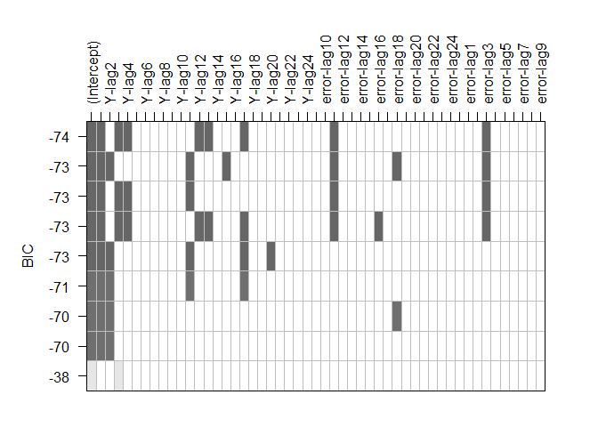
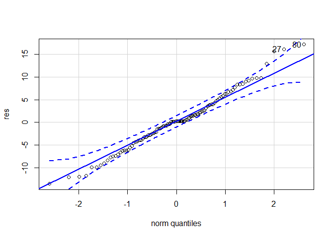

``` python
print('hello')
```

    hello

Introducción a modelos SARIMA
=============================

Existen situaciones en las que es posible enfrentarse a series
temporales que poseen entre sus componentes, un comportamiento
estacional, lo cual hace que tanto la media como otras estadísticas
dadas en un periodo **no sean estacionarias a lo largo del tiempo**. Y a
causa de ello, se tendrá que los métodos de modelación presentados hasta
el momento no resulten ser apropiados para el ajuste del conjunto de
observaciones asociados a la serie de interés.

La **componente estacional** de una serie temporal se ha definido hasta
ahora como **fluctuaciones que se repiten anualmente o en periodos que
poseen duración menor a un año**, las cuales se encuentran relacionadas
con fenómenos económicos, ambientales o sociales, que hacen que el
comportamiento de la serie tome un comportamiento repetitivo a través de
los años.

La periodicidad de la componente estacional es usualmente denotada por
la letra `$s$`, y define la longitud o número de periodos en los cuales
se observa que se repite el comportamiento de la serie. Ahora bien, dado
que la estacionalidad es una señal de que la serie de tiempo no es
estacionaria, **es necesario eliminar dicha componente** con el fin de
poder modelar ésta, de la forma como se ha venido trabajando hasta el
momento.

Ejemplo serie estacional
------------------------

Suponga que la siguiente serie temporal está dada por la producción
mensual de juguetes para niños (en millones), de una empresa ubicada en
el municipio de Itagüi, para el periodo marzo de 1995 hasta febrero de
2004.

<!-- puse en width 100% en 3 partes-->
<button id="Show1" class="btn btn-secondary">
Mostrar código R
</button>
<button id="Hide1" class="btn btn-info">
Ocultar código R
</button>
<main id="botoncito1">
<section class="language-r highlighter-rouge" style="width: 100%;">
<section class="highlight" style="width: 100%;">
<pre class="highlight" style="width: 100%;">
<code><span class="n">library</span><span class="p">(</span><span class="n">plotly</span><span class="p">)</span><span class="w">
</span><span class="n">library</span><span class="p">(</span><span class="n">sarima</span><span class="p">)</span><span class="w">
</span><span class="n">set.seed</span><span class="p">(</span><span class="m">127102</span><span class="p">)</span><span class="w">
</span><span class="n">Serie1</span><span class="w"> </span><span class="o">&lt;-</span><span class="w"> </span><span class="n">sim_sarima</span><span class="p">(</span><span class="n">n</span><span class="w"> </span><span class="o">=</span><span class="w"> </span><span class="m">108</span><span class="p">,</span><span class="w"> </span><span class="n">model</span><span class="w"> </span><span class="o">=</span><span class="w"> </span><span class="nf">list</span><span class="p">(</span><span class="n">ar</span><span class="w"> </span><span class="o">=</span><span class="w"> </span><span class="nf">c</span><span class="p">(</span><span class="m">-0.89</span><span class="p">,</span><span class="w"> </span><span class="m">-0.9</span><span class="p">),</span><span class="w"> </span><span class="n">ma</span><span class="w"> </span><span class="o">=</span><span class="w"> </span><span class="m">0.5</span><span class="p">,</span><span class="w"> </span><span class="n">sar</span><span class="w"> </span><span class="o">=</span><span class="w"> </span><span class="nf">c</span><span class="p">(</span><span class="m">0.2</span><span class="p">,</span><span class="w"> 
    </span><span class="m">0.15</span><span class="p">),</span><span class="w"> </span><span class="n">sma</span><span class="w"> </span><span class="o">=</span><span class="w"> </span><span class="m">0</span><span class="p">,</span><span class="w"> </span><span class="n">sigma2</span><span class="w"> </span><span class="o">=</span><span class="w"> </span><span class="m">50</span><span class="p">,</span><span class="w"> </span><span class="n">nseasons</span><span class="w"> </span><span class="o">=</span><span class="w"> </span><span class="m">12</span><span class="p">,</span><span class="w"> </span><span class="n">iorder</span><span class="w"> </span><span class="o">=</span><span class="w"> </span><span class="m">0</span><span class="p">,</span><span class="w"> </span><span class="n">siorder</span><span class="w"> </span><span class="o">=</span><span class="w"> </span><span class="m">1</span><span class="p">),</span><span class="w"> </span><span class="n">xintercept</span><span class="w"> </span><span class="o">=</span><span class="w"> </span><span class="m">0</span><span class="p">,</span><span class="w"> 
    </span><span class="n">n.start</span><span class="w"> </span><span class="o">=</span><span class="w"> </span><span class="m">1050</span><span class="p">)</span><span class="w"> </span><span class="o">+</span><span class="w"> </span><span class="m">250</span><span class="w">
</span><span class="n">Serie1</span><span class="w"> </span><span class="o">&lt;-</span><span class="w"> </span><span class="n">ts</span><span class="p">(</span><span class="n">Serie1</span><span class="p">,</span><span class="w"> </span><span class="n">start</span><span class="w"> </span><span class="o">=</span><span class="w"> </span><span class="nf">c</span><span class="p">(</span><span class="m">1995</span><span class="p">,</span><span class="w"> </span><span class="m">3</span><span class="p">),</span><span class="w"> </span><span class="n">frequency</span><span class="w"> </span><span class="o">=</span><span class="w"> </span><span class="m">12</span><span class="p">)</span><span class="w">
</span><span class="n">fechas1</span><span class="w"> </span><span class="o">&lt;-</span><span class="w"> </span><span class="n">time</span><span class="p">(</span><span class="n">Serie1</span><span class="p">)</span><span class="w">
</span><span class="c1">## Gráfico Básico</span><span class="w">
</span><span class="n">plot.ts</span><span class="p">(</span><span class="n">Serie1</span><span class="p">,</span><span class="w"> </span><span class="n">main</span><span class="w"> </span><span class="o">=</span><span class="w"> </span><span class="s2">"Producción mensual de juguetes"</span><span class="p">,</span><span class="w"> </span><span class="n">ylab</span><span class="w"> </span><span class="o">=</span><span class="w"> </span><span class="s2">"Producción mensual"</span><span class="p">)</span><span class="w">

</span><span class="c1">## Gráfico Avanzado</span><span class="w">
</span><span class="n">plot_ly</span><span class="p">(</span><span class="n">x</span><span class="w"> </span><span class="o">=</span><span class="w"> </span><span class="o">~</span><span class="n">fechas1</span><span class="p">,</span><span class="w"> </span><span class="n">y</span><span class="w"> </span><span class="o">=</span><span class="w"> </span><span class="o">~</span><span class="n">Serie1</span><span class="p">,</span><span class="w"> </span><span class="n">mode</span><span class="w"> </span><span class="o">=</span><span class="w"> </span><span class="s2">"lines"</span><span class="p">,</span><span class="w"> </span><span class="n">text</span><span class="w"> </span><span class="o">=</span><span class="w"> </span><span class="n">paste</span><span class="p">(</span><span class="s2">"Valor ="</span><span class="p">,</span><span class="w"> </span><span class="nf">round</span><span class="p">(</span><span class="n">Serie1</span><span class="p">,</span><span class="w"> 
    </span><span class="m">3</span><span class="p">)),</span><span class="w"> </span><span class="n">width</span><span class="w"> </span><span class="o">=</span><span class="w"> </span><span class="m">700</span><span class="p">,</span><span class="w"> </span><span class="n">height</span><span class="w"> </span><span class="o">=</span><span class="w"> </span><span class="m">400</span><span class="p">,</span><span class="w"> </span><span class="n">type</span><span class="w"> </span><span class="o">=</span><span class="w"> </span><span class="s2">"scatter"</span><span class="p">)</span><span class="w"> </span><span class="o">%&gt;%</span><span class="w"> </span><span class="n">layout</span><span class="p">(</span><span class="n">title</span><span class="w"> </span><span class="o">=</span><span class="w"> </span><span class="s2">"Producción mensual de juguetes"</span><span class="p">,</span><span class="w"> 
    </span><span class="n">xaxis</span><span class="w"> </span><span class="o">=</span><span class="w"> </span><span class="nf">list</span><span class="p">(</span><span class="n">title</span><span class="w"> </span><span class="o">=</span><span class="w"> </span><span class="s2">"Mes"</span><span class="p">),</span><span class="w"> </span><span class="n">yaxis</span><span class="w"> </span><span class="o">=</span><span class="w"> </span><span class="nf">list</span><span class="p">(</span><span class="n">title</span><span class="w"> </span><span class="o">=</span><span class="w"> </span><span class="s2">"Producción mensual"</span><span class="p">))</span><span class="w"> </span><span class="o">%&gt;%</span><span class="w"> 
    </span><span class="n">layout</span><span class="p">(</span><span class="n">margin</span><span class="w"> </span><span class="o">=</span><span class="w"> </span><span class="nf">list</span><span class="p">(</span><span class="n">l</span><span class="w"> </span><span class="o">=</span><span class="w"> </span><span class="m">60</span><span class="p">,</span><span class="w"> </span><span class="n">r</span><span class="w"> </span><span class="o">=</span><span class="w"> </span><span class="m">30</span><span class="p">,</span><span class="w"> </span><span class="n">b</span><span class="w"> </span><span class="o">=</span><span class="w"> </span><span class="m">60</span><span class="p">,</span><span class="w"> </span><span class="n">t</span><span class="w"> </span><span class="o">=</span><span class="w"> </span><span class="m">60</span><span class="p">,</span><span class="w"> </span><span class="n">pad</span><span class="w"> </span><span class="o">=</span><span class="w"> </span><span class="m">4</span><span class="p">))</span><span class="w">
</span></code></pre>
</section>
</section>
</main>
<pre class="plotlyCuadrito">
<!--html_preserve--><div id="htmlwidget-a938c9c38effb73ca5f4" style="width:100%;height:400px;" class="plotly html-widget"></div>
<script type="application/json" data-for="htmlwidget-a938c9c38effb73ca5f4">{"x":{"visdat":{"2e0c42326771":["function () ","plotlyVisDat"]},"cur_data":"2e0c42326771","attrs":{"2e0c42326771":{"x":{},"y":{},"mode":"lines","text":["Valor = 253.477","Valor = 291.809","Valor = 164.777","Valor = 279.011","Valor = 210.281","Valor = 282.061","Valor = 193.247","Valor = 270.13","Valor = 349.643","Valor = 132.087","Valor = 291.386","Valor = 147.349","Valor = 226.15","Valor = 287.616","Valor = 191.134","Valor = 245.721","Valor = 211.708","Valor = 308.645","Valor = 167.851","Valor = 258.602","Valor = 392.12","Valor = 115.274","Valor = 256.906","Valor = 192.478","Valor = 221.575","Valor = 262.92","Valor = 232.955","Valor = 228.383","Valor = 186.023","Valor = 338.877","Valor = 172.387","Valor = 240.761","Valor = 414.617","Valor = 114.821","Valor = 241.301","Valor = 214.026","Valor = 213.25","Valor = 256.563","Valor = 260.072","Valor = 208.641","Valor = 176.638","Valor = 348.6","Valor = 161.823","Valor = 241.72","Valor = 422.642","Valor = 122.406","Valor = 229.023","Valor = 212.221","Valor = 232.056","Valor = 254.399","Valor = 254.194","Valor = 210.006","Valor = 176.095","Valor = 342.28","Valor = 168.716","Valor = 252.269","Valor = 404.224","Valor = 124.225","Valor = 245.886","Valor = 202.299","Valor = 228.763","Valor = 272.481","Valor = 251.392","Valor = 202.996","Valor = 187.834","Valor = 336.512","Valor = 169.791","Valor = 256.136","Valor = 391.922","Valor = 130.832","Valor = 249.59","Valor = 196.731","Valor = 225.885","Valor = 273.367","Valor = 254.64","Valor = 195.566","Valor = 199.317","Valor = 343.974","Valor = 153.858","Valor = 277.992","Valor = 378.62","Valor = 122.47","Valor = 277.934","Valor = 187.048","Valor = 200.169","Valor = 287.349","Valor = 265.807","Valor = 171.541","Valor = 207.703","Valor = 360.768","Valor = 129.335","Valor = 289.984","Valor = 383.852","Valor = 115.756","Valor = 282.694","Valor = 191.193","Valor = 191.164","Valor = 277.076","Valor = 282.612","Valor = 168.858","Valor = 182.296","Valor = 386.933","Valor = 138.009","Valor = 264.521","Valor = 392.497","Valor = 130.158","Valor = 264.724","Valor = 197.036"],"alpha_stroke":1,"sizes":[10,100],"spans":[1,20],"type":"scatter"}},"layout":{"margin":{"b":60,"l":60,"t":60,"r":30,"pad":4},"title":"Producción mensual de juguetes","xaxis":{"domain":[0,1],"automargin":true,"title":"Mes"},"yaxis":{"domain":[0,1],"automargin":true,"title":"Producción mensual"},"hovermode":"closest","showlegend":false},"source":"A","config":{"showSendToCloud":false},"data":[{"x":[1995.16666666667,1995.25,1995.33333333333,1995.41666666667,1995.5,1995.58333333333,1995.66666666667,1995.75,1995.83333333333,1995.91666666667,1996,1996.08333333333,1996.16666666667,1996.25,1996.33333333333,1996.41666666667,1996.5,1996.58333333333,1996.66666666667,1996.75,1996.83333333333,1996.91666666667,1997,1997.08333333333,1997.16666666667,1997.25,1997.33333333333,1997.41666666667,1997.5,1997.58333333333,1997.66666666667,1997.75,1997.83333333333,1997.91666666667,1998,1998.08333333333,1998.16666666667,1998.25,1998.33333333333,1998.41666666667,1998.5,1998.58333333333,1998.66666666667,1998.75,1998.83333333333,1998.91666666667,1999,1999.08333333333,1999.16666666667,1999.25,1999.33333333333,1999.41666666667,1999.5,1999.58333333333,1999.66666666667,1999.75,1999.83333333333,1999.91666666667,2000,2000.08333333333,2000.16666666667,2000.25,2000.33333333333,2000.41666666667,2000.5,2000.58333333333,2000.66666666667,2000.75,2000.83333333333,2000.91666666667,2001,2001.08333333333,2001.16666666667,2001.25,2001.33333333333,2001.41666666667,2001.5,2001.58333333333,2001.66666666667,2001.75,2001.83333333333,2001.91666666667,2002,2002.08333333333,2002.16666666667,2002.25,2002.33333333333,2002.41666666667,2002.5,2002.58333333333,2002.66666666667,2002.75,2002.83333333333,2002.91666666667,2003,2003.08333333333,2003.16666666667,2003.25,2003.33333333333,2003.41666666667,2003.5,2003.58333333333,2003.66666666667,2003.75,2003.83333333333,2003.91666666667,2004,2004.08333333333],"y":[253.477339242828,291.809259108726,164.776593383598,279.010611935139,210.281380953738,282.061381031179,193.246747722955,270.129766962356,349.642908788173,132.086685792731,291.385764624485,147.348991287353,226.150399619542,287.616397338344,191.13395880042,245.721311897458,211.708076520212,308.645174675193,167.851469709603,258.602490924956,392.120113518458,115.274118599036,256.90579220955,192.477712769748,221.574913184629,262.919738519741,232.95493343764,228.383045299448,186.023261434849,338.876624076704,172.387475224356,240.7613310814,414.617165735804,114.820772488217,241.301383657727,214.026167911043,213.249928273472,256.563194173471,260.071534185275,208.640737274444,176.637722495907,348.599779538119,161.823350085821,241.720134209285,422.641720673937,122.406080952034,229.023287591264,212.220849501337,232.056115085612,254.398884222829,254.194318969041,210.005711204777,176.095320409429,342.280213466407,168.715594745664,252.26866084002,404.224143659453,124.224551354719,245.886499206086,202.298930977421,228.763459030793,272.481259915145,251.39224124407,202.995772379489,187.834253418055,336.512002006535,169.790835938566,256.135593472825,391.92232078658,130.831693285699,249.590252510011,196.730840433775,225.8850862976,273.366768979545,254.639758114653,195.566453273845,199.316845130533,343.973562725132,153.858205153695,277.992407086224,378.619824813862,122.470385149579,277.934480234416,187.047866490989,200.16912071246,287.34882867368,265.807000971609,171.540858309223,207.703475181546,360.767815486959,129.335244598538,289.983923256633,383.851729032249,115.75632775035,282.694298797557,191.193204004437,191.164213788521,277.075940927894,282.61151467201,168.857880427154,182.29562299898,386.933387747873,138.008818885291,264.521077609411,392.496520232101,130.158100176252,264.723627036796,197.036014390935],"mode":"lines","text":["Valor = 253.477","Valor = 291.809","Valor = 164.777","Valor = 279.011","Valor = 210.281","Valor = 282.061","Valor = 193.247","Valor = 270.13","Valor = 349.643","Valor = 132.087","Valor = 291.386","Valor = 147.349","Valor = 226.15","Valor = 287.616","Valor = 191.134","Valor = 245.721","Valor = 211.708","Valor = 308.645","Valor = 167.851","Valor = 258.602","Valor = 392.12","Valor = 115.274","Valor = 256.906","Valor = 192.478","Valor = 221.575","Valor = 262.92","Valor = 232.955","Valor = 228.383","Valor = 186.023","Valor = 338.877","Valor = 172.387","Valor = 240.761","Valor = 414.617","Valor = 114.821","Valor = 241.301","Valor = 214.026","Valor = 213.25","Valor = 256.563","Valor = 260.072","Valor = 208.641","Valor = 176.638","Valor = 348.6","Valor = 161.823","Valor = 241.72","Valor = 422.642","Valor = 122.406","Valor = 229.023","Valor = 212.221","Valor = 232.056","Valor = 254.399","Valor = 254.194","Valor = 210.006","Valor = 176.095","Valor = 342.28","Valor = 168.716","Valor = 252.269","Valor = 404.224","Valor = 124.225","Valor = 245.886","Valor = 202.299","Valor = 228.763","Valor = 272.481","Valor = 251.392","Valor = 202.996","Valor = 187.834","Valor = 336.512","Valor = 169.791","Valor = 256.136","Valor = 391.922","Valor = 130.832","Valor = 249.59","Valor = 196.731","Valor = 225.885","Valor = 273.367","Valor = 254.64","Valor = 195.566","Valor = 199.317","Valor = 343.974","Valor = 153.858","Valor = 277.992","Valor = 378.62","Valor = 122.47","Valor = 277.934","Valor = 187.048","Valor = 200.169","Valor = 287.349","Valor = 265.807","Valor = 171.541","Valor = 207.703","Valor = 360.768","Valor = 129.335","Valor = 289.984","Valor = 383.852","Valor = 115.756","Valor = 282.694","Valor = 191.193","Valor = 191.164","Valor = 277.076","Valor = 282.612","Valor = 168.858","Valor = 182.296","Valor = 386.933","Valor = 138.009","Valor = 264.521","Valor = 392.497","Valor = 130.158","Valor = 264.724","Valor = 197.036"],"type":"scatter","marker":{"color":"rgba(31,119,180,1)","line":{"color":"rgba(31,119,180,1)"}},"error_y":{"color":"rgba(31,119,180,1)"},"error_x":{"color":"rgba(31,119,180,1)"},"line":{"color":"rgba(31,119,180,1)"},"xaxis":"x","yaxis":"y","frame":null}],"highlight":{"on":"plotly_click","persistent":false,"dynamic":false,"selectize":false,"opacityDim":0.2,"selected":{"opacity":1},"debounce":0},"shinyEvents":["plotly_hover","plotly_click","plotly_selected","plotly_relayout","plotly_brushed","plotly_brushing","plotly_clickannotation","plotly_doubleclick","plotly_deselect","plotly_afterplot"],"base_url":"https://plot.ly"},"evals":[],"jsHooks":[]}</script><!--/html_preserve-->
</pre>

Operador de diferencia estacional
=================================

Con tal propósito en mente, suponga una serie `$Y_t$` la cual **posee
una componente estacional** con periodicidad `$s$`, entonces con el fin
de eliminar dicha componente de la serie temporal, será necesaria
**diferenciar la serie temporal con respecto a la serie rezagada `$s$`
periodos en el tiempo**. Éste procedimiento es conocido como
**diferencia estacional** y se define como
`\begin{align*} \Delta_s Y_t = Y_t - Y_{t-s} \end{align*}`

siendo `$\Delta_s = (1-L^s)$`. **Note que `$\Delta_s \neq \Delta^s$`,
pues `$\Delta^s = (1-L)^s$` representa el operador de diferencias
presentado en la** [Clase
11](https://jouninlrmd.github.io/MuestreoySeriesdeTiempo/MySTClase_11.html){:target="\_blank"}.
En general, el operador de diferencias estacionales de periodo `$s$` se
define como `\begin{align*} \Delta_s^D = (1-L^s)^D \end{align*}`

Siendo `$D$` el parámetro que indica el número de diferencias
estacionales.

Modelos autorregresivos integrados de media móvil estacionales (SARIMA)
=======================================================================

Se dice que una serie de tiempo `$Y_t$` posee una estructura
`$SARIMA(p,d,q)(P,D,Q)[S]$` si se cumple que
`\begin{align*} \Phi_{P} (L^s) \; \Phi_p (L)\; \Delta^D_s \; \Delta^d \; Y_t = \Theta_{Q} (L^s)\; \Theta_q (L) \;\varepsilon_t \end{align*}`

con `$\varepsilon_t \sim RB(0, \sigma_{\varepsilon}^2)$`, donde
`\begin{align*} \Phi_p(z) = 1 - \sum_{j=1}^p\phi_j z^j \\ \Theta_q(z) = 1 + \sum_{j=1}^q\theta_j z^j \end{align*}`

son los polinomios de rezagos autorregresivos y de medias móviles,
regulares, respectivamente, cada una **sin raíces unitarias y con módulo
mayor a 1**, y  
`\begin{align*} \Phi_{P}(z^s) = 1 - \sum_{j=1}^{P}\phi_{s,j} z^{js} \\ \Theta_{Q}(z^s) = 1 + \sum_{j=1}^{Q}\theta_{s,j} z^{js} \end{align*}`

son los polinomios de rezagos autorregresivos y de medias móviles,
estacionales, respectivamente, **sin raíces unitarias y con módulo mayor
a 1**. Además, `$L$` el operador de rezagos,
`\begin{align*} \Delta^d=(1-L)^d \end{align*}` es el operador de
diferencias regulares y
`\begin{align*} \Delta^D_s=(1-L^s)^D \end{align*}`

es el operador de diferencias estacionales.

Identificación de un modelo SARIMA(p,d,q)(P,D,Q)\[S\]
=====================================================

Ahora bien, con el fin de identificar los órdenes regulares `$p$`,
`$d$`, `$q$`, y estacionales `$P$`, `$D$` y `$Q$` asociados a un modelo
`$SARIMA(p,d,q)(P,D,Q)[S]$`, es necesario realiza los siguientes
procedimientos

1.  Identificar el órden de integración regular `$d$` y estacional `$D$`
    que posee la serie temporal, mediante el análisis de raíces
    unitaria, con el fin de obtener una serie estacionaria en
    covarianza.
2.  Identificar el órden autorregresivo regular `$p$` y estacional
    `$P$`, al igual que el órden de media móvil regular `$q$` y
    estacional `$Q$` que posee la serie temporal, mediante análisis
    gráficos y estadístico de la serie, o serie diferenciada dependiendo
    de los hallazgos del punto anterior.

Análisis de raices unitarias
----------------------------

Con el fin de observar si la serie temporal posee o no raíces unitarias
regulares o estacionales, se recomienda inicialmente la aplicación de
pruebas para raíces unitarias estacionales, esto debido a que hay
situaciones en las cuales, puede ocurrir que una serie temporal presente
que tiene ambos tipos de raíces, pero que, al eliminar aquellas raíces
unitarias estacionales mediante diferenciación estacional, se obtiene a
su vez la eliminación de las raíces unitarias.

Por ello, se inicia con la aplicación de la prueba para raíces unitarias
estacionales Osborn, Chui, Smith, and Birchenhall (OCSB), la cual puede
realizarse en <tt>R</tt>, mediante la función `ocsb.test()` de la
librería `forecast`.

Dicha prueba busca probar la hipótesis

`\begin{align*} H_0: Y_t \text{ posee raíces unitarias estacionales} \\H_1: Y_t \text{ no posee raíces unitarias estacionales} \end{align*}`

En donde, **para rechazar** la hipótesis nula, se tendrá que el
estadístico de prueba deberá ser menor al valór de la región crítica
calculado a un `$5\%$` de significancia.

<button id="Show2" class="btn btn-secondary">
Mostrar código R
</button>
<button id="Hide2" class="btn btn-info">
Ocultar código R
</button>
<main id="botoncito2">
<section class="language-r highlighter-rouge" style="width: 100%;">
<section class="highlight" style="width: 100%;">
<pre class="highlight" style="width: 100%;">
<code><span class="n">library</span><span class="p">(</span><span class="n">forecast</span><span class="p">)</span><span class="w">
</span><span class="n">ocsb.test</span><span class="p">(</span><span class="n">Serie1</span><span class="p">)</span><span class="w"></span></code>
</pre>
</section>
</section>
</main>


        OCSB test

    data:  Serie1

    Test statistic: -0.9148, 5% critical value: -1.803
    alternative hypothesis: stationary

    Lag order 0 was selected using fixed

De la prueba anterior, se encuentra que el estadístico de prueba posee
un valor de `$-0.9148$`, mientras que el valor crítico de la región
crítica calculado a un nivel de significancia del `$5\%$` es de
`$-1.803$`.

Por tanto, se concluye que la serie temporal posee una raíz unitaria
estacional, esto es, `$D=1$`. Con el fin de observar si es necesario
realizar otra diferenciación estacional y o diferenciaciones regulares,
será necesario aplicar una diferenciación estacional de orden `$s=12$`
(serie mensual), para así poder eliminar la raíz unitaria estacionaria
encontrada y poder realizar nuevamente la prueba OCSB en el caso de
raíces unitarias estacionales o la prueba Dickey-Fuller Aumentada (ADF)
en el caso de raíces unitarias regulares.

Para realizar la eliminación de la raíz unitaria estacional encontrada
anteriormente, se emplea la función `diff()` con argumento `lag = 12`,
seguido de la aplicación de la prueba OCSB, para observar si existen
todavía raíces unitarias estacionales.

<button id="Show3" class="btn btn-secondary">
Mostrar código R
</button>
<button id="Hide3" class="btn btn-info">
Ocultar código R
</button>
<main id="botoncito3">
<section class="language-r highlighter-rouge" style="width: 100%;">
<section class="highlight" style="width: 100%;">
<pre class="highlight" style="width: 100%;">
<code><span class="n">dSerie1</span><span class="w"> </span><span class="o">&lt;-</span><span class="w"> </span><span class="n">diff</span><span class="p">(</span><span class="n">Serie1</span><span class="p">,</span><span class="w"> </span><span class="n">lag</span><span class="w"> </span><span class="o">=</span><span class="w"> </span><span class="m">12</span><span class="p">)</span><span class="w">
</span><span class="n">ocsb.test</span><span class="p">(</span><span class="n">dSerie1</span><span class="p">)</span><span class="w"></span></code>
</pre>
</section>
</section>
</main>


        OCSB test

    data:  dSerie1

    Test statistic: -7.1908, 5% critical value: -1.803
    alternative hypothesis: stationary

    Lag order 0 was selected using fixed

Al realizar nuevamente la prueba se encuentra que el valor del
estadístico de prueba `$-7.1908$` se encuentra por debajo del valor
crítico `$-1.803$`, y por tanto se concluye a un nivel de significancia
del `$5\%$` que se rechaza la hipótesis nula, a favor de la alternativa,
es decir, se rechaza la existencia de más raíces unitarias estacionales.

Dado que no se encontraron raíces unitarias estacionales, se procede a
realizar la prueba ADF, mediante la función `adf.test()` de la librería
`tseries`.

Dicha prueba busca probar la hipótesis

`\begin{align*} H_0: Y_t \text{ posee raíces unitarias regulares} \\H_1: Y_t \text{ no posee raíces unitarias regulares} \end{align*}`

En donde, **para rechazar** la hipótesis nula, será necesario que el
P-valor obtenido por la prueba sea menor al `$5\%$`, el cual es el nivel
de significancia que estamos empleando para las pruebas.

<button id="Show4" class="btn btn-secondary">
Mostrar código R
</button>
<button id="Hide4" class="btn btn-info">
Ocultar código R
</button>
<main id="botoncito4">
<section class="language-r highlighter-rouge" style="width: 100%;">
<section class="highlight" style="width: 100%;">
<pre class="highlight" style="width: 100%;">
<code><span class="n">library</span><span class="p">(</span><span class="n">tseries</span><span class="p">)</span><span class="w">
</span><span class="n">adf.test</span><span class="p">(</span><span class="n">dSerie1</span><span class="p">)</span><span class="w"></span></code>
</pre>
</section>
</section>
</main>


        Augmented Dickey-Fuller Test

    data:  dSerie1
    Dickey-Fuller = -5.9194, Lag order = 4, p-value = 0.01
    alternative hypothesis: stationary

De la prueba Dickey-Fuller Aumentada, se aprecia que el P-valor es igual
a `$0.01$` o menor (debido a la advertencia que obtenida al aplicar la
prueba), lo cual indica que hay evidencia suficiente para rechazar
`$H_0$` a favor de la alternativa, esto es, concluir que no la serie
diferenciada no posee raíces regulares.

En conclusión a lo obtenido en esa sección, se tendrá que la serie
empleada, posee un orden de diferenciación regular `$d=0$` y un órden de
diferenciación estacional `$D=1$`

Identificación de órdenes p, q, P y Q
-------------------------------------

Para facilitar la identificación de los órdenes regulares y estacionales
`$(p, q)$` y `$(P, Q)$`, respectivamente, se aconseja el empleo de la
serie obtenida de diferencias obtenida en la sección anterior, ésto
debido a que, al eliminar las raíces unitarias que posee la serie
temporal, se obtiene una serie estacionaria en covarianza, lo cual
permite que puedan emplearse los mismos procedimientos explicados en
modelos ARMA, para identificar los órdenes `$p$` y `$q$`, solo en en
esta situación, será necesario observar si existen o no rezagos
estacionales significativos.

### ACF y PACF para la identificación de los órdenes p, q, P y Q

Un método clásico para la identificación es el de realizar los gráficos
de la ACF y PACF de la serie (o serie diferenciada si fue necesario
realizar este procedimiento), para tratar de identificar los órdenes
regulares y estacionales que posee la serie temporal.

Para ello se emplea las funciones `acf()` y `pacf()`, con el argumento
`lag.max = 30`, ésto con el objetivo de poder visualizar al menos dos
periodos estacionales, ya que tenemos que la periodicidad de la serie
`$s=12$`.

<button id="Show5" class="btn btn-secondary">
Mostrar código R
</button>
<button id="Hide5" class="btn btn-info">
Ocultar código R
</button>
<main id="botoncito5">
<section class="language-r highlighter-rouge" style="width: 100%;">
<section class="highlight" style="width: 100%;">
<pre class="highlight" style="width: 100%;">
<code><span class="c1"># Gráfico básico</span><span class="w">
</span><span class="n">par</span><span class="p">(</span><span class="n">mfrow</span><span class="w"> </span><span class="o">=</span><span class="w"> </span><span class="nf">c</span><span class="p">(</span><span class="m">1</span><span class="p">,</span><span class="w"> </span><span class="m">2</span><span class="p">))</span><span class="w">
</span><span class="n">acf</span><span class="p">(</span><span class="n">dSerie1</span><span class="p">,</span><span class="w"> </span><span class="n">main</span><span class="w"> </span><span class="o">=</span><span class="w"> </span><span class="s2">"ACF Producción de juguetes"</span><span class="p">,</span><span class="w"> </span><span class="n">lag.max</span><span class="w"> </span><span class="o">=</span><span class="w"> </span><span class="m">30</span><span class="p">)</span><span class="w">
</span><span class="n">pacf</span><span class="p">(</span><span class="n">dSerie1</span><span class="p">,</span><span class="w"> </span><span class="n">main</span><span class="w"> </span><span class="o">=</span><span class="w"> </span><span class="s2">"PACF Producción de juguetes"</span><span class="p">,</span><span class="w"> </span><span class="n">lag.max</span><span class="w"> </span><span class="o">=</span><span class="w"> </span><span class="m">30</span><span class="p">)</span><span class="w">

</span><span class="c1"># Gráfico avanzado</span><span class="w">
</span><span class="n">library</span><span class="p">(</span><span class="n">feasts</span><span class="p">)</span><span class="w">
</span><span class="n">library</span><span class="p">(</span><span class="n">tsibble</span><span class="p">)</span><span class="w">
</span><span class="n">dSerie1ts</span><span class="w"> </span><span class="o">&lt;-</span><span class="w"> </span><span class="n">as_tsibble</span><span class="p">(</span><span class="n">dSerie1</span><span class="p">)</span><span class="w">
</span><span class="n">acfSerie1</span><span class="w"> </span><span class="o">&lt;-</span><span class="w"> </span><span class="n">dSerie1ts</span><span class="w"> </span><span class="o">%&gt;%</span><span class="w"> </span><span class="n">ACF</span><span class="p">(</span><span class="n">value</span><span class="p">,</span><span class="w"> </span><span class="n">lag_max</span><span class="w"> </span><span class="o">=</span><span class="w"> </span><span class="m">30</span><span class="p">)</span><span class="w">  </span><span class="c1"># Calcula valores de ACF</span><span class="w">
</span><span class="n">pacfSerie1</span><span class="w"> </span><span class="o">&lt;-</span><span class="w"> </span><span class="n">dSerie1ts</span><span class="w"> </span><span class="o">%&gt;%</span><span class="w"> </span><span class="n">PACF</span><span class="p">(</span><span class="n">value</span><span class="p">,</span><span class="w"> </span><span class="n">lag_max</span><span class="w"> </span><span class="o">=</span><span class="w"> </span><span class="m">30</span><span class="p">)</span><span class="w">  </span><span class="c1"># Calcula valores de PACF</span><span class="w">
</span><span class="n">CI</span><span class="w"> </span><span class="o">&lt;-</span><span class="w"> </span><span class="k">function</span><span class="p">(</span><span class="n">x</span><span class="p">)</span><span class="w"> </span><span class="n">qnorm</span><span class="p">((</span><span class="m">1</span><span class="w"> </span><span class="o">+</span><span class="w"> </span><span class="m">0.95</span><span class="p">)</span><span class="o">/</span><span class="m">2</span><span class="p">)</span><span class="o">/</span><span class="nf">sqrt</span><span class="p">(</span><span class="nf">sum</span><span class="p">(</span><span class="o">!</span><span class="nf">is.na</span><span class="p">(</span><span class="n">x</span><span class="p">)))</span><span class="w">  </span><span class="c1"># Crea función para</span><span class="w">

</span><span class="n">plotacf</span><span class="w"> </span><span class="o">&lt;-</span><span class="w"> </span><span class="n">plot_ly</span><span class="p">(</span><span class="n">acfSerie1</span><span class="p">,</span><span class="w"> </span><span class="n">width</span><span class="w"> </span><span class="o">=</span><span class="w"> </span><span class="m">700</span><span class="p">,</span><span class="w"> </span><span class="n">height</span><span class="w"> </span><span class="o">=</span><span class="w"> </span><span class="m">400</span><span class="p">)</span><span class="w"> </span><span class="o">%&gt;%</span><span class="w"> </span><span class="n">layout</span><span class="p">(</span><span class="n">title</span><span class="w"> </span><span class="o">=</span><span class="w"> </span><span class="s2">"ACF"</span><span class="p">,</span><span class="w"> 
    </span><span class="n">xaxis</span><span class="w"> </span><span class="o">=</span><span class="w"> </span><span class="nf">list</span><span class="p">(</span><span class="n">title</span><span class="w"> </span><span class="o">=</span><span class="w"> </span><span class="s2">"Lags"</span><span class="p">),</span><span class="w"> </span><span class="n">yaxis</span><span class="w"> </span><span class="o">=</span><span class="w"> </span><span class="nf">list</span><span class="p">(</span><span class="n">title</span><span class="w"> </span><span class="o">=</span><span class="w"> </span><span class="s2">"ACF"</span><span class="p">))</span><span class="w"> </span><span class="o">%&gt;%</span><span class="w"> </span><span class="n">add_bars</span><span class="p">(</span><span class="n">x</span><span class="w"> </span><span class="o">=</span><span class="w"> </span><span class="o">~</span><span class="m">1</span><span class="o">:</span><span class="n">nrow</span><span class="p">(</span><span class="n">acfSerie1</span><span class="p">),</span><span class="w"> 
    </span><span class="n">y</span><span class="w"> </span><span class="o">=</span><span class="w"> </span><span class="o">~</span><span class="n">acfSerie1</span><span class="o">$</span><span class="n">acf</span><span class="p">,</span><span class="w"> </span><span class="n">width</span><span class="w"> </span><span class="o">=</span><span class="w"> </span><span class="m">0.2</span><span class="p">,</span><span class="w"> </span><span class="n">text</span><span class="w"> </span><span class="o">=</span><span class="w"> </span><span class="n">paste</span><span class="p">(</span><span class="s2">"ACF ="</span><span class="p">,</span><span class="w"> </span><span class="n">acfSerie1</span><span class="o">$</span><span class="n">acf</span><span class="p">))</span><span class="w"> </span><span class="o">%&gt;%</span><span class="w"> 
    </span><span class="n">layout</span><span class="p">(</span><span class="n">shapes</span><span class="w"> </span><span class="o">=</span><span class="w"> </span><span class="nf">list</span><span class="p">(</span><span class="nf">list</span><span class="p">(</span><span class="n">type</span><span class="w"> </span><span class="o">=</span><span class="w"> </span><span class="s2">"line"</span><span class="p">,</span><span class="w"> </span><span class="n">x</span><span class="m">0</span><span class="w"> </span><span class="o">=</span><span class="w"> </span><span class="m">0</span><span class="p">,</span><span class="w"> </span><span class="n">x</span><span class="m">1</span><span class="w"> </span><span class="o">=</span><span class="w"> </span><span class="n">nrow</span><span class="p">(</span><span class="n">acfSerie1</span><span class="p">),</span><span class="w"> </span><span class="n">y</span><span class="m">0</span><span class="w"> </span><span class="o">=</span><span class="w"> </span><span class="n">CI</span><span class="p">(</span><span class="n">dSerie1ts</span><span class="o">$</span><span class="n">value</span><span class="p">),</span><span class="w"> 
        </span><span class="n">y</span><span class="m">1</span><span class="w"> </span><span class="o">=</span><span class="w"> </span><span class="n">CI</span><span class="p">(</span><span class="n">dSerie1ts</span><span class="o">$</span><span class="n">value</span><span class="p">),</span><span class="w"> </span><span class="n">line</span><span class="w"> </span><span class="o">=</span><span class="w"> </span><span class="nf">list</span><span class="p">(</span><span class="n">dash</span><span class="w"> </span><span class="o">=</span><span class="w"> </span><span class="s2">"dot"</span><span class="p">)),</span><span class="w"> </span><span class="nf">list</span><span class="p">(</span><span class="n">type</span><span class="w"> </span><span class="o">=</span><span class="w"> </span><span class="s2">"line"</span><span class="p">,</span><span class="w"> 
        </span><span class="n">x</span><span class="m">0</span><span class="w"> </span><span class="o">=</span><span class="w"> </span><span class="m">0</span><span class="p">,</span><span class="w"> </span><span class="n">x</span><span class="m">1</span><span class="w"> </span><span class="o">=</span><span class="w"> </span><span class="n">nrow</span><span class="p">(</span><span class="n">acfSerie1</span><span class="p">),</span><span class="w"> </span><span class="n">y</span><span class="m">0</span><span class="w"> </span><span class="o">=</span><span class="w"> </span><span class="o">-</span><span class="n">CI</span><span class="p">(</span><span class="n">dSerie1ts</span><span class="o">$</span><span class="n">value</span><span class="p">),</span><span class="w"> </span><span class="n">y</span><span class="m">1</span><span class="w"> </span><span class="o">=</span><span class="w"> </span><span class="o">-</span><span class="n">CI</span><span class="p">(</span><span class="n">dSerie1ts</span><span class="o">$</span><span class="n">value</span><span class="p">),</span><span class="w"> 
        </span><span class="n">line</span><span class="w"> </span><span class="o">=</span><span class="w"> </span><span class="nf">list</span><span class="p">(</span><span class="n">dash</span><span class="w"> </span><span class="o">=</span><span class="w"> </span><span class="s2">"dot"</span><span class="p">))))</span><span class="w"> </span><span class="o">%&gt;%</span><span class="w"> </span><span class="n">layout</span><span class="p">(</span><span class="n">margin</span><span class="w"> </span><span class="o">=</span><span class="w"> </span><span class="nf">list</span><span class="p">(</span><span class="n">l</span><span class="w"> </span><span class="o">=</span><span class="w"> </span><span class="m">60</span><span class="p">,</span><span class="w"> </span><span class="n">r</span><span class="w"> </span><span class="o">=</span><span class="w"> </span><span class="m">30</span><span class="p">,</span><span class="w"> 
    </span><span class="n">b</span><span class="w"> </span><span class="o">=</span><span class="w"> </span><span class="m">60</span><span class="p">,</span><span class="w"> </span><span class="n">t</span><span class="w"> </span><span class="o">=</span><span class="w"> </span><span class="m">60</span><span class="p">,</span><span class="w"> </span><span class="n">pad</span><span class="w"> </span><span class="o">=</span><span class="w"> </span><span class="m">4</span><span class="p">))</span><span class="w">

</span><span class="n">plotpacf</span><span class="w"> </span><span class="o">&lt;-</span><span class="w"> </span><span class="n">plot_ly</span><span class="p">(</span><span class="n">pacfSerie1</span><span class="p">,</span><span class="w"> </span><span class="n">width</span><span class="w"> </span><span class="o">=</span><span class="w"> </span><span class="m">700</span><span class="p">,</span><span class="w"> </span><span class="n">height</span><span class="w"> </span><span class="o">=</span><span class="w"> </span><span class="m">400</span><span class="p">)</span><span class="w"> </span><span class="o">%&gt;%</span><span class="w"> </span><span class="n">layout</span><span class="p">(</span><span class="n">title</span><span class="w"> </span><span class="o">=</span><span class="w"> </span><span class="s2">"PACF"</span><span class="p">,</span><span class="w"> 
    </span><span class="n">xaxis</span><span class="w"> </span><span class="o">=</span><span class="w"> </span><span class="nf">list</span><span class="p">(</span><span class="n">title</span><span class="w"> </span><span class="o">=</span><span class="w"> </span><span class="s2">"Lags"</span><span class="p">),</span><span class="w"> </span><span class="n">yaxis</span><span class="w"> </span><span class="o">=</span><span class="w"> </span><span class="nf">list</span><span class="p">(</span><span class="n">title</span><span class="w"> </span><span class="o">=</span><span class="w"> </span><span class="s2">"PACF"</span><span class="p">))</span><span class="w"> </span><span class="o">%&gt;%</span><span class="w"> </span><span class="n">add_bars</span><span class="p">(</span><span class="n">x</span><span class="w"> </span><span class="o">=</span><span class="w"> </span><span class="o">~</span><span class="m">1</span><span class="o">:</span><span class="n">nrow</span><span class="p">(</span><span class="n">pacfSerie1</span><span class="p">),</span><span class="w"> 
    </span><span class="n">y</span><span class="w"> </span><span class="o">=</span><span class="w"> </span><span class="o">~</span><span class="n">pacfSerie1</span><span class="o">$</span><span class="n">pacf</span><span class="p">,</span><span class="w"> </span><span class="n">width</span><span class="w"> </span><span class="o">=</span><span class="w"> </span><span class="m">0.2</span><span class="p">,</span><span class="w"> </span><span class="n">text</span><span class="w"> </span><span class="o">=</span><span class="w"> </span><span class="n">paste</span><span class="p">(</span><span class="s2">"PACF ="</span><span class="p">,</span><span class="w"> </span><span class="n">pacfSerie1</span><span class="o">$</span><span class="n">pacf</span><span class="p">))</span><span class="w"> </span><span class="o">%&gt;%</span><span class="w"> 
    </span><span class="n">layout</span><span class="p">(</span><span class="n">shapes</span><span class="w"> </span><span class="o">=</span><span class="w"> </span><span class="nf">list</span><span class="p">(</span><span class="nf">list</span><span class="p">(</span><span class="n">type</span><span class="w"> </span><span class="o">=</span><span class="w"> </span><span class="s2">"line"</span><span class="p">,</span><span class="w"> </span><span class="n">x</span><span class="m">0</span><span class="w"> </span><span class="o">=</span><span class="w"> </span><span class="m">0</span><span class="p">,</span><span class="w"> </span><span class="n">x</span><span class="m">1</span><span class="w"> </span><span class="o">=</span><span class="w"> </span><span class="n">nrow</span><span class="p">(</span><span class="n">pacfSerie1</span><span class="p">),</span><span class="w"> 
        </span><span class="n">y</span><span class="m">0</span><span class="w"> </span><span class="o">=</span><span class="w"> </span><span class="n">CI</span><span class="p">(</span><span class="n">dSerie1ts</span><span class="o">$</span><span class="n">value</span><span class="p">),</span><span class="w"> </span><span class="n">y</span><span class="m">1</span><span class="w"> </span><span class="o">=</span><span class="w"> </span><span class="n">CI</span><span class="p">(</span><span class="n">dSerie1ts</span><span class="o">$</span><span class="n">value</span><span class="p">),</span><span class="w"> </span><span class="n">line</span><span class="w"> </span><span class="o">=</span><span class="w"> </span><span class="nf">list</span><span class="p">(</span><span class="n">dash</span><span class="w"> </span><span class="o">=</span><span class="w"> </span><span class="s2">"dot"</span><span class="p">)),</span><span class="w"> 
        </span><span class="nf">list</span><span class="p">(</span><span class="n">type</span><span class="w"> </span><span class="o">=</span><span class="w"> </span><span class="s2">"line"</span><span class="p">,</span><span class="w"> </span><span class="n">x</span><span class="m">0</span><span class="w"> </span><span class="o">=</span><span class="w"> </span><span class="m">0</span><span class="p">,</span><span class="w"> </span><span class="n">x</span><span class="m">1</span><span class="w"> </span><span class="o">=</span><span class="w"> </span><span class="n">nrow</span><span class="p">(</span><span class="n">pacfSerie1</span><span class="p">),</span><span class="w"> </span><span class="n">y</span><span class="m">0</span><span class="w"> </span><span class="o">=</span><span class="w"> </span><span class="o">-</span><span class="n">CI</span><span class="p">(</span><span class="n">dSerie1ts</span><span class="o">$</span><span class="n">value</span><span class="p">),</span><span class="w"> 
            </span><span class="n">y</span><span class="m">1</span><span class="w"> </span><span class="o">=</span><span class="w"> </span><span class="o">-</span><span class="n">CI</span><span class="p">(</span><span class="n">dSerie1ts</span><span class="o">$</span><span class="n">value</span><span class="p">),</span><span class="w"> </span><span class="n">line</span><span class="w"> </span><span class="o">=</span><span class="w"> </span><span class="nf">list</span><span class="p">(</span><span class="n">dash</span><span class="w"> </span><span class="o">=</span><span class="w"> </span><span class="s2">"dot"</span><span class="p">))))</span><span class="w"> </span><span class="o">%&gt;%</span><span class="w"> </span><span class="n">layout</span><span class="p">(</span><span class="n">margin</span><span class="w"> </span><span class="o">=</span><span class="w"> </span><span class="nf">list</span><span class="p">(</span><span class="n">l</span><span class="w"> </span><span class="o">=</span><span class="w"> </span><span class="m">60</span><span class="p">,</span><span class="w"> 
    </span><span class="n">r</span><span class="w"> </span><span class="o">=</span><span class="w"> </span><span class="m">30</span><span class="p">,</span><span class="w"> </span><span class="n">b</span><span class="w"> </span><span class="o">=</span><span class="w"> </span><span class="m">60</span><span class="p">,</span><span class="w"> </span><span class="n">t</span><span class="w"> </span><span class="o">=</span><span class="w"> </span><span class="m">60</span><span class="p">,</span><span class="w"> </span><span class="n">pad</span><span class="w"> </span><span class="o">=</span><span class="w"> </span><span class="m">4</span><span class="p">))</span><span class="w">

</span><span class="n">subplot</span><span class="p">(</span><span class="n">plotacf</span><span class="p">,</span><span class="w"> </span><span class="n">plotpacf</span><span class="p">,</span><span class="w"> </span><span class="n">nrows</span><span class="w"> </span><span class="o">=</span><span class="w"> </span><span class="m">1</span><span class="p">,</span><span class="w"> </span><span class="n">margin</span><span class="w"> </span><span class="o">=</span><span class="w"> </span><span class="m">0.08</span><span class="p">)</span><span class="w"> </span><span class="o">%&gt;%</span><span class="w"> </span><span class="n">layout</span><span class="p">(</span><span class="n">title</span><span class="w"> </span><span class="o">=</span><span class="w"> </span><span class="s2">"ACF y PACF Producción de juguetes"</span><span class="p">,</span><span class="w"> 
    </span><span class="n">yaxis</span><span class="w"> </span><span class="o">=</span><span class="w"> </span><span class="nf">list</span><span class="p">(</span><span class="n">title</span><span class="w"> </span><span class="o">=</span><span class="w"> </span><span class="s2">"ACF"</span><span class="p">),</span><span class="w"> </span><span class="n">yaxis2</span><span class="w"> </span><span class="o">=</span><span class="w"> </span><span class="nf">list</span><span class="p">(</span><span class="n">title</span><span class="w"> </span><span class="o">=</span><span class="w"> </span><span class="s2">"PACF"</span><span class="p">),</span><span class="w"> </span><span class="n">xaxis2</span><span class="w"> </span><span class="o">=</span><span class="w"> </span><span class="nf">list</span><span class="p">(</span><span class="n">title</span><span class="w"> </span><span class="o">=</span><span class="w"> </span><span class="s2">"Lags"</span><span class="p">),</span><span class="w"> 
    </span><span class="n">margin</span><span class="w"> </span><span class="o">=</span><span class="w"> </span><span class="nf">list</span><span class="p">(</span><span class="n">r</span><span class="w"> </span><span class="o">=</span><span class="w"> </span><span class="m">30</span><span class="p">,</span><span class="w"> </span><span class="n">l</span><span class="w"> </span><span class="o">=</span><span class="w"> </span><span class="m">60</span><span class="p">,</span><span class="w"> </span><span class="n">t</span><span class="w"> </span><span class="o">=</span><span class="w"> </span><span class="m">60</span><span class="p">,</span><span class="w"> </span><span class="n">b</span><span class="w"> </span><span class="o">=</span><span class="w"> </span><span class="m">60</span><span class="p">,</span><span class="w"> </span><span class="n">pad</span><span class="w"> </span><span class="o">=</span><span class="w"> </span><span class="m">4</span><span class="p">),</span><span class="w"> </span><span class="n">height</span><span class="w"> </span><span class="o">=</span><span class="w"> </span><span class="m">400</span><span class="p">,</span><span class="w"> </span><span class="n">showlegend</span><span class="w"> </span><span class="o">=</span><span class="w"> </span><span class="kc">FALSE</span><span class="p">)</span><span class="w"></span></code>
</pre>
</section>
</section>
</main>
<pre class="plotlyCuadrito">
<!--html_preserve--><div id="htmlwidget-711a7c55192c8c0463b9" style="width:700px;height:400px;" class="plotly html-widget"></div>
<script type="application/json" data-for="htmlwidget-711a7c55192c8c0463b9">{"x":{"data":[{"x":[1,2,3,4,5,6,7,8,9,10,11,12,13,14,15,16,17,18,19,20,21,22,23,24,25,26,27,28,29,30],"y":[-0.414086263485291,-0.52686101321436,0.797460587949087,-0.210493647480169,-0.501934776322753,0.58691828451287,-0.0232995775257628,-0.502221476265275,0.415906185967832,0.0781326136168417,-0.439436926089434,0.329597163868799,0.0889596189425692,-0.337539573886843,0.186917080573876,0.123773453389609,-0.225720912199205,0.0653103884142981,0.13110917847705,-0.173763408070054,0.0205244638180544,0.134900467386939,-0.163569867108255,0.0197207223139097,0.150713036193629,-0.131762410984673,-0.0787191855850629,0.192147170608575,-0.016636088143967,-0.186365209627417],"type":"bar","width":[0.2,0.2,0.2,0.2,0.2,0.2,0.2,0.2,0.2,0.2,0.2,0.2,0.2,0.2,0.2,0.2,0.2,0.2,0.2,0.2,0.2,0.2,0.2,0.2,0.2,0.2,0.2,0.2,0.2,0.2],"text":["ACF = -0.414086263485291","ACF = -0.52686101321436","ACF = 0.797460587949087","ACF = -0.210493647480169","ACF = -0.501934776322753","ACF = 0.58691828451287","ACF = -0.0232995775257628","ACF = -0.502221476265275","ACF = 0.415906185967832","ACF = 0.0781326136168417","ACF = -0.439436926089434","ACF = 0.329597163868799","ACF = 0.0889596189425692","ACF = -0.337539573886843","ACF = 0.186917080573876","ACF = 0.123773453389609","ACF = -0.225720912199205","ACF = 0.0653103884142981","ACF = 0.13110917847705","ACF = -0.173763408070054","ACF = 0.0205244638180544","ACF = 0.134900467386939","ACF = -0.163569867108255","ACF = 0.0197207223139097","ACF = 0.150713036193629","ACF = -0.131762410984673","ACF = -0.0787191855850629","ACF = 0.192147170608575","ACF = -0.016636088143967","ACF = -0.186365209627417"],"marker":{"color":"rgba(31,119,180,1)","line":{"color":"rgba(31,119,180,1)"}},"error_y":{"color":"rgba(31,119,180,1)"},"error_x":{"color":"rgba(31,119,180,1)"},"xaxis":"x","yaxis":"y","frame":null},{"x":[1,2,3,4,5,6,7,8,9,10,11,12,13,14,15,16,17,18,19,20,21,22,23,24,25,26,27,28,29,30],"y":[-0.414086263485291,-0.842849726308171,0.193380963021448,-0.078673355437142,0.0760727850075738,-0.0544706970378911,0.164446094399028,-0.0868307230176466,0.0225800742448029,-0.212457547828947,-0.0631567818160033,0.0530488536834691,-0.0238901750442547,0.188298759423552,-0.143669383735645,0.108598365797046,-0.0502434410175382,0.0629276458793113,-0.10199643238102,-0.0850007974024538,-0.0782634134872564,0.00187452870293685,-0.15216425216396,-0.0826942800924935,0.101241684558218,0.128294187058712,-0.144596304037566,-0.0562194903979325,0.141707327896761,0.114731755001487],"type":"bar","width":[0.2,0.2,0.2,0.2,0.2,0.2,0.2,0.2,0.2,0.2,0.2,0.2,0.2,0.2,0.2,0.2,0.2,0.2,0.2,0.2,0.2,0.2,0.2,0.2,0.2,0.2,0.2,0.2,0.2,0.2],"text":["PACF = -0.414086263485291","PACF = -0.842849726308171","PACF = 0.193380963021448","PACF = -0.078673355437142","PACF = 0.0760727850075738","PACF = -0.0544706970378911","PACF = 0.164446094399028","PACF = -0.0868307230176466","PACF = 0.0225800742448029","PACF = -0.212457547828947","PACF = -0.0631567818160033","PACF = 0.0530488536834691","PACF = -0.0238901750442547","PACF = 0.188298759423552","PACF = -0.143669383735645","PACF = 0.108598365797046","PACF = -0.0502434410175382","PACF = 0.0629276458793113","PACF = -0.10199643238102","PACF = -0.0850007974024538","PACF = -0.0782634134872564","PACF = 0.00187452870293685","PACF = -0.15216425216396","PACF = -0.0826942800924935","PACF = 0.101241684558218","PACF = 0.128294187058712","PACF = -0.144596304037566","PACF = -0.0562194903979325","PACF = 0.141707327896761","PACF = 0.114731755001487"],"marker":{"color":"rgba(255,127,14,1)","line":{"color":"rgba(255,127,14,1)"}},"error_y":{"color":"rgba(255,127,14,1)"},"error_x":{"color":"rgba(255,127,14,1)"},"xaxis":"x2","yaxis":"y2","frame":null}],"layout":{"xaxis":{"domain":[0,0.42],"automargin":true,"anchor":"y"},"xaxis2":{"domain":[0.58,1],"automargin":true,"anchor":"y2","title":"Lags"},"yaxis2":{"domain":[0,1],"automargin":true,"anchor":"x2","title":"PACF"},"yaxis":{"domain":[0,1],"automargin":true,"anchor":"x","title":"ACF"},"annotations":[],"shapes":[{"type":"line","x0":0,"x1":30,"y0":0.200037986514805,"y1":0.200037986514805,"line":{"dash":"dot"},"xref":"x","yref":"y"},{"type":"line","x0":0,"x1":30,"y0":-0.200037986514805,"y1":-0.200037986514805,"line":{"dash":"dot"},"xref":"x","yref":"y"},{"type":"line","x0":0,"x1":30,"y0":0.200037986514805,"y1":0.200037986514805,"line":{"dash":"dot"},"xref":"x2","yref":"y2"},{"type":"line","x0":0,"x1":30,"y0":-0.200037986514805,"y1":-0.200037986514805,"line":{"dash":"dot"},"xref":"x2","yref":"y2"}],"images":[],"width":700,"height":400,"margin":{"b":60,"l":60,"t":60,"r":30,"pad":4},"title":"ACF y PACF Producción de juguetes","hovermode":"closest","showlegend":false},"attrs":{"2e0c23c44d70":{"alpha_stroke":1,"sizes":[10,100],"spans":[1,20],"x":{},"y":{},"type":"bar","width":0.2,"text":["ACF = -0.414086263485291","ACF = -0.52686101321436","ACF = 0.797460587949087","ACF = -0.210493647480169","ACF = -0.501934776322753","ACF = 0.58691828451287","ACF = -0.0232995775257628","ACF = -0.502221476265275","ACF = 0.415906185967832","ACF = 0.0781326136168417","ACF = -0.439436926089434","ACF = 0.329597163868799","ACF = 0.0889596189425692","ACF = -0.337539573886843","ACF = 0.186917080573876","ACF = 0.123773453389609","ACF = -0.225720912199205","ACF = 0.0653103884142981","ACF = 0.13110917847705","ACF = -0.173763408070054","ACF = 0.0205244638180544","ACF = 0.134900467386939","ACF = -0.163569867108255","ACF = 0.0197207223139097","ACF = 0.150713036193629","ACF = -0.131762410984673","ACF = -0.0787191855850629","ACF = 0.192147170608575","ACF = -0.016636088143967","ACF = -0.186365209627417"],"inherit":true},"2e0c5b7b7bd2":{"alpha_stroke":1,"sizes":[10,100],"spans":[1,20],"x":{},"y":{},"type":"bar","width":0.2,"text":["PACF = -0.414086263485291","PACF = -0.842849726308171","PACF = 0.193380963021448","PACF = -0.078673355437142","PACF = 0.0760727850075738","PACF = -0.0544706970378911","PACF = 0.164446094399028","PACF = -0.0868307230176466","PACF = 0.0225800742448029","PACF = -0.212457547828947","PACF = -0.0631567818160033","PACF = 0.0530488536834691","PACF = -0.0238901750442547","PACF = 0.188298759423552","PACF = -0.143669383735645","PACF = 0.108598365797046","PACF = -0.0502434410175382","PACF = 0.0629276458793113","PACF = -0.10199643238102","PACF = -0.0850007974024538","PACF = -0.0782634134872564","PACF = 0.00187452870293685","PACF = -0.15216425216396","PACF = -0.0826942800924935","PACF = 0.101241684558218","PACF = 0.128294187058712","PACF = -0.144596304037566","PACF = -0.0562194903979325","PACF = 0.141707327896761","PACF = 0.114731755001487"],"inherit":true}},"source":"A","config":{"showSendToCloud":false},"highlight":{"on":"plotly_click","persistent":false,"dynamic":false,"selectize":false,"opacityDim":0.2,"selected":{"opacity":1},"debounce":0},"subplot":true,"shinyEvents":["plotly_hover","plotly_click","plotly_selected","plotly_relayout","plotly_brushed","plotly_brushing","plotly_clickannotation","plotly_doubleclick","plotly_deselect","plotly_afterplot"],"base_url":"https://plot.ly"},"evals":[],"jsHooks":[]}</script><!--/html_preserve-->
</pre>

En los gráfico anterior, se aprecia que en la ACF hay un decaimiento
lento a cero, de sus autocorrelaciones, en donde, se evidencia un
comportamiento sinusoidal en su decaimiento. También se aprecia que
entre los rezagos significativos estacionales, solo se encuentra el
primer rezago estacional (reazago 12) como significativo. Por tanto, no
hay evidecia alguna, sobre que la serie temporal de interés, posea
órdenes `$q$` o `$Q$` mayores a 1.

Por su parte, en la PACF se aprecia un decaimiento rápido a cero de las
autocorrelaciones parciales, en donde, es posible observar que los dos
rezagos se encuentran por fuera de las bandas de confianza, por lo cual
se tendrá evidencia sobre que el el órden `$p$` podría ser igual a
`$2$`. Además, no se presenta ningún rezago estacional significativo, ya
que tanto el rezago número `$12$` como el razago número `$24$` no
resultan ser significativos, lo cual es evidencia sobre que el órden
estacional `$P$` de la serie de interés no es mayor a `$1$`.

Función de autocorrelación extendida (EACF)
-------------------------------------------

Una alternativa propuesta por Tsay and Tiao (1984), para la
identificación de un modelo ARMA, es mediante la función de
autocorrelación extendida, la cual **posee un desempeño relativamente
bueno, cuando el tamaño de la serie de tiempo es grande**. Esta función
usa el hecho de que si la parte AR de un ARMA fuese conocida, entonces
al filtrar de la serie esta componente mediante regresión, se obtendría
un proceso MA puro con la propiedad de patrón de corte en su ACF.

Teóricamente, los órdenes p,q del modelo ARMA **tendrán un
comportamiento de tríangulo de ceros (ordenes viables)** lo cuál
indicará los órdenes del proceso ARMA. Es de anotar que dicho
comportamiento pocas veces ocurre en la práctica.

**Representación de tabla EACF para modelo ARMA(1,1)**
<table class="table table-striped" style="width: auto !important; margin-left: auto; margin-right: auto;">
<thead>
<tr>
<th style="border-bottom:hidden; padding-bottom:0; padding-left:3px;padding-right:3px;text-align: center; " colspan="6">

MA

</th>
</tr>
<tr>
<th style="text-align:center;">
AR
</th>
<th style="text-align:center;">
0
</th>
<th style="text-align:center;">
1
</th>
<th style="text-align:center;">
2
</th>
<th style="text-align:center;">
3
</th>
<th style="text-align:center;">
\(\vdots\)
</th>
</tr>
</thead>
<tbody>
<tr>
<td style="text-align:center;">
0
</td>
<td style="text-align:center;">
\(X\)
</td>
<td style="text-align:center;">
\(X\)
</td>
<td style="text-align:center;">
\(X\)
</td>
<td style="text-align:center;">
\(X\)
</td>
<td style="text-align:center;">
\(\vdots\)
</td>
</tr>
<tr>
<td style="text-align:center;">
1
</td>
<td style="text-align:center;">
\(X\)
</td>
<td style="text-align:center;">
0
</td>
<td style="text-align:center;">
0
</td>
<td style="text-align:center;">
0
</td>
<td style="text-align:center;">
\(\vdots\)
</td>
</tr>
<tr>
<td style="text-align:center;">
2
</td>
<td style="text-align:center;">
\(X\)
</td>
<td style="text-align:center;">
\(X\)
</td>
<td style="text-align:center;">
0
</td>
<td style="text-align:center;">
0
</td>
<td style="text-align:center;">
\(\vdots\)
</td>
</tr>
<tr>
<td style="text-align:center;">
3
</td>
<td style="text-align:center;">
\(X\)
</td>
<td style="text-align:center;">
\(X\)
</td>
<td style="text-align:center;">
\(X\)
</td>
<td style="text-align:center;">
0
</td>
<td style="text-align:center;">
\(\vdots\)
</td>
</tr>
<tr>
<td style="text-align:center;">
\(\ldots\)
</td>
<td style="text-align:center;">
\(\ldots\)
</td>
<td style="text-align:center;">
\(\ldots\)
</td>
<td style="text-align:center;">
\(\ldots\)
</td>
<td style="text-align:center;">
\(\ldots\)
</td>
<td style="text-align:center;">
\(\ddots\)
</td>
</tr>
</tbody>
</table>

Se procede entonces a realizar la estimación de la EACF, la serie de
datos de producción mensual de juguetes para niños. Para realizar la
estimación de la EACF en <tt>R</tt> se emplean la función `eacf()` de la
librería `TSA`. Es de anotar que este método no es muy útil para
observar comportamiento estacional.

<button id="Show6" class="btn btn-secondary">
Mostrar código R
</button>
<button id="Hide6" class="btn btn-info">
Ocultar código R
</button>
<main id="botoncito6">
<section class="language-r highlighter-rouge" style="width: 100%;">
<section class="highlight" style="width: 100%;">
<pre class="highlight" style="width: 100%;">
<code><span class="n">library</span><span class="p">(</span><span class="n">TSA</span><span class="p">)</span><span class="w">
</span><span class="n">eacf</span><span class="p">(</span><span class="n">dSerie1</span><span class="p">)</span><span class="w"></span></code>
</pre>
</section>
</section>
</main>

    AR/MA
      0 1 2 3 4 5 6 7 8 9 10 11 12 13
    0 x x x x x x o x x o x  x  o  x 
    1 x x x x x x o x x o x  x  o  x 
    2 o o o o o o o o x o o  x  o  o 
    3 x o o o o o o o x o o  x  o  o 
    4 o x o o o o o o x o o  x  o  o 
    5 o o x o o o o o o o o  x  o  o 
    6 x o o x o o o o o o o  x  o  o 
    7 x o o o o o o o o o o  x  o  o 

Aunque esto normalmente no ocurre, en este caso se logra apreciar en el
gráfico de la EACF, un tríangulo que apunta al órden `$(p = 2, q = 0)$`
lo cual es consistente con lo encontrado en los gráficos ACF y PACF.

Análisis gráfico para subconjuntos de modelos a partir del BIC
--------------------------------------------------------------

Otra alternativa propuesta para la identificación de un modelo adecuado,
es mediante la minimización de los criterios de información. En éste
caso, la función `armasubsets()` de la librería `TSA` permite realizar
un gráfico que precisa cuáles son las combinaciones de órdenes
`$p, q, P$` y `$Q$` que mínimizan el Críterio de Información Bayesiano
(BIC).

Se realiza entonces la estimación del gráfico, aplicando los argumentos
`nar = 25` y `nma = 25` para tener encuenta al menos dos periodos
estacionales en la estimación. Además, se debe emplear el argumento
`really.big = T` debido a que el total de rezagos que se va a estimar es
muy grande y se requiere de este argumento para poder realizar la
estimación.

<button id="Show7" class="btn btn-secondary">
Mostrar código R
</button>
<button id="Hide7" class="btn btn-info">
Ocultar código R
</button>
<main id="botoncito7">
<section class="language-r highlighter-rouge" style="width: 100%;">
<section class="highlight" style="width: 100%;">
<pre class="highlight" style="width: 100%;">
<code><span class="n">plot</span><span class="p">(</span><span class="n">armasubsets</span><span class="p">(</span><span class="n">dSerie1</span><span class="p">,</span><span class="w"> </span><span class="n">nar</span><span class="w"> </span><span class="o">=</span><span class="w"> </span><span class="m">25</span><span class="p">,</span><span class="w"> </span><span class="n">nma</span><span class="w"> </span><span class="o">=</span><span class="w"> </span><span class="m">25</span><span class="p">,</span><span class="w"> </span><span class="n">really.big</span><span class="w"> </span><span class="o">=</span><span class="w"> </span><span class="nb">T</span><span class="p">))</span><span class="w"></span></code>
</pre>
</section>
</section>
</main>

    Reordering variables and trying again:



Del gráfico anterior se aprecia que entre los órdenes que resultan ser
significativos en las estimaciones, se encuentran los órdenes `$3, 11$`
y `$18$` en la parte de médias moviles y los rezagos,
`$1,2,3,4 11, 12, 13, 15, 17$` y `$20$` en la parte autorregresiva. De
lo anterior, se aprecia que existen diferentes combinanciones de
modelos, siento el que minimiza el BIC un `$ARMA(17, 10)$`, en donde si
tenemos la parte de diferenciación que ya hicimos tendríamos un modelo
`$SARIMA(17, 0, 10)(0, 1, 0)[12]$`.

Aunque el modelo parece ser el que mínimiza el críterio de información
bayesiano, dicho modelo posee órdenes extremadamente grandes, entonces,
si se tiene en cuenta el órden de estacionalidad `$12$` y el órden
regular `$3 o 4$` de la parte autorregresiva, podría pensarse en modelos
alternativos de la forma `$SARIMA(4, 0, 10)(1, 1, 0)[12]$`,
`$SARIMA(3, 0, 10)(1, 1, 0)[12]$`, `$SARIMA(4, 0, 3)(1, 1, 0)[12]$`,
`$SARIMA(3, 0, 3)(1, 1, 0)[12]$`, entre otros.

Función auto.arima
------------------

Otra metodología usualmente empleada en la práctica es la identificación
del modelo SARIMA, mediante de la función `auto.arima` de la librería
`forecast`. Para dicha función es posible ingresar la serie en
diferencias o la serie original, pues ésta tiene la capacidad de
identificar la también el número de diferencias necesarias para hacer la
serie estacionaria.

Para la aplicación de la función `auto.arima` se recomienda emplear el
argumento `ic = "bic"`, ya que por defecto emplea el críterio de
información de Akaike, el cual suele tener un mejor desempeño, solo
cuando se tengan modelos tipo `$MA(\infty)$` o `$AR(\infty)$`.

Para la serie en diferencias se tendrá que

<button id="Show8" class="btn btn-secondary">
Mostrar código R
</button>
<button id="Hide8" class="btn btn-info">
Ocultar código R
</button>
<main id="botoncito8">
<section class="language-r highlighter-rouge" style="width: 100%;">
<section class="highlight" style="width: 100%;">
<pre class="highlight" style="width: 100%;">
<code><span class="n">auto.arima</span><span class="p">(</span><span class="n">dSerie1</span><span class="p">,</span><span class="w"> </span><span class="n">ic</span><span class="w"> </span><span class="o">=</span><span class="w"> </span><span class="s2">"bic"</span><span class="p">)</span><span class="w"></span></code>
</pre>
</section>
</section>
</main>

    Series: dSerie1 
    ARIMA(3,0,1)(1,0,0)[12] with zero mean 

    Coefficients:
              ar1      ar2      ar3     ma1    sar1
          -1.3072  -1.2661  -0.4272  0.8157  0.4149
    s.e.   0.1338   0.1232   0.1295  0.0779  0.0997

    sigma^2 estimated as 44.14:  log likelihood=-318.54
    AIC=649.07   AICc=650.02   BIC=664.46

mientras que para la serie original se tendrá que

<button id="Show9" class="btn btn-secondary">
Mostrar código R
</button>
<button id="Hide9" class="btn btn-info">
Ocultar código R
</button>
<main id="botoncito9">
<section class="language-r highlighter-rouge" style="width: 100%;">
<section class="highlight" style="width: 100%;">
<pre class="highlight" style="width: 100%;">
<code><span class="n">auto.arima</span><span class="p">(</span><span class="n">Serie1</span><span class="p">,</span><span class="w"> </span><span class="n">ic</span><span class="w"> </span><span class="o">=</span><span class="w"> </span><span class="s2">"bic"</span><span class="p">)</span><span class="w"></span></code>
</pre>
</section>
</section>
</main>

    Series: Serie1 
    ARIMA(3,0,1)(1,1,0)[12] 

    Coefficients:
              ar1      ar2      ar3     ma1    sar1
          -1.3072  -1.2661  -0.4272  0.8157  0.4149
    s.e.   0.1338   0.1232   0.1295  0.0779  0.0997

    sigma^2 estimated as 44.15:  log likelihood=-318.54
    AIC=649.07   AICc=650.02   BIC=664.46

De la estimación anterior se oserva por ambos métodos (empleando la
serie original o la serie en diferencias) que el modelos más apropiados
para ajustar la serie es un `$SARIMA(3,0,1)(1,1,0)[12]$`.

Ajuste del modelo SARIMA(p,d,q)(P,D,Q)\[S\]
-------------------------------------------

Para realizar el ajuste de los modelos seleccionados, existen diferentes
funciones en <tt>R</tt> entre las cuales, se emplea convencionalmente la
función `arima()` de la librería `stats` y la función `Arima()` de la
librería `forecast`, las cuales arrojan información similar sobre las
estimaciones.

**Ejemplo estimación modelo SARIMA(4, 0, 3)(1, 1, 0)\[12\]** Vamos a
mostrar como se realizaría la estimación de uno de los posibles modelos
identificados anteriormente, el cual fue uno de los modelos
identificados mediante el análisis gráficos de la función
`armasubsets()`.

Para ello empleamos la función `arima`, empleando la serie original.

<button id="Show10" class="btn btn-secondary">
Mostrar código R
</button>
<button id="Hide10" class="btn btn-info">
Ocultar código R
</button>
<main id="botoncito10">
<section class="language-r highlighter-rouge" style="width: 100%;">
<section class="highlight" style="width: 100%;">
<pre class="highlight" style="width: 100%;">
<code><span class="n">SARIMA_303_110</span><span class="w"> </span><span class="o">&lt;-</span><span class="w"> </span><span class="n">Arima</span><span class="p">(</span><span class="n">Serie1</span><span class="p">,</span><span class="w"> </span><span class="n">order</span><span class="w"> </span><span class="o">=</span><span class="w"> </span><span class="nf">c</span><span class="p">(</span><span class="m">3</span><span class="p">,</span><span class="w"> </span><span class="m">0</span><span class="p">,</span><span class="w"> </span><span class="m">3</span><span class="p">),</span><span class="w"> </span><span class="n">seasonal</span><span class="w"> </span><span class="o">=</span><span class="w"> </span><span class="nf">list</span><span class="p">(</span><span class="n">order</span><span class="w"> </span><span class="o">=</span><span class="w"> </span><span class="nf">c</span><span class="p">(</span><span class="m">1</span><span class="p">,</span><span class="w"> 
    </span><span class="m">1</span><span class="p">,</span><span class="w"> </span><span class="m">0</span><span class="p">),</span><span class="w"> </span><span class="n">period</span><span class="w"> </span><span class="o">=</span><span class="w"> </span><span class="m">12</span><span class="p">))</span><span class="w">
</span><span class="n">SARIMA_303_110</span><span class="w"></span></code>
</pre>
</section>
</section>
</main>

    Series: Serie1 
    ARIMA(3,0,3)(1,1,0)[12] 

    Coefficients:
              ar1      ar2     ar3      ma1      ma2     ma3    sar1
          -0.3216  -0.4317  0.3956  -0.2125  -0.4089  0.2944  0.4435
    s.e.   0.3341   0.2767  0.2771   0.3344   0.1267  0.1721  0.0985

    sigma^2 estimated as 44.29:  log likelihood=-317.85
    AIC=651.7   AICc=653.36   BIC=672.22

Significancia de los coeficientes
---------------------------------

Es de anotar que las funciones `arima` y `Arima`, tienen la limiación de
que no presentan necesario mencionadas usualmen tienen la limitación de
que no presentan la significancia de los coeficientes ajustados, y por
tanto, debe ser calculadas de forma manual.

Y para ello, es necesario calcular los siguientes estadísticos de prueba
`$t$` de student, definidos como

`\begin{align*} t_c = \frac{\hat{\theta}_i}{\sqrt{Var(\hat{\theta}_i)}} = \frac{\hat{\theta}_i}{se(\hat{\theta}_i)} \end{align*}`

Para el caso de los coeficientes autorregresivos, y
`\begin{align*} t_c = \frac{\hat{\phi}_j}{\sqrt{Var(\hat{\phi}_j)}} = \frac{\hat{\phi}_j}{se(\hat{\phi}_j)} \end{align*}`

para el caso de los coeficientes de media móvil.

Con éstos se busca probar los siguientes juegos de hipótesis
`\begin{align*} H_0: \theta_i = 0 & & \text{vs} & & H_1: \theta_i \neq 0 \\ H_0: \phi_j = 0 & & \text{vs} & & H_1: \phi_j \neq 0 \end{align*}`

donde `$\theta_i$` son los parámetros de la parte autorregresiva, con
`$i=0,1,\ldots,p$`, y `$\phi_j$` son los parámetros de la parte de media
móvil, con `$j=0,1,\ldots,q$`.

Además, la región crítica o región de rechazo que llevan al rechazo del
estadístico de prueba está dado por
`\begin{align*} RC:\{T|T<-t_{\frac{\alpha}{2}, n-d-s*D-k} \text{ o } T>t_{\frac{\alpha}{2}, n-d-s*D-k}\} \end{align*}`

con `$k$` el número de parámetros en el modelo, `$s$` la periodicidad de
la serie, `$d$` el número de diferenciaciones regulares, `$D$` el número
de diferenciaciones estacionales y `$n-d-s*D-k$` el número de grados de
libertad del modelo.

Y finalmente, el P-valor asociado a cada uno de los estadísticos de
prueba estará dado por
`\begin{align*} \text{P-valor} = 2\mathbb{P}(t_{n-d-s*D-k}>|t_c|) \end{align*}`

Para realizar el cálculo anterior, en <tt>R</tt> es necesario extraer
tanto los coeficientes estimados como los errores estándar de los
coeficientes, hacer la división, y posteriormente comparar el
estadístico de prueba con la región crítica, o calcular el P-valor
asociado a cada uno de los estadísticos de prueba.

<button id="Show11" class="btn btn-secondary">
Mostrar código R
</button>
<button id="Hide11" class="btn btn-info">
Ocultar código R
</button>
<main id="botoncito11">
<section class="language-r highlighter-rouge" style="width: 100%;">
<section class="highlight" style="width: 100%;">
<pre class="highlight" style="width: 100%;">
<code><span class="n">tc</span><span class="w"> </span><span class="o">&lt;-</span><span class="w"> </span><span class="n">SARIMA_303_110</span><span class="o">$</span><span class="n">coef</span><span class="o">/</span><span class="nf">sqrt</span><span class="p">(</span><span class="n">diag</span><span class="p">(</span><span class="n">SARIMA_303_110</span><span class="o">$</span><span class="n">var.coef</span><span class="p">))</span><span class="w">
</span><span class="n">n</span><span class="w"> </span><span class="o">&lt;-</span><span class="w"> </span><span class="nf">length</span><span class="p">(</span><span class="n">Serie1</span><span class="p">)</span><span class="w">
</span><span class="n">d</span><span class="w"> </span><span class="o">&lt;-</span><span class="w"> </span><span class="m">0</span><span class="w">
</span><span class="n">D</span><span class="w"> </span><span class="o">&lt;-</span><span class="w"> </span><span class="m">1</span><span class="w">
</span><span class="n">s</span><span class="w"> </span><span class="o">&lt;-</span><span class="w"> </span><span class="m">12</span><span class="w">
</span><span class="n">k</span><span class="w"> </span><span class="o">&lt;-</span><span class="w"> </span><span class="nf">length</span><span class="p">(</span><span class="n">SARIMA_303_110</span><span class="o">$</span><span class="n">coef</span><span class="p">)</span><span class="w">
</span><span class="n">gl</span><span class="w"> </span><span class="o">&lt;-</span><span class="w"> </span><span class="n">n</span><span class="w"> </span><span class="o">-</span><span class="w"> </span><span class="n">d</span><span class="w"> </span><span class="o">-</span><span class="w"> </span><span class="n">s</span><span class="w"> </span><span class="o">*</span><span class="w"> </span><span class="n">D</span><span class="w"> </span><span class="o">-</span><span class="w"> </span><span class="n">k</span><span class="w">
</span><span class="n">Pvalor</span><span class="w"> </span><span class="o">&lt;-</span><span class="w"> </span><span class="nf">round</span><span class="p">(</span><span class="m">2</span><span class="w"> </span><span class="o">*</span><span class="w"> </span><span class="n">pt</span><span class="p">(</span><span class="n">q</span><span class="w"> </span><span class="o">=</span><span class="w"> </span><span class="nf">abs</span><span class="p">(</span><span class="n">tc</span><span class="p">),</span><span class="w"> </span><span class="n">df</span><span class="w"> </span><span class="o">=</span><span class="w"> </span><span class="n">gl</span><span class="p">,</span><span class="w"> </span><span class="n">lower.tail</span><span class="w"> </span><span class="o">=</span><span class="w"> </span><span class="kc">FALSE</span><span class="p">),</span><span class="w"> </span><span class="m">7</span><span class="p">)</span><span class="w">
</span><span class="n">data.frame</span><span class="p">(</span><span class="n">Coef</span><span class="w"> </span><span class="o">=</span><span class="w"> </span><span class="n">SARIMA_303_110</span><span class="o">$</span><span class="n">coef</span><span class="p">,</span><span class="w"> </span><span class="n">SE</span><span class="w"> </span><span class="o">=</span><span class="w"> </span><span class="nf">sqrt</span><span class="p">(</span><span class="n">diag</span><span class="p">(</span><span class="n">SARIMA_303_110</span><span class="o">$</span><span class="n">var.coef</span><span class="p">)),</span><span class="w"> 
    </span><span class="n">Estadistico</span><span class="w"> </span><span class="o">=</span><span class="w"> </span><span class="n">tc</span><span class="p">,</span><span class="w"> </span><span class="n">Pvalor</span><span class="w"> </span><span class="o">=</span><span class="w"> </span><span class="n">Pvalor</span><span class="p">)</span><span class="w"></span></code>
</pre>
</section>
</section>
</main>

               Coef        SE Estadistico    Pvalor
    ar1  -0.3215558 0.3341452  -0.9623236 0.3384944
    ar2  -0.4316644 0.2766738  -1.5601926 0.1222634
    ar3   0.3956461 0.2770890   1.4278664 0.1568300
    ma1  -0.2125093 0.3344166  -0.6354629 0.5267571
    ma2  -0.4089286 0.1266677  -3.2283581 0.0017440
    ma3   0.2944392 0.1720911   1.7109497 0.0905738
    sar1  0.4435416 0.0984754   4.5040854 0.0000202

De los resultados anteriores, se tiene entonces que solo los
coeficientes asociados a los órdenes `$q=2$` y `$P=1$` resultan ser
significativos, lo cual podría ser una señal de que el modelo no es
adecuado para el ajuste de la serie de datos, y que por tanto sería
bueno probar otro modelo seleccionado de la fase de identificación.

Validación de supuestos
-----------------------

Un aspecto importante a la hora de evaluar un modelo `$SARIMA(p,q)$`, es
la fase de validación de los supuestos de los modelos `$SARIMA$`, a
partir de los residuales obtenidos en el ajuste. La evaluación de los
supuestos incluye, **pruebas de incorrelación, de normalidad y de
homocedasticidad**.

El objetivo de la evaluación de los supuestos **permite observar si el
modelo propuesto es o no adecuado para modelar la serie de interés**, ya
que de no cumplirse alguno de éstos, se tendrá clara evidencia sobre que
el modelo propuesto no posee la capacidad de capturar algunos patrones o
comportamientos que posee la serie.

### Pruebas de incorrelación

Para probar si los residuales del modelo ajustado cumplen el supuesto de
incorrelación, se debe probar el siguiente juego de hipótesis
`\begin{align*} \begin{split} H_0: \rho(k) = 0 \\ H_1: \rho(k) \neq 0  \end{split} \quad \quad \text{ para todo } k=1,2,\ldots, h \end{align*}`

en donde, **si no se rechaza** `$H_0$` para todo
`$h = max(k) = \left\lceil\frac{T}{4}\right\rceil$` se tendrá evidencia
para concluir que **los residuales del modelo ajustado son
incorrelacionados.**

Existen dos formas de probar si los residuales son incorrelacionados o
no, el primero es mediante análisis gráfico, el segundo mediante la
aplicación de pruebas estadísticas. Para el análisis gráfico se tiene la
ACF y la PACF, mientras que para pruebas estadísticas se tiene las
pruebas Box-Ljung y Box-Pierce, las cuales pueden realizarse mediante la
función `Box-test` de la librería `stats` con el argumento
`type = "Ljung-Box"` y `type = "Box-Pierce"`, respectivamente.

<button id="Show12" class="btn btn-secondary">
Mostrar código R
</button>
<button id="Hide12" class="btn btn-info">
Ocultar código R
</button>
<main id="botoncito12">
<section class="language-r highlighter-rouge" style="width: 100%;">
<section class="highlight" style="width: 100%;">
<pre class="highlight" style="width: 100%;">
<code><span class="c1"># Se extraen residuales</span><span class="w">
</span><span class="n">res</span><span class="w"> </span><span class="o">&lt;-</span><span class="w"> </span><span class="n">resid</span><span class="p">(</span><span class="n">SARIMA_303_110</span><span class="p">)</span><span class="w">

</span><span class="c1"># Gráfico básico</span><span class="w">
</span><span class="n">par</span><span class="p">(</span><span class="n">mfrow</span><span class="w"> </span><span class="o">=</span><span class="w"> </span><span class="nf">c</span><span class="p">(</span><span class="m">1</span><span class="p">,</span><span class="w"> </span><span class="m">2</span><span class="p">))</span><span class="w">
</span><span class="n">acf</span><span class="p">(</span><span class="n">res</span><span class="p">,</span><span class="w"> </span><span class="n">main</span><span class="w"> </span><span class="o">=</span><span class="w"> </span><span class="s2">"ACF Residuales SARIMA(3,0,3)(1,1,0)[12]"</span><span class="p">,</span><span class="w"> </span><span class="n">lag.max</span><span class="w"> </span><span class="o">=</span><span class="w"> </span><span class="m">30</span><span class="p">)</span><span class="w">
</span><span class="n">pacf</span><span class="p">(</span><span class="n">res</span><span class="p">,</span><span class="w"> </span><span class="n">main</span><span class="w"> </span><span class="o">=</span><span class="w"> </span><span class="s2">"PACF Residuales SARIMA(3,0,3)(1,1,0)[12]"</span><span class="p">,</span><span class="w"> </span><span class="n">lag.max</span><span class="w"> </span><span class="o">=</span><span class="w"> </span><span class="m">30</span><span class="p">)</span><span class="w">

</span><span class="c1"># Gráfico avanzado</span><span class="w">
</span><span class="n">rests</span><span class="w"> </span><span class="o">&lt;-</span><span class="w"> </span><span class="n">as_tsibble</span><span class="p">(</span><span class="n">res</span><span class="p">)</span><span class="w">
</span><span class="n">acfSerie2</span><span class="w"> </span><span class="o">&lt;-</span><span class="w"> </span><span class="n">rests</span><span class="w"> </span><span class="o">%&gt;%</span><span class="w"> </span><span class="n">ACF</span><span class="p">(</span><span class="n">value</span><span class="p">,</span><span class="w"> </span><span class="n">lag_max</span><span class="w"> </span><span class="o">=</span><span class="w"> </span><span class="m">30</span><span class="p">)</span><span class="w">  </span><span class="c1"># Calcula valores de ACF</span><span class="w">
</span><span class="n">pacfSerie2</span><span class="w"> </span><span class="o">&lt;-</span><span class="w"> </span><span class="n">rests</span><span class="w"> </span><span class="o">%&gt;%</span><span class="w"> </span><span class="n">PACF</span><span class="p">(</span><span class="n">value</span><span class="p">,</span><span class="w"> </span><span class="n">lag_max</span><span class="w"> </span><span class="o">=</span><span class="w"> </span><span class="m">30</span><span class="p">)</span><span class="w">  </span><span class="c1"># Calcula valores de PACF</span><span class="w">

</span><span class="n">plotacfres</span><span class="w"> </span><span class="o">&lt;-</span><span class="w"> </span><span class="n">plot_ly</span><span class="p">(</span><span class="n">acfSerie2</span><span class="p">,</span><span class="w"> </span><span class="n">width</span><span class="w"> </span><span class="o">=</span><span class="w"> </span><span class="m">700</span><span class="p">,</span><span class="w"> </span><span class="n">height</span><span class="w"> </span><span class="o">=</span><span class="w"> </span><span class="m">400</span><span class="p">)</span><span class="w"> </span><span class="o">%&gt;%</span><span class="w"> </span><span class="n">layout</span><span class="p">(</span><span class="n">title</span><span class="w"> </span><span class="o">=</span><span class="w"> </span><span class="s2">"ACF"</span><span class="p">,</span><span class="w"> 
    </span><span class="n">xaxis</span><span class="w"> </span><span class="o">=</span><span class="w"> </span><span class="nf">list</span><span class="p">(</span><span class="n">title</span><span class="w"> </span><span class="o">=</span><span class="w"> </span><span class="s2">"Lags"</span><span class="p">),</span><span class="w"> </span><span class="n">yaxis</span><span class="w"> </span><span class="o">=</span><span class="w"> </span><span class="nf">list</span><span class="p">(</span><span class="n">title</span><span class="w"> </span><span class="o">=</span><span class="w"> </span><span class="s2">"ACF"</span><span class="p">))</span><span class="w"> </span><span class="o">%&gt;%</span><span class="w"> </span><span class="n">add_bars</span><span class="p">(</span><span class="n">x</span><span class="w"> </span><span class="o">=</span><span class="w"> </span><span class="o">~</span><span class="m">1</span><span class="o">:</span><span class="n">nrow</span><span class="p">(</span><span class="n">acfSerie2</span><span class="p">),</span><span class="w"> 
    </span><span class="n">y</span><span class="w"> </span><span class="o">=</span><span class="w"> </span><span class="o">~</span><span class="n">acfSerie2</span><span class="o">$</span><span class="n">acf</span><span class="p">,</span><span class="w"> </span><span class="n">width</span><span class="w"> </span><span class="o">=</span><span class="w"> </span><span class="m">0.2</span><span class="p">,</span><span class="w"> </span><span class="n">text</span><span class="w"> </span><span class="o">=</span><span class="w"> </span><span class="n">paste</span><span class="p">(</span><span class="s2">"ACF ="</span><span class="p">,</span><span class="w"> </span><span class="n">acfSerie2</span><span class="o">$</span><span class="n">acf</span><span class="p">))</span><span class="w"> </span><span class="o">%&gt;%</span><span class="w"> 
    </span><span class="n">layout</span><span class="p">(</span><span class="n">shapes</span><span class="w"> </span><span class="o">=</span><span class="w"> </span><span class="nf">list</span><span class="p">(</span><span class="nf">list</span><span class="p">(</span><span class="n">type</span><span class="w"> </span><span class="o">=</span><span class="w"> </span><span class="s2">"line"</span><span class="p">,</span><span class="w"> </span><span class="n">x</span><span class="m">0</span><span class="w"> </span><span class="o">=</span><span class="w"> </span><span class="m">0</span><span class="p">,</span><span class="w"> </span><span class="n">x</span><span class="m">1</span><span class="w"> </span><span class="o">=</span><span class="w"> </span><span class="n">nrow</span><span class="p">(</span><span class="n">acfSerie2</span><span class="p">),</span><span class="w"> </span><span class="n">y</span><span class="m">0</span><span class="w"> </span><span class="o">=</span><span class="w"> </span><span class="n">CI</span><span class="p">(</span><span class="n">rests</span><span class="o">$</span><span class="n">value</span><span class="p">),</span><span class="w"> 
        </span><span class="n">y</span><span class="m">1</span><span class="w"> </span><span class="o">=</span><span class="w"> </span><span class="n">CI</span><span class="p">(</span><span class="n">rests</span><span class="o">$</span><span class="n">value</span><span class="p">),</span><span class="w"> </span><span class="n">line</span><span class="w"> </span><span class="o">=</span><span class="w"> </span><span class="nf">list</span><span class="p">(</span><span class="n">dash</span><span class="w"> </span><span class="o">=</span><span class="w"> </span><span class="s2">"dot"</span><span class="p">)),</span><span class="w"> </span><span class="nf">list</span><span class="p">(</span><span class="n">type</span><span class="w"> </span><span class="o">=</span><span class="w"> </span><span class="s2">"line"</span><span class="p">,</span><span class="w"> 
        </span><span class="n">x</span><span class="m">0</span><span class="w"> </span><span class="o">=</span><span class="w"> </span><span class="m">0</span><span class="p">,</span><span class="w"> </span><span class="n">x</span><span class="m">1</span><span class="w"> </span><span class="o">=</span><span class="w"> </span><span class="n">nrow</span><span class="p">(</span><span class="n">acfSerie2</span><span class="p">),</span><span class="w"> </span><span class="n">y</span><span class="m">0</span><span class="w"> </span><span class="o">=</span><span class="w"> </span><span class="o">-</span><span class="n">CI</span><span class="p">(</span><span class="n">rests</span><span class="o">$</span><span class="n">value</span><span class="p">),</span><span class="w"> </span><span class="n">y</span><span class="m">1</span><span class="w"> </span><span class="o">=</span><span class="w"> </span><span class="o">-</span><span class="n">CI</span><span class="p">(</span><span class="n">rests</span><span class="o">$</span><span class="n">value</span><span class="p">),</span><span class="w"> 
        </span><span class="n">line</span><span class="w"> </span><span class="o">=</span><span class="w"> </span><span class="nf">list</span><span class="p">(</span><span class="n">dash</span><span class="w"> </span><span class="o">=</span><span class="w"> </span><span class="s2">"dot"</span><span class="p">))))</span><span class="w"> </span><span class="o">%&gt;%</span><span class="w"> </span><span class="n">layout</span><span class="p">(</span><span class="n">margin</span><span class="w"> </span><span class="o">=</span><span class="w"> </span><span class="nf">list</span><span class="p">(</span><span class="n">l</span><span class="w"> </span><span class="o">=</span><span class="w"> </span><span class="m">60</span><span class="p">,</span><span class="w"> </span><span class="n">r</span><span class="w"> </span><span class="o">=</span><span class="w"> </span><span class="m">30</span><span class="p">,</span><span class="w"> 
    </span><span class="n">b</span><span class="w"> </span><span class="o">=</span><span class="w"> </span><span class="m">60</span><span class="p">,</span><span class="w"> </span><span class="n">t</span><span class="w"> </span><span class="o">=</span><span class="w"> </span><span class="m">60</span><span class="p">,</span><span class="w"> </span><span class="n">pad</span><span class="w"> </span><span class="o">=</span><span class="w"> </span><span class="m">4</span><span class="p">))</span><span class="w">

</span><span class="n">plotpacfres</span><span class="w"> </span><span class="o">&lt;-</span><span class="w"> </span><span class="n">plot_ly</span><span class="p">(</span><span class="n">pacfSerie2</span><span class="p">,</span><span class="w"> </span><span class="n">width</span><span class="w"> </span><span class="o">=</span><span class="w"> </span><span class="m">700</span><span class="p">,</span><span class="w"> </span><span class="n">height</span><span class="w"> </span><span class="o">=</span><span class="w"> </span><span class="m">400</span><span class="p">)</span><span class="w"> </span><span class="o">%&gt;%</span><span class="w"> </span><span class="n">layout</span><span class="p">(</span><span class="n">title</span><span class="w"> </span><span class="o">=</span><span class="w"> </span><span class="s2">"PACF"</span><span class="p">,</span><span class="w"> 
    </span><span class="n">xaxis</span><span class="w"> </span><span class="o">=</span><span class="w"> </span><span class="nf">list</span><span class="p">(</span><span class="n">title</span><span class="w"> </span><span class="o">=</span><span class="w"> </span><span class="s2">"Lags"</span><span class="p">),</span><span class="w"> </span><span class="n">yaxis</span><span class="w"> </span><span class="o">=</span><span class="w"> </span><span class="nf">list</span><span class="p">(</span><span class="n">title</span><span class="w"> </span><span class="o">=</span><span class="w"> </span><span class="s2">"PACF"</span><span class="p">))</span><span class="w"> </span><span class="o">%&gt;%</span><span class="w"> </span><span class="n">add_bars</span><span class="p">(</span><span class="n">x</span><span class="w"> </span><span class="o">=</span><span class="w"> </span><span class="o">~</span><span class="m">1</span><span class="o">:</span><span class="n">nrow</span><span class="p">(</span><span class="n">pacfSerie2</span><span class="p">),</span><span class="w"> 
    </span><span class="n">y</span><span class="w"> </span><span class="o">=</span><span class="w"> </span><span class="o">~</span><span class="n">pacfSerie2</span><span class="o">$</span><span class="n">pacf</span><span class="p">,</span><span class="w"> </span><span class="n">width</span><span class="w"> </span><span class="o">=</span><span class="w"> </span><span class="m">0.2</span><span class="p">,</span><span class="w"> </span><span class="n">text</span><span class="w"> </span><span class="o">=</span><span class="w"> </span><span class="n">paste</span><span class="p">(</span><span class="s2">"PACF ="</span><span class="p">,</span><span class="w"> </span><span class="n">pacfSerie2</span><span class="o">$</span><span class="n">pacf</span><span class="p">))</span><span class="w"> </span><span class="o">%&gt;%</span><span class="w"> 
    </span><span class="n">layout</span><span class="p">(</span><span class="n">shapes</span><span class="w"> </span><span class="o">=</span><span class="w"> </span><span class="nf">list</span><span class="p">(</span><span class="nf">list</span><span class="p">(</span><span class="n">type</span><span class="w"> </span><span class="o">=</span><span class="w"> </span><span class="s2">"line"</span><span class="p">,</span><span class="w"> </span><span class="n">x</span><span class="m">0</span><span class="w"> </span><span class="o">=</span><span class="w"> </span><span class="m">0</span><span class="p">,</span><span class="w"> </span><span class="n">x</span><span class="m">1</span><span class="w"> </span><span class="o">=</span><span class="w"> </span><span class="n">nrow</span><span class="p">(</span><span class="n">pacfSerie2</span><span class="p">),</span><span class="w"> 
        </span><span class="n">y</span><span class="m">0</span><span class="w"> </span><span class="o">=</span><span class="w"> </span><span class="n">CI</span><span class="p">(</span><span class="n">rests</span><span class="o">$</span><span class="n">value</span><span class="p">),</span><span class="w"> </span><span class="n">y</span><span class="m">1</span><span class="w"> </span><span class="o">=</span><span class="w"> </span><span class="n">CI</span><span class="p">(</span><span class="n">rests</span><span class="o">$</span><span class="n">value</span><span class="p">),</span><span class="w"> </span><span class="n">line</span><span class="w"> </span><span class="o">=</span><span class="w"> </span><span class="nf">list</span><span class="p">(</span><span class="n">dash</span><span class="w"> </span><span class="o">=</span><span class="w"> </span><span class="s2">"dot"</span><span class="p">)),</span><span class="w"> 
        </span><span class="nf">list</span><span class="p">(</span><span class="n">type</span><span class="w"> </span><span class="o">=</span><span class="w"> </span><span class="s2">"line"</span><span class="p">,</span><span class="w"> </span><span class="n">x</span><span class="m">0</span><span class="w"> </span><span class="o">=</span><span class="w"> </span><span class="m">0</span><span class="p">,</span><span class="w"> </span><span class="n">x</span><span class="m">1</span><span class="w"> </span><span class="o">=</span><span class="w"> </span><span class="n">nrow</span><span class="p">(</span><span class="n">pacfSerie2</span><span class="p">),</span><span class="w"> </span><span class="n">y</span><span class="m">0</span><span class="w"> </span><span class="o">=</span><span class="w"> </span><span class="o">-</span><span class="n">CI</span><span class="p">(</span><span class="n">rests</span><span class="o">$</span><span class="n">value</span><span class="p">),</span><span class="w"> 
            </span><span class="n">y</span><span class="m">1</span><span class="w"> </span><span class="o">=</span><span class="w"> </span><span class="o">-</span><span class="n">CI</span><span class="p">(</span><span class="n">rests</span><span class="o">$</span><span class="n">value</span><span class="p">),</span><span class="w"> </span><span class="n">line</span><span class="w"> </span><span class="o">=</span><span class="w"> </span><span class="nf">list</span><span class="p">(</span><span class="n">dash</span><span class="w"> </span><span class="o">=</span><span class="w"> </span><span class="s2">"dot"</span><span class="p">))))</span><span class="w"> </span><span class="o">%&gt;%</span><span class="w"> </span><span class="n">layout</span><span class="p">(</span><span class="n">margin</span><span class="w"> </span><span class="o">=</span><span class="w"> </span><span class="nf">list</span><span class="p">(</span><span class="n">l</span><span class="w"> </span><span class="o">=</span><span class="w"> </span><span class="m">60</span><span class="p">,</span><span class="w"> 
    </span><span class="n">r</span><span class="w"> </span><span class="o">=</span><span class="w"> </span><span class="m">30</span><span class="p">,</span><span class="w"> </span><span class="n">b</span><span class="w"> </span><span class="o">=</span><span class="w"> </span><span class="m">60</span><span class="p">,</span><span class="w"> </span><span class="n">t</span><span class="w"> </span><span class="o">=</span><span class="w"> </span><span class="m">60</span><span class="p">,</span><span class="w"> </span><span class="n">pad</span><span class="w"> </span><span class="o">=</span><span class="w"> </span><span class="m">4</span><span class="p">))</span><span class="w">

</span><span class="n">tagList</span><span class="p">(</span><span class="n">subplot</span><span class="p">(</span><span class="n">plotacfres</span><span class="p">,</span><span class="w"> </span><span class="n">plotpacfres</span><span class="p">,</span><span class="w"> </span><span class="n">nrows</span><span class="w"> </span><span class="o">=</span><span class="w"> </span><span class="m">1</span><span class="p">,</span><span class="w"> </span><span class="n">margin</span><span class="w"> </span><span class="o">=</span><span class="w"> </span><span class="m">0.08</span><span class="p">)</span><span class="w"> </span><span class="o">%&gt;%</span><span class="w"> </span><span class="n">layout</span><span class="p">(</span><span class="n">title</span><span class="w"> </span><span class="o">=</span><span class="w"> </span><span class="s2">"ACF y PACF residuales modelo SARIMA(4,0,3)"</span><span class="p">,</span><span class="w"> 
    </span><span class="n">yaxis</span><span class="w"> </span><span class="o">=</span><span class="w"> </span><span class="nf">list</span><span class="p">(</span><span class="n">title</span><span class="w"> </span><span class="o">=</span><span class="w"> </span><span class="s2">"ACF"</span><span class="p">),</span><span class="w"> </span><span class="n">yaxis2</span><span class="w"> </span><span class="o">=</span><span class="w"> </span><span class="nf">list</span><span class="p">(</span><span class="n">title</span><span class="w"> </span><span class="o">=</span><span class="w"> </span><span class="s2">"PACF"</span><span class="p">),</span><span class="w"> </span><span class="n">xaxis2</span><span class="w"> </span><span class="o">=</span><span class="w"> </span><span class="nf">list</span><span class="p">(</span><span class="n">title</span><span class="w"> </span><span class="o">=</span><span class="w"> </span><span class="s2">"Lags"</span><span class="p">),</span><span class="w"> 
    </span><span class="n">margin</span><span class="w"> </span><span class="o">=</span><span class="w"> </span><span class="nf">list</span><span class="p">(</span><span class="n">r</span><span class="w"> </span><span class="o">=</span><span class="w"> </span><span class="m">30</span><span class="p">,</span><span class="w"> </span><span class="n">l</span><span class="w"> </span><span class="o">=</span><span class="w"> </span><span class="m">60</span><span class="p">,</span><span class="w"> </span><span class="n">t</span><span class="w"> </span><span class="o">=</span><span class="w"> </span><span class="m">60</span><span class="p">,</span><span class="w"> </span><span class="n">b</span><span class="w"> </span><span class="o">=</span><span class="w"> </span><span class="m">60</span><span class="p">,</span><span class="w"> </span><span class="n">pad</span><span class="w"> </span><span class="o">=</span><span class="w"> </span><span class="m">4</span><span class="p">),</span><span class="w"> </span><span class="n">height</span><span class="w"> </span><span class="o">=</span><span class="w"> </span><span class="m">400</span><span class="p">,</span><span class="w"> </span><span class="n">showlegend</span><span class="w"> </span><span class="o">=</span><span class="w"> </span><span class="kc">FALSE</span><span class="p">))</span><span class="w"></span></code>
</pre>
</section>
</section>
</main>
<pre class="plotlyCuadrito">
<!--html_preserve--><div id="htmlwidget-20961b27051d5625ab31" style="width:700px;height:400px;" class="plotly html-widget"></div>
<script type="application/json" data-for="htmlwidget-20961b27051d5625ab31">{"x":{"data":[{"x":[1,2,3,4,5,6,7,8,9,10,11,12,13,14,15,16,17,18,19,20,21,22,23,24,25,26,27,28,29],"y":[0.0332263138798047,-0.00994037145059336,-0.0233578778752312,0.084070912355969,0.0251297787418163,-0.094349976085687,-0.121724549264116,-0.212184937218419,0.0905585167419947,-0.139315842368339,-0.0641997369574992,-0.0558343079940587,0.110433737586546,0.00650222934048079,-0.0075568734226292,0.00275460094785641,-0.0726591958650996,-0.0686600416001184,-0.0113388792590345,-0.147433050485389,-0.0483416616806147,-0.0506084692589353,0.115350019025534,0.0280745284866318,-0.100443448109379,0.0621351846635801,0.16890933700497,0.157927752300747,-0.0182933930302711],"type":"bar","width":[0.2,0.2,0.2,0.2,0.2,0.2,0.2,0.2,0.2,0.2,0.2,0.2,0.2,0.2,0.2,0.2,0.2,0.2,0.2,0.2,0.2,0.2,0.2,0.2,0.2,0.2,0.2,0.2,0.2],"text":["ACF = 0.0332263138798047","ACF = -0.00994037145059336","ACF = -0.0233578778752312","ACF = 0.084070912355969","ACF = 0.0251297787418163","ACF = -0.094349976085687","ACF = -0.121724549264116","ACF = -0.212184937218419","ACF = 0.0905585167419947","ACF = -0.139315842368339","ACF = -0.0641997369574992","ACF = -0.0558343079940587","ACF = 0.110433737586546","ACF = 0.00650222934048079","ACF = -0.0075568734226292","ACF = 0.00275460094785641","ACF = -0.0726591958650996","ACF = -0.0686600416001184","ACF = -0.0113388792590345","ACF = -0.147433050485389","ACF = -0.0483416616806147","ACF = -0.0506084692589353","ACF = 0.115350019025534","ACF = 0.0280745284866318","ACF = -0.100443448109379","ACF = 0.0621351846635801","ACF = 0.16890933700497","ACF = 0.157927752300747","ACF = -0.0182933930302711"],"marker":{"color":"rgba(31,119,180,1)","line":{"color":"rgba(31,119,180,1)"}},"error_y":{"color":"rgba(31,119,180,1)"},"error_x":{"color":"rgba(31,119,180,1)"},"xaxis":"x","yaxis":"y","frame":null},{"x":[1,2,3,4,5,6,7,8,9,10,11,12,13,14,15,16,17,18,19,20,21,22,23,24,25,26,27,28,29,30],"y":[0.0330620956398,0.0321683750322012,-0.0120928376836775,-0.0237718388922413,0.0865597009857973,0.0211566729568946,-0.103352614873199,-0.117852153444692,-0.199649822247759,0.104933384400269,-0.150449391982359,-0.0611599988359616,-0.0336117079682833,0.166890060332458,-0.0383858287327517,-0.0594064287958579,-0.0091825145823759,-0.102367089310896,-0.102319884072834,-0.12820169106135,-0.145779846588886,-0.0590390281798379,-0.00568402498336146,0.0865932409557135,0.0472408282025842,-0.113103404089116,0.0189443564272295,0.128446682856076,0.0715445558155915,-0.200128810773541],"type":"bar","width":[0.2,0.2,0.2,0.2,0.2,0.2,0.2,0.2,0.2,0.2,0.2,0.2,0.2,0.2,0.2,0.2,0.2,0.2,0.2,0.2,0.2,0.2,0.2,0.2,0.2,0.2,0.2,0.2,0.2,0.2],"text":["PACF = 0.0330620956398","PACF = 0.0321683750322012","PACF = -0.0120928376836775","PACF = -0.0237718388922413","PACF = 0.0865597009857973","PACF = 0.0211566729568946","PACF = -0.103352614873199","PACF = -0.117852153444692","PACF = -0.199649822247759","PACF = 0.104933384400269","PACF = -0.150449391982359","PACF = -0.0611599988359616","PACF = -0.0336117079682833","PACF = 0.166890060332458","PACF = -0.0383858287327517","PACF = -0.0594064287958579","PACF = -0.0091825145823759","PACF = -0.102367089310896","PACF = -0.102319884072834","PACF = -0.12820169106135","PACF = -0.145779846588886","PACF = -0.0590390281798379","PACF = -0.00568402498336146","PACF = 0.0865932409557135","PACF = 0.0472408282025842","PACF = -0.113103404089116","PACF = 0.0189443564272295","PACF = 0.128446682856076","PACF = 0.0715445558155915","PACF = -0.200128810773541"],"marker":{"color":"rgba(255,127,14,1)","line":{"color":"rgba(255,127,14,1)"}},"error_y":{"color":"rgba(255,127,14,1)"},"error_x":{"color":"rgba(255,127,14,1)"},"xaxis":"x2","yaxis":"y2","frame":null}],"layout":{"xaxis":{"domain":[0,0.42],"automargin":true,"anchor":"y"},"xaxis2":{"domain":[0.58,1],"automargin":true,"anchor":"y2","title":"Lags"},"yaxis2":{"domain":[0,1],"automargin":true,"anchor":"x2","title":"PACF"},"yaxis":{"domain":[0,1],"automargin":true,"anchor":"x","title":"ACF"},"annotations":[],"shapes":[{"type":"line","x0":0,"x1":29,"y0":0.188597622346029,"y1":0.188597622346029,"line":{"dash":"dot"},"xref":"x","yref":"y"},{"type":"line","x0":0,"x1":29,"y0":-0.188597622346029,"y1":-0.188597622346029,"line":{"dash":"dot"},"xref":"x","yref":"y"},{"type":"line","x0":0,"x1":30,"y0":0.188597622346029,"y1":0.188597622346029,"line":{"dash":"dot"},"xref":"x2","yref":"y2"},{"type":"line","x0":0,"x1":30,"y0":-0.188597622346029,"y1":-0.188597622346029,"line":{"dash":"dot"},"xref":"x2","yref":"y2"}],"images":[],"width":700,"height":400,"margin":{"b":60,"l":60,"t":60,"r":30,"pad":4},"title":"ACF y PACF residuales modelo SARIMA(3,0,3)(1,1,0)[12]","hovermode":"closest","showlegend":false},"attrs":{"2e0c5fd31812":{"alpha_stroke":1,"sizes":[10,100],"spans":[1,20],"x":{},"y":{},"type":"bar","width":0.2,"text":["ACF = 0.0332263138798047","ACF = -0.00994037145059336","ACF = -0.0233578778752312","ACF = 0.084070912355969","ACF = 0.0251297787418163","ACF = -0.094349976085687","ACF = -0.121724549264116","ACF = -0.212184937218419","ACF = 0.0905585167419947","ACF = -0.139315842368339","ACF = -0.0641997369574992","ACF = -0.0558343079940587","ACF = 0.110433737586546","ACF = 0.00650222934048079","ACF = -0.0075568734226292","ACF = 0.00275460094785641","ACF = -0.0726591958650996","ACF = -0.0686600416001184","ACF = -0.0113388792590345","ACF = -0.147433050485389","ACF = -0.0483416616806147","ACF = -0.0506084692589353","ACF = 0.115350019025534","ACF = 0.0280745284866318","ACF = -0.100443448109379","ACF = 0.0621351846635801","ACF = 0.16890933700497","ACF = 0.157927752300747","ACF = -0.0182933930302711"],"inherit":true},"2e0cce23eb1":{"alpha_stroke":1,"sizes":[10,100],"spans":[1,20],"x":{},"y":{},"type":"bar","width":0.2,"text":["PACF = 0.0330620956398","PACF = 0.0321683750322012","PACF = -0.0120928376836775","PACF = -0.0237718388922413","PACF = 0.0865597009857973","PACF = 0.0211566729568946","PACF = -0.103352614873199","PACF = -0.117852153444692","PACF = -0.199649822247759","PACF = 0.104933384400269","PACF = -0.150449391982359","PACF = -0.0611599988359616","PACF = -0.0336117079682833","PACF = 0.166890060332458","PACF = -0.0383858287327517","PACF = -0.0594064287958579","PACF = -0.0091825145823759","PACF = -0.102367089310896","PACF = -0.102319884072834","PACF = -0.12820169106135","PACF = -0.145779846588886","PACF = -0.0590390281798379","PACF = -0.00568402498336146","PACF = 0.0865932409557135","PACF = 0.0472408282025842","PACF = -0.113103404089116","PACF = 0.0189443564272295","PACF = 0.128446682856076","PACF = 0.0715445558155915","PACF = -0.200128810773541"],"inherit":true}},"source":"A","config":{"showSendToCloud":false},"highlight":{"on":"plotly_click","persistent":false,"dynamic":false,"selectize":false,"opacityDim":0.2,"selected":{"opacity":1},"debounce":0},"subplot":true,"shinyEvents":["plotly_hover","plotly_click","plotly_selected","plotly_relayout","plotly_brushed","plotly_brushing","plotly_clickannotation","plotly_doubleclick","plotly_deselect","plotly_afterplot"],"base_url":"https://plot.ly"},"evals":[],"jsHooks":[]}</script><!--/html_preserve-->
</pre>

De los gráfcos de la ACF y PACF para los residuales, podría pensarse que
los residuales son incorrelacionado, pues se aprecia que aquellos
residuales que salen de las bandas de confianza se encuentran muy
cercanos a ella y que la escala de medición del gráfico está muy
pequeño, lo cual hace que parezca que las autocorrelaciones y
autocorrelaciones parciales se alejen más de las bandas de confianza,
que de lo que en realidad están.

Al aplicar el estadístico Ljung-Box tenemos el siguiente resultado

<button id="Show13" class="btn btn-secondary">
Mostrar código R
</button>
<button id="Hide13" class="btn btn-info">
Ocultar código R
</button>
<main id="botoncito13">
<section class="language-r highlighter-rouge" style="width: 100%;">
<section class="highlight" style="width: 100%;">
<pre class="highlight" style="width: 100%;">
<code><span class="n">Box.test</span><span class="p">(</span><span class="n">res</span><span class="p">)</span><span class="w"></span></code>
</pre>
</section>
</section>
</main>


        Box-Pierce test

    data:  res
    X-squared = 0.11806, df = 1, p-value = 0.7312

Donde se aprecia que el P-valor obtenido es mayor al nivel de
significancia del `$5\%$`, concluyendo que no se rechaza la hipótesis
nula, y en consecuencia, se concluye que los residuales del modelo
ajustado son incorrelacionados.

### Pruebas de normalidad

Para probar si los residuales del modelo ajustado cumplen el supuesto de
normalidad, es necesario probar el siguiente juego de hipótesis
`\begin{align*} H_0: \varepsilon_t \sim Normal \\ H_1: \varepsilon_t \not\sim Normal \end{align*}`

**en donde, si no se rechaza `$H_0$` se tendrá evidencia para concluir
que los residuales ajustados provienen de una distribución normal.**

Similar a la prueba de incorrelación, existen dos formas de probar si
los residuales se distribuyen o no normalmente, el primero el análisis
del gráfico cuantil-cuantil (QQ-Plot), mientras que el segundo es
mediante la aplicación de pruebas estadísticas tales como, la prueba
Shapiro-Wilk, Kolmogorov-Smirnov, Kuiper, etc. Para la realización del
QQ-Plot, se emplea la función `qqPlot()` de la librería `car`, mientras
que para la prueba estadística, se emplea la función `shapiro.test()` de
la librería `stats`.

<button id="Show14" class="btn btn-secondary">
Mostrar código R
</button>
<button id="Hide14" class="btn btn-info">
Ocultar código R
</button>
<main id="botoncito14">
<section class="language-r highlighter-rouge" style="width: 100%;">
<section class="highlight" style="width: 100%;">
<pre class="highlight" style="width: 100%;">
<code><span class="n">library</span><span class="p">(</span><span class="n">car</span><span class="p">)</span><span class="w">
</span><span class="n">qqPlot</span><span class="p">(</span><span class="n">res</span><span class="p">)</span><span class="w"></span></code>
</pre>
</section>
</section>
</main>



    [1] 80 27

Del QQ-plot para los residuales, se aprecia que solo dos observaciones
ubicadas en la parte superior izquierda se encuentran por fuera de las
bandas de confianza. Pero que, al estar tan cercanas a las bandas, no es
seguro que los datos no se distribuyan aproximadamente normal. Por ello
se procede a aplicar la prueba Shapiro-Wilk

<button id="Show15" class="btn btn-secondary">
Mostrar código R
</button>
<button id="Hide15" class="btn btn-info">
Ocultar código R
</button>
<main id="botoncito15">
<section class="language-r highlighter-rouge" style="width: 100%;">
<section class="highlight" style="width: 100%;">
<pre class="highlight" style="width: 100%;">
<code><span class="n">shapiro.test</span><span class="p">(</span><span class="n">res</span><span class="p">)</span><span class="w"></span></code>
</pre>
</section>
</section>
</main>


        Shapiro-Wilk normality test

    data:  res
    W = 0.9853, p-value = 0.2825

En la prueba Shapiro-Wilk se obtiene entonces un P-valor de `$28.25\%$`
lo cual indica que no se rechaza la hipótesis nula, y por tanto, con un
nivel de significancia del `$5\%$` se asume que los residuales del
modelo estimado se distribuyen normalmente.

### Pruebas de homocedasticidad

Para probar si los residuales del modelo ajustado cumplen el supuesto de
homocedasticidad, es necesario probar el siguiente juego de hipótesis
`\begin{align*} \begin{split} H_0: Var(\varepsilon_t) = \sigma^2 \\ H_1: Var(\varepsilon_t) \neq \sigma^2 \end{split}  \quad \quad \text{ para todo } t \end{align*}`

en donde, **si no se rechaza** `$H_0$` se tendrá evidencia para concluir
que **los residuales ajustados son homocedásticos.**

Similar a los dos casos anteriores, se tiene tanto análisis gráfico como
pruebas estadísticas para probar si los residuales del modelo poseen o
no variabilidad contante. Para observar si la variabilidad es constante
de forma gráfica simplemente es cuestión de realizar el gráfico de los
residuales del modelo, mientras que para la prueba estadística, se
pueden emplear la prueba Breusch-Pagan mediante la función `bptest()` de
la librería `lmtest`, o la prueba Goldfeld-Quandt mediante la función
`gqtest()` de la librería `lmtest`.

<button id="Show16" class="btn btn-secondary">
Mostrar código R
</button>
<button id="Hide16" class="btn btn-info">
Ocultar código R
</button>
<main id="botoncito16">
<section class="language-r highlighter-rouge" style="width: 100%;">
<section class="highlight" style="width: 100%;">
<pre class="highlight" style="width: 100%;">
<code><span class="c1"># Gráfico básico</span><span class="w">
</span><span class="n">plot.ts</span><span class="p">(</span><span class="n">res</span><span class="p">,</span><span class="w"> </span><span class="n">main</span><span class="w"> </span><span class="o">=</span><span class="w"> </span><span class="s2">"Residuales del modelo SARIMA(3,0,3)(1,1,0)[12]"</span><span class="p">,</span><span class="w"> </span><span class="n">ylab</span><span class="w"> </span><span class="o">=</span><span class="w"> </span><span class="s2">"Residuales"</span><span class="p">)</span><span class="w">

</span><span class="c1"># Gráfico avanzado</span><span class="w">
</span><span class="n">fechas2</span><span class="w"> </span><span class="o">&lt;-</span><span class="w"> </span><span class="n">time</span><span class="p">(</span><span class="n">res</span><span class="p">)</span><span class="w">
</span><span class="n">plot_ly</span><span class="p">(</span><span class="n">x</span><span class="w"> </span><span class="o">=</span><span class="w"> </span><span class="o">~</span><span class="n">fechas2</span><span class="p">,</span><span class="w"> </span><span class="n">y</span><span class="w"> </span><span class="o">=</span><span class="w"> </span><span class="o">~</span><span class="n">res</span><span class="p">,</span><span class="w"> </span><span class="n">mode</span><span class="w"> </span><span class="o">=</span><span class="w"> </span><span class="s2">"lines"</span><span class="p">,</span><span class="w"> </span><span class="n">text</span><span class="w"> </span><span class="o">=</span><span class="w"> </span><span class="n">paste</span><span class="p">(</span><span class="s2">"Valor ="</span><span class="p">,</span><span class="w"> </span><span class="nf">round</span><span class="p">(</span><span class="n">res</span><span class="p">,</span><span class="w"> 
    </span><span class="m">3</span><span class="p">)),</span><span class="w"> </span><span class="n">width</span><span class="w"> </span><span class="o">=</span><span class="w"> </span><span class="m">700</span><span class="p">,</span><span class="w"> </span><span class="n">height</span><span class="w"> </span><span class="o">=</span><span class="w"> </span><span class="m">400</span><span class="p">,</span><span class="w"> </span><span class="n">type</span><span class="w"> </span><span class="o">=</span><span class="w"> </span><span class="s2">"scatter"</span><span class="p">)</span><span class="w"> </span><span class="o">%&gt;%</span><span class="w"> </span><span class="n">layout</span><span class="p">(</span><span class="n">title</span><span class="w"> </span><span class="o">=</span><span class="w"> </span><span class="s2">"Residuales del modelo SARIMA(3,0,3)(1,1,0)[12]"</span><span class="p">,</span><span class="w"> 
    </span><span class="n">xaxis</span><span class="w"> </span><span class="o">=</span><span class="w"> </span><span class="nf">list</span><span class="p">(</span><span class="n">title</span><span class="w"> </span><span class="o">=</span><span class="w"> </span><span class="s2">"Mes"</span><span class="p">),</span><span class="w"> </span><span class="n">yaxis</span><span class="w"> </span><span class="o">=</span><span class="w"> </span><span class="nf">list</span><span class="p">(</span><span class="n">title</span><span class="w"> </span><span class="o">=</span><span class="w"> </span><span class="s2">"Residuales"</span><span class="p">))</span><span class="w"> </span><span class="o">%&gt;%</span><span class="w"> </span><span class="n">layout</span><span class="p">(</span><span class="n">margin</span><span class="w"> </span><span class="o">=</span><span class="w"> </span><span class="nf">list</span><span class="p">(</span><span class="n">l</span><span class="w"> </span><span class="o">=</span><span class="w"> </span><span class="m">60</span><span class="p">,</span><span class="w"> 
    </span><span class="n">r</span><span class="w"> </span><span class="o">=</span><span class="w"> </span><span class="m">30</span><span class="p">,</span><span class="w"> </span><span class="n">b</span><span class="w"> </span><span class="o">=</span><span class="w"> </span><span class="m">60</span><span class="p">,</span><span class="w"> </span><span class="n">t</span><span class="w"> </span><span class="o">=</span><span class="w"> </span><span class="m">60</span><span class="p">,</span><span class="w"> </span><span class="n">pad</span><span class="w"> </span><span class="o">=</span><span class="w"> </span><span class="m">4</span><span class="p">))</span><span class="w"></span></code>
</pre>
</section>
</section>
</main>
<pre class="plotlyCuadrito">
<!--html_preserve--><div id="htmlwidget-0ed6d5711a065a3b0998" style="width:700px;height:400px;" class="plotly html-widget"></div>
<script type="application/json" data-for="htmlwidget-0ed6d5711a065a3b0998">{"x":{"visdat":{"2e0c5c3b205":["function () ","plotlyVisDat"]},"cur_data":"2e0c5c3b205","attrs":{"2e0c5c3b205":{"x":{},"y":{},"mode":"lines","text":["Valor = 0.253","Valor = 0.292","Valor = 0.165","Valor = 0.279","Valor = 0.21","Valor = 0.282","Valor = 0.193","Valor = 0.27","Valor = 0.35","Valor = 0.132","Valor = 0.291","Valor = 0.147","Valor = -9.447","Valor = -6.109","Valor = -1.103","Valor = -12.034","Valor = -0.699","Valor = -3.627","Valor = 1.82","Valor = -9.05","Valor = 12.915","Valor = 3.496","Valor = -7.09","Valor = 2.711","Valor = 2.524","Valor = 8.389","Valor = 16.113","Valor = 0.555","Valor = -0.871","Valor = -7.707","Valor = 9.187","Valor = 9.817","Valor = 7.189","Valor = -0.725","Valor = 8.446","Valor = 2.394","Valor = -4.533","Valor = 0.886","Valor = 4.352","Valor = -2.2","Valor = 1.062","Valor = -13.588","Valor = -9.932","Valor = -5.536","Valor = -4.309","Valor = 15.708","Valor = -4","Valor = -2.109","Valor = 6.743","Valor = 6.852","Valor = 1.348","Valor = -3.151","Valor = -3.249","Valor = -0.391","Valor = 5.234","Valor = 9.733","Valor = -5.194","Valor = -7.488","Valor = 1.739","Valor = 4.917","Valor = -0.364","Valor = 3.959","Valor = 3.759","Valor = 7.67","Valor = 3.914","Valor = 0.538","Valor = 4.706","Valor = -7.401","Valor = -3.883","Valor = -0.332","Valor = -2.853","Valor = 2.159","Valor = -6.328","Valor = -6.223","Valor = -2.5","Valor = -6.608","Valor = 9.054","Valor = 8.355","Valor = -1.346","Valor = 17.172","Valor = -11.778","Valor = 6.287","Valor = 3.178","Valor = 6.317","Valor = -9.974","Valor = -8.419","Valor = -1.327","Valor = -2.856","Valor = -3.221","Valor = 0.286","Valor = -3.912","Valor = 1.435","Valor = -2.378","Valor = 9.706","Valor = -4.215","Valor = 4","Valor = -0.799","Valor = -6.261","Valor = 1.416","Valor = 1.698","Valor = -12.146","Valor = 5.8","Valor = 5.606","Valor = 2.248","Valor = -1.477","Valor = -2.654","Valor = -1.415","Valor = 1.596"],"alpha_stroke":1,"sizes":[10,100],"spans":[1,20],"type":"scatter"}},"layout":{"width":700,"height":400,"margin":{"b":60,"l":60,"t":60,"r":30,"pad":4},"title":"Residuales del modelo SARIMA(3,0,3)(1,1,0)[12]","xaxis":{"domain":[0,1],"automargin":true,"title":"Mes"},"yaxis":{"domain":[0,1],"automargin":true,"title":"Residuales"},"hovermode":"closest","showlegend":false},"source":"A","config":{"showSendToCloud":false},"data":[{"x":[1995.16666666667,1995.25,1995.33333333333,1995.41666666667,1995.5,1995.58333333333,1995.66666666667,1995.75,1995.83333333333,1995.91666666667,1996,1996.08333333333,1996.16666666667,1996.25,1996.33333333333,1996.41666666667,1996.5,1996.58333333333,1996.66666666667,1996.75,1996.83333333333,1996.91666666667,1997,1997.08333333333,1997.16666666667,1997.25,1997.33333333333,1997.41666666667,1997.5,1997.58333333333,1997.66666666667,1997.75,1997.83333333333,1997.91666666667,1998,1998.08333333333,1998.16666666667,1998.25,1998.33333333333,1998.41666666667,1998.5,1998.58333333333,1998.66666666667,1998.75,1998.83333333333,1998.91666666667,1999,1999.08333333333,1999.16666666667,1999.25,1999.33333333333,1999.41666666667,1999.5,1999.58333333333,1999.66666666667,1999.75,1999.83333333333,1999.91666666667,2000,2000.08333333333,2000.16666666667,2000.25,2000.33333333333,2000.41666666667,2000.5,2000.58333333333,2000.66666666667,2000.75,2000.83333333333,2000.91666666667,2001,2001.08333333333,2001.16666666667,2001.25,2001.33333333333,2001.41666666667,2001.5,2001.58333333333,2001.66666666667,2001.75,2001.83333333333,2001.91666666667,2002,2002.08333333333,2002.16666666667,2002.25,2002.33333333333,2002.41666666667,2002.5,2002.58333333333,2002.66666666667,2002.75,2002.83333333333,2002.91666666667,2003,2003.08333333333,2003.16666666667,2003.25,2003.33333333333,2003.41666666667,2003.5,2003.58333333333,2003.66666666667,2003.75,2003.83333333333,2003.91666666667,2004,2004.08333333333],"y":[0.253476278873363,0.291808950854114,0.164778096977584,0.279009541984571,0.210280752603147,0.282062768113445,0.193246016113301,0.27012914358335,0.349643414065008,0.132087176369177,0.291384960862918,0.147349222978886,-9.4470549822025,-6.10907481256802,-1.10288448136776,-12.0338566866265,-0.698823958409503,-3.62721489294509,1.81997196866858,-9.04956214990449,12.9146963055242,3.49614525180104,-7.09025438013053,2.71102821120108,2.52365010287643,8.38880435381431,16.1127007638408,0.555050949609566,-0.870832133334536,-7.70675191923531,9.18698759374833,9.81710345340982,7.18931416397788,-0.725353984654561,8.44600538439244,2.3944493361298,-4.53321025770019,0.885848445448073,4.35186074910898,-2.19989575845208,1.06158110736823,-13.5876639879052,-9.93243722133699,-5.53639856714127,-4.30877195656967,15.7083772033267,-4.00037487858388,-2.10923348246217,6.7425517099356,6.85230558395495,1.34811138489084,-3.15121847737899,-3.24880477044882,-0.391004158809703,5.23354765536171,9.73308513667143,-5.19362345296378,-7.48810561914609,1.73921101272061,4.91683847087317,-0.364406225520403,3.95868507523744,3.7592013739492,7.66966139341511,3.91394994392876,0.538082863983052,4.70550100558101,-7.40106990687681,-3.8831834352002,-0.331917759369479,-2.85272221095041,2.15902089911323,-6.32816058534138,-6.22269047924149,-2.49995468830192,-6.60768699062607,9.05360589539483,8.35460511106055,-1.34596883165946,17.172002400983,-11.7783647645934,6.28741191258421,3.17814758943796,6.31721343731438,-9.97427640962651,-8.4194526395774,-1.32712134163434,-2.85550074831409,-3.22067817587094,0.285507949922192,-3.91202841571869,1.43545258685658,-2.37838814819832,9.70559670587235,-4.21467159382887,3.99993534810339,-0.799085827573068,-6.26145084939121,1.41598050463932,1.6984731496477,-12.1463008074114,5.79975409717788,5.60638814368575,2.24799306882984,-1.47700548304777,-2.65442513251134,-1.41471752948064,1.59558261093732],"mode":"lines","text":["Valor = 0.253","Valor = 0.292","Valor = 0.165","Valor = 0.279","Valor = 0.21","Valor = 0.282","Valor = 0.193","Valor = 0.27","Valor = 0.35","Valor = 0.132","Valor = 0.291","Valor = 0.147","Valor = -9.447","Valor = -6.109","Valor = -1.103","Valor = -12.034","Valor = -0.699","Valor = -3.627","Valor = 1.82","Valor = -9.05","Valor = 12.915","Valor = 3.496","Valor = -7.09","Valor = 2.711","Valor = 2.524","Valor = 8.389","Valor = 16.113","Valor = 0.555","Valor = -0.871","Valor = -7.707","Valor = 9.187","Valor = 9.817","Valor = 7.189","Valor = -0.725","Valor = 8.446","Valor = 2.394","Valor = -4.533","Valor = 0.886","Valor = 4.352","Valor = -2.2","Valor = 1.062","Valor = -13.588","Valor = -9.932","Valor = -5.536","Valor = -4.309","Valor = 15.708","Valor = -4","Valor = -2.109","Valor = 6.743","Valor = 6.852","Valor = 1.348","Valor = -3.151","Valor = -3.249","Valor = -0.391","Valor = 5.234","Valor = 9.733","Valor = -5.194","Valor = -7.488","Valor = 1.739","Valor = 4.917","Valor = -0.364","Valor = 3.959","Valor = 3.759","Valor = 7.67","Valor = 3.914","Valor = 0.538","Valor = 4.706","Valor = -7.401","Valor = -3.883","Valor = -0.332","Valor = -2.853","Valor = 2.159","Valor = -6.328","Valor = -6.223","Valor = -2.5","Valor = -6.608","Valor = 9.054","Valor = 8.355","Valor = -1.346","Valor = 17.172","Valor = -11.778","Valor = 6.287","Valor = 3.178","Valor = 6.317","Valor = -9.974","Valor = -8.419","Valor = -1.327","Valor = -2.856","Valor = -3.221","Valor = 0.286","Valor = -3.912","Valor = 1.435","Valor = -2.378","Valor = 9.706","Valor = -4.215","Valor = 4","Valor = -0.799","Valor = -6.261","Valor = 1.416","Valor = 1.698","Valor = -12.146","Valor = 5.8","Valor = 5.606","Valor = 2.248","Valor = -1.477","Valor = -2.654","Valor = -1.415","Valor = 1.596"],"type":"scatter","marker":{"color":"rgba(31,119,180,1)","line":{"color":"rgba(31,119,180,1)"}},"error_y":{"color":"rgba(31,119,180,1)"},"error_x":{"color":"rgba(31,119,180,1)"},"line":{"color":"rgba(31,119,180,1)"},"xaxis":"x","yaxis":"y","frame":null}],"highlight":{"on":"plotly_click","persistent":false,"dynamic":false,"selectize":false,"opacityDim":0.2,"selected":{"opacity":1},"debounce":0},"shinyEvents":["plotly_hover","plotly_click","plotly_selected","plotly_relayout","plotly_brushed","plotly_brushing","plotly_clickannotation","plotly_doubleclick","plotly_deselect","plotly_afterplot"],"base_url":"https://plot.ly"},"evals":[],"jsHooks":[]}</script><!--/html_preserve-->
</pre>

Del gráfico de la serie de residuales, se aprecia que éstos se
encuentran dentro de unos límites definidos, y éstos no aumentan o
disminuyen con el tiempo, por lo cual podría pensarse que los residuales
poseen variabilidad constante. Al realizar la prueba Breusch-Pagan se
obtiene el siguiente resultado.

<button id="Show17" class="btn btn-secondary">
Mostrar código R
</button>
<button id="Hide17" class="btn btn-info">
Ocultar código R
</button>
<main id="botoncito17">
<section class="language-r highlighter-rouge" style="width: 100%;">
<section class="highlight" style="width: 100%;">
<pre class="highlight" style="width: 100%;">
<code><span class="n">library</span><span class="p">(</span><span class="n">lmtest</span><span class="p">)</span><span class="w">
</span><span class="n">mres</span><span class="w"> </span><span class="o">&lt;-</span><span class="w"> </span><span class="n">lm</span><span class="p">(</span><span class="n">res</span><span class="w"> </span><span class="o">~</span><span class="w"> </span><span class="n">fechas2</span><span class="p">)</span><span class="w">
</span><span class="n">bptest</span><span class="p">(</span><span class="n">mres</span><span class="p">)</span><span class="w"></span></code>
</pre>
</section>
</section>
</main>


        studentized Breusch-Pagan test

    data:  mres
    BP = 0.00033421, df = 1, p-value = 0.9854

De la prueba anterior, se aprecia que el P-valor asociado a la prueba
Breusch-Pagan es significativamente mayor al nivel de significancia del
`$5\%$`, por lo cual se asume que los residuales del modelo son
homocedásticos.

Pronóstico del modelo
---------------------

Dado que el objetivo princial de trabajar con series de tiempo es poder
realizar pronósticos de la serie, se procede a calcular los mismos para
dos años en el futuro. Para ello se emplea la función `forecast` de la
librería `forecast`.

<button id="Show18" class="btn btn-secondary">
Mostrar código R
</button>
<button id="Hide18" class="btn btn-info">
Ocultar código R
</button>
<main id="botoncito18">
<section class="language-r highlighter-rouge" style="width: 100%;">
<section class="highlight" style="width: 100%;">
<pre class="highlight" style="width: 100%;">
<code><span class="c1">## Gráfico Básico</span><span class="w">
</span><span class="n">pred</span><span class="w"> </span><span class="o">&lt;-</span><span class="w"> </span><span class="n">forecast</span><span class="p">(</span><span class="n">SARIMA_303_110</span><span class="p">)</span><span class="w">
</span><span class="n">plot</span><span class="p">(</span><span class="n">pred</span><span class="p">)</span><span class="w">

</span><span class="c1">## Gráfico Avanzado</span><span class="w">
</span><span class="n">library</span><span class="p">(</span><span class="n">TSplotly</span><span class="p">)</span><span class="w">
</span><span class="n">TSplot</span><span class="p">(</span><span class="n">origin_t</span><span class="w"> </span><span class="o">=</span><span class="w"> </span><span class="m">48</span><span class="p">,</span><span class="w"> </span><span class="n">SARIMA_303_110</span><span class="p">,</span><span class="w"> </span><span class="n">X_new</span><span class="p">,</span><span class="w"> </span><span class="n">title_size</span><span class="w"> </span><span class="o">=</span><span class="w"> </span><span class="m">8</span><span class="p">,</span><span class="w"> </span><span class="n">ts_original</span><span class="w"> </span><span class="o">=</span><span class="w"> </span><span class="s2">"Original time series"</span><span class="p">,</span><span class="w"> 
    </span><span class="n">ts_forecast</span><span class="w"> </span><span class="o">=</span><span class="w"> </span><span class="s2">"Predicted time series"</span><span class="p">)</span><span class="w"></span></code>
</pre>
</section>
</section>
</main>
<pre class="plotlyCuadrito">
<!--html_preserve--><div id="htmlwidget-de05b177570343086034" style="width:100%;height:400px;" class="plotly html-widget"></div>
<script type="application/json" data-for="htmlwidget-de05b177570343086034">{"x":{"visdat":{"2e0c28ba4425":["function () ","plotlyVisDat"]},"cur_data":"2e0c28ba4425","attrs":{"2e0c28ba4425":{"mode":"lines","alpha_stroke":1,"sizes":[10,100],"spans":[1,20],"type":"scatter"},"2e0c28ba4425.1":{"mode":"lines","alpha_stroke":1,"sizes":[10,100],"spans":[1,20],"type":"scatter","x":[2000.16666666667,2000.25,2000.33333333333,2000.41666666667,2000.5,2000.58333333333,2000.66666666667,2000.75,2000.83333333333,2000.91666666667,2001,2001.08333333333,2001.16666666667,2001.25,2001.33333333333,2001.41666666667,2001.5,2001.58333333333,2001.66666666667,2001.75,2001.83333333333,2001.91666666667,2002,2002.08333333333,2002.16666666667,2002.25,2002.33333333333,2002.41666666667,2002.5,2002.58333333333,2002.66666666667,2002.75,2002.83333333333,2002.91666666667,2003,2003.08333333333,2003.16666666667,2003.25,2003.33333333333,2003.41666666667,2003.5,2003.58333333333,2003.66666666667,2003.75,2003.83333333333,2003.91666666667,2004,2004.08333333333,2004.16666666667,2004.25,2004.33333333333,2004.41666666667,2004.5,2004.58333333333,2004.66666666667,2004.75,2004.83333333333,2004.91666666667,2005,2005.08333333333,2005.16666666667,2005.25,2005.33333333333,2005.41666666667,2005.5,2005.58333333333,2005.66666666667,2005.75,2005.83333333333,2005.91666666667,2006,2006.08333333333],"y":[228.763459030793,272.481259915145,251.39224124407,202.995772379489,187.834253418055,336.512002006535,169.790835938566,256.135593472825,391.92232078658,130.831693285699,249.590252510011,196.730840433775,225.8850862976,273.366768979545,254.639758114653,195.566453273845,199.316845130533,343.973562725132,153.858205153695,277.992407086224,378.619824813862,122.470385149579,277.934480234416,187.047866490989,200.16912071246,287.34882867368,265.807000971609,171.540858309223,207.703475181546,360.767815486959,129.335244598538,289.983923256633,383.851729032249,115.75632775035,282.694298797557,191.193204004437,191.164213788521,277.075940927894,282.61151467201,168.857880427154,182.29562299898,386.933387747873,138.008818885291,264.521077609411,392.496520232101,130.158100176252,264.723627036796,197.036014390935,null,null,null,null,null,null,null,null,null,null,null,null,null,null,null,null,null,null,null,null,null,null,null,null],"text":["mar. 2000","abr. 2000","may. 2000","jun. 2000","jul. 2000","ago. 2000","sept. 2000","oct. 2000","nov. 2000","dic. 2000","ene. 2001","feb. 2001","mar. 2001","abr. 2001","may. 2001","jun. 2001","jul. 2001","ago. 2001","sept. 2001","oct. 2001","nov. 2001","dic. 2001","ene. 2002","feb. 2002","mar. 2002","abr. 2002","may. 2002","jun. 2002","jul. 2002","ago. 2002","sept. 2002","oct. 2002","nov. 2002","dic. 2002","ene. 2003","feb. 2003","mar. 2003","abr. 2003","may. 2003","jun. 2003","jul. 2003","ago. 2003","sept. 2003","oct. 2003","nov. 2003","dic. 2003","ene. 2004","feb. 2004","mar. 2004","abr. 2004","may. 2004","jun. 2004","jul. 2004","ago. 2004","sept. 2004","oct. 2004","nov. 2004","dic. 2004","ene. 2005","feb. 2005","mar. 2005","abr. 2005","may. 2005","jun. 2005","jul. 2005","ago. 2005","sept. 2005","oct. 2005","nov. 2005","dic. 2005","ene. 2006","feb. 2006"],"name":"Original time series","line":{"color":"green"},"inherit":true},"2e0c28ba4425.2":{"mode":"lines","alpha_stroke":1,"sizes":[10,100],"spans":[1,20],"type":"scatter","x":[2000.16666666667,2000.25,2000.33333333333,2000.41666666667,2000.5,2000.58333333333,2000.66666666667,2000.75,2000.83333333333,2000.91666666667,2001,2001.08333333333,2001.16666666667,2001.25,2001.33333333333,2001.41666666667,2001.5,2001.58333333333,2001.66666666667,2001.75,2001.83333333333,2001.91666666667,2002,2002.08333333333,2002.16666666667,2002.25,2002.33333333333,2002.41666666667,2002.5,2002.58333333333,2002.66666666667,2002.75,2002.83333333333,2002.91666666667,2003,2003.08333333333,2003.16666666667,2003.25,2003.33333333333,2003.41666666667,2003.5,2003.58333333333,2003.66666666667,2003.75,2003.83333333333,2003.91666666667,2004,2004.08333333333,2004.16666666667,2004.25,2004.33333333333,2004.41666666667,2004.5,2004.58333333333,2004.66666666667,2004.75,2004.83333333333,2004.91666666667,2005,2005.08333333333,2005.16666666667,2005.25,2005.33333333333,2005.41666666667,2005.5,2005.58333333333,2005.66666666667,2005.75,2005.83333333333,2005.91666666667,2006,2006.08333333333],"y":[null,null,null,null,null,null,null,null,null,null,null,null,null,null,null,null,null,null,null,null,null,null,null,null,null,null,null,null,null,null,null,null,null,null,null,null,null,null,null,null,null,null,null,null,null,null,null,null,187.842217277452,242.579835517244,273.902834523091,156.636123549216,137.868409128095,372.6282091551,124.679651511357,220.122071764462,366.1332728347,115.36195329669,224.392618738052,167.50470939362,173.35887900531,208.290554601094,249.842993850977,139.434849758884,101.887234031625,347.908702504115,106.19746212174,185.025380183749,336.776790952677,95.38204024442,191.513919398789,137.275361419266],"text":["mar. 2000","abr. 2000","may. 2000","jun. 2000","jul. 2000","ago. 2000","sept. 2000","oct. 2000","nov. 2000","dic. 2000","ene. 2001","feb. 2001","mar. 2001","abr. 2001","may. 2001","jun. 2001","jul. 2001","ago. 2001","sept. 2001","oct. 2001","nov. 2001","dic. 2001","ene. 2002","feb. 2002","mar. 2002","abr. 2002","may. 2002","jun. 2002","jul. 2002","ago. 2002","sept. 2002","oct. 2002","nov. 2002","dic. 2002","ene. 2003","feb. 2003","mar. 2003","abr. 2003","may. 2003","jun. 2003","jul. 2003","ago. 2003","sept. 2003","oct. 2003","nov. 2003","dic. 2003","ene. 2004","feb. 2004","mar. 2004","abr. 2004","may. 2004","jun. 2004","jul. 2004","ago. 2004","sept. 2004","oct. 2004","nov. 2004","dic. 2004","ene. 2005","feb. 2005","mar. 2005","abr. 2005","may. 2005","jun. 2005","jul. 2005","ago. 2005","sept. 2005","oct. 2005","nov. 2005","dic. 2005","ene. 2006","feb. 2006"],"name":"95% lower bound","line":{"color":"powderblue"},"inherit":true},"2e0c28ba4425.3":{"mode":"lines","alpha_stroke":1,"sizes":[10,100],"spans":[1,20],"type":"scatter","x":[2000.16666666667,2000.25,2000.33333333333,2000.41666666667,2000.5,2000.58333333333,2000.66666666667,2000.75,2000.83333333333,2000.91666666667,2001,2001.08333333333,2001.16666666667,2001.25,2001.33333333333,2001.41666666667,2001.5,2001.58333333333,2001.66666666667,2001.75,2001.83333333333,2001.91666666667,2002,2002.08333333333,2002.16666666667,2002.25,2002.33333333333,2002.41666666667,2002.5,2002.58333333333,2002.66666666667,2002.75,2002.83333333333,2002.91666666667,2003,2003.08333333333,2003.16666666667,2003.25,2003.33333333333,2003.41666666667,2003.5,2003.58333333333,2003.66666666667,2003.75,2003.83333333333,2003.91666666667,2004,2004.08333333333,2004.16666666667,2004.25,2004.33333333333,2004.41666666667,2004.5,2004.58333333333,2004.66666666667,2004.75,2004.83333333333,2004.91666666667,2005,2005.08333333333,2005.16666666667,2005.25,2005.33333333333,2005.41666666667,2005.5,2005.58333333333,2005.66666666667,2005.75,2005.83333333333,2005.91666666667,2006,2006.08333333333],"text":["mar. 2000","abr. 2000","may. 2000","jun. 2000","jul. 2000","ago. 2000","sept. 2000","oct. 2000","nov. 2000","dic. 2000","ene. 2001","feb. 2001","mar. 2001","abr. 2001","may. 2001","jun. 2001","jul. 2001","ago. 2001","sept. 2001","oct. 2001","nov. 2001","dic. 2001","ene. 2002","feb. 2002","mar. 2002","abr. 2002","may. 2002","jun. 2002","jul. 2002","ago. 2002","sept. 2002","oct. 2002","nov. 2002","dic. 2002","ene. 2003","feb. 2003","mar. 2003","abr. 2003","may. 2003","jun. 2003","jul. 2003","ago. 2003","sept. 2003","oct. 2003","nov. 2003","dic. 2003","ene. 2004","feb. 2004","mar. 2004","abr. 2004","may. 2004","jun. 2004","jul. 2004","ago. 2004","sept. 2004","oct. 2004","nov. 2004","dic. 2004","ene. 2005","feb. 2005","mar. 2005","abr. 2005","may. 2005","jun. 2005","jul. 2005","ago. 2005","sept. 2005","oct. 2005","nov. 2005","dic. 2005","ene. 2006","feb. 2006"],"y":[null,null,null,null,null,null,null,null,null,null,null,null,null,null,null,null,null,null,null,null,null,null,null,null,null,null,null,null,null,null,null,null,null,null,null,null,null,null,null,null,null,null,null,null,null,null,null,null,213.9284123331,272.153177575198,308.239649423668,201.987194193741,183.836561622352,421.736228329624,177.901557838503,273.385760725533,421.472708602832,172.40972187698,281.452820346948,225.876539847131,248.038682581854,284.925054850799,334.027182833386,236.414009774599,199.136620467758,450.362615674874,213.695454327878,292.524969152087,447.613077750742,208.24672996897,304.490785160823,252.278410119071],"line":{"color":"powderblue"},"fill":"tonexty","fillcolor":"powderblue","name":"95% upper bound","inherit":true},"2e0c28ba4425.4":{"mode":"lines","alpha_stroke":1,"sizes":[10,100],"spans":[1,20],"type":"scatter","x":[2000.16666666667,2000.25,2000.33333333333,2000.41666666667,2000.5,2000.58333333333,2000.66666666667,2000.75,2000.83333333333,2000.91666666667,2001,2001.08333333333,2001.16666666667,2001.25,2001.33333333333,2001.41666666667,2001.5,2001.58333333333,2001.66666666667,2001.75,2001.83333333333,2001.91666666667,2002,2002.08333333333,2002.16666666667,2002.25,2002.33333333333,2002.41666666667,2002.5,2002.58333333333,2002.66666666667,2002.75,2002.83333333333,2002.91666666667,2003,2003.08333333333,2003.16666666667,2003.25,2003.33333333333,2003.41666666667,2003.5,2003.58333333333,2003.66666666667,2003.75,2003.83333333333,2003.91666666667,2004,2004.08333333333,2004.16666666667,2004.25,2004.33333333333,2004.41666666667,2004.5,2004.58333333333,2004.66666666667,2004.75,2004.83333333333,2004.91666666667,2005,2005.08333333333,2005.16666666667,2005.25,2005.33333333333,2005.41666666667,2005.5,2005.58333333333,2005.66666666667,2005.75,2005.83333333333,2005.91666666667,2006,2006.08333333333],"y":[null,null,null,null,null,null,null,null,null,null,null,null,null,null,null,null,null,null,null,null,null,null,null,null,null,null,null,null,null,null,null,null,null,null,null,null,null,null,null,null,null,null,null,null,null,null,null,null,192.356891738228,247.69802204556,279.845423734179,164.484923267647,145.824005704452,381.127214836595,133.890637656958,229.340289129099,375.710734660895,125.235072136149,234.267889331594,177.606980407659,186.283531344358,221.553501548844,264.412547102775,156.218797590927,118.717949294345,365.640152576151,124.80187870923,203.630073118997,355.958958082344,114.915258145149,211.066551334047,157.178659917528],"text":["mar. 2000","abr. 2000","may. 2000","jun. 2000","jul. 2000","ago. 2000","sept. 2000","oct. 2000","nov. 2000","dic. 2000","ene. 2001","feb. 2001","mar. 2001","abr. 2001","may. 2001","jun. 2001","jul. 2001","ago. 2001","sept. 2001","oct. 2001","nov. 2001","dic. 2001","ene. 2002","feb. 2002","mar. 2002","abr. 2002","may. 2002","jun. 2002","jul. 2002","ago. 2002","sept. 2002","oct. 2002","nov. 2002","dic. 2002","ene. 2003","feb. 2003","mar. 2003","abr. 2003","may. 2003","jun. 2003","jul. 2003","ago. 2003","sept. 2003","oct. 2003","nov. 2003","dic. 2003","ene. 2004","feb. 2004","mar. 2004","abr. 2004","may. 2004","jun. 2004","jul. 2004","ago. 2004","sept. 2004","oct. 2004","nov. 2004","dic. 2004","ene. 2005","feb. 2005","mar. 2005","abr. 2005","may. 2005","jun. 2005","jul. 2005","ago. 2005","sept. 2005","oct. 2005","nov. 2005","dic. 2005","ene. 2006","feb. 2006"],"name":"80% lower bound","line":{"color":"lightpink"},"inherit":true},"2e0c28ba4425.5":{"mode":"lines","alpha_stroke":1,"sizes":[10,100],"spans":[1,20],"type":"scatter","x":[2000.16666666667,2000.25,2000.33333333333,2000.41666666667,2000.5,2000.58333333333,2000.66666666667,2000.75,2000.83333333333,2000.91666666667,2001,2001.08333333333,2001.16666666667,2001.25,2001.33333333333,2001.41666666667,2001.5,2001.58333333333,2001.66666666667,2001.75,2001.83333333333,2001.91666666667,2002,2002.08333333333,2002.16666666667,2002.25,2002.33333333333,2002.41666666667,2002.5,2002.58333333333,2002.66666666667,2002.75,2002.83333333333,2002.91666666667,2003,2003.08333333333,2003.16666666667,2003.25,2003.33333333333,2003.41666666667,2003.5,2003.58333333333,2003.66666666667,2003.75,2003.83333333333,2003.91666666667,2004,2004.08333333333,2004.16666666667,2004.25,2004.33333333333,2004.41666666667,2004.5,2004.58333333333,2004.66666666667,2004.75,2004.83333333333,2004.91666666667,2005,2005.08333333333,2005.16666666667,2005.25,2005.33333333333,2005.41666666667,2005.5,2005.58333333333,2005.66666666667,2005.75,2005.83333333333,2005.91666666667,2006,2006.08333333333],"text":["mar. 2000","abr. 2000","may. 2000","jun. 2000","jul. 2000","ago. 2000","sept. 2000","oct. 2000","nov. 2000","dic. 2000","ene. 2001","feb. 2001","mar. 2001","abr. 2001","may. 2001","jun. 2001","jul. 2001","ago. 2001","sept. 2001","oct. 2001","nov. 2001","dic. 2001","ene. 2002","feb. 2002","mar. 2002","abr. 2002","may. 2002","jun. 2002","jul. 2002","ago. 2002","sept. 2002","oct. 2002","nov. 2002","dic. 2002","ene. 2003","feb. 2003","mar. 2003","abr. 2003","may. 2003","jun. 2003","jul. 2003","ago. 2003","sept. 2003","oct. 2003","nov. 2003","dic. 2003","ene. 2004","feb. 2004","mar. 2004","abr. 2004","may. 2004","jun. 2004","jul. 2004","ago. 2004","sept. 2004","oct. 2004","nov. 2004","dic. 2004","ene. 2005","feb. 2005","mar. 2005","abr. 2005","may. 2005","jun. 2005","jul. 2005","ago. 2005","sept. 2005","oct. 2005","nov. 2005","dic. 2005","ene. 2006","feb. 2006"],"y":[null,null,null,null,null,null,null,null,null,null,null,null,null,null,null,null,null,null,null,null,null,null,null,null,null,null,null,null,null,null,null,null,null,null,null,null,null,null,null,null,null,null,null,null,null,null,null,null,209.413737872323,267.034991046882,302.29706021258,194.13839447531,175.880965045995,413.237222648129,168.690571692903,264.167543360896,411.895246776636,162.536603037521,271.577549753406,215.774268833092,235.114030242807,271.662107903049,319.457629581588,219.630061942555,182.305905205037,432.631165602837,195.091037740388,273.920276216838,428.430910621075,188.713512068241,284.938153225565,232.375111620809],"line":{"color":"lightpink"},"fill":"tonexty","fillcolor":"lightpink","name":"80% upper bound","inherit":true},"2e0c28ba4425.6":{"mode":"lines","alpha_stroke":1,"sizes":[10,100],"spans":[1,20],"type":"scatter","x":[2000.16666666667,2000.25,2000.33333333333,2000.41666666667,2000.5,2000.58333333333,2000.66666666667,2000.75,2000.83333333333,2000.91666666667,2001,2001.08333333333,2001.16666666667,2001.25,2001.33333333333,2001.41666666667,2001.5,2001.58333333333,2001.66666666667,2001.75,2001.83333333333,2001.91666666667,2002,2002.08333333333,2002.16666666667,2002.25,2002.33333333333,2002.41666666667,2002.5,2002.58333333333,2002.66666666667,2002.75,2002.83333333333,2002.91666666667,2003,2003.08333333333,2003.16666666667,2003.25,2003.33333333333,2003.41666666667,2003.5,2003.58333333333,2003.66666666667,2003.75,2003.83333333333,2003.91666666667,2004,2004.08333333333,2004.16666666667,2004.25,2004.33333333333,2004.41666666667,2004.5,2004.58333333333,2004.66666666667,2004.75,2004.83333333333,2004.91666666667,2005,2005.08333333333,2005.16666666667,2005.25,2005.33333333333,2005.41666666667,2005.5,2005.58333333333,2005.66666666667,2005.75,2005.83333333333,2005.91666666667,2006,2006.08333333333],"y":[null,null,null,null,null,null,null,null,null,null,null,null,null,null,null,null,null,null,null,null,null,null,null,null,null,null,null,null,null,null,null,null,null,null,null,null,null,null,null,null,null,null,null,null,null,null,null,null,200.885314805276,257.366506546221,291.07124197338,179.311658871478,160.852485375223,397.182218742362,151.29060467493,246.753916244998,393.802990718766,143.885837586835,252.9227195425,196.690624620376,210.698780793582,246.607804725946,291.935088342181,187.924429766741,150.511927249691,399.135659089494,159.946458224809,238.775174667918,392.19493435171,151.814385106695,248.002352279806,194.776885769168],"text":["mar. 2000","abr. 2000","may. 2000","jun. 2000","jul. 2000","ago. 2000","sept. 2000","oct. 2000","nov. 2000","dic. 2000","ene. 2001","feb. 2001","mar. 2001","abr. 2001","may. 2001","jun. 2001","jul. 2001","ago. 2001","sept. 2001","oct. 2001","nov. 2001","dic. 2001","ene. 2002","feb. 2002","mar. 2002","abr. 2002","may. 2002","jun. 2002","jul. 2002","ago. 2002","sept. 2002","oct. 2002","nov. 2002","dic. 2002","ene. 2003","feb. 2003","mar. 2003","abr. 2003","may. 2003","jun. 2003","jul. 2003","ago. 2003","sept. 2003","oct. 2003","nov. 2003","dic. 2003","ene. 2004","feb. 2004","mar. 2004","abr. 2004","may. 2004","jun. 2004","jul. 2004","ago. 2004","sept. 2004","oct. 2004","nov. 2004","dic. 2004","ene. 2005","feb. 2005","mar. 2005","abr. 2005","may. 2005","jun. 2005","jul. 2005","ago. 2005","sept. 2005","oct. 2005","nov. 2005","dic. 2005","ene. 2006","feb. 2006"],"name":"Predicted time series","line":{"color":"red"},"inherit":true}},"layout":{"margin":{"b":40,"l":60,"t":25,"r":10},"title":{"text":"Result","font":{"family":"Times New Roman","size":8,"color":"black"}},"paper_bgcolor":"rgb(255,255,255)","plot_bgcolor":"rgb(229,229,229)","xaxis":{"domain":[0,1],"automargin":true,"title":"Time(Month/Year)","gridcolor":"rgb(255,255,255)","showgrid":true,"showline":false,"showticklabels":true,"tickcolor":"rgb(127,127,127)","ticks":"outside","zeroline":false},"yaxis":{"domain":[0,1],"automargin":true,"title":"Value","gridcolor":"rgb(255,255,255)","showgrid":true,"showline":false,"showticklabels":true,"tickcolor":"rgb(127,127,127)","ticks":"outside","zeroline":false},"hovermode":"closest","showlegend":true},"source":"A","config":{"showSendToCloud":false},"data":[{"mode":"lines","type":"scatter","marker":{"color":"rgba(31,119,180,1)","line":{"color":"rgba(31,119,180,1)"}},"error_y":{"color":"rgba(31,119,180,1)"},"error_x":{"color":"rgba(31,119,180,1)"},"line":{"color":"rgba(31,119,180,1)"},"xaxis":"x","yaxis":"y","frame":null},{"mode":"lines","type":"scatter","x":[2000.16666666667,2000.25,2000.33333333333,2000.41666666667,2000.5,2000.58333333333,2000.66666666667,2000.75,2000.83333333333,2000.91666666667,2001,2001.08333333333,2001.16666666667,2001.25,2001.33333333333,2001.41666666667,2001.5,2001.58333333333,2001.66666666667,2001.75,2001.83333333333,2001.91666666667,2002,2002.08333333333,2002.16666666667,2002.25,2002.33333333333,2002.41666666667,2002.5,2002.58333333333,2002.66666666667,2002.75,2002.83333333333,2002.91666666667,2003,2003.08333333333,2003.16666666667,2003.25,2003.33333333333,2003.41666666667,2003.5,2003.58333333333,2003.66666666667,2003.75,2003.83333333333,2003.91666666667,2004,2004.08333333333],"y":[228.763459030793,272.481259915145,251.39224124407,202.995772379489,187.834253418055,336.512002006535,169.790835938566,256.135593472825,391.92232078658,130.831693285699,249.590252510011,196.730840433775,225.8850862976,273.366768979545,254.639758114653,195.566453273845,199.316845130533,343.973562725132,153.858205153695,277.992407086224,378.619824813862,122.470385149579,277.934480234416,187.047866490989,200.16912071246,287.34882867368,265.807000971609,171.540858309223,207.703475181546,360.767815486959,129.335244598538,289.983923256633,383.851729032249,115.75632775035,282.694298797557,191.193204004437,191.164213788521,277.075940927894,282.61151467201,168.857880427154,182.29562299898,386.933387747873,138.008818885291,264.521077609411,392.496520232101,130.158100176252,264.723627036796,197.036014390935],"text":["mar. 2000","abr. 2000","may. 2000","jun. 2000","jul. 2000","ago. 2000","sept. 2000","oct. 2000","nov. 2000","dic. 2000","ene. 2001","feb. 2001","mar. 2001","abr. 2001","may. 2001","jun. 2001","jul. 2001","ago. 2001","sept. 2001","oct. 2001","nov. 2001","dic. 2001","ene. 2002","feb. 2002","mar. 2002","abr. 2002","may. 2002","jun. 2002","jul. 2002","ago. 2002","sept. 2002","oct. 2002","nov. 2002","dic. 2002","ene. 2003","feb. 2003","mar. 2003","abr. 2003","may. 2003","jun. 2003","jul. 2003","ago. 2003","sept. 2003","oct. 2003","nov. 2003","dic. 2003","ene. 2004","feb. 2004"],"name":"Original time series","line":{"color":"green"},"marker":{"color":"rgba(255,127,14,1)","line":{"color":"rgba(255,127,14,1)"}},"error_y":{"color":"rgba(255,127,14,1)"},"error_x":{"color":"rgba(255,127,14,1)"},"xaxis":"x","yaxis":"y","frame":null},{"mode":"lines","type":"scatter","x":[2004.16666666667,2004.25,2004.33333333333,2004.41666666667,2004.5,2004.58333333333,2004.66666666667,2004.75,2004.83333333333,2004.91666666667,2005,2005.08333333333,2005.16666666667,2005.25,2005.33333333333,2005.41666666667,2005.5,2005.58333333333,2005.66666666667,2005.75,2005.83333333333,2005.91666666667,2006,2006.08333333333],"y":[187.842217277452,242.579835517244,273.902834523091,156.636123549216,137.868409128095,372.6282091551,124.679651511357,220.122071764462,366.1332728347,115.36195329669,224.392618738052,167.50470939362,173.35887900531,208.290554601094,249.842993850977,139.434849758884,101.887234031625,347.908702504115,106.19746212174,185.025380183749,336.776790952677,95.38204024442,191.513919398789,137.275361419266],"text":["mar. 2004","abr. 2004","may. 2004","jun. 2004","jul. 2004","ago. 2004","sept. 2004","oct. 2004","nov. 2004","dic. 2004","ene. 2005","feb. 2005","mar. 2005","abr. 2005","may. 2005","jun. 2005","jul. 2005","ago. 2005","sept. 2005","oct. 2005","nov. 2005","dic. 2005","ene. 2006","feb. 2006"],"name":"95% lower bound","line":{"color":"powderblue"},"marker":{"color":"rgba(44,160,44,1)","line":{"color":"rgba(44,160,44,1)"}},"error_y":{"color":"rgba(44,160,44,1)"},"error_x":{"color":"rgba(44,160,44,1)"},"xaxis":"x","yaxis":"y","frame":null},{"fillcolor":"powderblue","mode":"lines","type":"scatter","x":[2004.16666666667,2004.25,2004.33333333333,2004.41666666667,2004.5,2004.58333333333,2004.66666666667,2004.75,2004.83333333333,2004.91666666667,2005,2005.08333333333,2005.16666666667,2005.25,2005.33333333333,2005.41666666667,2005.5,2005.58333333333,2005.66666666667,2005.75,2005.83333333333,2005.91666666667,2006,2006.08333333333],"text":["mar. 2004","abr. 2004","may. 2004","jun. 2004","jul. 2004","ago. 2004","sept. 2004","oct. 2004","nov. 2004","dic. 2004","ene. 2005","feb. 2005","mar. 2005","abr. 2005","may. 2005","jun. 2005","jul. 2005","ago. 2005","sept. 2005","oct. 2005","nov. 2005","dic. 2005","ene. 2006","feb. 2006"],"y":[213.9284123331,272.153177575198,308.239649423668,201.987194193741,183.836561622352,421.736228329624,177.901557838503,273.385760725533,421.472708602832,172.40972187698,281.452820346948,225.876539847131,248.038682581854,284.925054850799,334.027182833386,236.414009774599,199.136620467758,450.362615674874,213.695454327878,292.524969152087,447.613077750742,208.24672996897,304.490785160823,252.278410119071],"line":{"color":"powderblue"},"fill":"tonexty","name":"95% upper bound","marker":{"color":"rgba(214,39,40,1)","line":{"color":"rgba(214,39,40,1)"}},"error_y":{"color":"rgba(214,39,40,1)"},"error_x":{"color":"rgba(214,39,40,1)"},"xaxis":"x","yaxis":"y","frame":null},{"mode":"lines","type":"scatter","x":[2004.16666666667,2004.25,2004.33333333333,2004.41666666667,2004.5,2004.58333333333,2004.66666666667,2004.75,2004.83333333333,2004.91666666667,2005,2005.08333333333,2005.16666666667,2005.25,2005.33333333333,2005.41666666667,2005.5,2005.58333333333,2005.66666666667,2005.75,2005.83333333333,2005.91666666667,2006,2006.08333333333],"y":[192.356891738228,247.69802204556,279.845423734179,164.484923267647,145.824005704452,381.127214836595,133.890637656958,229.340289129099,375.710734660895,125.235072136149,234.267889331594,177.606980407659,186.283531344358,221.553501548844,264.412547102775,156.218797590927,118.717949294345,365.640152576151,124.80187870923,203.630073118997,355.958958082344,114.915258145149,211.066551334047,157.178659917528],"text":["mar. 2004","abr. 2004","may. 2004","jun. 2004","jul. 2004","ago. 2004","sept. 2004","oct. 2004","nov. 2004","dic. 2004","ene. 2005","feb. 2005","mar. 2005","abr. 2005","may. 2005","jun. 2005","jul. 2005","ago. 2005","sept. 2005","oct. 2005","nov. 2005","dic. 2005","ene. 2006","feb. 2006"],"name":"80% lower bound","line":{"color":"lightpink"},"marker":{"color":"rgba(148,103,189,1)","line":{"color":"rgba(148,103,189,1)"}},"error_y":{"color":"rgba(148,103,189,1)"},"error_x":{"color":"rgba(148,103,189,1)"},"xaxis":"x","yaxis":"y","frame":null},{"fillcolor":"lightpink","mode":"lines","type":"scatter","x":[2004.16666666667,2004.25,2004.33333333333,2004.41666666667,2004.5,2004.58333333333,2004.66666666667,2004.75,2004.83333333333,2004.91666666667,2005,2005.08333333333,2005.16666666667,2005.25,2005.33333333333,2005.41666666667,2005.5,2005.58333333333,2005.66666666667,2005.75,2005.83333333333,2005.91666666667,2006,2006.08333333333],"text":["mar. 2004","abr. 2004","may. 2004","jun. 2004","jul. 2004","ago. 2004","sept. 2004","oct. 2004","nov. 2004","dic. 2004","ene. 2005","feb. 2005","mar. 2005","abr. 2005","may. 2005","jun. 2005","jul. 2005","ago. 2005","sept. 2005","oct. 2005","nov. 2005","dic. 2005","ene. 2006","feb. 2006"],"y":[209.413737872323,267.034991046882,302.29706021258,194.13839447531,175.880965045995,413.237222648129,168.690571692903,264.167543360896,411.895246776636,162.536603037521,271.577549753406,215.774268833092,235.114030242807,271.662107903049,319.457629581588,219.630061942555,182.305905205037,432.631165602837,195.091037740388,273.920276216838,428.430910621075,188.713512068241,284.938153225565,232.375111620809],"line":{"color":"lightpink"},"fill":"tonexty","name":"80% upper bound","marker":{"color":"rgba(140,86,75,1)","line":{"color":"rgba(140,86,75,1)"}},"error_y":{"color":"rgba(140,86,75,1)"},"error_x":{"color":"rgba(140,86,75,1)"},"xaxis":"x","yaxis":"y","frame":null},{"mode":"lines","type":"scatter","x":[2004.16666666667,2004.25,2004.33333333333,2004.41666666667,2004.5,2004.58333333333,2004.66666666667,2004.75,2004.83333333333,2004.91666666667,2005,2005.08333333333,2005.16666666667,2005.25,2005.33333333333,2005.41666666667,2005.5,2005.58333333333,2005.66666666667,2005.75,2005.83333333333,2005.91666666667,2006,2006.08333333333],"y":[200.885314805276,257.366506546221,291.07124197338,179.311658871478,160.852485375223,397.182218742362,151.29060467493,246.753916244998,393.802990718766,143.885837586835,252.9227195425,196.690624620376,210.698780793582,246.607804725946,291.935088342181,187.924429766741,150.511927249691,399.135659089494,159.946458224809,238.775174667918,392.19493435171,151.814385106695,248.002352279806,194.776885769168],"text":["mar. 2004","abr. 2004","may. 2004","jun. 2004","jul. 2004","ago. 2004","sept. 2004","oct. 2004","nov. 2004","dic. 2004","ene. 2005","feb. 2005","mar. 2005","abr. 2005","may. 2005","jun. 2005","jul. 2005","ago. 2005","sept. 2005","oct. 2005","nov. 2005","dic. 2005","ene. 2006","feb. 2006"],"name":"Predicted time series","line":{"color":"red"},"marker":{"color":"rgba(227,119,194,1)","line":{"color":"rgba(227,119,194,1)"}},"error_y":{"color":"rgba(227,119,194,1)"},"error_x":{"color":"rgba(227,119,194,1)"},"xaxis":"x","yaxis":"y","frame":null}],"highlight":{"on":"plotly_click","persistent":false,"dynamic":false,"selectize":false,"opacityDim":0.2,"selected":{"opacity":1},"debounce":0},"shinyEvents":["plotly_hover","plotly_click","plotly_selected","plotly_relayout","plotly_brushed","plotly_brushing","plotly_clickannotation","plotly_doubleclick","plotly_deselect","plotly_afterplot"],"base_url":"https://plot.ly"},"evals":[],"jsHooks":[]}</script><!--/html_preserve-->
</pre>

Medidas de error
----------------

En caso de haber realizado validación cruzada durante la estimación del
modelo, se podría realizar el cálculo de las medidas de error, para
observar cuál es el modelo que mínimiza, por ejemplo, el error
cuadrático medio (MSE) o el Porcentaje del error medio absoluto (MAPE).

Para ello podría emplearse la siguiente función

``` r
Med.error <- function(real, pred) {
    me <- round(mean(real - pred), 4)
    mpe <- round(mean((real - pred)/real) * 100, 4)
    mae <- round(mean(abs(real - pred)), 4)
    mape <- round(mean(abs((real - pred)/real)) * 100, 4)
    mse <- round(mean((real - pred)^2), 4)
    sse <- round(sum((real - pred)^2), 4)
    rmse <- round(sqrt(mean((real - pred)^2)), 4)
    return(data.frame(ME = me, MPE = paste0(mpe, "%"), MAE = mae, MAPE = paste0(mape, 
        "%"), MSE = mse, SSE = sse, RMSE = rmse))
}
```

Referencias
-----------

Tsay, R. S., and Tiao, G. C. (1984). Consistent estimates of
autoregressive parameters and extended sample autocorrelation function
for stationary and nonstationary arma models. *Journal of the American
Statistical Association*, *79*(385), 84–96.
